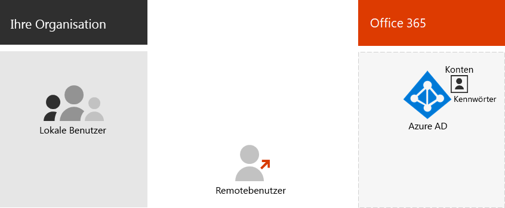
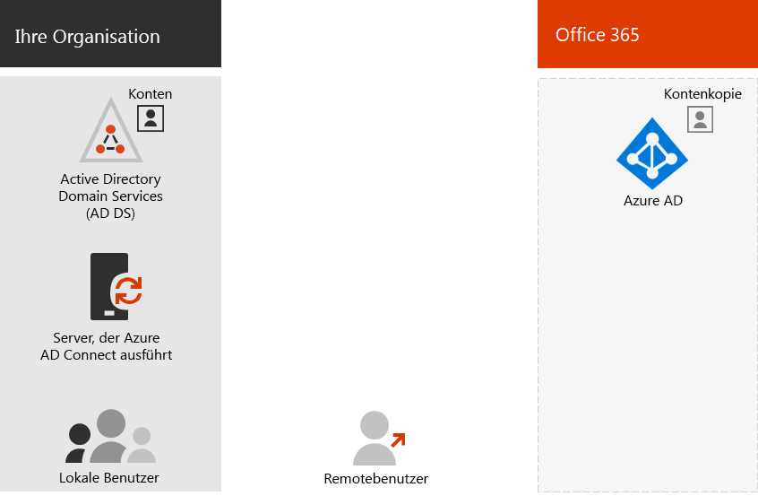

# Office 365-Identitätsmodelle und Azure Active Directory

*Dieser Artikel gilt sowohl für Office 365 Enterprise als auch Microsoft 365 Enterprise*.

Office 365 verwendet Azure Active Directory (Azure AD), einen cloudbasierten Benutzeridentitäts- und Authentifizierungsdienst, der in Ihrem Office 365-Abonnement enthalten ist, um Identitäten und Authentifizierung für Office 365 zu verwalten. Die ordnungsgemäße Konfiguration Ihrer Identitätsinfrastruktur ist entscheidend für die Verwaltung des Office 365-Benutzerzugriffs und der Berechtigungen für Ihre Organisation.

Bevor Sie beginnen, schauen Sie sich dieses Video an, um eine Übersicht über die Identitätsmodelle und Authentifizierung für Office 365 und Microsoft 365 zu erhalten.

> [!VIDEO https://www.microsoft.com/videoplayer/embed/RE2Pjwu]

Die erste Entscheidung, die Sie bei der Planung treffen müssen, betrifft das Office 365-Identitätsmodell.

## Office 365-Identitätsmodelle

Um Benutzerkonten zu planen, müssen Sie zunächst die beiden Identitätsmodelle in Microsoft 365 verstehen. Sie können die Identitäten Ihrer Organisation nur in der Cloud verwalten, oder Sie können Ihre lokalen AD DS-Identitäten (Active Directory Domain Services) verwalten und diese zur Authentifizierung verwenden, wenn Benutzer auf Microsoft 365-Clouddienste zugreifen.  

Nachfolgend finden Sie die beiden Identitätstypen sowie deren beste Anwendungsfälle und Vorteile.

|||
|:-------|:-----|:-----|
|  | **Reine Cloudidentität** | **Hybrididentität** |
| **Definition** | Ein Benutzerkonto ist nur im Azure Active Directory-Mandanten (Azure AD) für Ihr Microsoft 365-Abonnement vorhanden. | Ein Benutzerkonto ist in AD DS vorhanden, und eine Kopie befindet sich auch im Azure AD-Mandanten für Ihr Microsoft 365-Abonnement. Das Benutzerkonto in Azure AD enthält möglicherweise auch eine Hashversion des Kennworts für das Benutzerkonto. |
| **Authentifizierung von Benutzeranmeldeinformationen durch Microsoft 365** | Der Azure AD-Mandant für Ihr Microsoft 365-Abonnement führt die Authentifizierung mit dem Cloudidentitätskonto durch. | Der Azure AD-Mandant für Ihr Microsoft 365-Abonnement behandelt verarbeitet entweder den Authentifizierungsprozess oder leitet den Benutzer an einen anderen Identitätsanbieter weiter. |
| **Ideal für** | Organisationen, die keinen lokalen AD DS besitzen oder benötigen. | Organisationen, die AD DS oder einen anderen Identitätsanbieter verwenden. |
| **Größter Vorteil** | Einfach zu verwenden. Es sind keine zusätzlichen Verzeichnistools oder Server erforderlich. | Benutzer können dieselben Anmeldeinformationen verwenden, wenn sie auf lokale oder cloudbasierte Ressourcen zugreifen. |
||||

## Reine Cloudidentität

Bei der reinen Cloudidentität werden Benutzerkonten verwendet, die nur in Azure AD vorhanden sind. Cloudidentitäten werden in der Regel von kleinen Organisationen verwendet, die keine lokalen Server haben oder AD DS nicht zum Verwalten lokaler Identitäten verwenden. 

Hier sind die grundlegenden Komponenten der reinen Cloudidentität.
 

Sowohl lokale als auch Remotebenutzer (Onlinebenutzer) verwenden Ihre Azure AD-Benutzerkonten und Kennwörter für den Zugriff auf Office 365-Clouddienste. Azure AD authentifiziert Benutzeranmeldeinformationen basierend auf den gespeicherten Benutzerkonten und Kennwörtern.

### Verwaltung
Da Benutzerkonten nur in Azure AD gespeichert sind, verwalten Sie Cloudidentitäten mit Tools wie dem [Microsoft 365 Admin Center ](https://admin.microsoft.com)und Windows PowerShell mit dem Azure Active Directory PowerShell for Graph-Modul. 

## Hybrididentität

Die Hybrididentität verwendet Konten, die von einem lokalen AD DS stammen und eine Kopie im Azure AD-Mandanten eines Microsoft 365-Abonnements aufweisen. Die meisten Änderungen fließen jedoch nur in eine Richtung. Änderungen, die Sie an AD DS-Benutzerkonten vornehmen, werden mit Ihrer Kopie in Azure AD synchronisiert. Änderungen, die in cloudbasierten Konten in Azure AD vorgenommen wurden, wie z. B. neue Benutzerkonten, werden jedoch nicht mit AD DS synchronisiert.

Azure AD Connect bietet die laufende Kontosynchronisierung. Es wird auf einem lokalen Server ausgeführt, überprüft auf Änderungen in AD DS und leitet diese Änderungen an Azure AD weiter. Azure AD Connect bietet die Möglichkeit zu filtern, welche Konten synchronisiert werden, und ob eine Hashversion der Benutzerkennwörter synchronisiert werden soll; dies wird als „Kennworthashsynchronisierung“ (Password hash synchronization, PHS) bezeichnet.

Wenn Sie die Hybrididentität implementieren, ist Ihr lokales AD DS die autorisierende Quelle für Kontoinformationen. Dies bedeutet, dass Sie Verwaltungsaufgaben hauptsächlich lokal durchführen, die dann mit Azure AD synchronisiert werden. 

Nachfolgend finden Sie die Komponenten der Hybrididentität.

Der Azure AD-Mandant hat eine Kopie der AD DS-Konten. In dieser Konfiguration authentifizieren sich sowohl lokale als auch Remotebenutzer beim Zugriff auf Microsoft 365-Clouddienste bei Azure AD.

>[!Note]
>Sie müssen immer Azure AD Connect verwenden, um Benutzerkonten für die Hybrididentität zu synchronisieren. Sie benötigen die synchronisierten Benutzerkonten in Azure AD, um die Lizenzzuweisung und Gruppenverwaltung durchzuführen, um Berechtigungen zu konfigurieren und um andere Verwaltungsaufgaben auszuführen, die Benutzerkonten umfassen.
>

### Verwaltung

Da die ursprünglichen und autorisierenden Benutzerkonten im lokalen AD DS gespeichert sind, verwalten Sie Ihre Identitäten mit den gleichen Tools wie AD DS, z. B. mit dem Tool „Active Directory-Benutzer und -Computer“. 

Sie verwenden nicht das Microsoft 365 Admin Center oder Windows PowerShell zum Verwalten von synchronisierten Benutzerkonten in Azure AD.

## Nächster Schritt

Weitere Informationen zum rein cloudbasierten Identitätsmodell finden Sie unter [Reine Cloudidentitäten](cloud-only-identities.md).

Wenn Sie das Hybrididentitätsmodell benötigen, lesen Sie die Informationen unter [Verzeichnissynchronisierung](plan-for-directory-synchronization.md).
  

## Videoschulung

Sehen Sie sich den Videokurs [Office 365: Verwalten von Identitäten mithilfe von Azure AD Connect](https://support.office.com/article/90991a1d-c0ab-479a-b413-35c9706f6fed.aspx) an, das Ihnen von LinkedIn Learning bereitgestellt wird.

## Siehe auch

[Übersicht zu Microsoft 365 Enterprise](https://docs.microsoft.com/microsoft-365/enterprise/microsoft-365-overview)
