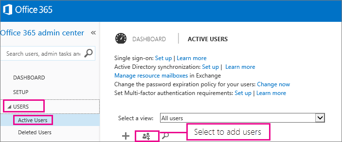

# <a name="add-several-users-at-the-same-time-to-office-365---admin-help"></a>Gleichzeitiges Hinzufügen mehrerer Benutzer zu Office 365 – Administratorhilfe

Jedes Mitglied in Ihrem Team benötigt ein Benutzerkonto, bevor es sich anmelden und auf Office 365-Dienste wie E-Mail und Office zugreifen kann. Wenn das Team viele Personen umfasst, können Sie deren Konten aus einer Excel-Tabelle oder einer anderen, im CSV-Format gespeicherten, Datei gleichzeitig hinzufügen. [Was ist eine CSV-Datei?](add-several-users-at-the-same-time.md#__toc316652088)
  
## <a name="add-multiple-users-to-office-365-in-the-office-365-admin-center"></a>Hinzufügen mehrerer Benutzer in Office 365 im Office 365 Admin Center

1. Melden Sie sich mit Ihrem Geschäfts- oder Schulkonto bei Office 365 an. 
    
2. In the Office 365 admin center, choose **Users** \> **Active users**.
    
    
  
3. Wählen Sie im Dropdownmenü **Mehr** die Option **Mehrere Benutzer importieren** aus.
    
4. Im Bereich **Mehrere Benutzer importieren** können Sie eine CSV-Beispieldatei mit oder ohne eingetragene Beispieldaten optional herunterladen. 
    
    
  
    Ihre Tabelle muss **dieselben Spaltenüberschriften** wie die Beispieltabelle enthalten ("Benutzername", "Vorname" usw.). Wenn Sie die Vorlage verwenden, öffnen Sie sie in einem Textbearbeitungstool, z. B. Editor. Sie sollten nach Möglichkeit alle Daten in Zeile 1 beibehalten und Daten nur in Zeile 2 und die Zeilen darunter eingeben. 
    
    Darüber hinaus muss Ihre Tabelle für jeden Benutzer Werte für den Benutzernamen (wie "berend@contoso.com") und einen Anzeigenamen (wie "Berend Klein") enthalten. 
    
  ```
  User Name,First Name,Last Name,Display Name,Job Title,Department,Office Number,Office Phone,Mobile Phone,Fax,Address,City,State or Province,ZIP or Postal Code,Country or Region
  chris@contoso.com,Chris,Green,Chris Green,IT Manager,Information Technology,123451,123-555-1211,123-555-6641,123-555-9821,1 Microsoft way,Redmond,Wa,98052,United States
  ben@contoso.com,Ben,Andrews,Ben Andrews,IT Manager,Information Technology,123452,123-555-1212,123-555-6642,123-555-9822,1 Microsoft way,Redmond,Wa,98052,United States
  david@contoso.com,David,Longmuir,David Longmuir,IT Manager,Information Technology,123453,123-555-1213,123-555-6643,123-555-9823,1 Microsoft way,Redmond,Wa,98052,United States
  cynthia@contoso.com,Cynthia,Carey,Cynthia Carey,IT Manager,Information Technology,123454,123-555-1214,123-555-6644,123-555-9824,1 Microsoft way,Redmond,Wa,98052,United States
  melissa@contoso.com,Melissa,MacBeth,Melissa MacBeth,IT Manager,Information Technology,123455,123-555-1215,123-555-6645,123-555-9825,1 Microsoft way,Redmond,Wa,98052,United States
  
  ```

5. Geben Sie in dem Feld einen Dateipfad ein, oder wählen Sie **Durchsuchen** aus, um zum Speicherort der CSV-Datei zu navigieren. Wählen Sie dann **Überprüfen** aus.
    
    
  
    Wenn es Probleme mit der Datei gibt, wird eine entsprechende Meldung angezeigt. Sie können auch eine Protokolldatei herunterladen.
    
6. Im Dialogfeld **Benutzeroptionen festlegen** können Sie den Anmeldestatus festlegen und die Produktlizenz auswählen, die allen Benutzern zugewiesen werden soll. 
    
7. Im Dialogfeld **Ergebnisse anzeigen** können Sie auswählen, ob die Ergebnisse an Sie selbst oder an andere Benutzer (Kennwörter im Nur-Text-Format) gesendet werden sollen. Außerdem können Sie sehen, wie viele Benutzer erstellt wurden und ob Sie weitere Lizenzen erwerben müssen, um sie einigen der neuen Benutzer zuzuweisen. 
    
## <a name="watch-the-video"></a>Video ansehen
<a name="bk_preview"> </a>

 Schauen Sie sich ein kurzes Video an, in dem gezeigt wird, wie eine Massenhinzufügung von Benutzern erfolgt. 
  
> [!VIDEO https://www.microsoft.com/videoplayer/embed/f4e7f161-8ae6-4264-a429-9297b539a8de?autoplay=false]
  
## <a name="next-steps"></a>Nächste Schritte
<a name="bk_preview"> </a>

- Nachdem diese Benutzer über Konten verfügen, müssen Sie [office 365 oder office 2016 auf einem PC oder Mac herunterladen und installieren oder neu installieren](https://support.office.com/article/4414eaaf-0478-48be-9c42-23adc4716658). Jede Person in Ihrem Team kann Office 365 auf bis zu fünf PCs oder Macs installieren. 
    
- Jede Person kann auch [Office-Apps und e-Mail auf einem mobilen Gerät](https://support.office.com/article/7dabb6cb-0046-40b6-81fe-767e0b1f014f) auf bis zu 5 Tablets und 5 Handys, wie iPhones, IPads und Android-Telefone und tableTs, einrichten. Hiermit können Office-Dateien von praktisch überall aus bearbeitet werden. 
    
    Eine End-to-End-Liste der Setupschritte finden Sie unter [Einrichten von Office 365 für Unternehmen](https://support.office.com/article/6a3a29a0-e616-4713-99d1-15eda62d04fa) . 
    
## <a name="more-information-about-how-to-add-users-to-office-365"></a>Weitere Informationen dazu, wie Sie Benutzer zu Office 365 hinzufügen
<a name="bk_preview"> </a>

### <a name="not-sure-what-csv-format-is"></a>Was ist eine CSV-Datei?
<a name="__toc316652088"> </a>

Eine CSV-Datei ist eine Datei mit durch Kommas getrennten Werten. Sie können eine Datei wie diese mit einem beliebigen Text-Editor oder Tabellenkalkulationsprogramm wie beispielsweise Excel erstellen oder bearbeiten.
  
Sie können [diese Beispieltabelle](https://www.microsoft.com/en-us/download/details.aspx?id=45485) als Ausgangspunkt herunterladen. Denken Sie daran, dass bei Office 365 in der ersten Zeile Spaltenüberschriften stehen müssen. Ersetzen Sie die Überschriften deshalb nicht durch ein anderes Element. 
  
Speichern Sie die Datei unter einem neuen Namen, und geben Sie das Format "CSV" an.
  

  
Beim Speichern der Datei werden Sie wahrscheinlich darüber informiert, dass einige Features in Ihrer Arbeitsmappe verloren gehen, wenn Sie die Datei im CSV-Format speichern. Dies geht in Ordnung. Klicken Sie auf **Ja**, um den Vorgang fortzusetzen. 
  

  
### <a name="tips-for-formatting-your-spreadsheet"></a>Tipps zum Formatieren Ihrer Tabelle
<a name="__toc314595848"> </a>

- **Benötige ich dieselben Spaltenüberschriften wie in der Beispieltabelle?** Ja. Die erste Zeile der Beispieltabelle enthält die Spaltenüberschriften. Diese Überschriften sind erforderlich. Erstellen Sie für jeden Benutzer, den Sie Office 365 hinzufügen möchten, eine Zeile unter der Überschrift. Wenn Sie eine der Spaltenüberschriften hinzufügen, ändern oder löschen, kann Office 365 Benutzer anhand der Informationen in der Datei möglicherweise nicht erstellen. 
    
- **Was kann ich tun, wenn ich nicht über alle Informationen verfüge, die bei jedem Benutzer erforderlich sind?** Der Benutzername und der Anzeigename sind unbedingt erforderlich; Sie können keinen neuen Benutzer ohne diese Angaben hinzufügen. Falls Ihnen einige der anderen Informationen fehlen, wie beispielsweise das Fax, können Sie ein Leerzeichen plus das von Ihnen verwendete Trennzeichen eingeben und so festlegen, dass das Feld leer bleiben soll. 
    
- ** How small or large can the spreadsheet be? ** The spreadsheet must have at least two rows. One is for the column headings (the user data column label) and one for the user. You cannot have more than 251 rows. If you need to import more than 250 users, you can create more than one spreadsheet. 
    
- ** What languages can I use? ** When you create your spreadsheet, you can enter user data column labels in any language or characters, but you must not change the order of the labels, as shown in the sample. You can then make entries into the fields, using any language or characters, and save your file in a Unicode or UTF-8 format. 
    
- **Was geschieht, wenn ich Benutzer aus verschiedenen Ländern oder Regionen hinzufüge?** Erstellen Sie eine separate Tabelle für jeden Bereich. Sie müssen den Assistenten "Massenhinzufügung von Benutzern" mit jeder Tabelle schrittweise durchlaufen. Geben Sie dabei einen einzigen Standort für alle Benutzer an, die in der Datei, mit der Sie arbeiten, enthalten sind. 
    
- **Bestehen Beschränkungen bei der Anzahl der Zeichen, die ich verwenden kann?** Die folgende Tabelle zeigt die Beschriftungen für Benutzerdatenspalten sowie die maximale Zeichenanzahl für jedes Element der Beispieltabelle. 
    
|**Beschriftung für Benutzerdatenspalte**|**Maximale Zeichenanzahl**|
|:-----|:-----|
|Benutzername (erforderlich)  <br/> |79, einschließlich des at-Zeichens (@), im Format "Name@Domäne.\<#60;Erweiterung\>". Der Aliasname darf maximal 30 Zeichen umfassen und der Domänenname maximal 48 Zeichen.  <br/> |
|Vorname  <br/> |64  <br/> |
|Nachname  <br/> |64  <br/> |
|Anzeigename (erforderlich)  <br/> |256  <br/> |
|Position  <br/> |64  <br/> |
|Abteilung  <br/> |64  <br/> |
|Büronummer  <br/> |128  <br/> |
|Rufnummer  <br/> |64  <br/> |
|Mobiltelefon  <br/> |64  <br/> |
|Fax  <br/> |64  <br/> |
|Adresse  <br/> |1023  <br/> |
|Ort  <br/> |128  <br/> |
|Bundesland oder Kanton  <br/> |128  <br/> |
|PLZ  <br/> |40  <br/> |
|Land oder Region  <br/> |128  <br/> |
   
### <a name="still-having-problems-when-adding-users-to-office-365"></a>Gibt es weiterhin Probleme beim Hinzufügen von Benutzern zu Office 365?

- **Überprüfen Sie sorgfältig, ob die Tabelle richtig formatiert wurde.** Überprüfen Sie, ob die Spaltenüberschriften mit den Überschriften in der Beispieldatei übereinstimmen. Vergewissern Sie sich, dass Sie die Regeln für die maximale Zeichenanzahl eingehalten haben und dass jedes Feld durch ein Trennzeichen getrennt ist. 
    
- ** If you don't see the new users in Office 365 right away, wait a few minutes. ** It can take a little while for changes to go across all the services in Office 365. 
    
## <a name="add-multiple-users-to-office-365-in-the-old-office-365-admin-center"></a>Hinzufügen weiterer Benutzer zu Office 365 im alten Office 365 Admin Center

1. Laden Sie [diese Beispieltabelle](https://www.microsoft.com/en-us/download/details.aspx?id=45485) herunter, und öffnen Sie sie in Excel. 
    
    Ihre Tabelle muss **dieselben Spaltenüberschriften** wie die Beispieltabelle enthalten ("Benutzername", "Vorname" usw.). Wenn Sie die Vorlage verwenden, sollten Sie nach Möglichkeit alle Daten in Zeile 1 beibehalten und Daten nur in Zeile 2 und die Zeilen darunter eingeben. 
    
    Darüber hinaus muss Ihre Tabelle für jeden Benutzer Werte für den Benutzernamen (wie "berend@contoso.com") und einen Anzeigenamen (wie "Berend Klein") enthalten. Wenn andere Felder leer bleiben sollen, geben Sie im jeweiligen Feld ein Leerzeichen plus ein Trennzeichen ein, wie in der nachstehenden Abbildung gezeigt wird. 
    
    
  
    Wenn Teammitglieder in verschiedenen Ländern arbeiten, müssen Sie für die Benutzer in jedem Land eine eigene Tabelle erstellen, beispielsweise eine Tabelle, in der jedes Teammitglied aufgelistet ist, das in den USA arbeitet, und eine andere Tabelle, in der jedes in Japan arbeitende Teammitglied aufgelistet ist. Der Grund für die verschiedenen Tabellen: Die Verfügbarkeit von Office 365 variiert von Region zu Region. 
    
    **Tipp:** Bevor Sie Office 365 viele Benutzer hinzufügen, ist es möglicherweise sinnvoll, diesen Vorgang mithilfe der Beispieltabelle zu üben. Bearbeiten Sie die Beispieltabelle mit Daten für nur ein paar Benutzer (z. B. 5 oder 10), und speichern Sie die Datei unter einem neuen Namen. Führen Sie die in diesem Verfahren beschriebenen Schritte aus, überprüfen Sie die Ergebnisse, löschen Sie dann die neuen Konten, und beginnen Sie erneut. Auf diese Weise können Sie üben, wie Sie sämtliche Daten für die jeweilige Situation bereitstellen. Sehen Sie sich auch die [Tipps zum Formatieren Ihrer Tabelle](add-several-users-at-the-same-time.md#__toc314595848) an.
    
2. Melden Sie sich mit Ihrem Geschäfts- oder Schulkonto bei Office 365 an. 
    
3. Navigieren Sie zum Office 365 Admin Center.
    
4. For people to use Office 365 services, they need to be assigned a license. Before continuing, you might want to check that you have enough licenses for everyone listed in your spreadsheet. Choose **Billing** \> **Subscriptions** to see if you have enough. If you need to buy more licenses, choose ** Change license quantity **. Or, you can run the wizard and assign the licenses you have, then buy more licenses later and rerun the wizard. 
    
5. Wechseln Sie nun zum Assistenten "Massenhinzufügung von Benutzern": Wählen Sie **Benutzer** \> **Aktive Benutzer** aus. Wählen Sie , wie in der nachstehenden Abbildung gezeigt. 
    
    
  
    Der Assistent "Massenhinzufügung von Benutzern" wird angezeigt und führt Sie schrittweise durch den Vorgang zum Hinzufügen einer Benutzergruppe zu Office 365. 
    
6. Geben Sie in Schritt 1 - "CSV-Datei auswählen" - Ihre eigene Tabelle an, wie in der nachstehenden Abbildung gezeigt wird.
    
    
  
7. In Schritt 2 - "Überprüfung" - informiert Sie der Assistent, ob der Inhalt der Tabelle ordnungsgemäß formatiert wurde.
    
    
  
8. Wählen Sie in Schritt 3 - "Einstellungen" - die Option **Zulässig** aus, damit die in Ihrer Tabelle aufgelisteten Personen Office 365 nutzen können. Wählen Sie außerdem das Land aus, in dem diese Personen Office 365 nutzen werden. Denken Sie daran: Wenn einige Personen in Ihrer Organisation Office 365 in einem anderen Land nutzen werden, erstellen Sie eine separate Tabelle mit deren Namen, und führen Sie den Assistenten "Massenhinzufügung von Benutzern" erneut aus, um diese Personen hinzuzufügen. 
    
    
  
9. Auf der Seite "Lizenzen zuweisen" wird angezeigt, wie viele Lizenzen verfügbar sind. 
    
    
  
    Sie können **Weitere Lizenzen erwerben** auswählen, verlassen dann allerdings automatisch den Assistenten "Massenhinzufügung von Benutzern" und wechseln im Office 365 Admin Center zu **Abrechnung**. Nachdem Sie weitere Lizenzen erworben haben, müssen Sie ein paar Minuten warten, bis der Auftrag verarbeitet wurde. Starten Sie dann den Assistenten "Massenhinzufügung von Benutzern" von Beginn an. 
    
    Wenn Sie keine weiteren Lizenzen erwerben, wird nicht für jede in Ihrer Tabelle aufgelistete Person ein Konto erstellt. 
    
    In diesem Beispiel erwerben wir keine weiteren Lizenzen und setzen den Vorgang mit dem Assistenten "Massenhinzufügung von Benutzern" fort.
    
10. Geben Sie in Schritt 5 - "Ergebnisse senden" - die E-Mail-Adressen der Personen ein, die eine E-Mail-Nachricht erhalten sollen, in der  *alle*  Office 365-Benutzernamen und temporären Kennwörter für die Personen in der Tabelle aufgelistet sind. 
    
    
  
    Die folgende E-Mail-Nachricht wird an alle E-Mail-Adressen gesendet, die Sie in Schritt 5 - "Ergebnisse senden" - angegeben haben. Diese E-Mail teilt mit, welche Konten erstellt wurden. Beachten Sie, dass für einige Personen kein Konto erstellt wurde, weil es nicht genügend Lizenzen gab. 
    
    
  
    Sie können zu einem späteren Zeitpunkt weitere Lizenzen erwerben und dann den Assistenten "Massenhinzufügung von Benutzern" mit derselben Tabelle erneut ausführen. Der Assistent überspringt die Benutzer, die bereits Konten besitzen; im Bericht mit den Ergebnissen steht "Doppelt vorhandener Benutzername". Es bedeutet, dass eine Person mit diesen Informationen bereits ein Konto besitzt.
    
11. Auf der letzten Seite im Assistenten "Massenhinzufügung von Benutzern" werden die Benutzernamen und temporären Kennwörter aufgelistet, wie in der nachstehenden Abbildung zu sehen ist.
    
    
  
12. Nachdem Sie Benutzer zu Office 365 hinzugefügt haben, müssen Sie diesen Ihre Office 365-Kontoinformationen zukommen lassen. Verwenden Sie hierfür Ihre normale Vorgehensweise für die Übermittlung neuer Kennwörter.
    

