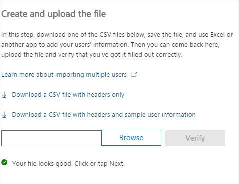

# <a name="add-several-users-at-the-same-time-to-office-365---admin-help"></a><span data-ttu-id="22a79-105">Hinzufügen von vielen Benutzern gleichzeitig zu Office 365 - Admin-Hilfe</span><span class="sxs-lookup"><span data-stu-id="22a79-105">Add several users at the same time to Office 365 - Admin Help</span></span>

<span data-ttu-id="22a79-p102">Jede Person in Ihrem Team benötigt ein Benutzerkonto an, bevor sie anmelden und Zugriff auf Office 365-Dienste, wie e-Mail- und Büro können. Wenn Sie viele Benutzer verfügen, können Sie ihre Konten aus einer Excel-Tabelle oder einer anderen Datei im CSV-Format gespeichert alle gleichzeitig hinzufügen. [Welche CSV-Format nicht sicher ist?](add-several-users-at-the-same-time.md#__toc316652088)</span><span class="sxs-lookup"><span data-stu-id="22a79-p102">Each person on your team needs a user account before they can sign in and access Office 365 services, such as email and Office. If you have a lot of people, you can add their accounts all at once from an Excel spreadsheet or other file saved in CSV format. [Not sure what CSV format is?](add-several-users-at-the-same-time.md#__toc316652088)</span></span>
  
## <a name="add-multiple-users-to-office-365-in-the-office-365-admin-center"></a><span data-ttu-id="22a79-109">Hinzufügen von mehreren Benutzern zu Office 365 in Office 365 Administrationscenter</span><span class="sxs-lookup"><span data-stu-id="22a79-109">Add multiple users to Office 365 in the Office 365 admin center</span></span>

1. <span data-ttu-id="22a79-110">Melden Sie sich mit Ihrem Geschäfts- oder Schulkonto bei Office 365 an.</span><span class="sxs-lookup"><span data-stu-id="22a79-110">Sign in to Office 365 with your work or school account.</span></span> 
    
2. <span data-ttu-id="22a79-111">Wählen Sie im Office 365 Administrationscenter **Benutzer** \> **aktive Benutzer**.</span><span class="sxs-lookup"><span data-stu-id="22a79-111">In the Office 365 admin center, choose **Users** \> **Active users**.</span></span>
    
    
  
3. <span data-ttu-id="22a79-113">Wählen Sie in der **Weitere** Dropdown-Liste **Importieren Sie mehrere Benutzer**aus.</span><span class="sxs-lookup"><span data-stu-id="22a79-113">In the **More** drop-down, choose **Import multiple users**.</span></span>
    
4. <span data-ttu-id="22a79-114">Klicken Sie im Bereich **mehrere Benutzer importieren** können Sie optional eine CSV-Beispieldatei mit oder ohne Beispieldaten ausgefüllt herunterladen.</span><span class="sxs-lookup"><span data-stu-id="22a79-114">On the **Import multiple users** panel, you can optionally download a sample CSV file with or without sample data filled in.</span></span> 
    
    
  
    <span data-ttu-id="22a79-116">Die Kalkulationstabelle muss die **genauen dieselben Spaltenüberschriften** wie das Beispiel eine enthalten (Benutzername, Vorname usw....). Wenn Sie die Vorlage verwenden, öffnen Sie es in einem Text-Bearbeitungstool wie Notepad ein, und berücksichtigen Sie alle Daten in Zeile 1 allein verlassen und nur eingeben von Daten in den Zeilen 2 und unter.</span><span class="sxs-lookup"><span data-stu-id="22a79-116">Your spreadsheet needs to include the **exact same column headings** as the sample one (User Name, First Name, etc...). If you use the template, open it in a text editing tool, like Notepad, and consider leaving all the data in row 1 alone, and only entering data in rows 2 and below.</span></span> 
    
    <span data-ttu-id="22a79-117">Die Kalkulationstabelle muss auch Werte für den Benutzernamen (wie bob@contoso.com) und einen Anzeigenamen für jeden Benutzer (wie Bob Kelly) enthalten.</span><span class="sxs-lookup"><span data-stu-id="22a79-117">Your spreadsheet also needs to include values for the user name (like bob@contoso.com) and a display name (like Bob Kelly) for each user.</span></span> 
    
  ```
  User Name,First Name,Last Name,Display Name,Job Title,Department,Office Number,Office Phone,Mobile Phone,Fax,Address,City,State or Province,ZIP or Postal Code,Country or Region
  chris@contoso.com,Chris,Green,Chris Green,IT Manager,Information Technology,123451,123-555-1211,123-555-6641,123-555-9821,1 Microsoft way,Redmond,Wa,98052,United States
  ben@contoso.com,Ben,Andrews,Ben Andrews,IT Manager,Information Technology,123452,123-555-1212,123-555-6642,123-555-9822,1 Microsoft way,Redmond,Wa,98052,United States
  david@contoso.com,David,Longmuir,David Longmuir,IT Manager,Information Technology,123453,123-555-1213,123-555-6643,123-555-9823,1 Microsoft way,Redmond,Wa,98052,United States
  cynthia@contoso.com,Cynthia,Carey,Cynthia Carey,IT Manager,Information Technology,123454,123-555-1214,123-555-6644,123-555-9824,1 Microsoft way,Redmond,Wa,98052,United States
  melissa@contoso.com,Melissa,MacBeth,Melissa MacBeth,IT Manager,Information Technology,123455,123-555-1215,123-555-6645,123-555-9825,1 Microsoft way,Redmond,Wa,98052,United States
  
  ```

5. <span data-ttu-id="22a79-118">Geben Sie einen Pfad in das Feld ein, oder wählen Sie **Durchsuchen** , navigieren Sie zum Speicherort CSV-Datei, und wählen **Überprüfen**.</span><span class="sxs-lookup"><span data-stu-id="22a79-118">Enter a file path into the box, or choose **Browse** to browse to the CSV file location, then choose **Verify**.</span></span>
    
    
  
    <span data-ttu-id="22a79-p103">Wenn Probleme mit der Datei vorhanden sind, wird das Problem in der Systemsteuerung angezeigt. Sie können auch eine Protokolldatei herunterladen.</span><span class="sxs-lookup"><span data-stu-id="22a79-p103">If there are problems with the file, the problem is displayed in the panel. You can also download a log file.</span></span>
    
6. <span data-ttu-id="22a79-122">**Festlegen von Benutzeroptionen für** im Dialogfeld können Sie festlegen der Anmeldestatus und auswählen die-Lizenz, die allen Benutzern zugewiesen werden.</span><span class="sxs-lookup"><span data-stu-id="22a79-122">On the **Set user options** dialog you can set the sign-in status and choose the product license that will be assigned to all users.</span></span> 
    
7. <span data-ttu-id="22a79-123">Klicken Sie im Dialogfeld **Ansicht das Ergebnis** die Möglichkeit, sendet die Ergebnisse auf sich selbst oder andere Benutzer (Kennwörter werden im nur-Text), und Sie können sehen, wie viele Benutzer erstellt wurden, und einige der neuen Benutzer zuweisen weitere Lizenzen erwerben möchten.</span><span class="sxs-lookup"><span data-stu-id="22a79-123">On the **View your result** dialog you can choose to send the results to either yourself or other users (passwords will be in plain text) and you can see how many users were created, and if you need to purchase more licenses to assign to some of the new users.</span></span> 
    
## <a name="watch-the-video"></a><span data-ttu-id="22a79-124">Video ansehen</span><span class="sxs-lookup"><span data-stu-id="22a79-124">Watch the video</span></span>
<span data-ttu-id="22a79-125"><a name="bk_preview"> </a></span><span class="sxs-lookup"><span data-stu-id="22a79-125"></span></span>

 <span data-ttu-id="22a79-126">Sehen Sie sich ein kurzes Video, das Sie in Massen veranschaulicht Benutzer hinzufügen.</span><span class="sxs-lookup"><span data-stu-id="22a79-126">Watch a short video that shows you how to bulk add users.</span></span> 
  
> [!VIDEO https://www.microsoft.com/videoplayer/embed/f4e7f161-8ae6-4264-a429-9297b539a8de?autoplay=false]
  
## <a name="next-steps"></a><span data-ttu-id="22a79-127">Nächste Schritte</span><span class="sxs-lookup"><span data-stu-id="22a79-127">Next steps</span></span>
<span data-ttu-id="22a79-128"><a name="bk_preview"> </a></span><span class="sxs-lookup"><span data-stu-id="22a79-128"></span></span>

- <span data-ttu-id="22a79-p104">Nun, diese Personen Konten haben, müssen sie [herunterladen und installieren, oder installieren Sie Office 365 oder Office 2016 auf einem PC oder Mac neu](https://support.office.com/article/4414eaaf-0478-48be-9c42-23adc4716658). Jede Person in Ihrem Team kann Office 365 für bis zu 5 PCs oder Macs installieren.</span><span class="sxs-lookup"><span data-stu-id="22a79-p104">Now that these people have accounts, they need to [Download and install or reinstall Office 365 or Office 2016 on a PC or Mac](https://support.office.com/article/4414eaaf-0478-48be-9c42-23adc4716658). Each person on your team can install Office 365 on up to 5 PCs or Macs.</span></span> 
    
- <span data-ttu-id="22a79-p105">Jede Person kann auch die [Office-apps und e-Mail auf einem mobilen Gerät einrichten](https://support.office.com/article/7dabb6cb-0046-40b6-81fe-767e0b1f014f) auf bis zu 5 Tablets und 5-Telefone wie iPhones, iPads, und Android-Telefonen und Tablets. Auf diese Weise können sie Office-Dateien unabhängig vom Standort bearbeiten.</span><span class="sxs-lookup"><span data-stu-id="22a79-p105">Each person can also [Set up Office apps and email on a mobile device](https://support.office.com/article/7dabb6cb-0046-40b6-81fe-767e0b1f014f) on up to 5 tablets and 5 phones, such as iPhones, iPads, and Android phones and tablets. This way they can edit Office files from anywhere.</span></span> 
    
    <span data-ttu-id="22a79-133">Ein End-to-End-Liste der Setup-Schritte finden Sie unter [Einrichten von Office 365 für Unternehmen](https://support.office.com/article/6a3a29a0-e616-4713-99d1-15eda62d04fa) .</span><span class="sxs-lookup"><span data-stu-id="22a79-133">See [Set up Office 365 for business](https://support.office.com/article/6a3a29a0-e616-4713-99d1-15eda62d04fa) for an end-to-end list of the setup steps.</span></span> 
    
## <a name="more-information-about-how-to-add-users-to-office-365"></a><span data-ttu-id="22a79-134">Weitere Informationen zum Hinzufügen von Benutzern zu Office 365</span><span class="sxs-lookup"><span data-stu-id="22a79-134">More information about how to add users to Office 365</span></span>
<span data-ttu-id="22a79-135"><a name="bk_preview"> </a></span><span class="sxs-lookup"><span data-stu-id="22a79-135"></span></span>

### <a name="not-sure-what-csv-format-is"></a><span data-ttu-id="22a79-136">Welche CSV-Format wissen nicht ist?</span><span class="sxs-lookup"><span data-stu-id="22a79-136">Not sure what CSV format is?</span></span>
<span data-ttu-id="22a79-137"><a name="__toc316652088"> </a></span><span class="sxs-lookup"><span data-stu-id="22a79-137"></span></span>

<span data-ttu-id="22a79-p106">Eine CSV-Datei ist eine Datei mit kommagetrennten Werten. Sie können erstellen oder Bearbeiten einer Datei wie folgt einen beliebigen Text-Editor oder short_Excel2007, wie Excel.</span><span class="sxs-lookup"><span data-stu-id="22a79-p106">A CSV file is a file with comma separated values. You can create or edit a file like this with any text editor or spreadsheet program, such as Excel.</span></span>
  
<span data-ttu-id="22a79-p107">Sie können [Dieses Beispiel Kalkulationstabelle](https://www.microsoft.com/en-us/download/details.aspx?id=45485) als Ausgangspunkt herunterladen. Denken Sie daran, dass Office 365 erfordert, dass die Spaltenüberschriften in der ersten Zeile sie daher durch einen anderen Suchbegriff ersetzen nicht.</span><span class="sxs-lookup"><span data-stu-id="22a79-p107">You can download [this sample spreadsheet](https://www.microsoft.com/en-us/download/details.aspx?id=45485) as a starting point. Remember that Office 365 requires column headings in the first row so don't replace them with something else.</span></span> 
  
<span data-ttu-id="22a79-142">Speichern Sie die Datei unter einem neuen Namen ein, und geben Sie CSV-Format.</span><span class="sxs-lookup"><span data-stu-id="22a79-142">Save the file with a new name, and specify CSV format.</span></span>
  

  
<span data-ttu-id="22a79-p108">Wenn Sie die Datei speichern, erhalten Sie, dass einige Features in Ihrer Arbeitsmappe verloren gehen, wenn Sie die Datei im CSV-Format speichern wahrscheinlich eine Aufforderung. Dies ist zulässig. Klicken Sie auf **Ja,** um den Vorgang fortzusetzen.</span><span class="sxs-lookup"><span data-stu-id="22a79-p108">When you save the file, you'll probably get a prompt that some features in your workbook will be lost if you save the file in CSV format. This is okay. Click **Yes** to continue.</span></span> 
  

  
### <a name="tips-for-formatting-your-spreadsheet"></a><span data-ttu-id="22a79-148">Tipps zum Formatieren der Kalkulationstabelle</span><span class="sxs-lookup"><span data-stu-id="22a79-148">Tips for formatting your spreadsheet</span></span>
<span data-ttu-id="22a79-149"><a name="__toc314595848"> </a></span><span class="sxs-lookup"><span data-stu-id="22a79-149"></span></span>

- <span data-ttu-id="22a79-p109">**Benötige ich dieselben Spaltenüberschriften wie in der Beispiel-Kalkulationstabelle?** Ja. Die Beispieltabelle enthält Spaltenüberschriften in der ersten Zeile. Diese Überschriften sind erforderlich. Erstellen Sie für jeden Benutzer, den Sie zu Office 365 hinzufügen möchten eine Zeile unter der Überschrift. Wenn Sie hinzufügen, ändern oder löschen Sie die Spaltenüberschriften, Office 365 zum Erstellen von Benutzern aus den Informationen in der Datei möglicherweise nicht.</span><span class="sxs-lookup"><span data-stu-id="22a79-p109">**Do I need the same column headings as in the sample spreadsheet?** Yes. The sample spreadsheet contains column headings in the first row. These headings are required. For each user you want to add to Office 365, create a row under the heading. If you add, change, or delete any of the column headings, Office 365 might not be able to create users from the information in the file.</span></span> 
    
- <span data-ttu-id="22a79-p110">**Was passiert, wenn ich alle Informationen für jeden Benutzer erforderliche besitzen?** Den Benutzernamen und den Anzeigenamen sind erforderlich, und kann nicht zum Hinzufügen eines neuen Benutzers ohne diese Informationen. Wenn Sie einige der anderen Informationen, wie das Fax besitzen können Sie ein Leerzeichen plus ein Komma verwenden, um anzugeben, dass das Feld leer bleiben soll.</span><span class="sxs-lookup"><span data-stu-id="22a79-p110">**What if I don't have all the information required for each user?** The user name and display name are required, and you cannot add a new user without this information. If you don't have some of the other information, such as the fax, you can use a space plus a comma to indicate that the field should remain blank.</span></span> 
    
- <span data-ttu-id="22a79-p111">** Sein wie kleinen oder großen kann die Kalkulationstabelle? ** Die Kalkulationstabelle muss mindestens zwei Zeilen haben. Eine ist für die Spaltenüberschriften (die Benutzer Spalte Beschriftung) und einen für den Benutzer. Sie können nicht mehr als 251 Zeilen haben. Wenn Sie mehr als 250 Benutzern importieren möchten, können Sie mehr als eine Kalkulationstabelle erstellen.</span><span class="sxs-lookup"><span data-stu-id="22a79-p111">** How small or large can the spreadsheet be? ** The spreadsheet must have at least two rows. One is for the column headings (the user data column label) and one for the user. You cannot have more than 251 rows. If you need to import more than 250 users, you can create more than one spreadsheet.</span></span> 
    
- <span data-ttu-id="22a79-p112">** Verwenden welche Sprachen kann ich? ** Wenn Sie die Kalkulationstabelle erstellt haben, können Sie Benutzer Daten Spaltenüberschriften in allen Sprachen oder Zeichen eingeben, aber Sie müssen die Reihenfolge der Etiketten, nicht ändern, wie im Beispiel dargestellt. Sie können dann Einträge in die Felder, stellen Sie mithilfe eines beliebigen Sprache oder Zeichen, und speichern Sie die Datei im Unicode- oder UTF-8-Format.</span><span class="sxs-lookup"><span data-stu-id="22a79-p112">** What languages can I use? ** When you create your spreadsheet, you can enter user data column labels in any language or characters, but you must not change the order of the labels, as shown in the sample. You can then make entries into the fields, using any language or characters, and save your file in a Unicode or UTF-8 format.</span></span> 
    
- <span data-ttu-id="22a79-p113">**Was passiert, wenn ich Benutzer aus verschiedenen Ländern oder Regionen hinzufügen bin?** Erstellen Sie ein separates Arbeitsblatt für jeden Bereich. Sie müssen das gleichzeitige schrittweise Benutzer Assistenten zum Hinzufügen von welche einzelnen Kalkulationstabelle, wenn Sie für einen einzelnen Standort aller Benutzer in der Datei enthalten, die Sie mit arbeiten.</span><span class="sxs-lookup"><span data-stu-id="22a79-p113">**What if I'm adding users from different countries or regions?** Create a separate spreadsheet for each area. You'll need to step through the Bulk add users wizard which each spreadsheet, giving a single location of all users included in the file that you're working with.</span></span> 
    
- <span data-ttu-id="22a79-p114">**Besteht eine Begrenzung für die Anzahl der Zeichen kann ich verwenden?** In der folgenden Tabelle zeigt die Benutzer Daten Spaltenüberschriften und die maximale Zeichenlänge für jede in der Beispiel-Kalkulationstabelle.</span><span class="sxs-lookup"><span data-stu-id="22a79-p114">**Is there a limit to the number of characters I can use?** The following table shows the user data column labels and the maximum character length for each in the sample spreadsheet.</span></span> 
    
|<span data-ttu-id="22a79-172">**Benutzer Spalte Beschriftung**</span><span class="sxs-lookup"><span data-stu-id="22a79-172">**User data column label**</span></span>|<span data-ttu-id="22a79-173">**Maximale Zeichenlänge**</span><span class="sxs-lookup"><span data-stu-id="22a79-173">**Maximum character length**</span></span>|
|:-----|:-----|
|<span data-ttu-id="22a79-174">Benutzername (erforderlich)</span><span class="sxs-lookup"><span data-stu-id="22a79-174">User Name (Required)</span></span>  <br/> |<span data-ttu-id="22a79-p115">79 einschließlich das @-Zeichen (@), im Format name@domain. \<Erweiterung\>. Der Alias des Benutzers darf 30 Zeichen nicht überschreiten, und der Domänenname darf 48 Zeichen nicht überschreiten.</span><span class="sxs-lookup"><span data-stu-id="22a79-p115">79 including the at sign (@), in the format name@domain.\<extension\>. The user's alias cannot exceed 30 characters, and the domain name cannot exceed 48 characters.</span></span>  <br/> |
|<span data-ttu-id="22a79-177">Vorname</span><span class="sxs-lookup"><span data-stu-id="22a79-177">First Name</span></span>  <br/> |<span data-ttu-id="22a79-178">64</span><span class="sxs-lookup"><span data-stu-id="22a79-178">64</span></span>  <br/> |
|<span data-ttu-id="22a79-179">Nachname</span><span class="sxs-lookup"><span data-stu-id="22a79-179">Last Name</span></span>  <br/> |<span data-ttu-id="22a79-180">64</span><span class="sxs-lookup"><span data-stu-id="22a79-180">64</span></span>  <br/> |
|<span data-ttu-id="22a79-181">Anzeigename (erforderlich)</span><span class="sxs-lookup"><span data-stu-id="22a79-181">Display Name (required)</span></span>  <br/> |<span data-ttu-id="22a79-182">256</span><span class="sxs-lookup"><span data-stu-id="22a79-182">256</span></span>  <br/> |
|<span data-ttu-id="22a79-183">Position</span><span class="sxs-lookup"><span data-stu-id="22a79-183">Job Title</span></span>  <br/> |<span data-ttu-id="22a79-184">64</span><span class="sxs-lookup"><span data-stu-id="22a79-184">64</span></span>  <br/> |
|<span data-ttu-id="22a79-185">Abteilung</span><span class="sxs-lookup"><span data-stu-id="22a79-185">Department</span></span>  <br/> |<span data-ttu-id="22a79-186">64</span><span class="sxs-lookup"><span data-stu-id="22a79-186">64</span></span>  <br/> |
|<span data-ttu-id="22a79-187">Geschäftliche Rufnummer</span><span class="sxs-lookup"><span data-stu-id="22a79-187">Office Number</span></span>  <br/> |<span data-ttu-id="22a79-188">128</span><span class="sxs-lookup"><span data-stu-id="22a79-188">128</span></span>  <br/> |
|<span data-ttu-id="22a79-189">Telefon (geschäftlich)</span><span class="sxs-lookup"><span data-stu-id="22a79-189">Office Phone</span></span>  <br/> |<span data-ttu-id="22a79-190">64</span><span class="sxs-lookup"><span data-stu-id="22a79-190">64</span></span>  <br/> |
|<span data-ttu-id="22a79-191">Mobiltelefon</span><span class="sxs-lookup"><span data-stu-id="22a79-191">Mobile Phone</span></span>  <br/> |<span data-ttu-id="22a79-192">64</span><span class="sxs-lookup"><span data-stu-id="22a79-192">64</span></span>  <br/> |
|<span data-ttu-id="22a79-193">Fax-</span><span class="sxs-lookup"><span data-stu-id="22a79-193">Fax</span></span>  <br/> |<span data-ttu-id="22a79-194">64</span><span class="sxs-lookup"><span data-stu-id="22a79-194">64</span></span>  <br/> |
|<span data-ttu-id="22a79-195">Adresse</span><span class="sxs-lookup"><span data-stu-id="22a79-195">Address</span></span>  <br/> |<span data-ttu-id="22a79-196">1023</span><span class="sxs-lookup"><span data-stu-id="22a79-196">1023</span></span>  <br/> |
|<span data-ttu-id="22a79-197">Stadt</span><span class="sxs-lookup"><span data-stu-id="22a79-197">City</span></span>  <br/> |<span data-ttu-id="22a79-198">128</span><span class="sxs-lookup"><span data-stu-id="22a79-198">128</span></span>  <br/> |
|<span data-ttu-id="22a79-199">Bundesland oder Kanton</span><span class="sxs-lookup"><span data-stu-id="22a79-199">State or Province</span></span>  <br/> |<span data-ttu-id="22a79-200">128</span><span class="sxs-lookup"><span data-stu-id="22a79-200">128</span></span>  <br/> |
|<span data-ttu-id="22a79-201">Postleitzahl</span><span class="sxs-lookup"><span data-stu-id="22a79-201">ZIP or Postal Code</span></span>  <br/> |<span data-ttu-id="22a79-202">40</span><span class="sxs-lookup"><span data-stu-id="22a79-202">40</span></span>  <br/> |
|<span data-ttu-id="22a79-203">Land oder Region</span><span class="sxs-lookup"><span data-stu-id="22a79-203">Country or Region</span></span>  <br/> |<span data-ttu-id="22a79-204">128</span><span class="sxs-lookup"><span data-stu-id="22a79-204">128</span></span>  <br/> |
   
### <a name="still-having-problems-when-adding-users-to-office-365"></a><span data-ttu-id="22a79-205">Probleme beim Hinzufügen von Benutzern zu Office 365?</span><span class="sxs-lookup"><span data-stu-id="22a79-205">Still having problems when adding users to Office 365?</span></span>

- <span data-ttu-id="22a79-p116">**Überprüfen Sie, dass die Kalkulationstabelle ordnungsgemäß formatiert ist.** Überprüfen Sie die Spaltenüberschriften, um sicherzustellen, dass sie die Überschriften in der Beispieldatei übereinstimmen. Stellen Sie sicher, dass Sie die Regeln für Zeichen Länge einhalten und, die jedes Feld wird durch ein Komma getrennt.</span><span class="sxs-lookup"><span data-stu-id="22a79-p116">**Double-check that the spreadsheet is formatted correctly.** Check the column headings to make sure they match the headings in the sample file. Make sure you're following the rules for character lengths and that each field is separated by a comma.</span></span> 
    
- <span data-ttu-id="22a79-p117">** Wenn Sie sofort die neuen Benutzer in Office 365 sehen, warten Sie einige Minuten. ** Während bei Änderungen in allen Diensten in Office 365 wechseln kann es etwas dauern.</span><span class="sxs-lookup"><span data-stu-id="22a79-p117">** If you don't see the new users in Office 365 right away, wait a few minutes. ** It can take a little while for changes to go across all the services in Office 365.</span></span> 
    
## <a name="add-multiple-users-to-office-365-in-the-old-office-365-admin-center"></a><span data-ttu-id="22a79-211">Hinzufügen von mehreren Benutzern zu Office 365 in der alten Office 365-Verwaltungskonsole</span><span class="sxs-lookup"><span data-stu-id="22a79-211">Add multiple users to Office 365 in the old Office 365 admin center</span></span>

1. <span data-ttu-id="22a79-212">Herunterladen Sie [in diesem Beispiel Kalkulationstabelle](https://www.microsoft.com/en-us/download/details.aspx?id=45485) , und öffnen sie in Excel.</span><span class="sxs-lookup"><span data-stu-id="22a79-212">Download [this sample spreadsheet](https://www.microsoft.com/en-us/download/details.aspx?id=45485) and open it in Excel.</span></span> 
    
    <span data-ttu-id="22a79-213">Die Kalkulationstabelle muss die **genauen dieselben Spaltenüberschriften** wie das Beispiel eine enthalten (Benutzername, Vorname usw....). Wenn Sie die Vorlage verwenden, können Sie alle Daten in Zeile 1 allein verlassen und nur eingeben von Daten in den Zeilen 2 und unter.</span><span class="sxs-lookup"><span data-stu-id="22a79-213">Your spreadsheet needs to include the **exact same column headings** as the sample one (User Name, First Name, etc...). If you use the template, consider leaving all the data in row 1 alone, and only entering data in rows 2 and below.</span></span> 
    
    <span data-ttu-id="22a79-p118">Die Kalkulationstabelle muss auch Werte für den Benutzernamen (wie bob@contoso.com) und einen Anzeigenamen für jeden Benutzer (wie Bob Kelly) enthalten. Um die anderen Felder leer lassen, geben Sie ein Leerzeichen plus ein Komma im Feld wie in der folgenden Abbildung dargestellt.</span><span class="sxs-lookup"><span data-stu-id="22a79-p118">Your spreadsheet also needs to include values for the user name (like bob@contoso.com) and a display name (like Bob Kelly) for each user. To leave other fields blank, enter a space plus a comma in the field as shown in the following figure.</span></span> 
    
    
  
    <span data-ttu-id="22a79-p119">Wenn Sie Personen arbeiten in verschiedenen Ländern haben, müssen Sie eine Kalkulationstabelle für Benutzer in jedem Land erstellen. Beispielsweise eine Tabelle, aufgeführt sind alle Personen, die in den USA arbeitet und ein weiteres, die alle auflistet, die in Japan arbeitet. Dies ist, da die Verfügbarkeit von Office 365-Diensten nach Region variiert.</span><span class="sxs-lookup"><span data-stu-id="22a79-p119">If you have people working in different countries, you'll need to create one spreadsheet for users in each country. For example, one spreadsheet that lists everyone who works in the US, and another that lists everyone who works in Japan. This is because the availability of Office 365 services varies by region.</span></span> 
    
    <span data-ttu-id="22a79-p120">**Tipp:** Bevor Sie Office 365 viele Benutzer hinzugefügt haben, sollten Sie zum Üben mit dem Beispiel-Kalkulationstabelle. Bearbeiten Sie die Beispiel-Arbeitsblatt mit Daten für wenige Benutzer, sagen Sie 5 oder 10 und speichern Sie die Datei unter einem neuen Namen. In diesem Verfahren beschriebenen Schritte führen Sie aus, überprüfen Sie die Ergebnisse löschen Sie die neuen Konten, und starten Sie über erneut. Auf diese Weise können Sie üben, alle Daten rechts für Ihre Situation abgerufen. [Tipps zum Formatieren der Kalkulationstabelle](add-several-users-at-the-same-time.md#__toc314595848)wird auch auschecken.</span><span class="sxs-lookup"><span data-stu-id="22a79-p120">**Tip:** Before you add many users to Office 365, you might want to practice with the sample spreadsheet. For example, edit the sample spreadsheet with data for a few of your users, say 5 or 10, and save the file with a new name. Run through steps described in this procedure, check the results, and then delete the new accounts and start over again. This way you can practice getting all of the data right for your situation. Also check out [Tips for formatting your spreadsheet](add-several-users-at-the-same-time.md#__toc314595848).</span></span>
    
2. <span data-ttu-id="22a79-225">Melden Sie sich mit Ihrem Geschäfts- oder Schulkonto bei Office 365 an.</span><span class="sxs-lookup"><span data-stu-id="22a79-225">Sign in to Office 365 with your work or school account.</span></span> 
    
3. <span data-ttu-id="22a79-226">Navigieren Sie zum Office 365 Admin Center.</span><span class="sxs-lookup"><span data-stu-id="22a79-226">Go to the Office 365 admin center.</span></span>
    
4. <span data-ttu-id="22a79-p121">Für Benutzer Office 365-Dienste verwenden müssen sie eine Lizenz zugewiesen werden. Bevor Sie fortfahren sollten Sie überprüfen Sie, ob genügend Lizenzen für alle Benutzer in der Tabelle aufgeführt. Wählen Sie **Abrechnung** \> **Abonnements** , um festzustellen, ob Sie über genügend verfügen. Wenn Sie weitere Lizenzen erwerben möchten, wählen Sie ** Lizenz Menge ändern **. Alternativ können Sie den Assistenten ausführen und zuweisen die Lizenzen haben, und klicken Sie dann später auf mehr Lizenzen kaufen und den Assistenten erneut aus.</span><span class="sxs-lookup"><span data-stu-id="22a79-p121">For people to use Office 365 services, they need to be assigned a license. Before continuing, you might want to check that you have enough licenses for everyone listed in your spreadsheet. Choose **Billing** \> **Subscriptions** to see if you have enough. If you need to buy more licenses, choose ** Change license quantity **. Or, you can run the wizard and assign the licenses you have, then buy more licenses later and rerun the wizard.</span></span> 
    
5. <span data-ttu-id="22a79-p122">Jetzt zu wechseln, um das gleichzeitige Benutzer Assistenten zum Hinzufügen von: Wählen Sie **Benutzer** \> **Aktive Benutzer**. Wählen Sie  wie in der folgenden Abbildung dargestellt.</span><span class="sxs-lookup"><span data-stu-id="22a79-p122">Now go to the Bulk add users wizard: choose **Users** \> **Active Users**. Choose  as shown in the following figure.</span></span> 
    
    
  
    <span data-ttu-id="22a79-235">Das gleichzeitige Hinzufügen von Benutzern-Assistent wird angezeigt und führt Sie schrittweise durch eine Gruppe von Benutzern zu Office 365 hinzufügen.</span><span class="sxs-lookup"><span data-stu-id="22a79-235">The Bulk add users wizard appears and steps you through adding a group of users to Office 365.</span></span> 
    
6. <span data-ttu-id="22a79-236">Wählen Sie in Schritt 1: aus einer CSV-Datei, geben Sie Ihre eigenen Kalkulationstabelle an, wie in der folgenden Abbildung dargestellt.</span><span class="sxs-lookup"><span data-stu-id="22a79-236">In Step 1 - Select a CSV file, specify your own spreadsheet as shown in the following figure.</span></span>
    
    
  
7. <span data-ttu-id="22a79-238">In Schritt 2: Überprüfen, teilt Ihnen der Assistent, ob der Inhalt in der Kalkulationstabelle ordnungsgemäß formatiert ist.</span><span class="sxs-lookup"><span data-stu-id="22a79-238">In Step 2 - Verification, the wizard tells you whether the content in the spreadsheet is formatted correctly.</span></span>
    
    
  
8. <span data-ttu-id="22a79-p123">Wählen Sie in Schritt 3 - Einstellungen, **zulässig** , so dass Personen aufgeführt, die in der Kalkulationstabelle Office 365 verwenden können. Wählen Sie auch das Land, in dem diese Personen Office 365 verwendet werden. Denken Sie daran, wenn einige Personen in Ihrer Organisation zu Office 365 in einem anderen Land verwenden, erstellen Sie ein separates Arbeitsblatt mit ihren Namen und das gleichzeitige Ausführen Hinzufügen Benutzer-Assistenten erneut aus, um sie hinzuzufügen.</span><span class="sxs-lookup"><span data-stu-id="22a79-p123">In Step 3 - Settings, choose **Allowed** so that the people listed in your spreadsheet will be able to use Office 365. Also choose the country in which these people will use Office 365. Remember if some people in your organization are going to use Office 365 in a different country, create a separate spreadsheet with their names and run the Bulk add users wizard again to add them.</span></span> 
    
    
  
9. <span data-ttu-id="22a79-244">Die Seite Lizenzen zuweisen des erfahren Sie, wie viele Lizenzen verfügbar sind.</span><span class="sxs-lookup"><span data-stu-id="22a79-244">The assign licenses page tells you how many licenses are available.</span></span> 
    
    
  
    <span data-ttu-id="22a79-p124">Sie können dann **auf mehr Lizenzen kaufen**, aber behalten Sie das gleichzeitige Benutzer Assistenten zum Hinzufügen von und navigieren Sie zu **Abrechnung** im Office 365 Administrationscenter. Nach mehr Lizenzen kaufen, müssen Sie warten, bis ein paar Minuten für den Auftrag verarbeitet werden, und klicken Sie dann Start das gleichzeitige Benutzer Assistenten zum Hinzufügen von vom Anfang.</span><span class="sxs-lookup"><span data-stu-id="22a79-p124">You can choose **Buy more licenses**, but you'll leave the Bulk add users wizard and go to **Billing** in the Office 365 admin center. After buying more licenses, you'll have to wait a few minutes for the order to be processed and then start the Bulk add users wizard from the beginning.</span></span> 
    
    <span data-ttu-id="22a79-248">Wenn Sie nicht mehr Lizenzen kaufen, werden nicht für alle Benutzer in der Tabelle aufgeführten Konten erstellt werden.</span><span class="sxs-lookup"><span data-stu-id="22a79-248">If you don't buy more licenses, accounts won't be created for everyone listed in your spreadsheet.</span></span> 
    
    <span data-ttu-id="22a79-249">In diesem Beispiel wir noch weitere Lizenzen erwerben und fahren Sie mit der Bulk nicht Benutzer Assistent zum Hinzufügen.</span><span class="sxs-lookup"><span data-stu-id="22a79-249">In this example, we don't buy any more licenses and continue with the Bulk add users wizard.</span></span>
    
10. <span data-ttu-id="22a79-250">Schritt 5: Senden Sie der Ergebnisse, und geben Sie die e-Mail-Adressen der Personen, die über eine e-Mail-Nachricht erhalten möchten, in der *Alle* von der Office 365-Benutzernamen und die temporären Kennwörter für Personen, die in der Kalkulationstabelle aufgelistet werden sollen.</span><span class="sxs-lookup"><span data-stu-id="22a79-250">In Step 5 - Send Results, type the email addresses of the people who you want to get an email that lists  *all*  of the Office 365 user names and temporary passwords for the people in the spreadsheet.</span></span> 
    
    
  
    <span data-ttu-id="22a79-p125">Die folgende e-Mail wird an die e-Mail-Adressen gesendet, den Sie in Schritt 5: Senden Ergebnisse angegeben. Diese e-Mail gibt an, welche Konten erstellt wurden. Beachten Sie, dass Konten für einige Personen erstellt wurden nicht, da es waren nicht genügend Lizenzen.</span><span class="sxs-lookup"><span data-stu-id="22a79-p125">The following email is sent to all the email addresses you specified in Step 5 - Send results. This email indicates which accounts were created. Notice that accounts weren't created for some people because there weren't enough licenses.</span></span> 
    
    
  
    <span data-ttu-id="22a79-p126">Sie können weitere Lizenzen später und erneut ausführen, die per Massenvorgang hinzufügen-Assistenten für Benutzer mit derselben Kalkulationstabelle. Der Assistent überspringt die Benutzer, die bereits für Konten; auf den Bericht der Suchergebnisse, wird es sagen Sie "doppelte Benutzername" an, dass eine Person mit diesen Informationen bereits über ein Konto verfügt.</span><span class="sxs-lookup"><span data-stu-id="22a79-p126">You can buy more licenses later and rerun the Bulk add users wizard with the same spreadsheet. The wizard skips over the users that already have accounts; on the results report, it will say "duplicate user name" to indicate someone with that information already has an account.</span></span>
    
11. <span data-ttu-id="22a79-258">Die letzte Seite in der Massen hinzufügen, dass Benutzer-Assistenten für den Benutzernamen und die temporären Kennwörter enthält, wie in der folgenden Abbildung dargestellt.</span><span class="sxs-lookup"><span data-stu-id="22a79-258">The final page in the Bulk add users wizard lists the user names and temporary passwords, as shown in the following figure.</span></span>
    
    
  
12. <span data-ttu-id="22a79-p127">Nachdem Sie Benutzer zu Office 365 hinzugefügt haben, müssen Sie sie über die Office 365-Kontoinformationen zu informieren. Verwenden Sie Ihre normalen Prozess für die Kommunikation neuer Kennwörter an.</span><span class="sxs-lookup"><span data-stu-id="22a79-p127">After you've added users to Office 365, you need to tell them about their Office 365 account information. Use your normal process for communicating new passwords.</span></span>
    

