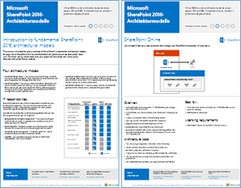
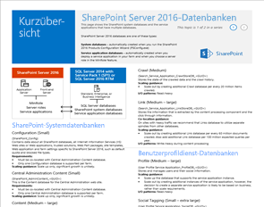
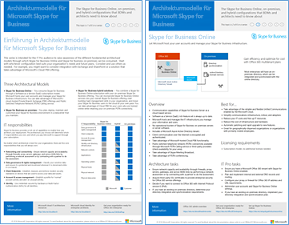
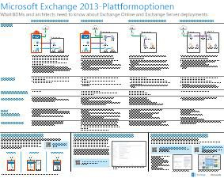
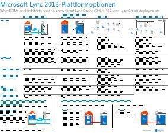

# Architekturmodelle für SharePoint, Exchange, Skype for Business und LyncArchitectural models for SharePoint, Exchange, Skype for Business, and Lync

 **Zusammenfassung:** Rufen Sie die IT-Poster, in denen die Modelle Architektur, Bereitstellung und -Plattformoptionen für SharePoint, Exchange, Skype für Unternehmen und Lync beschrieben.**Summary:** Get the IT posters that describe the architectural models, deployment, and platform options for SharePoint, Exchange, Skype for Business, and Lync.
  
Auf diesen IT-Postern werden die Architekturmodelle und Bereitstellungsoptionen für SharePoint, Exchange, Skype for Business und Lync beschrieben und Entwurfsinformationen für die Bereitstellung von SharePoint in Microsoft Azure bereitgestellt.These IT posters describe the architectural models and deployment options for SharePoint, Exchange, Skype for Business, and Lync, and they provide design information for deploying SharePoint in Microsoft Azure.
  
Mit Office 365 können Sie die Dienste für die Zusammenarbeit und Kommunikation bereitstellen, die, denen Ihre Benutzer als Cloud-basierten Dienst mit vertraut sind. Mit einigen Ausnahmen bleibt die Benutzeroberfläche gleich, ob Sie eine lokale Bereitstellung verwalten oder mithilfe von Office 365. Diese einheitliche Benutzeroberfläche erleichtert weniger unkompliziert entscheiden, wo Sie jede Arbeitslast platzieren und Fragen wie löst:With Office 365, you can provide the collaboration and communication services your users are familiar with as a cloud-based service. With a few exceptions, the user experience remains the same whether you are maintaining an on-premises deployment or using Office 365. This unified user experience makes it less straightforward to decide where to place each workload and raises questions such as:
  
- Wie entscheiden Sie, welche Plattform für Ihre einzelnen Verarbeitungslasten verwendet werden soll?How do you determine which platform option to choose for your individual workloads?
    
- Ist es sinnvoll, Dienste lokal beizubehalten?Does it make sense to keep any service on-premises?
    
- In welchen Szenarien ist eine Hybridbereitstellung geeignet?What is a scenario where a hybrid deployment is appropriate?
    
- Wie passt Microsoft Azure in der Abbildung?How does Microsoft Azure fit in the picture?
    
- Was sind die unterstützten Konfigurationen für Office Server-Arbeitslasten in Azure?What are the supported configurations for Office Server workloads in Azure?
    
> [!TIP]
> Die meisten der Poster auf dieser Seite sind in mehreren Sprachen erhältlich, darunter Chinesisch, Englisch, Französisch, Deutsch, Italienisch, Japanisch, Koreanisch, Portugiesisch, Russisch und Spanisch. Um ein Poster in einer dieser Sprachen herunterzuladen, klicken Sie auf den Link **Weitere Sprachen** für dieses Poster.Most of the posters on this page are available in multiple languages, including Chinese, English, French, German, Italian, Japanese, Korean, Portuguese, Russian, and Spanish. To download a poster in one of these languages, click the **More languages** link for that poster.
  
Geben Sie uns Feedback, indem Sie eien E-Mail senden an [cloudadopt@microsoft.com](mailto:cloudadopt@microsoft.com).Let us know what you think! Send us email at [cloudadopt@microsoft.com](mailto:cloudadopt@microsoft.com). 
  
Diese Seite ist mit den folgenden Postern verknüpft:This page links you to the following posters:
  
- **Architektur modelliert Poster** Diese Ressourcen können Sie um Ihre ideale Plattform und Konfiguration für SharePoint 2016 und Skype für Business 2015 zu bestimmen.**Architectural models posters** You can use these resources to determine your ideal platform and configuration for SharePoint 2016 and Skype for Business 2015.
    
  - [Microsoft SharePoint 2016 architektonische ModelleMicrosoft SharePoint 2016 Architectural Models](architectural-models-for-sharepoint-exchange-skype-for-business-and-lync.md#SP2016_ArchModel)
    
  - [Multi-Geo-Funktionen in OneDrive und SharePoint Online in Office 365Multi-Geo Capabilities in OneDrive and SharePoint Online in Office 365](architectural-models-for-sharepoint-exchange-skype-for-business-and-lync.md#MultiGeoO365ODB)
    
  - [SharePoint Server 2016-DatenbankenSharePoint Server 2016 Databases](architectural-models-for-sharepoint-exchange-skype-for-business-and-lync.md#SP2016_Databases)
    
  - [Microsoft Skype für Business 2015 architektonische ModelleMicrosoft Skype for Business 2015 Architectural Models](architectural-models-for-sharepoint-exchange-skype-for-business-and-lync.md#SfB2015_ArchModel)
    
- **Plattform-Optionen-Poster** Diese Ressourcen können Sie die ideale Plattform und Konfiguration für SharePoint 2013, Exchange 2013 und Lync 2013 bestimmen.**Platform options posters** You can use these resources to determine your ideal platform and configuration for SharePoint 2013, Exchange 2013, and Lync 2013.
    
  - [SharePoint 2013-PlattformoptionenSharePoint 2013 Platform Options](architectural-models-for-sharepoint-exchange-skype-for-business-and-lync.md#SP2013_Options)
    
  - [Exchange 2013-PlattformoptionenExchange 2013 Platform Options](architectural-models-for-sharepoint-exchange-skype-for-business-and-lync.md#Exch2013_options)
    
  - [Lync 2013-PlattformoptionenLync 2013 Platform Options](architectural-models-for-sharepoint-exchange-skype-for-business-and-lync.md#Lync2013_Options)
    
- **SharePoint Server 2013 in Azure Lösungen Poster** Diese IT-Poster können Sie die Planung und Konfiguration für SharePoint Server 2013 Arbeitslasten in Azure Infrastructure Services bestimmen.**SharePoint Server 2013 in Azure solutions posters** You can use these IT posters to determine the design and configuration for SharePoint Server 2013 workloads in Azure infrastructure services.
    
  - [Internetsites in Microsoft Azure mit SharePoint Server 2013Internet sites in Microsoft Azure using SharePoint Server 2013](architectural-models-for-sharepoint-exchange-skype-for-business-and-lync.md#Azure_sharepoint2013)
    
  - [Entwurfsbeispiel: Websites in Microsoft Azure für SharePoint 2013Design sample: Internet sites in Microsoft Azure for SharePoint 2013](architectural-models-for-sharepoint-exchange-skype-for-business-and-lync.md#DesignSampleInternetSites)
    
  - [SharePoint-Notfallwiederherstellung in Microsoft AzureSharePoint Disaster Recovery to Microsoft Azure](architectural-models-for-sharepoint-exchange-skype-for-business-and-lync.md#sharepoint_recovery_Azure)
    
## Poster zu ArchitekturmodellenArchitectural models posters

Diese neuen IT-Poster für SharePoint 2016 und Skype for Business 2015 bieten eine Möglichkeit, die unterschiedlichen Bereitstellungsmethoden in einem einfach zu druckenden Format zu vergleichen. Jedes Poster enthält eine Liste aller zur Verfügung stehenden Konfigurationen oder Plattformoptionen und bietet Ihnen die folgenden Informationen für die einzelnen Optionen:These new IT posters for SharePoint 2016 and Skype for Business 2015 provide a way to compare the various deployment methods in an easy-to-print format. Each poster provides a list of all the configurations or platform options available and gives you the following information for each option:
  
- **Übersicht über die** Eine kurze Zusammenfassung der Plattform, einschließlich eines konzeptionellen Diagramms.**Overview** A brief summary of the platform, including a conceptual diagram.
    
- **Am besten für** Häufige Szenarien, die sich ideal für die Plattform geeignet sind.**Best for** Common scenarios that are ideally suited for the particular platform.
    
- **Lizenzanforderungen** Die Lizenzen, die Sie für die Bereitstellung benötigen.**License requirements** The licenses you need for deployment.
    
- **Architektur von Aufgaben** Die Entscheidungen, die Sie als Architekt treffen müssen.**Architecture tasks** The decisions you need to make as an architect.
    
- **IT-Spezialisten Vorgänge oder Zuständigkeiten** Die täglichen Aufgaben, denen Ihre IT-Mitarbeiter geplant muss.**IT Pro tasks or responsibilities** The daily responsibilities that your IT staff needs to plan for.
    

### Microsoft SharePoint 2016-ArchitekturmodelleMicrosoft SharePoint 2016 Architectural Models

|**Element****Item**|**Beschreibung****Description**|
|:-----|:-----|
|[          ](https://www.microsoft.com/download/details.aspx?id=52650)[          ](https://www.microsoft.com/download/details.aspx?id=52650)   [PDF](https://download.microsoft.com/download/4/F/A/4FA0F94B-EE2F-41DB-A047-D9864FEF41E9/SharePoint2016ArchitecturalModels.pdf)  \| [Visio](https://download.microsoft.com/download/4/F/A/4FA0F94B-EE2F-41DB-A047-D9864FEF41E9/SharePoint2016ArchitecturalModels.vsdx)  \| [Weitere Sprachen](https://www.microsoft.com/download/details.aspx?id=52650)[PDF](https://download.microsoft.com/download/4/F/A/4FA0F94B-EE2F-41DB-A047-D9864FEF41E9/SharePoint2016ArchitecturalModels.pdf)  \| [Visio](https://download.microsoft.com/download/4/F/A/4FA0F94B-EE2F-41DB-A047-D9864FEF41E9/SharePoint2016ArchitecturalModels.vsdx)  \| [More languages](https://www.microsoft.com/download/details.aspx?id=52650)   | Dieses IT-Poster beschreibt SharePoint Online-, Microsoft Azure- und lokale SharePoint-Konfigurationen, die Entscheidungsträger im Unternehmen und Lösungsarchitekten kennen müssen.This IT poster describes the SharePoint Online, Microsoft Azure, and SharePoint on-premises configurations that business decision makers and solutions architects need to know about.    - **SharePoint Online (SaaS)** – SharePoint über eine Software als Modell Subscription Service (SaaS) nutzen.- **SharePoint Online (SaaS)** - Consume SharePoint through a Software as a Service (SaaS) subscription model.   - **SharePoint-Hybrid** - SharePoint-Websites und apps in der Cloud in Ihrem eigenen Tempo verschieben.- **SharePoint Hybrid** - Move your SharePoint sites and apps to the cloud at your own pace.   - **SharePoint in Azure (IaaS)** – Erweitern Ihrer lokalen Umgebung in Microsoft Azure und Bereitstellen von SharePoint 2016 Server vorhanden. (Empfohlen für hohe Verfügbarkeit/Disaster Recovery und Test-/Umgebungen).- **SharePoint in Azure (IaaS)** - You extend your on-premises environment into Microsoft Azure and deploy SharePoint 2016 Servers there. (This is recommended for High Availability/Disaster Recovery and dev/test environments.)   - **SharePoint lokal** - Sie planen, bereitstellen, verwalten und Anpassen Ihrer SharePoint-Umgebung in einem Datacenter, die Sie verwalten.- **SharePoint On-premises** - You plan, deploy, maintain and customize your SharePoint environment in a datacenter that you maintain.   |
   

### Multi-Geo-Funktionen in OneDrive und SharePoint Online in Office 365Multi-Geo Capabilities in OneDrive and SharePoint Online in Office 365

|**Element****Item**|**Beschreibung****Description**|
|:-----|:-----|
|[          ](http://download.microsoft.com/download/0/5/9/0594634F-7893-4201-938A-C2FF2F21B655/Multi-Geo-ODB.pdf)[          ](http://download.microsoft.com/download/0/5/9/0594634F-7893-4201-938A-C2FF2F21B655/Multi-Geo-ODB.pdf)   [PDF](http://download.microsoft.com/download/0/5/9/0594634F-7893-4201-938A-C2FF2F21B655/Multi-Geo-ODB.pdf)  \| [Visio](http://download.microsoft.com/download/0/5/9/0594634F-7893-4201-938A-C2FF2F21B655/Multi-Geo-ODB.vsdx)[PDF](http://download.microsoft.com/download/0/5/9/0594634F-7893-4201-938A-C2FF2F21B655/Multi-Geo-ODB.pdf)  \| [Visio](http://download.microsoft.com/download/0/5/9/0594634F-7893-4201-938A-C2FF2F21B655/Multi-Geo-ODB.vsdx)   | Dieses Poster ist eine einseitige Übersicht über Multi-Geo-Funktionen in OneDrive und SharePoint Online in Office 365. Dieses Modell umfasst:This poster is a one-page overview of Multi-Geo Capabilities in OneDrive and SharePoint Online in Office 365. This model includes:    -Vorteile- Benefits   -Schritte für die Bereitstellung- Steps for deployment   -Eine Beispielkonfiguration- An example configuration     Weitere Informationen zu Multi-Geo-Funktionen in OneDrive und SharePoint Online in Office 365 finden Sie [hier](https://aka.ms/onedrivemultigeo).For more information about Multi-Geo Capabilities in OneDrive and SharePoint Online in Office 365, click [here](https://aka.ms/onedrivemultigeo).    |
   

### SharePoint Server 2016-DatenbankenSharePoint Server 2016 Databases

|**Element****Item**|**Beschreibung****Description**|
|:-----|:-----|
|[          ](https://www.microsoft.com/download/details.aspx?id=55041)[          ](https://www.microsoft.com/download/details.aspx?id=55041)   [PDF](https://download.microsoft.com/download/D/5/D/D5DC1121-8BC5-4953-834F-1B5BB03EB691/DBrefguideSPS2016_tabloid.pdf)  \| [Visio](https://download.microsoft.com/download/D/5/D/D5DC1121-8BC5-4953-834F-1B5BB03EB691/DBrefguideSPS2016_tabloid.vsdx)  \| [Weitere Sprachen](https://www.microsoft.com/download/details.aspx?id=55041)[PDF](https://download.microsoft.com/download/D/5/D/D5DC1121-8BC5-4953-834F-1B5BB03EB691/DBrefguideSPS2016_tabloid.pdf)  \| [Visio](https://download.microsoft.com/download/D/5/D/D5DC1121-8BC5-4953-834F-1B5BB03EB691/DBrefguideSPS2016_tabloid.vsdx)  \| [More languages](https://www.microsoft.com/download/details.aspx?id=55041)   | Dieses IT-Poster ist eine Kurzübersicht für SharePoint Server 2016-Datenbanken. Jede Datenbank weist die folgenden Details auf:This IT poster is a quick reference guide for SharePoint Server 2016 databases. Each database has the following details:    -Größe- Size   -Anweisungen Skalierung- Scaling guidance   -E/a Muster- I/O patterns   -Anforderungen- Requirements     Die erste Seite enthält die SharePoint-Systemdatenbanken und die dienstanwendungen, die mehrere Datenbanken verfügen. Die zweite Seite zeigt alle dienstanwendungen, die einzelne Datenbanken vorhanden sind.The first page contains the SharePoint system databases and the service applications that have multiple databases. The second page shows all of the service applications that have single databases.     Weitere Informationen zu den SharePoint Server 2016-Datenbanken finden Sie unter [Datenbanktypen und Beschreibungen in SharePoint Server 2016](https://technet.microsoft.com/en-us/library/cc678868%28v=office.16%29.aspx)For more information about the SharePoint Server 2016 databases, see [Database types and descriptions in SharePoint Server 2016](https://technet.microsoft.com/en-us/library/cc678868%28v=office.16%29.aspx)   |
   

### Architekturmodelle für Microsoft Skype for Business 2015Microsoft Skype for Business 2015 Architectural Models

|**Element****Item**|**Beschreibung****Description**|
|:-----|:-----|
|[          ](https://www.microsoft.com/download/details.aspx?id=55022)[          ](https://www.microsoft.com/download/details.aspx?id=55022)   [PDF](https://download.microsoft.com/download/7/7/4/7741262C-A60D-41F7-863B-99BF5964FBFE/Skype%20for%20Business%20Architectural%20Models.pdf)  \| [Visio](https://download.microsoft.com/download/7/7/4/7741262C-A60D-41F7-863B-99BF5964FBFE/Skype%20for%20Business%20Architectural%20Models.vsd)  \| [Weitere Sprachen](https://www.microsoft.com/download/details.aspx?id=55022)[PDF](https://download.microsoft.com/download/7/7/4/7741262C-A60D-41F7-863B-99BF5964FBFE/Skype%20for%20Business%20Architectural%20Models.pdf)  \| [Visio](https://download.microsoft.com/download/7/7/4/7741262C-A60D-41F7-863B-99BF5964FBFE/Skype%20for%20Business%20Architectural%20Models.vsd)  \| [More languages](https://www.microsoft.com/download/details.aspx?id=55022)   |Dieses Poster beschreibt die Skype für Online Business, lokalen, Hybrid, cloud PBX und die Integration mit Exchange und SharePoint-Konfigurationen, Entscheidungsträger und Lösungsarchitekten bekannt sein müssen.This poster describes the Skype for Business Online, on-premises, hybrid, cloud PBX, and integration with Exchange and SharePoint configurations that business decision makers and solutions architects need to know about.    Sie sollte für den IT-Experten zur Förderung des Bekanntheitsgrads der verschiedenen grundlegende Architektur Modelle auslösen über die Skype für Business Online und Skype für Unternehmen lokal genutzt werden können.It is intended for the IT Pro audience to raise awareness of the different fundamental architectural models through which Skype for Business Online and Skype for Business on premises can be consumed.   Beginnen Sie mit der günstigsten optimale Konfiguration Anforderungen und Pläne für die Zukunft Ihrer Organisation geeignet ist. Berücksichtigen Sie und verwenden Sie andere Benutzer bei Bedarf. Sie möchten beispielsweise, berücksichtigen die Integration mit Exchange und SharePoint oder eine Lösung, die Microsoft Cloud-Nebenstellenanlage besser nutzt.Start with whichever configuration best suits your organization's needs and future plans. Consider and use others as needed. For example, you might want to consider integration with Exchange and SharePoint or a solution that takes advantage of Microsoft's Cloud PBX offering.    |
   
## Poster zu Plattformoptionen Platform options posters

Diese IT-Poster für SharePoint 2013, Exchange 2013 und Lync 2013 bieten eine Möglichkeit, die unterschiedlichen Bereitstellungsmethoden auf einen Blick auf einem großen Poster zu vergleichen. Jedes Poster enthält eine Liste aller zur Verfügung stehenden Konfigurationen oder Plattformoptionen und bietet Ihnen die folgenden Informationen für die einzelnen Optionen:These IT posters for SharePoint 2013, Exchange 2013, and Lync 2013 provide a way to compare the various deployment methods at a single glance in a large poster format. Each poster provides a list of all the configurations or platform options available and gives you the following information for each option:
  
- **Übersicht über die** Eine kurze Zusammenfassung der Plattform, einschließlich eines konzeptionellen Diagramms.**Overview** A brief summary of the platform, including a conceptual diagram.
    
- **Am besten für** Häufige Szenarien, die sich ideal für die Plattform geeignet sind.**Best for** Common scenarios that are ideally suited for the particular platform.
    
- **Lizenzanforderungen** Die Lizenzen, die Sie für die Bereitstellung benötigen.**License requirements** The licenses you need for deployment.
    
- **Architektur von Aufgaben** Die Entscheidungen, die Sie als Architekt treffen müssen.**Architecture tasks** The decisions you need to make as an architect.
    
- **IT-Spezialisten Vorgänge oder Zuständigkeiten** Die täglichen Aufgaben, denen Ihre IT-Mitarbeiter geplant muss.**IT Pro tasks or responsibilities** The daily responsibilities that your IT staff needs to plan for.
    

## SharePoint 2013-PlattformoptionenSharePoint 2013 Platform Options

****

|**Element****Item**|**Beschreibung****Description**|
|:-----|:-----|
|[          ](https://www.microsoft.com/download/details.aspx?id=40332)[          ](https://www.microsoft.com/download/details.aspx?id=40332)   [PDF](http://go.microsoft.com/fwlink/p/?LinkId=324594)  \| [Visio](https://go.microsoft.com/fwlink/p/?LinkId=324593)  \| [Weitere Sprachen](https://www.microsoft.com/download/details.aspx?id=40332)[PDF](http://go.microsoft.com/fwlink/p/?LinkId=324594)  \| [Visio](https://go.microsoft.com/fwlink/p/?LinkId=324593)  \| [More languages](https://www.microsoft.com/download/details.aspx?id=40332)   |Dieses Modell veranschaulicht für geschäftliche Entscheidungsträger (BDMs) und konstruiert die Plattformoptionen für SharePoint 2013, SharePoint in Office 365, lokaler hybrider mit Office 365 und Azure nur lokale Bereitstellungen. Sie enthält eine Übersicht über jede Architektur, Empfehlungen, lizenzanforderungen und Listen mit Architekt und IT-Spezialisten Aufgaben für jede Plattform. Mehrere SharePoint-Lösungen auf Azure werden hervorgehoben.For business decision makers (BDMs) and architects, this model illustrates the platform options for SharePoint 2013, SharePoint in Office 365, on-premises hybrid with Office 365, Azure, and on-premises only deployments. It includes an overview of each architecture, recommendations, license requirements, and lists of architect and IT Pro tasks for each platform. Several SharePoint solutions on Azure are highlighted.   Dieses Poster, eine Version verfügbaren Text finden Sie unter [zugänglich Diagramm - Microsoft SharePoint 2013-Plattformoptionen](accessible-diagrammicrosoft-sharepoint-2013-platform-options.md).For an accessible text version of this poster, see [Accessible diagram - Microsoft SharePoint 2013 Platform Options](accessible-diagrammicrosoft-sharepoint-2013-platform-options.md).    |
   

## Exchange 2013-PlattformoptionenExchange 2013 Platform Options

****

|**Element****Item**|**Beschreibung****Description**|
|:-----|:-----|
|[          ](https://www.microsoft.com/download/details.aspx?id=42676)[          ](https://www.microsoft.com/download/details.aspx?id=42676)   [PDF](https://go.microsoft.com/fwlink/p/?LinkID=398740)  \| [Visio](https://go.microsoft.com/fwlink/p/?LinkID=398742)  \| [Weitere Sprachen](https://www.microsoft.com/download/details.aspx?id=42676)[PDF](https://go.microsoft.com/fwlink/p/?LinkID=398740)  \| [Visio](https://go.microsoft.com/fwlink/p/?LinkID=398742)  \| [More languages](https://www.microsoft.com/download/details.aspx?id=42676)   |Für BDMs und konstruiert wird dieses Modell beschrieben, die verfügbaren Plattformoptionen für Exchange 2013. Kunden können Exchange Online mit Office 365 und Exchange-Hybridbereitstellung, Exchange Server lokale und gehostete Exchange auswählen. Details des Posters enthält Details der einzelnen architektonische Optionen, einschließlich der optimalen Szenarien für jede lizenzanforderungen und IT-Spezialisten Zuständigkeiten.For BDMs and architects, this model describes the available platform options for Exchange 2013. Customers can choose from Exchange Online with Office 365, Hybrid Exchange, Exchange Server on-premises and Hosted Exchange. The poster includes details of each architectural option, including the most ideal scenarios for each, the license requirements and IT Pro responsibilities.   Dieses Poster, eine Version verfügbaren Text finden Sie unter [zugänglich Diagramm - Microsoft Exchange 2013-Plattformoptionen](accessible-diagrammicrosoft-exchange-2013-platform-options.md).For an accessible text version of this poster, see [Accessible diagram - Microsoft Exchange 2013 Platform Options](accessible-diagrammicrosoft-exchange-2013-platform-options.md).    |
   

## Lync 2013-PlattformoptionenLync 2013 Platform Options

****

|**Element****Item**|**Beschreibung****Description**|
|:-----|:-----|
|[          ](https://www.microsoft.com/download/details.aspx?id=41677)[          ](https://www.microsoft.com/download/details.aspx?id=41677)   [PDF](https://go.microsoft.com/fwlink/p/?LinkID=391837)  \| [Visio](https://go.microsoft.com/fwlink/p/?LinkID=391839)  \| [Weitere Sprachen](https://www.microsoft.com/download/details.aspx?id=41677)[PDF](https://go.microsoft.com/fwlink/p/?LinkID=391837)  \| [Visio](https://go.microsoft.com/fwlink/p/?LinkID=391839)  \| [More languages](https://www.microsoft.com/download/details.aspx?id=41677)   |Dieses Modell beschreibt für geschäftliche Entscheidungsträger und Architekten die verfügbaren Plattformoptionen für Lync 2013. Kunden können zwischen Lync Online mit Office 365, hybridem Lync, lokalem Lync Server und gehostetem Lync wählen. Das IT-Poster enthält Details der einzelnen Architekturoptionen, einschließlich der optimalen Szenarien, sowie zu den Lizenzanforderungen und Zuständigkeiten von IT-Experten.For BDMs and architects, this model describes the available platform options for Lync 2013. Customers can choose from Lync Online with Office 365, Hybrid Lync, Lync Server on-premises and Hosted Lync. The IT poster includes details of each architectural option, including the most ideal scenarios for each, the license requirements and IT Pro responsibilities.    |
   

## Poster zu SharePoint in Azure-LösungenSharePoint in Azure solutions posters

Diese IT-Poster anzeigen Azure-basierter Lösungen mithilfe von SharePoint Server 2013 in einer großen PosterformatThese IT posters show Azure-based solutions using SharePoint Server 2013 in a large poster format.
  

### Internetwebsites in Microsoft Azure mit SharePoint Server 2013Internet sites in Microsoft Azure using SharePoint Server 2013

****

|**Element****Item**|**Beschreibung****Description**|
|:-----|:-----|
|[          ](https://www.microsoft.com/download/details.aspx?id=41992)[          ](https://www.microsoft.com/download/details.aspx?id=41992)   [PDF](https://go.microsoft.com/fwlink/p/?LinkId=392552)  \| [Visio](https://go.microsoft.com/fwlink/p/?LinkId=392551)  \| [Weitere Sprachen](https://www.microsoft.com/download/details.aspx?id=41992)[PDF](https://go.microsoft.com/fwlink/p/?LinkId=392552)  \| [Visio](https://go.microsoft.com/fwlink/p/?LinkId=392551)  \| [More languages](https://www.microsoft.com/download/details.aspx?id=41992)   |Dieses Poster beschreibt wichtige Designaktivitäten und empfohlene architekturentscheidungen für Websites in Azure Internetzugriff. Dieses Poster, eine Version verfügbaren Text finden Sie unter [zugänglich Diagramm - Internet-Websites in Microsoft Azure für SharePoint 2013](accessible-diagraminternet-sites-in-microsoft-azure-for-sharepoint-2013.md).This poster outlines key design activities and recommended architecture choices for Internet-facing sites in Azure. For an accessible text version of this poster, see [Accessible diagram - Internet sites in Microsoft Azure for SharePoint 2013](accessible-diagraminternet-sites-in-microsoft-azure-for-sharepoint-2013.md).     Weitere Informationen finden Sie in den folgenden Artikeln:For more information, see the following articles:     - [Internetsites in Microsoft Azure mit SharePoint Server 2013](internet-sites-in-microsoft-azure-using-sharepoint-server-2013.md)- [Internet Sites in Microsoft Azure using SharePoint Server 2013](internet-sites-in-microsoft-azure-using-sharepoint-server-2013.md)   - [Microsoft Azure-Architekturen für SharePoint 2013](microsoft-azure-architectures-for-sharepoint-2013.md)- [Microsoft Azure Architectures for SharePoint 2013](microsoft-azure-architectures-for-sharepoint-2013.md)   |
   

### Entwurfsbeispiel: Internetwebsites in Microsoft Azure für SharePoint 2013Design sample: Internet sites in Microsoft Azure for SharePoint 2013

****

|**Element****Item**|**Beschreibung****Description**|
|:-----|:-----|
|[          ](https://www.microsoft.com/download/details.aspx?id=41991)[          ](https://www.microsoft.com/download/details.aspx?id=41991)   [PDF](https://go.microsoft.com/fwlink/p/?LinkId=392549)  \| [Visio](https://go.microsoft.com/fwlink/p/?LinkId=392548)  \| [Weitere Sprachen](https://www.microsoft.com/download/details.aspx?id=41991)[PDF](https://go.microsoft.com/fwlink/p/?LinkId=392549)  \| [Visio](https://go.microsoft.com/fwlink/p/?LinkId=392548)  \| [More languages](https://www.microsoft.com/download/details.aspx?id=41991)   |Verwenden Sie dieses Designbeispiel als Ausgangspunkt für Ihre eigene Architektur Internet bereitgestellte Website in Azure mit SharePoint Server 2013. Eine Version verfügbaren Text dieses Poster, finden Sie unter [zugänglich Diagramm - Entwurfsbeispiel: Websites in Microsoft Azure für SharePoint 2013](accessible-diagramdesign-sample-internet-sites-in-microsoft-azure-for-sharepoint.md).Use this design sample as a starting point for your own architecture Internet-facing site in Azure using SharePoint Server 2013. For an accessible text version of this poster, see [Accessible diagram - Design sample: Internet sites in Microsoft Azure for SharePoint 2013](accessible-diagramdesign-sample-internet-sites-in-microsoft-azure-for-sharepoint.md).     Weitere Informationen finden Sie in den folgenden Artikeln:For more information, see the following articles:     - [Internetsites in Microsoft Azure mit SharePoint Server 2013](internet-sites-in-microsoft-azure-using-sharepoint-server-2013.md)- [Internet Sites in Microsoft Azure using SharePoint Server 2013](internet-sites-in-microsoft-azure-using-sharepoint-server-2013.md)   - [Microsoft Azure-Architekturen für SharePoint 2013](microsoft-azure-architectures-for-sharepoint-2013.md)- [Microsoft Azure Architectures for SharePoint 2013](microsoft-azure-architectures-for-sharepoint-2013.md)   |
   

### SharePoint-Notfallwiederherstellung in Microsoft AzureSharePoint Disaster Recovery to Microsoft Azure

****

|**Element****Item**|**Beschreibung****Description**|
|:-----|:-----|
|[          ](https://www.microsoft.com/download/details.aspx?id=41993)[          ](https://www.microsoft.com/download/details.aspx?id=41993)   [PDF](https://go.microsoft.com/fwlink/p/?LinkId=392555)  \| [Visio](https://go.microsoft.com/fwlink/p/?LinkId=392554)  \| [Weitere Sprachen](https://www.microsoft.com/download/details.aspx?id=41993)[PDF](https://go.microsoft.com/fwlink/p/?LinkId=392555)  \| [Visio](https://go.microsoft.com/fwlink/p/?LinkId=392554)  \| [More languages](https://www.microsoft.com/download/details.aspx?id=41993)   |Dieses IT-Poster veranschaulicht Architekturprinzipien für eine notfallwiederherstellungsumgebung in Azure. Dieses Poster, eine Version verfügbaren Text finden Sie unter [zugänglich Diagramm - SharePoint Disaster Recovery in Microsoft Azure](accessible-diagramsharepoint-disaster-recovery-to-microsoft-azure.md).This IT poster illustrates architecture principles for a disaster recovery environment in Azure. For an accessible text version of this poster, see [Accessible diagram - SharePoint Disaster Recovery to Microsoft Azure](accessible-diagramsharepoint-disaster-recovery-to-microsoft-azure.md).     Weitere Informationen finden Sie in den folgenden Artikeln:For more information, see the following articles:     - [SharePoint Server 2013 Disaster Recovery in Microsoft Azure](sharepoint-server-2013-disaster-recovery-in-microsoft-azure.md)- [SharePoint Server 2013 Disaster Recovery in Microsoft Azure](sharepoint-server-2013-disaster-recovery-in-microsoft-azure.md)   - [Microsoft Azure-Architekturen für SharePoint 2013](microsoft-azure-architectures-for-sharepoint-2013.md)- [Microsoft Azure Architectures for SharePoint 2013](microsoft-azure-architectures-for-sharepoint-2013.md)   |
   

## Siehe auchSee Also

[Cloudakzeptanz und HybridlösungenCloud adoption and hybrid solutions](cloud-adoption-and-hybrid-solutions.md)
  
[Ressourcen zur Cloud-IT-Architektur von MicrosoftMicrosoft Cloud IT architecture resources](microsoft-cloud-it-architecture-resources.md)
  
[Testumgebungsanleitungen (TLGs) zur CloudakzeptanzCloud adoption Test Lab Guides (TLGs)](cloud-adoption-test-lab-guides-tlgs.md)
  
[HybridlösungenHybrid solutions](hybrid-solutions.md)

