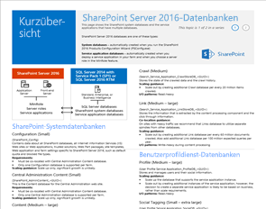
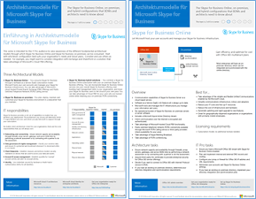
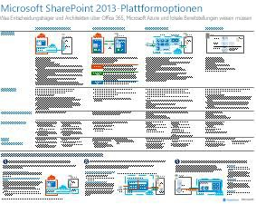
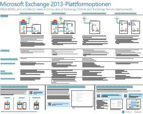

# Architekturmodelle für SharePoint, Exchange, Skype for Business und LyncArchitectural models for SharePoint, Exchange, Skype for Business, and Lync

 **Zusammenfassung**: Rufen Sie IT-Poster ab, auf denen die Architekturmodelle, die Bereitstellung und Plattformoptionen für SharePoint, Exchange, Skype for Business und Lync beschrieben werden.**Summary:** Get the IT posters that describe the architectural models, deployment, and platform options for SharePoint, Exchange, Skype for Business, and Lync.
  
Auf diesen IT-Postern werden die Architekturmodelle und Bereitstellungsoptionen für SharePoint, Exchange, Skype for Business und Lync beschrieben und Entwurfsinformationen für die Bereitstellung von SharePoint in Microsoft Azure zur Verfügung gestellt.These IT posters describe the architectural models and deployment options for SharePoint, Exchange, Skype for Business, and Lync, and they provide design information for deploying SharePoint in Microsoft Azure.
  
Mit Office 365 können Sie die Zusammenarbeits- und Kommunikationsdienste, mit denen Ihre Benutzer vertraut sind, als Cloud-Dienst bereitstellen. Mit wenigen Ausnahmen bleibt die Benutzeroberfläche identisch, ganz gleich, ob Sie eine lokale Bereitstellung oder Office 365 verwenden. Diese einheitliche Benutzeroberfläche macht es nicht ganz so einfach zu entscheiden, wo jede Verarbeitungslast platziert werden soll, und es ergeben sich Fragen wie:With Office 365, you can provide the collaboration and communication services your users are familiar with as a cloud-based service. With a few exceptions, the user experience remains the same whether you are maintaining an on-premises deployment or using Office 365. This unified user experience makes it less straightforward to decide where to place each workload and raises questions such as:
  
- Wie entscheiden Sie, welche Plattform für Ihre einzelnen Verarbeitungslasten verwendet werden soll?How do you determine which platform option to choose for your individual workloads?
    
- Ist es sinnvoll, Dienste lokal beizubehalten?Does it make sense to keep any service on-premises?
    
- In welchen Szenarien ist eine Hybridbereitstellung geeignet?What is a scenario where a hybrid deployment is appropriate?
    
- Wie passt Microsoft Azure ins Bild?How does Microsoft Azure fit in the picture?
    
- Was sind die unterstützten Konfigurationen für Office Server-Arbeitslasten in Azure?What are the supported configurations for Office Server workloads in Azure?
    
> [!TIP]
> Die meisten der Poster auf dieser Seite sind in mehreren Sprachen erhältlich, darunter Chinesisch, Englisch, Französisch, Deutsch, Italienisch, Japanisch, Koreanisch, Portugiesisch, Russisch und Spanisch. Um ein Poster in einer dieser Sprachen herunterzuladen, klicken Sie auf den Link **Weitere Sprachen** für das betreffende Poster.Most of the posters on this page are available in multiple languages, including Chinese, English, French, German, Italian, Japanese, Korean, Portuguese, Russian, and Spanish. To download a poster in one of these languages, click the **More languages** link for that poster.
  
Geben Sie uns Feedback, indem Sie eine E-Mail an [cloudadopt@microsoft.com](mailto:cloudadopt@microsoft.com) senden.Let us know what you think! Send us email at [cloudadopt@microsoft.com](mailto:cloudadopt@microsoft.com). 
  
Diese Seite ist mit den folgenden Postern verknüpft:This page links you to the following posters:
  
- **Poster zu Architekturmodellen** Sie können diese Ressourcen verwenden, um Ihre ideale Plattform und Konfiguration für SharePoint 2016 und Skype for Business 2015 zu bestimmen.**Architectural models posters** You can use these resources to determine your ideal platform and configuration for SharePoint 2016 and Skype for Business 2015.
    
  - [Microsoft SharePoint 2016-ArchitekturmodelleMicrosoft SharePoint 2016 Architectural Models](architectural-models-for-sharepoint-exchange-skype-for-business-and-lync.md#SP2016_ArchModel)
    
  - [Multi-Geo-Funktionen in OneDrive und SharePoint Online in Office 365Multi-Geo Capabilities in OneDrive and SharePoint Online in Office 365](architectural-models-for-sharepoint-exchange-skype-for-business-and-lync.md#MultiGeoO365ODB)
    
  - [SharePoint Server 2016-DatenbankenSharePoint Server 2016 Databases](architectural-models-for-sharepoint-exchange-skype-for-business-and-lync.md#SP2016_Databases)
    
  - [Architekturmodelle für Microsoft Skype for Business 2015Microsoft Skype for Business 2015 Architectural Models](architectural-models-for-sharepoint-exchange-skype-for-business-and-lync.md#SfB2015_ArchModel)
    
- **Poster zu Plattformoptionen** Sie können diese Ressourcen verwenden, um Ihre ideale Plattform und Konfiguration für SharePoint 2013, Exchange 2013 und Lync 2013 zu bestimmen.**Platform options posters** You can use these resources to determine your ideal platform and configuration for SharePoint 2013, Exchange 2013, and Lync 2013.
    
  - [SharePoint 2013-PlattformoptionenSharePoint 2013 Platform Options](architectural-models-for-sharepoint-exchange-skype-for-business-and-lync.md#SP2013_Options)
    
  - [Exchange 2013-PlattformoptionenExchange 2013 Platform Options](architectural-models-for-sharepoint-exchange-skype-for-business-and-lync.md#Exch2013_options)
    
  - [Lync 2013-PlattformoptionenLync 2013 Platform Options](architectural-models-for-sharepoint-exchange-skype-for-business-and-lync.md#Lync2013_Options)
    
- **Poster zu SharePoint Server 2013 in Azure-Lösungen** Sie können diese IT-Poster verwenden, um den Entwurf und die Konfiguration für SharePoint Server 2013-Arbeitslasten in Azure-Infrastrukturdiensten zu bestimmen.**SharePoint Server 2013 in Azure solutions posters** You can use these IT posters to determine the design and configuration for SharePoint Server 2013 workloads in Azure infrastructure services.
    
  - [Internetwebsites in Microsoft Azure mit SharePoint Server 2013Internet sites in Microsoft Azure using SharePoint Server 2013](architectural-models-for-sharepoint-exchange-skype-for-business-and-lync.md#Azure_sharepoint2013)
    
  - [Entwurfsbeispiel: Internetwebsites in Microsoft Azure für SharePoint 2013Design sample: Internet sites in Microsoft Azure for SharePoint 2013](architectural-models-for-sharepoint-exchange-skype-for-business-and-lync.md#DesignSampleInternetSites)
    
  - [SharePoint-Notfallwiederherstellung in Microsoft AzureSharePoint Disaster Recovery to Microsoft Azure](architectural-models-for-sharepoint-exchange-skype-for-business-and-lync.md#sharepoint_recovery_Azure)
    
## Poster zu ArchitekturmodellenArchitectural models posters

Diese neuen IT-Poster für SharePoint 2016 und Skype for Business 2015 bieten eine Möglichkeit, die unterschiedlichen Bereitstellungsmethoden in einem einfach zu druckenden Format zu vergleichen. Jedes Poster enthält eine Liste aller zur Verfügung stehenden Konfigurationen oder Plattformoptionen und bietet Ihnen die folgenden Informationen für die einzelnen Optionen:These new IT posters for SharePoint 2016 and Skype for Business 2015 provide a way to compare the various deployment methods in an easy-to-print format. Each poster provides a list of all the configurations or platform options available and gives you the following information for each option:
  
- **Übersicht** Eine kurze Zusammenfassung der Plattform, z. B. ein konzeptionelles Diagramm.**Overview** A brief summary of the platform, including a conceptual diagram.
    
- **Am besten für** Gängige Szenarien, die für die jeweilige Plattform ideal geeignet sind.**Best for** Common scenarios that are ideally suited for the particular platform.
    
- **Lizenzanforderungen** Die Lizenzen, die Sie für die Bereitstellung benötigen.**License requirements** The licenses you need for deployment.
    
- **Architekturaufgaben** Die Entscheidungen, die Sie als Architekt treffen müssen.**Architecture tasks** The decisions you need to make as an architect.
    
- **IT Pro-Aufgaben und -Zuständigkeiten** Die täglichen Aufgaben, die Ihre IT-Mitarbeiter planen müssen.**IT Pro tasks or responsibilities** The daily responsibilities that your IT staff needs to plan for.
    

### Microsoft SharePoint 2016-ArchitekturmodelleMicrosoft SharePoint 2016 Architectural Models

|**Element****Item**|**Beschreibung****Description**|
|:-----|:-----|
|[          ](https://www.microsoft.com/download/details.aspx?id=52650)[          ](https://www.microsoft.com/download/details.aspx?id=52650)   [PDF](https://download.microsoft.com/download/4/F/A/4FA0F94B-EE2F-41DB-A047-D9864FEF41E9/SharePoint2016ArchitecturalModels.pdf)  \| [Visio](https://download.microsoft.com/download/4/F/A/4FA0F94B-EE2F-41DB-A047-D9864FEF41E9/SharePoint2016ArchitecturalModels.vsdx)  \| [Weitere Sprachen](https://www.microsoft.com/download/details.aspx?id=52650)[PDF](https://download.microsoft.com/download/4/F/A/4FA0F94B-EE2F-41DB-A047-D9864FEF41E9/SharePoint2016ArchitecturalModels.pdf)  \| [Visio](https://download.microsoft.com/download/4/F/A/4FA0F94B-EE2F-41DB-A047-D9864FEF41E9/SharePoint2016ArchitecturalModels.vsdx)  \| [More languages](https://www.microsoft.com/download/details.aspx?id=52650)   | Dieses IT-Poster beschreibt SharePoint Online-, Microsoft Azure- und lokale SharePoint-Konfigurationen, die Entscheidungsträger im Unternehmen und Lösungsarchitekten kennen müssen.This IT poster describes the SharePoint Online, Microsoft Azure, and SharePoint on-premises configurations that business decision makers and solutions architects need to know about.    - **SharePoint Online (SaaS)** – Nutzen Sie SharePoint über ein SaaS-Abonnementmodell (Software as a Service).- **SharePoint Online (SaaS)** - Consume SharePoint through a Software as a Service (SaaS) subscription model.   - **SharePoint-Hybrid** – Verschieben Sie Ihre SharePoint-Websites und -Apps nach Ihrem eigenen Zeitplan in die Cloud.- **SharePoint Hybrid** - Move your SharePoint sites and apps to the cloud at your own pace.   - **SharePoint in Azure (IaaS)** – Sie erweitern Ihre lokale Umgebung in Microsoft Azure und stellen SharePoint 2016-Server dort bereit. (Dies wird für hohe Verfügbarkeit/Notfallwiederherstellung und Test-/Entwicklungsumgebungen empfohlen.)- **SharePoint in Azure (IaaS)** - You extend your on-premises environment into Microsoft Azure and deploy SharePoint 2016 Servers there. (This is recommended for High Availability/Disaster Recovery and dev/test environments.)   - **SharePoint lokal** – Die Planung, Bereitstellung, Verwaltung und Anpassung Ihrer SharePoint-Umgebung erfolgt in einem von Ihnen verwalteten Rechenzentrum.- **SharePoint On-premises** - You plan, deploy, maintain and customize your SharePoint environment in a datacenter that you maintain.   |
   

### Multi-Geo-Funktionen in OneDrive und SharePoint Online in Office 365Multi-Geo Capabilities in OneDrive and SharePoint Online in Office 365

|**Element****Item**|**Beschreibung****Description**|
|:-----|:-----|
|[          ](https://github.com/MicrosoftDocs/OfficeDocs-Enterprise/raw/live/Enterprise/media/Multi-Geo-ODB.pdf)[          ](https://github.com/MicrosoftDocs/OfficeDocs-Enterprise/raw/live/Enterprise/media/Multi-Geo-ODB.pdf)   [PDF](https://github.com/MicrosoftDocs/OfficeDocs-Enterprise/raw/live/Enterprise/media/Multi-Geo-ODB.pdf)  \| [Visio](https://github.com/MicrosoftDocs/OfficeDocs-Enterprise/raw/live/Enterprise/media/Multi-Geo-ODB.vsdx)[PDF](https://github.com/MicrosoftDocs/OfficeDocs-Enterprise/raw/live/Enterprise/media/Multi-Geo-ODB.pdf)  \| [Visio](https://github.com/MicrosoftDocs/OfficeDocs-Enterprise/raw/live/Enterprise/media/Multi-Geo-ODB.vsdx)   | Dieses Poster bietet eine Übersicht der Multi-Geo-Funktionen in OneDrive und SharePoint Online in Office 365 auf einer Seite. Dieses Modell umfasst: This poster is a one-page overview of Multi-Geo Capabilities in OneDrive and SharePoint Online in Office 365. This model includes:    – Vorteile- Benefits   –Schritte zur Bereitstellung- Steps for deployment   – Eine Beispielkonfiguration- An example configuration     Weitere Informationen zu Multi-Geo-Funktionen in OneDrive und SharePoint Online in Office 365 finden Sie [hier](https://aka.ms/onedrivemultigeo).For more information about Multi-Geo Capabilities in OneDrive and SharePoint Online in Office 365, click [here](https://aka.ms/onedrivemultigeo).    |
   

### SharePoint Server 2016-DatenbankenSharePoint Server 2016 Databases

|**Element****Item**|**Beschreibung****Description**|
|:-----|:-----|
|[          ](https://www.microsoft.com/download/details.aspx?id=55041)[          ](https://www.microsoft.com/download/details.aspx?id=55041)   [PDF](https://download.microsoft.com/download/D/5/D/D5DC1121-8BC5-4953-834F-1B5BB03EB691/DBrefguideSPS2016_tabloid.pdf)  \| [Visio](https://download.microsoft.com/download/D/5/D/D5DC1121-8BC5-4953-834F-1B5BB03EB691/DBrefguideSPS2016_tabloid.vsdx)  \| [Weitere Sprachen](https://www.microsoft.com/download/details.aspx?id=55041)[PDF](https://download.microsoft.com/download/D/5/D/D5DC1121-8BC5-4953-834F-1B5BB03EB691/DBrefguideSPS2016_tabloid.pdf)  \| [Visio](https://download.microsoft.com/download/D/5/D/D5DC1121-8BC5-4953-834F-1B5BB03EB691/DBrefguideSPS2016_tabloid.vsdx)  \| [More languages](https://www.microsoft.com/download/details.aspx?id=55041)   | Dieses IT-Poster ist eine Kurzübersicht für SharePoint Server 2016-Datenbanken. Jede Datenbank weist die folgenden Details auf: This IT poster is a quick reference guide for SharePoint Server 2016 databases. Each database has the following details:    – Größe- Size   – Hilfestellung zur Skalierung- Scaling guidance   – E/A-Muster- I/O patterns   – Anforderungen- Requirements     Die erste Seite enthält die SharePoint-Systemdatenbanken und die Dienstanwendungen, die mehrere Datenbanken aufweisen. Auf der zweiten Seite sind alle Dienstanwendungen verzeichnet, die über Einzeldatenbanken verfügen.The first page has the SharePoint system databases and the service applications that have multiple databases. The second page shows all of the service applications that have single databases.     Weitere Informationen zu den SharePoint Server 2016-Datenbanken finden Sie unter [Datenbanktypen und -beschreibungen in SharePoint Server 2016](https://technet.microsoft.com/de-DE/library/cc678868%28v=office.16%29.aspx).For more information about the SharePoint Server 2016 databases, see [Database types and descriptions in SharePoint Server 2016](https://technet.microsoft.com/en-us/library/cc678868%28v=office.16%29.aspx)   |
   

### Architekturmodelle für Microsoft Skype for Business 2015Microsoft Skype for Business 2015 Architectural Models

|**Element****Item**|**Beschreibung****Description**|
|:-----|:-----|
|[          ](https://www.microsoft.com/download/details.aspx?id=55022)[          ](https://www.microsoft.com/download/details.aspx?id=55022)   [PDF](https://download.microsoft.com/download/7/7/4/7741262C-A60D-41F7-863B-99BF5964FBFE/Skype%20for%20Business%20Architectural%20Models.pdf)  \| [Visio](https://download.microsoft.com/download/7/7/4/7741262C-A60D-41F7-863B-99BF5964FBFE/Skype%20for%20Business%20Architectural%20Models.vsd)  \| [Weitere Sprachen](https://www.microsoft.com/download/details.aspx?id=55022)[PDF](https://download.microsoft.com/download/7/7/4/7741262C-A60D-41F7-863B-99BF5964FBFE/Skype%20for%20Business%20Architectural%20Models.pdf)  \| [Visio](https://download.microsoft.com/download/7/7/4/7741262C-A60D-41F7-863B-99BF5964FBFE/Skype%20for%20Business%20Architectural%20Models.vsd)  \| [More languages](https://www.microsoft.com/download/details.aspx?id=55022)   |Dieses Poster beschreibt die Konfiguration von Skype for Business Online, lokale Konfigurationen sowie Hybrid- und Cloud-PBX-Konfigurationen und deren Integration in Exchange- und SharePoint-Konfigurationen, die Entscheidungsträger im Unternehmen und Lösungsarchitekten kennen müssen.This poster describes the Skype for Business Online, on-premises, hybrid, cloud PBX, and integration with Exchange and SharePoint configurations that business decision makers and solutions architects need to know about.    Es richtet sich an IT-Experten und soll auf die unterschiedlichen Architekturmodelle aufmerksam machen, über die Skype for Business Online sowie eine lokale Skype for Business-Konfiguration genutzt werden können.It is intended for the IT Pro audience to raise awareness of the different fundamental architectural models through which Skype for Business Online and Skype for Business on premises can be consumed.   Beginnen Sie mit der Konfiguration, die sich optimal für die Anforderungen und Zukunftspläne Ihrer Organisation eignet. Ziehen Sie bei Bedarf andere Konfigurationen in Erwägung. Es kann beispielsweise sinnvoll sein, die Integration mit Exchange und SharePoint oder eine Lösung in Betracht zu ziehen, die das Angebot von Microsoft für eine Nebenstellenanlage in der Cloud nutzt.Start with whichever configuration best suits your organization's needs and future plans. Consider and use others as needed. For example, you might want to consider integration with Exchange and SharePoint or a solution that takes advantage of Microsoft's Cloud PBX offering.    |
   
## Poster zu Plattformoptionen Platform options posters

Diese IT-Poster für SharePoint 2013, Exchange 2013 und Lync 2013 bieten eine Möglichkeit, die unterschiedlichen Bereitstellungsmethoden auf einen Blick auf einem großen Poster zu vergleichen. Jedes Poster enthält eine Liste aller zur Verfügung stehenden Konfigurationen oder Plattformoptionen und bietet Ihnen die folgenden Informationen für die einzelnen Optionen:These IT posters for SharePoint 2013, Exchange 2013, and Lync 2013 provide a way to compare the various deployment methods at a single glance in a large poster format. Each poster provides a list of all the configurations or platform options available and gives you the following information for each option:
  
- **Übersicht** Eine kurze Zusammenfassung der Plattform, z. B. ein konzeptionelles Diagramm.**Overview** A brief summary of the platform, including a conceptual diagram.
    
- **Am besten für** Gängige Szenarien, die für die jeweilige Plattform ideal geeignet sind.**Best for** Common scenarios that are ideally suited for the particular platform.
    
- **Lizenzanforderungen** Die Lizenzen, die Sie für die Bereitstellung benötigen.**License requirements** The licenses you need for deployment.
    
- **Architekturaufgaben** Die Entscheidungen, die Sie als Architekt treffen müssen.**Architecture tasks** The decisions you need to make as an architect.
    
- **IT Pro-Aufgaben und -Zuständigkeiten** Die täglichen Aufgaben, die Ihre IT-Mitarbeiter planen müssen.**IT Pro tasks or responsibilities** The daily responsibilities that your IT staff needs to plan for.
    

## SharePoint 2013-PlattformoptionenSharePoint 2013 Platform Options

****

|**Element****Item**|**Beschreibung****Description**|
|:-----|:-----|
|[          ](https://www.microsoft.com/download/details.aspx?id=40332)[          ](https://www.microsoft.com/download/details.aspx?id=40332)   [PDF](http://go.microsoft.com/fwlink/p/?LinkId=324594)  \| [Visio](https://go.microsoft.com/fwlink/p/?LinkId=324593)  \| [Weitere Sprachen](https://www.microsoft.com/download/details.aspx?id=40332)[PDF](http://go.microsoft.com/fwlink/p/?LinkId=324594)  \| [Visio](https://go.microsoft.com/fwlink/p/?LinkId=324593)  \| [More languages](https://www.microsoft.com/download/details.aspx?id=40332)   |Dieses Modell veranschaulicht die Plattformoptionen für SharePoint 2013 für BDMs (Business Decision Makers, Entscheidungsträger im Unternehmen) und Architekten: SharePoint in Office 365-Bereitstellung, lokale Hybridbereitstellung mit Office 365, Azure und die rein lokale Bereitstellung. Es beinhaltet eine Übersicht über die jeweilige Architektur, Empfehlungen, Lizenzanforderungen sowie Listen von Aufgaben für Architekten und IT-Experten für die jeweilige Plattform. Mehrere SharePoint-Lösungen in Azure werden herausgestellt.For business decision makers (BDMs) and architects, this model shows the platform options for SharePoint 2013, SharePoint in Office 365, on-premises hybrid with Office 365, Azure, and on-premises only deployments. It includes an overview of each architecture, recommendations, license requirements, and lists of architect and IT Pro tasks for each platform. Several SharePoint solutions on Azure are highlighted.   Eine barrierefreie Textversion dieses Posters finden Sie unter [Barrierefreies Diagramm – Microsoft SharePoint 2013-Plattformoptionen](accessible-diagrammicrosoft-sharepoint-2013-platform-options.md).For an accessible text version of this poster, see [Accessible diagram - Microsoft SharePoint 2013 Platform Options](accessible-diagrammicrosoft-sharepoint-2013-platform-options.md).    |
   

## Exchange 2013-PlattformoptionenExchange 2013 Platform Options

****

|**Element****Item**|**Beschreibung****Description**|
|:-----|:-----|
|[          ](https://www.microsoft.com/download/details.aspx?id=42676)[          ](https://www.microsoft.com/download/details.aspx?id=42676)   [PDF](https://go.microsoft.com/fwlink/p/?LinkID=398740)  \| [Visio](https://go.microsoft.com/fwlink/p/?LinkID=398742)  \| [Weitere Sprachen](https://www.microsoft.com/download/details.aspx?id=42676)[PDF](https://go.microsoft.com/fwlink/p/?LinkID=398740)  \| [Visio](https://go.microsoft.com/fwlink/p/?LinkID=398742)  \| [More languages](https://www.microsoft.com/download/details.aspx?id=42676)   |Dieses Modell beschreibt für geschäftliche Entscheidungsträger und Architekten die verfügbaren Plattformoptionen für Exchange 2013. Kunden können zwischen Exchange Online mit Office 365, hybridem Exchange, lokalem Exchange Server und gehostetem Exchange wählen. Das Poster enthält Details der einzelnen Architekturoptionen, einschließlich der optimalen Szenarien, sowie zu den Lizenzanforderungen und Zuständigkeiten von IT-Experten.For BDMs and architects, this model describes the available platform options for Exchange 2013. Customers can choose from Exchange Online with Office 365, Hybrid Exchange, Exchange Server on-premises and Hosted Exchange. The poster includes details of each architectural option, including the most ideal scenarios for each, the license requirements and IT Pro responsibilities.   Eine barrierefreie Textversion dieses Posters finden Sie unter [Barrierefreies Diagramm – Microsoft Exchange 2013-Plattformoptionen](accessible-diagrammicrosoft-exchange-2013-platform-options.md).For an accessible text version of this poster, see [Accessible diagram - Microsoft Exchange 2013 Platform Options](accessible-diagrammicrosoft-exchange-2013-platform-options.md).    |
   

## Lync 2013-PlattformoptionenLync 2013 Platform Options

****

|**Element****Item**|**Beschreibung****Description**|
|:-----|:-----|
|[          ](https://www.microsoft.com/download/details.aspx?id=41677)[          ](https://www.microsoft.com/download/details.aspx?id=41677)   [PDF](https://go.microsoft.com/fwlink/p/?LinkID=391837)  \| [Visio](https://go.microsoft.com/fwlink/p/?LinkID=391839)  \| [Weitere Sprachen](https://www.microsoft.com/download/details.aspx?id=41677)[PDF](https://go.microsoft.com/fwlink/p/?LinkID=391837)  \| [Visio](https://go.microsoft.com/fwlink/p/?LinkID=391839)  \| [More languages](https://www.microsoft.com/download/details.aspx?id=41677)   |Dieses Modell beschreibt für geschäftliche Entscheidungsträger und Architekten die verfügbaren Plattformoptionen für Lync 2013. Kunden können zwischen Lync Online mit Office 365, hybridem Lync, lokalem Lync Server und gehostetem Lync wählen. Das IT-Poster enthält Details der einzelnen Architekturoptionen, einschließlich der optimalen Szenarien, sowie zu den Lizenzanforderungen und Zuständigkeiten von IT-Experten.For BDMs and architects, this model describes the available platform options for Lync 2013. Customers can choose from Lync Online with Office 365, Hybrid Lync, Lync Server on-premises and Hosted Lync. The IT poster includes details of each architectural option, including the most ideal scenarios for each, the license requirements and IT Pro responsibilities.    |
   

## Poster zu SharePoint in Azure-LösungenSharePoint in Azure solutions posters

Auf diesen IT-Postern sind Azure-basierte Lösungen, die SharePoint Server 2013 verwenden, im Großformat dargestellt.These IT posters show Azure-based solutions using SharePoint Server 2013 in a large poster format.
  

### Internetwebsites in Microsoft Azure mit SharePoint Server 2013Internet sites in Microsoft Azure using SharePoint Server 2013

****

|**Element****Item**|**Beschreibung****Description**|
|:-----|:-----|
|[          ](https://www.microsoft.com/download/details.aspx?id=41992)[          ](https://www.microsoft.com/download/details.aspx?id=41992)   [PDF](https://go.microsoft.com/fwlink/p/?LinkId=392552)  \| [Visio](https://go.microsoft.com/fwlink/p/?LinkId=392551)  \| [Weitere Sprachen](https://www.microsoft.com/download/details.aspx?id=41992)[PDF](https://go.microsoft.com/fwlink/p/?LinkId=392552)  \| [Visio](https://go.microsoft.com/fwlink/p/?LinkId=392551)  \| [More languages](https://www.microsoft.com/download/details.aspx?id=41992)   |Dieses Poster enthält wichtige Entwurfsaktivitäten und empfohlene architekturbezogene Entscheidungen für im Internet zugängliche Websites in Azure. Eine barrierefreie Textversion dieses Posters finden Sie unter [Barrierefreies Diagramm – Internetwebsites in Microsoft Azure für SharePoint 2013](accessible-diagraminternet-sites-in-microsoft-azure-for-sharepoint-2013.md). This poster outlines key design activities and recommended architecture choices for Internet-facing sites in Azure. For an accessible text version of this poster, see [Accessible diagram - Internet sites in Microsoft Azure for SharePoint 2013](accessible-diagraminternet-sites-in-microsoft-azure-for-sharepoint-2013.md).     Weitere Informationen finden Sie in den folgenden Artikeln:For more information, see the following articles:     - [Internetwebsites in Microsoft Azure mit SharePoint Server 2013](internet-sites-in-microsoft-azure-using-sharepoint-server-2013.md)- [Internet Sites in Microsoft Azure using SharePoint Server 2013](internet-sites-in-microsoft-azure-using-sharepoint-server-2013.md)   - [Microsoft Azure-Architekturen für SharePoint 2013](microsoft-azure-architectures-for-sharepoint-2013.md)- [Microsoft Azure Architectures for SharePoint 2013](microsoft-azure-architectures-for-sharepoint-2013.md)   |
   

### Entwurfsbeispiel: Internetwebsites in Microsoft Azure für SharePoint 2013Design sample: Internet sites in Microsoft Azure for SharePoint 2013

****

|**Element****Item**|**Beschreibung****Description**|
|:-----|:-----|
|[          ](https://www.microsoft.com/download/details.aspx?id=41991)[          ](https://www.microsoft.com/download/details.aspx?id=41991)   [PDF](https://go.microsoft.com/fwlink/p/?LinkId=392549)  \| [Visio](https://go.microsoft.com/fwlink/p/?LinkId=392548)  \| [Weitere Sprachen](https://www.microsoft.com/download/details.aspx?id=41991)[PDF](https://go.microsoft.com/fwlink/p/?LinkId=392549)  \| [Visio](https://go.microsoft.com/fwlink/p/?LinkId=392548)  \| [More languages](https://www.microsoft.com/download/details.aspx?id=41991)   |Nutzen Sie dieses Entwurfsbeispiel als Ausgangspunkt für Ihre Architektur einer im Internet zugänglichen Website in Azure mit SharePoint Server 2013. Eine barrierefreie Textversion dieses Posters finden Sie unter [Barrierefreies Diagramm – Entwurfsbeispiel: Internetwebsites in Microsoft Azure für SharePoint 2013](accessible-diagramdesign-sample-internet-sites-in-microsoft-azure-for-sharepoint.md).Use this design sample as a starting point for your own architecture Internet-facing site in Azure using SharePoint Server 2013. For an accessible text version of this poster, see [Accessible diagram - Design sample: Internet sites in Microsoft Azure for SharePoint 2013](accessible-diagramdesign-sample-internet-sites-in-microsoft-azure-for-sharepoint.md).     Weitere Informationen finden Sie in den folgenden Artikeln:For more information, see the following articles:     - [Internetwebsites in Microsoft Azure mit SharePoint Server 2013](internet-sites-in-microsoft-azure-using-sharepoint-server-2013.md)- [Internet Sites in Microsoft Azure using SharePoint Server 2013](internet-sites-in-microsoft-azure-using-sharepoint-server-2013.md)   - [Microsoft Azure-Architekturen für SharePoint 2013](microsoft-azure-architectures-for-sharepoint-2013.md)- [Microsoft Azure Architectures for SharePoint 2013](microsoft-azure-architectures-for-sharepoint-2013.md)   |
   

### SharePoint-Notfallwiederherstellung in Microsoft AzureSharePoint Disaster Recovery to Microsoft Azure

****

|**Element****Item**|**Beschreibung****Description**|
|:-----|:-----|
|[          ](https://www.microsoft.com/download/details.aspx?id=41993)[          ](https://www.microsoft.com/download/details.aspx?id=41993)   [PDF](https://go.microsoft.com/fwlink/p/?LinkId=392555)  \| [Visio](https://go.microsoft.com/fwlink/p/?LinkId=392554)  \| [Weitere Sprachen](https://www.microsoft.com/download/details.aspx?id=41993)[PDF](https://go.microsoft.com/fwlink/p/?LinkId=392555)  \| [Visio](https://go.microsoft.com/fwlink/p/?LinkId=392554)  \| [More languages](https://www.microsoft.com/download/details.aspx?id=41993)   |Dieses Poster veranschaulicht die Architekturprinzipien für eine Notfallwiederherstellungsumgebung in Azure. Eine barrierefreie Textversion dieses Posters finden Sie unter [Barrierefreies Diagramm – SharePoint-Notfallwiederherstellung zu Microsoft Azure](accessible-diagramsharepoint-disaster-recovery-to-microsoft-azure.md).This IT poster shows architecture principles for a disaster recovery environment in Azure. For an accessible text version of this poster, see [Accessible diagram - SharePoint Disaster Recovery to Microsoft Azure](accessible-diagramsharepoint-disaster-recovery-to-microsoft-azure.md).     Weitere Informationen finden Sie in den folgenden Artikeln:For more information, see the following articles:     - [SharePoint Server 2013 – Notfallwiederherstellung in Microsoft Azure](sharepoint-server-2013-disaster-recovery-in-microsoft-azure.md)- [SharePoint Server 2013 Disaster Recovery in Microsoft Azure](sharepoint-server-2013-disaster-recovery-in-microsoft-azure.md)   - [Microsoft Azure-Architekturen für SharePoint 2013](microsoft-azure-architectures-for-sharepoint-2013.md)- [Microsoft Azure Architectures for SharePoint 2013](microsoft-azure-architectures-for-sharepoint-2013.md)   |
   

## Siehe auchSee Also

[Cloudakzeptanz und HybridlösungenCloud adoption and hybrid solutions](cloud-adoption-and-hybrid-solutions.md)
  
[Ressourcen zur Cloud-IT-Architektur von MicrosoftMicrosoft Cloud IT architecture resources](microsoft-cloud-it-architecture-resources.md)
  
[Testumgebungsanleitungen (TLGs) zur CloudakzeptanzCloud adoption Test Lab Guides (TLGs)](cloud-adoption-test-lab-guides-tlgs.md)
  
[HybridlösungenHybrid solutions](hybrid-solutions.md)

