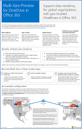

# Architekturmodelle für SharePoint, Exchange, Skype for Business und LyncArchitectural models for SharePoint, Exchange, Skype for Business, and Lync

Auf diesen IT-Postern werden die Architekturmodelle und Bereitstellungsoptionen für SharePoint, Exchange, Skype for Business und Lync beschrieben und Entwurfsinformationen für die Bereitstellung von SharePoint in Microsoft Azure zur Verfügung gestellt.These IT posters describe the architectural models and deployment options for SharePoint, Exchange, Skype for Business, and Lync, and they provide design information for deploying SharePoint in Microsoft Azure.
  
Mit Microsoft 365 können Sie die Zusammenarbeits-und Kommunikationsdienste bereitstellen, mit denen Ihre Benutzer als Cloud-basierter Dienst vertraut sind.With Microsoft 365, you can provide the collaboration and communication services your users are familiar with as a cloud-based service. Mit einigen wenigen Ausnahmen bleibt die Benutzererfahrung gleich, unabhängig davon, ob Sie eine lokale Bereitstellung oder die Verwendung von Microsoft 365 verwalten.With a few exceptions, the user experience remains the same whether you are maintaining an on-premises deployment or using Microsoft 365. Diese einheitliche Benutzeroberfläche macht es nicht ganz so einfach zu entscheiden, wo jede Verarbeitungslast platziert werden soll, und es ergeben sich Fragen wie:This unified user experience makes it less straightforward to decide where to place each workload and raises questions such as:
  
- Wie entscheiden Sie, welche Plattform für Ihre einzelnen Verarbeitungslasten verwendet werden soll?How do you determine which platform option to choose for your individual workloads?
    
- Ist es sinnvoll, Dienste lokal beizubehalten?Does it make sense to keep any service on-premises?
    
- In welchen Szenarien ist eine Hybridbereitstellung geeignet?What is a scenario where a hybrid deployment is appropriate?
    
- Wie passt Microsoft Azure ins Bild?How does Microsoft Azure fit in the picture?
    
- Was sind die unterstützten Konfigurationen für Office Server-Arbeitslasten in Azure?What are the supported configurations for Office Server workloads in Azure?
    
> [!TIP]
> Most of the posters on this page are available in multiple languages, including Chinese, English, French, German, Italian, Japanese, Korean, Portuguese, Russian, and Spanish.Most of the posters on this page are available in multiple languages, including Chinese, English, French, German, Italian, Japanese, Korean, Portuguese, Russian, and Spanish. To download a poster in one of these languages, click the **More languages** link for that poster.To download a poster in one of these languages, click the **More languages** link for that poster.
  
Let us know what you think!Let us know what you think! Send us email at [cloudadopt@microsoft.com](mailto:cloudadopt@microsoft.com).Send us email at [cloudadopt@microsoft.com](mailto:cloudadopt@microsoft.com). 
  
Diese Seite ist mit den folgenden Postern verknüpft:This page links you to the following posters:
  
- **Poster zu Architekturmodellen** Sie können diese Ressourcen verwenden, um Ihre ideale Plattform und Konfiguration für SharePoint 2016 und Skype for Business 2015 zu bestimmen.**Architectural models posters** You can use these resources to determine your ideal platform and configuration for SharePoint 2016 and Skype for Business 2015.
    
  - [Microsoft SharePoint 2016-ArchitekturmodelleMicrosoft SharePoint 2016 Architectural Models](architectural-models-for-sharepoint-exchange-skype-for-business-and-lync.md#SP2016_ArchModel)
    
  - [Multi-Geo-Funktionen in OneDrive und SharePoint Online in Microsoft 365Multi-Geo Capabilities in OneDrive and SharePoint Online in Microsoft 365](architectural-models-for-sharepoint-exchange-skype-for-business-and-lync.md#MultiGeoO365ODB)
    
  - [SharePoint Server 2016-DatenbankenSharePoint Server 2016 Databases](architectural-models-for-sharepoint-exchange-skype-for-business-and-lync.md#SP2016_Databases)
    
  - [Architekturmodelle für Microsoft Skype for Business 2015Microsoft Skype for Business 2015 Architectural Models](architectural-models-for-sharepoint-exchange-skype-for-business-and-lync.md#SfB2015_ArchModel)
    
- **Poster zu Plattformoptionen** Sie können diese Ressourcen verwenden, um Ihre ideale Plattform und Konfiguration für SharePoint 2013, Exchange 2013 und Lync 2013 zu bestimmen.**Platform options posters** You can use these resources to determine your ideal platform and configuration for SharePoint 2013, Exchange 2013, and Lync 2013.
    
  - [SharePoint 2013-PlattformoptionenSharePoint 2013 Platform Options](architectural-models-for-sharepoint-exchange-skype-for-business-and-lync.md#SP2013_Options)
    
  - [Exchange 2013-PlattformoptionenExchange 2013 Platform Options](architectural-models-for-sharepoint-exchange-skype-for-business-and-lync.md#Exch2013_options)
    
  - [Lync 2013-PlattformoptionenLync 2013 Platform Options](architectural-models-for-sharepoint-exchange-skype-for-business-and-lync.md#Lync2013_Options)
    
- **Poster zu SharePoint Server 2013 in Azure-Lösungen** Sie können diese IT-Poster verwenden, um den Entwurf und die Konfiguration für SharePoint Server 2013-Arbeitslasten in Azure-Infrastrukturdiensten zu bestimmen.**SharePoint Server 2013 in Azure solutions posters** You can use these IT posters to determine the design and configuration for SharePoint Server 2013 workloads in Azure infrastructure services.
    
  - [Internetwebsites in Microsoft Azure mit SharePoint Server 2013Internet sites in Microsoft Azure using SharePoint Server 2013](architectural-models-for-sharepoint-exchange-skype-for-business-and-lync.md#Azure_sharepoint2013)
    
  - [Entwurfsbeispiel: Internetwebsites in Microsoft Azure für SharePoint 2013Design sample: Internet sites in Microsoft Azure for SharePoint 2013](architectural-models-for-sharepoint-exchange-skype-for-business-and-lync.md#DesignSampleInternetSites)
    
  - [SharePoint-Notfallwiederherstellung in Microsoft AzureSharePoint Disaster Recovery to Microsoft Azure](architectural-models-for-sharepoint-exchange-skype-for-business-and-lync.md#sharepoint_recovery_Azure)
    
## Poster zu ArchitekturmodellenArchitectural models posters

These new IT posters for SharePoint 2016 and Skype for Business 2015 provide a way to compare the various deployment methods in an easy-to-print format.These new IT posters for SharePoint 2016 and Skype for Business 2015 provide a way to compare the various deployment methods in an easy-to-print format. Each poster provides a list of all the configurations or platform options available and gives you the following information for each option:Each poster provides a list of all the configurations or platform options available and gives you the following information for each option:
  
- **Übersicht** Eine kurze Zusammenfassung der Plattform, z. B. ein konzeptionelles Diagramm.**Overview** A brief summary of the platform, including a conceptual diagram.
    
- **Am besten für** Gängige Szenarien, die für die jeweilige Plattform ideal geeignet sind.**Best for** Common scenarios that are ideally suited for the particular platform.
    
- **Lizenzanforderungen** Die Lizenzen, die Sie für die Bereitstellung benötigen.**License requirements** The licenses you need for deployment.
    
- **Architekturaufgaben** Die Entscheidungen, die Sie als Architekt treffen müssen.**Architecture tasks** The decisions you need to make as an architect.
    
- **IT Pro-Aufgaben und -Zuständigkeiten** Die täglichen Aufgaben, die Ihre IT-Mitarbeiter planen müssen.**IT Pro tasks or responsibilities** The daily responsibilities that your IT staff needs to plan for.
    

### Microsoft SharePoint 2016-ArchitekturmodelleMicrosoft SharePoint 2016 Architectural Models

|**Element****Item**|**Beschreibung****Description**|
|:-----|:-----|
|[          ](https://www.microsoft.com/download/details.aspx?id=52650)[          ](https://www.microsoft.com/download/details.aspx?id=52650)   [PDF](https://download.microsoft.com/download/4/F/A/4FA0F94B-EE2F-41DB-A047-D9864FEF41E9/SharePoint2016ArchitecturalModels.pdf)  \| [Visio](https://download.microsoft.com/download/4/F/A/4FA0F94B-EE2F-41DB-A047-D9864FEF41E9/SharePoint2016ArchitecturalModels.vsdx)  \| [Weitere Sprachen](https://www.microsoft.com/download/details.aspx?id=52650)[PDF](https://download.microsoft.com/download/4/F/A/4FA0F94B-EE2F-41DB-A047-D9864FEF41E9/SharePoint2016ArchitecturalModels.pdf)  \| [Visio](https://download.microsoft.com/download/4/F/A/4FA0F94B-EE2F-41DB-A047-D9864FEF41E9/SharePoint2016ArchitecturalModels.vsdx)  \| [More languages](https://www.microsoft.com/download/details.aspx?id=52650)   | Dieses IT-Poster beschreibt SharePoint Online-, Microsoft Azure- und lokale SharePoint-Konfigurationen, die Entscheidungsträger im Unternehmen und Lösungsarchitekten kennen müssen.This IT poster describes the SharePoint Online, Microsoft Azure, and SharePoint on-premises configurations that business decision makers and solutions architects need to know about.    - **SharePoint Online (SaaS)** – Nutzen Sie SharePoint über ein SaaS-Abonnementmodell (Software as a Service).- **SharePoint Online (SaaS)** - Consume SharePoint through a Software as a Service (SaaS) subscription model.   - **SharePoint-Hybrid** – Verschieben Sie Ihre SharePoint-Websites und -Apps nach Ihrem eigenen Zeitplan in die Cloud.- **SharePoint Hybrid** - Move your SharePoint sites and apps to the cloud at your own pace.   - **SharePoint in Azure (IaaS)** - You extend your on-premises environment into Microsoft Azure and deploy SharePoint 2016 Servers there.- **SharePoint in Azure (IaaS)** - You extend your on-premises environment into Microsoft Azure and deploy SharePoint 2016 Servers there. (This is recommended for High Availability/Disaster Recovery and dev/test environments.)(This is recommended for High Availability/Disaster Recovery and dev/test environments.)   - **SharePoint lokal** – Die Planung, Bereitstellung, Verwaltung und Anpassung Ihrer SharePoint-Umgebung erfolgt in einem von Ihnen verwalteten Rechenzentrum.- **SharePoint On-premises** - You plan, deploy, maintain and customize your SharePoint environment in a datacenter that you maintain.   |
   

### Multi-Geo-Funktionen in OneDrive und SharePoint Online in Microsoft 365Multi-Geo Capabilities in OneDrive and SharePoint Online in Microsoft 365

|**Element****Item**|**Beschreibung****Description**|
|:-----|:-----|
|[          ](https://github.com/MicrosoftDocs/OfficeDocs-Enterprise/raw/live/Enterprise/media/Multi-Geo-ODB.pdf)[          ](https://github.com/MicrosoftDocs/OfficeDocs-Enterprise/raw/live/Enterprise/media/Multi-Geo-ODB.pdf)   [PDF](https://github.com/MicrosoftDocs/OfficeDocs-Enterprise/raw/live/Enterprise/media/Multi-Geo-ODB.pdf)  \| [Visio](https://github.com/MicrosoftDocs/OfficeDocs-Enterprise/raw/live/Enterprise/media/Multi-Geo-ODB.vsdx)[PDF](https://github.com/MicrosoftDocs/OfficeDocs-Enterprise/raw/live/Enterprise/media/Multi-Geo-ODB.pdf)  \| [Visio](https://github.com/MicrosoftDocs/OfficeDocs-Enterprise/raw/live/Enterprise/media/Multi-Geo-ODB.vsdx)   | Bei diesem Poster handelt es sich um eine einseitige Übersicht über Multi-Geo-Funktionen in OneDrive und SharePoint Online in Microsoft 365.This poster is a one-page overview of Multi-Geo Capabilities in OneDrive and SharePoint Online in Microsoft 365. Dieses Modell umfasst Folgendes:This model includes:    – Vorteile- Benefits   –Schritte zur Bereitstellung- Steps for deployment   – Eine Beispielkonfiguration- An example configuration     Weitere Informationen zu Multi-Geo-Funktionen in OneDrive und SharePoint Online in Microsoft 365 finden Sie [hier](https://aka.ms/onedrivemultigeo).For more information about Multi-Geo Capabilities in OneDrive and SharePoint Online in Microsoft 365, click [here](https://aka.ms/onedrivemultigeo).    |
   

### SharePoint Server 2016-DatenbankenSharePoint Server 2016 Databases

|**Element****Item**|**Beschreibung****Description**|
|:-----|:-----|
|[          ](https://www.microsoft.com/download/details.aspx?id=55041)[          ](https://www.microsoft.com/download/details.aspx?id=55041)   [PDF](https://download.microsoft.com/download/D/5/D/D5DC1121-8BC5-4953-834F-1B5BB03EB691/DBrefguideSPS2016_tabloid.pdf)  \| [Visio](https://download.microsoft.com/download/D/5/D/D5DC1121-8BC5-4953-834F-1B5BB03EB691/DBrefguideSPS2016_tabloid.vsdx)  \| [Weitere Sprachen](https://www.microsoft.com/download/details.aspx?id=55041)[PDF](https://download.microsoft.com/download/D/5/D/D5DC1121-8BC5-4953-834F-1B5BB03EB691/DBrefguideSPS2016_tabloid.pdf)  \| [Visio](https://download.microsoft.com/download/D/5/D/D5DC1121-8BC5-4953-834F-1B5BB03EB691/DBrefguideSPS2016_tabloid.vsdx)  \| [More languages](https://www.microsoft.com/download/details.aspx?id=55041)   | This IT poster is a quick reference guide for SharePoint Server 2016 databases.This IT poster is a quick reference guide for SharePoint Server 2016 databases. Each database has the following details:Each database has the following details:    – Größe- Size   – Hilfestellung zur Skalierung- Scaling guidance   – E/A-Muster- I/O patterns   – Anforderungen- Requirements     The first page has the SharePoint system databases and the service applications that have multiple databases.The first page has the SharePoint system databases and the service applications that have multiple databases. The second page shows all of the service applications that have single databases.The second page shows all of the service applications that have single databases.     Weitere Informationen zu den SharePoint Server 2016-Datenbanken finden Sie unter [Datenbanktypen und -beschreibungen in SharePoint Server 2016](https://docs.microsoft.com/SharePoint/technical-reference/database-types-and-descriptions).For more information about the SharePoint Server 2016 databases, see [Database types and descriptions in SharePoint Server 2016](https://docs.microsoft.com/SharePoint/technical-reference/database-types-and-descriptions)   |
   

### Architekturmodelle für Microsoft Skype for Business 2015Microsoft Skype for Business 2015 Architectural Models

|**Element****Item**|**Beschreibung****Description**|
|:-----|:-----|
|[          ](https://www.microsoft.com/download/details.aspx?id=55022)[          ](https://www.microsoft.com/download/details.aspx?id=55022)   [PDF](https://download.microsoft.com/download/7/7/4/7741262C-A60D-41F7-863B-99BF5964FBFE/Skype%20for%20Business%20Architectural%20Models.pdf)  \| [Visio](https://download.microsoft.com/download/7/7/4/7741262C-A60D-41F7-863B-99BF5964FBFE/Skype%20for%20Business%20Architectural%20Models.vsd)  \| [Weitere Sprachen](https://www.microsoft.com/download/details.aspx?id=55022)[PDF](https://download.microsoft.com/download/7/7/4/7741262C-A60D-41F7-863B-99BF5964FBFE/Skype%20for%20Business%20Architectural%20Models.pdf)  \| [Visio](https://download.microsoft.com/download/7/7/4/7741262C-A60D-41F7-863B-99BF5964FBFE/Skype%20for%20Business%20Architectural%20Models.vsd)  \| [More languages](https://www.microsoft.com/download/details.aspx?id=55022)   |Dieses Poster beschreibt die Konfiguration von Skype for Business Online, lokale Konfigurationen sowie Hybrid- und Cloud-PBX-Konfigurationen und deren Integration in Exchange- und SharePoint-Konfigurationen, die Entscheidungsträger im Unternehmen und Lösungsarchitekten kennen müssen.This poster describes the Skype for Business Online, on-premises, hybrid, cloud PBX, and integration with Exchange and SharePoint configurations that business decision makers and solutions architects need to know about.    Es richtet sich an IT-Experten und soll auf die unterschiedlichen Architekturmodelle aufmerksam machen, über die Skype for Business Online sowie eine lokale Skype for Business-Konfiguration genutzt werden können.It is intended for the IT Pro audience to raise awareness of the different fundamental architectural models through which Skype for Business Online and Skype for Business on premises can be consumed.   Start with whichever configuration best suits your organization's needs and future plans.Start with whichever configuration best suits your organization's needs and future plans. Consider and use others as needed.Consider and use others as needed. For example, you might want to consider integration with Exchange and SharePoint or a solution that takes advantage of Microsoft's Cloud PBX offering.For example, you might want to consider integration with Exchange and SharePoint or a solution that takes advantage of Microsoft's Cloud PBX offering.    |
   
## Poster zu Plattformoptionen Platform options posters

These IT posters for SharePoint 2013, Exchange 2013, and Lync 2013 provide a way to compare the various deployment methods at a single glance in a large poster format.These IT posters for SharePoint 2013, Exchange 2013, and Lync 2013 provide a way to compare the various deployment methods at a single glance in a large poster format. Each poster provides a list of all the configurations or platform options available and gives you the following information for each option:Each poster provides a list of all the configurations or platform options available and gives you the following information for each option:
  
- **Übersicht** Eine kurze Zusammenfassung der Plattform, z. B. ein konzeptionelles Diagramm.**Overview** A brief summary of the platform, including a conceptual diagram.
    
- **Am besten für** Gängige Szenarien, die für die jeweilige Plattform ideal geeignet sind.**Best for** Common scenarios that are ideally suited for the particular platform.
    
- **Lizenzanforderungen** Die Lizenzen, die Sie für die Bereitstellung benötigen.**License requirements** The licenses you need for deployment.
    
- **Architekturaufgaben** Die Entscheidungen, die Sie als Architekt treffen müssen.**Architecture tasks** The decisions you need to make as an architect.
    
- **IT Pro-Aufgaben und -Zuständigkeiten** Die täglichen Aufgaben, die Ihre IT-Mitarbeiter planen müssen.**IT Pro tasks or responsibilities** The daily responsibilities that your IT staff needs to plan for.
    

## SharePoint 2013-PlattformoptionenSharePoint 2013 Platform Options

****

|**Element****Item**|**Beschreibung****Description**|
|:-----|:-----|
|[          ](https://www.microsoft.com/download/details.aspx?id=40332)[          ](https://www.microsoft.com/download/details.aspx?id=40332)   [PDF](https://go.microsoft.com/fwlink/p/?LinkId=324594)  \| [Visio](https://go.microsoft.com/fwlink/p/?LinkId=324593)  \| [Weitere Sprachen](https://www.microsoft.com/download/details.aspx?id=40332)[PDF](https://go.microsoft.com/fwlink/p/?LinkId=324594)  \| [Visio](https://go.microsoft.com/fwlink/p/?LinkId=324593)  \| [More languages](https://www.microsoft.com/download/details.aspx?id=40332)   |Für Geschäfts Entscheidungsträger (Business decision makers, BDMs) und Architekten zeigt dieses Modell die Plattformoptionen für SharePoint 2013, SharePoint in Microsoft 365, lokale hybridbereitstellung mit Microsoft 365, Azure und lokale Bereitstellungen.For business decision makers (BDMs) and architects, this model shows the platform options for SharePoint 2013, SharePoint in Microsoft 365, on-premises hybrid with Microsoft 365, Azure, and on-premises only deployments. Es bietet eine Übersicht über die jeweilige Architektur, Empfehlungen, Lizenzanforderungen sowie Listen von Aufgaben für Architekten und IT-Experten für die jeweilige Plattform.It includes an overview of each architecture, recommendations, license requirements, and lists of architect and IT Pro tasks for each platform. Mehrere SharePoint-Lösungen auf Azure werden hervorgehoben.Several SharePoint solutions on Azure are highlighted.   |
   

## Exchange 2013-PlattformoptionenExchange 2013 Platform Options

****

|**Element****Item**|**Beschreibung****Description**|
|:-----|:-----|
|[          ](https://www.microsoft.com/download/details.aspx?id=42676)[          ](https://www.microsoft.com/download/details.aspx?id=42676)   [PDF](https://go.microsoft.com/fwlink/p/?LinkID=398740)  \| [Visio](https://go.microsoft.com/fwlink/p/?LinkID=398742)  \| [Weitere Sprachen](https://www.microsoft.com/download/details.aspx?id=42676)[PDF](https://go.microsoft.com/fwlink/p/?LinkID=398740)  \| [Visio](https://go.microsoft.com/fwlink/p/?LinkID=398742)  \| [More languages](https://www.microsoft.com/download/details.aspx?id=42676)   |Dieses Modell beschreibt für geschäftliche Entscheidungsträger und Architekten die verfügbaren Plattformoptionen für Exchange 2013.For BDMs and architects, this model describes the available platform options for Exchange 2013. Kunden können zwischen Exchange Online mit Microsoft 365, Hybrid Exchange, Exchange Server lokalen und gehosteten Exchange auswählen.Customers can choose from Exchange Online with Microsoft 365, Hybrid Exchange, Exchange Server on-premises and Hosted Exchange. Das Poster enthält Details der einzelnen Architekturoptionen, einschließlich der optimalen Szenarien, sowie zu den Lizenzanforderungen und Zuständigkeiten von IT-Experten.The poster includes details of each architectural option, including the most ideal scenarios for each, the license requirements and IT Pro responsibilities.   |
   

## Lync 2013-PlattformoptionenLync 2013 Platform Options

****

|**Element****Item**|**Beschreibung****Description**|
|:-----|:-----|
|[          ](https://www.microsoft.com/download/details.aspx?id=41677)[          ](https://www.microsoft.com/download/details.aspx?id=41677)   [PDF](https://go.microsoft.com/fwlink/p/?LinkID=391837)  \| [Visio](https://go.microsoft.com/fwlink/p/?LinkID=391839)  \| [Weitere Sprachen](https://www.microsoft.com/download/details.aspx?id=41677)[PDF](https://go.microsoft.com/fwlink/p/?LinkID=391837)  \| [Visio](https://go.microsoft.com/fwlink/p/?LinkID=391839)  \| [More languages](https://www.microsoft.com/download/details.aspx?id=41677)   |Dieses Modell beschreibt für geschäftliche Entscheidungsträger und Architekten die verfügbaren Plattformoptionen für Lync 2013.For BDMs and architects, this model describes the available platform options for Lync 2013. Kunden können zwischen lync online mit Microsoft 365, Hybrid-lync, lync Server lokalen und gehosteten lync auswählen.Customers can choose from Lync Online with Microsoft 365, Hybrid Lync, Lync Server on-premises and Hosted Lync. Das IT-Poster enthält Details der einzelnen Architekturoptionen, einschließlich der optimalen Szenarien, sowie zu den Lizenzanforderungen und Zuständigkeiten von IT-Experten.The IT poster includes details of each architectural option, including the most ideal scenarios for each, the license requirements and IT Pro responsibilities.    |
   

## Poster zu SharePoint in Azure-LösungenSharePoint in Azure solutions posters

Auf diesen IT-Postern sind Azure-basierte Lösungen, die SharePoint Server 2013 verwenden, im Großformat dargestellt.These IT posters show Azure-based solutions using SharePoint Server 2013 in a large poster format.
  

### Internetwebsites in Microsoft Azure mit SharePoint Server 2013Internet sites in Microsoft Azure using SharePoint Server 2013

****

|**Element****Item**|**Beschreibung****Description**|
|:-----|:-----|
|[          ](https://www.microsoft.com/download/details.aspx?id=41992)[          ](https://www.microsoft.com/download/details.aspx?id=41992)   [PDF](https://go.microsoft.com/fwlink/p/?LinkId=392552)  \| [Visio](https://go.microsoft.com/fwlink/p/?LinkId=392551)  \| [Weitere Sprachen](https://www.microsoft.com/download/details.aspx?id=41992)[PDF](https://go.microsoft.com/fwlink/p/?LinkId=392552)  \| [Visio](https://go.microsoft.com/fwlink/p/?LinkId=392551)  \| [More languages](https://www.microsoft.com/download/details.aspx?id=41992)   |Dieses Poster umreißt wichtige Entwurfsaktivitäten und empfohlene Architekturentscheidungen für mit dem Internet verbundene Websites in Azure.This poster outlines key design activities and recommended architecture choices for Internet-facing sites in Azure.     Weitere Informationen finden Sie in den folgenden Artikeln:For more information, see the following articles:     - [Internetwebsites in Microsoft Azure mit SharePoint Server 2013](internet-sites-in-microsoft-azure-using-sharepoint-server-2013.md)- [Internet Sites in Microsoft Azure using SharePoint Server 2013](internet-sites-in-microsoft-azure-using-sharepoint-server-2013.md)   - [Microsoft Azure-Architekturen für SharePoint 2013](microsoft-azure-architectures-for-sharepoint-2013.md)- [Microsoft Azure Architectures for SharePoint 2013](microsoft-azure-architectures-for-sharepoint-2013.md)   |
   

### Entwurfsbeispiel: Internetwebsites in Microsoft Azure für SharePoint 2013Design sample: Internet sites in Microsoft Azure for SharePoint 2013

****

|**Element****Item**|**Beschreibung****Description**|
|:-----|:-----|
|[          ](https://www.microsoft.com/download/details.aspx?id=41991)[          ](https://www.microsoft.com/download/details.aspx?id=41991)   [PDF](https://go.microsoft.com/fwlink/p/?LinkId=392549)  \| [Visio](https://go.microsoft.com/fwlink/p/?LinkId=392548)  \| [Weitere Sprachen](https://www.microsoft.com/download/details.aspx?id=41991)[PDF](https://go.microsoft.com/fwlink/p/?LinkId=392549)  \| [Visio](https://go.microsoft.com/fwlink/p/?LinkId=392548)  \| [More languages](https://www.microsoft.com/download/details.aspx?id=41991)   |Verwenden Sie dieses Entwurfsbeispiel als Ausgangspunkt für Ihre eigene Architektur mit Internet Zugang in Azure mit SharePoint Server 2013.Use this design sample as a starting point for your own architecture Internet-facing site in Azure using SharePoint Server 2013.    Weitere Informationen finden Sie in den folgenden Artikeln:For more information, see the following articles:     - [Internetwebsites in Microsoft Azure mit SharePoint Server 2013](internet-sites-in-microsoft-azure-using-sharepoint-server-2013.md)- [Internet Sites in Microsoft Azure using SharePoint Server 2013](internet-sites-in-microsoft-azure-using-sharepoint-server-2013.md)   - [Microsoft Azure-Architekturen für SharePoint 2013](microsoft-azure-architectures-for-sharepoint-2013.md)- [Microsoft Azure Architectures for SharePoint 2013](microsoft-azure-architectures-for-sharepoint-2013.md)   |
   

### SharePoint-Notfallwiederherstellung in Microsoft AzureSharePoint Disaster Recovery to Microsoft Azure

****

|**Element****Item**|**Beschreibung****Description**|
|:-----|:-----|
|[          ](https://www.microsoft.com/download/details.aspx?id=41993)[          ](https://www.microsoft.com/download/details.aspx?id=41993)   [PDF](https://go.microsoft.com/fwlink/p/?LinkId=392555)  \| [Visio](https://go.microsoft.com/fwlink/p/?LinkId=392554)  \| [Weitere Sprachen](https://www.microsoft.com/download/details.aspx?id=41993)[PDF](https://go.microsoft.com/fwlink/p/?LinkId=392555)  \| [Visio](https://go.microsoft.com/fwlink/p/?LinkId=392554)  \| [More languages](https://www.microsoft.com/download/details.aspx?id=41993)   |Dieses IT-Poster zeigt Architekturprinzipien für eine Notfallwiederherstellungsumgebung in Azure.This IT poster shows architecture principles for a disaster recovery environment in Azure.    Weitere Informationen finden Sie in den folgenden Artikeln:For more information, see the following articles:     - [SharePoint Server 2013 – Notfallwiederherstellung in Microsoft Azure](sharepoint-server-2013-disaster-recovery-in-microsoft-azure.md)- [SharePoint Server 2013 Disaster Recovery in Microsoft Azure](sharepoint-server-2013-disaster-recovery-in-microsoft-azure.md)   - [Microsoft Azure-Architekturen für SharePoint 2013](microsoft-azure-architectures-for-sharepoint-2013.md)- [Microsoft Azure Architectures for SharePoint 2013](microsoft-azure-architectures-for-sharepoint-2013.md)   |
   
## Siehe auchSee Also

[Cloudakzeptanz und HybridlösungenCloud adoption and hybrid solutions](cloud-adoption-and-hybrid-solutions.yml)
  
[Ressourcen zur Cloud-IT-Architektur von MicrosoftMicrosoft Cloud IT architecture resources](microsoft-cloud-it-architecture-resources.md)
  
[Testumgebungsanleitungen für Microsoft 365 EnterpriseMicrosoft 365 for enterprise Test Lab Guides](https://docs.microsoft.com/microsoft-365/enterprise/m365-enterprise-test-lab-guides)
  
[HybridlösungenHybrid solutions](hybrid-solutions.md)

