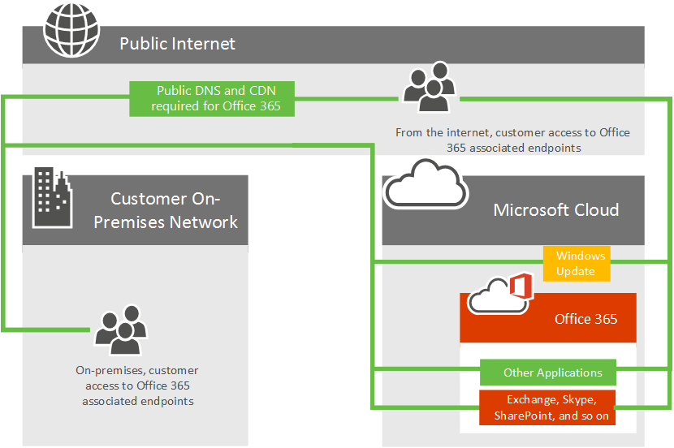

# Azure ExpressRoute für Office 365Azure ExpressRoute for Office 365

Erfahren Sie, wie Azure Express Route mit Office 365 verwendet wird und wie Sie das Netzwerk Implementierungsprojekt planen, das bei der Bereitstellung von Azure Express Route für die Verwendung mit Office 365 erforderlich ist.Learn how Azure ExpressRoute is used with Office 365 and how to plan the network implementation project that will be required if you are deploying Azure ExpressRoute for use with Office 365. Infrastruktur-und Plattformdienste, die in Azure laufen, profitieren häufig durch die Berücksichtigung der Netzwerkarchitektur und der Leistungsüberlegungen.Infrastructure and platform services running in Azure will often benefit by addressing network architecture and performance considerations. In diesen Fällen wird Express Route für Azure empfohlen.We recommend ExpressRoute for Azure in these cases. Software as a Service Offerings wie Office 365 und Dynamics 365 wurden für den sicheren und zuverlässigen Zugriff über das Internet entwickelt.Software as a Service offerings like Office 365 and Dynamics 365 have been built to be accessed securely and reliably via the Internet. Sie können sich über die Leistung und Sicherheit im Internet informieren und wenn Sie Azure Express Route für Office 365 im Artikel [Netzwerkkonnektivität zu Office 365](network-connectivity.md)berücksichtigen.You can read about Internet performance and security and when you might consider Azure ExpressRoute for Office 365 in the article [Network connectivity to Office 365](network-connectivity.md).

> [!NOTE]
> Microsoft-Autorisierung ist erforderlich, um Express Route für Office 365 zu verwenden.Microsoft authorization is required to use ExpressRoute for Office 365. Microsoft prüft alle Kundenanforderungen und autorisiert Express Route für Office 365-Nutzung, wenn die behördliche Anforderung eines Kunden eine direkte Anbindung vorschreibt.Microsoft reviews every customer request and authorizes ExpressRoute for Office 365 usage when a customer's regulatory requirement mandates direct connectivity. Wenn Sie solche Anforderungen haben, geben Sie den Textauszug und den Weblink zu der von Ihnen interpretierten Verordnung an, um zu sagen, dass im [Express Route für Office 365-Anforderungsformular](https://aka.ms/O365ERReview) eine direkte Verbindung erforderlich ist, um eine Microsoft-Überprüfungen zu beginnen.If you have such requirements, please provide the text excerpt and web link to the regulation which you interpret to mean that direct connectivity is required in the [ExpressRoute for Office 365 Request Form](https://aka.ms/O365ERReview) to begin a Microsoft review. Nicht autorisierte Abonnements, die versuchen, Routenfilter für Office 365 zu erstellen, erhalten eine [Fehlermeldung](https://support.microsoft.com/kb/3181709).Unauthorized subscriptions trying to create route filters for Office 365 will receive an [error message](https://support.microsoft.com/kb/3181709). 

Sie können nun eine direkte Netzwerkverbindung zu Office 365 für ausgewählten Office 365-Netzwerkdatenverkehr hinzufügen.You can now add a direct network connection to Office 365 for selected Office 365 network traffic. Azure Express Route bietet eine direkte Verbindung, eine vorhersagbare Leistung und eine Uptime-SLA von 99,95% für die Microsoft-Netzwerkkomponenten.Azure ExpressRoute offers a direct connection, predictable performance, and comes with an uptime SLA of 99.95% for the Microsoft networking components. Für Dienste, die über Azure Express Route nicht unterstützt werden, ist weiterhin eine Internetverbindung erforderlich.You'll still require an internet connection for services that aren't supported over Azure ExpressRoute.

## Planen von Azure Express Route für Office 365Planning Azure ExpressRoute for Office 365

Zusätzlich zur Internetanbindung können Sie eine Teilmenge Ihres Office 365-Netzwerkverkehrs über eine direkte Verbindung weiterleiten, die Vorhersehbarkeit und eine SLA von 99,95% für die Microsoft-Netzwerkkomponenten bietet.In addition to internet connectivity, you may choose to route a subset of their Office 365 network traffic over a direct connection that offers predictability and a 99.95% uptime SLA for the Microsoft networking components. Azure Express Route bietet Ihnen diese dedizierte Netzwerkverbindung zu Office 365 und anderen Microsoft Cloud-Diensten.Azure ExpressRoute provides you with this dedicated network connection to Office 365 and other Microsoft cloud services.

Unabhängig davon, ob Sie über ein vorhandenes MPLS-WAN verfügen, kann Express Route Ihrer Netzwerkarchitektur auf drei Arten hinzugefügt werden: über einen unterstützten Cloud-Co-Location-Anbieter, einen Ethernet-Punkt-zu-Punkt-Verbindungsanbieter oder einen MPLS-Verbindungsanbieter.Regardless of whether you have an existing MPLS WAN, ExpressRoute can be added to your network architecture in one of three ways; through a supported cloud exchange co-location provider, an Ethernet point-to-point connection provider, or through an MPLS connection provider. Erfahren Sie, welche [Anbieter in Ihrer Region verfügbar sind](https://azure.microsoft.com/documentation/articles/expressroute-locations/).See what [providers are available in your region](https://azure.microsoft.com/documentation/articles/expressroute-locations/). Die direkte Express Route-Verbindung ermöglicht die Verbindung mit den Anwendungen, die in [welchen Office 365-Diensten enthalten sind](azure-expressroute.md#BKMK_WhatDoIGet) .The direct ExpressRoute connection will enable connectivity to the applications outlined in [What Office 365 services are included?](azure-expressroute.md#BKMK_WhatDoIGet) below. Der Netzwerkdatenverkehr für alle anderen Anwendungen und Dienste wird weiterhin über das Internet durchlaufen.Network traffic for all other applications and services will continue to traverse the internet.

Betrachten Sie das folgende allgemeine Netzwerkdiagramm, das zeigt, wie ein typischer Office 365-Kunde eine Verbindung zu den Microsoft-Rechenzentren über das Internet für den Zugriff auf alle Microsoft-Anwendungen wie Office 365, Windows Update und TechNet herstellt.Consider the following high level network diagram which shows a typical Office 365 customer connecting to Microsoft's datacenters over the internet for access to all Microsoft applications such as Office 365, Windows Update, and TechNet. Kunden verwenden einen ähnlichen Netzwerkpfad, unabhängig davon, ob die Verbindung von einem lokalen Netzwerk oder von einer unabhängigen Internetverbindung hergestellt wird.Customers use a similar network path regardless of whether they're connecting from an on-premises network or from an independent internet connection.

Sehen Sie sich das aktualisierte Diagramm an, das einen Office 365-Kunden darstellt, der sowohl das Internet als auch Express Route zum Herstellen einer Verbindung mit Office 365 verwendet.Now look at the updated diagram which depicts an Office 365 customer who uses both the internet and ExpressRoute to connect to Office 365. Beachten Sie, dass einige Verbindungen wie öffentliche DNS-und Inhalts Bereitstellungsnetzwerk Knoten weiterhin die öffentliche Internetverbindung erfordern.Notice that some connections such as Public DNS and Content Delivery Network nodes still require the public internet connection. Beachten Sie außerdem, dass die Benutzer des Kunden, die sich nicht in Ihrem Express Route verbundenen Gebäude befinden, über das Internet eine Verbindung herstellen.Also notice the customer's users who are not located in their ExpressRoute connected building are connecting over the Internet.

Sie möchten noch weitere Informationen?Still want more information? Erfahren Sie, wie [Sie Ihren Netzwerkdatenverkehr mit Azure Express Route für Office 365 verwalten](https://support.office.com/article/e1da26c6-2d39-4379-af6f-4da213218408) und wie Sie [Azure Express Route für Office 365 konfigurieren](https://azure.microsoft.com/documentation/articles/expressroute-faqs/).Learn how to [manage your network traffic with Azure ExpressRoute for Office 365](https://support.office.com/article/e1da26c6-2d39-4379-af6f-4da213218408) and learn how to [configure Azure ExpressRoute for Office 365](https://azure.microsoft.com/documentation/articles/expressroute-faqs/). Wir haben auch eine 10-teilige [Azure Express Route für Office 365-Schulungs](https://channel9.msdn.com/series/aer) Reihe auf Kanal 9 aufgezeichnet, um die Konzepte genauer zu erläutern.We've also recorded a 10 part [Azure ExpressRoute for Office 365 Training](https://channel9.msdn.com/series/aer) series on Channel 9 to help explain the concepts more thoroughly.

([Azure Express Route für Office 365](azure-expressroute.md#BKMK_HOME))([Azure ExpressRoute for Office 365](azure-expressroute.md#BKMK_HOME))

## Welche Office 365-Dienste sind enthalten?What Office 365 services are included?

In der folgenden Tabelle sind die Office 365-Dienste aufgeführt, die über Express Route unterstützt werden.The following table lists the Office 365 services that are supported over ExpressRoute. Lesen Sie den [Artikel Office 365 Endpoint](https://aka.ms/o365endpoints) , um zu verstehen, welche Netzwerkanforderungen für diese Anwendungen eine Internetverbindung erfordern.Please review the [Office 365 endpoints article](https://aka.ms/o365endpoints) to understand which network requests for these applications require internet connectivity.

|**Anwendungen enthalten****Applications included**|
|:-----|
|Exchange Online1Exchange Online1   Exchange Online Protection1Exchange Online Protection1   Eintauchen1Delve1   |
|Skype for Business Online1Skype for Business Online1   |
|SharePoint Online1SharePoint Online1   OneDrive für Unternehmen1OneDrive for Business1   Project Online1Project Online1   |
|Portal und Shared1Portal and shared1   Azure Active Directory1Azure Active Directory1   Aad Connect1AAD Connect1   Office Online1Office Online1   |

1 Jede dieser Anwendungen verfügt über Express Route, die nicht unterstützt werden, finden Sie im [Artikel Office 365](https://aka.ms/o365endpoints) Endpoints Weitere Informationen.1Each of these applications have internet connectivity requirements not supported over ExpressRoute, see the [Office 365 endpoints article](https://aka.ms/o365endpoints) for more information.

Die Dienste, die nicht in Express Route für Office 365 enthalten sind, sind Office 365 ProPlus-Clientdownloads, lokale Identitätsanbieter-Anmeldung und Office 365 (betrieben von 21 vianet)-Dienst in China.The services that aren't included with ExpressRoute for Office 365 are Office 365 ProPlus client downloads, On-premises Identity Provider Sign-In, and Office 365 (operated by 21 Vianet) service in China.

([Azure Express Route für Office 365](azure-expressroute.md#BKMK_HOME))([Azure ExpressRoute for Office 365](azure-expressroute.md#BKMK_HOME))

## Implementieren von ExpressRoute für Office 365Implementing ExpressRoute for Office 365

Die Implementierung von Express Route erfordert die Einbindung von Netzwerk-und Anwendungsbesitzern und erfordert sorgfältige Planung der neuen [Netzwerkrouting Architektur](https://support.office.com/article/e1da26c6-2d39-4379-af6f-4da213218408), der Bandbreitenanforderungen, bei denen Sicherheit implementiert wird, hohe Verfügbarkeit, Und so weiter.Implementing ExpressRoute requires the involvement of network and application owners and requires careful planning to determine the new [network routing architecture](https://support.office.com/article/e1da26c6-2d39-4379-af6f-4da213218408), bandwidth requirements, where security will be implemented, high availability, and so on. Zum Implementieren von Express Route müssen Sie Folgendes tun:To implement ExpressRoute, you'll need to:

1. Vollständiges Verständnis der Anforderungen, die Express Route in Ihrer Office 365-Konnektivitäts Planung erfüllt.Fully understand the need ExpressRoute satisfies in your Office 365 connectivity planning. Verstehen Sie, welche Anwendungen das Internet oder Express Route verwenden, und planen Sie vollständig Ihre Anforderungen an die Netzwerkkapazität, Sicherheit und hohe Verfügbarkeit im Zusammenhang mit der Verwendung von Internet und Express Route für Office 365-Datenverkehr.Understand what applications will use the internet or ExpressRoute and fully plan your network capacity, security, and high availability needs in the context of using both the internet and ExpressRoute for Office 365 traffic.

2. Bestimmen Sie die Ausstiegs-und Peering-Speicherorte für Internet-und Express Route-Datenverkehr1.Determine the egress and peering locations for both internet and ExpressRoute traffic1.

3. Bestimmen Sie die erforderliche Kapazität für die Internet-und Express Route-Verbindungen.Determine the capacity required on the internet and ExpressRoute connections.

4. Sie haben einen Plan für die Implementierung von Sicherheit und anderen standardmäßigen Perimeter-Steuerelementen1.Have a plan in place for implementing security and other standard perimeter controls1.

5. Sie haben ein gültiges Microsoft Azure-Konto zum Abonnieren von Express Route.Have a valid Microsoft Azure account to subscribe to ExpressRoute.

6. Wählen Sie ein Verbindungsmodell und einen [genehmigten Anbieter](https://azure.microsoft.com/documentation/articles/expressroute-locations/)aus.Select a connectivity model and an [approved provider](https://azure.microsoft.com/documentation/articles/expressroute-locations/). Beachten Sie, dass Kunden mehrere Verbindungs Modelle oder Partner auswählen können, und der Partner muss nicht mit dem vorhandenen Netzwerkanbieter identisch sein.Keep in mind, customers can select multiple connectivity models or partners and the partner doesn't need to be the same as your existing network provider.

7. Überprüfen der Bereitstellung vor dem lenken des Datenverkehrs an Express Route.Validate deployment prior to directing traffic to ExpressRoute.

8. Optional: [QoS implementieren](https://support.office.com/article/ExpressRoute-and-QoS-in-Skype-for-Business-Online-20c654da-30ee-4e4f-a764-8b7d8844431d) und regionale Erweiterung auswerten.Optionally [implement QoS](https://support.office.com/article/ExpressRoute-and-QoS-in-Skype-for-Business-Online-20c654da-30ee-4e4f-a764-8b7d8844431d) and evaluate regional expansion.

1 Wichtige Überlegungen zur Leistung.1Important performance considerations. Entscheidungen können sich drastisch auf die Wartezeit auswirken, was für Anwendungen wie Skype for Business von entscheidender Bedeutung ist.Decisions here can dramatically impact latency which is a critical for applications such as Skype for Business.

Weitere Referenzen finden Sie neben der [Express Route-Dokumentation](https://azure.microsoft.com/documentation/articles/expressroute-introduction/)in unserem [Routing-Leitfaden](https://support.office.com/article/Routing-with-ExpressRoute-for-Office-365-e1da26c6-2d39-4379-af6f-4da213218408) .For additional references, use our [routing guide](https://support.office.com/article/Routing-with-ExpressRoute-for-Office-365-e1da26c6-2d39-4379-af6f-4da213218408) in addition to the [ExpressRoute documentation](https://azure.microsoft.com/documentation/articles/expressroute-introduction/).

Um Express Route für Office 365 zu erwerben, müssen Sie mit einem oder mehreren genehmigten [Anbietern](https://azure.microsoft.com/documentation/articles/expressroute-locations/) zusammenarbeiten, um die gewünschte Anzahl und Größe der Schaltungen mit einem Express Route Premium-Abonnement bereitzustellen.To purchase ExpressRoute for Office 365, you'll need to work with one or more [approved providers](https://azure.microsoft.com/documentation/articles/expressroute-locations/) to provision the desired number and size circuits with an ExpressRoute Premium subscription. Es gibt keine zusätzlichen Lizenzen, die von Office 365 erworben werden können.There are no additional licenses to purchase from Office 365.

Mit diesem kurzen Link gelangen Sie wieder hierher zurück: [https://aka.ms/expressrouteoffice365](https://aka.ms/expressrouteoffice365)Here's a short link you can use to come back: [https://aka.ms/expressrouteoffice365](https://aka.ms/expressrouteoffice365)

Möchten Sie sich für [Express Route für Office 365](https://aka.ms/ert)anmelden?Ready to sign-up for [ExpressRoute for Office 365](https://aka.ms/ert)?

([Azure Express Route für Office 365](azure-expressroute.md#BKMK_HOME))([Azure ExpressRoute for Office 365](azure-expressroute.md#BKMK_HOME))

## Verwandte ThemenRelated Topics

[Netzwerkkonnektivität mit Office 365Network connectivity to Office 365](network-connectivity.md)

[Verwalten von ExpressRoute für Office 365-VerbindungenManaging ExpressRoute for Office 365 connectivity](managing-expressroute-for-connectivity.md)

[Routing mit ExpressRoute für Office 365Routing with ExpressRoute for Office 365](routing-with-expressroute.md)

[Netzwerkplanung mit ExpressRoute für Office 365Network planning with ExpressRoute for Office 365](network-planning-with-expressroute.md)

[Implementierung von ExpressRoute für Office 365Implementing ExpressRoute for Office 365](implementing-expressroute.md)

[Verwenden von BGP-Communities in Express Route für Office 365-Szenarien (Preview)Using BGP communities in ExpressRoute for Office 365 scenarios (preview)](bgp-communities-in-expressroute.md)

[Medienqualität und Netzwerkverbindungsleistung in Skype for Business OnlineMedia Quality and Network Connectivity Performance in Skype for Business Online](https://support.office.com/article/5fe3e01b-34cf-44e0-b897-b0b2a83f0917)

[Office 365-Leistungsoptimierung mit Basisplänen und LeistungsverlaufOffice 365 performance tuning using baselines and performance history](performance-tuning-using-baselines-and-history.md)

[Plan zur Problembehandlung für Office 365Performance troubleshooting plan for Office 365](performance-troubleshooting-plan.md)

[URLs und IP-Adressbereiche für Office 365Office 365 URLs and IP address ranges](https://docs.microsoft.com/office365/enterprise/urls-and-ip-address-ranges)

[Office 365-Netzwerk- und LeistungsoptimierungOffice 365 network and performance tuning](network-planning-and-performance.md)
