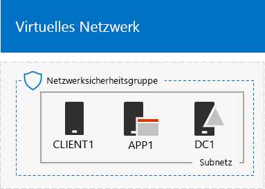
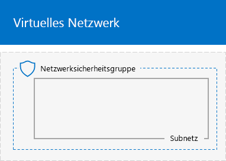
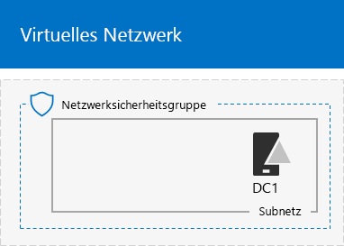
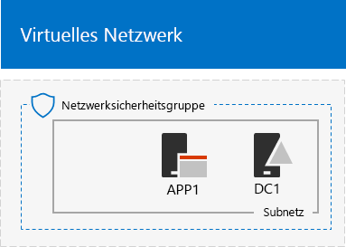

# <a name="base-configuration-devtest-environment"></a><span data-ttu-id="da1b9-103">Basiskonfiguration der Entwicklungs-/Testumgebung</span><span class="sxs-lookup"><span data-stu-id="da1b9-103">Base Configuration dev/test environment</span></span>

 <span data-ttu-id="da1b9-104">**Zusammenfassung:** Erstellen Sie ein vereinfachtes Intranet als Entwicklungs-/Testumgebung in Microsoft Azure.</span><span class="sxs-lookup"><span data-stu-id="da1b9-104">**Summary:** Create a simplified intranet as a dev/test environment in Microsoft Azure.</span></span>
  
<span data-ttu-id="da1b9-105">Dieser Artikel enthält eine schrittweise Anleitung zum Erstellen der folgenden Basiskonfiguration der Entwicklungs-/Testumgebung in Azure:</span><span class="sxs-lookup"><span data-stu-id="da1b9-105">This article provides you with step-by-step instructions to create the following Base Configuration dev/test environment in Azure:</span></span>
  
<span data-ttu-id="da1b9-106">**Abbildung 1: Die Basiskonfiguration der Entwicklungs-/Testumgebung**</span><span class="sxs-lookup"><span data-stu-id="da1b9-106">**Figure 1: The Base Configuration dev/test environment**</span></span>


  
<span data-ttu-id="da1b9-p101">Die Basiskonfiguration der Entwicklungs-/Testumgebung in Abbildung 1 besteht aus dem Unternehmensnetzwerk-Subnetz in einem auf die Cloud beschränkten virtuellen Azure-Netzwerk namens TestLab, das ein vereinfachtes privates Intranet simuliert, das mit dem Internet verbunden ist. Es enthält drei virtuelle Azure-Computer unter Windows Server 2016:</span><span class="sxs-lookup"><span data-stu-id="da1b9-p101">The Base Configuration dev/test environment in Figure 1 consists of the Corpnet subnet in a cloud-only Azure virtual network named TestLab that simulates a simplified, private intranet connected to the Internet. It contains three Azure virtual machines running WIndows Server 2016:</span></span>
  
- <span data-ttu-id="da1b9-110">DC1 ist als Intranet-Domänencontroller und DNS-Server (Domain Name System) konfiguriert.</span><span class="sxs-lookup"><span data-stu-id="da1b9-110">DC1 is configured as an intranet domain controller and Domain Name System (DNS) server</span></span>
    
- <span data-ttu-id="da1b9-111">App1 ist als allgemeiner Anwendungs- und Webserver konfiguriert.</span><span class="sxs-lookup"><span data-stu-id="da1b9-111">APP1 is configured as a general application and web server</span></span>
    
- <span data-ttu-id="da1b9-112">CLIENT1 fungiert als Intranetclient.</span><span class="sxs-lookup"><span data-stu-id="da1b9-112">CLIENT1 acts as an intranet client</span></span>
    
<span data-ttu-id="da1b9-113">Diese Konfiguration ermöglicht DC1, APP1, CLIENT1 und weiteren Computern im Unternehmensnetzwerk-Subnetz Folgendes:</span><span class="sxs-lookup"><span data-stu-id="da1b9-113">This configuration allows DC1, APP1, CLIENT1, and additional Corpnet subnet computers to be:</span></span> 
  
- <span data-ttu-id="da1b9-114">Verbindung mit dem Internet zum Installieren von Updates, Zugriff auf Internetressourcen in Echtzeit und Teilnahme an öffentlichen Cloud-Technologien wie z. B. Microsoft Office 365 und anderen Azure-Diensten.</span><span class="sxs-lookup"><span data-stu-id="da1b9-114">Connected to the Internet to install updates, access Internet resources in real time, and participate in public cloud technologies such as Microsoft Office 365 and other Azure services.</span></span>
    
- <span data-ttu-id="da1b9-115">Remoteverwaltung über Remotedesktopverbindungen von Ihrem Computer, der mit dem Internet oder dem Netzwerk Ihrer Organisation verbunden ist.</span><span class="sxs-lookup"><span data-stu-id="da1b9-115">Remotely managed using Remote Desktop connections from your computer that is connected to the Internet or your organization network.</span></span>
    
<span data-ttu-id="da1b9-116">Sie können die resultierende Testumgebung zu folgenden Zwecken verwenden:</span><span class="sxs-lookup"><span data-stu-id="da1b9-116">You can use the resulting test environment:</span></span>
  
- <span data-ttu-id="da1b9-117">Zur Anwendungsentwicklung und zum Testen.</span><span class="sxs-lookup"><span data-stu-id="da1b9-117">For application development and testing.</span></span>
    
- <span data-ttu-id="da1b9-118">Als anfängliche Konfiguration einer erweiterten Testumgebung mit Ihrem eigenen Design, die zusätzliche virtuelle Computer, Azure-Dienste oder andere Cloud-Angebote von Microsoft enthält, z. B. Office 365 and Enterprise Security + Mobility (EMS).</span><span class="sxs-lookup"><span data-stu-id="da1b9-118">As the initial configuration of an extended test environment of your own design that includes additional virtual machines, Azure services, or other Microsoft cloud offerings such as Office 365 and Enterprise Security + Mobility (EMS).</span></span>
    
<span data-ttu-id="da1b9-119">Es gibt vier Phasen bei der Einrichtung der Basiskonfiguration für die Testumgebung in Azure:</span><span class="sxs-lookup"><span data-stu-id="da1b9-119">There are four phases to setting up the Base Configuration test environment in Azure:</span></span>
  
1. <span data-ttu-id="da1b9-120">Erstellen des virtuellen Netzwerks</span><span class="sxs-lookup"><span data-stu-id="da1b9-120">Create the virtual network.</span></span>
    
2. <span data-ttu-id="da1b9-121">Konfigurieren von DC1</span><span class="sxs-lookup"><span data-stu-id="da1b9-121">Configure DC1.</span></span>
    
3. <span data-ttu-id="da1b9-122">Konfigurieren von APP1</span><span class="sxs-lookup"><span data-stu-id="da1b9-122">Configure APP1.</span></span>
    
4. <span data-ttu-id="da1b9-123">Konfigurieren von CLIENT1</span><span class="sxs-lookup"><span data-stu-id="da1b9-123">Configure CLIENT1.</span></span>
    
<span data-ttu-id="da1b9-p102">Wenn Sie noch kein Azure-Abonnement haben, können Sie sich für eine kostenlose Testversion unter [Testen von Azure](https://azure.microsoft.com/pricing/free-trial/) registrieren. Wenn Sie über ein MSDN- oder Visual Studio-Abonnement verfügen, lesen Sie die Informationen unter [Monatliche Azure-Gutschrift für Visual Studio-Abonnenten](https://azure.microsoft.com/pricing/member-offers/msdn-benefits-details/).</span><span class="sxs-lookup"><span data-stu-id="da1b9-p102">If you do not already have an Azure subscription, you can sign up for a free trial at [Try Azure](https://azure.microsoft.com/pricing/free-trial/). If you have an MSDN or Visual Studio subscription, see [Monthly Azure credit for Visual Studio subscribers](https://azure.microsoft.com/pricing/member-offers/msdn-benefits-details/).</span></span>
  
> [!NOTE]
> <span data-ttu-id="da1b9-p103">Für virtuelle Computer in Azure entstehen laufende finanzielle Kosten, wenn sie ausgeführt werden. Diese Kosten werden gegen Ihre kostenlose Testversion, Ihr MSDN-Abonnement oder Ihr kostenpflichtiges Abonnement berechnet. Weitere Informationen zu den Kosten der Ausführung virtueller Azure-Computer finden Sie unter [Preisdetails für virtuelle Computer](https://azure.microsoft.com/pricing/details/virtual-machines/) und [Azure-Preisrechner](https://azure.microsoft.com/pricing/calculator/). Informationen dazu, wie Sie die Kosten niedrig halten, finden Sie unter [Minimierung der Kosten für virtuelle Computer der Testumgebung in Azure](base-configuration-dev-test-environment.md#mincost).</span><span class="sxs-lookup"><span data-stu-id="da1b9-p103">Virtual machines in Azure incur an ongoing monetary cost when they are running. This cost is billed against your free trial, MSDN subscription, or paid subscription. For more information about the costs of running Azure virtual machines, see [Virtual Machines Pricing Details](https://azure.microsoft.com/pricing/details/virtual-machines/) and [Azure Pricing Calculator](https://azure.microsoft.com/pricing/calculator/). To keep costs down, see [Minimizing the costs of test environment virtual machines in Azure](base-configuration-dev-test-environment.md#mincost).</span></span> 
  

  
> [!TIP]
> <span data-ttu-id="da1b9-131">Klicken Sie [hier](http://aka.ms/catlgstack), um eine visuelle Darstellung aller Artikel im Stapel der Testumgebungsanleitungen in der Microsoft Cloud zu erhalten.</span><span class="sxs-lookup"><span data-stu-id="da1b9-131">Click [here](http://aka.ms/catlgstack) for a visual map to all the articles in the One Microsoft Cloud Test Lab Guide stack.</span></span>
  
## <a name="phase-1-create-the-virtual-network"></a><span data-ttu-id="da1b9-132">Phase 1: Erstellen des virtuellen Netzwerks</span><span class="sxs-lookup"><span data-stu-id="da1b9-132">Phase 1: Create the virtual network</span></span>

<span data-ttu-id="da1b9-133">Starten Sie zunächst eine Azure PowerShell-Eingabeaufforderung.</span><span class="sxs-lookup"><span data-stu-id="da1b9-133">First, start an Azure PowerShell prompt.</span></span>
  
> [!NOTE]
> <span data-ttu-id="da1b9-p104">In den folgenden Befehlssätzen wird die aktuelle Version von Azure PowerShell verwendet. Informationen dazu finden Sie unter [Erste Schritte mit Azure PowerShell-Cmdlets](https://docs.microsoft.com/de-DE/powershell/azureps-cmdlets-docs/).</span><span class="sxs-lookup"><span data-stu-id="da1b9-p104">The following command sets use the latest version of Azure PowerShell. See [Get started with Azure PowerShell cmdlets](https://docs.microsoft.com/de-DE/powershell/azureps-cmdlets-docs/).</span></span> 
  
<span data-ttu-id="da1b9-136">Melden Sie sich mit dem folgenden Befehl bei Ihrem Azure-Konto an.</span><span class="sxs-lookup"><span data-stu-id="da1b9-136">Sign in to your Azure account with the following command.</span></span>
  
```
Login-AzureRMAccount
```

> [!TIP]
> <span data-ttu-id="da1b9-137">Klicken Sie [hier](https://gallery.technet.microsoft.com/PowerShell-commands-for-ba957d3d), um eine Textdatei zu erhalten, die alle PowerShell-Befehle in diesem Artikel enthält.</span><span class="sxs-lookup"><span data-stu-id="da1b9-137">Click [here](https://gallery.technet.microsoft.com/PowerShell-commands-for-ba957d3d) to get a text file that contains all the PowerShell commands in this article.</span></span>
  
<span data-ttu-id="da1b9-138">Rufen Sie den Namen Ihres Abonnements mithilfe des folgenden Befehls ab.</span><span class="sxs-lookup"><span data-stu-id="da1b9-138">Get your subscription name using the following command.</span></span>
  
```
Get-AzureRMSubscription | Sort Name | Select Name
```

<span data-ttu-id="da1b9-p105">Tragen Sie Ihr Azure-Abonnement ein. Ersetzen Sie alles innerhalb der Anführungszeichen, einschließlich der Zeichen „<“ und „>“, durch den entsprechenden Namen.</span><span class="sxs-lookup"><span data-stu-id="da1b9-p105">Set your Azure subscription. Replace everything within the quotes, including the < and > characters, with the correct name.</span></span>
  
```
$subscr="<subscription name>"
Get-AzureRmSubscription -SubscriptionName $subscr | Select-AzureRmSubscription
```

<span data-ttu-id="da1b9-p106">Im nächsten Schritt wird eine neue Ressourcengruppe für Ihre Basiskonfiguration des Testlabors erstellt. Verwenden Sie zum Ermitteln eines eindeutigen Ressourcengruppennamens diesen Befehl, mit dem die vorhandenen Ressourcengruppen aufgeführt werden.</span><span class="sxs-lookup"><span data-stu-id="da1b9-p106">Next, create a new resource group for your Base Configuration test lab. To determine a unique resource group name, use this command to list your existing resource groups.</span></span>
  
```
Get-AzureRMResourceGroup | Sort ResourceGroupName | Select ResourceGroupName
```

<span data-ttu-id="da1b9-p107">Erstellen Sie die neue Ressourcengruppe mit diesen Befehlen. Ersetzen Sie alles innerhalb der Anführungszeichen, einschließlich der Zeichen „<“ und „>“, durch die entsprechenden Namen.</span><span class="sxs-lookup"><span data-stu-id="da1b9-p107">Create your new resource group with these commands. Replace everything within the quotes, including the < and > characters, with the correct names.</span></span>
  
```
$rgName="<resource group name>"
$locName="<location name, such as West US>"
New-AzureRMResourceGroup -Name $rgName -Location $locName
```

<span data-ttu-id="da1b9-145">Im nächsten Schritt erstellen Sie das virtuelle Netzwerk „TestLab“, das das Unternehmensnetzwerk-Subnetz der Basiskonfiguration hostet, und schützen es mit einer Netzwerksicherheitsgruppe.</span><span class="sxs-lookup"><span data-stu-id="da1b9-145">Next, you create the TestLab virtual network that will host the Corpnet subnet of the base configuration and protect it with a network security group.</span></span>
  
```
$rgName="<name of your new resource group>"
$locName=(Get-AzureRmResourceGroup -Name $rgName).Location
$corpnetSubnet=New-AzureRMVirtualNetworkSubnetConfig -Name Corpnet -AddressPrefix 10.0.0.0/24
New-AzureRMVirtualNetwork -Name TestLab -ResourceGroupName $rgName -Location $locName -AddressPrefix 10.0.0.0/8 -Subnet $corpnetSubnet -DNSServer 10.0.0.4
$rule1=New-AzureRMNetworkSecurityRuleConfig -Name "RDPTraffic" -Description "Allow RDP to all VMs on the subnet" -Access Allow -Protocol Tcp -Direction Inbound -Priority 100 -SourceAddressPrefix Internet -SourcePortRange * -DestinationAddressPrefix * -DestinationPortRange 3389
New-AzureRMNetworkSecurityGroup -Name Corpnet -ResourceGroupName $rgName -Location $locName -SecurityRules $rule1
$vnet=Get-AzureRMVirtualNetwork -ResourceGroupName $rgName -Name TestLab
$nsg=Get-AzureRMNetworkSecurityGroup -Name Corpnet -ResourceGroupName $rgName
Set-AzureRMVirtualNetworkSubnetConfig -VirtualNetwork $vnet -Name Corpnet -AddressPrefix "10.0.0.0/24" -NetworkSecurityGroup $nsg
```

<span data-ttu-id="da1b9-146">Dies ist Ihre aktuelle Konfiguration.</span><span class="sxs-lookup"><span data-stu-id="da1b9-146">This is your current configuration.</span></span>
  

  
## <a name="phase-2-configure-dc1"></a><span data-ttu-id="da1b9-148">Phase 2: Konfigurieren von DC1</span><span class="sxs-lookup"><span data-stu-id="da1b9-148">Phase 2: Configure DC1</span></span>

<span data-ttu-id="da1b9-149">In dieser Phase erstellen Sie den virtuellen Computer DC1 und konfigurieren diesen als Domänencontroller für die Windows Server Active Directory-Domäne „corp.contoso.com“ sowie einen DNS-Server für die virtuellen Computer des virtuellen Netzwerks TestLab.</span><span class="sxs-lookup"><span data-stu-id="da1b9-149">In this phase, we create the DC1 virtual machine and configure it as a domain controller for the corp.contoso.com Windows Server Active Directory (AD) domain and a DNS server for the virtual machines of the TestLab virtual network.</span></span>
  
<span data-ttu-id="da1b9-150">Geben Sie zum Erstellen eines virtuellen Azure-Computers für DC1 den Namen Ihrer Ressourcengruppe ein, und führen Sie über die Azure PowerShell-Eingabeaufforderung auf Ihrem lokalen Computer die nachfolgenden Befehle aus.</span><span class="sxs-lookup"><span data-stu-id="da1b9-150">To create an Azure virtual machine for DC1, fill in the name of your resource group and run these commands at the Azure PowerShell command prompt on your local computer.</span></span>
  
```
$rgName="<resource group name>"
$locName=(Get-AzureRmResourceGroup -Name $rgName).Location
$vnet=Get-AzureRMVirtualNetwork -Name TestLab -ResourceGroupName $rgName
$pip=New-AzureRMPublicIpAddress -Name DC1-PIP -ResourceGroupName $rgName -Location $locName -AllocationMethod Dynamic
$nic=New-AzureRMNetworkInterface -Name DC1-NIC -ResourceGroupName $rgName -Location $locName -SubnetId $vnet.Subnets[0].Id -PublicIpAddressId $pip.Id -PrivateIpAddress 10.0.0.4
$vm=New-AzureRMVMConfig -VMName DC1 -VMSize Standard_A1
$cred=Get-Credential -Message "Type the name and password of the local administrator account for DC1."
$vm=Set-AzureRMVMOperatingSystem -VM $vm -Windows -ComputerName DC1 -Credential $cred -ProvisionVMAgent -EnableAutoUpdate
$vm=Set-AzureRMVMSourceImage -VM $vm -PublisherName MicrosoftWindowsServer -Offer WindowsServer -Skus 2016-Datacenter -Version "latest"
$vm=Add-AzureRMVMNetworkInterface -VM $vm -Id $nic.Id
$vm=Set-AzureRmVMOSDisk -VM $vm -Name "DC1-OS" -DiskSizeInGB 128 -CreateOption FromImage -StorageAccountType "Standard_LRS"
$diskConfig=New-AzureRmDiskConfig -AccountType "Standard_LRS" -Location $locName -CreateOption Empty -DiskSizeGB 20
$dataDisk1=New-AzureRmDisk -DiskName "DC1-DataDisk1" -Disk $diskConfig -ResourceGroupName $rgName
$vm=Add-AzureRmVMDataDisk -VM $vm -Name "DC1-DataDisk1" -CreateOption Attach -ManagedDiskId $dataDisk1.Id -Lun 1
New-AzureRMVM -ResourceGroupName $rgName -Location $locName -VM $vm
```

<span data-ttu-id="da1b9-p108">Sie werden nach einem Benutzernamen und Kennwort für das lokale Administratorkonto auf DC1 gefragt. Verwenden Sie ein sicheres Kennwort, und notieren Sie den Namen und das Kennwort an einem sicheren Ort.</span><span class="sxs-lookup"><span data-stu-id="da1b9-p108">You will be prompted for a user name and password for the local administrator account on DC1. Use a strong password and record both the name and password in a secure location.</span></span>
  
<span data-ttu-id="da1b9-153">Stellen Sie dann eine Verbindung mit dem virtuellen Computer DC1 her.</span><span class="sxs-lookup"><span data-stu-id="da1b9-153">Next, connect to the DC1 virtual machine.</span></span>
  
### <a name="connect-to-dc1-using-local-administrator-account-credentials"></a><span data-ttu-id="da1b9-154">Herstellen einer Verbindung mit DC1 mithilfe von Anmeldeinformationen für das lokale Administratorkonto</span><span class="sxs-lookup"><span data-stu-id="da1b9-154">Connect to DC1 using local administrator account credentials</span></span>

1. <span data-ttu-id="da1b9-155">Klicken Sie im [Azure-Portal](https://portal.azure.com) auf **Ressourcengruppen >** [Name der neuen Ressourcengruppe] **> DC1 > Verbinden**.</span><span class="sxs-lookup"><span data-stu-id="da1b9-155">In the [Azure portal](https://portal.azure.com), click **Resource Groups >** [the name of your new resource group] **> DC1 > Connect**.</span></span>
    
2. <span data-ttu-id="da1b9-p109">Klicken Sie im Bereich „Öffnen“ auf  **RDP-Datei herunterladen**. Öffnen Sie die Datei „DC1.rdp“, die heruntergeladen wird, und klicken Sie dann auf **Verbinden**.</span><span class="sxs-lookup"><span data-stu-id="da1b9-p109">In the open pane, click **Download RDP file**. Open the DC1.rdp file that is downloaded, and then click **Connect**.</span></span>
    
3. <span data-ttu-id="da1b9-158">Geben Sie den Namen des lokalen DC1-Administratorkontos an:</span><span class="sxs-lookup"><span data-stu-id="da1b9-158">Specify the DC1 local administrator account name:</span></span>
    
  - <span data-ttu-id="da1b9-159">Für Windows 7:</span><span class="sxs-lookup"><span data-stu-id="da1b9-159">For Windows 7:</span></span>
    
    <span data-ttu-id="da1b9-p110">Klicken Sie im Dialogfeld **Windows-Sicherheit** auf **Anderes Konto verwenden**. Geben Sie unter **Benutzername** den Namen **DC1\\**[Kontoname des lokalen Administrators] ein.</span><span class="sxs-lookup"><span data-stu-id="da1b9-p110">In the **Windows Security** dialog box, click **Use another account**. In **User name**, type **DC1\\**[Local administrator account name].</span></span>
    
  - <span data-ttu-id="da1b9-162">Für Windows 8 oder Windows 10:</span><span class="sxs-lookup"><span data-stu-id="da1b9-162">For Windows 8 or Windows 10:</span></span>
    
    <span data-ttu-id="da1b9-p111">Klicken Sie im Dialogfeld **Windows-Sicherheit** auf **Weitere Optionen**, und klicken Sie dann auf **Anderes Konto verwenden**. Geben Sie unter **Benutzername** den Namen **DC1\\**[Kontoname des lokalen Administrators] ein.</span><span class="sxs-lookup"><span data-stu-id="da1b9-p111">In the **Windows Security** dialog box, click **More choices**, and then click **Use a different account**. In **User name**, type **DC1\\**[Local administrator account name].</span></span>
    
4. <span data-ttu-id="da1b9-165">Geben Sie unter **Kennwort** das Kennwort des lokalen Administratorkontos ein, und klicken Sie dann auf **OK**.</span><span class="sxs-lookup"><span data-stu-id="da1b9-165">In **Password**, type the password of the local administrator account, and then click **OK**.</span></span>
    
5. <span data-ttu-id="da1b9-166">Klicken Sie auf **Ja**, wenn Sie dazu aufgefordert werden.</span><span class="sxs-lookup"><span data-stu-id="da1b9-166">When prompted, click **Yes**.</span></span>
    
<span data-ttu-id="da1b9-167">Im nächsten Schritt führen Sie diesen Befehl über eine Windows PowerShell-Eingabeaufforderung mit Administratorrechten auf DC1 aus, um ein zusätzliches Datenlaufwerk als neues Volume mit dem Laufwerkbuchstaben „F:" hinzuzufügen.</span><span class="sxs-lookup"><span data-stu-id="da1b9-167">Next, add an extra data disk as a new volume with the drive letter F: with this command at an administrator-level Windows PowerShell command prompt on DC1.</span></span>
  
```
Get-Disk | Where PartitionStyle -eq "RAW" | Initialize-Disk -PartitionStyle MBR -PassThru | New-Partition -AssignDriveLetter -UseMaximumSize | Format-Volume -FileSystem NTFS -NewFileSystemLabel "WSAD Data"
```

<span data-ttu-id="da1b9-p112">Konfigurieren Sie als Nächstes DC1 als Domänencontroller und DNS-Server für die Domäne „corp.contoso.com“. Führen Sie diese Befehle an einer Windows PowerShell-Eingabeaufforderung auf Administratorebene aus.</span><span class="sxs-lookup"><span data-stu-id="da1b9-p112">Next, configure DC1 as a domain controller and DNS server for the corp.contoso.com domain. Run these commands at an administrator-level Windows PowerShell command prompt.</span></span>
  
```
Install-WindowsFeature AD-Domain-Services -IncludeManagementTools
Install-ADDSForest -DomainName corp.contoso.com -DatabasePath "F:\NTDS" -SysvolPath "F:\SYSVOL" -LogPath "F:\Logs"
```
<span data-ttu-id="da1b9-p113">Sie müssen ein Administratorkennwort für den abgesicherten Modus angeben. Bewahren Sie das Kennwort an einem sicheren Ort auf.</span><span class="sxs-lookup"><span data-stu-id="da1b9-p113">You will need to specify a safe mode administrator password. Store this password in a secure location.</span></span>
  
<span data-ttu-id="da1b9-172">Beachten Sie, dass der Abschluss dieser Befehle ein paar Minuten in Anspruch nehmen kann.</span><span class="sxs-lookup"><span data-stu-id="da1b9-172">Note that these commands can take a few minutes to complete.</span></span>
  
<span data-ttu-id="da1b9-173">Stellen Sie nach dem Neustart von DC1 wieder eine Verbindung zum virtuellen DC1-Computer her.</span><span class="sxs-lookup"><span data-stu-id="da1b9-173">After DC1 restarts, reconnect to the DC1 virtual machine.</span></span>
  
### <a name="connect-to-dc1-using-domain-credentials"></a><span data-ttu-id="da1b9-174">Herstellen einer Verbindung mit DC1 mithilfe von Domänenanmeldeinformationen</span><span class="sxs-lookup"><span data-stu-id="da1b9-174">Connect to DC1 using domain credentials</span></span>

1. <span data-ttu-id="da1b9-175">Klicken Sie im [Azure-Portal](https://portal.azure.com) auf **Ressourcengruppen >** [Ihre Ressourcengruppe] **> DC1 > Verbinden**.</span><span class="sxs-lookup"><span data-stu-id="da1b9-175">In the [Azure portal](https://portal.azure.com), click **Resource Groups >** [your resource group name] **> DC1 > Connect**.</span></span>
    
2. <span data-ttu-id="da1b9-176">Führen Sie die Datei „DC1.rdp“ aus, die heruntergeladen wurde, und klicken Sie dann auf **Verbinden**.</span><span class="sxs-lookup"><span data-stu-id="da1b9-176">Run the DC1.rdp file that is downloaded, and then click **Connect**.</span></span>
    
3. <span data-ttu-id="da1b9-p114">Klicken Sie unter **Windows-Sicherheit** auf **Anderes Konto verwenden**. Geben Sie unter **Benutzername** den Namen **CORP\\**[Kontoname des lokalen Administrators] ein.</span><span class="sxs-lookup"><span data-stu-id="da1b9-p114">In **Windows Security**, click **Use another account**. In **User name**, type **CORP\\**[Local administrator account name].</span></span>
    
4. <span data-ttu-id="da1b9-179">Geben Sie unter **Kennwort** das Kennwort des lokalen Administratorkontos ein, und klicken Sie dann auf **OK**.</span><span class="sxs-lookup"><span data-stu-id="da1b9-179">In **Password**, type the password of the local administrator account, and then click **OK**.</span></span>
    
5. <span data-ttu-id="da1b9-180">Klicken Sie auf **Ja**, wenn Sie dazu aufgefordert werden.</span><span class="sxs-lookup"><span data-stu-id="da1b9-180">When prompted, click **Yes**.</span></span>
    
<span data-ttu-id="da1b9-p115">Im nächsten Schritt erstellen Sie ein Benutzerkonto in Active Directory, das bei der Anmeldung an Mitgliedscomputern der Domäne CORP verwendet wird. Führen Sie diesen Befehl an einer Windows PowerShell-Eingabeaufforderung auf Administratorebene aus.</span><span class="sxs-lookup"><span data-stu-id="da1b9-p115">Next, create a user account in Active Directory that will be used when logging in to CORP domain member computers. Run this command at an administrator-level Windows PowerShell command prompt.</span></span>
  
```
New-ADUser -SamAccountName User1 -AccountPassword (read-host "Set user password" -assecurestring) -name "User1" -enabled $true -PasswordNeverExpires $true -ChangePasswordAtLogon $false
```

<span data-ttu-id="da1b9-p116">Beachten Sie, dass Sie von dem Befehl aufgefordert werden, das Kennwort des Kontos „User1“ anzugeben. Da dieses Konto für Remotedesktopverbindungen für alle Mitgliedscomputer der Domäne CORP verwendet wird, sollten Sie ein sicheres Kennwort wählen. Notieren Sie das Kennwort des Kontos „User1“, und bewahren Sie es an einem sicheren Ort auf.</span><span class="sxs-lookup"><span data-stu-id="da1b9-p116">Note that this command prompts you to supply the User1 account password. Because this account will be used for remote desktop connections for all CORP domain member computers, choose a strong password. Record the User1 account password and store it in a secured location.</span></span>
  
<span data-ttu-id="da1b9-p117">Konfigurieren Sie als Nächstes das neue Konto „User1“ als Unternehmensadministrator. Führen Sie diesen Befehl an der Windows PowerShell-Eingabeaufforderung auf Administratorebene aus.</span><span class="sxs-lookup"><span data-stu-id="da1b9-p117">Next, configure the new User1 account as an Enterprise Administrator. Run this command at the administrator-level Windows PowerShell command prompt.</span></span>
  
```
Add-ADPrincipalGroupMembership -Identity "CN=User1,CN=Users,DC=corp,DC=contoso,DC=com" -MemberOf "CN=Enterprise Admins,CN=Users,DC=corp,DC=contoso,DC=com","CN=Domain Admins,CN=Users,DC=corp,DC=contoso,DC=com","CN=Schema Admins,CN=Users,DC=corp,DC=contoso,DC=com"
```

<span data-ttu-id="da1b9-188">Schließen Sie die Remotedesktopsitzung mit DC1, und stellen Sie dann mit dem Konto „CORP\\User1“ wieder eine Verbindung her.</span><span class="sxs-lookup"><span data-stu-id="da1b9-188">Close the Remote Desktop session with DC1 and then reconnect using the CORP\\User1 account.</span></span>
  
<span data-ttu-id="da1b9-189">Führen Sie als Nächstes den folgenden Befehl an einer Windows PowerShell-Eingabeaufforderung auf Administratorebene aus, um Datenverkehr für das Tool Ping zuzulassen.</span><span class="sxs-lookup"><span data-stu-id="da1b9-189">Next, to allow traffic for the Ping tool, run this command at an administrator-level Windows PowerShell command prompt.</span></span>
  
```
Set-NetFirewallRule -DisplayName "File and Printer Sharing (Echo Request - ICMPv4-In)" -enabled True
```

<span data-ttu-id="da1b9-190">Dies ist Ihre aktuelle Konfiguration.</span><span class="sxs-lookup"><span data-stu-id="da1b9-190">This is your current configuration.</span></span>
  

  
## <a name="phase-3-configure-app1"></a><span data-ttu-id="da1b9-192">Phase 3: Konfigurieren von APP1</span><span class="sxs-lookup"><span data-stu-id="da1b9-192">Phase 3: Configure APP1</span></span>

<span data-ttu-id="da1b9-193">APP1 bietet Web- und Dateifreigabedienste.</span><span class="sxs-lookup"><span data-stu-id="da1b9-193">APP1 provides web and file sharing services.</span></span>

<span data-ttu-id="da1b9-194">Geben Sie zum Erstellen eines virtuellen Azure-Computers für APP1 den Namen Ihrer Ressourcengruppe ein, und führen Sie über die Azure PowerShell-Eingabeaufforderung auf Ihrem lokalen Computer die nachfolgenden Befehle aus.</span><span class="sxs-lookup"><span data-stu-id="da1b9-194">To create an Azure Virtual Machine for APP1, fill in the name of your resource group and run these commands at the Azure PowerShell command prompt on your local computer.</span></span>
  
```
$rgName="<resource group name>"
$locName=(Get-AzureRmResourceGroup -Name $rgName).Location
$vnet=Get-AzureRMVirtualNetwork -Name TestLab -ResourceGroupName $rgName
$pip=New-AzureRMPublicIpAddress -Name APP1-PIP -ResourceGroupName $rgName -Location $locName -AllocationMethod Dynamic
$nic=New-AzureRMNetworkInterface -Name APP1-NIC -ResourceGroupName $rgName -Location $locName -SubnetId $vnet.Subnets[0].Id -PublicIpAddressId $pip.Id
$vm=New-AzureRMVMConfig -VMName APP1 -VMSize Standard_A1
$cred=Get-Credential -Message "Type the name and password of the local administrator account for APP1."
$vm=Set-AzureRMVMOperatingSystem -VM $vm -Windows -ComputerName APP1 -Credential $cred -ProvisionVMAgent -EnableAutoUpdate
$vm=Set-AzureRMVMSourceImage -VM $vm -PublisherName MicrosoftWindowsServer -Offer WindowsServer -Skus 2016-Datacenter -Version "latest"
$vm=Add-AzureRMVMNetworkInterface -VM $vm -Id $nic.Id
$vm=Set-AzureRmVMOSDisk -VM $vm -Name "APP1-OS" -DiskSizeInGB 128 -CreateOption FromImage -StorageAccountType "Standard_LRS"
New-AzureRMVM -ResourceGroupName $rgName -Location $locName -VM $vm
```

<span data-ttu-id="da1b9-195">Im nächsten Schritt stellen Sie eine Verbindung mit dem virtuellen Computer APP1 mit dem Kontonamen und Kennwort des lokalen Administratorkontos von APP1 her und öffnen dann eine Windows PowerShell-Eingabeaufforderung.</span><span class="sxs-lookup"><span data-stu-id="da1b9-195">Next, connect to the APP1 virtual machine using the APP1 local administrator account name and password, and then open a Windows PowerShell command prompt.</span></span>
  
<span data-ttu-id="da1b9-196">Führen Sie zum Überprüfen der Namensauflösung und der Netzwerkkommunikation zwischen APP1 und DC1 den Befehl **ping dc1.corp.contoso.com** aus, und vergewissern Sie sich, dass vier Antworten vorhanden sind.</span><span class="sxs-lookup"><span data-stu-id="da1b9-196">To check name resolution and network communication between APP1 and DC1, run the **ping dc1.corp.contoso.com** command and verify that there are four replies.</span></span>
  
<span data-ttu-id="da1b9-197">Verknüpfen Sie als Nächstes unter Verwendung der folgenden Befehle an der Windows PowerShell-Eingabeaufforderung den virtuellen Computer APP1 mit der Domäne CORP.</span><span class="sxs-lookup"><span data-stu-id="da1b9-197">Next, join the APP1 virtual machine to the CORP domain with these commands at the Windows PowerShell prompt.</span></span>
  
```
Add-Computer -DomainName corp.contoso.com
Restart-Computer
```

<span data-ttu-id="da1b9-198">Beachten Sie, dass Sie nach der Ausführung des Befehls **Add-Computer** die Anmeldeinformationen für das Domänenkonto „CORP\\User1“ eingeben müssen.</span><span class="sxs-lookup"><span data-stu-id="da1b9-198">Note that you must supply the CORP\\User1 domain account credentials after running the **Add-Computer** command.</span></span>
  
<span data-ttu-id="da1b9-199">Stellen Sie nach dem Neustart von APP1 eine Verbindung über das Konto „CORP\\User1“ damit her, und öffnen Sie dann eine Windows PowerShell-Eingabeaufforderung auf Administratorebene.</span><span class="sxs-lookup"><span data-stu-id="da1b9-199">After APP1 restarts, connect to it using the CORP\\User1 account, and then open an administrator-level Windows PowerShell command prompt.</span></span>
  
<span data-ttu-id="da1b9-200">Im nächsten Schritt richten Sie APP1 mit dem folgenden Befehl in der Windows PowerShell-Eingabeaufforderung auf APP1 als Webserver ein.</span><span class="sxs-lookup"><span data-stu-id="da1b9-200">Next, make APP1 a web server with this command at the Windows PowerShell command prompt on APP1.</span></span>
  
```
Install-WindowsFeature Web-WebServer -IncludeManagementTools
```

<span data-ttu-id="da1b9-201">Erstellen Sie als Nächstes einen freigegebenen Ordner und eine Textdatei innerhalb des Ordners auf APP1 mit diesen PowerShell-Befehlen.</span><span class="sxs-lookup"><span data-stu-id="da1b9-201">Next, create a shared folder and a text file within the folder on APP1 with these PowerShell commands.</span></span>
  
```
New-Item -path c:\files -type directory
Write-Output "This is a shared file." | out-file c:\files\example.txt
New-SmbShare -name files -path c:\files -changeaccess CORP\User1
```

<span data-ttu-id="da1b9-202">Dies ist Ihre aktuelle Konfiguration.</span><span class="sxs-lookup"><span data-stu-id="da1b9-202">This is your current configuration.</span></span>
  

  
## <a name="phase-4-configure-client1"></a><span data-ttu-id="da1b9-204">Phase 4: Konfigurieren von CLIENT1</span><span class="sxs-lookup"><span data-stu-id="da1b9-204">Phase 4: Configure CLIENT1</span></span>

<span data-ttu-id="da1b9-205">CLIENT1 fungiert als normaler Laptop-, Tablet- oder Desktopcomputer im Intranet von Contoso.</span><span class="sxs-lookup"><span data-stu-id="da1b9-205">CLIENT1 acts as a typical laptop, tablet, or desktop computer on the Contoso intranet.</span></span>

> [!NOTE]  
> <span data-ttu-id="da1b9-p118">Der folgende Befehlssatz erstellt CLIENT1 unter Windows Server 2016 Datacenter. Er gilt für alle Arten von Azure-Abonnements. Wenn Sie über ein Visual Studio-basiertes Azure-Abonnement verfügen, können Sie CLIENT1 unter Windows 10 mit dem [Azure-Portal](https://portal.azure.com) erstellen.</span><span class="sxs-lookup"><span data-stu-id="da1b9-p118">The following command set creates CLIENT1 running Windows Server 2016 Datacenter, which can be done for all types of Azure subscriptions. If you have an Visual Studio-based Azure subscription, you can create CLIENT1 running Windows 10 with the [Azure portal](https://portal.azure.com).</span></span> 
  
<span data-ttu-id="da1b9-208">Geben Sie zum Erstellen eines virtuellen Azure-Computers für CLIENT1 den Namen Ihrer Ressourcengruppe ein, und führen Sie über die Azure PowerShell-Eingabeaufforderung auf Ihrem lokalen Computer die nachfolgenden Befehle aus.</span><span class="sxs-lookup"><span data-stu-id="da1b9-208">To create an Azure Virtual Machine for CLIENT1, fill in the name of your resource group and run these commands at the Azure PowerShell command prompt on your local computer.</span></span>
  
```
$rgName="<resource group name>"
$locName=(Get-AzureRmResourceGroup -Name $rgName).Location
$vnet=Get-AzureRMVirtualNetwork -Name TestLab -ResourceGroupName $rgName
$pip=New-AzureRMPublicIpAddress -Name CLIENT1-PIP -ResourceGroupName $rgName -Location $locName -AllocationMethod Dynamic
$nic=New-AzureRMNetworkInterface -Name CLIENT1-NIC -ResourceGroupName $rgName -Location $locName -SubnetId $vnet.Subnets[0].Id -PublicIpAddressId $pip.Id
$vm=New-AzureRMVMConfig -VMName CLIENT1 -VMSize Standard_A1
$cred=Get-Credential -Message "Type the name and password of the local administrator account for CLIENT1."
$vm=Set-AzureRMVMOperatingSystem -VM $vm -Windows -ComputerName CLIENT1 -Credential $cred -ProvisionVMAgent -EnableAutoUpdate
$vm=Set-AzureRMVMSourceImage -VM $vm -PublisherName MicrosoftWindowsServer -Offer WindowsServer -Skus 2016-Datacenter -Version "latest"
$vm=Add-AzureRMVMNetworkInterface -VM $vm -Id $nic.Id
$vm=Set-AzureRmVMOSDisk -VM $vm -Name "CLIENT1-OS" -DiskSizeInGB 128 -CreateOption FromImage -StorageAccountType "Standard_LRS"
New-AzureRMVM -ResourceGroupName $rgName -Location $locName -VM $vm
```

<span data-ttu-id="da1b9-209">Im nächsten Schritt stellen Sie eine Verbindung mit dem virtuellen Computer CLIENT1 mit dem Kontonamen und Kennwort des lokalen Administratorkontos von CLIENT1 her und öffnen dann eine Windows PowerShell-Eingabeaufforderung auf Administratorebene.</span><span class="sxs-lookup"><span data-stu-id="da1b9-209">Next, connect to the CLIENT1 virtual machine using the CLIENT1 local administrator account name and password, and then open an administrator-level Windows PowerShell command prompt.</span></span>
  
<span data-ttu-id="da1b9-210">Führen Sie zum Überprüfen der Namensauflösung und der Netzwerkkommunikation zwischen CLIENT1 und DC1 den Befehl **ping dc1.corp.contoso.com** an einer Windows PowerShell-Eingabeaufforderung aus, und vergewissern Sie sich, dass vier Antworten vorhanden sind.</span><span class="sxs-lookup"><span data-stu-id="da1b9-210">To check name resolution and network communication between CLIENT1 and DC1, run the **ping dc1.corp.contoso.com** command at a Windows PowerShell command prompt and verify that there are four replies.</span></span>
  
<span data-ttu-id="da1b9-211">Verknüpfen Sie als Nächstes unter Verwendung der folgenden Befehle an der Windows PowerShell-Eingabeaufforderung den virtuellen Computer CLIENT1 mit der Domäne CORP.</span><span class="sxs-lookup"><span data-stu-id="da1b9-211">Next, join the CLIENT1 virtual machine to the CORP domain with these commands at the Windows PowerShell prompt.</span></span>
  
```
Add-Computer -DomainName corp.contoso.com
Restart-Computer
```

<span data-ttu-id="da1b9-212">Beachten Sie, dass Sie nach der Ausführung des Befehls **Add-Computer** Ihre Anmeldeinformationen für das Domänenkonto „CORP\\User1“ eingeben müssen.</span><span class="sxs-lookup"><span data-stu-id="da1b9-212">Note that you must supply your CORP\\User1 domain account credentials after running the **Add-Computer** command.</span></span>
  
<span data-ttu-id="da1b9-213">Stellen Sie nach dem Neustart von CLIENT1 eine Verbindung über den Kontonamen und das Kennwort von „CORP\\User1“ damit her, und öffnen Sie dann eine Windows PowerShell-Eingabeaufforderung auf Administratorebene.</span><span class="sxs-lookup"><span data-stu-id="da1b9-213">After CLIENT1 restarts, connect to it using the CORP\\User1 account name and password, and then open an administrator-level Windows PowerShell command prompt.</span></span>
  
<span data-ttu-id="da1b9-214">Überprüfen Sie im nächsten Schritt, ob Sie von CLIENT1 aus auf Web- und Dateifreigaberessourcen auf APP1 zugreifen können.</span><span class="sxs-lookup"><span data-stu-id="da1b9-214">Next, verify that you can access web and file share resources on APP1 from CLIENT1.</span></span>
  
### <a name="verify-client-access-to-app1"></a><span data-ttu-id="da1b9-215">Überprüfen des Clientzugriffs auf APP1</span><span class="sxs-lookup"><span data-stu-id="da1b9-215">Verify CLIENT access to APP1</span></span>

1. <span data-ttu-id="da1b9-216">Klicken Sie im Server-Manager im Strukturbereich auf **Lokaler Server**.</span><span class="sxs-lookup"><span data-stu-id="da1b9-216">In Server Manager, in the tree pane, click **Local Server**.</span></span>
    
2. <span data-ttu-id="da1b9-217">Klicken Sie in **Eigenschaften für CLIENT1** neben **Verstärkte Sicherheitskonfiguration für IE** auf **Ein**.</span><span class="sxs-lookup"><span data-stu-id="da1b9-217">In **Properties for CLIENT1**, click **On** next to **IE Enhanced Security Configuration**.</span></span>
    
3. <span data-ttu-id="da1b9-218">Klicken Sie unter **Verstärkte Sicherheitskonfiguration für Internet Explorer** für **Administratoren** und für **Benutzer** auf **Aus**, und klicken Sie dann auf **OK**.</span><span class="sxs-lookup"><span data-stu-id="da1b9-218">In **Internet Explorer Enhanced Security Configuration**, click **Off** for **Administrators** and **Users**, and then click **OK**.</span></span>
    
4. <span data-ttu-id="da1b9-219">Klicken Sie auf dem Startbildschirm auf **Internet Explorer** und dann auf **OK**.</span><span class="sxs-lookup"><span data-stu-id="da1b9-219">From the Start screen, click **Internet Explorer**, and then click **OK**.</span></span>
    
5. <span data-ttu-id="da1b9-p119">Geben Sie in der Adressleiste **http:\///app1.corp.contoso.com/** ein, und drücken Sie dann die EINGABETASTE. Nun sollte die standardmäßige Internetinformationsdienste-Webseite für APP1 angezeigt werden.</span><span class="sxs-lookup"><span data-stu-id="da1b9-p119">In the Address bar, type **http:\//app1.corp.contoso.com/**, and then press ENTER. You should see the default Internet Information Services web page for APP1.</span></span>
    
6. <span data-ttu-id="da1b9-222">Klicken Sie auf der Desktop-Taskleiste auf das Symbol für den Datei-Explorer.</span><span class="sxs-lookup"><span data-stu-id="da1b9-222">From the desktop taskbar, click the File Explorer icon.</span></span>
    
7. <span data-ttu-id="da1b9-p120">Geben Sie in der Adressleiste **\\\\app1\\Files** ein, und drücken Sie dann die EINGABETASTE. Nun sollte ein Ordnerfenster mit dem Inhalt des freigegebenen Ordners „Files“ angezeigt werden.</span><span class="sxs-lookup"><span data-stu-id="da1b9-p120">In the address bar, type **\\\\app1\\Files**, and then press ENTER. You should see a folder window with the contents of the Files shared folder.</span></span>
    
8. <span data-ttu-id="da1b9-p121">Doppelklicken Sie im Fenster des freigegebenen Ordners **Files** auf die Datei **Example.txt**. Nun sollte der Inhalt der Datei „Example.txt“ angezeigt werden.</span><span class="sxs-lookup"><span data-stu-id="da1b9-p121">In the **Files** shared folder window, double-click the **Example.txt** file. You should see the contents of the Example.txt file.</span></span>
    
9. <span data-ttu-id="da1b9-227">Schließen Sie das Fenster **example.txt - Editor** und das Fenster des freigegebenen Ordners **Files**.</span><span class="sxs-lookup"><span data-stu-id="da1b9-227">Close the **example.txt - Notepad** and the **Files** shared folder windows.</span></span>
    
<span data-ttu-id="da1b9-228">Dies ist Ihre endgültige Konfiguration.</span><span class="sxs-lookup"><span data-stu-id="da1b9-228">This is your final configuration.</span></span>
  

  
<span data-ttu-id="da1b9-230">Die Basiskonfiguration in Azure kann nun für die Anwendungsentwicklung und zum Testen oder für die Erstellung zusätzlicher Testumgebungen verwendet werden.</span><span class="sxs-lookup"><span data-stu-id="da1b9-230">Your Base Configuration in Azure is now ready for application development and testing or for building additional test environments.</span></span> 
  
> [!TIP]
> <span data-ttu-id="da1b9-231">Klicken Sie [hier](http://aka.ms/catlgstack), um eine visuelle Darstellung aller Artikel im Stapel der Testumgebungsanleitungen in der Microsoft Cloud zu erhalten.</span><span class="sxs-lookup"><span data-stu-id="da1b9-231">Click [here](http://aka.ms/catlgstack) for a visual map to all of the articles in the One Microsoft Cloud Test Lab Guide stack.</span></span>
  
<span data-ttu-id="da1b9-232"><a name="mincost"> </a></span><span class="sxs-lookup"><span data-stu-id="da1b9-232"><a name="mincost"> </a></span></span>
## <a name="minimizing-the-costs-of-test-environment-virtual-machines-in-azure"></a><span data-ttu-id="da1b9-233">Minimierung der Kosten für virtuelle Computer der Testumgebung in Azure</span><span class="sxs-lookup"><span data-stu-id="da1b9-233">Minimizing the costs of test environment virtual machines in Azure</span></span>

<span data-ttu-id="da1b9-234">Um die Kosten für die Ausführung der virtuellen Computer der Testumgebung zu minimieren, können Sie eine der folgenden Aktionen ausführen:</span><span class="sxs-lookup"><span data-stu-id="da1b9-234">To minimize the cost of running the test environment virtual machines, you can do one of the following:</span></span>
  
- <span data-ttu-id="da1b9-p122">Erstellen Sie die Testumgebung, und führen Sie Ihre benötigten Tests und Demonstrationen so schnell wie möglich aus. Nach Abschluss des Vorgangs löschen Sie die Ressourcengruppe für die Testumgebung.</span><span class="sxs-lookup"><span data-stu-id="da1b9-p122">Create the test environment and perform your needed testing and demonstration as quickly as possible. When complete, delete the resource group for the test environment.</span></span>
    
- <span data-ttu-id="da1b9-237">Fahren Sie die virtuellen Computer der Testumgebung in den Zustand der aufgehobenen Zuordnung herunter.</span><span class="sxs-lookup"><span data-stu-id="da1b9-237">Shut down your test environment virtual machines into a deallocated state.</span></span>
    
<span data-ttu-id="da1b9-238">Um die virtuellen Computer mit Azure PowerShell herunterzufahren, geben Sie den Ressourcengruppennamen ein und führen die folgenden Befehle aus.</span><span class="sxs-lookup"><span data-stu-id="da1b9-238">To shut down the virtual machines with Azure PowerShell, fill in the resource group name and run these commands.</span></span>
  
```
$rgName="<your resource group name>"
Stop-AzureRMVM -ResourceGroupName $rgName -Name "CLIENT1" -Force
Stop-AzureRMVM -ResourceGroupName $rgName -Name "APP1" -Force
Stop-AzureRMVM -ResourceGroupName $rgName -Name "DC1" -Force
```

<span data-ttu-id="da1b9-239">Damit Ihre virtuellen Computer einwandfrei funktionieren, wenn alle aus dem beendeten Zustand (Zuordnung aufgehoben) gestartet werden, sollten Sie sie in der folgenden Reihenfolge starten:</span><span class="sxs-lookup"><span data-stu-id="da1b9-239">To ensure that your virtual machines work properly when starting all of them from the Stopped (Deallocated) state, you should start them in the following order:</span></span>
  
1. <span data-ttu-id="da1b9-240">DC1</span><span class="sxs-lookup"><span data-stu-id="da1b9-240">DC1</span></span>
2. <span data-ttu-id="da1b9-241">APP1</span><span class="sxs-lookup"><span data-stu-id="da1b9-241">APP1</span></span>
3. <span data-ttu-id="da1b9-242">CLIENT1</span><span class="sxs-lookup"><span data-stu-id="da1b9-242">CLIENT1</span></span>
    
<span data-ttu-id="da1b9-243">Um die virtuellen Computer in der richtigen Reihenfolge mit Azure PowerShell zu starten, geben Sie den Ressourcengruppennamen ein und führen die folgenden Befehle aus.</span><span class="sxs-lookup"><span data-stu-id="da1b9-243">To start the virtual machines in order with Azure PowerShell, fill in the resource group name and run these commands.</span></span>
  
```
$rgName="<your resource group name>"
Start-AzureRMVM -ResourceGroupName $rgName -Name "DC1"
Start-AzureRMVM -ResourceGroupName $rgName -Name "APP1"
Start-AzureRMVM -ResourceGroupName $rgName -Name "CLIENT1"
```

## <a name="see-also"></a><span data-ttu-id="da1b9-244">Siehe auch</span><span class="sxs-lookup"><span data-stu-id="da1b9-244">See Also</span></span>

- [<span data-ttu-id="da1b9-245">Office 365-Entwicklungs-/Testumgebung</span><span class="sxs-lookup"><span data-stu-id="da1b9-245">Office 365 dev/test environment</span></span>](office-365-dev-test-environment.md)
- [<span data-ttu-id="da1b9-246">DirSync für die Office 365-Entwicklungs-/Testumgebung</span><span class="sxs-lookup"><span data-stu-id="da1b9-246">DirSync for your Office 365 dev/test environment</span></span>](dirsync-for-your-office-365-dev-test-environment.md)
- [<span data-ttu-id="da1b9-247">Cloud App Security für Ihre Office 365-Entwicklungs-/Testumgebung</span><span class="sxs-lookup"><span data-stu-id="da1b9-247">Cloud App Security for your Office 365 dev/test environment</span></span>](cloud-app-security-for-your-office-365-dev-test-environment.md)
- [<span data-ttu-id="da1b9-248">Advanced Threat Protection für die Office 365-Entwicklungs-/Testumgebung</span><span class="sxs-lookup"><span data-stu-id="da1b9-248">Advanced Threat Protection for your Office 365 dev/test environment</span></span>](advanced-threat-protection-for-your-office-365-dev-test-environment.md)
- [<span data-ttu-id="da1b9-249">Cloudakzeptanz und Hybridlösungen</span><span class="sxs-lookup"><span data-stu-id="da1b9-249">Cloud adoption and hybrid solutions</span></span>](cloud-adoption-and-hybrid-solutions.md)
