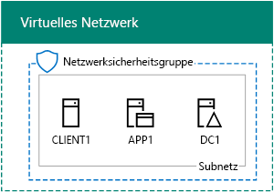
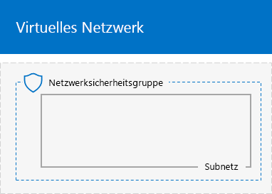
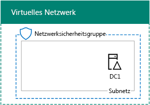
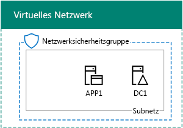

# <a name="base-configuration-devtest-environment"></a>Basiskonfiguration der Entwicklungs-/Testumgebung

 **Zusammenfassung:** Erstellen Sie ein vereinfachtes Intranet als Entwicklungs-/Testumgebung in Microsoft Azure.
  
Dieser Artikel enthält eine schrittweise Anleitung zum Erstellen der folgenden Basiskonfiguration der Entwicklungs-/Testumgebung in Azure:
  
**Abbildung 1: Die Basiskonfiguration der Entwicklungs-/Testumgebung**


  
Die Basiskonfiguration der Entwicklungs-/Testumgebung in Abbildung 1 besteht aus dem Unternehmensnetzwerk-Subnetz in einem auf die Cloud beschränkten virtuellen Azure-Netzwerk namens TestLab, das ein vereinfachtes privates Intranet simuliert, das mit dem Internet verbunden ist. Es enthält drei virtuelle Azure-Computer unter Windows Server 2016:
  
- DC1 ist als Intranet-Domänencontroller und DNS-Server (Domain Name System) konfiguriert.
    
- App1 ist als allgemeiner Anwendungs- und Webserver konfiguriert.
    
- CLIENT1 fungiert als Intranetclient.
    
Diese Konfiguration ermöglicht DC1, APP1, CLIENT1 und weiteren Computern im Unternehmensnetzwerk-Subnetz Folgendes: 
  
- Verbindung mit dem Internet zum Installieren von Updates, Zugriff auf Internetressourcen in Echtzeit und Teilnahme an öffentlichen Cloud-Technologien wie z. B. Microsoft Office 365 und anderen Azure-Diensten.
    
- Remoteverwaltung über Remotedesktopverbindungen von Ihrem Computer, der mit dem Internet oder dem Netzwerk Ihrer Organisation verbunden ist.
    
Sie können die resultierende Testumgebung zu folgenden Zwecken verwenden:
  
- Zur Anwendungsentwicklung und zum Testen.
    
- Als anfängliche Konfiguration einer erweiterten Testumgebung mit Ihrem eigenen Design, die zusätzliche virtuelle Computer, Azure-Dienste oder andere Cloud-Angebote von Microsoft enthält, z. B. Office 365 and Enterprise Security + Mobility (EMS).
    
Es gibt vier Phasen bei der Einrichtung der Basiskonfiguration für die Testumgebung in Azure:
  
1. Erstellen des virtuellen Netzwerks
    
2. Konfigurieren von DC1
    
3. Konfigurieren von APP1
    
4. Konfigurieren von CLIENT1
    
Wenn Sie noch kein Azure-Abonnement haben, können Sie sich für eine kostenlose Testversion unter [Testen von Azure](https://azure.microsoft.com/pricing/free-trial/) registrieren. Wenn Sie über ein MSDN- oder Visual Studio-Abonnement verfügen, lesen Sie die Informationen unter [Monatliche Azure-Gutschrift für Visual Studio-Abonnenten](https://azure.microsoft.com/pricing/member-offers/msdn-benefits-details/).
  
> [!NOTE]
> Für virtuelle Computer in Azure entstehen laufende finanzielle Kosten, wenn sie ausgeführt werden. Diese Kosten werden gegen Ihre kostenlose Testversion, Ihr MSDN-Abonnement oder Ihr kostenpflichtiges Abonnement berechnet. Weitere Informationen zu den Kosten der Ausführung virtueller Azure-Computer finden Sie unter [Preisdetails für virtuelle Computer](https://azure.microsoft.com/pricing/details/virtual-machines/) und [Azure-Preisrechner](https://azure.microsoft.com/pricing/calculator/). Informationen dazu, wie Sie die Kosten niedrig halten, finden Sie unter [Minimierung der Kosten für virtuelle Computer der Testumgebung in Azure](base-configuration-dev-test-environment.md#mincost). 
  

  
> [!TIP]
> Klicken Sie [hier](http://aka.ms/catlgstack), um eine visuelle Darstellung aller Artikel im Stapel der Testumgebungsanleitungen in der Microsoft Cloud zu erhalten.
  
## <a name="phase-1-create-the-virtual-network"></a>Phase 1: Erstellen des virtuellen Netzwerks

Starten Sie zunächst eine Azure PowerShell-Eingabeaufforderung.
  
> [!NOTE]
> In den folgenden Befehlssätzen wird die aktuelle Version von Azure PowerShell verwendet. Informationen dazu finden Sie unter [Erste Schritte mit Azure PowerShell-Cmdlets](https://docs.microsoft.com/de-DE/powershell/azureps-cmdlets-docs/). 
  
Melden Sie sich mit dem folgenden Befehl bei Ihrem Azure-Konto an.
  
```
Login-AzureRMAccount
```

> [!TIP]
> Klicken Sie [hier](https://gallery.technet.microsoft.com/PowerShell-commands-for-ba957d3d), um eine Textdatei zu erhalten, die alle PowerShell-Befehle in diesem Artikel enthält.
  
Rufen Sie den Namen Ihres Abonnements mithilfe des folgenden Befehls ab.
  
```
Get-AzureRMSubscription | Sort Name | Select Name
```

Tragen Sie Ihr Azure-Abonnement ein. Ersetzen Sie alles innerhalb der Anführungszeichen, einschließlich der Zeichen „<“ und „>“, durch den entsprechenden Namen.
  
```
$subscr="<subscription name>"
Get-AzureRmSubscription -SubscriptionName $subscr | Select-AzureRmSubscription
```

Im nächsten Schritt wird eine neue Ressourcengruppe für Ihre Basiskonfiguration des Testlabors erstellt. Verwenden Sie zum Ermitteln eines eindeutigen Ressourcengruppennamens diesen Befehl, mit dem die vorhandenen Ressourcengruppen aufgeführt werden.
  
```
Get-AzureRMResourceGroup | Sort ResourceGroupName | Select ResourceGroupName
```

Erstellen Sie die neue Ressourcengruppe mit diesen Befehlen. Ersetzen Sie alles innerhalb der Anführungszeichen, einschließlich der Zeichen „<“ und „>“, durch die entsprechenden Namen.
  
```
$rgName="<resource group name>"
$locName="<location name, such as West US>"
New-AzureRMResourceGroup -Name $rgName -Location $locName
```

Im nächsten Schritt erstellen Sie das virtuelle Netzwerk „TestLab“, das das Unternehmensnetzwerk-Subnetz der Basiskonfiguration hostet, und schützen es mit einer Netzwerksicherheitsgruppe.
  
```
$rgName="<name of your new resource group>"
$locName=(Get-AzureRmResourceGroup -Name $rgName).Location
$corpnetSubnet=New-AzureRMVirtualNetworkSubnetConfig -Name Corpnet -AddressPrefix 10.0.0.0/24
New-AzureRMVirtualNetwork -Name TestLab -ResourceGroupName $rgName -Location $locName -AddressPrefix 10.0.0.0/8 -Subnet $corpnetSubnet -DNSServer 10.0.0.4
$rule1=New-AzureRMNetworkSecurityRuleConfig -Name "RDPTraffic" -Description "Allow RDP to all VMs on the subnet" -Access Allow -Protocol Tcp -Direction Inbound -Priority 100 -SourceAddressPrefix Internet -SourcePortRange * -DestinationAddressPrefix * -DestinationPortRange 3389
New-AzureRMNetworkSecurityGroup -Name Corpnet -ResourceGroupName $rgName -Location $locName -SecurityRules $rule1
$vnet=Get-AzureRMVirtualNetwork -ResourceGroupName $rgName -Name TestLab
$nsg=Get-AzureRMNetworkSecurityGroup -Name Corpnet -ResourceGroupName $rgName
Set-AzureRMVirtualNetworkSubnetConfig -VirtualNetwork $vnet -Name Corpnet -AddressPrefix "10.0.0.0/24" -NetworkSecurityGroup $nsg
```

Dies ist Ihre aktuelle Konfiguration.
  

  
## <a name="phase-2-configure-dc1"></a>Phase 2: Konfigurieren von DC1

In dieser Phase erstellen Sie den virtuellen Computer DC1 und konfigurieren diesen als Domänencontroller für die Windows Server Active Directory-Domäne „corp.contoso.com“ sowie einen DNS-Server für die virtuellen Computer des virtuellen Netzwerks TestLab.
  
Geben Sie zum Erstellen eines virtuellen Azure-Computers für DC1 den Namen Ihrer Ressourcengruppe ein, und führen Sie über die Azure PowerShell-Eingabeaufforderung auf Ihrem lokalen Computer die nachfolgenden Befehle aus.
  
```
$rgName="<resource group name>"
$locName=(Get-AzureRmResourceGroup -Name $rgName).Location
$vnet=Get-AzureRMVirtualNetwork -Name TestLab -ResourceGroupName $rgName
$pip=New-AzureRMPublicIpAddress -Name DC1-PIP -ResourceGroupName $rgName -Location $locName -AllocationMethod Dynamic
$nic=New-AzureRMNetworkInterface -Name DC1-NIC -ResourceGroupName $rgName -Location $locName -SubnetId $vnet.Subnets[0].Id -PublicIpAddressId $pip.Id -PrivateIpAddress 10.0.0.4
$vm=New-AzureRMVMConfig -VMName DC1 -VMSize Standard_A1
$cred=Get-Credential -Message "Type the name and password of the local administrator account for DC1."
$vm=Set-AzureRMVMOperatingSystem -VM $vm -Windows -ComputerName DC1 -Credential $cred -ProvisionVMAgent -EnableAutoUpdate
$vm=Set-AzureRMVMSourceImage -VM $vm -PublisherName MicrosoftWindowsServer -Offer WindowsServer -Skus 2016-Datacenter -Version "latest"
$vm=Add-AzureRMVMNetworkInterface -VM $vm -Id $nic.Id
$vm=Set-AzureRmVMOSDisk -VM $vm -Name "DC1-OS" -DiskSizeInGB 128 -CreateOption FromImage -StorageAccountType StandardLRS
$diskConfig=New-AzureRmDiskConfig -AccountType StandardLRS -Location $locName -CreateOption Empty -DiskSizeGB 20
$dataDisk1=New-AzureRmDisk -DiskName "DC1-DataDisk1" -Disk $diskConfig -ResourceGroupName $rgName
$vm=Add-AzureRmVMDataDisk -VM $vm -Name "DC1-DataDisk1" -CreateOption Attach -ManagedDiskId $dataDisk1.Id -Lun 1
New-AzureRMVM -ResourceGroupName $rgName -Location $locName -VM $vm
```

Sie werden nach einem Benutzernamen und Kennwort für das lokale Administratorkonto auf DC1 gefragt. Verwenden Sie ein sicheres Kennwort, und notieren Sie den Namen und das Kennwort an einem sicheren Ort.
  
Stellen Sie dann eine Verbindung mit dem virtuellen Computer DC1 her.
  
### <a name="connect-to-dc1-using-local-administrator-account-credentials"></a>Herstellen einer Verbindung mit DC1 mithilfe von Anmeldeinformationen für das lokale Administratorkonto

1. Klicken Sie im [Azure-Portal](https://portal.azure.com) auf **Ressourcengruppen >** [Name der neuen Ressourcengruppe] **> DC1 > Verbinden**.
    
2. Klicken Sie im Bereich „Öffnen“ auf  **RDP-Datei herunterladen**. Öffnen Sie die Datei „DC1.rdp“, die heruntergeladen wird, und klicken Sie dann auf **Verbinden**.
    
3. Geben Sie den Namen des lokalen DC1-Administratorkontos an:
    
  - Für Windows 7:
    
    Klicken Sie im Dialogfeld **Windows-Sicherheit** auf **Anderes Konto verwenden**. Geben Sie unter **Benutzername** den Namen **DC1\\**[Kontoname des lokalen Administrators] ein.
    
  - Für Windows 8 oder Windows 10:
    
    Klicken Sie im Dialogfeld **Windows-Sicherheit** auf **Weitere Optionen**, und klicken Sie dann auf **Anderes Konto verwenden**. Geben Sie unter **Benutzername** den Namen **DC1\\**[Kontoname des lokalen Administrators] ein.
    
4. Geben Sie unter **Kennwort** das Kennwort des lokalen Administratorkontos ein, und klicken Sie dann auf **OK**.
    
5. Klicken Sie auf **Ja**, wenn Sie dazu aufgefordert werden.
    
Im nächsten Schritt führen Sie diesen Befehl über eine Windows PowerShell-Eingabeaufforderung mit Administratorrechten auf DC1 aus, um ein zusätzliches Datenlaufwerk als neues Volume mit dem Laufwerkbuchstaben „F:" hinzuzufügen.
  
```
Get-Disk | Where PartitionStyle -eq "RAW" | Initialize-Disk -PartitionStyle MBR -PassThru | New-Partition -AssignDriveLetter -UseMaximumSize | Format-Volume -FileSystem NTFS -NewFileSystemLabel "WSAD Data"
```

Konfigurieren Sie als Nächstes DC1 als Domänencontroller und DNS-Server für die Domäne „corp.contoso.com“. Führen Sie diese Befehle an einer Windows PowerShell-Eingabeaufforderung auf Administratorebene aus.
  
```
Install-WindowsFeature AD-Domain-Services -IncludeManagementTools
Install-ADDSForest -DomainName corp.contoso.com -DatabasePath "F:\NTDS" -SysvolPath "F:\SYSVOL" -LogPath "F:\Logs"
```
Sie müssen ein Administratorkennwort für den abgesicherten Modus angeben. Bewahren Sie das Kennwort an einem sicheren Ort auf.
  
Beachten Sie, dass der Abschluss dieser Befehle ein paar Minuten in Anspruch nehmen kann.
  
Stellen Sie nach dem Neustart von DC1 wieder eine Verbindung zum virtuellen DC1-Computer her.
  
### <a name="connect-to-dc1-using-domain-credentials"></a>Herstellen einer Verbindung mit DC1 mithilfe von Domänenanmeldeinformationen

1. Klicken Sie im [Azure-Portal](https://portal.azure.com) auf **Ressourcengruppen >** [Ihre Ressourcengruppe] **> DC1 > Verbinden**.
    
2. Führen Sie die Datei „DC1.rdp“ aus, die heruntergeladen wurde, und klicken Sie dann auf **Verbinden**.
    
3. Klicken Sie unter **Windows-Sicherheit** auf **Anderes Konto verwenden**. Geben Sie unter **Benutzername** den Namen **CORP\\**[Kontoname des lokalen Administrators] ein.
    
4. Geben Sie unter **Kennwort** das Kennwort des lokalen Administratorkontos ein, und klicken Sie dann auf **OK**.
    
5. Klicken Sie auf **Ja**, wenn Sie dazu aufgefordert werden.
    
Im nächsten Schritt erstellen Sie ein Benutzerkonto in Active Directory, das bei der Anmeldung an Mitgliedscomputern der Domäne CORP verwendet wird. Führen Sie diesen Befehl an einer Windows PowerShell-Eingabeaufforderung auf Administratorebene aus.
  
```
New-ADUser -SamAccountName User1 -AccountPassword (read-host "Set user password" -assecurestring) -name "User1" -enabled $true -PasswordNeverExpires $true -ChangePasswordAtLogon $false
```

Beachten Sie, dass Sie von dem Befehl aufgefordert werden, das Kennwort des Kontos „User1“ anzugeben. Da dieses Konto für Remotedesktopverbindungen für alle Mitgliedscomputer der Domäne CORP verwendet wird, sollten Sie ein sicheres Kennwort wählen. Notieren Sie das Kennwort des Kontos „User1“, und bewahren Sie es an einem sicheren Ort auf.
  
Konfigurieren Sie als Nächstes das neue Konto „User1“ als Unternehmensadministrator. Führen Sie diesen Befehl an der Windows PowerShell-Eingabeaufforderung auf Administratorebene aus.
  
```
Add-ADPrincipalGroupMembership -Identity "CN=User1,CN=Users,DC=corp,DC=contoso,DC=com" -MemberOf "CN=Enterprise Admins,CN=Users,DC=corp,DC=contoso,DC=com","CN=Domain Admins,CN=Users,DC=corp,DC=contoso,DC=com","CN=Schema Admins,CN=Users,DC=corp,DC=contoso,DC=com"
```

Schließen Sie die Remotedesktopsitzung mit DC1, und stellen Sie dann mit dem Konto „CORP\\User1“ wieder eine Verbindung her.
  
Führen Sie als Nächstes den folgenden Befehl an einer Windows PowerShell-Eingabeaufforderung auf Administratorebene aus, um Datenverkehr für das Tool Ping zuzulassen.
  
```
Set-NetFirewallRule -DisplayName "File and Printer Sharing (Echo Request - ICMPv4-In)" -enabled True
```

Dies ist Ihre aktuelle Konfiguration.
  

  
## <a name="phase-3-configure-app1"></a>Phase 3: Konfigurieren von APP1

APP1 bietet Web- und Dateifreigabedienste.

Geben Sie zum Erstellen eines virtuellen Azure-Computers für APP1 den Namen Ihrer Ressourcengruppe ein, und führen Sie über die Azure PowerShell-Eingabeaufforderung auf Ihrem lokalen Computer die nachfolgenden Befehle aus.
  
```
$rgName="<resource group name>"
$locName=(Get-AzureRmResourceGroup -Name $rgName).Location
$vnet=Get-AzureRMVirtualNetwork -Name TestLab -ResourceGroupName $rgName
$pip=New-AzureRMPublicIpAddress -Name APP1-PIP -ResourceGroupName $rgName -Location $locName -AllocationMethod Dynamic
$nic=New-AzureRMNetworkInterface -Name APP1-NIC -ResourceGroupName $rgName -Location $locName -SubnetId $vnet.Subnets[0].Id -PublicIpAddressId $pip.Id
$vm=New-AzureRMVMConfig -VMName APP1 -VMSize Standard_A1
$cred=Get-Credential -Message "Type the name and password of the local administrator account for APP1."
$vm=Set-AzureRMVMOperatingSystem -VM $vm -Windows -ComputerName APP1 -Credential $cred -ProvisionVMAgent -EnableAutoUpdate
$vm=Set-AzureRMVMSourceImage -VM $vm -PublisherName MicrosoftWindowsServer -Offer WindowsServer -Skus 2016-Datacenter -Version "latest"
$vm=Add-AzureRMVMNetworkInterface -VM $vm -Id $nic.Id
$vm=Set-AzureRmVMOSDisk -VM $vm -Name "APP1-OS" -DiskSizeInGB 128 -CreateOption FromImage -StorageAccountType StandardLRS
New-AzureRMVM -ResourceGroupName $rgName -Location $locName -VM $vm
```

Im nächsten Schritt stellen Sie eine Verbindung mit dem virtuellen Computer APP1 mit dem Kontonamen und Kennwort des lokalen Administratorkontos von APP1 her und öffnen dann eine Windows PowerShell-Eingabeaufforderung.
  
Führen Sie zum Überprüfen der Namensauflösung und der Netzwerkkommunikation zwischen APP1 und DC1 den Befehl **ping dc1.corp.contoso.com** aus, und vergewissern Sie sich, dass vier Antworten vorhanden sind.
  
Verknüpfen Sie als Nächstes unter Verwendung der folgenden Befehle an der Windows PowerShell-Eingabeaufforderung den virtuellen Computer APP1 mit der Domäne CORP.
  
```
Add-Computer -DomainName corp.contoso.com
Restart-Computer
```

Beachten Sie, dass Sie nach der Ausführung des Befehls **Add-Computer** die Anmeldeinformationen für das Domänenkonto „CORP\\User1“ eingeben müssen.
  
Stellen Sie nach dem Neustart von APP1 eine Verbindung über das Konto „CORP\\User1“ damit her, und öffnen Sie dann eine Windows PowerShell-Eingabeaufforderung auf Administratorebene.
  
Im nächsten Schritt richten Sie APP1 mit dem folgenden Befehl in der Windows PowerShell-Eingabeaufforderung auf APP1 als Webserver ein.
  
```
Install-WindowsFeature Web-WebServer -IncludeManagementTools
```

Erstellen Sie als Nächstes einen freigegebenen Ordner und eine Textdatei innerhalb des Ordners auf APP1 mit diesen PowerShell-Befehlen.
  
```
New-Item -path c:\files -type directory
Write-Output "This is a shared file." | out-file c:\files\example.txt
New-SmbShare -name files -path c:\files -changeaccess CORP\User1
```

Dies ist Ihre aktuelle Konfiguration.
  

  
## <a name="phase-4-configure-client1"></a>Phase 4: Konfigurieren von CLIENT1

CLIENT1 fungiert als normaler Laptop-, Tablet- oder Desktopcomputer im Intranet von Contoso.

> [!NOTE]  
> Der folgende Befehlssatz erstellt CLIENT1 unter Windows Server 2016 Datacenter. Er gilt für alle Arten von Azure-Abonnements. Wenn Sie über ein Visual Studio-basiertes Azure-Abonnement verfügen, können Sie CLIENT1 unter Windows 10 mit dem [Azure-Portal](https://portal.azure.com) erstellen. 
  
Geben Sie zum Erstellen eines virtuellen Azure-Computers für CLIENT1 den Namen Ihrer Ressourcengruppe ein, und führen Sie über die Azure PowerShell-Eingabeaufforderung auf Ihrem lokalen Computer die nachfolgenden Befehle aus.
  
```
$rgName="<resource group name>"
$locName=(Get-AzureRmResourceGroup -Name $rgName).Location
$vnet=Get-AzureRMVirtualNetwork -Name TestLab -ResourceGroupName $rgName
$pip=New-AzureRMPublicIpAddress -Name CLIENT1-PIP -ResourceGroupName $rgName -Location $locName -AllocationMethod Dynamic
$nic=New-AzureRMNetworkInterface -Name CLIENT1-NIC -ResourceGroupName $rgName -Location $locName -SubnetId $vnet.Subnets[0].Id -PublicIpAddressId $pip.Id
$vm=New-AzureRMVMConfig -VMName CLIENT1 -VMSize Standard_A1
$cred=Get-Credential -Message "Type the name and password of the local administrator account for CLIENT1."
$vm=Set-AzureRMVMOperatingSystem -VM $vm -Windows -ComputerName CLIENT1 -Credential $cred -ProvisionVMAgent -EnableAutoUpdate
$vm=Set-AzureRMVMSourceImage -VM $vm -PublisherName MicrosoftWindowsServer -Offer WindowsServer -Skus 2016-Datacenter -Version "latest"
$vm=Add-AzureRMVMNetworkInterface -VM $vm -Id $nic.Id
$vm=Set-AzureRmVMOSDisk -VM $vm -Name "CLIENT1-OS" -DiskSizeInGB 128 -CreateOption FromImage -StorageAccountType StandardLRS
New-AzureRMVM -ResourceGroupName $rgName -Location $locName -VM $vm
```

Im nächsten Schritt stellen Sie eine Verbindung mit dem virtuellen Computer CLIENT1 mit dem Kontonamen und Kennwort des lokalen Administratorkontos von CLIENT1 her und öffnen dann eine Windows PowerShell-Eingabeaufforderung auf Administratorebene.
  
Führen Sie zum Überprüfen der Namensauflösung und der Netzwerkkommunikation zwischen CLIENT1 und DC1 den Befehl **ping dc1.corp.contoso.com** an einer Windows PowerShell-Eingabeaufforderung aus, und vergewissern Sie sich, dass vier Antworten vorhanden sind.
  
Verknüpfen Sie als Nächstes unter Verwendung der folgenden Befehle an der Windows PowerShell-Eingabeaufforderung den virtuellen Computer CLIENT1 mit der Domäne CORP.
  
```
Add-Computer -DomainName corp.contoso.com
Restart-Computer
```

Beachten Sie, dass Sie nach der Ausführung des Befehls **Add-Computer** Ihre Anmeldeinformationen für das Domänenkonto „CORP\\User1“ eingeben müssen.
  
Stellen Sie nach dem Neustart von CLIENT1 eine Verbindung über den Kontonamen und das Kennwort von „CORP\\User1“ damit her, und öffnen Sie dann eine Windows PowerShell-Eingabeaufforderung auf Administratorebene.
  
Überprüfen Sie im nächsten Schritt, ob Sie von CLIENT1 aus auf Web- und Dateifreigaberessourcen auf APP1 zugreifen können.
  
### <a name="verify-client-access-to-app1"></a>Überprüfen des Clientzugriffs auf APP1

1. Klicken Sie im Server-Manager im Strukturbereich auf **Lokaler Server**.
    
2. Klicken Sie in **Eigenschaften für CLIENT1** neben **Verstärkte Sicherheitskonfiguration für IE** auf **Ein**.
    
3. Klicken Sie unter **Verstärkte Sicherheitskonfiguration für Internet Explorer** für **Administratoren** und für **Benutzer** auf **Aus**, und klicken Sie dann auf **OK**.
    
4. Klicken Sie auf dem Startbildschirm auf **Internet Explorer** und dann auf **OK**.
    
5. Geben Sie in der Adressleiste **http:\///app1.corp.contoso.com/** ein, und drücken Sie dann die EINGABETASTE. Nun sollte die standardmäßige Internetinformationsdienste-Webseite für APP1 angezeigt werden.
    
6. Klicken Sie auf der Desktop-Taskleiste auf das Symbol für den Datei-Explorer.
    
7. Geben Sie in der Adressleiste **\\\\app1\\Files** ein, und drücken Sie dann die EINGABETASTE. Nun sollte ein Ordnerfenster mit dem Inhalt des freigegebenen Ordners „Files“ angezeigt werden.
    
8. Doppelklicken Sie im Fenster des freigegebenen Ordners **Files** auf die Datei **Example.txt**. Nun sollte der Inhalt der Datei „Example.txt“ angezeigt werden.
    
9. Schließen Sie das Fenster **example.txt - Editor** und das Fenster des freigegebenen Ordners **Files**.
    
Dies ist Ihre endgültige Konfiguration.
  

  
Die Basiskonfiguration in Azure kann nun für die Anwendungsentwicklung und zum Testen oder für die Erstellung zusätzlicher Testumgebungen verwendet werden. 
  
> [!TIP]
> Klicken Sie [hier](http://aka.ms/catlgstack), um eine visuelle Darstellung aller Artikel im Stapel der Testumgebungsanleitungen in der Microsoft Cloud zu erhalten.
  
<a name="mincost"> </a>
## <a name="minimizing-the-costs-of-test-environment-virtual-machines-in-azure"></a>Minimierung der Kosten für virtuelle Computer der Testumgebung in Azure

Um die Kosten für die Ausführung der virtuellen Computer der Testumgebung zu minimieren, können Sie eine der folgenden Aktionen ausführen:
  
- Erstellen Sie die Testumgebung, und führen Sie Ihre benötigten Tests und Demonstrationen so schnell wie möglich aus. Nach Abschluss des Vorgangs löschen Sie die Ressourcengruppe für die Testumgebung.
    
- Fahren Sie die virtuellen Computer der Testumgebung in den Zustand der aufgehobenen Zuordnung herunter.
    
Um die virtuellen Computer mit Azure PowerShell herunterzufahren, geben Sie den Ressourcengruppennamen ein und führen die folgenden Befehle aus.
  
```
$rgName="<your resource group name>"
Stop-AzureRMVM -ResourceGroupName $rgName -Name "CLIENT1" -Force
Stop-AzureRMVM -ResourceGroupName $rgName -Name "APP1" -Force
Stop-AzureRMVM -ResourceGroupName $rgName -Name "DC1" -Force
```

Damit Ihre virtuellen Computer einwandfrei funktionieren, wenn alle aus dem beendeten Zustand (Zuordnung aufgehoben) gestartet werden, sollten Sie sie in der folgenden Reihenfolge starten:
  
1. DC1
2. APP1
3. CLIENT1
    
Um die virtuellen Computer in der richtigen Reihenfolge mit Azure PowerShell zu starten, geben Sie den Ressourcengruppennamen ein und führen die folgenden Befehle aus.
  
```
$rgName="<your resource group name>"
Start-AzureRMVM -ResourceGroupName $rgName -Name "DC1"
Start-AzureRMVM -ResourceGroupName $rgName -Name "APP1"
Start-AzureRMVM -ResourceGroupName $rgName -Name "CLIENT1"
```

## <a name="see-also"></a>Siehe auch

- [Office 365-Entwicklungs-/Testumgebung](office-365-dev-test-environment.md)
- [DirSync für die Office 365-Entwicklungs-/Testumgebung](dirsync-for-your-office-365-dev-test-environment.md)
- [Cloud App Security für Ihre Office 365-Entwicklungs-/Testumgebung](cloud-app-security-for-your-office-365-dev-test-environment.md)
- [Advanced Threat Protection für die Office 365-Entwicklungs-/Testumgebung](advanced-threat-protection-for-your-office-365-dev-test-environment.md)
- [Cloudakzeptanz und Hybridlösungen](cloud-adoption-and-hybrid-solutions.md)
