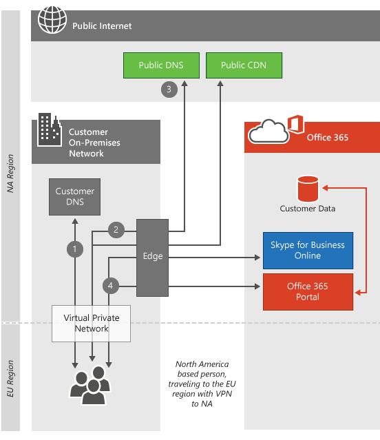

# Client-Konnektivität

 **Zusammenfassung:** Erläutert, wie Clientcomputer je nach Standort des Clientcomputers und Office 365 Mandantendaten Center eine Verbindung mit Office 365 Mandanten herstellen.
  
Office 365 befindet sich in Microsoft-Rechenzentren auf der ganzen Welt, wodurch der Dienst auch bei einem Hauptproblem in einer Region wie einem Erdbeben oder einem Stromausfall betriebsbereit bleibt. Wenn Sie eine Verbindung mit Ihrem Office 365-Mandanten herstellen, wird die Clientverbindung an das entsprechende Rechenzentrum weitergeleitet, in dem Ihr Mandant gehostet wird. Die Regeln, die bestimmen, wo Ihr Mandant gehostet werden kann, werden durch ihre Vereinbarung mit Microsoft definiert. Die Regeln, die bestimmen, wie der Client die Daten von diesem rechenzentrumsstandort erwirbt, hängen von der Architektur des Diensts ab, den Sie verwenden.
  
Wenn Sie sich beispielsweise beim Office 365-Portal anmelden, sind Sie normalerweise mit dem nächsten Datencenter mit dem Client verbunden und dann in Abhängigkeit von dem Dienst weitergeleitet, den Sie als nächstes verwenden. Wenn Sie e-Mail-Nachrichten starten, kann die anfängliche Verbindung zum Anzeigen der Benutzeroberfläche möglicherweise weiterhin aus dem nächstgelegenen Rechenzentrum stammen, es kann jedoch eine zweite Verbindung zwischen dem nächstgelegenen Rechenzentrum und dem Rechenzentrum, in dem sich Ihr Mandant befindet, geöffnet werden, um anzuzeigen, was in den gelesenen e-Mails vorliegt Microsoft betreibt eines der zehn größten Netzwerke der Welt, was zu einer unglaublich schnellen Verbindung zwischen Rechenzentren und Datencentern führt.
  
Nachdem Sie den Artikel gelesen haben, werden Sie wahrscheinlich verstehen, warum wir keine [Office 365-URLs und IP-Adressbereiche](https://support.office.com/article/8548a211-3fe7-47cb-abb1-355ea5aa88a2) pro Datencenter bereitstellen, sondern einfach zu eng miteinander verbunden sind und voneinander abhängig sind, um dies möglich zu machen.
  
Wenn Sie Azure Express Route für Office 365 verwenden, wird Ihre Konnektivität in den meisten Fällen über eine private Verbindung mit Office 365 anstelle der hier beschriebenen öffentlichen Verbindung übergegangen. Die Grundsätze für die Verbindung von Clients sind weiterhin korrekt. Erfahren Sie mehr über [Azure Express Route für Office 365](azure-expressroute.md).
  
Ausführliche Informationen zu Skype for Business Netzwerkanforderungen finden Sie [im Artikel Media Quality and Network Connectivity Performance in Skype for Business Online](https://support.office.com/article/Media-Quality-and-Network-Connectivity-Performance-in-Skype-for-Business-Online-5fe3e01b-34cf-44e0-b897-b0b2a83f0917).

||
|:-----|
| Dieser Artikel ist Teil der [Netzwerkplanung und Leistungsoptimierung für Office 365](https://aka.ms/tune).|

> [!NOTE]
> Wir achten sorgfältig darauf, Kundendaten zu verwalten, damit Sie in unseren Rechenzentren sicher und privat sind. Details zu den Schritten, die zum Verwalten des Datenschutzes ergriffen werden, sind im [Trust Center](https://go.microsoft.com/fwlink/?LinkID=397383)enthalten.
  
## Herstellen einer Verbindung mit dem nächsten Rechenzentrum

Dies ist der häufigste Verbindungstyp, der sowohl vom Office 365 Portal als auch von Exchange Online verwendet wird. Wenn Clients versuchen, eine Verbindung mit Office 365 herzustellen, bestimmt in diesem Fall die DNS-Abfrage des Computers die Region der Welt, von der der Computer stammt, und Office 365 leitet die Anforderung an das nächste Datencenter um.
  
Verbindungen zum Portal werden am nächsten Datencenter angehalten, und auf dem Clientcomputer werden Informationen zum Mandanten des Clients von diesem Standort angezeigt.
  
Exchange Online geht einen Schritt weiter. Wenn der Clientcomputer mit dem nächstgelegenen Rechenzentrum verbunden ist, stellt ein Exchange-Server in diesem Datencenter eine Verbindung mit dem Rechenzentrum her, in dem sich der Mandant tatsächlich befindet, wie im *Abschnitt How does this work* unten dargestellt. Die Exchange Online Server im nächstgelegenen Datencenter stellen dann die Anforderungen vom Clientcomputer an den Postfachserver Proxy. Dadurch wird die Benutzerfreundlichkeit für den Clientcomputer beschleunigt, indem das starke Heben des Abrufens von e-Mails und Kalenderelementen in das Microsoft-Netzwerk verschoben wird.
  
## Wie funktioniert diese Funktion für Standard-Cloud-Angebote?

Dieser Verbindungsprozess ist Standard für hohe Datenverkehrsaufkommen, hochwertige Webanwendungen wie Office 365. In diesem Abschnitt erläutern und veranschaulichen wir die Schritte des Prozesses. Wenn sich der Clientcomputer nicht in derselben Region wie der Mandant befindet, sieht die Verbindung je nach Dienst, zu dem der Client eine Verbindung herstellt, viel anders aus.
  
 Dieses Diagramm zeigt einen Kunden, der ein Standard Office 365 Angebot mit einem Mandanten in Nordamerika verwendet. In diesem Szenario ist die Person, die die Anforderung macht, nach Europa gereist und verwendet Office 365 von diesem Standort aus.
  
1. Der Clientcomputer fragt die lokalen DNS-Server nach der IP-Adresse, die Office 365 zugeordnet ist.

2. Die lokalen DNS-Server des Clientcomputers Fragen die Microsoft-DNS-Server nach der IP-Adresse, die Office 365 zugeordnet ist.

3. Die DNS-Server von Microsoft geben den Namen des regionalen Servers (basierend auf dem Speicherort der DNS-Server des Clients) zurück, und der Clientcomputer wiederholt die Schritte 1 und 2, um die IP-Adresse des regionalen Office 365 Datencenters zu erhalten.

4. Der Clientcomputer stellt eine Verbindung mit der IP-Adresse des regionalen Datencenters her.

5. Die Exchange Online Server stellen eine Verbindung mit dem aktiven Datencenter her, in dem sich der Mandant des Kunden befindet.

  
## Wie funktioniert das für Sovereign Cloud-Angebote?

Diese Verbindung unterscheidet sich geringfügig für Sovereign Cloud-Angebote wie Office 365, die von 21 vianet betrieben werden. Mit dem Mandanten in einer souveränen Instanz von Office 365 sind die nächsten Office 365-Server, die Portal Verbindungen akzeptieren, die Server in der souveränen Region, in der sich der Mandant befindet. Auf ähnliche Weise werden Kunden, die auf SharePoint Online in unseren souveränen Cloud-oder Standard angeboten zugreifen, an Front-End-Server weitergeleitet, auf denen sich der Mandant befindet. Weitere Informationen finden Sie unter Herstellen einer Verbindung mit dem aktiven Datencenter.
  
1. Der Clientcomputer fragt die lokalen DNS-Server nach der IP-Adresse, die Office 365 zugeordnet ist.

2. Die lokalen DNS-Server des Clientcomputers Fragen die Microsoft-DNS-Server nach der IP-Adresse, die Office 365 zugeordnet ist.

3. Die DNS-Server von Microsoft geben den Namen des regionalen Servers (basierend auf dem Speicherort der DNS-Server des Clients) zurück, und der Clientcomputer wiederholt die Schritte 1 und 2, um die IP-Adresse des regionalen Office 365 Datencenters zu erhalten.

4. Der Clientcomputer stellt eine Verbindung mit der IP-Adresse des regionalen Datencenters her.

5. Die Exchange Online Server stellen eine Verbindung mit dem aktiven Datencenter her, in dem sich der Mandant des Kunden befindet.

  
## Herstellen einer Verbindung mit dem aktiven Datencenter

Das Herstellen einer Verbindung mit dem aktiven Datencenter ist für schwerere Datenübertragungs Arbeitslasten konzipiert und wird derzeit von SharePoint Online verwendet. Wenn Clients versuchen, eine Verbindung mit Office 365 herzustellen, wird der Browser in dieser Situation für den SharePoint Online Mandanten an das aktive Rechenzentrum umgeleitet.
  
## Wie funktioniert das?

Wenn der Clientcomputer eine Verbindung mit SharePoint Online aus einer anderen Region herstellt, wird die Verbindung an das aktive SharePoint Online Datencenter umgeleitet. In diesem Szenario verwendet der Kunde ein Standardangebot, was dazu führt, dass die Portal Verbindungen lokal verbleiben und die SharePoint Online Verbindungen an das aktive Datencenter weitergeleitet werden.
  
1. Der Clientcomputer fragt die lokalen DNS-Server nach der IP-Adresse, die Office 365 zugeordnet ist.

2. Die lokalen DNS-Server des Clientcomputers Fragen die Microsoft-DNS-Server nach der IP-Adresse, die Office 365 zugeordnet ist.

3. Die Microsoft-DNS-Server geben den Servernamen des aktiven SharePoint Online Datencenters (basierend auf dem Standort des Office 365 Mandanten des Clients) zurück, und der Clientcomputer wiederholt die Schritte 1 und 2, um die IP-Adresse des aktiven Office 365 Datencenters zu erhalten.

4. Der Clientcomputer stellt eine Verbindung mit der aktiven IP-Adresse des Rechenzentrums her.

  
## Herstellen einer Verbindung über VPNs (Virtual Private Networks)

Diese Art von Verbindung gilt nur, wenn ein virtuelles privates Netzwerk (VPN) von Clientcomputern verwendet wird. In Wirklichkeit wird das Verhalten von Office 365 nicht einfach dadurch geändert, dass ein VPN verwendet wird, aber VPNs werden häufig verwendet, um zu steuern, wie Clientcomputerverbindungen mit Office 365 herstellen und in der Regel zu einer beeinträchtigten Benutzeroberfläche führen, daher ist es wichtig, diese zu bedecken.
  
## Wie funktioniert das?

Wenn der Clientcomputer eine VPN-Verbindung mit einer unternehmensniederlassung in einer anderen Region herstellt, werden die DNS-Server in diesem Büro anstelle der DNS-Server am Standort des Clientcomputers verwendet. In den meisten Fällen wird durch diese zusätzliche Verbindung über das VPN die Office 365 Erfahrung beeinträchtigt. Die Office 365 Dienste sind so optimiert, dass Kundenverbindungen so nah wie möglich am Endbenutzer hergestellt werden. Viele Dienste nutzen das Azure-Edge-Netzwerk, Inhalts Zustellungs Netzwerke und die zuverlässige Netzwerkkapazität im Microsoft-Netzwerk, um die bestmögliche Benutzererfahrung zu erzielen, wenn Netzwerkanforderungen für Office 365 Dienste so nah wie möglich an den Clientcomputer gestellt werden. wie möglich.
  
1. Der Clientcomputer fragt die VPN-DNS-Server nach der IP-Adresse, die Office 365 zugeordnet ist.

2. Die VPN-DNS-Server des Clientcomputers Fragen die Microsoft-DNS-Server nach der IP-Adresse, die Office 365 zugeordnet ist.

3. Die DNS-Server von Microsoft geben den Namen des regionalen Servers (basierend auf dem Speicherort der VPN-DNS-Server) zurück, und der Clientcomputer wiederholt die Schritte 1 und 2, um die IP-Adressinformationen des regionalen Office 365 Datencenters zu erhalten.

4. Der Clientcomputer stellt eine Verbindung mit der IP-Adresse des Rechenzentrums her, die der unternehmensniederlassung am nächsten ist, mit der Sie eine VPN-Verbindung hergestellt haben.

  
Mit diesem kurzen Link gelangen Sie wieder hierher zurück: [https://aka.ms/o365clientconnectivity](https://aka.ms/o365clientconnectivity)
  
## Siehe auch

[Verwalten von Office 365-Endpunkten](https://support.office.com/article/99cab9d4-ef59-4207-9f2b-3728eb46bf9a)
  
[Bewerten Office 365 Netzwerkkonnektivität](assessing-network-connectivity.md)
