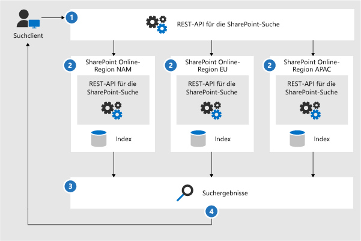
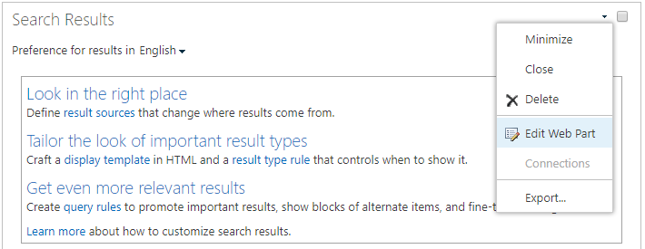

# Konfigurieren der Suche für Multi-Geo in OneDrive for BusinessConfigure Search for OneDrive for Business Multi-Geo

In einer OneDrive for Business-Umgebung mit Multi-Geo kann eine Organisation über einen Office 365-Mandanten verfügen, ihre OneDrive for Business-Inhalte jedoch an mehreren geografischen Standorten speichern – einem zentralen Standort und einem oder mehreren Satellitenstandorten.In a Multi-Geo SharePoint Online (SPO) environment, an organization can have one Office 365 tenant, but store their SharePoint content in multiple geographical locations - one central location and one or more satellite geo locations.

Jeder geografische Standort verfügt über einen eigenen Suchindex und ein Suchcenter. Wenn ein Benutzer eine Suche durchführt, wird die Abfrage in alle Indizes aufgefächert, und die zurückgegebenen Ergebnisse werden zusammengeführt.Each geographical location has its own search index and Search Center. When a user searches, the query is fanned out to all the indexes, and the returned results are merged.

Ein Benutzer an einem geografischen Standort kann zum Beispiel nach Inhalten an einem anderen Standort oder auf einer SharePoint-Website suchen, die auf einen anderen geografischen Standort eingeschränkt ist. Wenn der Benutzer Zugriff auf diese Inhalte hat, wird das Suchergebnis angezeigt.For example, a user in one geo location can search for content stored in another geo location, or for content on a SharePoint site that’s restricted to a different geo location. If the user has access to this content, search will show the result.

## Welche Suchclients können in einer Multi-Geo-Umgebung verwendet werden?Which search clients work in a Multi-Geo environment?

Diese Clients können von allen geografischen Standorten Ergebnisse zurückgeben:These clients can return results from all geo locations:

-   OneDrive for BusinessOneDrive for Business

-   DelveDelve

-   Die SharePoint-HomepageThe SharePoint home page

-   Das SuchcenterThe Search Center

-   Benutzerdefinierte Suchanwendungen, die die SharePoint-Suche-API verwendenCustom search applications that use the SharePoint Search API

### OneDrive for BusinessOneDrive for Business

Sobald die Multi-Geo-Umgebung eingerichtet wurde, erhalten Benutzer, die eine Suche in OneDrive durchführen, Ergebnisse aus allen geografischen Standorten.As soon as the Multi-Geo environment has been set up, users that search in OneDrive get results from all geo locations.

### DelveDelve

Sobald die Multi-Geo-Umgebung eingerichtet wurde, erhalten Benutzer, die eine Suche in Delve durchführen, Ergebnisse aus allen geografischen Standorten.As soon as the Multi-Geo environment has been set up, users that search in Delve get results from all geo locations.

Der Delve-Feed und die Profilkarte zeigen nur eine Vorschau der Dateien an, die sich an dem **zentralen** Standort befinden. Für Dateien, die sich an Satellitenstandorten befinden, wird stattdessen das Symbol für den Dateityp angezeigt.The Delve feed and the profile card only show previews of files that are stored in the **central** location. For files that are stored in satellite geo locations, the icon for the file type is shown instead.

### Die SharePoint-HomepageThe SharePoint home page

Sobald die Multi-Geo-Umgebung eingerichtet wurde, werden Benutzern Neuigkeiten, zuletzt verwendete und gefolgte Websites von mehreren geografischen Standorten auf ihrer SharePoint-Homepage angezeigt. Wenn sie das Suchfeld auf der SharePoint-Homepage verwenden, werden die Ergebnisse aus mehreren geografischen Standorten zusammengeführt.As soon as the Multi-Geo environment has been set up, users will see news, recent and followed sites from multiple geo locations on their SharePoint home page. If they use the search box on the SharePoint home page, they'll get merged results from multiple geo locations.

### Das SuchcenterThe Search Center

Sobald die Multi-Geo-Umgebung eingerichtet wurde, zeigt jedes Suchcenter weiterhin nur die Ergebnisse vom eigenen geografischen Standort an. Administratoren müssen [die Einstellungen für jedes Suchcenter ändern](#_Set_up_a_1), um Ergebnisse aus allen geografischen Standorten zu erhalten. Anschließend erhalten Benutzer, die eine Suche im Suchcenter durchführen, Ergebnisse aus allen geografischen Standorten.After the Multi-Geo environment has been set up, each Search Center continues to only show results from their own geo location. Admins must [change the settings of each Search Center](#_Set_up_a_1) to get results from all geo locations. Afterwards, users that search in the Search Center get results from all geo locations.

### Benutzerdefinierte SuchanwendungenCustom search applications

Wie üblich interagieren benutzerdefinierte Suchanwendungen mit den Suchindizes, indem die vorhandenen SharePoint-Suche-REST-APIs verwendet werden. Um Ergebnisse aus allen oder einigen geografischen Standorten zu erhalten, muss die Anwendung [die API aufrufen und die neuen Multi-Geo-Abfrageparameter](#_Get_custom_search) zu der Anforderung hinzufügen. Dadurch wird die Abfrage in alle geografischen Standorte aufgefächert.As usual, custom search applications interact with the search indexes by using the existing SharePoint Search REST APIs. To get results from all, or some geo locations, the application must [call the API and include the new Multi-Geo query parameters](#_Get_custom_search) in the request. This triggers a fan out of the query to all geo locations.

## Welche Unterschiede gibt es bei der Suche in einer Multi-Geo-Umgebung?What’s different about search in a Multi-Geo environment?

Einige Suchfunktionen, die Sie möglicherweise bereits kennen, funktionieren in einer Multi-Geo-Umgebung anders.Some search features you might be familiar with, work differently in a Multi-Geo environment.

<table>
<thead>
<tr class="header">
<th align="left"><strong>Funktion</strong><strong>Feature</strong></th>
<th align="left"><strong>Funktionsweise</strong><strong>How does it work</strong></th>
<th align="left"><strong>Problemumgehung</strong><strong>Workaround</strong></th>
</tr>
</thead>
<tbody>
<tr class="odd">
<td align="left">Höhergestufte ErgebnissePromoted results</td>
<td align="left">Sie können Abfrageregeln mit höhergestuften Ergebnissen auf verschiedenen Ebenen erstellen: für den gesamten Mandanten, für eine Websitesammlung oder für eine Website. Definieren Sie in einer Multi-Geo-Umgebung höhergestufte Ergebnisse auf der <strong>Mandantenebene</strong>, wenn die Ergebnisse in den Suchcentern an <strong>allen</strong> geografischen Standorten höhergestuft werden sollen. Wenn Sie <strong>nur</strong> Ergebnisse im Suchcenter, das sich an einem geografischen Standort der Websitesammlung oder Website befindet, höherstufen möchten, definieren Sie die Ergebnisse auf der <strong>Websitesammlungs</strong>- oder <strong>Website</strong>ebene.You can create query rules with promoted results at different levels: for the whole tenant, for a site collection, or for a site. In a Multi-Geo environment, define promoted results at the <strong>tenant</strong> level if you want to promote the results to the Search Centers in <strong>all</strong> geo locations. If you <strong>only</strong> want to promote results in the Search Center that’s in the geo location of the site collection or site, define the results at the <strong>site collection</strong> or <strong>site</strong> level.</td>
<td align="left">Wenn Sie keine anderen höhergestuften Ergebnisse pro geografischem Standort benötigen, zum Beispiel verschiedene Regeln für Reisen, wird empfohlen, höhergestufte Ergebnisse auf Mandantenebene zu definieren.If you don’t need different promoted results per geo location, for example different rules for traveling, we recommend defining promoted results at the tenant level.</td>
</tr>
<tr class="even">
<td align="left">SucheinschränkungenSearch refiners</td>
<td align="left">Die Suche gibt Einschränkungen aus allen geografischen Standorten eines Mandanten zurück und aggregiert diese dann. Die Aggregation ist die beste Bemühung und bedeutet, dass die Anzahl der Einschränkungen nicht exakt 100%ig ist. Für die meisten suchgesteuerten Szenarien ist diese Genauigkeit ausreichend. Search returns refiners from all the geo locations of a tenant and then aggregates them. The aggregation is a best effort, meaning that the refiner counts might not be 100% accurate. For most search-driven scenarios, this accuracy is sufficient. </td>
<td align="left">Führen Sie für suchgesteuerte Anwendungen, die von der Vollständigkeit der Einschränkungen abhängig sind, eine Abfrage für jeden geografischen Standort getrennt voneinander durch, ohne die Multi-Geo-Auffächerung zu verwenden.For search-driven applications that depend on refiner completeness, query each geo location independently without using Multi-Geo fan-out.</td>
</tr>
<tr class="odd">
<td align="left"></td>
<td align="left">Das dynamische Zuordnen von Buckets für numerische Einschränkungen wird von der Multi-Geo-Suche nicht unterstützt.Multi-Geo search doesn’t support dynamic bucketing for numerical refiners.</td>
<td align="left">Verwenden Sie den <a href="https://docs.microsoft.com/en-us/sharepoint/dev/general-development/query-refinement-in-sharepoint">„Discretize“-Parameter</a> für numerische Einschränkungen.Use the <a href="https://docs.microsoft.com/en-us/sharepoint/dev/general-development/query-refinement-in-sharepoint">“Discretize” parameter</a> for numerical refiners.</td>
</tr>
<tr class="even">
<td align="left">Dokument-IDsDocument IDs</td>
<td align="left">Wenn Sie eine suchgesteuerte Anwendung entwickeln, die von Dokument-IDs abhängig ist, müssen Sie beachten, dass die Dokument-IDs in einer Multi-Geo-Umgebung nicht standortübergreifend eindeutig sind, sie sind jeweils pro Standort eindeutig.If you’re developing a search-driven application that depends on document IDs, note that document IDs in a Multi-Geo environment aren’t unique across geo locations, they are unique per geo location.</td>
<td align="left">Es wurde eine Spalte hinzugefügt, die den geografischen Standort identifiziert. Verwenden Sie diese Spalte, um Eindeutigkeit zu erreichen. Diese Spalte trägt den Namen „GeoLocationSource“.We’ve added a column that identifies the geo location. Use this column to achieve uniqueness. This column is named “GeoLocationSource”.</td>
</tr>
<tr class="odd">
<td align="left">Anzahl der ErgebnisseNumber of results</td>
<td align="left">Auf der Seite mit den Suchergebnissen werden die kombinierten Ergebnisse von den geografischen Standorten angezeigt, die Seite darf jedoch 500 Ergebnisse nicht überschreiten.The search results page shows combined results from the geo locations, but it’s not possible to page beyond 500 results.</td>
<td align="left"></td>
</tr>
</tbody>
</table>

## Was wird bei der Suche in einer Multi-Geo-Umgebung nicht unterstützt?What’s not supported for search in a Multi-Geo environment?

Einige Suchfunktionen, die Sie möglicherweise bereits kennen, werden in einer Multi-Geo-Umgebung nicht unterstützt.Some of the search features you might be familiar with, aren’t supported in a Multi-Geo environment.

<table>
<thead>
<tr class="header">
<th align="left"><strong>Suchfunktion</strong><strong>Search feature</strong></th>
<th align="left"><strong>Hinweis</strong><strong>Note</strong></th>
</tr>
</thead>
<tbody>
<tr class="odd">
<td align="left">Nur-App-AuthentifizierungApp-only authentication</td>
<td align="left">Nur-App-Authentifizierung (privilegierter Zugriff von Diensten) wird bei der Multi-Geo-Suche nicht unterstützt.App-only authentication (privileged access from services) isn’t supported in Multi-Geo search.</td>
</tr>
<tr class="even">
<td align="left">GastbenutzerGuest users</td>
<td align="left">Gastbenutzer erhalten nur Ergebnisse von dem geografischen Standort, aus dem Sie die Suche durchführen.Guest users only get results from the geo location that they’re searching from.</td>
</tr>
</tbody>
</table>

## Wie funktioniert die Suche in einer Multi-Geo-Umgebung?How does search work in a Multi-Geo environment?

**Alle** Suchclients verwenden die vorhandenen SharePoint-Suche-REST-APIs für die Interaktion mit den Suchindizes.**All** the search clients use the existing SharePoint Search REST APIs to interact with the search indexes.

1. Ein Suchclient ruft den REST-Endpunkt für die Suche mit der Abfrageeigenschaft „EnableMultiGeoSearch= true“ auf.A search client calls the Search REST endpoint with the query property EnableMultiGeoSearch= true.
2. Die Abfrage wird an alle geografischen Standorte im Mandanten gesendet.The query is sent to all geo locations in the tenant.
3. Die Suchergebnisse von jedem geografischen Standort werden zusammengeführt und bewertet.Search results from each geo location are merged and ranked.
4. Der Client erhält einheitliche Suchergebnisse.The client gets unified search results.

Beachten Sie, dass die Suchergebnisse erst dann zusammengeführt werden, wenn die Ergebnisse von allen geografischen Standorten abgerufen wurden. Dies bedeutet, dass Multi-Geo-Suchen im Vergleich zu den Suchen in einer Umgebung mit nur einem geografischen Standort eine zusätzliche Wartezeit aufweisen.Notice that we don’t merge the search results until we’ve received results from all the geo locations. This means that Multi-Geo searches have additional latency compared to searches in an environment with only one geo location.

## Anzeigen der Ergebnisse von allen geografischen Standorten in einem SuchcenterGet a Search Center to show results from all geo locations

Jedes Suchcenter verfügt über mehrere Suchsparten, und Sie müssen jede Sparte einzeln einrichten.Each Search Center has several verticals and you have to set up each vertical individually.

1.  Stellen Sie sicher, dass Sie diese Schritte mit einem Konto ausführen, das über die Berechtigung zum Bearbeiten der Suchergebnisseite und des Suchergebnisse-Webparts verfügt.Ensure that you perform these steps with an account that has permission to edit the search results page and the Search Result Web Part.

2.  Navigieren Sie zur Seite mit den Suchergebnissen (siehe [Liste](https://support.office.com/article/174d36e0-2f85-461a-ad9a-8b3f434a4213) der Suchergebnisseiten).Navigate to the search results page (see the [list](https://support.office.com/article/174d36e0-2f85-461a-ad9a-8b3f434a4213) of search results pages)

3.  Wählen Sie die Sparte, die Sie einrichten möchten, klicken Sie in der oberen rechten Ecke auf das Zahnradsymbol für **Einstellungen**, und klicken Sie auf **Seite bearbeiten**. Die Seite mit den Suchergebnissen wird im Bearbeitungsmodus geöffnet.Select the vertical to set up, click **Settings** gear icon in the upper, right corner, and then click **Edit Page**. The search results page opens in Edit mode.

     
1.  Bewegen Sie im Suchergebnisse-Webpart den Mauszeiger in die obere rechte Ecke des Webparts, und klicken Sie dann im Menü auf **Webpart bearbeiten**. Der Toolbereich für das Suchergebnisse-Webpart wird unter dem Menüband oben rechts auf der Seite geöffnet. In the Search Results Web Part, move the pointer to the upper, right corner of the Web Part, click the arrow, and then click **Edit Web Part** on the menu. The Search Results Web Part tool pane opens under the ribbon in the top right of the page. 

1.  Wählen Sie im Webpart-Toolbereich im Abschnitt **Einstellungen** unter **Einstellungen für das Ergebnissteuerelement** die Option **Multi-Geo-Ergebnisse anzeigen**, damit das Suchergebnisse-Webpart Ergebnisse von allen geografischen Standorten anzeigt.In the Web Part tool pane, in the **Settings** section, under **Results control settings**, select **Show Multi-Geo results** to get the Search Results Web Part to show results from all geo locations.

2.  Klicken Sie auf **OK**, um Ihre Änderungen zu speichern und den Webpart-Toolbereich zu schließen.Click **OK** to save your change and close the Web Part tool pane.

3.  Überprüfen Sie Ihre Änderungen an dem Suchergebnisse-Webpart, indem Sie im Hauptmenü auf der Registerkarte „Seite“ auf **Einchecken** klicken.Check your changes to the Search Results Web Part by clicking **Check-In** on the Page tab of the main menu.

4.  Veröffentlichen Sie die Änderungen über den Link in der Notiz oben auf der Seite.Publish the changes by using the link provided in the note at the top of the page.

## Anzeigen von Ergebnissen von allen oder einigen geografischen Standorten in benutzerdefinierten SuchanwendungenGet custom search applications to show results from all or some geo locations

Benutzerdefinierte Anwendungen rufen Ergebnisse von allen oder einigen geografischen Standorten ab, indem Sie Abfrageparameter mit der Anforderung an die SharePoint-Suche-REST-API angeben. Je nach Abfrageparameter wird die Abfrage in alle geografischen Standorte oder in einige geografischen Standorte aufgefächert. Wenn nur einige geografischen Standorte abgefragt werden sollen, können Sie die Auffächerung nur für diese einschränken. Wenn die Anforderung erfolgreich ist, gibt die SharePoint-Suche-REST-API die Antwortdaten zurück.Custom search applications get results from all, or some, geo locations by specifying query parameters with the request to the SharePoint Search REST API. Depending on the query parameters, the query is fanned out to all geo locations, or to some geo locations. For example, if you only need to query a subset of geo locations to find relevant information, you can control the fan out to only these. If the request succeeds, the SharePoint Search REST API returns response data.

### AbfrageparameterQuery parameters

EnableMultiGeoSearch – Dies ist ein boolescher Wert, der angibt, ob die Abfrage in Indizes anderer geografischer Standorte des Multi-Geo-Mandanten aufgefächert werden soll. Legen Sie diesen Wert auf **true** fest, um die Abfrage aufzufächern, oder auf **false**, wenn die Abfrage nicht aufgefächert werden soll. Standardwert ist **false**. Wenn dieser Parameter nicht enthalten ist, wird die Abfrage **nicht** in andere geografischen Standorte aufgefächert. Wenn Sie den Parameter in einer Nicht-Multi-Geo-Umgebung verwenden, wird der Parameter ignoriert.EnableMultiGeoSearch - This is a Boolean value that specifies whether the query shall be fanned out to the indexes of other geo locations of the Multi-Geo tenant. Set it to **true** to fan out the query; **false** to not fan out the query. The default value is **false**. If you don’t include this parameter, the query is **not** fanned out to other geo locations. If you use the parameter in an environment that isn’t Multi-Geo, the parameter is ignored.

ClientType – Dies ist eine Zeichenfolge. Geben Sie einen eindeutigen Clientnamen für jede Suchanwendung an. Wenn Sie diesen Parameter nicht hinzufügen, wird die Abfrage **nicht** in andere geografischen Standorte aufgefächert.ClientType - This is a string. Enter a unique client name for each search application. If you don’t include this parameter, the query is **not** fanned out to other geo locations.

MultiGeoSearchConfiguration – Dies ist eine optionale Liste mit geografischen Standorten im Multi-Geo-Mandanten, für die die Auffächerung der Abfrage erfolgen soll, wenn **EnableMultiGeoSearch** auf **true** festgelegt ist. Wenn Sie nicht diesen Parameter angeben oder leer lassen, wird die Abfrage für alle geografischen Standorte aufgefächert. Geben Sie für jeden geografischen Standort die folgenden Elemente im JSON-Format an:MultiGeoSearchConfiguration - This is an optional list of which geo locations in the Multi-Geo tenant to fan the query out to when **EnableMultiGeoSearch** is **true**. If you don’t include this parameter, or leave it blank, the query is fanned out to all geo locations. For each geo location, enter the following items, in JSON format:

<table>
<thead>
<tr class="header">
<th align="left">ElementItem</th>
<th align="left">BeschreibungDescription</th>
</tr>
</thead>
<tbody>
<tr class="odd">
<td align="left">DataLocationDataLocation</td>
<td align="left">Der geografische Standort, zum Beispiel NAM.The geo location, for example NAM.</td>
</tr>
<tr class="even">
<td align="left">EndPointEndPoint</td>
<td align="left">Der Endpunkt für die Verbindung, zum Beispiel https://contoso.sharepoint.comThe endpoint to connect to, for example https://contoso.sharepoint.com</td>
</tr>
<tr class="odd">
<td align="left">SourceIdSourceId</td>
<td align="left">Die GUID der Ergebnisquelle, zum Beispiel B81EAB55-3140-4312-B0F4-9459D1B4FFE.The GUID of the result source, for example B81EAB55-3140-4312-B0F4-9459D1B4FFEE.</td>
</tr>
</tbody>
</table>

Wenn Sie DataLocation oder Endpunkt weglassen, oder wenn DataLocation doppelt vorhanden ist, tritt bei der Anforderung ein Fehler auf. [Informationen zu dem Endpunkt von geografischen Standorten eines Mandanten können Sie mithilfe von Microsoft Graph](https://docs.microsoft.com/de-DE/sharepoint/dev/solution-guidance/multigeo-discovery) abrufen.If you omit DataLocation or EndPoint, or if a DataLocation is duplicated, the request fails. [You can get information about the endpoint of a tenant's geo locations by using Microsoft Graph](https://docs.microsoft.com/de-DE/sharepoint/dev/solution-guidance/multigeo-discovery).

### AntwortdatenResponse data

MultiGeoSearchStatus – Dies ist eine Eigenschaft, die die SharePoint-Suche-API als Reaktion auf eine Anforderung zurückgibt. Der Wert der Eigenschaft ist eine Zeichenfolge und bietet die folgenden Informationen zu den Ergebnissen, die die SharePoint-Suche-API zurückgibt:MultiGeoSearchStatus – This is a property that the SharePoint Search API returns in response to a request. The value of the property is a string and gives the following information about the results that the SharePoint Search API returns:

<table>
<thead>
<tr class="header">
<th align="left">WertValue</th>
<th align="left">BeschreibungDescription</th>
</tr>
</thead>
<tbody>
<tr class="odd">
<td align="left">VollständigFull</td>
<td align="left">Vollständige Ergebnisse von <strong>allen</strong> geografischen Standorten.Full results from <strong>all</strong> the geo locations.</td>
</tr>
<tr class="even">
<td align="left">TeilweisePartial</td>
<td align="left">Teilweise Ergebnisse von einem oder mehreren geografischen Standorten. Die Ergebnisse sind aufgrund eines vorübergehenden Fehlers unvollständig.Partial results from one or more geo locations. The results are incomplete due to a transient error.</td>
</tr>

</tbody>
</table>

### Abfrage mithilfe des REST-DienstsQuery using the REST service

Mit einer GET-Anforderung geben Sie die Abfrageparameter in der URL an. Mit einer POST-Anforderung übergeben Sie die Abfrageparameter im Text im JSON-Format.With a GET request, you specify the query parameters in the URL. With a POST request, you pass the query parameters in the body in JavaScript Object Notation (JSON) format.

#### AnforderungsheaderRequest headers

<table>
<thead>
<tr class="header">
<th align="left">NameName</th>
<th align="left">WertValue</th>
</tr>
</thead>
<tbody>
<tr class="odd">
<td align="left">Content-TypeContent-Type</td>
<td align="left">application/json;odata=verboseapplication/json;odata=verbose</td>
</tr>
</tbody>
</table>

#### Beispiel für eine GET-Anforderung, die für **alle** geografischen Standorte aufgefächert wirdSample GET request that’s fanned out to **all** geo locations

https:// \<tenant\>/\_api/search/query?querytext='sharepoint'&Properties='EnableMultiGeoSearch:true'&ClientType='my\_client\_id'https:// \<tenant\>/\_api/search/query?querytext='sharepoint'&Properties='EnableMultiGeoSearch:true'&ClientType='my\_client\_id'

#### Beispiel für eine GET-Anforderung, die für **einige** geografischen Standorte aufgefächert wirdSample GET request to fan out to **some** geo locations

https:// \<Mandant\>/\_api/search/query?querytext='site'&ClientType='my_client_id'&Properties='EnableMultiGeoSearch:true, MultiGeoSearchConfiguration:[{DataLocation\\:"NAM"\\,Endpoint\\:"https\\://contosoNAM.sharepoint.com"\\,SourceId\\:"B81EAB55-3140-4312-B0F4-9459D1B4FFEE"}\\,{DataLocation\\:"CAN"\\,Endpoint\\:"https\\://contosoCAN.sharepoint-df.com"}]'https:// \<tenant\>/\_api/search/query?querytext='site'&ClientType='my_client_id'&Properties='EnableMultiGeoSearch:true, MultiGeoSearchConfiguration:[{DataLocation\\:"NAM"\\,Endpoint\\:"https\\://contosoNAM.sharepoint.com"\\,SourceId\\:"B81EAB55-3140-4312-B0F4-9459D1B4FFEE"}\\,{DataLocation\\:"CAN"\\,Endpoint\\:"https\\://contosoCAN.sharepoint-df.com"}]'

> [!NOTE]
> Kommas und Doppelpunkten in der Liste der geografischen Standorte für die Eigenschaft MultiGeoSearchConfiguration wird ein **umgekehrtes Schrägstrichzeichen** vorangestellt. Dies hat den Grund, dass in GET-Anforderungen Doppelpunkte zum Trennen von Eigenschaften und Kommas zum Trennen von Argumenten von Eigenschaften verwendet werden. Ohne den umgekehrten Schrägstrich als Escapezeichen würde die MultiGeoSearchConfiguration-Eigenschaft falsch interpretiert.Commas and colons in the list of geo-locations for the MultiGeoSearchConfiguration property are preceded by the **backslash** character. This is because GET requests use colons to separate properties and commas to separate arguments of properties. Without the backslash as an escape character, the MultiGeoSearchConfiguration property is interpreted wrongly.

#### Beispiel für eine POST-Anforderung, die für **alle** geografischen Standorte aufgefächert wirdSample POST request that’s fanned out to **all** geo locations

    {
        "request": {
            "__metadata": {
            "type": "Microsoft.Office.Server.Search.REST.SearchRequest"
        },
        "Querytext": "sharepoint",
        "Properties": {
            "results": [
                {
                    "Name": "EnableMultiGeoSearch",
                    "Value": {
                        "QueryPropertyValueTypeIndex": 3,
                        "BoolVal": true
                    }
                }
            ]
        },
        "ClientType": "my_client_id"
        }
    }

#### Beispiel für eine POST-Anforderung, die für **einige** geografischen Standorte aufgefächert wirdSample POST request that’s fanned out to **some** geo locations

    {
        "request": {
            "Querytext": "SharePoint",
            "ClientType": "my_client_id",
            "Properties": {
                "results": [
                    {
                        "Name": "EnableMultiGeoSearch",
                        "Value": {
                            "QueryPropertyValueTypeIndex": 3,
                            "BoolVal": true
                        }
                    },
                    {
                        "Name": "MultiGeoSearchConfiguration",
                        "Value": {
                        "StrVal": "[{\"DataLocation\":\"NAM\",\"Endpoint\":\"https://contoso.sharepoint.com\",\"SourceId\":\"B81EAB55-3140-4312-B0F4-9459D1B4FFEE\"},{\"DataLocation\":\"CAN\",\"Endpoint\":\"https://contosoCAN.sharepoint.com\"}]",
                            "QueryPropertyValueTypeIndex": 1
                        }
                    }
                ]
            }
        }
    }

### Abfrage mithilfe von CSOMQuery using CSOM

Im Folgenden finden Sie ein Beispiel für eine CSOM-Abfrage, die für **alle** geografischen Standorte aufgefächert wird:Here’s a sample CSOM query that’s fanned out to **all** geo locations:

    var keywordQuery = new KeywordQuery(ctx);
    keywordQuery.QueryText = query.SearchQueryText;
    keywordQuery.ClientType = <enter a string here>;
    keywordQuery["EnableMultiGeoSearch"] = true;

