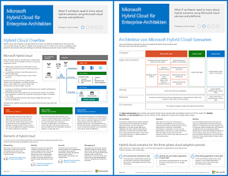

# Contoso in der Microsoft-CloudContoso in the Microsoft Cloud

 **Zusammenfassung:** Wie in einer fiktiven, aber repräsentativen globalen Organisation mithilfe der Cloudangebote von Microsoft eine cloudeinschließende IT-Infrastruktur eingeführt wurde.**Summary:** How a fictional but representative global organization is adopting a cloud-inclusive IT infrastructure with Microsoft's cloud offerings.
  
Dieser Artikel enthält Links zu einer Reihe von Artikeln, in denen beschrieben wird, wie die Contoso Corporation, ein globaler Mischkonzern im Fertigungsbereich mit Firmensitz in Paris, eine IT-Infrastruktur inklusive Cloud umsetzt und dabei wichtige Designentscheidungen in puncto Netzwerk, Identität und Sicherheit getroffen hat. Außerdem ist darin die Implementierung von Unternehmenscloud-Szenarios und die Lösung von Geschäftsproblemen erläutert. Sie können diesen Artikel auch als zehnseitiges Poster anzeigen und im Tabloid-Format ausdrucken (auch bekannt als Ledger, 11 × 17 oder A3).This article links you to a set of articles that describe how the Contoso Corporation, a global manufacturing conglomerate with its headquarters in Paris, is embracing a cloud-inclusive IT infrastructure and has addressed major design decisions for networking, identity, and security and how it is implementing enterprise cloud scenarios to address its business problems. You can also view this information as an 11-page poster and print it in tabloid format (also known as ledger, 11 x 17, or A3).
  

  
[PDF](https://go.microsoft.com/fwlink/p/?linkid=842085)  | [Visio](https://go.microsoft.com/fwlink/p/?linkid=842086)  | [Weitere Sprachen](https://www.microsoft.com/download/details.aspx?id=54427)[PDF](https://go.microsoft.com/fwlink/p/?linkid=842085)  | [Visio](https://go.microsoft.com/fwlink/p/?linkid=842086)  | [More languages](https://www.microsoft.com/download/details.aspx?id=54427)
  
Lesen Sie die folgenden Abschnitte:See the following sections:
  
- [Hybrid Cloud-ÜbersichtHybrid cloud overview](hybrid-cloud-overview.md)
    
    Die Contoso Corporation ist ein globaler Mischkonzern im Bereich Fertigung, Vertrieb und Support mit einem Portfolio aus über 100.000 Produkten.The Contoso Corporation is a global conglomerate manufacturing, sales, and support organization with over 100,000 products.
    
- [Contosos IT-Infrastruktur und -AnforderungenContoso's IT infrastructure and needs](contoso-it-infrastructure-and-needs.md)
    
    Contoso ist dabei, von der lokalen zentralen IT-Infrastruktur auf eine cloudeinschließende Infrastruktur umzustellen, die aus cloudbasierten persönlichen Produktivitätsarbeitslasten, Anwendungen und Hybridszenarien besteht.
Contoso is transitioning from an on-premises, centralized IT infrastructure to a cloud-inclusive one that incorporates cloud-based personal productivity workloads, applications, and hybrid scenarios.
    
- [Netzwerkfunktionen für die Contoso CorporationNetworking for the Contoso Corporation](networking-for-the-contoso-corporation.md)
    
    Zur Optimierung der Leistung cloudbasierter Dienste haben die Netzwerkingenieure von Contoso den Datenverkehr zum Internet-Edge und über das Internet optimiert.For best performance to cloud-based services, Contoso's network engineers optimized traffic to their Internet edge and across the Internet.
    
- [Identität für die Contoso CorporationIdentity for the Contoso Corporation](identity-for-the-contoso-corporation.md)
    
    Die Identität von Contoso in der Cloudlösung verwendet den lokalen Identitätsanbieter und umfasst eine Authentifizierung im Verbund mit den vorhandenen vertrauenswürdigen Identitätsanbietern von Drittanbietern.Contoso's identity in the cloud solution leverages their on-premises identity provider and includes federated authentication with their existing trusted, third-party identity providers.
    
- [Abonnements, Lizenzen und Benutzerkonten für die Contoso CorporationSubscriptions, licenses, and user accounts for the Contoso Corporation](subscriptions-licenses-and-user-accounts-for-the-contoso-corporation.md)
    
    Contoso verwendet die Hierarchie „Organisation/Abonnements/Lizenzen/Benutzerkonten“, um auf die Cloudangebote von Microsoft zuzugreifen.Contoso uses the organization/subscriptions/licenses/user accounts hierarchy to access Microsoft's cloud offerings.
    
- [Sicherheit für die Contoso CorporationSecurity for the Contoso Corporation](security-for-the-contoso-corporation.md)
    
    Für die Umwandlung seiner IT-Infrastruktur in eine cloudeinschließende Infrastruktur hat sich Contoso vergewissert, dass seine lokalen Sicherheitsanforderungen in Microsofts Cloudangeboten unterstützt werden und implementiert sind.When transitioning their IT infrastructure to a cloud-inclusive one, Contoso made sure that their on-premises security requirements were supported and implemented in Microsoft's cloud offerings.
    
- [Enterprise-Szenarien für die Contoso CorporationEnterprise scenarios for the Contoso Corporation](enterprise-scenarios-for-the-contoso-corporation.md)
    
    Erfahren Sie, wie Contoso mithilfe der Cloudangebote von Microsoft seine Geschäftsanforderungen erfüllen kann.See how Contoso is addressing its business needs with Microsoft's cloud offerings.
    
> [!NOTE]
> In diesen Artikeln wird die Version vom **September 2017** des Posters „Contoso in der Microsoft-Cloud" widergespiegelt.These articles reflect the **September 2017** release of the Contoso in the Microsoft Cloud poster.
  
## Siehe auchSee Also

[Ressourcen zur Cloud-IT-Architektur von MicrosoftMicrosoft Cloud IT architecture resources](microsoft-cloud-it-architecture-resources.md)

[Enterprise-Cloud-Roadmap von Microsoft: Ressourcen für IT-EntscheidungsträgerMicrosoft's Enterprise Cloud Roadmap: Resources for IT Decision Makers](https://sway.com/FJ2xsyWtkJc2taRD)

