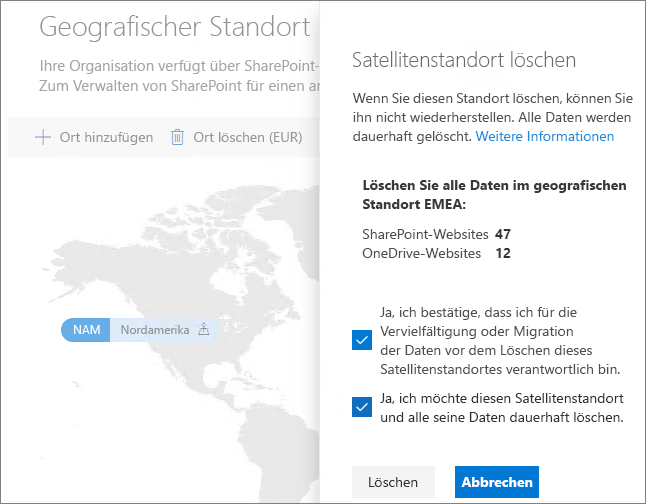

# Löschen eines Satellitenstandorts in Microsoft 365 Multi-Geo.

Wenn Sie einen Satellitenstandort nicht mehr benötigen, können Sie diesen von Ihrem Mandanten über das SharePoint Admin Center löschen.

> [!WARNING]
> Alle Benutzerdaten an dem Satellitenstandort werden dauerhaft gelöscht. Dazu gehören alle OneDrive for Business-Inhalte, SharePoint-Websites und Exchange-Postfächer, einschließlich Microsoft 365-Gruppenpostfächern. Vor dem Löschen des Satellitenstandorts müssen alle Daten zu einem anderen Satellitenstandort oder an den zentralen Speicherort migriert werden. Diese Aktion kann nicht rückgängig gemacht werden.

Nur globale Administratoren können Satellitenstandorte löschen.

So löschen Sie einen Satellitenstandort

1. Öffnen Sie das SharePoint Admin Center.

2. Navigieren Sie zu der Registerkarte **Geografische Standorte**.

3. Klicken Sie auf der Karte auf den geografischen Standort, den Sie löschen möchten.

4. Klicken Sie auf **Ort löschen**.

5. Bestätigen Sie den Löschvorgang, indem Sie die Bestätigungskontrollkästchen aktivieren.

6. Klicken Sie auf **Löschen**.
