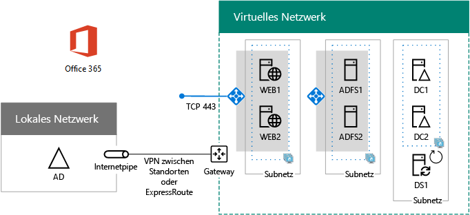

# Bereitstellen der Verbundauthentifizierung mit Hochverfügbarkeit für Office 365 in AzureDeploy high availability federated authentication for Office 365 in Azure

 **Zusammenfassung:** Konfigurieren der Verbundauthentifizierung mit hoher Verfügbarkeit für Ihr Office 365-Abonnement in Microsoft Azure.**Summary:** Configure high availability federated authentication for your Office 365 subscription in Microsoft Azure.
  
Dieser Artikel enthält Links zu den schrittweisen Anleitungen für die Bereitstellung der Verbundauthentifizierung mit hoher Verfügbarkeit für Microsoft Office 365 in Azure-Infrastrukturdiensten mit den folgenden virtuellen Computern:This article has links to the step-by-step instructions for deploying high availability federated authentication for Microsoft Office 365 in Azure infrastructure services with these virtual machines:
  
- Zwei Webanwendungsproxy-ServerTwo web application proxy servers
    
- Zwei Active Directory-Verbunddienste (AD FS)Two Active Directory Federation Services (AD FS) servers
    
- Zwei replizierte DomänencontrollerTwo replica domain controllers
    
- Ein Verzeichnissynchronisierungsserver (DirSync), auf dem Azure AD Connect ausgeführt wird.One directory synchronization (DirSync) server running Azure AD Connect
    
Nachfolgend sehen Sie die Konfiguration mit Platzhalternamen für jeden Server.Here is the configuration, with placeholder names for each server.
  
**Eine Verbundauthentifizierung mit Hochverfügbarkeit für die Office 365-Infrastruktur in Azure****A high availability federated authentication for Office 365 infrastructure in Azure**

  
Alle virtuellen Computer befinden sich in einem einzigen standortübergreifenden virtuellen Azure-Netzwerk (VNet).All of the virtual machines are in a single cross-premises Azure virtual network (VNet). 
  
> [!NOTE]
> Für die Verbundauthentifizierung einzelner Benutzer ist kein Rückgriff auf lokale Ressourcen erforderlich. Sollte die standortübergreifende Verbindung jedoch ausfallen, empfangen die Domänencontroller im VNet keine im lokalen AD DS (Active Directory Domain Services) vorgenommenen Updates an Benutzerkonten und Gruppen. Zur Vermeidung eines solchen Szenarios können Sie Hochverfügbarkeit für die standortübergreifende Verbindung konfigurieren. Weitere Informationen finden Sie unter [Standortübergreifende Verbindungen und VNet-zu-VNet-Verbindungen mit hoher Verfügbarkeit](https://docs.microsoft.com/azure/vpn-gateway/vpn-gateway-highlyavailable).Federated authentication of individual users does not rely on any on-premises resources. However, if the cross-premises connection becomes unavailable, the domain controllers in the VNet will not receive updates to user accounts and groups made in the on-premises Active Directory Domain Services (AD DS). To ensure this does not happen, you can configure high availability for your cross-premises connection. For more information, see [Highly Available Cross-Premises and VNet-to-VNet Connectivity](https://docs.microsoft.com/azure/vpn-gateway/vpn-gateway-highlyavailable)
  
Jedes Paar virtuelle Computer für eine bestimmte Rolle befindet sich in einem eigenen Subnetz und einer eigenen Verfügbarkeitsgruppe.Each pair of virtual machines for a specific role is in its own subnet and availability set.
  
> [!NOTE]
> Da dieses VNet mit dem lokalen Netzwerk verbunden ist, umfasst diese Konfiguration keinen virtuellen Jumpbox- oder Überwachungscomputer in einem Verwaltungssubnetz. Weitere Informationen finden Sie unter [Ausführen von virtuellen Windows-Computern für eine Architektur mit N-Ebenen](https://docs.microsoft.com/azure/guidance/guidance-compute-n-tier-vm).Because this VNet is connected to the on-premises network, this configuration does not include jumpbox or monitoring virtual machines on a management subnet. For more information, see [Running Windows VMs for an N-tier architecture](https://docs.microsoft.com/azure/guidance/guidance-compute-n-tier-vm). 
  
Das Ergebnis dieser Konfiguration ist eine Verbundauthentifizierung für alle Ihre Office 365-Benutzer. Diese können sich dann also mit ihren Active Directory Domain Services-Anmeldeinformationen statt mit ihrem Office 365-Konto anmelden. Die Verbundauthentifizierungsinfrastruktur nutzt einen redundanten Satz von Servern, die in den Azure-Infrastrukturdiensten bereitgestellt sind, nicht in Ihrem lokalen Umkreisnetzwerk. Das ist eine deutlich einfacher zu implementierende Konstellation.The result of this configuration is that you will have federated authentication for all of your Office 365 users, in which they can use their Active Directory Domain Services credentials to sign in rather than their Office 365 account. The federated authentication infrastructure uses a redundant set of servers that are more easily deployed in Azure infrastructure services, rather than in your on-premises edge network.
  
## Erforderliche KomponentenBill of materials

Diese geplante Konfiguration erfordert den folgenden Satz von Azure-Diensten und Komponenten:This baseline configuration requires the following set of Azure services and components:
  
- Sieben virtuelle ComputerSeven virtual machines
    
- Ein standortübergreifendes virtuelles Netzwerk mit vier SubnetzenOne cross-premises virtual network with four subnets
    
- Vier RessourcengruppenFour resource groups
    
- Drei Verfügbarkeitsgruppen.Three availability sets
    
- Ein Azure-AbonnementOne Azure subscription
    
Nachfolgend sehen Sie die virtuellen Computer und ihre Standardgrößen für diese Konfiguration.Here are the virtual machines and their default sizes for this configuration.
  
|**Element****Item**|**Beschreibung des virtuellen Computers****Virtual machine description**|**Azure-Katalogbild****Azure gallery image**|**Standardgröße****Default size**|
|:-----|:-----|:-----|:-----|
|1.1.    |Erster DomänencontrollerFirst domain controller    |Windows Server 2016 DatacenterWindows Server 2016 Datacenter    |D2D2    |
|2.2.    |Zweiter DomänencontrollerSecond domain controller    |Windows Server 2016 DatacenterWindows Server 2016 Datacenter    |D2D2    |
|3.3.    |Azure AD Connect-ServerAzure AD Connect server    |Windows Server 2016 DatacenterWindows Server 2016 Datacenter    |D2D2    |
|4.4.    |Erster AD FS-Server
First AD FS server    |Windows Server 2016 DatacenterWindows Server 2016 Datacenter    |D2D2    |
|5.5.    |Zweiter AD FS-Server
Second AD FS server    |Windows Server 2016 DatacenterWindows Server 2016 Datacenter    |D2D2    |
|6.6.    |Erster Webanwendungsproxy-Server
First web application proxy server    |Windows Server 2016 DatacenterWindows Server 2016 Datacenter    |D2D2    |
|7.7.    |Zweiter Webanwendungsproxy-Server
Second web application proxy server    |Windows Server 2016 DatacenterWindows Server 2016 Datacenter    |D2D2    |
   
Um die geschätzten Kosten für diese Konfiguration zu berechnen, finden Sie unter [Azure-Preisrechner](https://azure.microsoft.com/pricing/calculator/) weitere Informationen.To compute the estimated costs for this configuration, see the [Azure pricing calculator](https://azure.microsoft.com/pricing/calculator/)
  
## Phasen der BereitstellungPhases of deployment

Sie stellen diese Arbeitslast in den folgenden Phasen bereit:You deploy this workload in the following phases:
  
- [Phase 1: Konfigurieren von Azure](high-availability-federated-authentication-phase-1-configure-azure.md). Erstellen von Ressourcengruppen, Speicherkonten, Verfügbarkeitsgruppen und einem standortübergreifenden virtuellen Netzwerk.[Phase 1: Configure Azure](high-availability-federated-authentication-phase-1-configure-azure.md). Create resource groups, storage accounts, availability sets, and a cross-premises virtual network.
    
- [Phase 2: Konfigurieren von Domänencontrollern](high-availability-federated-authentication-phase-2-configure-domain-controllers.md). Erstellen und Konfigurieren von replizierten AD DS-Domänencontrollern (Active Directory Domain Services) und des DirSync-Servers.[Phase 2: Configure domain controllers](high-availability-federated-authentication-phase-2-configure-domain-controllers.md). Create and configure replica Active Directory Domain Services (AD DS) domain controllers and the DirSync server.
    
- [Phase 3: Konfigurieren von AD FS-Servern](high-availability-federated-authentication-phase-3-configure-ad-fs-servers.md). Erstellen und Konfigurieren der beiden AD FS-Server.[Phase 3: Configure AD FS servers](high-availability-federated-authentication-phase-3-configure-ad-fs-servers.md). Create and configure the two AD FS servers.
    
- [Phase 4: Konfigurieren von Webanwendungsproxys](high-availability-federated-authentication-phase-4-configure-web-application-pro.md). Erstellen und Konfigurieren der beiden Webanwendungsproxy-Server.[Phase 4: Configure web application proxies](high-availability-federated-authentication-phase-4-configure-web-application-pro.md). Create and configure the two web application proxy servers.
    
- [Phase 5: Konfigurieren der Verbundauthentifizierung für Office 365](high-availability-federated-authentication-phase-5-configure-federated-authentic.md). Konfigurieren der Verbundauthentifizierung für Ihr Office 365-Abonnement.[Phase 5: Configure federated authentication for Office 365](high-availability-federated-authentication-phase-5-configure-federated-authentic.md). Configure federated authentication for your Office 365 subscription.
    
Dieser Artikel enthält eine phasenweise Anleitung für eine vordefinierte Architektur, um eine funktionale Verbundauthentifizierung mit hoher Verfügbarkeit für Office 365 in Azure-Infrastrukturdiensten zu erstellen. Denken Sie dabei an Folgendes:These articles provide a prescriptive, phase-by-phase guide for a predefined architecture to create a functional, high availability federated authentication for Office 365 in Azure infrastructure services. Keep the following in mind:
  
- Wenn Sie ein erfahrener AD FS-Implementierer sind, können Sie die Anweisungen in den Phasen 3 und 4 entsprechend anpassen und eine Gruppe von Servern erstellen, die Ihren Anforderungen am besten entspricht. If you are an experienced AD FS implementer, feel free to adapt the instructions in phases 3 and 4 and build the set of servers that best suits your needs.
    
- Wenn Sie bereits über eine vorhandene Azure-Hybridcloudbereitstellung mit einem vorhandenen standortübergreifenden virtuellen Netzwerk verfügen, können Sie die Anweisungen in den Phasen 1 und 2 entsprechend anpassen oder überspringen und die AD FS-Server und die Webanwendungsproxy-Server in den entsprechenden Subnetzen platzieren.If you already have an existing Azure hybrid cloud deployment with an existing cross-premises virtual network, feel free to adapt or skip the instructions in phases 1 and 2 and place the AD FS and web application proxy servers on the appropriate subnets.
    
Informationen zum Erstellen einer Entwicklungs-/Testumgebung oder einer Machbarkeitsstudie dieser Konfiguration finden Sie unter [Verbundidentität für Ihre Office 365-Entwicklungs-/Testumgebung](federated-identity-for-your-office-365-dev-test-environment.md).To build a dev/test environment or a proof-of-concept of this configuration, see [Federated identity for your Office 365 dev/test environment](federated-identity-for-your-office-365-dev-test-environment.md).
  
## Nächster SchrittNext step

Starten Sie die Konfiguration dieser Arbeitslast mit [Hochverfügbarkeit der Verbundauthentifizierung, Phase 1: Konfigurieren von Azure](high-availability-federated-authentication-phase-1-configure-azure.md).Start the configuration of this workload with [High availability federated authentication Phase 1: Configure Azure](high-availability-federated-authentication-phase-1-configure-azure.md). 
  
<!--
> [!TIP]
> For a set of files to more quickly deploy your high availability federated authentication for Office 365 in Azure, see the [Federated Authentication for Office 365 in Azure Deployment Kit](https://gallery.technet.microsoft.com/Federated-Authentication-8a9f1664). 
--> 

