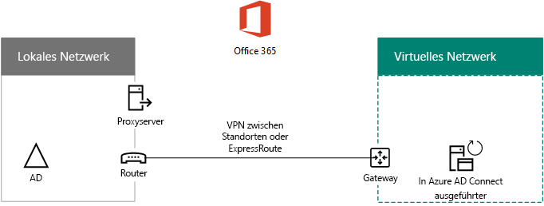

# Bereitstellen der Office 365-Verzeichnissynchronisierung in Microsoft AzureDeploy Office 365 Directory Synchronization in Microsoft Azure

 **Zusammenfassung:**: Bereitstellen von Azure AD Connect auf einem virtuellen Computer in Azure, um Konten zwischen dem lokalen Verzeichnis und dem Azure AD-Mandanten Ihres Office 365-Abonnements zu synchronisieren.**Summary:** Deploy Azure AD Connect on a virtual machine in Azure to synchronize accounts between your on-premises directory and the Azure AD tenant of your Office 365 subscription.
  
Azure Active Directory (AD) Connect (früher als Directory-Synchronisierungstool oder DirSync.exe-Tool bezeichnet) ist eine Serveranwendung, die Sie auf einem einer Domäne beigetretenen Server zum Synchronisieren Ihrer lokalen Windows Server Active Directory-Benutzer mit dem Azure Active Directory-Mandanten Ihres Office 365-Abonnements installieren. Sie können Azure AD Connect auf einem lokalen Server installieren, doch wir empfehlen aus den folgenden Gründen die Installation auf einem virtuellen Computer in Azure:Azure Active Directory (AD) Connect (formerly known as the Directory Synchronization tool, Directory Sync tool, or the DirSync.exe tool) is a server-based application that you install on a domain-joined server to synchronize your on-premises Windows Server Active Directory users to the Azure Active Directory tenant of your Office 365 subscription. You can install Azure AD Connect on a on-premises server, but you can also install it on a virtual machine in Azure for the following reasons:
  
- Sie können Cloud-basierte Server schneller bereitstellen und konfigurieren und so die Dienste Ihren Benutzern schneller zur Verfügung stellen.You can provision and configure cloud-based servers faster, making the services available to your users sooner.
    
- Azure bietet eine bessere Verfügbarkeit von Websites mit weniger Aufwand.Azure offers better site availability with less effort.
    
- Sie können die Anzahl der lokalen Server in Ihrer Organisation verringern.You can reduce the number of on-premises servers in your organization.
    
> [!IMPORTANT]
> Diese Lösung erfordert Konnektivität zwischen dem lokalen Netzwerk und Ihrem virtuellen Azure-Netzwerk. Weitere Informationen finden Sie unter [Verbinden eines lokalen Netzwerks mit einem virtuellen Microsoft Azure-Netzwerk](connect-an-on-premises-network-to-a-microsoft-azure-virtual-network.md).This solution requires connectivity between your on-premises network and your Azure Virtual Network. For more information, see [Connect an on-premises network to a Microsoft Azure virtual network](connect-an-on-premises-network-to-a-microsoft-azure-virtual-network.md). 
  
> [!IMPORTANT]
> Dieser Artikel beschreibt die Synchronisierung einer einzelnen Domäne in einer einzelnen Gesamtstruktur. Azure AD Connect synchronisiert alle Windows Server AD-Domänen in Ihrer Active Directory-Gesamtstruktur mit Office 365. Wenn Sie mehrere Active Directory-Gesamtstrukturen haben, die mit Office 365 synchronisiert werden sollen, finden Sie unter [Synchronisierung des aus mehreren Gesamtstrukturen bestehenden Verzeichnisses mit Szenario für einmaliges Anmelden](https://go.microsoft.com/fwlink/p/?LinkId=393091) weitere Informationen.This article describes synchronization of a single domain in a single forest. Azure AD Connect synchronizes all Windows Server AD domains in your Active Directory forest with Office 365. If you have multiple Active Directory forests to synchronize with Office 365, see [Multi-forest Directory Sync with Single Sign-On Scenario](https://go.microsoft.com/fwlink/p/?LinkId=393091). 
  
> [!NOTE]
> Office 365 verwendet für seinen Verzeichnisdienst Azure Active Directory (Azure AD). Ihr Office 365-Abonnement umfasst einen Azure AD-Mandanten. Dieser Mandant kann auch für die Verwaltung der Identitäten Ihrer Organisation mit anderen Cloud-Workloads, einschließlich anderer SaaS-Anwendungen und Apps, in Azure verwendet werden.Office 365 uses Azure Active Directory (Azure AD) for its directory service. Your Office 365 subscription includes an Azure AD tenant. This tenant can also be used for management of your organization's identities with other cloud workloads, including other SaaS applications and apps in Azure. 
  
## Übersicht über die Bereitstellung der Office 365-Verzeichnissynchronisierung in Windows AzureOverview of deploying Office 365 directory synchronization in Azure

Das folgende Diagramm zeigt Azure AD Connect, das auf einem virtuellen Computer in Azure (der Verzeichnissynchronisierungsserver) ausgeführt wird, der eine lokale Windows Server AD-Gesamtstruktur mit einem Office 365-Abonnement synchronisiert.The following diagram shows Azure AD Connect running on a virtual machine in Azure (the directory sync server) that synchronizes an on-premises Windows Server AD forest to anOffice 365 subscription.
  

  
In diesem Diagramm gibt es zwei Netzwerke, die über eine Standort-zu-Standort-VPN- oder ExpressRoute-Verbindung verbunden sind. Es gibt ein lokales Netzwerk, in dem Windows Server AD-Domänencontroller enthalten sind, und ein virtuelles Azure-Netzwerk mit einem Verzeichnissynchronisierungsserver, einem virtuellen Computer mit ausgeführtem [Azure AD Connect](https://www.microsoft.com/download/details.aspx?id=47594). Es gibt zwei Hauptdatenströme, die vom Verzeichnissynchronisierungsserver stammen:In the diagram, there are two networks connected by a site-to-site VPN or ExpressRoute connection. There is an on-premises network where Windows Server AD domain controllers are located, and there is an Azure virtual network with a directory sync server, which is a virtual machine running [Azure AD Connect](https://www.microsoft.com/download/details.aspx?id=47594). There are two main traffic flows originating from the directory sync server:
  
-  Azure AD Connect fragt einen Domänencontroller im lokalen Netzwerk auf Änderungen an Benutzerkonten und Kennwörtern ab.Azure AD Connect queries a domain controller on the on-premises network for changes to accounts and passwords.
    
-  Azure AD Connect sendet die Änderungen an Konten und Kennwörtern an die Azure AD-Instanz Ihres Office 365-Abonnements. Da der Verzeichnissynchronisierungsserver in einem erweiterten Teil Ihres lokalen Netzwerks vorhanden ist, werden diese Änderungen über den lokalen Netzwerkproxyserver gesendet.Azure AD Connect sends the changes to accounts and passwords to the Azure AD instance of your Office 365 subscription. Because the directory sync server is in an extended portion of your on-premises network, these changes are sent through the on-premises network's proxy server.
    
> [!NOTE]
> Diese Lösung beschreibt die Synchronisierung einer einzelnen Active Directory-Domäne in einer einzelnen Active Directory-Gesamtstruktur. Azure AD Connect synchronisiert alle Active Directory-Domänen in Ihrer Active Directory-Gesamtstruktur mit Office 365. Wenn Sie mehrere Active Directory-Gesamtstrukturen haben, die mit Office 365 synchronisiert werden sollen, finden Sie unter [Synchronisierung des aus mehreren Gesamtstrukturen bestehenden Verzeichnisses mit Szenario für einmaliges Anmelden](https://go.microsoft.com/fwlink/p/?LinkId=393091) weitere Informationen.This solution describes synchronization of a single Active Directory domain, in a single Active Directory forest. Azure AD Connect synchronizes all Active Directory domains in your Active Directory forest with Office 365. If you have multiple Active Directory forests to synchronize with Office 365, see [Multi-forest Directory Sync with Single Sign-On Scenario](https://go.microsoft.com/fwlink/p/?LinkId=393091). 
  
In beiden Fällen wird der Datenverkehr, der von auf dem virtuellen Azure-Computer ausgeführtem Azure AD Connect stammt, an ein Gateway im virtuellen Netzwerk in Azure weitergeleitet, das anschließend den Datenverkehr über die Standort-zu-Standort-VPN- oder die ExpressRoute-Verbindung an das VPN-Gatewaygerät im lokalen Netzwerk weiterleitet. Die Routinginfrastruktur des lokalen Netzwerks leitet dann den Datenverkehr an sein Ziel, z. B. einen Domänencontroller oder einen Proxyserver, weiter.In both cases, the traffic originated by Azure AD Connect running on the Azure virtual machine is forwarded to a gateway on the virtual network in Azure, which then forwards the traffic across the site-to-site VPN or ExpressRoute connection to the VPN gateway device on the on-premises network. The routing infrastructure of the on-premises network then forwards the traffic to its destination, such as a domain controller or a proxy server.
  
Es gibt bei der Bereitstellung dieser Lösung zwei wichtige Schritte:There are two major steps when you deploy this solution:
  
1. Erstellen eines virtuellen Azure-Netzwerks und Einrichten einer Standort-zu-Standort-VPN-Verbindung mit dem lokalen Netzwerk. Weitere Informationen finden Sie unter [Verbinden eines lokalen Netzwerks mit einem virtuellen Microsoft Azure-Netzwerk](connect-an-on-premises-network-to-a-microsoft-azure-virtual-network.md).Create an Azure virtual network and establish a site-to-site VPN connection to your on-premises network. For more information, see [Connect an on-premises network to a Microsoft Azure virtual network](connect-an-on-premises-network-to-a-microsoft-azure-virtual-network.md).
    
2. Installieren von [Azure AD Connect](https://www.microsoft.com/download/details.aspx?id=47594) auf einem einer Domäne beigetretenen virtuellen Computer in Azure und Synchronisieren des lokalen Windows Server AD mit Office 365. Dies umfasst:Install [Azure AD Connect](https://www.microsoft.com/download/details.aspx?id=47594) on a domain-joined virtual machine in Azure, and then synchronize the on-premises Windows Server AD to Office 365. This involves:
    
    Erstellen eines Virtueller Azure-Computer zum Ausführen von Azure AD Connect.Creating an Azure Virtual Machine to run Azure AD Connect.
    
    Installieren und Konfigurieren von [Azure AD Connect](https://www.microsoft.com/download/details.aspx?id=47594).Installing and configuring [Azure AD Connect](https://www.microsoft.com/download/details.aspx?id=47594).
    
    Für das Konfigurieren von Azure AD Connect sind die Anmeldeinformationen (Benutzername und Kennwort) eines Azure AD-Administratorkontos und eines Windows Server AD-Unternehmensadministratorkontos erforderlich. Azure AD Connect wird sofort ausgeführt und kann weiterhin fortlaufend die lokale Windows Server AD-Gesamtstruktur mit Office 365 synchronisieren.Configuring Azure AD Connect requires the credentials (user name and password) of an Azure AD administrator account and a Windows Server AD enterprise administrator account. Azure AD Connect runs immediately and on an ongoing basis to synchronize the on-premises Windows Server AD forest to Office 365.
    
Bevor Sie diese Lösung in der Produktion bereitstellen, richten Sie diese Konfiguration anhand der Anweisungen unter [Verzeichnissynchronisierung für die Office 365-Entwicklungs-/Testumgebung](dirsync-for-your-office-365-dev-test-environment.md) als Nachweis der Wirksamkeit oder für Demonstrations- oder Erprobungszwecke ein.Before you deploy this solution in production, use the instructions in [Directory synchronization for your Office 365 dev/test environment](dirsync-for-your-office-365-dev-test-environment.md) to set this configuration up as a proof of concept, for demonstrations, or for experimentation.
  
> [!IMPORTANT]
> Wenn die Konfiguration von Azure AD Connect abgeschlossen ist,werden die Anmeldeinformationen für das Windows Server AD-Unternehmensadministratorkonto nicht gespeichert.When Azure AD Connect configuration completes, it does not save the Windows Server AD enterprise administrator account credentials. 
  
> [!NOTE]
> In dieser Lösung wird das Synchronisieren einer einzelnen Windows Server AD-Gesamtstruktur mit Office 365 beschrieben. Die in diesem Artikel beschriebene Topologie stellt nur eine Möglichkeit zur Implementierung dieser Lösung dar. Die Topologie Ihrer Organisation kann basierend auf den jeweiligen Netzwerkanforderungen und Sicherheitsaspekten anders sein.This solution describes synchronizing a single Windows Server AD forest to Office 365. The topology discussed in this article represents only one way to implement this solution. Your organization's topology might differ based on your unique network requirements and security considerations. 
  
## Planen des Hostens eines Verzeichnissynchronisierungsservers für Office 365 in AzurePlan for hosting a directory sync server for Office 365 in Azure

### VoraussetzungenPrerequisites

Lesen Sie die folgenden Voraussetzungen für diese Lösung, ehe Sie mit diesem Vorgang beginnen:Before you begin, review the following prerequisites for this solution:
  
- Überprüfen Sie die dazugehörigen Planungsinhalte in [Planen des virtuellen Azure-Netzwerks](connect-an-on-premises-network-to-a-microsoft-azure-virtual-network.md#PlanningVirtual).Review the related planning content in [Plan your Azure virtual network](connect-an-on-premises-network-to-a-microsoft-azure-virtual-network.md#PlanningVirtual).
    
- Stellen Sie sicher, dass alle [Voraussetzungen](connect-an-on-premises-network-to-a-microsoft-azure-virtual-network.md#Prerequisites) für die Konfiguration des virtuellen Azure-Netzwerks erfüllt sind.Ensure that you meet all [prerequisites](connect-an-on-premises-network-to-a-microsoft-azure-virtual-network.md#Prerequisites) for configuring the Azure virtual network.
    
- Halten Sie ein Office 365-Abonnement mit Active Directory-Integrationsfeature vor. Informationen zu Office 365-Abonnements finden Sie auf der [Seite zu Office 365-Abonnements](https://go.microsoft.com/fwlink/p/?LinkId=394278).Have an Office 365 subscription that includes the Active Directory integration feature. For information about Office 365 subscriptions, go to the [Office 365 subscription page](https://go.microsoft.com/fwlink/p/?LinkId=394278).
    
- Stellen Sie einen Virtueller Azure-Computer bereit, auf dem Azure AD Connect zum Synchronisieren Ihrer lokalen Windows Server AD-Gesamtstruktur mit Office 365 ausgeführt wird.Provision one Azure Virtual Machine that runs Azure AD Connect to synchronize your on-premises Windows Server AD forest with Office 365.
    
    Sie benötigen die Anmeldeinformationen (Namen und Kennwörter) für das Windows Server AD-Unternehmensadministratorkonto und ein Azure Active Directory-Administratorkonto.You must have the credentials (names and passwords) for a Windows Server AD enterprise administrator account and an Azure Active Directory Administrator account.
    
### Entwurfsannahmen für die LösungsarchitekturSolution architecture design assumptions

In der folgenden Liste werden die für diese Lösung getroffenen Design-Entscheidungen beschrieben.The following list describes the design choices made for this solution.
  
- Diese Lösung verwendet ein einzelnes virtuelles Azure-Netzwerk mit einer einzelnen Standort-zu-Standort-VPN-Verbindung. Das virtuelle Azure-Netzwerk hostet ein einzelnes Subnetz, das einen Server, den Verzeichnissynchronisierungsserver mit ausgeführtem Azure AD Connect, enthält.This solution uses a single Azure virtual network with a site-to-site VPN connection. The Azure virtual network hosts a single subnet that contains one server, the directory sync server that is running Azure AD Connect. 
    
- Im lokalen Netzwerk sind ein Domänencontroller und DNS-Server vorhanden.On the on-premises network, a domain controller and DNS servers exist.
    
- Azure Active Directory verbinden führt Hash kennwortsynchronisierung anstelle von einmaliges Anmelden. Sie müssen keinen für die Bereitstellung einer Active Directory-Verbunddienste (AD FS)-Infrastruktur. Finden Sie unter [auswählen die richtige Authentifizierungsmethode für Ihre Azure Active Directory-Identität hybridlösung](http://aka.ms/auth-options), um weitere Informationen über kennwortsynchronisierung Hash und Optionen für einmaliges Anmelden.Azure AD Connect performs password hash synchronization instead of single sign-on. You do not have to deploy an Active Directory Federation Services (AD FS) infrastructure. To learn more about password hash synchronization and single sign-on options, see [Choosing the right authentication method for your Azure Active Directory hybrid identity solution](http://aka.ms/auth-options).
    
Es folgen einige weitere Entwurfsoptionen, die Sie berücksichtigen sollten, wenn Sie diese Lösung in Ihrer Umgebung bereitstellen:There are additional design choices that you might consider when you deploy this solution in your environment. These include the following:
  
- Wenn es in einem vorhandenen virtuellen Azure-Netzwerk DNS-Server gibt, bestimmen Sie, ob der Verzeichnissynchronisierungsserver diese für die Namensauflösung anstelle der DNS-Server im lokalen Netzwerk verwenden soll.If there are existing DNS servers in an existing Azure virtual network, determine whether you want your directory sync server to use them for name resolution instead of DNS servers on the on-premises network.
    
- Wenn es Domänencontroller in einem vorhandenen virtuellen Azure-Netzwerk gibt, bestimmen Sie, ob die Konfiguration von Active Directory-Standorten und-Diensten ggf. eine bessere Option für Sie ist. Der Verzeichnissynchronisierungsserver kann die Domänencontroller im virtuellen Azure-Netzwerk anstatt die Domänencontroller im lokalen Netzwerk abfragen, um nach Änderungen an Benutzerkonten und Kennwörtern zu suchen.If there are domain controllers in an existing Azure virtual network, determine whether configuring Active Directory Sites and Services may be a better option for you. The directory sync server can query the domain controllers in the Azure virtual network for changes in accounts and passwords instead of domain controllers on the on-premises network.
    
## Fahrplan für die BereitstellungDeployment roadmap

Das Bereitstellen von Azure AD Connect auf einem virtuellen Computer in Azure umfasst drei Phasen:Deploying Azure AD Connect on a virtual machine in Azure consists of three phases:
  
- Phase 1: Erstellen und Konfigurieren des virtuellen Azure-NetzwerksPhase 1: Create and configure the Azure virtual network
    
- Phase 2: Erstellen und Konfigurieren des virtuellen Azure-ComputersPhase 2: Create and configure the Azure virtual machine
    
- Phase 3: Installieren und Konfigurieren von Azure AD ConnectPhase 3: Install and configure Azure AD Connect
    
Nach der Bereitstellung müssen Sie auch Orte und Lizenzen für die neuen Benutzerkonten in Office 365 zuweisen.After deployment, you must also assign locations and licenses for the new user accounts in Office 365.
  
> [!TIP]
> Der [Verzeichnissynchronisierungsserver im Azure Deployment Kit](https://gallery.technet.microsoft.com/DirSync-Server-in-Azure-32cb2ded) enthält alle Azure PowerShell-Blöcke zum Erstellen dieser Lösung, die Diagramme im Microsoft PowerPoint- und Visio-Format sowie eine Microsoft Excel-Konfigurationsarbeitsmappe, die Azure PowerShell-Befehlsblöcke erstellt, die an Ihre Einstellungen angepasst sind.The [Directory Synchronization Server in Azure Deployment Kit](https://gallery.technet.microsoft.com/DirSync-Server-in-Azure-32cb2ded) contains all of the Azure PowerShell blocks to build out this solution, the diagrams in Microsoft PowerPoint and Visio format, and a Microsoft Excel configuration workbook that generates Azure PowerShell command blocks customized for your settings.
  
### Phase 1: Erstellen und Konfigurieren des virtuellen Azure-NetzwerksPhase 1: Create and configure the Azure virtual network

Zum Erstellen und Konfigurieren des virtuellen Azure-Netzwerks durchlaufen Sie [Phase 1: Vorbereitung Ihres lokalen Netzwerks](connect-an-on-premises-network-to-a-microsoft-azure-virtual-network.md#Phase1) und [Phase 2: Erstellen des standortübergreifenden virtuellen Azure-Netzwerks](connect-an-on-premises-network-to-a-microsoft-azure-virtual-network.md#Phase2) im Fahrplan für die Bereitstellung von [Verbinden eines lokalen Netzwerks mit einem virtuellen Microsoft Azure-Netzwerk](connect-an-on-premises-network-to-a-microsoft-azure-virtual-network.md).To create and configure the Azure virtual network, complete [Phase 1: Prepare your on-premises network](connect-an-on-premises-network-to-a-microsoft-azure-virtual-network.md#Phase1) and [Phase 2: Create the cross-premises virtual network in Azure](connect-an-on-premises-network-to-a-microsoft-azure-virtual-network.md#Phase2) in the deployment roadmap of [Connect an on-premises network to a Microsoft Azure virtual network](connect-an-on-premises-network-to-a-microsoft-azure-virtual-network.md).
  
Nachfolgend sehen Sie die daraus resultierende Konfiguration.This is your resulting configuration.
  

  
Diese Abbildung zeigt ein lokales Netzwerk, das über eine Standort-zu-Standort-VPN- oder ExpressRoute-Verbindung mit einem virtuellen Azure-Netzwerk verbunden ist.This figure shows an on-premises network connected to an Azure virtual network through a site-to-site VPN or ExpressRoute connection.
  
### Phase 2: Erstellen und Konfigurieren des virtuellen Azure-ComputersPhase 2: Create and configure the Azure virtual machine

Erstellen Sie den virtuellen Computer in Azure anhand der Anweisungen unter [Erstellen Ihres ersten virtuellen Windows-Computers im Azure-Portal](https://go.microsoft.com/fwlink/p/?LinkId=393098). Verwenden Sie die folgenden Einstellungen:Create the virtual machine in Azure using the instructions [Create your first Windows virtual machine in the Azure portal](https://go.microsoft.com/fwlink/p/?LinkId=393098). Use the following settings:
  
- Wählen Sie im Bereich **Grundlagen** das gleiche Abonnement, den gleichen Ort und die gleiche Ressourcengruppe als virtuelles Netzwerk aus. Bewahren Sie den Benutzernamen und das Kennwort an einem sicheren Ort auf. Sie benötigen diese Informationen später für die Verbindung mit dem virtuellen Computer.On the **Basics** pane, select the same subscription, location, and resource group as your virtual network. Record the user name and password in a secure location. You will need these later to connect to the virtual machine.
    
- Wählen Sie im Bereich zum Auswählen einer **Größe** die Größe **A2 Standard** aus.On the **Choose a size** pane, choose the **A2 Standard** size.
    
- Wählen Sie im Bereich **Einstellungen** im Abschnitt **Speicher** den Speichertyp **Standard** aus. Wählen Sie im Abschnitt **Netzwerk** den Namen des virtuellen Netzwerks und das Subnetz zum Hosten des Verzeichnissynchronisierungsservers (nicht das Gateway-Subnetz). Alle anderen Einstellungen bleiben bei ihren Standardwerten.On the **Settings** pane, in the **Storage** section, select the **Standard** storage type. In the **Network** section, select the name of your virtual network and the subnet for hosting the directory sync server (not the GatewaySubnet). Leave all other settings at their default values.
    
Stellen Sie sicher, dass der Verzeichnissynchronisierungsserver DNS ordnungsgemäß verwendet. Überprüfen Sie dazu Ihr internes DNS, und vergewissern Sie sich, dass für den virtuellen Computer ein Adresseintrag (A-Datensatz) mit seiner IP-Adresse hinzugefügt wurde.Verify that your directory sync server is using DNS correctly by checking your internal DNS to make sure that an Address (A) record was added for the virtual machine with its IP address. 
  
Befolgen Sie die Anweisungen unter [Herstellen einer Verbindung mit dem virtuellen Computer und Anmelden](https://docs.microsoft.com/azure/virtual-machines/virtual-machines-windows-hero-tutorial?toc=%2fazure%2fvirtual-machines%2fwindows%2ftoc.json#connect-to-the-virtual-machine-and-sign-on), um über eine Remotedesktopverbindung eine Verbindung mit dem Verzeichnissynchronisierungsserver herzustellen. Fügen Sie den virtuellen Computer nach dem Anmelden der lokalen Windows Server AD-Domäne hinzu.Use the instructions in [Connect to the virtual machine and sign on](https://docs.microsoft.com/azure/virtual-machines/virtual-machines-windows-hero-tutorial?toc=%2fazure%2fvirtual-machines%2fwindows%2ftoc.json#connect-to-the-virtual-machine-and-sign-on) to connect to the directory sync server with a Remote Desktop Connection. After signing in, join the virtual machine to the on-premises Windows Server AD domain.
  
Damit Azure AD Connect auf Internetressourcen zugreifen kann, müssen Sie den Verzeichnissynchronisierungsserver für die Verwendung des lokalen Netzwerkproxyservers konfigurieren. Wenden Sie sich für mögliche zusätzlichen Konfigurationsschritte an Ihren Netzwerkadministrator.For Azure AD Connect to gain access to Internet resources, you must configure the directory sync server to use the on-premises network's proxy server. You should contact your network administrator for any additional configuration steps to perform.
  
Nachfolgend sehen Sie die daraus resultierende Konfiguration.This is your resulting configuration.
  

  
Diese Abbildung zeigt den virtuellen Computer des Verzeichnissynchronisierungsservers im lokalen virtuellen Azure-Netzwerk.This figure shows the directory sync server virtual machine in the cross-premises Azure virtual network.
  
### Phase 3: Installieren und Konfigurieren von Azure AD ConnectPhase 3: Install and configure Azure AD Connect

Gehen Sie wie folgt vor:Complete the following procedure:
  
1. Stellen Sie mithilfe einer Remotedesktopverbindung mit einem Windows Server AD-Domänenkonto, das über lokale Administratorberechtigungen verfügt, eine Verbindung mit dem Verzeichnissynchronisierungsserver her. Siehe [Herstellen einer Verbindung mit dem virtuellen Computer und Anmelden](https://docs.microsoft.com/azure/virtual-machines/virtual-machines-windows-hero-tutorial?toc=%2fazure%2fvirtual-machines%2fwindows%2ftoc.json#connect-to-the-virtual-machine-and-sign-on).Connect to the directory sync server using a Remote Desktop Connection with a Windows Server AD domain account that has local administrator privileges. See [Connect to the virtual machine and sign on](https://docs.microsoft.com/azure/virtual-machines/virtual-machines-windows-hero-tutorial?toc=%2fazure%2fvirtual-machines%2fwindows%2ftoc.json#connect-to-the-virtual-machine-and-sign-on).
    
2. Öffnen Sie auf dem Verzeichnissynchronisierungsserver den Artikel [Einrichten der Verzeichnissynchronisierung in Office 365](https://support.office.com/article/Set-up-directory-synchronization-in-Office-365-1b3b5318-6977-42ed-b5c7-96fa74b08846), und führen Sie die dort beschriebenen Schritte für die Verzeichnissynchronisierung mit Kennworthashsynchronisierung aus.From the directory sync server, open the [Set up directory synchronization in Office 365](https://support.office.com/article/Set-up-directory-synchronization-in-Office-365-1b3b5318-6977-42ed-b5c7-96fa74b08846) article and follow the directions for directory synchronization with password hash synchronization.
    
> [!CAUTION]
> Setup erstellt das Konto **AAD_xxxxxxxxxxxx** in der Organisationseinheit (OU) Lokale Benutzer. Verschieben oder entfernen Sie dieses Konto nicht, da dann die Synchronisierung misslingt.Setup creates the **AAD_xxxxxxxxxxxx** account in the Local Users organizational unit (OU). Do not move or remove this account or synchronization will fail.
  
Nachfolgend sehen Sie die daraus resultierende Konfiguration.This is your resulting configuration.
  

  
Diese Abbildung zeigt den Verzeichnissynchronisierungsserver mit Azure AD Connect im lokalen virtuellen Azure-Netzwerk.This figure shows the directory sync server with Azure AD Connect in the cross-premises Azure virtual network.
  
### Zuweisen von Orten und Lizenzen zu Benutzern in Office 365Assign locations and licenses to users in Office 365

Azure AD Connect fügt Ihrem Office 365-Abonnement Konten vom lokalen Windows Server AD hinzu. Damit sich Benutzer jedoch bei Office 365 anmelden und die Dienste verwenden können, müssen die Konten mit einem Speicherort und Lizenzen konfiguriert werden. Befolgen Sie diese Schritte, um den entsprechenden Benutzerkonten den Ort hinzuzufügen und die Lizenzen für sie zu aktivieren:Azure AD Connect adds accounts to your Office 365 subscription from the on-premises Windows Server AD, but in order for users to sign in to Office 365 and use its services, the accounts must configured with a location and licenses. Use these steps to add the location and activate licenses for the appropriate user accounts:
  
1. Melden Sie sich auf der [Office 365-Portalseite](https://portal.office.com) an, und klicken Sie dann auf **Administrator**.Sign in to the [Office 365 portal page](https://portal.office.com), and then click **Admin**.
    
2. Klicken Sie im linken Navigationsbereich auf **Benutzer > Aktive Benutzer**.In the left navigation, click **Users > Active users**.
    
3. Aktivieren Sie in der Liste der Benutzerkonten das Kontrollkästchen neben dem zu aktivierenden Benutzer.In the list of user accounts, select the check box next to the user you want to activate.
    
4. Klicken Sie auf der Seite für den Benutzer auf **Bearbeiten** für **Produktlizenzen**.On the page for the user, click **Edit** for **Product licenses**.
    
5. Wählen Sie auf der Seite **Produktlizenzen** unter **Speicherort** einen Speicherort für den Benutzer aus, und aktivieren Sie dann die entsprechenden Lizenzen für den Benutzer.On the **Product licences** page, select a location for the user for **Location**, and then enable the appropriate licences for the user.
    
6. Wenn Sie fertig sind, klicken Sie auf **Speichern**, und klicken Sie dann zweimal auf **Schließen**.When complete, click **Save**, and then click **Close** twice.
    
7. Kehren Sie zu Schritt 3 zurück, um weitere Benutzer zu bearbeiten.Go back to step 3 for additional users.
    
## Siehe auchSee Also

[Cloudakzeptanz und HybridlösungenCloud adoption and hybrid solutions](cloud-adoption-and-hybrid-solutions.md)
  
[Verbinden eines lokalen Netzwerks mit einem virtuellen Microsoft Azure-NetzwerkConnect an on-premises network to a Microsoft Azure virtual network](connect-an-on-premises-network-to-a-microsoft-azure-virtual-network.md)

[Herunterladen von Azure AD ConnectDownload Azure AD Connect](https://www.microsoft.com/download/details.aspx?id=47594)
  
[Einrichten der Verzeichnissynchronisierung in Office 365Set up directory synchronization in Office 365](https://support.office.com/article/Set-up-directory-synchronization-in-Office-365-1b3b5318-6977-42ed-b5c7-96fa74b08846)
  
[Verzeichnissynchronisierungsserver in Azure Deployment KitDirectory Synchronization server in Azure Deployment Kit](https://gallery.technet.microsoft.com/DirSync-Server-in-Azure-32cb2ded)

