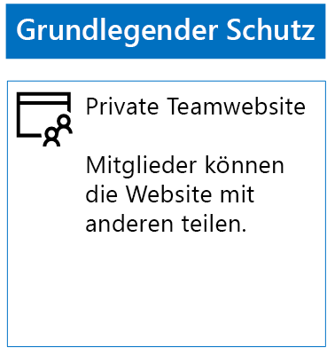
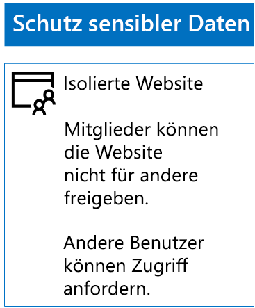
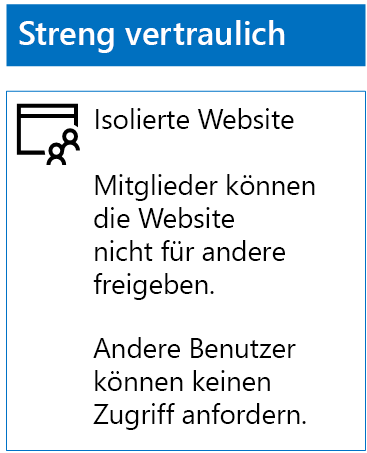

# Bereitstellen von SharePoint Online-Websites für drei Ebenen des Schutzes

 **Zusammenfassung:** Erstellen und Konfigurieren von SharePoint Online Teamwebsites für verschiedene Ebenen der Schutz von Informationen.
  
Verwenden Sie die Schritte in diesem Artikel zum Entwerfen und Bereitstellen von Basisplan empfindlich und streng vertraulich SharePoint Online Teamwebsites. Weitere Informationen zu diesen drei Ebenen des Schutzes finden Sie unter [Secure SharePoint Online-Websites und Dateien](secure-sharepoint-online-sites-and-files.md).
  
## SharePoint Online-Teamwebsites mit Basisschutz

Zum Basisschutz gehören sowohl öffentliche als auch private Teamwebsites. Öffentliche Teamwebsites können von allen Benutzern in einer Organisation ermittelt werden, und alle haben Zugriff darauf. Private Websites können nur von Mitgliedern der Office 365-Gruppe ermittelt werden, die der Teamwebsite zugeordnet ist, und nur sie haben Zugriff darauf. Bei diesen beiden Typen von Teamwebsites können Mitglieder die Website mit anderen Benutzern teilen.
  
### Öffentlich

Um eine SharePoint Online-Teamwebsite mit Basisschutz für den öffentlichen Zugriff und Berechtigungen zu erstellen, gehen Sie wie folgt vor:
  
1. Melden Sie sich beim Office 365-Portal mit einem Konto an, das auch zum Verwalten der SharePoint Online-Teamwebsite verwendet wird (SharePoint Online-Administrator). Hilfe finden Sie unter [Wo kann ich mich bei Office 365 Business anmelden?](https://support.office.com/Article/Where-to-sign-in-to-Office-365-e9eb7d51-5430-4929-91ab-6157c5a050b4).
    
2. Klicken Sie in der Liste von Kacheln auf **SharePoint**.
    
3. Klicken Sie in der neuen Registerkarte **SharePoint** in Ihrem Browser auf **+ Website erstellen**.
    
4. Klicken Sie auf der Seite **Website erstellen** auf **Teamwebsite**.
    
5. Geben Sie in das Feld **Websitename**einen Namen für die öffentliche Teamwebsite. 
    
6. Geben Sie im Feld **Team Site Beschreibung**eine Beschreibung des Zwecks der Website.
    
7. Wählen Sie unter **Datenschutzeinstellungen** die Option **Öffentlich - Alle Benutzer in der Organisation können auf diese Website zugreifen** aus, und klicken Sie dann auf **Weiter**.
    
8. Klicken Sie im Bereich **Wer soll hinzugefügt werden?** auf **Fertig stellen**.
    
Nachfolgend sehen Sie die daraus resultierende Konfiguration.
  

  
### Privat

Um eine SharePoint Online-Teamwebsite mit Basisschutz für den privaten Zugriff und Berechtigungen zu erstellen, gehen Sie wie folgt vor:
  
1. Melden Sie sich beim Office 365-Portal mit einem Konto an, das auch zum Verwalten der SharePoint Online-Teamwebsite verwendet wird (SharePoint Online-Administrator). Hilfe finden Sie unter [Wo kann ich mich bei Office 365 Business anmelden?](https://support.office.com/Article/Where-to-sign-in-to-Office-365-e9eb7d51-5430-4929-91ab-6157c5a050b4).
    
2. Klicken Sie in der Liste von Kacheln auf **SharePoint**.
    
3. Klicken Sie in der neuen Registerkarte **SharePoint** in Ihrem Browser auf **+ Website erstellen**.
    
4. Klicken Sie auf der Seite **Website erstellen** auf **Teamwebsite**.
    
5. Geben Sie in das Feld **Websitename**einen Namen für die private Teamwebsite. 
    
6. Geben Sie Team Site in **Beschreibung eine Beschreibung des Zwecks der Website.**
    
7. Wählen Sie unter **Datenschutzeinstellungen** die Option **Privat - nur Mitglieder können auf diese Website zugreifen** aus, und klicken Sie dann auf **Weiter**.
    
8. Klicken Sie auf die **, die möchten Sie hinzufügen?** Bereich, geben Sie im Feld **Mitglieder hinzufügen**, die Namen der Benutzerkonten, die Zugriff auf diese privaten Teamwebsite haben.
    
9. Wenn Sie fertig sind hinzufügen den ersten Satz von Elementen zu der Website, klicken Sie auf **Fertig stellen**
    
Nachfolgend sehen Sie die daraus resultierende Konfiguration.
  

  
## Vertauliche SharePoint Online-Teamwebsites

Eine vertrauliche SharePoint Online-Teamwebsite ist eine isolierte Teamwebsite. Das heißt, dass die Berechtigungen über die Mitgliedschaft in SharePoint-Gruppen statt der Mitgliedschaft in der Office 365-Gruppe, die der Teamwebsite zugeordnet ist, gesteuert werden.
  
Beim Erstellen einer isolierten Teamwebsite gibt es zwei Hauptschritte.
  
### Schritt 1: Entwerfen der isolierten Website

Um eine isolierte Teamwebsite entwerfen zu können, müssen Sie Folgendes ermitteln:
  
- Die SharePoint-Gruppen und Berechtigungsstufen.
    
- Den Satz von Zugriffsgruppen, die Mitglieder der SharePoint-Gruppen sein sollen.
    
     Der empfohlene Satz von Access Gruppen ist eine für Websitemitglieder, Website und Websiteadministratoren.
    
- Ob Sie verschachtelte Gruppen innerhalb der Zugriffsgruppe verwenden.
    
Die empfohlene Gruppenstruktur und die Berechtigungsstufen sehen z. B. wie folgt aus:
  
|**SharePoint-Gruppe**|**Berechtigungsstufe**|**Zugriffsgruppe (Beispiele)**|
|:-----|:-----|:-----|
|[Websitename] Elemente des Objekts    |Bearbeiten    |[Websitename] Elemente des Objekts    |
|[Websitename] Besucher    |Lesen    |[Websitename] Leser von Berichten    |
|[Websitename] Besitzer    |Vollzugriff    |[Websitename] Administratoren    |
   
Die SharePoint-Gruppen und -Berechtigungsstufen werden standardmäßig für eine Teamwebsite erstellt. Sie müssen die Namen der Zugriffsgruppen ermitteln.
  
Die Details zu den Entwurfsprozess finden Sie unter [Design einer isolierten SharePoint Online-Teamwebsite](design-an-isolated-sharepoint-online-team-site.md).
  
### Schritt 2: Bereitstellen der isolierten Website

Um Ihre isolierte Website bereitzustellen, müssen Sie zuerst Folgendes durchführen:
  
- Ermitteln Sie die Benutzerkonten und Gruppen, die den einzelnen Zugriffsgruppen hinzugefügt werden sollen.
    
- Erstellen Sie die Zugriffsgruppen, und fügen Sie die Benutzer und Gruppenmitglieder hinzu.
    
Die ausführliche Schritte finden Sie unter **Phase 1** des [Bereitstellen einer isolierten SharePoint Online-Teamwebsite](deploy-an-isolated-sharepoint-online-team-site.md).
  
Erstellen Sie als Nächstes mit den folgenden Schritten die SharePoint Online-Teamwebsite.
  
1. Melden Sie sich beim Office 365-Portal mit einem Konto an, das auch zum Verwalten der SharePoint Online-Teamwebsite verwendet wird (SharePoint Online-Administrator). Hilfe finden Sie unter [Wo kann ich mich bei Office 365 Business anmelden?](https://support.office.com/Article/Where-to-sign-in-to-Office-365-e9eb7d51-5430-4929-91ab-6157c5a050b4).
    
2. Klicken Sie in der Liste von Kacheln auf **SharePoint**.
    
3. Klicken Sie auf der neuen Registerkarte **SharePoint** in Ihrem Browser auf **+ Website erstellen**.
    
4. Klicken Sie auf der Seite **Website erstellen** auf **Teamwebsite**.
    
5. Geben Sie in das Feld **Websitename**einen Namen für die private Teamwebsite.
    
6. Geben Sie im Feld **Team Site Beschreibung**eine optionale Beschreibung ein.
    
7. Wählen Sie unter **Datenschutzeinstellungen** die Option **Privat - nur Mitglieder können auf diese Website zugreifen** aus, und klicken Sie dann auf **Weiter**.
    
8. Klicken Sie im Bereich **Wer soll hinzugefügt werden?** auf **Fertig stellen**.
    
Konfigurieren Sie als Nächstes auf der neuen SharePoint Online-Teamwebsite die gewünschten Berechtigungen anhand der folgenden Schritte.
  
1. Ermitteln Sie den UPN (User Principal Name) des IT-Administrators oder der anderen Person, die für das Beantworten und Bearbeiten von Anfragen hinsichtlich des Zugriffs auf die Website zuständig ist (Beispiel für einen UPN: belindan@contoso.com). Notieren Sie den UPN hier: _________________________________________.
    
2. Klicken Sie in der Symbolleiste auf das Symbol „Einstellungen" und anschließend auf **Websiteberechtigungen**.
    
3. Klicken Sie im Bereich **Websiteberechtigungen** auf **Erweiterte Berechtigungseinstellungen**.
    
4. Klicken Sie auf der neuen Registerkarte **Berechtigungen** in Ihrem Browser auf **Einstellungen für Zugriffsrechteanforderungen**.
    
5. Klicken Sie im Dialogfeld **Einstellungen für die Anforderungen** :
    
  - Deaktivieren Sie das Kontrollkästchen **zulassen, dass Mitglieder der Website und einzelne Dateien und Ordner freigeben** und **zulassen, dass Mitglieder der Gruppe der Websitemitglieder an andere Benutzer dazu einladen** .
    
  - Geben Sie den UPN des IT-Administrator aus Schritt 1 in **Alle Anforderungen für den Zugriff zu senden**.
    
  - Klicken Sie auf **OK**.
    
6. Klicken Sie auf der Registerkarte **Berechtigungen** des Browsers **[Websitename]-Elemente** in der Liste auf.
    
7. Klicken Sie auf der Seite **Benutzer und Gruppen** auf **Neu**.
    
8. Klicken Sie im Dialogfeld **Freigeben** Geben Sie den Namen der Gruppe Ihrer Website Zugriff für diese Website, wählen Sie sie aus, und klicken Sie auf **Freigeben**.
    
9. Klicken Sie auf die Schaltfläche „Zurück“ in Ihrem Browser.
    
10. Klicken Sie in der Liste **[Websitename] Besitzer** auf.
    
11. Klicken Sie auf der Seite **Benutzer und Gruppen** auf **Neu**.
    
12. Klicken Sie im Dialogfeld **Freigeben** Geben Sie den Namen der Gruppe der Administratoren-Zugriff für diese Website, wählen Sie sie aus, und klicken Sie auf **Freigeben**.
    
13. Klicken Sie auf die Schaltfläche „Zurück“ in Ihrem Browser.
    
14. Klicken Sie in der Liste auf **Besucher [Websitename]** .
    
15. Klicken Sie auf der Seite **Benutzer und Gruppen** auf **Neu**.
    
16. Klicken Sie im Dialogfeld **Freigeben** Geben Sie den Namen der Websitegruppe Leser von Berichten Zugriff für diese Website, wählen Sie sie aus, und klicken Sie auf **Freigeben**.
    
17. Schließen Sie die Registerkarte **Berechtigungen** Ihres Browsers.
    
Die Ergebnisse dieser Berechtigungseinstellungen sehen folgendermaßen aus:
  
- Die SharePoint-Gruppe **Besitzer [Websitename]** enthält die Gruppe der Administratoren Zugriff, in denen alle Mitglieder die Berechtigungsstufe **Vollzugriff** verfügen.
    
- Die SharePoint-Gruppe **Mitglieder [Websitename]** enthält die Mitglieder Access Websitegruppe, in denen alle Mitglieder die Berechtigungsstufe **Bearbeiten** haben.
    
- Die SharePoint-Gruppe **Besucher [Websitename]** enthält die Websitegruppe Leser von Berichten Zugriff, in denen alle Mitglieder die Berechtigungsstufe **Lesen** verfügen.
    
- Die Möglichkeit für den Mitgliedern der einzuladenden Mitglieder ist deaktiviert.
    
- Die Möglichkeit für Mitglieder auf Zugriff beantragen ist aktiviert.
    
Nachfolgend sehen Sie die daraus resultierende Konfiguration.
  

  
Jetzt können die Mitglieder der Website über die Gruppenmitgliedschaft in einer der Zugriffsgruppen sicher zusammenarbeiten und die Ressourcen der Website nutzen.
  
## Streng vertrauliche SharePoint Online-Teamwebsites

Eine streng vertrauliche SharePoint Online-Teamwebsite ist eine isolierte Teamwebsite. Das heißt, dass die Berechtigungen über die Mitgliedschaft in SharePoint-Gruppen statt der Mitgliedschaft in der Office 365-Gruppe, die der Teamwebsite zugeordnet ist, gesteuert werden.
  
Das Erstellen einer isolierten Teamwebsite für streng vertrauliche Informationen und die Zusammenarbeit umfasst zwei Haupstschritte.
  
### Schritt 1: Entwerfen der isolierten Website

Um eine isolierte Teamwebsite entwerfen zu können, müssen Sie Folgendes ermitteln:
  
- Die SharePoint-Gruppen und Berechtigungsstufen.
    
- Den Satz von Zugriffsgruppen, die Mitglieder der SharePoint-Gruppen sein sollen.
    
     Der empfohlene Satz von Access Gruppen ist eine für Websitemitglieder, Website und Websiteadministratoren.
    
- Ob Sie verschachtelte Gruppen innerhalb der Zugriffsgruppe verwenden.
    
Die empfohlene Gruppenstruktur und die Berechtigungsstufen sehen z. B. wie folgt aus:
  
|**SharePoint-Gruppe**|**Berechtigungsstufe**|**Zugriffsgruppe (Beispiele)**|
|:-----|:-----|:-----|
|[Websitename] Elemente des Objekts    |Bearbeiten    |[Websitename] Elemente des Objekts    |
|[Websitename] Besucher    |Lesen    |[Websitename] Leser von Berichten    |
|[Websitename] Besitzer    |Vollzugriff    |[Websitename] Administratoren    |
   
Die SharePoint-Gruppen und -Berechtigungsstufen werden standardmäßig für eine Teamwebsite erstellt. Sie müssen die Namen der Zugriffsgruppen ermitteln.
  
Die Details zu den Entwurfsprozess finden Sie unter [Design einer isolierten SharePoint Online-Teamwebsite](design-an-isolated-sharepoint-online-team-site.md).
  
### Schritt 2: Bereitstellen der isolierten Website

Um Ihre isolierte Website bereitzustellen, müssen Sie zuerst Folgendes durchführen:
  
- Ermitteln Sie die Benutzer und Gruppenmitglieder der einzelnen Zugriffsgruppen.
    
- Erstellen Sie die Zugriffsgruppen, und fügen Sie die Benutzer und Gruppenmitglieder hinzu.
    
- Erstellen Sie eine isolierte Teamwebsite, die Ihre Zugriffsgruppen verwendet.
    
Die ausführliche Schritte finden Sie unter [Bereitstellen einer isolierten SharePoint Online-Teamwebsite](deploy-an-isolated-sharepoint-online-team-site.md).
  
Nachfolgend sind die Ergebnisse dieser Berechtigungseinstellungen aufgeführt:
  
- Die SharePoint-Gruppe **Besitzer [Websitename]** enthält die Gruppe der Administratoren Zugriff, in denen alle Mitglieder die Berechtigungsstufe **Vollzugriff** verfügen.
    
- Die SharePoint-Gruppe **Mitglieder [Websitename]** enthält die Mitglieder Access Websitegruppe, in denen alle Mitglieder die Berechtigungsstufe **Bearbeiten** haben.
    
- Die SharePoint-Gruppe **Besucher [Websitename]** enthält die Websitegruppe Leser von Berichten Zugriff, in denen alle Mitglieder die Berechtigungsstufe **Lesen** verfügen.
    
- Die Möglichkeit für den Mitgliedern der einzuladenden Mitglieder ist deaktiviert.
    
- Die Möglichkeit für Mitglieder auf Zugriff beantragen ist deaktiviert.
    
Nachfolgend sehen Sie die daraus resultierende Konfiguration.
  

  
Jetzt können die Mitglieder der Website über die Gruppenmitgliedschaft in einer der Zugriffsgruppen sicher zusammenarbeiten und die Ressourcen der Website nutzen.
  
## Nächster Schritt

[Schützen von SharePoint Online-Dateien mit Office 365 Etiketten und DLP](protect-sharepoint-online-files-with-office-365-labels-and-dlp.md)
    
## Weitere Artikel

[Sichern von SharePoint Online-Websites und -Dateien](secure-sharepoint-online-sites-and-files.md)
  
[Sichern von SharePoint Online-Websites in einer Entwicklungs-/Testumgebung](secure-sharepoint-online-sites-in-a-dev-test-environment.md)
  
[Microsoft-Sicherheitsleitfaden für politische Kampagnen, gemeinnützigen Organisationen und andere agile Organisationen](microsoft-security-guidance-for-political-campaigns-nonprofits-and-other-agile-o.md)
  
[Cloudakzeptanz und Hybridlösungen](cloud-adoption-and-hybrid-solutions.md)

