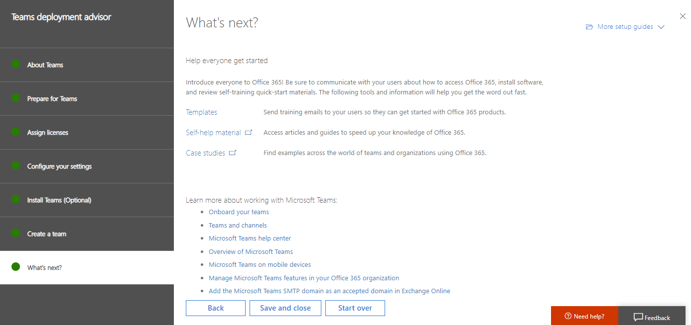

# Bereitstellungs Ratgeber für Office 365-oder Microsoft 365-Dienste

Die Bereitstellungs Ratgeber für Office 365 oder Microsoft 365 bieten selbstgesteuerte Unterstützung für das Einrichten von Office 365 für Ihre Organisation. So greifen Sie auf Sie zu:

1. Melden Sie sich als mandantenadministrator im [Microsoft 365 Admin Center](https://admin.microsoft.com)an.
2. Wählen Sie einen der unten aufgeführten Bereitstellungs Ratgeber oder Anleitungen aus.

Wenn Sie sich nicht als mandantenadministrator anmelden, wird Ihnen schließlich eine Meldung angezeigt, dass Sie über mandantenadministrator Berechtigungen verfügen müssen.

Jeder Ratgeber ist ein Assistent, der Sie durch ihre Auswahlmöglichkeiten für die Features und Optionen führt, die Sie bereitstellen möchten. In einigen Fällen können Sie den Assistenten verwenden, um etwas zu konfigurieren oder eine Einstellung zu aktivieren. Hier ein Beispiel:

Der Ratgeber führt Sie schrittweise durch Entscheidungen zur Anpassung an Ihre Anforderungen. Unterwegs erhalten Sie Anweisungen, Skripts und andere Ressourcen, um die Konfigurationsänderungen vorzunehmen.

Am Ende erhalten Sie Links zu Videos und Referenz Artikeln. Hier ein Beispiel:

Sie können diese Ratgeber jederzeit verwenden, um weitere Informationen zu Office 365 Features und Optionen zu erhalten. Dies umfasst während der Planung oder nachdem Sie die Dienste bereits eingerichtet haben.
  
## Microsoft 365: Windows 10 mit Office 365

Microsoft 365 ist eine vollständige, intelligente Lösung, die Office 365, Windows 10 und Enterprise Mobility + Security (EMS) umfasst. Microsoft 365 ermächtigt jeden, kreativ zu sein und zusammenzuarbeiten, sicher. 

Verwenden Sie diesen Ratgeber zum Einrichten von Windows 10-Geräten oder zum Upgrade von Benutzercomputern auf Windows 10, mit optionaler Bereitstellung von Office-Apps, Windows Analytics und Windows Defender Advanced Threat Protection (ATP) (nur Microsoft 365 Enterprise E5-Plan).

|||
|:-------|:-----|
| **Ausführen** | [Microsoft 365-Bereitstellungs Ratgeber](https://aka.ms/microsoft365setupguide) |
|||

## Vorbereiten der Office 365 Umgebung 

Sie müssen uns ihre Bereitstellungsziele mitteilen, um sicherzustellen, dass Sie Domänen hinzufügen, Benutzer erstellen und Lizenzen in der richtigen Reihenfolge zuweisen. 

|||
|:-------|:-----|
| **Ausführen** | [Vorbereiten des Umgebungs Handbuchs](https://go.microsoft.com/fwlink/?linkid=2005213) |
| **Überwachungs** | [Vorbereiten der Umgebung](https://go.microsoft.com/fwlink/?linkid=2043822) |
||||

### Verify your domain

Sie müssen Office 365 anpassen, indem Sie Ihren eigenen Domänennamen (auch bekannt als Name Ihrer Website) hinzufügen.

|||
|:-------|:-----|
| **Ausführen** |  [Überprüfen Ihrer Domäne in Office 365 Advisor](https://aka.ms/verifyyourdomaino365) |
|||

<!--
+++++++++++++++++++++++++++++++++++++++++++++++++++++++++++++++

OLD SECTION

The deployment advisors for Office 365 provide self-guided support for setting up Office 365 for your organization. To access them for your Office 365 or Microsoft 365 subscription:

1. Sign in as a tenant administrator in the [Microsoft 365 admin center](https://admin.microsoft.com).
2. Select one of the deployment advisors or guides listed in this article.

>[!Note]
>If you do not sign in as a tenant admin, you will eventually see a message that you need to have tenant administrator permissions.
>

Within each advisor, select the features and options you want to deploy. Here is an example.

The advisor builds a step-by-step setup plan that's customized to your needs. Along the way, you'll get a full set of instructions, scripts, and other resources to make the configuration changes.

At the end, you'll get links to videos and reference articles. Here is an example.

Some advisors have automation that will change some of your settings, while in other areas of the advisor you change your settings and data, using the advisor to guide you. 

You can use these advisors anytime to learn more about Office 365 features and options. This includes during planning or after you've already set up the services.
  
## Microsoft 365: Windows 10 with Office 365

Microsoft 365 is a complete, intelligent solution that includes Office 365, Windows 10, and Enterprise Mobility + Security (EMS). Microsoft 365 empowers everyone to be creative and work together, securely. 

Use this advisor to set up Windows 10 devices or upgrade users' computers to Windows 10, with optional deployment of Office apps, Windows Analytics, and Windows Defender Advanced Threat Protection (Microsoft 365 Enterprise E5 plan only).

|||
|:-------|:-----|
| **Run:** | Run the [Microsoft 365 deployment advisor](https://aka.ms/microsoft365setupguide) |
|||

## Prepare your Office 365 environment 

You'll need to tell us your deployment goals to make sure you add domains, create users, and assign licenses in the proper order. 

Watch the [Prepare your environment](https://go.microsoft.com/fwlink/?linkid=2043822) video for an overview.

|||
|:-------|:-----|
| **Run:** | Run the [Prepare your environment guide](https://go.microsoft.com/fwlink/?linkid=2005213) |
|||

+++++++++++++++++++++++++++++++++++++++++++++++++++++++++++++++
-->

## E-Mail-Migration und-Schutz

### Exchange-Migrationsratgeber

Sie müssen Postfächer von Ihrem aktuellen e-Mail-System in Exchange Online in Office 365 mit automatisierten Tools und Schritt-für-Schritt-Anleitungen verschieben. Wir empfehlen den besten Migrationspfad für Ihre Organisation basierend auf Ihrem aktuellen e-Mail-System, die Anzahl der zu migrierenden Postfächer und die Planung der Verwaltung von Benutzern und des Benutzerzugriffs.

|||
|:-------|:-----|
| **Ausführen** | [Office 365-Assistent für die e-Mail-Migration](https://aka.ms/office365setup) |
| **Überwachungs** | [Vorbereiten der Umgebung](https://go.microsoft.com/fwlink/?linkid=2043822)   [Outlook für IOS-Einführung und-Einrichtung](https://aka.ms/mpuwwm)   [Einführung und Einrichtung von Outlook für Android](https://aka.ms/qrbfm3)   [Outlook für Windows Phone Einführung und Einrichtung](https://aka.ms/kkw96x) |
|||
  
Wenn Sie über Gmail verfügen, müssen Sie Ihre Gmail-Kontakte und Google Kalender-Elemente in Office 365 migrieren. Wenn Sie das Gmail-Postfach eines Benutzers in Office 365 migrieren, werden e-Mail-Nachrichten migriert, Kontakte und Kalenderelemente hingegen nicht. Dieses Handbuch enthält die Schritte zum Importieren von gmail-Kontakten und Google Calendar-Elementen in Office 365.

|||
|:-------|:-----|
| **Ausführen** |  [Gmail-Kontakte und Kalender-Assistent](https://aka.ms/gmailcontactscalendar)   |
|||

## Erstellen, speichern und Freigeben von Dateien

### Office 365 ProPlus

Mit Office 365 ProPlus werden die Benutzer auf den neuesten Versionen von Office installiert und aktualisiert.

In diesem Leitfaden finden Sie die Schritte zum Installieren von Office auf einem PC oder Mac für Ihr Unternehmen, einschließlich Tipps für die Einführung aller Benutzer in Office.

|||
|:-------|:-----|
| **Ausführen** |  [Office 365 ProPlus-Schnellstarthandbuch](https://aka.ms/OPPquickstartguide)   |
|||

Der Office 365 ProPlus-Bereitstellungs Ratgeber durchläuft die Schritte zur Unterstützung von Benutzern beim Installieren von Office 365 ProPlus direkt aus dem Office 365 Portal Online oder für die Bereitstellung von Office 365 ProPlus für Ihre Benutzer von einem lokalen Standort aus. Enthalten sind Anweisungen zur Verwendung von System Center Configuration Manager, ein Gruppenrichtlinien-Startskript, ein Betriebs System-Datenträgerabbild oder eine freigegebene Remote Desktop Dienste-Aktivierung (RDS).

|||
|:-------|:-----|
| **Ausführen** | [Office 365 ProPlus-Bereitstellungs Ratgeber](https://aka.ms/o365proplusdeploy) | 
| **Überwachungs** | [Office Experience als Abonnementdienst](https://aka.ms/qo45jf)   [Übersicht über Office 365 ProPlus](https://aka.ms/r359zr) | 
|||

  

### OneDrive for Business

Um schnell mit OneDrive für Unternehmen für Dateispeicherung, Freigabe und Synchronisierung zu beginnen, verwenden Sie dieses Handbuch.

|||
|:-------|:-----|
| **Ausführen** | [Office 365 ProPlus-Bereitstellungs Ratgeber](https://aka.ms/o365proplusdeploy) | 
| **Überwachungs** | [OneDrive für Unternehmen integrierter Vorteil](https://aka.ms/f66hqa)   [Willkommen bei OneDrive: von einem anderen Cloud-Speicheranbieter kommend](https://videoplayercdn.osi.office.net/embed/6b11f30b-725a-4145-8b72-45a41793a432) | 
|||

### SharePoint Online
  
Wenn Sie nicht über eine große Menge an zu migrierenden Daten oder eine lokale SharePoint Server verfügen, die Sie in einem hybriden Setup fortsetzen möchten, lesen Sie dieses Handbuch, um SharePoint Online für die Dokumentspeicherung und Inhaltsverwaltung einzurichten.

|||
|:-------|:-----|
| **Ausführen** |[SharePoint Online Schnellstart](https://aka.ms/SPOquickstartguide) |
|||

  
Sie müssen die Bereitstellungsoption auswählen, die für Ihre Organisation am besten geeignet ist, und die Schritte zum Konfigurieren von SharePoint Online Funktionen zur Erfüllung ihrer geschäftlichen Anforderungen durchgehen. Wählen Sie zwischen Cloud-Bereitstellung, hybridbereitstellung oder lokaler-zu-Cloud-Migration. Anschließend führen Sie die Schritte zum Konfigurieren von SharePoint Online Features wie Dateispeicherung und-Freigabe, externe Dateifreigabe, Websitesammlungen, globale Einstellungen und Benutzerprofile sowie die Office 365 Teamwebsite aus.

|||
|:-------|:-----|
| **Ausführen** | [SharePoint Online-Bereitstellungs Ratgeber](https://aka.ms/spoguidance) |
| **Überwachungs** | [SharePoint: Übersicht](https://go.microsoft.com/fwlink/?linkid=2005315)   [SharePoint: Hybrid](https://go.microsoft.com/fwlink/?linkid=2005219)   [SharePoint: Problembehandlung](https://go.microsoft.com/fwlink/?linkid=2005220) |
|||

## Sicherheit und Identität

### Hybrid Identität mit Azure Active Directory Connect (Azure AD Connect)

Der Azure AD Connect-Ratgeber zeigt Ihnen, wie Sie Benutzerkontoinformationen zu Office 365 hinzufügen, ohne jeden Benutzer manuell zu erstellen. Außerdem erfahren Sie, wie Sie die Kennworthash Synchronisierung oder die Pass-Through-Authentifizierung konfigurieren, damit sich Benutzer mit demselben Kennwort bei Ihrer e-Mail und Ihrer Domäne anmelden können. 

Wenn Sie sich für die Verbundanmeldung mit Active Directory Verbunddienste (AD FS) entscheiden, erhalten Sie in diesem Leitfaden auch Schritte zur Bereitstellung von AD FS auf einem neuen Server oder in einer vorhandenen Windows Server 2012 R2-Farm. 

|||
|:-------|:-----|
| **Ausführen** |  [Azure AD Connect Advisor](https://aka.ms/aadconnectpwsync) |
|||
  

>[!Note]
>Azure AD Connect ersetzt ältere Versionen von Identitäts Integrationstools wie Dirsync und Azure AD Sync und wird in erster Linie zum Hinzufügen von Benutzern und anderen Daten zu Azure AD für Office 365 verwendet.
>

### Azure AD

Verwenden Sie diese Setup Anleitung, um Funktionen wie Gruppenbasierte Zugriffsverwaltung, Self-Service-Kennwortzurücksetzung für Cloud-Anwendungen und Azure AD Anwendungs Proxy für die Veröffentlichung von lokalen Webanwendungen einzurichten.
  
|||
|:-------|:-----|
| **Ausführen** |  [Azure AD Basic Setup Guide](https://aka.ms/azureadbasic) |
|||

Um die zahlreichen Features von Azure AD Premium zu aktivieren, die Identitäts Verwaltungsfunktionen wie mehrstufige Authentifizierung, einmaliges Anmelden (Single Sign-on, SSO), Geräteregistrierung, Self-Service-Kennwort und Gruppenverwaltung sowie Sicherheitsüberwachung bereitstellen, verwenden Sie dieses Handbuch .
  
|||
|:-------|:-----|
| **Ausführen** |  [Leitfaden für Azure AD Premium-Setup](https://aka.ms/aadpguidance) |
|||

### Exchange Online Protection
Microsoft Exchange Online Protection (EoP) ist ein Cloud-basierter e-Mail-Filterdienst, der Ihre Organisation vor Spam und Schadsoftware schützt und Funktionen zum Schutz Ihrer Organisation vor Verstößen gegen Messagingrichtlinien enthält.

|||
|:-------|:-----|
| **Ausführen** |  [Exchange Online Protection (EoP)-Installationshandbuch](https://aka.ms/EOPguidance) |
|||
  
## Kommunikation und Onlinekonferenz

### Office 365-Gruppen

Office 365 Gruppen sind ein freigegebener Arbeitsbereich für e-Mails, Unterhaltungen, Dateien und Ereignisse, bei denen Gruppenmitglieder gemeinsam Inhalte erhalten können. Gruppen in Office 365 können Sie eine Gruppe von Personen auswählen, mit denen Sie zusammenarbeiten möchten, und einfach eine Sammlung von Ressourcen einrichten, die diese Personen freigeben möchten. Sie müssen sich keine Gedanken darüber machen, diesen Ressourcen manuell Berechtigungen zuzuweisen, da Ihnen Mitglieder automatisch die Berechtigungen geben, die Sie für die von Ihrer Gruppe bereitgestellten Tools benötigen.

|||
|:-------|:-----|
| **Ausführen** |[Setup Handbuch für Office 365 Gruppen](https://aka.ms/groupsguide) |
|||
  
### Microsoft Teams

Microsoft Teams ist der Chat basierte Zusammenarbeits Dienst in Office 365, der Team Arbeitsbereiche für Chats, Anrufe, Besprechungen und private Nachrichten bereitstellt. Der Bereitstellungs Ratgeber für Teams unterstützt Sie beim Einrichten und Konfigurieren der optimalen Teams-Erfahrung mit Exchange Online-, SharePoint Online-, OneDrive für Unternehmen-und Office 365 Gruppen. Sie enthält Informationen zum Konfigurieren von Mandanten Einstellungen, Teams und Kanälen für Ihre Projekte, Anrufe und Besprechungen, Messaging, Registerkarten für den schnellen Zugriff auf apps, Informations Bots und Connectors für Dienste von Drittanbietern.

|||
|:-------|:-----|
| **Ausführen** | [Microsoft Teams-Bereitstellungs Ratgeber](https://aka.ms/teamsguidance) |
| **Überwachungs** | [Erste Schritte mit Microsoft Teams](https://youtu.be/ENEQzM2u_vA)|
||||

### Skype for Business

Um mit Skype for Business für Instant Messaging (Sofortnachrichten), Anwesenheit, Onlinebesprechungen und Bildschirmfreigabe schnell loslegen zu können, benötigen Sie dieses grundlegende Setup nur, wenn Sie keine erweiterten Features benötigen.

|||
|:-------|:-----|
| **Ausführen** | [Skype for Business Schnellstarthandbuch](https://aka.ms/SfBquickstartguide) |
|||
  
Für eine ausführlichere Unterstützung hilft Ihnen der Skype for Business-Bereitstellungs Ratgeber beim Einstieg in Skype for Business Online. Dieser Ratgeber zeigt Ihnen, wie Sie Skype for Business Funktionen wie Instant Messaging (Sofortnachrichten), Onlinebesprechungen, Videokonferenzen, PSTN-Konferenzen, Cloud private Branding Exchange (PBX) und Skype Live Meeting einrichten. Die Schritte umfassen das Einrichten einer Hybridumgebung, in der Sie Skype for Business Online mit Ihrer lokalen Skype for Business-Bereitstellung verbinden.

|||
|:-------|:-----|
| **Ausführen** |  [Skype for Business-Bereitstellungs Ratgeber](https://aka.ms/skypeguidance) |
| **Überwachungs** |  [Schnellstart für Skype for Business Aktivierung](https://aka.ms/cjfutd)   [Erste Schritte mit Skype](https://aka.ms/ofg77x) |
|||

  
### Yammer

Wenn Sie keine Jammer Netzwerke zum konsolidieren oder migrieren haben, benötigen Sie für die erfolgreiche Einführung von jammern in Ihrer Organisation lediglich dieses grundlegende Setup Handbuch.

|||
|:-------|:-----|
| **Ausführen** |  [Schnellstarthandbuch für jammern](https://aka.ms/yamquickstartguide) |
|||
  
Das Jammern des Enterprise-Setup Handbuchs hilft Ihnen, Ihre Organisation mit jammern Enterprise in Betrieb zu nehmen. Sie enthält Anleitungen zum Verbinden vorhandener Jammer Netzwerke, die Sie möglicherweise Office 365 oder eine neue jammern-Domäne einrichten müssen. Wenn Sie über mehrere Jammer Netzwerke verfügen, wird auch beschrieben, wie Sie Jammer Netzwerke in einem einzelnen jammern-Unternehmensnetzwerk konsolidieren.

|||
|:-------|:-----|
| **Ausführen** |  [Jammern des Enterprise-Setup Leitfadens](https://aka.ms/yammerdeploy) |
|||
  
## StaffHub

Microsoft StaffHub ist eine Cloud-basierte Plattform, die auf allen Geräten funktioniert. Es ermöglicht Mitarbeitern von First-Work (Mitarbeiter mit Rollen, die keinen Computer benötigen) und deren Vorgesetzten, Schicht Zeitpläne zu verwalten, mit ihren Teams zu kommunizieren und Inhalte freizugeben.

|||
|:-------|:-----|
| **Ausführen** |  [Microsoft StaffHub-Setup Handbuch](https://aka.ms/staffhubguide) |
|||

  
## Weitere Videos

### Microsoft 365 Admin Center

- [Ausrichtung des Admin Centers](https://www.microsoft.com/en-us/videoplayer/embed/RWfMut)

- [Erstellen von Benutzern im Admin Center](https://aka.ms/ac-createusers)

- [DNS-Einträge und das Admin Center](https://aka.ms/ac-dnsrecords)

- [Überprüfen Ihrer Domäne im Admin Center](https://aka.ms/ac-verifydns)

### Gerätesicherheit

- [Intune](https://go.microsoft.com/fwlink/?linkid=2054124)

