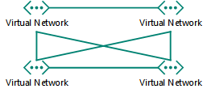
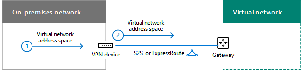
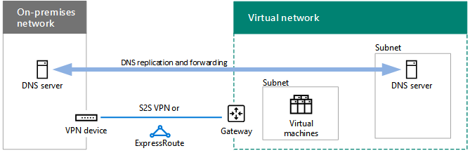

# Entwerfen von Netzwerken für Microsoft Azure-IaaSDesigning networking for Microsoft Azure IaaS

 **Zusammenfassung:** Hier erfahren Sie, wie Sie das optimierte Netzwerk für Arbeitsauslastungen in Microsoft Azure IaaS entwerfen.**Summary:** Understand how to design optimized networking for workloads in Microsoft Azure IaaS.
  
Um Netzwerke für IT-Workloads, die in Azure IaaS gehostet werden, optimieren zu können, benötigen Sie als Voraussetzung grundlegende Kenntnisse über Azure Virtual Networks (VNets), Adressräume, Routing, DNS und Lastenausgleich.Optimizing networking for IT workloads hosted in Azure IaaS requires an understanding of Azure virtual networks (VNets), address spaces, routing, DNS, and load balancing.
  
## VNet-PlanungsschrittePlanning steps for any VNet

Führen Sie die folgenden Schritte für jede Art von VNet aus.Follow these steps for any type of VNet.
  
### Schritt 1: Bereiten Sie das Intranet für Microsoft Cloud Services vor.Step 1: Prepare your intranet for Microsoft cloud services.

Durchlaufen Sie die **Schritte zum Vorbereiten Ihres Netzwerks für Microsoft Cloud Services** in [Gemeinsame Elemente der Microsoft-Cloudkonnektivität](common-elements-of-microsoft-cloud-connectivity.md).Go through the **Steps to prepare your network for Microsoft cloud services** section in [Common elements of Microsoft cloud connectivity](common-elements-of-microsoft-cloud-connectivity.md).
  
### Schritt 2: Optimieren Sie die Internetbandbreite.Step 2: Optimize your Internet bandwidth.

Optimieren Sie die Internetbandbreite mithilfe der Schritte 2 bis 4 der **Schritte zum Vorbereiten Ihres Netzwerks für Microsoft SaaS-Dienste** in [Designing networking for Microsoft SaaS](designing-networking-for-microsoft-saas.md).Optimize your Internet bandwidth using steps 2 - 4 of the **Steps to prepare your network for Microsoft SaaS services** section in [Designing networking for Microsoft SaaS](designing-networking-for-microsoft-saas.md).
  
### Schritt 3: Bestimmen Sie den VNet-Typ (reine Cloudbereitstellung oder standortübergreifend).Step 3: Determine the type of VNet (cloud-only or cross-premises).

Eine reines Cloud-VNet hat keine Verbindung mit einem lokalen Netzwerk. Hier ein Beispiel:A cloud-only VNet has no connection to an on-premises network. Here is an example.
  
**Abbildung 1: Reines Cloud-VNet****Figure 1: A cloud-only VNet**

  
Abbildung 1 zeigt eine Reihe von virtuellen Computern in einem reinen Cloud-VNet.Figure 1 shows a set of virtual machines in a cloud-only VNet.
  
Ein standortübergreifendes VNet verfügt über ein Azure-Gateway über eine S2S-VPN-Verbindung (Standort-zu-Standort) oder eine ExpressRoute-Verbindung zu einem lokalen Netzwerk. Hier ein Beispiel:A cross-premises VNet has a site-to-site (S2S) VPN or ExpressRoute connection to an on-premises network through an Azure gateway. Here is an example.
  
**Abbildung 2: Ein standortübergreifendes VNet****Figure 2: A cross-premises VNet**

  
Abbildung 2 zeigt eine Reihe von virtuellen Computern in einem standortübergreifenden VNet, das mit einem lokalen Netzwerk verbunden ist.Figure 2 shows a set of virtual machines in a cross-premises VNet, which is connected to an on-premises network.
  
Weitere [Planungsschritte für ein standortübergreifendes VNet](designing-networking-for-microsoft-azure-iaas.md#cross_prem) finden Sie im entsprechenden Abschnitt in diesem Artikel.See the additional [Planning steps for a cross-premises VNet](designing-networking-for-microsoft-azure-iaas.md#cross_prem) section in this article.
  
### Schritt 4: Ermitteln Sie den VNet-Adressraum.Step 4: Determine the address space of the VNet.

In Tabelle 1 sind die Adressräume für die verschiedenen VNet-Typen aufgeführt.Table 1 shows the address spaces for the different types of VNets.
  
|**Typ des VNet****Type of VNet**|**Adressraum des virtuellen Netzwerks****Virtual network address space**|
|:-----|:-----|
|Rein cloudbasiertCloud-only    |Beliebiger privater AdressraumArbitrary private address space    |
|Miteinander verbunden, reine CloudbereitstellungInterconnected cloud-only    |Beliebiges privates, jedoch nicht überlappend mit anderen verbundenen VNetsArbitrary private, but not overlapping with other connected VNets    |
|StandortübergreifendCross-premises    |Privater Adressraum, der jedoch nicht mit lokalen VNets überlapptPrivate, but not overlapping with on-premises    |
|Miteinander verbunden, standortübergreifendInterconnected cross-premises    |Privater Adressraum, der jedoch nicht mit lokalen und anderen verbundenen VNets überlapptPrivate, but not overlapping with on-premises and other connected VNets    |
   
 **Tabelle 1: VNet-Typen und ihr entsprechender Adressraum****Table 1: Types of VNets and their corresponding address space**
  
Virtuellen Computern wird vom Adressraum des Subnetzes durch DHCP ein Adresskonfiguriation zugewiesen:Virtual machines are assigned an address configuration from the address space of the subnet by DHCP:
  
- Adresse/SubnetzmaskeAddress/subnet mask
    
- StandardgatewayDefault gateway
    
- IP-Adressen des DNS-ServersDNS server IP addresses
    
Sie können auch eine statische IP-Adresse reservieren.You can also reserve a static IP address.
  
Virtuellen Computern kann auch eine öffentliche IP-Adresse zugewiesen werden, entweder einzeln oder über den enthaltenden Clouddienst (nur für herkömmliche Bereitstellungscomputer).Virtual machines can also be assigned a public IP address, either individually or from the containing cloud service (for classic deployment machines only).
  
### Schritt 5: Bestimmen Sie die Subnetze im VNet und die ihnen zugewiesenen Adressräume.Step 5: Determine the subnets within the VNet and the address spaces assigned to each.

Es gibt zwei Arten von Subnetzen in einem VNet: ein Gatewaysubnetz und ein Hostingsubnetz für virtuelle Computer.There are two types of subnets in a VNet, a gateway subnet and a virtual machine-hosting subnet.
  
**Abbildung 3: Die zwei Arten von Subnetzen in Azure****Figure 3: The two types of subnets in Azure**

  
Abbildung 3 zeigt eine VNet mit einem Gateway-Subnetz, das über ein Azure-Gateway und einen Satz virtueller Computer gehosteter Subnetze mit virtuellen Computern verfügt.Figure 3 shows a VNet containing a gateway subnet that has an Azure gateway and a set of virtual machine-hosting subnets containing virtual machines.
  
Azure benötigt das Azure-Gatewaysubnetz zum Hosten der beiden virtuellen Computer Ihres Azure-Gateways.The Azure gateway subnet is needed by Azure to host the two virtual machines of your Azure gateway. Angeben eines Adressraums mit einer Präfixlänge von mindestens 29 Bit (Beispiel: 192.168.15.248/29).Specify an address space with at least a 29-bit prefix length (example: 192.168.15.248/29). Eine 27-Bit-oder eine kleinere Präfixlänge wird empfohlen, insbesondere, wenn Sie Express Route verwenden möchten.A 27-bit or smaller prefix length is recommended, especially if you are planning to use ExpressRoute.
  
Eine bewährte Methode zum Bestimmen des Adressraums des Azure-Gateway-Subnetzes ist:A best practice for determining the address space of the Azure gateway subnet is:
  
1. Legen Sie die Größe des Gatewaysubnetzes fest.Decide on the size of the gateway subnet.
    
2. Legen Sie für die variablen Bits im Adressraum des VNet die Bits für das Gatewaysubnetz auf 0 und für die anderen Bits auf 1 fest.In the variable bits in the address space of the VNet, set the bits used for the gateway subnet to 0 and set the remaining bits to 1.
    
3. Konvertieren Sie dies in eine Dezimalzahl, und drücken Sie diese als Adressraum aus, wobei Sie als Präfixlänge die Größe des Gatewaysubnetzes festlegen.Convert to decimal and express as an address space with the prefix length set to the size of the gateway subnet.
    
Wenn Sie diese Methode verwenden, befindet sich der Adressraum für das Gatewaysubnetz immer am äußersten Ende des VNet-Adressbereichs.With this method, the address space for the gateway subnet is always at the farthest end of the VNet address space.
  
Es folgt ein Beispiel für die Definition des Adresspräfixes für das Gatewaysubnetz: Der Adressraum des VNet ist 10.119.0.0/16. Die Organisation verwendet anfänglich eine Standort-zu-Standort-VPN-Verbindung, später jedoch ExpressRoute. In Tabelle 2 sind die Schritte sowie die Ergebnisse der Ermittlung des Adresspräfixes in der Netzwerkpräfixnotation für das Gatewaysubnetz aufgeführt (auch als CIDR bezeichnet).Here is an example of defining the address prefix for the gateway subnet: The address space of the VNet is 10.119.0.0/16. The organization will initially use a site-to-site VPN connection, but will eventually get ExpressRoute. Table 2 shows the steps and results of determining the gateway subnet address prefix in network prefix notation (also known as CIDR).

Nachfolgend finden Sie die Schritte und Beispiele zum Bestimmen des Gateway-Subnetz-Adress Präfixes:Here are the steps and example of determining the gateway subnet address prefix:

1. Legen Sie die Größe des Gatewaysubnetzes fest.Decide on the size of the gateway subnet. Für unser Beispiel haben wir uns für/28 entschieden.For our example, we chose /28.
2. Legen Sie die Bits im Variablen Teil des VNet-Adressraums (b) auf 0 für die Gateway-Subnetz-Bits (G) fest, andernfalls 1 (V).Set the bits in the variable portion of the VNet address space (b) to 0 for the gateway subnet bits (G), otherwise 1 (V). Für unser Beispiel verwenden wir den 10.119.0.0/16-Adressraum für die VNet.For our example, we are using the 10.119.0.0/16 address space for the VNet.
 
 10,119.10.119. bbbbbbbb.bbbbbbbb . bbbbbbbbbbbbbbbb
 10,119.10.119. VVVVVVVV .VVVVVVVV . VVVVGGGGVVVVGGGG
 10,119.10.119. 11111111.11111111 . 1111000011110000
  
3. Konvertieren Sie das Ergebnis aus Schritt 2 in Dezimal und Express als Adressraum.Convert the result from step 2 to decimal and express as an address space. Für unser Beispiel 10,119.For our example, 10.119. 11111111.11111111 . 11110000 ist 10.119.255.240, und mit der Präfixlänge aus Schritt 1 (28 in unserem Beispiel) lautet das resultierende Gateway-Subnetz-Adresspräfix 10.119.255.240/28.11110000 is 10.119.255.240, and with the prefix length from step 1, (28 in our example), the resulting gateway subnet address prefix is 10.119.255.240/28.
  
Weitere Informationen finden Sie unter [Adressraum Rechner für Azure-Gateway](https://gallery.technet.microsoft.com/scriptcenter/Address-prefix-calculator-a94b6eed) -Subnetze.See [Address space calculator for Azure gateway subnets](https://gallery.technet.microsoft.com/scriptcenter/Address-prefix-calculator-a94b6eed) for more information.
  
Sie platzieren virtuelle Azure-Computer in Hostingsubnetzen für virtuelle Computer, wobei Sie hier gemäß den typisch lokalen Richtlinien folgen können, wie z. B. einer allgemeinen Rolle oder Ebene einer Anwendung oder für die Subnetzisolierung.Virtual machine-hosting subnets are where you place Azure virtual machines, which you can do according to typical on-premises guidelines, such as a common role or tier of an application or for subnet isolation.
  
Azure verwendet die ersten drei Adressen in jedem Subnetz.Azure uses the first 3 addresses on each subnet. Daher ist die Anzahl der möglichen Adressen in einem Azure-Subnetz 2n -5, wobei n die Anzahl der Host-Bits ist.Therefore, the number of possible addresses on an Azure subnet is 2n - 5, where n is the number of host bits. In Tabelle 3 sind der Bereich der erforderlichen virtuellen Computer, die Anzahl der erforderlichen Hostbits und die entsprechende Subnetzgröße aufgeführt.Table 3 shows the range of virtual machines required, the number of hosts bits needed, and the corresponding subnet size.
  
|**Erforderliche virtuelle Computer****Virtual machines required**|**Hostbits****Host bits**|**Subnetzgröße****Subnet size**|
|:-----|:-----|:-----|
|1-31-3    |33    |/29/29    |
|4-114-11    |44    |/28/28    |
|12-2712-27    |55    |/27/27    |
|28-5928-59    |66    |/26/26    |
|60-12360-123    |77    |/25/25    |
   
 **Tabelle 3: Anforderungen der virtuellen Computer und ihre Subnetzgrößen****Table 3: Virtual machine requirements and their subnet sizes**
  
Weitere Informationen zur maximalen Anzahl von virtuellen Computern in einem Subnetz oder VNet finden Sie unter [Networking Limits](https://docs.microsoft.com/azure/azure-subscription-service-limits#networking-limits).For more information about the maximum amount of virtual machines on a subnet or VNet, see [Networking Limits](https://docs.microsoft.com/azure/azure-subscription-service-limits#networking-limits).
  
Weitere Informationen finden Sie unter [Planen und Entwerfen von virtuellen Azure-Netzwerken](https://azure.microsoft.com/documentation/articles/virtual-network-vnet-plan-design-arm/).For more information, see [Plan and design Azure Virtual Networks](https://azure.microsoft.com/documentation/articles/virtual-network-vnet-plan-design-arm/).
  
### Schritt 6: Ermitteln Sie die DNS-Serverkonfiguration und die Adressen der DNS-Server, die den VMs im VNet zugewiesen werden sollen.Step 6: Determine the DNS server configuration and the addresses of the DNS servers to assign to VMs in the VNet.

Azure weist virtuellen Computern die Adressen der DNS-Server über DHCP zu. DNS-Server können:Azure assigns virtual machines the addresses of DNS servers by DHCP. DNS servers can be:
  
- durch Azure bereitgestellt werden: Bietet lokale Namensregistrierung sowie lokale und über das Internet durchgeführte NamensauflösungSupplied by Azure: Provides local name registration and local and Internet name resolution
    
- von Ihnen bereitgestellt werden: Bietet lokale oder über das Internet durchgeführte Namensregistrierung und Namensauflösung entweder über das Intranet oder über das InternetProvided by you: Provides local or intranet name registration and either intranet or Internet name resolution
    
In Tabelle 4 sind die verschiedenen DNS-Serverkonfigurationen für jeden VNet-Typ aufgeführt.Table 4 shows the different configurations of DNS servers for each type of VNet.
    
|**Typ des VNet****Type of VNet**|**DNS-Server****DNS server**|
|:-----|:-----|
|Rein cloudbasiertCloud-only    |von Azure für die lokale und über das Internet durchgeführte Namensauflösung bereitgestelltAzure-supplied for local and Internet name resolution    virtueller Azure-Computer für die lokale und über das Internet durchgeführte Namensauflösung (DNS-Weiterleitung)Azure virtual machine for local and Internet name resolution (DNS forwarding)    |
|StandortübergreifendCross-premises    |lokal für die lokale und über das Intranet durchgeführte NamensauflösungOn-premises for local and intranet name resolution    virtueller Azure-Computer für die lokale und über das Intranet durchgeführte Namensauflösung (DNS-Replikation und -Weiterleitung)Azure virtual machine for local and intranet name resolution (DNS replication and forwarding)    |
   
 **Tabelle 4: DNS-Serveroptionen für die beiden verschiedenen VNet-Typen****Table 4: DNS server options for the two different types of VNets**
  
Weitere Informationen finden Sie unter [Namensauflösung für VMS und Rolleninstanzen](https://docs.microsoft.com/azure/virtual-network/virtual-networks-name-resolution-for-vms-and-role-instances).For more information, see [Name Resolution for VMs and Role Instances](https://docs.microsoft.com/azure/virtual-network/virtual-networks-name-resolution-for-vms-and-role-instances).
  
### Schritt 7: Ermitteln Sie die Lastenausgleichskonfiguration (Internet-bezogen oder intern).Step 7: Determine the load balancing configuration (Internet-facing or internal).

In einigen Fällen möchten Sie eingehenden Datenverkehr auf eine Gruppe von Servern verteilen, die über die gleiche Rolle verfügen. Azure IaaS verfügt über eine integrierte Funktion, mit der dies für dem Internet zugewandten und internen Datenverkehr vorgenommen werden kann.In some cases, you want to distribute incoming traffic to a set of servers that have the same role. Azure IaaS has a built-in facility to do this for Internet-facing and internal traffic loads.
  
Der dem Internet zugewandte Lastenausgleich von Azure verteilt den unangefordert aus dem Internet kommenden Datenverkehr zufällig auf die Mitglieder einer Lastenausgleichsgruppe. Azure Internet-facing load balancing randomly distributes unsolicited incoming traffic from the Internet to the members of a load-balanced set.
  
**Abbildung 4: Ein externer Lastenausgleich in Azure****Figure 4: An external load balancer in Azure**

  
Abbildung 4 zeigt einen externen Lastenausgleich in Azure, der eingehenden Datenverkehr über eine eingehende NAT-Regel oder einen Endpunkt an eine Gruppe virtueller Computer in einem Satz mit Lastenausgleich verteilt.Figure 4 shows an external load balancer in Azure that distributes incoming traffic on an inbound NAT rule or endpoint to a set of virtual machines in a load-balanced set.
  
Der Azure-interne Lastenausgleich verteilt unangeforderten eingehenden Datenverkehr von andere Azure-VMs oder Intranetcomputern an die Mitglieder einer Lastenausgleichsgruppe. Azure internal load balancing randomly distributes unsolicited incoming traffic from other Azure VMs or from intranet computers to the members of a load-balanced set. 
  
**Abbildung 5: Ein interner Lastenausgleich in Azure****Figure 5: An internal load balancer in Azure**

  
Abbildung 5 zeigt einen internen Lastenausgleich in Azure, der eingehenden Datenverkehr für eine eingehende NAT-Regel oder einen Endpunkt an eine Gruppe virtueller Computer in einem Satz mit Lastenausgleich verteilt.Figure 5 shows an internal load balancer in Azure that distributes incoming traffic on an inbound NAT rule or endpoint to a set of virtual machines in a load-balanced set.
  
Weitere Informationen finden Sie unter [Azure-Lastenausgleichsmodul](https://docs.microsoft.com/azure/load-balancer/load-balancer-overview).For more information, see [Azure Load Balancer](https://docs.microsoft.com/azure/load-balancer/load-balancer-overview).
  
### Schritt 8: Ermitteln Sie die Verwendung von virtuellen Geräten und benutzerdefinierten Routen.Step 8: Determine the use of virtual appliances and user-defined routes.

Wenn Sie Datenverkehrs an virtuelle Geräte im VNet weiterleiten müssen, müssen Sie einem Subnetz möglicherweise eine oder mehrere benutzerdefinierte Routen hinzufügen.If you need to forward traffic to virtual appliances in your VNet, you may need to add one or more user-defined routes to a subnet.
  
**Abbildung 6: Virtuelle Geräte und benutzerdefinierte Routen in Azure****Figure 6: Virtual appliances and user-defined routes in Azure**

  
Abbildung 6 zeigt ein standortübergreifendes VNet und eine benutzerdefinierte Route, die einem Hostingsubnetz für virtuelle Computer zugewiesen ist, das auf ein virtuelles Gerät verweist.Figure 6 shows a cross-premises VNet and a user-defined route assigned to a virtual machine-hosting subnet that points to a virtual appliance.
  
Weitere Informationen finden Sie unter [benutzerdefinierte Routen und IP-Weiterleitung](https://docs.microsoft.com/azure/virtual-network/virtual-networks-udr-overview).For more information, see [User Defined Routes and IP Forwarding](https://docs.microsoft.com/azure/virtual-network/virtual-networks-udr-overview).
  
### Schritt 9 Ermitteln Sie, wie Computer aus dem Internet Verbindungen mit virtuellen Computern herstellen.Step 9: Determine how computers from the Internet will connect to virtual machines.

Es gibt mehrere Möglichkeiten, den virtuellen Computern in einem VNet Zugang zum Internet bereitzustellen. Dazu zählt der Zugriff vom Netzwerk Ihrer Organisation über einen Proxyserver oder ein anderes Edgegerät.There are multiple ways to provide Internet access to the virtual machines on a VNet, which includes access from your organization network through your proxy server or other edge device.
  
In Tabelle 5 sind die Methoden zum Filtern oder Prüfen von unangefordert eingehendem Datenverkehr aufgeführt.Table 5 lists the methods for filtering or inspecting unsolicited incoming traffic.
  
|**Methode****Method**|**Bereitstellungsmodell****Deployment model**|
|:-----|:-----|
|1. Endpunkte und ACLs, für Clouddienste konfiguriert1. Endpoints and ACLs configured on cloud services    |ClassicClassic    |
|2. Netzwerksicherheitsgruppen2. Network security groups    |Ressourcenmanager und klassischResource Manager and classic    |
|3. Dem Internet zugewandter Lastenausgleich mit NAT-Eingangsregeln3. Internet-facing load balancer with inbound NAT rules    |RessourcenmanagerResource Manager    |
|4. Netzwerksicherheits-Appliances im Azure Marketplace (nicht dargestellt)4. Network security appliances in the Azure Marketplace (not shown)    |Ressourcenmanager und klassischResource Manager and classic    |
   
 **Tabelle 5: Methoden zum Herstellen einer Verbindung mit virtuellen Computern und ihre entsprechenden Azure-Bereitstellungsmodelle****Table 5: Methods of connecting to virtual machines and their corresponding Azure deployment models**
  
**Abbildung 7: Herstellen einer Verbindung mit virtuellen Azure-Computern über das Internet****Figure 7: Connecting to Azure virtual machines over the Internet**

  
Abbildung 7 zeigt einen mit dem Internet verbundenen Computer, der mit einem virtuellen Computer in einem Clouddienst anhand eines Endpunkts verbunden ist, einen virtuellen Computer in einem Subnetz mit einer Netzwerksicherheitsgruppe und einen virtuellen Computer in einem Subnetz mit einem externen Lastenausgleich und NAT-Eingangsregeln.Figure 7 shows an Internet-connected computer connecting to a virtual machine in a cloud service using an endpoint, a virtual machine on a subnet using a network security group, and a virtual machine on a subnet using an external load balancer and inbound NAT rules.
  
Zusätzlicher Sicherheit bereitgestellt durch:Additional security is provided by:
  
- Remotedesktop- und SSH-Verbindungen, die verschlüsselt und authentifiziert werdenRemote Desktop and SSH connections, which are authenticated and encrypted.
    
- Remote PowerShell-Sitzungen, die verschlüsselt und authentifiziert werdenRemote PowerShell sessions, which are authenticated and encrypted.
    
- IPsec-Transportmodus, den Sie für die End-to-End-Verschlüsselung verwenden könnenIPsec transport mode, which you can use for end-to-end encryption.
    
- Azure DDOS-Schutz, der vor externe und interne Angriffen schütztAzure DDOS protection, which helps prevent external and internal attacks
    
Weitere Informationen finden Sie unter [Microsoft Cloud Security for Enterprise Architects](https://aka.ms/cloudarchsecurity) und [Azure Network Security](https://azure.microsoft.com/blog/azure-network-security/).For more information, see [Microsoft Cloud Security for Enterprise Architects](https://aka.ms/cloudarchsecurity) and [Azure Network Security](https://azure.microsoft.com/blog/azure-network-security/).
  
### Schritt 10 Bestimmen Sie für mehrere VNets die Verbinungstopologie von VNet zu VNet.Step 10: For multiple VNets, determine the VNet-to-VNet connection topology.

VNets können mit ähnlichen Topologien verbunden werden, die auch zum Verbinden von Standorten einer Organisation verwendet werden.VNets can be connected to each other using topologies similar to those used for connecting the sites of an organization.
  
Durch eine Verkettungskonfiguration (Daisychain) werden die VNets in einer Reihe verbunden.A daisy chain configuration connects the VNets in a series.
  
**Abbildung 8: Eine Verkettungskonfiguration für VNets****Figure 8: A daisy-chained configuration for VNets**

  
Abbildung 8 zeigt fünf VNets, die in einer Reihe mit einer kaskadierten Konfiguration verbunden sind.Figure 8 shows five VNets connected in series using a daisy-chained configuration.
  
Bei einer Hub-Spoke-Konfiguration werden mehrere VNets mit eine Reihe von zentralen VNets verbunden, die ihrerseits miteinander verbunden sind.A spoke and hub configuration connects multiple VNets to a set of central VNets, which are themselves connected to each other.
  
**Abbildung 9: Eine Hub-Spoke-Konfiguration für VNets****Figure 9: A spoke and hub configuration for VNets**

  
Abbildung 9 zeigt sechs VNets, wobei zwei VNets „Hubs“ sind, die miteinander sowie mit anderen „Spoke“-VNets verbunden sind.Figure 9 shows six VNets, two VNets are hubs that are connected to each other and also two other spoke VNets.
  
Bei einer Full-Mesh-Konfiguration ist jedes VNet mit jedem anderen verbunden.A full mesh configuration connects every VNet to each other.
  
**Abbildung 10: Eine Full-Mesh-Konfiguration für VNets****Figure 10: A full mesh configuration for VNets**

  
Abbildung 10 zeigt vier VNets, die alle miteinander verbunden sind, wobei insgesamt sechs VNet-zu-VNet-Verbindungen vorhanden sind.Figure 10 shows four VNets that are all connected to each other, using a total of six VNet-to-VNet connections.
  
## Planungsschritte für ein standortübergreifendes VNetPlanning steps for a cross-premises VNet

Führen Sie die folgende Schritte durch, um ein stadortübergreifendes VNet zu erstellen.Follow these steps for a cross-premises VNet.
  
> [!TIP]
> Wie Sie eine simulierte standortübergreifende Entwicklungs-/Testumgebung einrichten, können Sie unter [Simulated cross-premises virtual network in Azure](simulated-cross-premises-virtual-network-in-azure.md) nachlesen.To create a simulated cross-premises dev/test environment, see [Simulated cross-premises virtual network in Azure](simulated-cross-premises-virtual-network-in-azure.md). 
  
### Schritt 1: Ermitteln Sie die standortübergreifende Verbindung zum VNet (S2S-VPN oder ExpressRoute).Step 1: Determine the cross-premises connection to the VNet (S2S VPN or ExpressRoute).

In Tabelle 6 sind die verschiedenen Verbindungstypen aufgeführt.Table 6 lists the different types of connections.
  
|**Verbindungstyp****Type of connection**|**Zweck****Purpose**|
|:-----|:-----|
|Standort-zu-Standort-VPN (S2S)Site-to-Site (S2S) VPN    |Verbinden Sie 1-10-Websites (einschließlich anderer VNets) mit einem einzelnen VNet.Connect 1-10 sites (including other VNets) to a single VNet.    |
|ExpressRouteExpressRoute    |Eine private, sichere Verbindung mit Azure über einen Internet-Exchange-Anbieter (IXP) oder ein Netzwerkdienstanbieter (NSP).A private, secure link to Azure via an Internet Exchange Provider (IXP) or a Network Service Provider (NSP).    |
|Punkt-zu-Standort-VPN (P2S)Point-to-Site (P2S) VPN    |Verbindet einen einzelnen Computer mit einem VNetConnects a single computer to a VNet.    |
|VNet-Peering oder VNet-zu-VNet-VPN (V2V) VNet peering or VNet-to-VNet (V2V) VPN    |Verbindet ein VNet mit einem anderen VNetConnects a VNet to another VNet.    |
   
 **Tabelle 6: Die Verbindungstypen für standortübergreifende VNets****Table 6: The types of connections for cross-premises VNets**
  
Weitere Informationen zur maximalen Anzahl von Verbindungen finden Sie unter [Networking Limits](https://docs.microsoft.com/azure/azure-subscription-service-limits#networking-limits).For more information on the maximum number of connections, see [Networking Limits](https://docs.microsoft.com/azure/azure-subscription-service-limits#networking-limits).
  
Weitere Informationen zu VPN-Geräten finden Sie unter [VPN Devices for Site-to-Site Virtual Network Connections](https://docs.microsoft.com/azure/vpn-gateway/vpn-gateway-about-vpn-devices).For more information about VPN devices, see [VPN devices for site-to-site virtual network connections](https://docs.microsoft.com/azure/vpn-gateway/vpn-gateway-about-vpn-devices).
  
Weitere Informationen zu VNet-Peering finden Sie unter [VNet Peering](https://docs.microsoft.com/azure/virtual-network/virtual-network-peering-overview).For more information about VNet peering, see [VNet peering](https://docs.microsoft.com/azure/virtual-network/virtual-network-peering-overview).
  
**Abbildung 11: Die vier Verbindungsarten mit einem standortübergreifenden VNet****Figure 11: The four ways to connect to a cross-premises VNet**

  
Abbildung 11 zeigt eine VNet mit den vier Verbindungstypen: eine P2S-Verbindung von einem Computer, eine S2S-VPN-Verbindung von einem lokalen Netzwerk, eine Express Route-Verbindung von einem lokalen Netzwerk und eine VNet-zu-VNet-Verbindung von einem anderen VNet.Figure 11 shows a VNet with the four types of connections: a P2S connection from a computer, an S2S VPN connection from an on-premises network, an ExpressRoute connection from an on-premises network, and a VNet-to-VNet connection from another VNet. 
  
Sie können eine Verbindung mit VMs in einem VNet wie folgt herstellen:You can connect to VMs in a VNet in the following ways:
  
- Verwaltung von VNet-VMs über das lokale Netzwerk oder das InternetAdministration of VNet VMs from your on-premises network or the Internet
    
- IT-Workloadzugriff vom lokalen NetzwerkIT workload access from your on-premises network
    
- Erweiterung des Netzwerks durch zusätzliche VNetsExtension of your network through additional VNets
    
Die Sicherheit der Verbindungen wird durch Folgendes sichergestellt:Security for connections is provided by the following:
  
- P2S verwendet SSTP (Secure Socket Tunnel Protocol). P2S uses the Secure Socket Tunneling Protocol (SSTP) 
    
- S2S und VNet-zu-VNet-VPN-Verbindungen verwenden den IPsec-Tunnelmodus mit AES256.S2S and VNet-to-VNet VPN connections use IPsec tunnel mode with AES256
    
- ExpressRoute ist eine private WAN-Verbindung.ExpressRoute is a private WAN connection
    
Weitere Informationen finden Sie unter [Microsoft Cloud Security for Enterprise Architects](https://aka.ms/cloudarchsecurity) und [Azure Network Security](https://azure.microsoft.com/blog/azure-network-security/).For more information, see [Microsoft Cloud Security for Enterprise Architects](https://aka.ms/cloudarchsecurity) and [Azure Network Security](https://azure.microsoft.com/blog/azure-network-security/).
  
### Schritt 2: Ermitteln Sie das lokale VPN-Gerät oder den Router.Step 2: Determine the on-premises VPN device or router.

Ihr lokales VPN-Gerät oder der Router fungiert als:Your on-premises VPN device or router acts as:
  
- ein IPSec-Peer, der die S2S-VPN-Verbindung von einem Azure-Gateway trennt.An IPsec peer, terminating the S2S VPN connection from the Azure gateway.
    
- der BPG-Peer und Abschlusspunkt für die private ExpressRoute-Peeringverbindung.The BPG peer and termination point for the private peering ExpressRoute connection.
    
**Abbildung 12: Lokaler VPN-Router oder lokales Gerät****Figure 12: The on-premises VPN router or device**

  
Abbildung 12 zeigt eine standortübergreifendes VNet, das mit einem lokalen VPN-Router oder einem Gerät verbunden ist.Figure 12 shows a cross-premises VNet connected to an on-premises VPN router or device.
  
Weitere Informationen finden Sie unter [Informationen zum VPN-Gateway](https://docs.microsoft.com/azure/vpn-gateway/vpn-gateway-about-vpngateways).For more information, see [About VPN gateway](https://docs.microsoft.com/azure/vpn-gateway/vpn-gateway-about-vpngateways).
  
### Schritt 3: Hinzufügen von Routen zu Ihrem Intranet, um den Adressraum des VNet erreichbar zu machen.Step 3: Add routes to your intranet to make the address space of the VNet reachable.

Die Weiterleitung an VNets von lokal umfasst Folgendes:Routing to VNets from on-premises consists of the following:
  
1. Eine Route für den VNet-Adressraum, die auf Ihr VPN-Gerät verweist.A route for the VNet address space that points toward your VPN device.
    
2. Eine Route für den VNet-Adressraum auf Ihrem VPN-Gerät, die über die S2S-VPN- oder ExpressRoute-Verbindung hinweg verweist.A route for the VNet address space on your VPN device that points across the S2S VPN or ExpressRoute connection
    
**Abbildung 13: Ein VNet muss durch lokale Routen erreichbar gemacht werden****Figure 13: The on-premises routes needed to make a VNet reachable**

  
Abbildung 13 zeigt die Routinginformationen, die von den lokalen Routern benötigt werden, sowie den VPN-Router oder das Gerät, das den Adressraum das VNets darstellt.Figure 13 shows the routing information needed by the on-premises routers and the VPN router or device that represents the address space of the VNet.
  
### Schritt 4: Planen Sie bei Verwendung von ExpressRoute die neue Verbindung mit Ihrem Anbieter.Step 4: For ExpressRoute, plan for the new connection with your provider.

Sie haben drei verschiedene Möglichkeiten, um eine ExpressRoute-Verbindung mit privatem Peering zwischen Ihrem lokalen Netzwerk und der Microsoft-Cloud herzustellen:You can create an ExpressRoute connection with private peering between your on-premises network and the Microsoft cloud in three different ways:
  
- Co-Location bei einem Cloud ExchangeCo-located at a cloud exchange
    
- Punkt-zu-Punkt-Ethernet-VerbindungenPoint-to-point Ethernet connections
    
- Viele-zu-viele-Netzwerke (IP-VPN)Any-to-any (IP VPN) networks
    
**Abbildung 14: Verwenden von ExpressRoute für Verbindungen zu einem standortübergreifenden VNet****Figure 14: Using ExpressRoute to connect to a cross-premises VNet**

  
Abbildung 14 zeigt ein standortübergreifendes VNet und eine ExpressRoute-Verbindung von einem lokalen Router zu Microsoft Azure.Figure 14 shows a cross-premises VNet and an ExpressRoute connection from an on-premises router to Microsoft Azure.
  
Weitere Informationen finden Sie unter [ExpressRoute für Microsoft-Cloudkonnektivität](expressroute-for-microsoft-cloud-connectivity.md).For more information, see [ExpressRoute for Microsoft cloud connectivity](expressroute-for-microsoft-cloud-connectivity.md).
  
### Schritt 5: Bestimmen Sie den lokalen Netzwerkadressraum für das Azure-Gateway.Step 5: Determine the Local Network address space for the Azure gateway.

Beim Routing zu lokalen oder anderen VNets von einem VNet leitet Azure den Datenverkehr über einen Azure-Gateway, der mit dem lokalen Netzwerkadressraum übereinstimmt, der dem Gateway zugeordnet ist.For the routing to on-premises or other VNets from a VNet, Azure forwards traffic across an Azure gateway that matches the Local Network address space assigned to the gateway.
  
**Abbildung 15: Adressraum des lokalen Netzwerks für ein standortübergreifendes VNet****Figure 15: The Local Network address space for a cross-premises VNet**

  
Abbildung 15 zeigt eine standortübergreifendes VNet und den Adressraum des lokalen Netzwerks auf dem Azure-Gateway, der den erreichbaren Adressraum im lokalen Netzwerk darstellt. Figure 15 shows a cross-premises VNet and the Local Network address space on the Azure gateway, which represents the reachable address space on the on-premises network. 
  
Sie können den Adressraum des lokalen Netzwerks auf folgende Weise definieren:You can define the Local Network address space in these ways:
  
- Option 1: Die Liste der Präfixe für den gerade benötigten oder verwendeten Adressraum (Aktualisierungen können erforderlich sein, wenn Sie neue Subnetzen hinzufügen).Option 1: The list of prefixes for the address space currently needed or in use (updates might be needed when you add new subnets).
    
- Option 2: Der gesamte lokale Adressraum (Aktualisierungen sind nur nötig, wenn Sie einen neuen Adressraum hinzufügen).Option 2: Your entire on-premises address space (updates only needed when you add new address space).
    
Da das Azure-Gateway keine zusammengefassten Routen zulässt, müssen Sie den Adressraum des lokalen Netzwerk bei der Option 2 so definieren, dass er nicht den VNet-Adressraum enthält.Because the Azure gateway does not allow summarized routes, you must define the Local Network address space for option 2 so that it does not include the VNet address space.
  
**Abbildung 16: Die durch den VNet-Adressraum erzeugte Lücke im Adressraum****Figure 16: The address space hole created by the VNet address space**

  
Abbildung 16 zeigt eine Darstellung eines Adressraums mit dem Stammraum und dem VNet-Adressraum.Figure 16 shows a representation of an address space, with the root space and the VNet address space.
  
Nachfolgend finden Sie ein Beispiel für das Definieren der Präfixe für den Adressraum des lokalen Netzwerks um den Adressraum "Hole", der vom VNet erstellt wurde:Here is an example of defining the prefixes for the Local Network address space around the address space "hole" created by the VNet:
  
- Eine Organisation verwendet Teile des privaten Adressraums (10.0.0.0/8, 172.16.0.0/12 und 192.168.0.0/16) in ihrem lokalen Netzwerk. Die Organisation verwendet Option 2 und 10.100.100.0/24 als ihren VNet-Adressraum.An organization uses portions of the private address space (10.0.0.0/8, 172.16.0.0/12, and 192.168.0.0/16) across their on-premises network. They chose option 2 and 10.100.100.0/24 as their VNet address space.
    
In Tabelle 7 sind die Schritte und die resultierenden Präfixe aufgeführt, die den Adressraum des lokalen Netzwerks in diesem Beispiel definieren.Table 7 shows the steps and resulting prefixes that define the Local Network address space for this example.
  
|**Schritt****Step**|**Ergebnisse****Results**|
|:-----|:-----|
|1. Auflisten der Präfixe, die nicht der Stammraum für den VNet-Adressraum sind.1. List the prefixes that are not the root space for the VNet address space.    |172.16.0.0/12 und 192.168.0.0/16172.16.0.0/12 and 192.168.0.0/16    |
|2. Auflisten der nicht überlappenden Präfixe für Variable Oktette bis einschließlich des zuletzt verwendeten Oktetts im VNet-Adressraum.2. List the non-overlapping prefixes for variable octets up to but not including the last used octet in the VNet address space.    |10.0.0.0/16, 10.1.0.0/16... 10.99.0.0/16, 10.101.0.0/16... 10.254.0.0/16, 10.255.0.0/16 (255 Präfixe, Überspringen von 10.100.0.0/16)10.0.0.0/16, 10.1.0.0/16…10.99.0.0/16, 10.101.0.0/16…10.254.0.0/16, 10.255.0.0/16 (255 prefixes, skipping 10.100.0.0/16)    |
|3. Listen Sie die nicht überlappenden Präfixe innerhalb des zuletzt verwendeten Oktetts des VNet-Adressraums auf.3. List the non-overlapping prefixes within the last used octet of the VNet address space.    |10.100.0.0/24, 10.100.1.0/24... 10.100.99.0/24, 10.100.101.0/24... 10.100.254.0/24, 10.100.0.255.0/24 (255 Präfixe, Überspringen von 10.100.100.0/24)10.100.0.0/24, 10.100.1.0/24…10.100.99.0/24, 10.100.101.0/24…10.100.254.0/24, 10.100.0.255.0/24 (255 prefixes, skipping 10.100.100.0/24)    |
   
 **Tabelle 7: Beispiel für den Adressraum des lokalen Netzwerks****Table 7: Example Local Address network space**
  
### Schritt 6: Konfigurieren Sie lokale DNS-Server für die DNS-Replikation mit DNS-Servern, die in Azure gehostet werden.Step 6: Configure on-premises DNS servers for DNS replication with DNS servers hosted in Azure.

Um sicherzustellen, dass lokale Computer die Namen von Servern in Azure und die Server in Azure die Namen von lokalen Computern auflösen können, müssen Sie Folgendes konfigurieren:To ensure that on-premises computers can resolve the names of Azure-based servers and Azure-based servers can resolve the names of on-premises computers, configure:
  
- Die DNS-Server in Ihrem VNet leiten an lokale DNS-Server weiterThe DNS servers in your VNet to forward to on-premises DNS servers
    
- DNS-Replikation der entsprechenden Zonen zwischen lokalen DNS-Servern und im VNetDNS replication of the appropriate zones between DNS servers on-premises and in the VNet
    
**Abbildung 17: DNS-Replikation und -Weiterleitung für einen DNS-Server in einem standortübergreifenden VNet****Figure 17: DNS replication and forwarding for a DNS server in a cross-premises VNet**

  
Abbildung 17 zeigt ein standortübergreifendes VNet mit DNS-Server im lokalen Netzwerk und in einem Subnetz im. DNS-Replikation und -Weiterleitung wurde zwischen den beiden DNS-Servern konfiguriert.Figure 17 shows a cross-premises VNet with DNS servers in the on-premises network and on a subnet in the VNet. DNS replication and forwarding has been configured between the two DNS servers.
  
### Schritt 7: Ermitteln Sie die Nutzung von erzwungenem Tunneln.Step 7: Determine the use of forced tunneling.

Die standardmäßige System Route für Azure-Subnetze weist auf das Internet hin.The default system route for Azure subnets points to the Internet. Um sicherzustellen, dass der gesamte Datenverkehr von virtuellen Computern über die standortübergreifende Verbindung übertragen wird, erstellen Sie eine Routingtabelle mit der Standardroute, die das Azure-Gateway als Adresse des nächsten Hops verwendet.To ensure that all traffic from virtual machines travels across the cross-premises connection, create a routing table with the default route that uses the Azure gateway as its next-hop address. Anschließend ordnen Sie die Routentabelle dem Subnetz zu.You then associate the route table with the subnet. Dies wird auch als Tunnelerzwingung bezeichnet.This is known as forced tunneling. Weitere Informationen finden Sie unter [configure Forced Tunneling](https://docs.microsoft.com/azure/vpn-gateway/vpn-gateway-forced-tunneling-rm).For more information, see [Configure forced tunneling](https://docs.microsoft.com/azure/vpn-gateway/vpn-gateway-forced-tunneling-rm).
  
**Abbildung 18: Benutzerdefinierte Routen und erzwungenes Tunneln für ein standortübergreifendes VNet****Figure 18: User-defined routes and forced tunneling for a cross-premises VNet**

  
Abbildung 18 zeigt einen standortübergreifenden VNet mit einer benutzerdefinierten Route für ein Subnetz, das auf das Azure-Gateway verweist.Figure 18 shows a cross-premises VNet with a user-defined route for a subnet pointing to the Azure gateway.
  
## SharePoint Server 2016-Farm in AzureSharePoint Server 2016 farm in Azure

Ein Beispiel für eine Intranet-IT-Arbeitslast, die in Azure IaaS gehostet wird, ist eine hoch verfügbare, mehrstufige SharePoint Server-2016-Farm.An example of an intranet IT workload hosted in Azure IaaS is a highly-available, multi-tier SharePoint Server 2016 farm.
  
**Abbildung 19: Hoch verfügbare SharePoint Server 2016-Intranetfarm in Azure IaaS****Figure 19: A highly-available intranet SharePoint Server 2016 farm in Azure IaaS**

  
Abbildung 19 zeigt die neun Server einer SharePoint Server 2016-Farm, die in einem standortübergreifenden VNet bereitgestellt wird und interne Lastenausgleichsmodule für die Front-End-und Datenebenen verwendet.Figure 19 shows the nine servers of a SharePoint Server 2016 farm deployed in a cross-premises VNet that uses internal load balancers for the front-end and data tiers. Weitere Informationen, einschließlich Schritt-für-Schritt-Anleitungen zum Entwerfen und bereitstellen, finden Sie unter [SharePoint Server 2016 in Microsoft Azure](https://docs.microsoft.com/SharePoint/administration/sharepoint-server-2016-in-microsoft-azure).For more information, including step-by-step design and deployment instructions, see [SharePoint Server 2016 in Microsoft Azure](https://docs.microsoft.com/SharePoint/administration/sharepoint-server-2016-in-microsoft-azure).
  
> [!TIP]
> Informationen zum Erstellen einer SharePoint Server 2016-Farm mit einem Server in einer simulierten standortübergreifenden VNet finden Sie unter [Intranet SharePoint Server 2016 in Azure dev/Test Environment](https://docs.microsoft.com/SharePoint/administration/intranet-sharepoint-server-2016-in-azure-dev-test-environment).To create a single-server SharePoint Server 2016 farm in a simulated cross-premises VNet, see [Intranet SharePoint Server 2016 in Azure dev/test environment](https://docs.microsoft.com/SharePoint/administration/intranet-sharepoint-server-2016-in-azure-dev-test-environment). 
  
Weitere Beispiele für IT-Arbeitslasten, die auf virtuellen Computern in einem standortübergreifenden virtuellen Azure-Netzwerk bereitgestellt werden, finden Sie unter [Hybrid Cloud Scenarios for Azure IaaS](https://docs.microsoft.com/office365/enterprise/hybrid-cloud-scenarios-for-azure-iaas).For additional examples of IT workloads deployed on virtual machines in a cross-premises Azure virtual network, see [Hybrid cloud scenarios for Azure IaaS](https://docs.microsoft.com/office365/enterprise/hybrid-cloud-scenarios-for-azure-iaas).
  
## Siehe auchSee also

[Microsoft-Cloudnetzwerke für Enterprise-ArchitektenMicrosoft Cloud Networking for Enterprise Architects](microsoft-cloud-networking-for-enterprise-architects.md)
  
[Ressourcen zur Cloud-IT-Architektur von MicrosoftMicrosoft Cloud IT architecture resources](microsoft-cloud-it-architecture-resources.md)

