# Entwerfen von Netzwerken für Microsoft Azure-IaaS

 **Zusammenfassung:** Weitere Informationen Sie zum Entwerfen optimierte Netzwerke für Arbeitslasten in Microsoft Azure IaaS.
  
Um Netzwerke für IT-Workloads, die in Azure IaaS gehostet werden, optimieren zu können, benötigen Sie als Voraussetzung grundlegende Kenntnisse über Azure Virtual Networks (VNets), Adressräume, Routing, DNS und Lastenausgleich.
  
## VNet-Planungsschritte

Führen Sie die folgenden Schritte für jede Art von VNet aus.
  
### Schritt 1: Bereiten Sie das Intranet für Microsoft Cloud Services vor.

Durchlaufen Sie die **Schritte zum Vorbereiten von Ihr Netzwerks für Microsoft Cloud Services** -Abschnitt in [Allgemeine Elemente von Microsoft-Cloud-Diensten](common-elements-of-microsoft-cloud-connectivity.md).
  
### Schritt 2: Optimieren Sie die Internetbandbreite.

Optimieren Sie die Schritte 2 bis 4 des Abschnitts **Schritte zum Vorbereiten von Ihr Netzwerks für Microsoft SaaS Services** [Netzwerkfunktionen für Microsoft SaaS](designing-networking-for-microsoft-saas.md)Entwerfen von Internetbandbreite.
  
### Schritt 3: Bestimmen Sie den VNet-Typ (reine Cloudbereitstellung oder standortübergreifend).

Eine reines Cloud-VNet hat keine Verbindung mit einem lokalen Netzwerk. Hier ein Beispiel:
  
**Abbildung 1: Eine reine VNet**

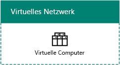
  
Abbildung 1 zeigt eine Reihe von virtuellen Computern in einem reinen Cloud-VNet.
  
Ein standortübergreifendes VNet verfügt über ein Azure-Gateway über eine S2S-VPN-Verbindung (Standort-zu-Standort) oder eine ExpressRoute-Verbindung zu einem lokalen Netzwerk. Hier ein Beispiel:
  
**Abbildung 2: Eine standortübergreifende VNet**

  
Abbildung 2 zeigt eine Reihe von virtuellen Computern in einem standortübergreifenden VNet, das mit einem lokalen Netzwerk verbunden ist.
  
Finden Sie die zusätzlichen [Schritte für eine standortübergreifende VNet Planung](designing-networking-for-microsoft-azure-iaas.md#cross_prem) Abschnitt in diesem Artikel.
  
### Schritt 4: Ermitteln Sie den VNet-Adressraum.

In Tabelle 1 sind die Adressräume für die verschiedenen VNet-Typen aufgeführt.
  
|**Typ des VNet**|**Virtuelles Netzwerk-Adressraum**|
|:-----|:-----|
|Reine Cloudbereitstellung    |Beliebiger privater Adressraum    |
|Miteinander verbunden, reine Cloudbereitstellung    |Beliebige Private, aber nicht mit anderen überlappende verbunden VNets    |
|Standortübergreifend    |Privater Adressraum, der jedoch nicht mit lokalen VNets überlappt    |
|Miteinander verbunden, standortübergreifend    |Privater Adressraum, der jedoch nicht mit lokalen und anderen verbundenen VNets überlappt    |
   
 **Tabelle 1: Arten von VNets und ihre entsprechenden Adressraum**
  
Virtuellen Computern wird vom Adressraum des Subnetzes durch DHCP ein Adresskonfiguriation zugewiesen:
  
- Adresse/Subnetzmaske
    
- Standardgateway
    
- IP-Adressen des DNS-Servers
    
Sie können auch eine statische IP-Adresse reservieren.
  
Virtuellen Computern kann auch eine öffentliche IP-Adresse zugewiesen werden, entweder einzeln oder über den enthaltenden Clouddienst (nur für herkömmliche Bereitstellungscomputer).
  
### Schritt 5: Bestimmen Sie die Subnetze im VNet und die ihnen zugewiesenen Adressräume.

Es gibt zwei Arten von Subnetzen in einem VNet: ein Gatewaysubnetz und ein Hostingsubnetz für virtuelle Computer.
  
**Abbildung 3: Die zwei Arten von Subnetze in Azure**

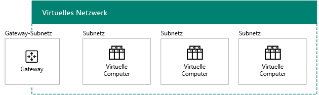
  
Abbildung 3 zeigt ein VNet mit einem Gatewaysubnetz, das ein Azure-Gateway und eine Reihe von Hostingsubnetzen mit virtuellen Computern enthält.
  
Azure benötigt das Azure-Gatewaysubnetz zum Hosten der beiden virtuellen Computer Ihres Azure-Gateways. Angeben eines Adressraums mit einer Präfixlänge von mindestens 29 Bit (Beispiel: 192.168.15.248/29). Es wird ein Präfixlänge von 28 Bit oder weniger empfohlen, insbesondere dann, wenn Sie beabsichtigen, ExpressRoute zu verwenden.
  
Nachfolgend ist eine bewährte Methode zum Ermitteln des Adressraums eines Azure-Gatewaysubnetzes aufgeführt:
  
1. Legen Sie die Größe des Gatewaysubnetzes fest.
    
2. Legen Sie für die variablen Bits im Adressraum des VNet die Bits für das Gatewaysubnetz auf 0 und für die anderen Bits auf 1 fest.
    
3. Konvertieren Sie dies in eine Dezimalzahl, und drücken Sie diese als Adressraum aus, wobei Sie als Präfixlänge die Größe des Gatewaysubnetzes festlegen.
    
Wenn Sie diese Methode verwenden, befindet sich der Adressraum für das Gatewaysubnetz immer am äußersten Ende des VNet-Adressbereichs.
  
Es folgt ein Beispiel für die Definition des Adresspräfixes für das Gatewaysubnetz: Der Adressraum des VNet ist 10.119.0.0/16. Die Organisation verwendet anfänglich eine Standort-zu-Standort-VPN-Verbindung, später jedoch ExpressRoute. In Tabelle 2 sind die Schritte sowie die Ergebnisse der Ermittlung des Adresspräfixes in der Netzwerkpräfixnotation für das Gatewaysubnetz aufgeführt (auch als CIDR bezeichnet).

Es folgen die Schritte und Beispiel für das Gateway Subnetz Adresspräfix bestimmen:

1. Legen Sie die Größe des Subnetzes Gateway. In unserem Beispiel haben wir uns /28 entschieden.
2. Legen Sie die Bits in den Variablen Teil der VNet-Adressraum (b) auf 0 für das Gateway Subnetz Bits (G), andernfalls 1 (V). In unserem Beispiel verwenden wir den 10.119.0.0/16-Adressraum für die VNet. 
 10.119. Bbbbbbbb. bbbbbbbb 10.119. VVVVVVVV. VVVVGGGG 10.119. 11111111. 11110000  
3. Das Ergebnis aus Schritt 2 zu decimal und als Adressraum express zu konvertieren. In unserem Beispiel 10.119. 11111111. 11110000 ist 10.119.255.240, und mit dem Präfixlänge aus Schritt 1, (28 in unserem Beispiel), ist das resultierende Gateway Subnetz Adresspräfix 10.119.255.240/28.
  
Weitere Informationen finden Sie unter [Adresse Speicherplatz Rechner für Azure Gateway Subnetze](https://gallery.technet.microsoft.com/scriptcenter/Address-prefix-calculator-a94b6eed) .
  
Sie platzieren virtuelle Azure-Computer in Hostingsubnetzen für virtuelle Computer, wobei Sie hier gemäß den typisch lokalen Richtlinien folgen können, wie z. B. einer allgemeinen Rolle oder Ebene einer Anwendung oder für die Subnetzisolierung.
  
Azure verwendet die ersten 3 Adressen in jedem Subnetz. Aus diesem Grund ist die Anzahl der möglichen Adressen in einem Subnetz Azure 2n -5, wobei n die Anzahl der Hostbits ist. Tabelle 3 zeigt der Bereich der virtuellen Computer erforderlich, die Anzahl der benötigten Bits gehostet wird, und die entsprechenden Subnetz-Größe.
  
|**Virtuelle Computer erforderlich**|**Hostbits**|**Subnetz-Größe**|
|:-----|:-----|:-----|
|1-3    |3    |/29    |
|4-11    |4    |/28    |
|12-27    |5    |/27    |
|28-59    |6    |/26    |
|60-123    |7    |/25    |
   
 **Tabelle 3: Anforderungen für die virtuellen Computer und ihre Größe Subnetz**
  
Weitere Informationen zu den maximalen Zeitraum der virtuellen Computer auf einem Subnetz oder VNet finden Sie unter [Networking Grenzwerte](https://docs.microsoft.com/azure/azure-subscription-service-limits#networking-limits).
  
Weitere Informationen finden Sie unter [Planen und Entwerfen Azure-virtuelle Netzwerke](https://azure.microsoft.com/documentation/articles/virtual-network-vnet-plan-design-arm/).
  
### Schritt 6: Ermitteln Sie die DNS-Serverkonfiguration und die Adressen der DNS-Server, die den VMs im VNet zugewiesen werden sollen.

Azure weist virtuellen Computern die Adressen der DNS-Server über DHCP zu. DNS-Server können:
  
- durch Azure bereitgestellt werden: Bietet lokale Namensregistrierung sowie lokale und über das Internet durchgeführte Namensauflösung
    
- von Ihnen bereitgestellt werden: Bietet lokale oder über das Internet durchgeführte Namensregistrierung und Namensauflösung entweder über das Intranet oder über das Internet
    
In Tabelle 4 sind die verschiedenen DNS-Serverkonfigurationen für jeden VNet-Typ aufgeführt.
    
|**Typ des VNet**|**DNS-server**|
|:-----|:-----|
|Reine Cloudbereitstellung    |von Azure für die lokale und über das Internet durchgeführte Namensauflösung bereitgestellt    virtueller Azure-Computer für die lokale und über das Internet durchgeführte Namensauflösung (DNS-Weiterleitung)    |
|Standortübergreifend    |lokal für die lokale und über das Intranet durchgeführte Namensauflösung    virtueller Azure-Computer für die lokale und über das Intranet durchgeführte Namensauflösung (DNS-Replikation und -Weiterleitung)    |
   
 **Tabelle 4: DNS-Server-Optionen für die zwei verschiedenen Arten von VNets**
  
Weitere Informationen finden Sie unter [Name Resolution für virtuelle Computer und Instanzen](https://docs.microsoft.com/azure/virtual-network/virtual-networks-name-resolution-for-vms-and-role-instances).
  
### Schritt 7: Ermitteln Sie die Lastenausgleichskonfiguration (Internet-bezogen oder intern).

In einigen Fällen möchten Sie eingehenden Datenverkehr auf eine Gruppe von Servern verteilen, die über die gleiche Rolle verfügen. Azure IaaS verfügt über eine integrierte Funktion, mit der dies für dem Internet zugewandten und internen Datenverkehr vorgenommen werden kann.
  
Der dem Internet zugewandte Lastenausgleich von Azure verteilt den unangefordert aus dem Internet kommenden Datenverkehr zufällig auf die Mitglieder einer Lastenausgleichsgruppe. 
  
**Abbildung 4: Eine externe System zum Lastenausgleich in Azure**

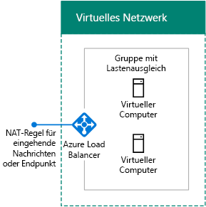
  
Abbildung 4 zeigt einen externes System zum Lastenausgleich in Azure, die eingehenden Datenverkehr auf eine eingehende NAT-Regel oder einen Endpunkt einen Satz von virtuellen Computern in einem Satz mit Lastenausgleich verteilt.
  
Der Azure-interne Lastenausgleich verteilt unangeforderten eingehenden Datenverkehr von andere Azure-VMs oder Intranetcomputern an die Mitglieder einer Lastenausgleichsgruppe.  
  
**Abbildung 5: Eine interne System zum Lastenausgleich in Azure**

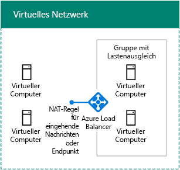
  
Abbildung 5 zeigt eine interne System zum Lastenausgleich in Azure, die eingehenden Datenverkehr auf eine eingehende NAT-Regel oder einen Endpunkt einen Satz von virtuellen Computern in einem Satz mit Lastenausgleich verteilt.
  
Weitere Informationen finden Sie unter [Azure System zum Lastenausgleich](https://docs.microsoft.com/azure/load-balancer/load-balancer-overview).
  
### Schritt 8: Ermitteln Sie die Verwendung von virtuellen Geräten und benutzerdefinierten Routen.

Wenn Sie Datenverkehrs an virtuelle Geräte im VNet weiterleiten müssen, müssen Sie einem Subnetz möglicherweise eine oder mehrere benutzerdefinierte Routen hinzufügen.
  
**Abbildung 6: Virtuelle Appliances und benutzerdefinierte Routen in Azure**

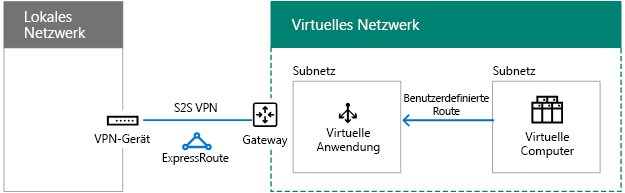
  
Abbildung 6 zeigt ein standortübergreifendes VNet und eine benutzerdefinierte Route, die einem Hostingsubnetz für virtuelle Computer zugewiesen ist, das auf ein virtuelles Gerät verweist.
  
Weitere Informationen finden Sie unter [benutzerdefinierte Routen und IP-Weiterleitung](https://docs.microsoft.com/azure/virtual-network/virtual-networks-udr-overview).
  
### Schritt 9 Ermitteln Sie, wie Computer aus dem Internet Verbindungen mit virtuellen Computern herstellen.

Es gibt mehrere Möglichkeiten, den virtuellen Computern in einem VNet Zugang zum Internet bereitzustellen. Dazu zählt der Zugriff vom Netzwerk Ihrer Organisation über einen Proxyserver oder ein anderes Edgegerät.
  
In Tabelle 5 sind die Methoden zum Filtern oder Prüfen von unangefordert eingehendem Datenverkehr aufgeführt.
  
|**Methode**|**Bereitstellungsmodell**|
|:-----|:-----|
|1. Endpunkte und ACLs, für Clouddienste konfiguriert    |Klassisch    |
|2. Netzwerksicherheitsgruppen    |Ressourcenmanager und klassisch    |
|3. Dem Internet zugewandter Lastenausgleich mit NAT-Eingangsregeln    |Ressourcenmanager    |
|4. Sicherheit Netzwerkgeräte in der Azure 
 Marketplace (nicht dargestellt)    |Ressourcenmanager und klassisch    |
   
 **Tabelle 5: Herstellen einer Verbindung mit virtuellen Computern und ihre entsprechenden Azure Bereitstellungsmodelle Methoden**
  
**Abbildung 7: Herstellen einer Verbindung mit virtuellen Azure-Computern über das Internet**

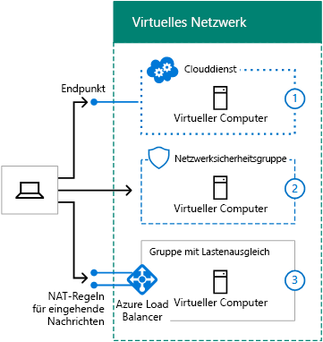
  
Abbildung 7 zeigt einen mit dem Internet verbundenen Computer, der mit einem virtuellen Computer in einem Clouddienst anhand eines Endpunkts verbunden ist, einen virtuellen Computer in einem Subnetz mit einer Netzwerksicherheitsgruppe und einen virtuellen Computer in einem Subnetz mit einem externen Lastenausgleich und NAT-Eingangsregeln.
  
Zusätzlicher Sicherheit bereitgestellt durch:
  
- Remotedesktop- und SSH-Verbindungen, die verschlüsselt und authentifiziert werden
    
- Remote PowerShell-Sitzungen, die verschlüsselt und authentifiziert werden
    
- IPsec-Transportmodus, den Sie für die End-to-End-Verschlüsselung verwenden können
    
- Azure DDOS-Schutz, der vor externe und interne Angriffen schützt
    
Weitere Informationen finden Sie unter [Microsoft Cloud Sicherheitsupdates für Enterprise-konstruiert](https://aka.ms/cloudarchsecurity) und [Azure Netzwerk](https://azure.microsoft.com/blog/azure-network-security/).
  
### Schritt 10 Bestimmen Sie für mehrere VNets die Verbinungstopologie von VNet zu VNet.

VNets können mit ähnlichen Topologien verbunden werden, die auch zum Verbinden von Standorten einer Organisation verwendet werden.
  
Durch eine Verkettungskonfiguration (Daisychain) werden die VNets in einer Reihe verbunden.
  
**Abbildung 8: Eine Reihe geschalteten Konfiguration für VNets**

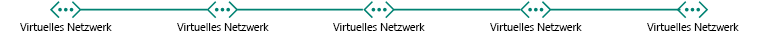
  
Abbildung 8 zeigt fünf VNets in Datenreihe mit einer Konfiguration verkettete verbunden.
  
Bei einer Hub-Spoke-Konfiguration werden mehrere VNets mit eine Reihe von zentralen VNets verbunden, die ihrerseits miteinander verbunden sind.
  
**Abbildung 9: Eine sternförmigen Konfiguration für VNets**

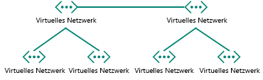
  
Abbildung 9 zeigt sechs VNets, wobei zwei VNets „Hubs“ sind, die miteinander sowie mit anderen „Spoke“-VNets verbunden sind.
  
Bei einer Full-Mesh-Konfiguration ist jedes VNet mit jedem anderen verbunden.
  
**Abbildung 10: Eine vollständige mesh-Konfiguration für VNets**

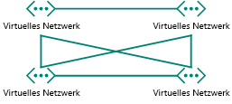
  
Abbildung 10 zeigt vier VNets, die alle miteinander verbunden sind, wobei insgesamt sechs VNet-zu-VNet-Verbindungen vorhanden sind.
  
## Planungsschritte für ein standortübergreifendes VNet

Führen Sie die folgende Schritte durch, um ein stadortübergreifendes VNet zu erstellen.
  
> [!TIP]
> Zum Erstellen einer simulierten standortübergreifenden Test-/Umgebung finden Sie unter [simulierten standortübergreifenden virtuelles Netzwerk in Azure](simulated-cross-premises-virtual-network-in-azure.md). 
  
### Schritt 1: Ermitteln Sie die standortübergreifende Verbindung zum VNet (S2S-VPN oder ExpressRoute).

In Tabelle 6 sind die verschiedenen Verbindungstypen aufgeführt.
  
|**Verbindungstyp**|**Zweck**|
|:-----|:-----|
|Standort-zu-Standort-VPN (S2S)    |Verbinden Sie 1-10-Websites (einschließlich andere VNets) mit einer einzelnen VNet.    |
|ExpressRoute    |Eine private, sichere Verbindung mit Azure über einen Internet-Exchange-Anbieter (IXP) oder ein Netzwerkdienstanbieter (NSP).    |
|Punkt-zu-Standort-VPN (P2S)    |Verbindet einen einzelnen Computer mit einem VNet    |
|VNet-Peering oder VNet-zu-VNet-VPN (V2V)     |Verbindet ein VNet mit einem anderen VNet    |
   
 **Tabelle 6: Die Typen der Verbindungen für standortübergreifende VNets**
  
Weitere Informationen über die maximale Anzahl der Verbindungen finden Sie unter [Networking Grenzwerte](https://docs.microsoft.com/azure/azure-subscription-service-limits#networking-limits).
  
Weitere Informationen zu VPN-Geräten finden Sie unter [VPN-Geräten für Verbindungen zwischen Standorten virtuelles Netzwerk](https://docs.microsoft.com/azure/vpn-gateway/vpn-gateway-about-vpn-devices).
  
Weitere Informationen zu VNet peering finden Sie unter [VNet peering](https://docs.microsoft.com/azure/virtual-network/virtual-network-peering-overview).
  
**Abbildung 11: Die vier Methoden zum Herstellen einer Verbindung einer standortübergreifenden VNet**

  
Abbildung 11 zeigt eine VNet mit vier Arten von Verbindungen: Verbindung mit einem P2S von einem Computer, eine S2S VPN-Verbindung von einem lokalen Netzwerk, einer ExpressRoute Verbindung über einen lokalen Netzwerk und Verbindung mit einem VNet-VNet-von einer anderen VNet. 
  
Sie können eine Verbindung mit VMs in einem VNet wie folgt herstellen:
  
- Verwaltung von VNet-VMs über das lokale Netzwerk oder das Internet
    
- IT-Workloadzugriff vom lokalen Netzwerk
    
- Erweiterung des Netzwerks durch zusätzliche VNets
    
Die Sicherheit der Verbindungen wird durch Folgendes sichergestellt:
  
- P2S verwendet SSTP (Secure Socket Tunnel Protocol).  
    
- S2S und VNet-zu-VNet-VPN-Verbindungen verwenden den IPsec-Tunnelmodus mit AES256.
    
- ExpressRoute ist eine private WAN-Verbindung.
    
Weitere Informationen finden Sie unter [Microsoft Cloud Sicherheitsupdates für Enterprise-konstruiert](https://aka.ms/cloudarchsecurity) und [Azure Netzwerk](https://azure.microsoft.com/blog/azure-network-security/).
  
### Schritt 2: Ermitteln Sie das lokale VPN-Gerät oder den Router.

Ihr lokales VPN-Gerät oder der Router fungiert als:
  
- ein IPSec-Peer, der die S2S-VPN-Verbindung von einem Azure-Gateway trennt.
    
- der BPG-Peer und Abschlusspunkt für die private ExpressRoute-Peeringverbindung.
    
**Abbildung 12: Das lokale VPN-Router oder ein Gerät**

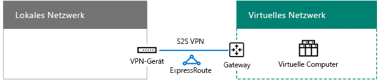
  
Abbildung 12 zeigt eine standortübergreifendes VNet, das mit einem lokalen VPN-Router oder einem Gerät verbunden ist.
  
Weitere Informationen finden Sie unter [Informationen zu VPN-Gateway](https://docs.microsoft.com/azure/vpn-gateway/vpn-gateway-about-vpngateways).
  
### Schritt 3: Fügen Sie Routen zu Ihrem Intranet zu den Adressraum der VNet erreichbar sind hinzu.

Die Weiterleitung an VNets von lokal umfasst Folgendes:
  
1. Eine Route für den VNet-Adressraum, die auf Ihr VPN-Gerät verweist.
    
2. Eine Route für den VNet-Adressraum auf Ihrem VPN-Gerät, die über die S2S-VPN- oder ExpressRoute-Verbindung hinweg verweist.
    
**Abbildung 13: Die lokalen Routen erforderlich, um eine VNet erreichbar sind.**

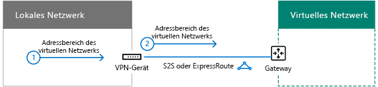
  
Abbildung 13 zeigt die Routinginformationen, die von den lokalen Routern benötigt werden, sowie den VPN-Router oder das Gerät, das den Adressraum das VNets darstellt.
  
### Schritt 4: Planen Sie bei Verwendung von ExpressRoute die neue Verbindung mit Ihrem Anbieter.

Sie haben drei verschiedene Möglichkeiten, um eine ExpressRoute-Verbindung mit privatem Peering zwischen Ihrem lokalen Netzwerk und der Microsoft-Cloud herzustellen:
  
- Co-Location bei einem Cloud Exchange
    
- Punkt-zu-Punkt-Ethernet-Verbindungen
    
- Viele-zu-viele-Netzwerke (IP-VPN)
    
**Abbildung 14: ExpressRoute Verbindung mit einer standortübergreifenden VNet verwenden**

  
Abbildung 14 zeigt ein standortübergreifendes VNet und eine ExpressRoute-Verbindung von einem lokalen Router zu Microsoft Azure.
  
Weitere Informationen finden Sie unter [ExpressRoute für Microsoft-Cloudkonnektivität](expressroute-for-microsoft-cloud-connectivity.md).
  
### Schritt 5: Bestimmen Sie den lokalen Netzwerkadressraum für das Azure-Gateway.

Beim Routing zu lokalen oder anderen VNets von einem VNet leitet Azure den Datenverkehr über einen Azure-Gateway, der mit dem lokalen Netzwerkadressraum übereinstimmt, der dem Gateway zugeordnet ist.
  
**Abbildung 15: Den lokalen Netzwerk-Adressraum für eine standortübergreifende VNet**

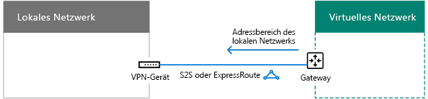
  
Abbildung 15 zeigt eine standortübergreifendes VNet und den Adressraum des lokalen Netzwerks auf dem Azure-Gateway, der den erreichbaren Adressraum im lokalen Netzwerk darstellt.  
  
Sie können den Adressraum des lokalen Netzwerks wie folgt definieren:
  
- Option 1: Die Liste der Präfixe für den gerade benötigten oder verwendeten Adressraum (Aktualisierungen können erforderlich sein, wenn Sie neue Subnetzen hinzufügen).
    
- Option 2: Der gesamte lokale Adressraum (Aktualisierungen sind nur nötig, wenn Sie einen neuen Adressraum hinzufügen).
    
Da das Azure-Gateway keine zusammengefassten Routen zulässt, müssen Sie den Adressraum des lokalen Netzwerk bei der Option 2 so definieren, dass er nicht den VNet-Adressraum enthält.
  
**Abbildung 16: Die Adresse Speicherplatz Hole durch den VNet-Adressraum erstellt**

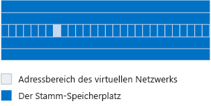
  
Abbildung 16 zeigt eine Darstellung eines Adressraums mit dem Stammraum und dem VNet-Adressraum.
  
Es folgt ein Beispiel der Präfixe für den lokalen Netzwerk-Adressraum, um den Adressraum "Hole" erstellt, durch die VNet definieren:
  
- Eine Organisation verwendet Teile des privaten Adressraums (10.0.0.0/8, 172.16.0.0/12 und 192.168.0.0/16) in ihrem lokalen Netzwerk. Die Organisation verwendet Option 2 und 10.100.100.0/24 als ihren VNet-Adressraum.
    
In Tabelle 7 sind die Schritte und die resultierenden Präfixe aufgeführt, die den Adressraum des lokalen Netzwerks in diesem Beispiel definieren.
  
|**Schritt**|**Ergebnisse**|
|:-----|:-----|
|1. Auflisten der Präfixe, die nicht der Stammraum für den VNet-Adressraum sind.    |172.16.0.0/12 und 192.168.0.0/16    |
|2. die übereinander Präfixe für Variablen Bytes bis zu aufgelistet, aber nicht einschließlich des letzten verwendet 
 Oktett im VNet-Adressraum.    |10.0.0.0/16, 10.1.0.0/16... 10.99.0.0/16, 10.101.0.0/16... 10.254.0.0/16 10.255.0.0/16 (255 Präfixe 10.100.0.0/16 überspringen)    |
|3. Liste der übereinander innerhalb Präfixen der 
 zuletzt verwendete Oktett des Adressraums VNet.    | 10.100.0.0/24, 10.100.1.0/24... 10.100.99.0/24, 10.100.101.0/24... 10.100.254.0/24 10.100.0.255.0/24 (255 Präfixe 10.100.100.0/24 überspringen)    |
   
 **Tabelle 7: Beispiel lokalen Netzwerk Adressraum**
  
### Schritt 6: Konfigurieren Sie lokale DNS-Server für die DNS-Replikation mit DNS-Servern, die in Azure gehostet werden.

Um sicherzustellen, dass lokale Computer die Namen von Servern in Azure und die Server in Azure die Namen von lokalen Computern auflösen können, müssen Sie Folgendes konfigurieren:
  
- Die DNS-Server in Ihrem VNet leiten an lokale DNS-Server weiter
    
- DNS-Replikation der entsprechenden Zonen zwischen lokalen DNS-Servern und im VNet
    
**Abbildung 17: DNS-Replikation und Weiterleitung für einen DNS-Server in einer standortübergreifenden VNet**

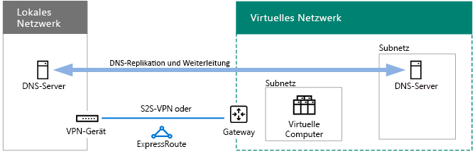
  
Abbildung 17 zeigt ein standortübergreifendes VNet mit DNS-Server im lokalen Netzwerk und in einem Subnetz im. DNS-Replikation und -Weiterleitung wurde zwischen den beiden DNS-Servern konfiguriert.
  
### Schritt 7: Ermitteln Sie die Nutzung von erzwungenem Tunneln.

Die Standardroute System für Azure Subnetze verweist auf das Internet. Um sicherzustellen, dass der gesamte Datenverkehr von virtuellen Computern in der standortübergreifenden Verbindung übermittelt wird, erstellen Sie eine routing-Tabelle mit der Standardroute, die als die Adresse des nächsten Hop das Azure-Gateway verwendet wird. Ordnen Sie dann die Routentabelle das Subnetz. Dies wird als tunneling gezwungen bezeichnet. Weitere Informationen finden Sie unter [Configure gezwungen tunneling](https://docs.microsoft.com/azure/vpn-gateway/vpn-gateway-forced-tunneling-rm).
  
**Abbildung 18: User-defined Routen und erzwungener Tunnel für eine standortübergreifende VNet**

  
Abbildung 18 zeigt eine standortübergreifende VNet mit einer benutzerdefinierten Route für ein Subnetz, dem Azure-Gateway verweisen.
  
## SharePoint Server 2016-Farm in Azure

Ein Beispiel für eine in Azure IaaS gehostete intranetbasierte IT-Workload ist eine hoch verfügbare SharePoint Server 2016-Farm mit mehreren Stufen, wie sie in Abbildung 19 dargestellt ist.
  
**Abbildung 19: Eine hochverfügbar 2016 für SharePoint Server-intranetfarm in Azure IaaS**

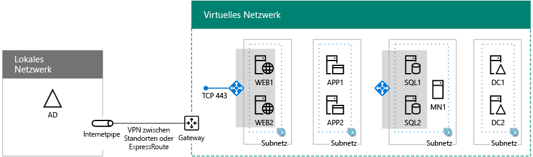
  
Abbildung 19 zeigt die neun Server einer 2016 für SharePoint Server-Farm bereitgestellt, die in einer standortübergreifenden VNet, die die internen Systeme zum Lastenausgleich für die Front-End- und Daten Ebenen verwendet. Weitere Informationen, einschließlich schrittweise Entwurf und Bereitstellung-Anweisungen finden Sie unter [SharePoint Server 2016 in Microsoft Azure](https://technet.microsoft.com/library/mt779107%28v=office.16%29.aspx).
  
> [!TIP]
> Zum Erstellen einer 2016 für SharePoint Server-Farm in einer standortübergreifenden simulierten VNet finden Sie unter [Intranet SharePoint Server 2016 in Azure Test-/-Umgebung](https://technet.microsoft.com/library/mt806351%28v=office.16%29.aspx). 
  
Weitere Beispiele für IT-Arbeitslasten auf virtuellen Computern in einer standortübergreifenden Azure virtual bereitgestellten Netzwerk, finden Sie unter [Hybrid-Cloud-Szenarien für Azure IaaS](https://technet.microsoft.com/library/mt750502.aspx).
  
## See Also

[Microsoft-Cloudnetzwerke für Enterprise-Architekten](microsoft-cloud-networking-for-enterprise-architects.md)
  
[Ressourcen zur Cloud-IT-Architektur von Microsoft](microsoft-cloud-it-architecture-resources.md)

[Enterprise-Cloud-Roadmap von Microsoft: Ressourcen für IT-Entscheidungsträger](https://sway.com/FJ2xsyWtkJc2taRD)

