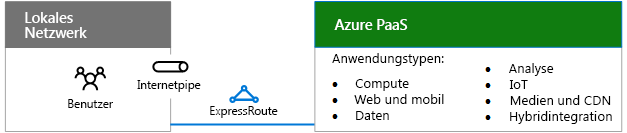
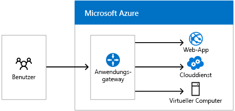
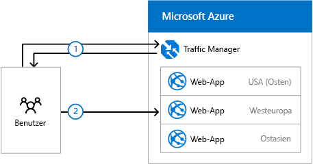

# Entwerfen von Netzwerken für Microsoft-PaaS

 **Zusammenfassung:** Grundlegende Informationen darüber, wie Sie Ihr Netzwerk für Zugriff auf Microsoft Azure PaaS optimieren.
  
Für die Optimierung Ihrer Netzwerke für Azure PaaS-Apps ist eine ausreichende Internetbandbreite und möglicherweise die Verteilung des Netzwerkdatenverkehrs auf mehrere Websites oder Apps erforderlich.
  
## Planen von Schritten zum Hosten der PaaS-Anwendungen der Organisation in Azure

Abschnittstext hier einfügen.
  
1. Durchlaufen Sie die **Schritte zum Vorbereiten Ihres Netzwerks für Microsoft Cloud Services** in[Gemeinsame Elemente der Microsoft-Cloudkonnektivität](common-elements-of-microsoft-cloud-connectivity.md).
    
2. Optimieren Sie die Internetbandbreite mithilfe der Schritte 2 bis 4 der **Schritte zum Vorbereiten Ihres Netzwerks für Microsoft SaaS-Dienste** in[Entwerfen von Netzwerken für Microsoft-SaaS](designing-networking-for-microsoft-saas.md).
    
3. Ermitteln Sie, ob Sie eine ExpressRoute-Verbindung mit Azure benötigen.
    
4. Für webbasierte Arbeitslasten müssen Sie ermitteln, ob Sie das Azure-Anwendungsgateway benötigen.
    
5. Um den Datenverkehr an unterschiedliche Endpunkte in unterschiedlichen Rechenzentren zu verteilen, ermitteln Sie, ob Sie Azure Traffic Manager benötigen.
    
## Internetbandbreite für PaaS-Anwendungen in der Organisation

Für Organisationsanwendungen, die in Azure PaaS gehostet sind, ist eine Internetbandbreite für Intranetbenutzer erforderlich. Es gibt zwei Möglichkeiten:
  
- **Option 1:** Verwenden Sie Ihrer vorhandene Pipe, die für Internetverkehr optimiert ist und über die entsprechende Kapazität für Spitzenlasten verfügt. Weitere Informationen zu Überlegungen im Zusammenhang mit Internet-Edge, Clientnutzung und IT-Abläufen finden Sie unter[Entwerfen von Netzwerken für Microsoft-SaaS](designing-networking-for-microsoft-saas.md).
    
- **Option 2:** Verwenden Sie hohe Bandbreite oder eine niedrige Wartezeit eine ExpressRoute-Verbindung mit Azure.
    
**Abbildung 1: Verbindungsoptionen zum Verbinden der Azure PaaS-Dienste**

  
In Abbildung 1 ist ein lokales Netzwerk dargestellt, das über eine Internetpipe oder ExpressRoute eine Verbindung zu Azure PaaS-Diensten herstellt.
  
## Azure-Anwendungsgateway

Dienste für Routing auf Anwendungsebene und Lastenausgleich, mit denen Sie ein skalierbares und hoch verfügbares Web-Front-End in Azure für Web-Apps, Clouddienste und virtuelle Computer erstellen können. 
  
**Abbildung 2: Azure-Anwendungsgateway**

  
In Abbildung 2 ist das Azure-Anwendungsgateway dargestellt und wie Benutzeranforderungen aus dem Internet an Azure-Web-Apps, Clouddienste oder virtuelle Computer umgeleitet werden können.
  
Das Anwendungsgateway unterstützt derzeit Ebene 7 Anwendungsübermittlung für Folgendes:
  
- HTTP-Lastenausgleich
    
- Cookiebasierte Sitzungsaffinität
    
- SSL-Verschiebungen
    
Weitere Informationen finden Sie unter [Anwendungsgateway](https://docs.microsoft.com/azure/application-gateway/application-gateway-introduction).
  
## Azure Traffic Manager

Die Verteilung des Datenverkehrs an verschiedene Endpunkte, darunter Clouddienste oder Azure-Web-Apps, die sich in unterschiedlichen Rechenzentren oder an externen Endpunkten befinden.
  
Der Traffic Manager verwendet die folgenden Routingmethoden:
  
- **Failover:** Die Endpunkte befinden sich im gleichen oder in unterschiedlichen Azure-Rechenzentren, und Sie möchten einen primären Endpunkt für den gesamten Datenverkehr verwenden, stellen jedoch Sicherungen bereit, für den Fall, dass der primäre oder der Sicherungsendpunkt nicht verfügbar ist.
    
- **Roundrobin:** Sie möchten die Last über eine Reihe von Endpunkten im selben Rechenzentrum oder über unterschiedliche Rechenzentren hinweg verteilen.
    
- **Leistung:** Sie haben die Endpunkte an unterschiedlichen geografischen Standorten, und Sie möchten, dass anfordernde Clients den „nächsten" Endpunkt im Hinblick auf niedrigste Wartezeit verwenden.
    
Nachfolgend finden Sie ein Beispiel für drei geografisch verteilte Web-Apps.
  
**Abbildung 3: Azure Traffic Manager**

  
In Abbildung 3 ist der grundlegende Prozess dargestellt, den Traffic Manager zum Umleiten von Anforderungen an drei unterschiedliche Azure-Web-Apps in den USA, in Europa und in Asien verwendet. Im Beispiel:
  
1. Eine Benutzer-DNS-Abfrage für eine Website-URL wird an Azure Traffic Manager geleitet, der den Namen einer regionalen Web-Apps basierend auf der Leistungsroutingmethode zurückgibt.
    
2. Der Benutzer initiiert den Datenverkehr mit der regionalen Web-App in Europa.
    
Weitere Informationen finden Sie unter [Traffic Manager](https://docs.microsoft.com/azure/traffic-manager/traffic-manager-overview)
  
## See Also

#### 

[Microsoft-Cloudnetzwerke für Enterprise-Architekten](microsoft-cloud-networking-for-enterprise-architects.md)
  
[Ressourcen zur Cloud-IT-Architektur von Microsoft](microsoft-cloud-it-architecture-resources.md)
#### 

[Enterprise-Cloud-Roadmap von Microsoft: Ressourcen für IT-Entscheidungsträger](https://sway.com/FJ2xsyWtkJc2taRD)

