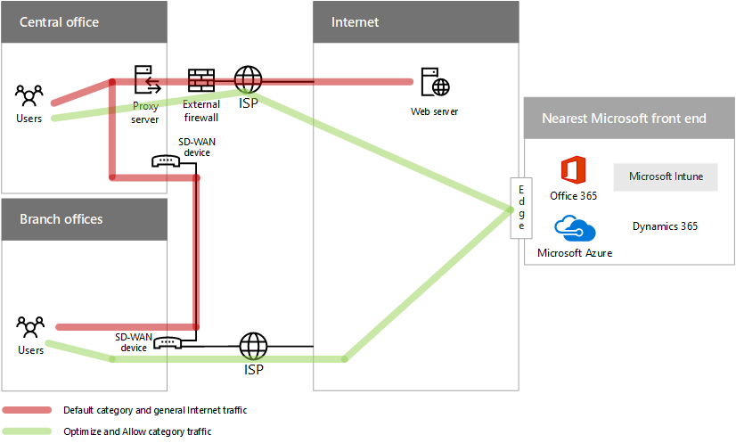

# Entwerfen von Netzwerken für Microsoft-SaaSDesigning networking for Microsoft SaaS

 **Zusammenfassung:** Grundlegende Informationen darüber, wie Sie Ihr Netzwerk für Zugriff auf Microsoft SaaS-Dienste, einschließlich Office 365, Microsoft Intune und Dynamics 365, optimieren.**Summary:** Understand how to optimize your network for access to Microsoft's SaaS services, including Office 365, Microsoft Intune, and Dynamics 365.
  
Optimieren Ihr Netzwerk für Microsoft SaaS Services erfordert die Konfiguration der internen und Edge-Geräte die verschiedenen Arten von Datenverkehr an Microsoft SaaS Services weitergeleitet.Optimizing your network for Microsoft SaaS services requires the configuration of internal and edge devices to route the different categories of traffic to Microsoft SaaS services.
  
## Schritte zum Vorbereiten Ihres Netzwerks für Microsoft SaaS-DiensteSteps to prepare your network for Microsoft SaaS services

Befolgen Sie diese Schritte, um Ihr Netzwerk für Microsoft SaaS-Dienste zu optimieren:Follow these steps to optimize your network for Microsoft SaaS services:
  
1. Durchlaufen Sie die **Schritte zum Vorbereiten Ihres Netzwerks für Microsoft Cloud Services** in [Gemeinsame Elemente der Microsoft-Cloudkonnektivität](common-elements-of-microsoft-cloud-connectivity.md).Go through the **Steps to prepare your network for Microsoft cloud services** section in [Common elements of Microsoft cloud connectivity](common-elements-of-microsoft-cloud-connectivity.md).
    
2. Fügen Sie eine Internet-Verbindung an alle Ihre Büros.Add an Internet connection to each of your offices.
    
3. Stellen Sie sicher, dass der Internetdienstanbieter für alle Internet-Verbindungen mit einem lokalen IP-Adresse einen DNS-Server verwenden.Ensure that the ISPs for all Internet connections use a DNS server with a local IP address.
    
4. Untersuchen Sie Ihr Netzwerk Hairpins, temporären Zieladressen wie cloudbasierten Sicherheitsdienste und beseitigen Sie, sofern möglich.Examine your network hairpins, intermediate destinations such as cloud-based security services, and eliminate them if possible.
    
5. Konfigurieren der Edge-Geräten umgehen Verarbeitung für das Optimieren und Kategorien von Microsoft SaaS Datenverkehr zulassen.Configure your edge devices to bypass processing for the Optimize and Allow categories of Microsoft SaaS traffic.

## Optimieren der Datenverkehr zu Microsofts SaaS-DienstenOptimizing traffic to Microsoft’s SaaS services    

Es gibt drei Kategorien von Microsoft SaaS Datenverkehr:There are three categories of Microsoft SaaS traffic:

- OptimierenOptimize

  Für die Verbindung mit jedem Microsoft SaaS Service und darstellen über 75 % der Microsoft SaaS Bandbreite, Verbindungen und Menge der Daten erforderlich.Required for connectivity to every Microsoft SaaS service and represent over 75% of Microsoft SaaS bandwidth, connections, and volume of data.

- ZulassenAllow

  Erforderlich für Verbindung mit bestimmten Microsoft SaaS Dienste und features sind jedoch nicht als vertraulich Leistung des Netzwerks und Wartezeit, die in der Kategorie optimieren.Required for connectivity to specific Microsoft SaaS services and features but are not as sensitive to network performance and latency as those in the Optimize category.

- StandardDefault

  Darstellen Sie SaaS Microsoft Services und Abhängigkeiten, die kein Optimierung erfordern. Sie können die Standardeinstellung Kategorie Datenverkehr wie normale Datenverkehr im Internet behandeln.Represent Microsoft SaaS services and dependencies that do not require any optimization. You can treat Default category traffic like normal Internet traffic.

**Abbildung 1: Empfohlene Konfiguration für Microsoft SaaS-Datenverkehr für alle Büros****Figure 1: Recommended configuration for Microsoft SaaS traffic for all offices**

Abbildung 1 zeigt die empfohlene Konfiguration von allen Büros, einschließlich Zweigstellen und regionalen oder zentralen Unterhaltungen in die:Figure 1 shows the recommended configuration of all offices, including branch offices and regional or central ones, in which:

- **Standard** -Kategorie sowie allgemeine Internet-Datenverkehr an Büros, die Proxy-Server und andere Geräte Edge zum Schutz vor Sicherheitsrisiken internetbasierten weitergeleitet wird.**Default** category and general Internet traffic is routed to offices that have proxy servers and other edge devices to provide protection against Internet-based security risks.
- **Optimieren** und **Zulassen** Kategorie Datenverkehr wird direkt an den Rand des Microsoft Network Front-End Rechtsklicks am nächsten ist, die die enthält verbinden, Proxy-Server und andere Geräte Edge umgehen Büro weitergeleitet.**Optimize** and **Allow** category traffic is forwarded directly to the edge of the Microsoft network front end nearest to the office containing the connecting user, bypassing proxy servers and other edge devices.

WAN-Software definiert (SD-WAN) Netzwerkgeräte in Zweigstellen Datenverkehr zu trennen, damit:Software-defined wide area network (SD-WAN) devices in branch offices separate traffic so that: 

- **Standard** -Kategorie sowie allgemeine Internet-Datenverkehr wird zu einem zentralen / regionalen Office über das WAN-Backbone.**Default** category and general Internet traffic goes to a central or regional office over the WAN backbone. 
- **Optimieren** und **Zulassen** Kategorie-Datenverkehr wird an den Internetdienstanbieter, die Internet-Verbindung bereitstellen.**Optimize** and **Allow** category traffic goes to the ISP providing the local Internet connection.
  
Weitere Informationen finden Sie unter:For more information, see:
  
- [Netzwerk-Konnektivität PrinzipienNetwork connectivity principles](https://aka.ms/expressrouteoffice365)

- [Netzwerk- und Migrationsplanung für Office 365Network and migration planning for Office 365](https://aka.ms/tune)
    
## Nächster SchrittNext step

[Entwerfen von Netzwerken für Microsoft-PaaSDesigning networking for Microsoft Azure PaaS](designing-networking-for-microsoft-azure-paas.md)
    
## Siehe auchSee also

[Microsoft-Cloudnetzwerke für Enterprise-ArchitektenMicrosoft Cloud Networking for Enterprise Architects](microsoft-cloud-networking-for-enterprise-architects.md)
  
[Ressourcen zur Cloud-IT-Architektur von MicrosoftMicrosoft Cloud IT architecture resources](microsoft-cloud-it-architecture-resources.md)

