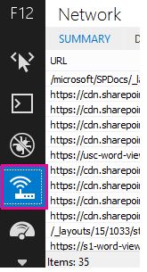

# Diagnose von Leistungsproblemen mit SharePoint Online

In diesem Artikel erfahren Sie, wie Sie häufige Probleme mit Ihrer SharePoint Online-Website mithilfe von Internet Explorer-Entwicklertools diagnostizieren können.
  
Es gibt drei verschiedene Möglichkeiten, um festzustellen, ob eine Seite auf einer SharePoint Online-Website ein Leistungsproblem mit den Anpassungen aufweist.
  
- Der F12-Tool Balken-Netzwerkmonitor
    
- Vergleich mit einer nicht angepassten Baseline
    
- Metriken für SharePoint Online-Antwortheader
    
In diesem Thema wird beschrieben, wie Sie die einzelnen Methoden zur Diagnose von Leistungsproblemen verwenden. Nachdem Sie die Ursache des Problems herausgefunden haben, können Sie mit den Artikeln zur Verbesserung der Leistung von SharePoint, die Sie finden können, auf http://aka.ms/tuneeine Lösung hinarbeiten.
  
## Verwenden der F12-Symbolleiste zum Diagnostizieren der Leistung in SharePoint Online

In diesem Artikel wird Internet Explorer 11 verwendet. Versionen der F12-Entwicklertools in anderen Browsern weisen ähnliche Features auf, obwohl Sie möglicherweise etwas anders aussehen. Weitere Informationen zu den F12-Entwicklertools finden Sie unter:
  
- [Neuigkeiten in den F12-Tools](https://go.microsoft.com/fwlink/p/?LinkId=522545)
    
- [Verwenden der F12-Entwicklertools](https://go.microsoft.com/fwlink/p/?LinkId=522546)
    
Drücken Sie **F12** , um die Entwicklertools aufzurufen, und klicken Sie dann auf das WLAN-Symbol: 
  

  
Drücken Sie auf der Registerkarte **Netzwerk** die grüne Wiedergabeschaltfläche, um eine Seite zu laden. Das Tool gibt alle Dateien zurück, die der Browser anfordert, um die von Ihnen gewünschte Seite zu erhalten. Der folgende Screenshot zeigt eine solche Liste. 
  

  
Sie können auch die Downloadzeiten der Dateien auf der rechten Seite sehen, wie in diesem Screenshot gezeigt.
  

  
Dadurch erhalten Sie eine visuelle Darstellung, wie lange die Datei geladen wurde. Die grüne Liniendarstellung zeigt an, wann die Seite vom Browser gerendert werden kann. Auf diese Weise können Sie schnell die verschiedenen Dateien anzeigen, die zu langsamen Seitenlasten auf Ihrer Website führen.
  
## Einrichten einer nicht angepassten Baseline für SharePoint Online

Die beste Möglichkeit, die Leistung Ihrer Website zu schwächen, besteht darin, eine vollständig out-of-the-Box-Websitesammlung in SharePoint Online einzurichten. Auf diese Weise können Sie alle verschiedenen Aspekte Ihrer Website mit dem vergleichen, was Sie ohne Anpassung auf der Seite erhalten würden. Die OneDrive for Business-Startseite ist ein gutes Beispiel für eine separate Websitesammlung, die keine Anpassungen aufweisen kann.
  
## Anzeigen von SharePoint-Antwortheader Informationen

In SharePoint Online und SharePoint Server 2013 können Sie auf die Informationen zugreifen, die im Antwortheader für jede Datei an den Browser zurückgesendet werden. Die beiden hilfreichsten Werte für die Diagnose von Leistungsproblemen sind SPRequestDuration und X-SharePointHealthScore:
  
- **SPRequestDuration**
    
    Dies ist die Zeitdauer, die die Anforderung für die Verarbeitung des Servers übernommen hat. Dies kann helfen festzustellen, ob die Anforderung sehr schwer und ressourcenintensiv ist. Dies ist die beste Einblicke in die Menge an Arbeit, die der Server für die Bereitstellung der Seite leistet.
    
- **X-SharePointHealthScore**
    
    Dies gibt die Auslastung des Servers oder der CPU an, auf dem Ihre SharePoint-Instanz ausgeführt wird. Diese Zahl liegt zwischen 0 und 10, wobei 0 angibt, dass der Server inaktiv ist und 10 angibt, dass der Server sehr ausgelastet ist. Ein HealthScore, das konsistent 9 oder 10 ist, kann auf ein ständiges Leistungsproblem mit dem Server hindeuten. Eine beliebige andere Zahl weist darauf hin, dass der Server innerhalb des erwarteten Zeitraums betrieben wird.
    
 **So zeigen Sie SharePoint-Antwortheader Informationen an**
  
1. Stellen Sie sicher, dass die F12-Tools installiert sind. Weitere Informationen zum herunterladen und Installieren dieser Tools finden Sie unter [What es New in F12 Tools](https://go.microsoft.com/fwlink/p/?LinkId=522545).
    
2. Drücken Sie in den F12-Tools auf der Registerkarte **Netzwerk** die grüne Wiedergabeschaltfläche, um eine Seite zu laden. 
    
3. Klicken Sie auf eine der vom Tool zurückgegebenen ASPX-Dateien, und klicken Sie dann auf **Details**. 
    
    
  
4. Klicken Sie auf **Antwort Kopfzeilen**. 
    
    
  
## Was verursacht Leistungsprobleme in SharePoint Online?

Die Artikel [Navigationsoptionen für SharePoint Online](navigation-options-for-sharepoint-online.md) zeigen ein Beispiel für die Verwendung des SPRequestDuration-Werts, um festzustellen, dass die umständliche strukturelle Navigation dazu führte, dass die Verarbeitung der Seite auf dem Server lange dauert. Durch die Verwendung eines Werts für eine Basis Website (ohne Anpassung) kann ermittelt werden, ob eine bestimmte Datei sehr viel Zeit in Anspruch nimmt. Das in den [Navigationsoptionen für SharePoint Online](navigation-options-for-sharepoint-online.md) verwendete Beispiel ist die Hauptdatei. aspx. Diese Datei enthält den größten Teil des ASP.NET-Codes, der für das Laden der Seite ausgeführt wird. Je nach verwendeter Websitevorlage kann dies "Start. aspx", "Home. aspx", "default. aspx" oder ein anderer Name sein, wenn Sie die Homepage anpassen. Wenn diese Zahl deutlich höher als die Baseline-Website ist, ist es ein guter Hinweis darauf, dass auf Ihrer Seite etwas komplexes auftritt, das zu Leistungsproblemen führt. 
  
Nachdem Sie festgestellt haben, dass ein Problem, das für Ihre Website spezifisch ist, wird empfohlen, um herauszufinden, was die Leistung beeinträchtigt, wenn Sie alle möglichen Ursachen wie Seiten Anpassungen beseitigen und diese dann nacheinander wieder zur Website hinzufügen. Nachdem Sie genügend Anpassungen entfernt haben, die von der Seite ausgeführt werden, können Sie eine nach dem anderen wieder hinzufügen.
  
Wenn Sie beispielsweise eine sehr komplexe Navigation haben, versuchen Sie, die Navigation so zu ändern, dass Unterwebsites nicht angezeigt werden, und überprüfen Sie die Entwicklertools, ob dies einen Unterschied macht. Oder wenn Sie über eine Vielzahl von Inhalts-Rollups verfügen, versuchen Sie, Sie von Ihrer Seite zu entfernen, und sehen Sie nach, ob dies etwas verbessert. Wenn Sie alle möglichen Ursachen beseitigen und Sie wieder einzeln hinzufügen, können Sie leicht erkennen, welche Funktionen das größte Problem darstellen, und dann an einer Lösung arbeiten.
  

