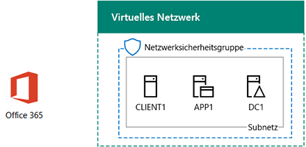

# <a name="dirsync-for-your-office-365-devtest-environment"></a>DirSync für die Office 365-Entwicklungs-/Testumgebung

 **Zusammenfassung:** Konfigurieren Sie Directory-Synchronisierung für Ihre Office 365 Dev/Test-Umgebung.
  
Viele Organisationen verwenden Azure AD Connect und Verzeichnissynchronisierung (DirSync), um den Kontensatz in ihrer lokalen Windows Server Active Directory (AD)-Gesamtstruktur mit dem Kontensatz in Office 365 zu synchronisieren. In diesem Artikel wird beschrieben, wie Sie DirSync mit Kennwortsynchronisierung in der Office 365-Entwicklungs-/Testumgebung verwenden können, woraus die folgende Konfiguration resultiert:
  

  
Diese Konfiguration besteht aus:  
  
- Einem Office 365 E5-Testabonnement, das 30 Tage nach Erstellung abläuft.
    
- Einem vereinfachtem Unternehmensintranet mit Internetzugriff, das aus drei virtuellen Computern in einem Subnetz eines virtuellen Azure-Netzwerks (DC1, APP1 und CLIENT1) besteht. Azure AD Connect wird auf APP1 für die Synchronisierung der Windows Server Active Directory-Domäne mit Office 365 ausgeführt.
    
Es gibt zwei Hauptphasen bei der Einrichtung dieser Entwicklungs-/Testumgebung:
  
1. Erstellen der Office 365-Entwicklungs-/Testumgebung (virtuelle DC1-, APP1- und CLIENT1-Computer in einem virtuellen Azure Netzwerk mit einem Office 365 E5-Testabonnement)
    
2. Installieren und Konfigurieren von Azure AD Connect auf APP1
    
> [!TIP]
> Klicken Sie [hier](http://aka.ms/catlgstack), um eine visuelle Darstellung aller Artikel im Stapel der Testumgebungsanleitungen in der Microsoft Cloud zu erhalten.
  
## <a name="phase-1-create-an-office-365-devtest-environment"></a>Phase 1: Erstellen einer Office 365-Entwicklungs-/Testumgebung

Befolgen Sie die Anweisungen in Phasen 1, 2 und 3 des Artikels [Office 365 Dev/Test Environment](office-365-dev-test-environment.md) . Hier ist die resultierende Konfiguration.
  

  
Diese Konfiguration besteht aus:  
  
- Einem Office 365 E5-Testabonnement
    
- Einem vereinfachtem Unternehmensintranet mit Internetzugriff, das aus virtuellen DC1-, APP1- und CLIENT1-Computern in einem Subnetz eines virtuellen Azure-Netzwerks besteht.
    
## <a name="phase-2-install-azure-ad-connect-on-app1"></a>Phase 2: Installieren von Azure AD Connect auf APP1

Nach Abschluss der Installation und Konfiguration synchronisiert Azure AD Connect den Kontensatz in der CORP Windows Server AD-Domäne mit dem Kontensatz im Office 365-Testabonnement. Das folgende Verfahren führt Sie durch die Installation von Azure AD Connect auf APP1 und die Sicherstellung der ordnungsgemäßen Funktionsweise.
  
### <a name="install-and-configure-azure-ad-connect-on-app1"></a>Installieren und Konfigurieren von Azure Active Directory verbinden auf APP1

1. Über das [Portal Azure](https://portal.azure.com)Herstellen einer Verbindung mit der CORP APP1 mit\\Konto User1 an.
    
2. Öffnen Sie auf APP1 eine Windows PowerShell-Eingabeaufforderung auf Administratorebene, und führen Sie die folgenden Befehle aus:
    
  ```
  Set-ItemProperty -Path "HKLM:\\SOFTWARE\\Microsoft\\Active Setup\\Installed Components\\{A509B1A7-37EF-4b3f-8CFC-4F3A74704073}" -Name "IsInstalled" -Value 0
Set-ItemProperty -Path "HKLM:\\SOFTWARE\\Microsoft\\Active Setup\\Installed Components\\{A509B1A8-37EF-4b3f-8CFC-4F3A74704073}" -Name "IsInstalled" -Value 0
Stop-Process -Name Explorer -Force

  ```

3. Klicken Sie in der Taskleiste auf **Internet Explorer** , und wechseln Sie zur [https://aka.ms/aadconnect](https://aka.ms/aadconnect).
    
4. Klicken Sie auf der Seite Microsoft Azure Active Directory verbinden klicken Sie auf **Download**, und klicken Sie dann auf **Ausführen**.
    
5. Klicken Sie auf der Seite **Willkommen auf Azure Active Directory verbinden** auf **ich stimme zu**, und klicken Sie dann auf **Weiter**.
    
6. Klicken Sie auf der Seite **Einstellungen für Express** auf **express Einstellungen verwenden**.
    
7. Klicken Sie auf der Seite **Connect to Azure AD** **Username,** Geben Sie in Geben Sie Ihren Kontonamen globaler Administrator im Feld **Kennwort**das Kennwort ein, und klicken Sie dann auf **Weiter**.
    
8. Geben Sie auf der Seite **Verbindung mit AD DS** **CORP\\User1** in **Benutzername** Geben Sie im Feld **Kennwort**das Kennwort ein, und klicken Sie dann auf **Weiter**.
    
9. Klicken Sie auf der Seite **Azure AD - Anmeldung Konfiguration** klicken Sie auf **Weiter, ohne alle überprüften Domänen**, und klicken Sie dann auf **Weiter**.
    
10. Klicken Sie auf der Seite **Bereit zur Konfiguration** auf **Installieren**.
    
11. Klicken Sie auf der Seite **Konfiguration abgeschlossen** auf **Beenden**.
    
12. In Internet Explorer wechseln Sie zu Office 365-Portal ([https://portal.office.com](https://portal.office.com)), und melden Sie sich Test Office 365-Abonnement mit Ihrer globalen Administratorkonto an.
    
13. Klicken Sie auf der Hauptportalseite auf **Admin**.
    
14. Klicken Sie im linken Navigationsbereich auf **Benutzer > Aktive Benutzer**.
    
    Notieren Sie das Konto, mit dem Namen **User1**. Dieses Konto wird von der CORP Windows Azure AD-Domäne und belegen, die DirSync gearbeitet hat.
    
15. Klicken Sie auf dem Konto **User1** an. Lizenzen klicken Sie auf **Bearbeiten**.
    
16. Wählen Sie in der **Lizenzen**Ihr Land, und klicken Sie dann auf das Steuerelement **deaktiviert** für **Office 365 Enterprise E5** (Wechsel auf **aktiviert**). Klicken Sie auf **Speichern** , am unteren Rand der Seite, und klicken Sie dann auf **Schließen**.
    
Nachfolgend sehen Sie die daraus resultierende Konfiguration.
  

  
Diese Konfiguration besteht aus:  
  
- Einem Office 365 E5-Testabonnement
    
- Einem vereinfachtem Unternehmensintranet mit Internetzugriff, das aus virtuellen DC1-, APP1- und CLIENT1-Computern in einem Subnetz eines virtuellen Azure-Netzwerks besteht. Azure AD Connect wird auf APP1 ausgeführt, um die CORP Windows Server Active Directory-Domäne mit Office 365 alle 30 Minuten zu synchronisieren.
    
## <a name="next-step"></a>Nächster Schritt

Wenn Sie zum Bereitstellen von DirSync für Ihre Organisation bereit sind, finden Sie unter [Bereitstellen von Office 365 Directory-Synchronisierung (DirSync) in Microsoft Azure](deploy-office-365-directory-synchronization-dirsync-in-microsoft-azure.md).

## <a name="see-also"></a>Weitere Artikel

[Testumgebungsanleitungen (TLGs) zur Cloudakzeptanz](cloud-adoption-test-lab-guides-tlgs.md)
  
[Basiskonfiguration der Entwicklungs-/Testumgebung](base-configuration-dev-test-environment.md)
  
[Office 365-Entwicklungs-/Testumgebung](office-365-dev-test-environment.md)
  
[Cloud App Security für Ihre Office 365-Entwicklungs-/Testumgebung](cloud-app-security-for-your-office-365-dev-test-environment.md)
  
[Advanced Threat Protection für die Office 365-Entwicklungs-/Testumgebung](advanced-threat-protection-for-your-office-365-dev-test-environment.md)
  
[Cloudakzeptanz und Hybridlösungen](cloud-adoption-and-hybrid-solutions.md)


