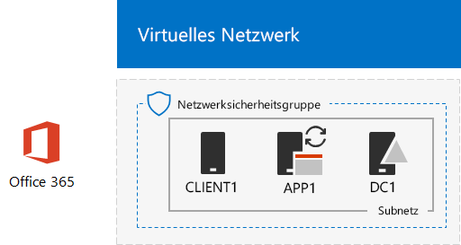
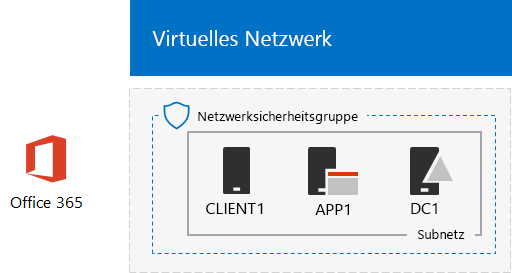

# <a name="directory-synchronization-for-your-office-365-devtest-environment"></a><span data-ttu-id="74550-103">Verzeichnissynchronisierung für die Office 365-Entwicklungs-/Testumgebung</span><span class="sxs-lookup"><span data-stu-id="74550-103">Directory synchronization for your Office 365 dev/test environment</span></span>

 <span data-ttu-id="74550-104">**Zusammenfassung:** Konfigurieren der Verzeichnissynchronisierung für die Office 365-Entwicklungs-/Testumgebung</span><span class="sxs-lookup"><span data-stu-id="74550-104">**Summary:** Configure directory synchronization for your Office 365 dev/test environment.</span></span>
  
<span data-ttu-id="74550-p101">Viele Organisationen verwenden Azure AD Connect und Verzeichnissynchronisierung, um den Kontensatz in ihrer lokalen AD DS-Gesamtstruktur (Active Directory Domain Services) mit dem Kontensatz in Office 365 zu synchronisieren. In diesem Artikel wird beschrieben, wie Sie die Verzeichnissynchronisierung mit Kennworthashsynchronisierung in der Office 365-Entwicklungs-/Testumgebung verwenden können, woraus die folgende Konfiguration resultiert:</span><span class="sxs-lookup"><span data-stu-id="74550-p101">Many organizations use Azure AD Connect and directory synchronization to synchronize the set of accounts in their on-premises Active Directory Domain Services (AD DS) forest to the set of accounts in Office 365. This article describes how you can add directory synchronization with password hash synchronization to the Office 365 dev/test environment, resulting in the following configuration.</span></span>
  

  
<span data-ttu-id="74550-108">Diese Konfiguration besteht aus: </span><span class="sxs-lookup"><span data-stu-id="74550-108">This configuration consists of:</span></span> 
  
- <span data-ttu-id="74550-109">Einem Office 365 E5-Testabonnement, das 30 Tage nach Erstellung abläuft.</span><span class="sxs-lookup"><span data-stu-id="74550-109">An Office 365 E5 Trial Subscription, which expires 30 days from when you create it.</span></span>
- <span data-ttu-id="74550-p102">Einem vereinfachtem Unternehmensintranet mit Internetzugriff, das aus drei virtuellen Computern in einem Subnetz eines virtuellen Azure-Netzwerks (DC1, APP1 und CLIENT1) besteht. Azure AD Connect wird auf APP1 für die Synchronisierung der AD DS-Domäne mit Office 365 ausgeführt.</span><span class="sxs-lookup"><span data-stu-id="74550-p102">A simplified organization intranet connected to the Internet, consisting of three virtual machines on a subnet of an Azure virtual network (DC1, APP1, and CLIENT1). Azure AD Connect runs on APP1 to synchronize the AD DS domain to Office 365.</span></span>
    
<span data-ttu-id="74550-112">Es gibt zwei Hauptphasen bei der Einrichtung dieser Entwicklungs-/Testumgebung:</span><span class="sxs-lookup"><span data-stu-id="74550-112">There are two phases to setting up this dev/test environment:</span></span>
  
1. <span data-ttu-id="74550-113">Erstellen der Office 365-Entwicklungs-/Testumgebung (virtuelle DC1-, APP1- und CLIENT1-Computer in einem virtuellen Azure Netzwerk mit einem Office 365 E5-Testabonnement)</span><span class="sxs-lookup"><span data-stu-id="74550-113">Create the Office 365 dev/test environment (the DC1, APP1, and CLIENT1 virtual machines in an Azure virtual network with an Office 365 E5 trial subscription).</span></span>
2. <span data-ttu-id="74550-114">Installieren und Konfigurieren von Azure AD Connect auf APP1</span><span class="sxs-lookup"><span data-stu-id="74550-114">Install and configure Azure AD Connect on APP1.</span></span>
    
> [!TIP]
> <span data-ttu-id="74550-115">Klicken Sie [hier](http://aka.ms/catlgstack), um eine visuelle Darstellung aller Artikel im Stapel der Testumgebungsanleitungen in Office 365 zu erhalten.</span><span class="sxs-lookup"><span data-stu-id="74550-115">Click [here](http://aka.ms/catlgstack) for a visual map to all the articles in the Office 365 Test Lab Guide stack.</span></span>
  
## <a name="phase-1-create-an-office-365-devtest-environment"></a><span data-ttu-id="74550-116">Phase 1: Erstellen einer Office 365-Entwicklungs-/Testumgebung</span><span class="sxs-lookup"><span data-stu-id="74550-116">Phase 1: Create an Office 365 dev/test environment</span></span>

<span data-ttu-id="74550-p103">Folgen Sie den Anweisungen in Phasen 1, 2 und 3 des Artikels [Office 365-Entwicklungs-/Testumgebung](office-365-dev-test-environment.md). Nachfolgend sehen Sie die daraus resultierende Konfiguration.</span><span class="sxs-lookup"><span data-stu-id="74550-p103">Follow the instructions in phases 1, 2, and 3 of the [Office 365 dev/test environment](office-365-dev-test-environment.md) article. Here is the resulting configuration.</span></span>
  

  
<span data-ttu-id="74550-120">Diese Konfiguration besteht aus: </span><span class="sxs-lookup"><span data-stu-id="74550-120">This configuration consists of:</span></span> 
  
- <span data-ttu-id="74550-121">Einem Office 365 E5-Testabonnement</span><span class="sxs-lookup"><span data-stu-id="74550-121">An Office 365 E5 Trial Subscription.</span></span>
- <span data-ttu-id="74550-122">Einem vereinfachtem Unternehmensintranet mit Internetzugriff, das aus virtuellen DC1-, APP1- und CLIENT1-Computern in einem Subnetz eines virtuellen Azure-Netzwerks besteht.</span><span class="sxs-lookup"><span data-stu-id="74550-122">A simplified organization intranet connected to the Internet, consisting of the DC1, APP1, and CLIENT1 virtual machines on a subnet of an Azure virtual network.</span></span>
    
## <a name="phase-2-install-azure-ad-connect-on-app1"></a><span data-ttu-id="74550-123">Phase 2: Installieren von Azure AD Connect auf APP1</span><span class="sxs-lookup"><span data-stu-id="74550-123">Phase 2: Install Azure AD Connect on APP1</span></span>

<span data-ttu-id="74550-p104">Nach Abschluss der Installation und Konfiguration synchronisiert Azure AD Connect den Kontensatz in der CORP AD DS-Domäne mit dem Kontensatz im Office 365-Testabonnement. Das folgende Verfahren führt Sie durch die Installation von Azure AD Connect auf APP1 und die Sicherstellung der ordnungsgemäßen Funktionsweise.</span><span class="sxs-lookup"><span data-stu-id="74550-p104">Once installed and configured, Azure AD Connect synchronizes the set of accounts in the CORP AD DS domain with the set of accounts in your Office 365 trial subscription. The following procedure steps you through installing Azure AD Connect on APP1 and checking that it works.</span></span>
  
### <a name="install-and-configure-azure-ad-connect-on-app1"></a><span data-ttu-id="74550-126">Installieren und Konfigurieren von Azure AD Connect auf APP1</span><span class="sxs-lookup"><span data-stu-id="74550-126">Install and configure Azure AD Connect on APP1</span></span>

1. <span data-ttu-id="74550-127">Melden Sie sich über das [Azure-Portal](https://portal.azure.com) mit dem CORP\\Benutzer1-Konto bei APP1 an.</span><span class="sxs-lookup"><span data-stu-id="74550-127">From the [Azure portal](https://portal.azure.com), connect to APP1 with the CORP\\User1 account.</span></span>
    
2. <span data-ttu-id="74550-128">Öffnen Sie auf APP1 eine Windows PowerShell-Eingabeaufforderung auf Administratorebene, und führen Sie die folgenden Befehle aus:</span><span class="sxs-lookup"><span data-stu-id="74550-128">From APP1, open an administrator-level Windows PowerShell command prompt, and then run these commands:</span></span>
    
  ```
  Set-ItemProperty -Path "HKLM:\SOFTWARE\Microsoft\Active Setup\Installed Components\{A509B1A7-37EF-4b3f-8CFC-4F3A74704073}" -Name "IsInstalled" -Value 0
Set-ItemProperty -Path "HKLM:\SOFTWARE\Microsoft\Active Setup\Installed Components\{A509B1A8-37EF-4b3f-8CFC-4F3A74704073}" -Name "IsInstalled" -Value 0
Stop-Process -Name Explorer -Force

  ```

3. <span data-ttu-id="74550-129">Klicken Sie auf der Taskleiste auf **Internet Explorer**, und wechseln Sie zu [https://aka.ms/aadconnect](https://aka.ms/aadconnect).</span><span class="sxs-lookup"><span data-stu-id="74550-129">From the task bar, click **Internet Explorer** and go to [https://aka.ms/aadconnect](https://aka.ms/aadconnect).</span></span>
    
4. <span data-ttu-id="74550-130">Klicken Sie auf der Seite „Microsoft Azure Active Directory Connect“ auf **Herunterladen** und dann auf **Ausführen**.</span><span class="sxs-lookup"><span data-stu-id="74550-130">On the Microsoft Azure Active Directory Connect page, click **Download**, and then click **Run**.</span></span>
    
5. <span data-ttu-id="74550-131">Klicken Sie auf der Seite **Willkommen bei Azure AD Connect** auf **Ich stimme zu** und dann auf **Weiter**.</span><span class="sxs-lookup"><span data-stu-id="74550-131">On the **Welcome to Azure AD Connect** page, click **I agree**, and then click **Continue**.</span></span>
    
6. <span data-ttu-id="74550-132">Klicken Sie auf der Seite **Express-Einstellungen** auf **Express-Einstellungen verwenden**.</span><span class="sxs-lookup"><span data-stu-id="74550-132">On the **Express Settings** page, click **Use express settings**.</span></span>
    
7. <span data-ttu-id="74550-133">Geben Sie auf der Seite **Mit Azure AD verbinden** unter **Benutzername** den Namen Ihres globalen Administratorkontos und unter **Kennwort** das zugehörige Kennwort ein. Klicken Sie dann auf **Weiter**.</span><span class="sxs-lookup"><span data-stu-id="74550-133">On the **Connect to Azure AD** page, type your global administrator account name in **Username,** type its password in **Password**, and then click **Next**.</span></span>
    
8. <span data-ttu-id="74550-134">Geben Sie auf der Seite **Mit AD DS verbinden** den Namen **CORP\\Benutzer1** unter **Benutzername** und das zugehörige Kennwort unter **Kennwort** ein. Klicken Sie dann auf **Weiter**.</span><span class="sxs-lookup"><span data-stu-id="74550-134">On the **Connect to AD DS** page, type **CORP\\User1** in **Username,** type its password in **Password**, and then click **Next**.</span></span>
    
9. <span data-ttu-id="74550-135">Klicken Sie auf der Seite **Azure AD-Anmeldungskonfiguration** auf **Ohne überprüfte Domänen fortfahren**, und dann auf **Weiter**.</span><span class="sxs-lookup"><span data-stu-id="74550-135">On the **Azure AD sign-in configuration** page, click **Continue without any verified domains**, and then click **Next**.</span></span>
    
10. <span data-ttu-id="74550-136">Klicken Sie auf der Seite **Bereit zur Konfiguration** auf **Installieren**.</span><span class="sxs-lookup"><span data-stu-id="74550-136">On the **Ready to configure** page, click **Install**.</span></span>
    
11. <span data-ttu-id="74550-137">Klicken Sie auf der Seite **Konfiguration abgeschlossen** auf **Beenden**.</span><span class="sxs-lookup"><span data-stu-id="74550-137">On the **Configuration complete** page, click **Exit**.</span></span>
    
12. <span data-ttu-id="74550-138">Wechseln Sie im Internet Explorer zum Microsoft 365 Admin Center ([https://admin.microsoft.com](https://admin.microsoft.com)) und melden Sie sich bei Ihrem Office 365-Testabonnement mit Ihrem globalen Administratorkonto an.</span><span class="sxs-lookup"><span data-stu-id="74550-138">In Internet Explorer, go to the Microsoft 365 admin center ([https://admin.microsoft.com](https://admin.microsoft.com)) and sign in to your Office 365 trial subscription with your global administrator account.</span></span>
    
13. <span data-ttu-id="74550-139">Klicken Sie auf der Hauptportalseite auf **Admin**.</span><span class="sxs-lookup"><span data-stu-id="74550-139">From the main portal page, click **Admin**.</span></span>
    
14. <span data-ttu-id="74550-140">Klicken Sie im linken Navigationsbereich auf **Benutzer > Aktive Benutzer**.</span><span class="sxs-lookup"><span data-stu-id="74550-140">In the left navigation, click **Users > Active users**.</span></span>
    
    <span data-ttu-id="74550-p105">Sie sehen das Konto **Benutzer1**. Dieses Konto gehört zur AD DS-Domäne „CORP“. Dass es angezeigt wird, belegt, dass die Verzeichnissynchronisierung erfolgreich war.</span><span class="sxs-lookup"><span data-stu-id="74550-p105">Note the account named **User1**. This account is from the CORP AD DS domain and is proof that directory synchronization has worked.</span></span>
    
15. <span data-ttu-id="74550-p106">Klicken Sie auf das Konto**Benutzer1**. Für Produktlizenzen klicken Sie auf **Bearbeiten**.</span><span class="sxs-lookup"><span data-stu-id="74550-p106">Click the **User1** account. For product licenses, click **Edit**.</span></span>
    
16. <span data-ttu-id="74550-p107">Wählen Sie unter **Product licenses** Ihr Land/Ihre Region aus, und klicken Sie dann für **Office 365 Enterprise E5** auf **Off**. (So schalten Sie die Lizenz auf **On**.) Klicken Sie unten auf der Seite auf **Speichern** und dann auf **Schließen**.</span><span class="sxs-lookup"><span data-stu-id="74550-p107">In **Product licenses**, select your country, and then click the **Off** control for **Office 365 Enterprise E5** (switching it to **On**). Click **Save** at the bottom of the page, and then click **Close**.</span></span>
    
<span data-ttu-id="74550-147">Nachfolgend sehen Sie die daraus resultierende Konfiguration.</span><span class="sxs-lookup"><span data-stu-id="74550-147">This is the resulting configuration.</span></span>
  

  
<span data-ttu-id="74550-149">Diese Konfiguration besteht aus: </span><span class="sxs-lookup"><span data-stu-id="74550-149">This configuration consists of:</span></span> 
  
- <span data-ttu-id="74550-150">Einem Office 365 E5-Testabonnement</span><span class="sxs-lookup"><span data-stu-id="74550-150">An Office 365 E5 Trial Subscription.</span></span>
- <span data-ttu-id="74550-p108">Einem vereinfachtem Unternehmensintranet mit Internetzugriff, das aus virtuellen DC1-, APP1- und CLIENT1-Computern in einem Subnetz eines virtuellen Azure-Netzwerks besteht. Azure AD Connect wird auf APP1 ausgeführt, um die CORP AD DS-Domäne mit Office 365 alle 30 Minuten zu synchronisieren.</span><span class="sxs-lookup"><span data-stu-id="74550-p108">A simplified organization intranet connected to the Internet, consisting of the DC1, APP1, and CLIENT1 virtual machines on a subnet of an Azure virtual network. Azure AD Connect runs on APP1 to synchronize the CORP AD DS domain to Office 365 every 30 minutes.</span></span>
    
## <a name="next-step"></a><span data-ttu-id="74550-153">Nächster Schritt</span><span class="sxs-lookup"><span data-stu-id="74550-153">Next Step</span></span>

<span data-ttu-id="74550-154">Wenn Sie die Verzeichnissynchronisierung für Ihre Organisation bereitstellen möchten, finden Sie unter [Bereitstellen der Office 365-Verzeichnissynchronisierung in Microsoft Azure](deploy-office-365-directory-synchronization-dirsync-in-microsoft-azure.md) entsprechende Informationen.</span><span class="sxs-lookup"><span data-stu-id="74550-154">When you are ready to deploy directory synchronization for your organization, see [Deploy Office 365 Directory Synchronization in Microsoft Azure](deploy-office-365-directory-synchronization-dirsync-in-microsoft-azure.md).</span></span>

## <a name="see-also"></a><span data-ttu-id="74550-155">Siehe auch</span><span class="sxs-lookup"><span data-stu-id="74550-155">See Also</span></span>

[<span data-ttu-id="74550-156">Testumgebungsanleitungen (TLGs) zur Cloudakzeptanz</span><span class="sxs-lookup"><span data-stu-id="74550-156">Cloud adoption Test Lab Guides (TLGs)</span></span>](cloud-adoption-test-lab-guides-tlgs.md)

[<span data-ttu-id="74550-157">Basiskonfiguration der Entwicklungs-/Testumgebung</span><span class="sxs-lookup"><span data-stu-id="74550-157">Base Configuration dev/test environment</span></span>](base-configuration-dev-test-environment.md)

[<span data-ttu-id="74550-158">Office 365-Entwicklungs-/Testumgebung</span><span class="sxs-lookup"><span data-stu-id="74550-158">Office 365 dev/test environment</span></span>](office-365-dev-test-environment.md)

[<span data-ttu-id="74550-159">Advanced Threat Protection für die Office 365-Entwicklungs-/Testumgebung</span><span class="sxs-lookup"><span data-stu-id="74550-159">Advanced Threat Protection for your Office 365 dev/test environment</span></span>](advanced-threat-protection-for-your-office-365-dev-test-environment.md)

[<span data-ttu-id="74550-160">Cloudakzeptanz und Hybridlösungen</span><span class="sxs-lookup"><span data-stu-id="74550-160">Cloud adoption and hybrid solutions</span></span>](cloud-adoption-and-hybrid-solutions.md)


