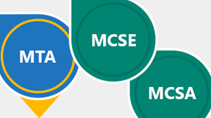

# Unternehmen und Office 365

Als einer größeren Organisation mit IT-Experten Mitarbeiter müssen Sie bestimmte Anforderungen und Standards für die Verwaltung Ihrer Umgebung. Hier sind die Informationen, die Sie zum Planen und Verwalten von Office 365 für Unternehmen benötigen.
  

> [!VIDEO https://www.microsoft.com/videoplayer/embed/d08b637c-66dc-4f0e-afc2-56da92e99589?autoplay=false]
  
## Wichtige Ressourcen

  
 **Hilfe vom schnelle**
  
Planen, Setup aus, und Migrieren von Daten zu Office 365 mit Hilfe von schnelle.
  
[Klicken Sie auf das schnelle Abrufen](https://go.microsoft.com/fwlink/?linkid=238431)
  

  
 **Sicherheit &amp; Compliance**
  
Schützen Sie Ihre Daten und rechtliche oder behördliche Standards entsprechen.
  
[Übersicht über die Sicherheit &amp; Einhaltung von Vorschriften in Office 365](https://support.office.com/article/dcb83b2c-ac66-4ced-925d-50eb9698a0b2)
  

  
 **Grundlegendes zu Cloud-Architektur**
  
Verwenden Sie die Architektur-Poster zu den Enterprise-Cloud.
  
[Get-Poster](https://aka.ms/cloudarch)
  

  
 **Informieren Sie sich über allgemeine Angriffe**
  
Hier erfahren Sie, wie Microsoft dazu beitragen kann Ihre Organisation zu schützen.
  
[Poster herunterladen](https://aka.ms/commonattacks)
  
## Schulung für IT-Spezialisten

  
 **IT Pro-Schulung**
  
Entdecken Sie kostenlose video Kurse, bereitgestellt von LinkedIn Learning.
  
[Schulungen für fortgeschrittene](https://support.office.com/article/68cc9b95-0bdc-491e-a81f-ee70b3ec63c5.aspx)
  

  
 **Microsoft Learning**
  
Office 365-Schulung und-Zertifizierung für IT-Experten.
  
[Beliebte Schulung](https://go.microsoft.com/fwlink/?linkid=826247)
  

  
 **Virtuelle Academy (engl.)**
  
Lernen Sie mit den Experten bei Microsoft Virtual Academy.
  
[Navigieren Sie Kurse](https://go.microsoft.com/fwlink/?linkid=826248)
  

  
 **EdX Universität**
  
Self-paced online Learning guter für Office 365-IT-Experten.
  
[Jetzt registrieren](https://go.microsoft.com/fwlink/?linkid=852994)
  
## Empfohlene Artikel

[Kontaktieren des Supports bei Business-Produkte – Admin Hilfe](https://support.office.com/article/32a17ca7-6fa0-4870-8a8d-e25ba4ccfd4b)
  
[Bereitstellen des neuen OneDrive-Synchronisierungsclients für Windows](https://support.office.com/article/3f3a511c-30c6-404a-98bf-76f95c519668)
  
[Möglichkeiten zum Migrieren von mehreren E-Mail-Konten zu Office 365](https://support.office.com/article/0a4913fe-60fb-498f-9155-a86516418842)
  
[Aktualisieren von Office 2010-Servern und clients](upgrade-from-office-2010-servers-and-products.md)
  
[Bereitstellung Berater für Office 365-Dienste](deployment-advisors-for-office-365.md)
  
 **Schulungen für Endbenutzer**
  
[Schulung für Office 365-Produktivität](https://support.office.com/article/af07cb6b-980d-4f33-8599-322582767408)
  
[Video: Was ist Office 365?](https://support.office.com/article/847caf12-2589-452c-8aca-1c009797678b)
  
 **Ressourcen für die Entwicklung**
  
[Office-Entwicklercenter](https://go.microsoft.com/fwlink/?linkid=615418)
  

