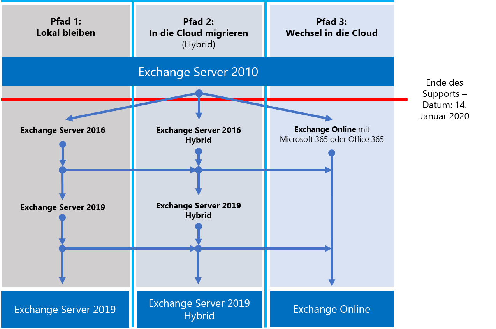

# Roadmap für Exchange 2010 Ende des SupportsExchange 2010 end of support roadmap

Am **14. Januar 2020**erreicht Exchange Server 2010 das Ende der Unterstützung.On **January 14, 2020**, Exchange Server 2010 will reach end of support. Wenn Sie die Migration nicht bereits von Exchange 2010 zu Office 365 oder Exchange 2016 begonnen haben, ist es an der Zeit, mit der Planung zu beginnen.If you haven't already begun your migration from Exchange 2010 to Office 365 or Exchange 2016, now's the time to start your planning.

## Was bedeutet das Ende der Unterstützung?What does end of support mean?

Exchange Server, wie fast alle Microsoft-Produkte, verfügt über einen Support-Lebenszyklus, in dem wir neue Features, Fehlerbehebungen, Sicherheitsfixes usw. bereitstellen.Exchange Server, like almost all Microsoft products, has a support lifecycle during which we provide new features, bug fixes, security fixes, and so on. Dieser Lebenszyklus dauert in der Regel 10 Jahre ab dem Datum der ersten Produktversion, und das Ende dieses Lebenszyklus wird als Ende der Unterstützung des Produkts bezeichnet.This lifecycle typically lasts for 10 years from the date of the product's initial release, and the end of this lifecycle is known as the product's end of support.
Wenn Exchange 2010 am Ende der Unterstützung am 14. Januar 2020, stellt Microsoft nicht mehr Folgendes bereit:When Exchange 2010 reaches its end of support on January 14, 2020, Microsoft will no longer provide:

- Technischer Support für Probleme, die auftreten können;Technical support for problems that may occur;
- Fehlerbehebungen für erkannte Probleme, die sich auf die Stabilität und Benutzerfreundlichkeit des Servers auswirken können;Bug fixes for issues that are discovered and that may impact the stability and usability of the server;
- Sicherheitsfixes für Sicherheitsanfälligkeiten, die erkannt werden und die den Server möglicherweise anfällig für Sicherheitsverletzungen machen;Security fixes for vulnerabilities that are discovered and that may make the server vulnerable to security breaches;
- Zeitzonenaktualisierungen.Time zone updates.

Die Installation von Exchange 2010 wird weiterhin nach diesem Datum ausgeführt.Your installation of Exchange 2010 will continue to run after this date. Aufgrund der oben aufgeführten Änderungen wird jedoch dringend empfohlen, dass Sie so bald wie möglich von Exchange 2010 migrieren.However, because of the changes listed above, we strongly recommend that you migrate from Exchange 2010 as soon as possible.

Weitere Informationen zu Office 2010 Servern, die sich am Ende des Supports befinden, finden Sie unter [Ressourcen, die Ihnen beim Upgrade von Office 2010-Servern und-Clients helfen](https://docs.microsoft.com/en-us/office365/enterprise/upgrade-from-office-2010-servers-and-products).For more information about Office 2010 servers nearing the end of support, see [Resources to help you upgrade from Office 2010 servers and clients](https://docs.microsoft.com/en-us/office365/enterprise/upgrade-from-office-2010-servers-and-products).

## Was sind meine Optionen?What are my options?

Wenn Exchange 2010 das Ende der Unterstützung erreicht hat, ist dies eine gute Zeit, um Ihre Optionen zu erkunden und einen Migrationsplan vorzubereiten.With Exchange 2010 reaching its end of support, this is a great time to explore your options and prepare a migration plan. Sie können:You can:

- Migrieren Sie vollständig zu Office 365.Migrate fully to Office 365. Migrieren von Postfächern mithilfe von Cutover, minimaler Hybrid-oder vollständiger Hybrid Migration und Entfernen von lokalen Exchange-Servern und Active Directory.Migrate mailboxes using cutover, minimal hybrid, or full hybrid migration, then remove on-premises Exchange servers and Active Directory.
- Migrieren Sie Ihre Exchange 2010 Server zu Exchange 2016 auf Ihren lokalen Servern.Migrate your Exchange 2010 servers to Exchange 2016 on your on-premises servers.

> [!IMPORTANT]
> Wenn sich Ihre Organisation für die Migration von Postfächern zu Office 365 entscheidet, aber Dirsync oder Azure AD eine Verbindung herstellen möchte, um die Verwaltung von Benutzerkonten aus lokalen Active Directory fortzusetzen, müssen Sie mindestens einen lokalen Exchange-Server beibehalten.If your organization chooses to migrate mailboxes to Office 365 but intends to keep DirSync or Azure AD Connect in place to continue managing user accounts from on-premises Active Directory, you need to keep at least one Exchange server on-premises. Wenn der letzte Exchange-Server entfernt wird, können Sie in Exchange Online keine Änderungen an Exchange-Empfängern vornehmen.If the last Exchange server is removed, you won’t be able to make changes to Exchange recipients in Exchange Online. Dies liegt daran, dass die Autoritäts Quelle in Ihrem lokalen Active Directory bleibt und dass dort Änderungen vorgenommen werden müssen.This is because the source of authority remains in your on-premises Active Directory and changes need to be made there. In diesem Szenario stehen Ihnen die folgenden Optionen zur Ver:In this scenario, you have the following options:

- (**Empfohlen**) Wenn Sie Ihre Postfächer zu Office 365 migrieren und Ihre Server bis zum 14. Januar 2020 aktualisieren können, verwenden Sie Exchange 2010, um eine Verbindung mit Office 365 und Migrieren von Postfächern herzustellen.(**Recommended**) If you can migrate your mailboxes to Office 365 and upgrade your servers by January 14, 2020, use Exchange 2010 to connect to Office 365 and migrate mailboxes. Migrieren Sie als nächstes Exchange 2010 zu Exchange 2016, und setzen Sie alle verbleibenden Exchange 2010-Server außer Betrieb.Next, migrate Exchange 2010 to Exchange 2016 and decommission any remaining Exchange 2010 servers.
- Wenn Sie die Postfachmigration und das lokale Server Upgrade bis zum 14. Januar 2020 nicht abschließen können, führen Sie zuerst ein Upgrade Ihrer lokalen Exchange 2010 Server auf Exchange 2016 durch, und verwenden Sie dann Exchange 2016 zum Herstellen einer Verbindung mit Office 365 und Migrieren von Postfächern.If you can’t complete the mailbox migration and on-premises server upgrade by January 14, 2020, upgrade your on-premises Exchange 2010 servers to Exchange 2016 first, then use Exchange 2016 to connect to Office 365 and migrate mailboxes.

> [!NOTE]
> Während Sie ein wenig komplizierter sind, können Sie auch Postfächer zu Office 365 migrieren, während Sie Ihre lokalen Exchange 2010 Server zu Exchange 2016 migrieren.While a little more complicated, you may also migrate mailboxes to Office 365 while migrating your on-premises Exchange 2010 servers to Exchange 2016.

Hier sind die drei Pfade, die Sie ausführen können, um das Ende der Unterstützung für Exchange Server 2010 zu vermeiden.Here are the three paths you can take to avoid the end of support for Exchange Server 2010.

In den folgenden Abschnitten werden die einzelnen Optionen näher erläutert.The following sections explore each option in more detail.

## Migrieren zu Office 365Migrate to Office 365

Die Migration Ihrer e-Mail an Office 365 ist die beste und einfachste Option, um Ihre Exchange 2010-Bereitstellung zu unterstützen.Migrating your email to Office 365 is your best and simplest option to help you retire your Exchange 2010 deployment. Mit einer Migration zu Office 365 können Sie einen einzelnen Hop von der alten Technologie zu modernen Features machen, wie:With a migration to Office 365, you can make a single hop from old technology to state-of-the-art features, like:

- Compliance-Funktionen wie Aufbewahrungsrichtlinien, in-situ-und Beweissicherungsverfahren, in-situ-eDiscovery und mehrCompliance capabilities such as Retention Policies, In-Place and Litigation Hold, in-place eDiscovery, and more;
- Microsoft Teams;Microsoft Teams;
- Power BI;Power BI;
- Fokussierter Posteingang;Focused Inbox;
- Analyse durchforschen;Delve Analytics;

Office 365 erhält auch zuerst neue Funktionen und Erfahrungen, und Sie und Ihre Benutzer können diese in der Regel sofort verwenden.Office 365 also gets new features and experiences first and you and your users can usually start using them right away. Zusätzlich zu den neuen Features müssen Sie sich keine Gedanken machen:In addition to new features, you won't have to worry about:

- Einkauf und Wartung von Hardware;Purchasing and maintaining hardware;
- Bezahlen für das Heizen und kühlen Ihrer Server;Paying for heating and cooling of your servers;
- Halten Sie sich auf dem Laufenden über Sicherheits-, Produkt-und Zeit Zonen Korrekturen;Keeping up to date on security, product, and time zone fixes;
- Wartung von Speicher und Software zur Unterstützung von Compliance-Anforderungen;Maintaining storage and software to support compliance requirements;
- Upgrade auf eine neue Version von Exchange – Sie haben immer die neueste Version von Exchange in Office 365.Upgrading to a new version of Exchange - you're always on the latest version   of Exchange in Office 365.

### Wie sollte ich zu Office 365 migrieren?How should I migrate to Office 365?

Je nach Organisation stehen Ihnen einige Optionen zur Verfügung, mit denen Sie Office 365 erreichen können.Depending on your organization, you have a few options that'll help you get to Office 365. Bei der Auswahl einer Migrationsoption müssen Sie sich einige Dinge ansehen, beispielsweise die Anzahl der zu verschiebenden Arbeitsplätze oder Postfächer, die Dauer der Migration und ob Sie eine nahtlose Integration zwischen Ihrer lokalen Installation und der Office 365 während des Betriebs benötigen. die Migration.When choosing a migration option, you need to consider a few things like the number of seats or mailboxes you need to move, how long you want the migration to last, and whether you need a seamless integration between your on-premises installation and Office 365 during the migration. In dieser Tabelle sind die Migrationsoptionen und die wichtigsten Faktoren aufgeführt, die bestimmen, welche Methode Sie verwenden werden.This table shows your migration options and the most important factors that'll determine which method you'll use.

| **Migrationsoption****Migration option**     | **Organisationsgröße****Organization size** | **Duration****Duration**        |
|--------------------------|-----------------------|---------------------|
| ÜbernahmemigrationCutover migration        | Weniger als 150 SitzeFewer than 150 seats  | Mindestens eine WocheA week or less      |
| Minimale Hybrid MigrationMinimal hybrid migration | Weniger als 150 SitzeFewer than 150 seats  | Ein paar Wochen oder wenigerA few weeks or less |
| Vollständige Hybrid MigrationFull hybrid migration    | Mehr als 150 SitzeMore than 150 seats   | Ein paar Wochen oder mehrA few weeks or more |

In den folgenden Abschnitten erhalten Sie einen Überblick über diese Methoden.The following sections give you an overview of these methods. Auschecken entscheiden Sie sich für [einen Migrationspfad](https://support.office.com/en-us/article/Decide-on-a-migration-path-0d4f2396-9cef-43b8-9bd6-306d01df1e27) , um die Details der einzelnen Methoden zu erfahren.Check out [Decide on a migration path](https://support.office.com/en-us/article/Decide-on-a-migration-path-0d4f2396-9cef-43b8-9bd6-306d01df1e27) to learn the details of each method.

### ÜbernahmemigrationCutover migration

Bei einer Cutover Migration werden alle Postfächer, Verteilergruppen, Kontakte usw. zu einem vorab ausgewählten Datum und einer bestimmten Uhrzeit in Office 365 migriert. Wenn Sie fertig sind, schließen Sie Ihre lokalen Exchange-Server ab und verwenden ausschließlich Office 365.A cutover migration is one where, at a pre-selected date and time, you'll migrate all your mailboxes, distribution groups, contacts, and so on, to Office 365; when you've finished, you'll shut down your on-premises Exchange servers and start using Office 365 exclusively.

Die Cutover-Migrationsmethode eignet sich hervorragend für kleine Organisationen, die nicht sehr viele Postfächer haben, schnell Office 365 erhalten möchten und nicht mit einigen der Komplexitäten der anderen Methoden umgehen möchten.The cutover migration method is great for small organizations that don't have very many mailboxes, want to get to Office 365 quickly, and don't want to deal with some of the complexities of the other methods. Es ist jedoch auch etwas limitiert, da es in einer Woche oder weniger ausgeführt werden sollte und weil Benutzer Ihre Outlook-Profile neu konfigurieren müssen.But it's also somewhat limited because it should be completed in a week or less and because it requires users to reconfigure their Outlook profiles. Während die Cutover-Migration bis zu 2.000 Postfächer verarbeiten kann, wird dringend empfohlen, dass Sie mit dieser Methode maximal 150 Postfächer migrieren.While cutover migration can handle up to 2,000 mailboxes, we strongly recommend you migrate a maximum of 150 mailboxes with this method. Wenn Sie versuchen, mehr als 150 Postfächer zu migrieren, können Sie keine Zeit mehr für die Übertragung aller Postfächer vor dem Stichtag haben, und Ihr IT-Supportmitarbeiter kann die Unterstützung von Benutzern bei der Neukonfiguration von Outlook überfordern.If you try to migrate more than 150 mailboxes, you could run out of time to transfer all the mailboxes before your deadline, and your IT support staff may get overwhelmed helping users reconfigure Outlook.

Wenn Sie über eine Cutover-Migration nachdenken, sollten Sie Folgendes berücksichtigen:If you're thinking about doing a cutover migration, here are a few things to think consider:

- Office 365 müssen mit Outlook Anywhere über TCP-Port 443 eine Verbindung zu Ihren Exchange 2010 Servern herstellen;Office 365 will need to connect to your Exchange 2010 servers using Outlook   Anywhere over TCP port 443;
- Alle lokalen Postfächer werden in Office 365 verschoben;All on-premises mailboxes will be moved to Office 365;
- Sie benötigen ein lokales Administratorkonto, das Zugriff hat, um den Inhalt der Postfächer Ihrer Benutzer zu lesen;You'll need an on-premises administrator account that has access to read the   contents of your users' mailboxes;
- Die Exchange 2010 akzeptierten Domänen, die Sie in Office 365 verwenden möchten, müssen als verifizierte Domänen im Dienst hinzugefügt werden.The Exchange 2010 accepted domains that you want to use in Office 365 need   to be added as verified domains in the service;
- Zwischen dem Beginn der Migration und dem Zeitpunkt, zu dem die Abschlussphase beginnt, werden die Office 365 und lokalen Postfächer von Office 365 regelmäßig synchronisiert.Between the time you start the migration and when you begin the completion phase, Office 365 will periodically synchronize the Office 365 and on-premises mailboxes. Auf diese Weise können Sie die Migration abschließen, ohne sich Gedanken darüber machen zu müssen, dass e-Mails in Ihren lokalen Postfächern hinterlassen werden.This lets you complete the migration without worrying about email being left behind in your on-premises mailboxes;
- Benutzer erhalten neue temporäre Kennwörter für Ihr Office 365 Konto, das Sie ändern müssen, wenn Sie sich zum ersten Mal bei ihren Postfächern anmelden;Users will receive new temporary passwords for their Office 365 account that   they'll need to change when they log in to their mailboxes for the first   time;
- Sie benötigen eine Office 365 Lizenz, die Exchange Online für jedes Benutzerpostfach enthält, das Sie migrieren;You'll need an Office 365 license that includes Exchange Online for each   user mailbox you migrate;
- Benutzer müssen auf jedem Ihrer Geräte ein neues Outlook-Profil einrichten und Ihre e-Mails erneut herunterladen.Users will need to set up a new Outlook profile on each of their devices and download their email again. Die Menge an e-Mails, die von Outlook heruntergeladen werden können, kann variieren.The amount of email that Outlook will download can vary. Weitere Informationen finden Sie unter [Ändern der Nachrichtenmenge, die Offline aufbewahrt werden soll](https://support.office.com/en-us/article/Change-how-much-mail-to-keep-offline-f3a1251c-6dd5-4208-aef9-7c8c9522d633?ui=en-US&rs=en-US&ad=US&fromAR=1).For more information, take a look at [Change how much mail to keep offline](https://support.office.com/en-us/article/Change-how-much-mail-to-keep-offline-f3a1251c-6dd5-4208-aef9-7c8c9522d633?ui=en-US&rs=en-US&ad=US&fromAR=1).

Weitere Informationen zur Migration von Cutover finden Sie unter:To learn more about cutover migration, take a look at:

- [Was Sie über eine Cutover-e-Mail-Migration zu Office 365 wissen müssenWhat you need to know about a cutover email migration to Office   365](https://support.office.com/en-us/article/What-you-need-to-know-about-a-cutover-email-migration-to-Office-365-961978ef-f434-472d-a811-1801733869da)
- [Durchführen einer Cutover Migration von e-Mails zu Office 365Perform a cutover migration of email to Office   365](https://support.office.com/en-us/article/Perform-a-cutover-migration-of-email-to-Office-365-9496e93c-1e59-41a8-9bb3-6e8df0cd81b4)

### Minimale Hybrid MigrationMinimal hybrid migration

Eine minimale Hybrid-oder Express-Migration ist eine, bei der Sie ein paar hundert Postfächer haben, die Sie zu Office 365 migrieren möchten, die Migration innerhalb weniger Wochen abschließen können und keine der erweiterten Hybriden Migrationsfunktionen wie freigegebener frei/gebucht-Kalender benötigen. Informationen.A minimal hybrid, or express, migration is one where you have a few hundred mailboxes that you want to migrate to Office 365, can complete the migration within a few weeks, and don't need any of the advanced hybrid migration features like shared Free/Busy calendar information.

Die minimale Hybrid Migration eignet sich hervorragend für Unternehmen, die mehr Zeit benötigen, um ihre Postfächer zu Office 365 zu migrieren, aber die Migration dennoch innerhalb weniger Wochen abschließen möchten.Minimal hybrid migration is great for organizations that need to take more time to migrate their mailboxes to Office 365, but still plan to complete the migration within a few weeks. Sie erhalten einige Vorteile der fortgeschritteneren vollständigen Hybrid Migration ohne viele der Komplexitäten.You get some benefits of the more advanced full hybrid migration without many of the complexities. Sie können steuern, wie viele und welche Postfächer zu einem bestimmten Zeitpunkt migriert werden; Office 365 Postfächer werden mit dem Benutzernamen und den Kennwörtern Ihrer lokalen Konten erstellt; und im Gegensatz zu Cutover-Migrationen müssen Ihre Benutzer Ihre Outlook-Profile nicht neu erstellen.You can control how many, and which, mailboxes are migrated at a given time; Office 365 mailboxes will be created with the username and passwords of their on-premises accounts; and, unlike cutover migrations, your users won't need to recreate their Outlook profiles.

Wenn Sie über eine minimale Hybrid Migration nachdenken, sollten Sie folgende Punkte beachten:If you're thinking about doing minimal hybrid migration, here are a few things to consider:

- Sie müssen eine einmalige Verzeichnissynchronisierung zwischen Ihren lokalen Active Directory Servern und Office 365 durchführen.You'll need to perform a one-time directory synchronization between your   on-premises Active Directory servers and Office 365;
- Benutzer können sich bei Ihrem Office 365 Postfach mit dem gleichen Benutzernamen und Kennwort anmelden, die Sie beim Migrieren Ihres Postfachs verwendet haben.Users will be able to log in to their Office 365 mailbox using the same   username and password they were using when their mailbox was migrated;
- Sie benötigen eine Office 365 Lizenz, die Exchange Online für jedes Benutzerpostfach enthält, das Sie migrieren;You'll need an Office 365 license that includes Exchange Online for each   user mailbox you migrate;
- Benutzer müssen kein neues Outlook-Profil auf den meisten Ihrer Geräte einrichten (einige ältere Android-Telefone benötigen möglicherweise ein neues Profil) und müssen Ihre e-Mails nicht erneut herunterladen.Users don't need to set up a new Outlook profile on most of their devices   (some older Android phones might need a new profile) and won't need to   re-download their email.

Weitere Informationen zur minimalen Hybrid Migration finden Sie unter [use minimal Hybrid to Quick migrate Exchange mailboxes to Office 365](https://support.office.com/article/Use-Minimal-Hybrid-to-quickly-migrate-Exchange-mailboxes-to-Office-365-fdecceed-0702-4af3-85be-f2a0013937ef)To learn more about minimal hybrid migration, take a look at [Use Minimal Hybrid to quickly migrate Exchange mailboxes to Office 365](https://support.office.com/article/Use-Minimal-Hybrid-to-quickly-migrate-Exchange-mailboxes-to-Office-365-fdecceed-0702-4af3-85be-f2a0013937ef)

### Vollständige hybridbereitstellungFull hybrid

Eine vollständige Hybrid Migration ist eine, in der Ihre Organisation viele Hunderte, bis zu Zehntausende von Postfächern hat und Sie einige oder alle von Ihnen in Office 365 verschieben möchten.A full hybrid migration is one where your organization has many hundreds, up to tens of thousands, of mailboxes and you want to move some or all of them to Office 365. Da diese Migrationen normalerweise längerfristig sind, ermöglichen Hybrid Migrationen Folgendes:Because these migrations are typically longer-term, hybrid migrations make it possible to:

- Lokalen Benutzern die Frei/Gebucht-Kalenderinformationen für Benutzer in Office 365 anzeigen und umgekehrt;Show on-premises users the free/busy calendar information for users in   Office 365, and vice versa;
- Siehe eine einheitliche globale Adressliste, die Empfänger sowohl lokal als auch Office 365 enthält.See a unified global address list that contains recipients in both   on-premises and Office 365;
- Anzeigen vollständiger Outlook-empfängerkarten für alle Benutzer, unabhängig davon, ob Sie lokal oder Office 365 sind;View full Outlook recipient cards for all users, regardless of whether   they're on-premises or in Office 365;
- Sichere e-Mail-Kommunikation zwischen lokalen Exchange-Servern und Office 365 mithilfe von TLS und ZertifikatenSecure email communication between on-premises Exchange servers and Office   365 using TLS and certificates;
- Behandeln von Nachrichten, die zwischen lokalen Exchange-Servern und Office 365 als intern gesendet werden, sodass Sie folgende Möglichkeiten haben:Treat messages sent between on-premises Exchange servers and Office 365 as   internal, enabling them to:
- Durch Transport-und Compliance-Agents, die auf interne Nachrichten Zielen, ordnungsgemäß ausgewertet und verarbeitet werden;Be properly evaluated and processed by transport and compliance agents   targeting internal messages;
- Umgehen von Anti-Spam-Filtern.Bypass anti-spam filters.

Vollständige Hybrid Migrationen eignen sich am besten für Organisationen, die für mehrere Monate oder mehr in einer Hybrid Konfiguration bleiben möchten.Full hybrid migrations are best for organizations that expect to stay in a hybrid configuration for many months or more. Sie erhalten die weiter oben in diesem Abschnitt aufgeführten Features sowie die Verzeichnissynchronisierung, bessere integrierte Compliance-Features und die Möglichkeit, Postfächer mithilfe von Online Postfachverschiebungen zu und von Office 365 zu verschieben.You'll get the features listed earlier in this section, plus directory synchronization, better integrated compliance features, and the ability to move mailboxes to and from Office 365 using online mailbox moves. Office 365 wird zu einer Erweiterung Ihrer lokalen Organisation.Office 365 becomes an extension of your on-premises organization.

Wenn Sie über eine vollständige Hybrid Migration nachdenken, sollten Sie Folgendes beachten:If you're thinking about doing a full hybrid migration, here are a few things to consider:

- Vollständige Hybrid Migrationen sind nicht für alle Arten von Organisationen geeignet.Full hybrid migrations aren't suited to all types of organizations. Aufgrund der Komplexität von vollständigen Hybrid Migrationen sehen Organisationen mit weniger als ein paar hundert Postfächern normalerweise keine Vorteile, die den Aufwand und die Kosten rechtfertigen, die für die Einrichtung eines eingerichtet werden müssen.Due to the complexity of full hybrid migrations, organizations with less than a few hundred mailboxes don't typically see benefits that justify the effort and cost needed to set one up. Wenn dies wie Ihre Organisation klingt, wird dringend empfohlen, stattdessen Cutover oder minimale Hybrid Migrationen zu verwenden.If this sounds like your organization, we strongly recommend that you consider Cutover or Minimal hybrid migrations instead;
- Sie müssen die Verzeichnissynchronisierung mithilfe von Azure Active Directory Connect (AADConnect) zwischen Ihren lokalen Active Directory Servern und Office 365 einrichten;You'll need to set up directory synchronization using Azure Active Directory   Connect (AADConnect) between your on-premises Active Directory servers and   Office 365;
- Benutzer können sich bei Ihrem Office 365 Postfach mit dem gleichen Benutzernamen und Kennwort anmelden, die Sie bei der Anmeldung beim lokalen Netzwerk verwenden (erfordert Azure Active Directory Connect with Password Synchronization und/oder Active Directory Federation Services);Users will be able to log in to their Office 365 mailbox using the same   username and password they use when they log into the local network   (requires Azure Active Directory Connect with password synchronization   and/or Active Directory Federation Services);
- Sie benötigen eine Office 365 Lizenz, die Exchange Online für jedes Benutzerpostfach enthält, das Sie migrieren;You'll need an Office 365 license that includes Exchange Online for each   user mailbox you migrate;
- Benutzer müssen kein neues Outlook-Profil auf den meisten Ihrer Geräte einrichten (einige ältere Android-Telefone benötigen möglicherweise ein neues Profil) und müssen Ihre e-Mails nicht erneut herunterladen.Users don't need to set up a new Outlook profile on most of their devices   (some older Android phones might need a new profile) and won't need to   re-download their email.

> [!IMPORTANT]
> Wenn sich Ihre Organisation für die Migration von Postfächern zu Office 365 entscheidet, aber Dirsync oder Azure AD eine Verbindung herstellen möchte, um die Verwaltung von Benutzerkonten aus lokalen Active Directory fortzusetzen, müssen Sie mindestens einen lokalen Exchange-Server beibehalten.If your organization chooses to migrate mailboxes to Office 365 but intends to keep DirSync or Azure AD Connect in place to continue managing user accounts from on-premises Active Directory, you need to keep at least one Exchange server on-premises. Wenn der letzte Exchange-Server entfernt wird, können Sie in Exchange Online keine Änderungen an Exchange-Empfängern vornehmen.If the last Exchange server is removed, you won’t be able to make changes to Exchange recipients in Exchange Online. Dies liegt daran, dass die Autoritäts Quelle in Ihrem lokalen Active Directory bleibt und dass dort Änderungen vorgenommen werden müssen.This is because the source of authority remains in your on-premises Active Directory and changes need to be made there.

Wenn eine vollständige Hybrid Migration für Sie richtig klingt, sehen Sie sich die folgenden Ressourcen an, um Sie bei der Migration zu unterstützen:If a full hybrid migration sounds right for you, take a look at the following resources to help you with your migration:

- [Exchange-Bereitstellungs-AssistentExchange Deployment Assistant](https://aka.ms/exdeploy)
- [Hybridbereitstellungen in Exchange ServerExchange Server Hybrid Deployments](https://technet.microsoft.com/en-us/library/jj200581%28v=exchg.150%29.aspx)
- [Assistent für die HybridkonfigurationHybrid Configuration wizard](https://technet.microsoft.com/en-us/library/hh529921%28v=exchg.150%29.aspx)
- [FAQs zum Assistenten für die HybridkonfigurationHybrid Configuration wizard FAQs](https://technet.microsoft.com/en-us/library/mt488940%28v=exchg.150%29.aspx)
- [Voraussetzungen für die HybridbereitstellungHybrid deployment prerequisites](https://technet.microsoft.com/en-us/library/hh534377%28v=exchg.150%29.aspx)

## Upgrade auf eine neuere Version von Exchange Server lokalUpgrade to a newer version of Exchange Server On-Premises

Wir sind zwar der festen Überzeugung, dass Sie durch vollständige Migration auf Office 365 den besten nutzen und die optimale Benutzererfahrung erzielen können, aber wir verstehen auch, dass einige Organisationen Exchange-Server lokal halten müssen.While we strongly believe that you can achieve the best value and user experience by migrating fully to Office 365, we also understand that some organizations need to keep some Exchange Servers on-premises. Dies kann an regulatorische Anforderungen liegen, um sicherzustellen, dass Daten nicht in einem Rechenzentrum in einem anderen Land gespeichert werden, oder dass es sich möglicherweise um eindeutige Einstellungen oder Anforderungen handelt, die in der Cloud nicht erfüllt werden können, oder dass Sie einfach Exchange benötigen, um Verwalten von Cloud-Postfächern, da Sie weiterhin Active Directory lokal verwenden.This could be because of regulatory requirements, to guarantee data isn't stored in a datacenter located in another country, or it might be because you have unique settings or requirements that can’t be met in the cloud, or it could simply be that you need Exchange to manage cloud mailboxes because you still use Active Directory on-premises. In jedem Fall, für den Sie Exchange lokal auswählen oder halten müssen, sollten Sie sicherstellen, dass Ihre Exchange 2010 Umgebung auf mindestens Exchange 2013 oder Exchange 2016 aktualisiert wird und Exchange 2010 vor dem Ende des Support Datums entfernt wird.In any case for which you choose or need to keep Exchange on-premises, you should ensure your Exchange 2010 environment is upgraded to at least Exchange 2013 or Exchange 2016 and Exchange 2010 is removed before the End of Support date.

Für eine optimale Benutzerfreundlichkeit wird empfohlen, dass Sie die verbleibende lokale Umgebung auf Exchange 2016 aktualisieren.For the best experience, we recommend that you upgrade your remaining on-premises environment to Exchange 2016. Sie müssen Exchange Server 2013 nicht installieren, wenn Sie direkt von Exchange Server 2010 zu Exchange Server 2016 gehen möchten.You don’t need to install Exchange Server 2013 if you want to go straight from Exchange Server 2010 to Exchange Server 2016.

Exchange 2016 umfasst alle Features und Fortschritte, die in früheren Versionen von Exchange enthalten sind, und es entspricht am ehesten der mit Office 365 verfügbaren Funktionalität (einige Features sind jedoch nur in Office 365 verfügbar).Exchange 2016 includes all the features and advancements included with previous releases of Exchange, and it most closely matches the experience available with Office 365 (although some features are available only in Office 365). Sehen Sie sich nur einige der Dinge an, auf die Sie sich vermisst haben:Check out just a few of the things you've been missing out on:

| **Exchange-Version****Exchange release**                     | **Features****Features**                                                                                                                                                                                                                                         |
|------------------------------------------|------------------------------------------------------------------------------------------------------------------------------------------------------------------------------------------------------------------------------------------------------|
| Exchange 2013Exchange 2013                            | Vereinfachte Architektur Verringerung der Anzahl von Serverrollen auf drei (Postfach, Client Zugriff, Edge-Transport)Simplified architecture reducing the number of server roles to three (Mailbox, Client Access, Edge Transport)                                                                                                                                        |
|                                          | Datenverlust-Verhinderung-Richtlinien (DLP), mit denen vertrauliche Informationen vor Undichtigkeiten bleibenData loss prevention policies (DLP) that help keep sensitive information from leaking                                                                                                                                                                |
|                                          | Erheblich verbesserte Outlook Web App ErfahrungSignificantly improved Outlook Web App Experience                                                                                                                                                                                                    |
| Exchange 2016Exchange 2016                            | *Features aus Exchange 2013 und...**Features from Exchange 2013 and…*                                                                                                                                                                                                                   |
|                                          | Weitere vereinfachte Serverrollen nur für Postfach-und Edge-TransportFurther simplified server roles to just Mailbox and Edge Transport                                                                                                                                                                                   |
|                                          | Verbesserte DLP zusammen mit der Integration in SharePointImproved DLP along with integration with SharePoint                                                                                                                                                                                                  |
|                                          | Verbesserte Ausfallsicherheit der DatenbankImproved database resilience                                                                                                                                                                                                                         |
|                                          | Online Dokument ZusammenarbeitOnline document collaboration                                                                                                                                                                                                                        |

| **Berücksichtigt****Consideration**                        | **Weitere Informationen****More Info**                                                                                                                                                                                                                                        |
|------------------------------------------|------------------------------------------------------------------------------------------------------------------------------------------------------------------------------------------------------------------------------------------------------|
| Ende der Support DatenEnd of support dates                     | Wie Exchange 2010 verfügt jede Version von Exchange über ein eigenes Datum für die Unterstützung des Supports:Like Exchange 2010, each version of Exchange has its own end of support date:                                                                                                                                                                        |
|                                          | **Exchange 2013** -April 2023**Exchange 2013** - April 2023                                                                                                                                                                                                                       |
|                                          | **Exchange 2016** -Oktober 2025**Exchange 2016** - October 2025                                                                                                                                                                                                                     |
|                                          | Je früher das Ende des Support Datums ist, desto schneller müssen Sie eine weitere Migration durchführen.The earlier the end of support date, the sooner you'll need to perform another migration. April 2023 ist viel näher als Sie denken!April 2023 is a lot closer than you think!                                                                                                                 |
| Migrationspfad zu Exchange 2013 oder 2016Migration path to Exchange 2013 or 2016  | Der Migrationspfad von Exchange 2010 zu einer neueren Version ist unabhängig davon, ob Sie Exchange 2013 oder Exchange 2016 wählen:The migration path from Exchange 2010 to a newer version is the same whether you choose Exchange 2013 or Exchange 2016:                                                                                                                              |
|                                          | Installieren von Exchange 2013 oder 2016 in Ihrer vorhandenen Exchange 2010 Organisation verschieben von Diensten und anderen Infrastrukturen in Exchange 2013 oder 2016 Verschieben von Postfächern und öffentlichen Ordnern auf Exchange 2013 oder 2016 still gebliebenen Exchange 2010 ServernInstall Exchange 2013 or 2016 into your existing Exchange 2010 organization Move services and other infrastructure to Exchange 2013 or 2016 Move mailboxes and public folders to Exchange 2013 or 2016 Decommission remaining Exchange 2010 servers  |
| Versions KoexistenzVersion coexistence                      | Bei der Migration zu Exchange 2013 oder Exchange 2016 können Sie beide Versionen in einer vorhandenen Exchange 2010 Organisation installieren.When migrating to Exchange 2013 or Exchange 2016, you can install either version into an existing Exchange 2010 organization. Auf diese Weise können Sie einen oder mehrere Exchange 2013-oder Exchange 2016-Server installieren und die Migration durchführen.This enables you to install one or more Exchange 2013 or Exchange 2016 servers and perform your migration.             |
| ServerhardwareServer hardware                          | Die Server Hardwareanforderungen wurden von Exchange 2010 geändert.Server hardware requirements have changed from Exchange 2010. Sie müssen sicherstellen, dass die Hardware, die Sie verwenden werden, kompatibel ist.You'll need to make sure the hardware you're going to use is compatible. Hier finden Sie weitere Informationen zu den Hardwareanforderungen für jede Version:You can find out more about hardware requirements for each version here:                                      |
|                                          | [Exchange 2016-System AnforderungenExchange 2016 System Requirements](https://technet.microsoft.com/en-us/library/aa996719%28v=exchg.160%29.aspx)                                                                                                                                      |
|                                          | [Exchange 2013 System AnforderungenExchange 2013 System Requirements](https://technet.microsoft.com/en-us/library/aa996719%28v=exchg.150%29.aspx)                                                                                                                                      |
|                                          | Sie werden feststellen, dass Sie mit den signifikanten Verbesserungen bei der Exchange-Leistung und der erhöhten Rechenleistung und Speicherkapazität in neueren Servern wahrscheinlich weniger Server zur Unterstützung der gleichen Anzahl von Postfächern benötigen.You'll find that with the significant improvements in Exchange performance, and the increased computing power and storage capacity in newer servers, you'll likely need fewer servers to support the same number of mailboxes.                       |
| BetriebssystemversionOperating system version                 | Für jede Version werden mindestens die folgenden Betriebssystemversionen unterstützt:The minimum supported operating system versions for each version are:                                                                                                                                                                                |
|                                          | **Exchange 2016** Windows Server 2012**Exchange 2016** Windows Server 2012                                                                                                                                                                                                                |
|                                          | **Exchange 2013** Windows Server 2008 R2 SP1**Exchange 2013** Windows Server 2008 R2 SP1                                                                                                                                                                                                         |
|                                          | Weitere Informationen zur Betriebssystemunterstützung finden Sie unter [Unterstützungs Matrix für Exchange](https://technet.microsoft.com/en-us/library/ff728623%28v=exchg.150%29.aspx).You can find more information about operating system support at [Exchange Supportability Matrix](https://technet.microsoft.com/en-us/library/ff728623%28v=exchg.150%29.aspx).                                                                        |
| Active Directory GesamtstrukturfunktionsebeneActive Directory forest functional level | Für jede Version werden mindestens Active Directory Gesamtstrukturfunktionsebenen unterstützt:The minimum supported Active Directory forest functional levels for each version are:                                                                                                                                                                |
|                                          | **Exchange 2016** Windows Server 2008 R2 SP1**Exchange 2016** Windows Server 2008 R2 SP1                                                                                                                                                                                                         |
|                                          | **Exchange 2013** Windows Server 2003**Exchange 2013** Windows Server 2003                                                                                                                                                                                                                |
|                                          | Weitere Informationen zur Unterstützung der Gesamtstrukturfunktionsebene finden Sie unter [Exchange supportable Matrix](https://technet.microsoft.com/en-us/library/ff728623%28v=exchg.150%29.aspx).You can find more information about forest functional level support at [Exchange Supportability Matrix](https://technet.microsoft.com/en-us/library/ff728623%28v=exchg.150%29.aspx).                                                                 |
| Office-ClientversionenOffice client versions                   | Für jede Version werden mindestens die folgenden Office-Clientversionen unterstützt:The minimum supported Office client versions for each version are:                                                                                                                                                                                   |
|                                          | **Exchange 2016** Office 2010 (mit den neuesten Updates)**Exchange 2016** Office 2010 (with the latest updates)                                                                                                                                                                                              |
|                                          | **Exchange 2013** Office 2007 SP3**Exchange 2013** Office 2007 SP3                                                                                                                                                                                                                    |
|                                          | Weitere Informationen zur Office-Clientunterstützung finden Sie unter [Unterstützungs Matrix für Exchange](https://technet.microsoft.com/en-us/library/ff728623%28v=exchg.150%29.aspx).You can find more information about Office client support at [Exchange Supportability Matrix](https://technet.microsoft.com/en-us/library/ff728623%28v=exchg.150%29.aspx).                                                                           |

Sie können die folgenden Ressourcen verwenden, um Sie bei der Migration zu unterstützen:You can use the following resources to help you with your migration:

- [Exchange-Bereitstellungs-AssistentExchange Deployment Assistant](https://aka.ms/exdeploy)
- Active Directory Schemaänderungen für Exchange [2016](https://technet.microsoft.com/EN-US/library/bb738144%28v=exchg.160%29.aspx), [2013](https://technet.microsoft.com/EN-US/library/bb738144%28v=exchg.150%29.aspx)Active Directory schema changes for Exchange [2016](https://technet.microsoft.com/EN-US/library/bb738144%28v=exchg.160%29.aspx), [2013](https://technet.microsoft.com/EN-US/library/bb738144%28v=exchg.150%29.aspx)
- System Anforderungen für Exchange [2016](https://technet.microsoft.com/en-us/library/aa996719%28v=exchg.160%29.aspx), [2013](https://technet.microsoft.com/en-us/library/aa996719%28v=exchg.150%29.aspx)System requirements for Exchange [2016](https://technet.microsoft.com/en-us/library/aa996719%28v=exchg.160%29.aspx), [2013](https://technet.microsoft.com/en-us/library/aa996719%28v=exchg.150%29.aspx)
- Voraussetzungen für Exchange [2016](https://technet.microsoft.com/en-us/library/bb691354%28v=exchg.160%29.aspx), [2013](https://technet.microsoft.com/en-us/library/bb691354%28v=exchg.150%29.aspx)Prerequisites for Exchange [2016](https://technet.microsoft.com/en-us/library/bb691354%28v=exchg.160%29.aspx), [2013](https://technet.microsoft.com/en-us/library/bb691354%28v=exchg.150%29.aspx)

## Was kann ich tun, wenn ich Hilfe brauche?What if I need help?

Wenn Sie zu Office 365 migrieren, sind Sie möglicherweise berechtigt, unseren Microsoft-kurzleistungs Dienst zu verwenden.If you're migrating to Office 365, you might be eligible to use our Microsoft FastTrack service. In diesem Artikel werden bewährte Methoden, Tools und Ressourcen bereitgestellt, damit die Migration so nahtlos wie möglich Office 365.FastTrack provides best practices, tools, and resources to make your migration to Office 365 as seamless as possible. Das beste daran ist, dass Sie einen echten Supporttechniker haben, der Sie durch die Migration führt – von der Planung und dem Entwurf bis hin zur Migration Ihres letzten Postfachs.Best of all, you'll have a real support engineer that will walk you through your migration, from planning and design all the way to migrating your last mailbox. Wenn Sie mehr über die Kurzzeit erfahren möchten, sehen Sie sich [Microsoft](https://fasttrack.microsoft.com/)kurzfall an.If you want to know more about FastTrack, take a look at [Microsoft FastTrack](https://fasttrack.microsoft.com/).

Wenn bei der Migration zu Office 365 Probleme auftreten und Sie nicht den Kurzlauf oder die Migration zu einer neueren Version von Exchange Server verwenden, helfen wir Ihnen gerne weiter.If you run into any problems during your migration to Office 365 and you aren't using FastTrack, or your migration to a newer version of Exchange Server, we're here to help. Hier sind einige Ressourcen, die Sie verwenden können:Here are some resources you can use:

- [Technische CommunityTechnical community](https://social.technet.microsoft.com/Forums/office/en-US/home?category=exchangeserver)
- [Support für KundenCustomer support](https://support.microsoft.com/en-us/gp/support-options-for-business)

## Verwandte ThemenRelated topics

[Ressourcen für das Upgrade von Office 2010-Servern und-ClientsResources to help you upgrade from Office 2010 servers and clients](https://docs.microsoft.com/en-us/office365/enterprise/upgrade-from-office-2010-servers-and-products)

[Office-Ruhestands Gruppe (Microsoft Tech Community)Office Retirement Group (Microsoft Tech Community)](https://go.microsoft.com/fwlink/?linkid=842065)
