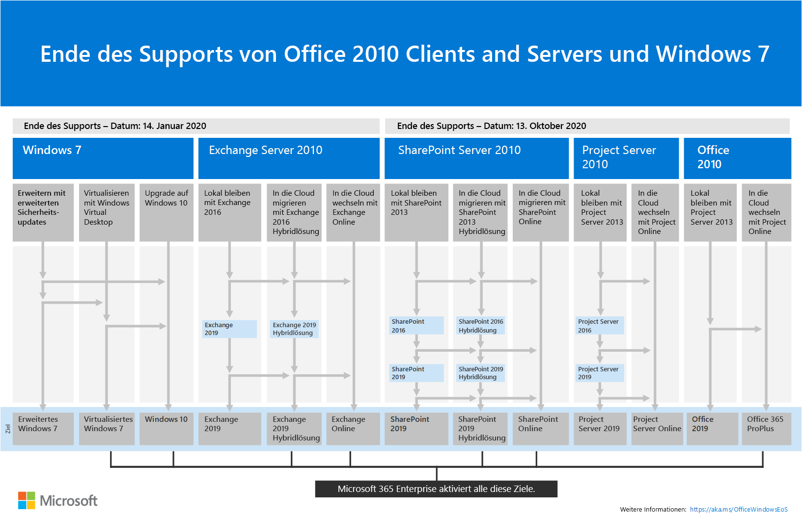

# Ende des Supports für Exchange 2010 – Roadmap

Am **14. Januar 2020** ist das Ende des Lebenszyklus von Exchange Server 2010 erreicht. Wenn Sie noch nicht mit der Migration von Exchange 2010 zu Office 365 oder Exchange 2016 begonnen haben, ist es jetzt an der Zeit mit der Planung zu beginnen.

## Was bedeutet das Ende des Supports?

Exchange Server weist wie fast alle Microsoft-Produkte einen Supportlebenszyklus auf, in dessen Verlauf neue Features, Programmfehlerbehebungen, Sicherheitsupdates usw. bereitgestellt werden. In der Regel dauert dieser Lebenszyklus 10 Jahre ab dem Datum der Veröffentlichung der ersten Version des Produkts, und das Ende dieses Lebenszyklus wird auch als Ende des Supports für das Produkt bezeichnet.
Wenn am 14. Januar 2020 das Ende des Supports für Exchange 2010 erreicht wird, wird Folgendes nicht mehr von Microsoft bereitgestellt:

- Technischer Support bei Problemen, die auftreten können
- Fehlerkorrekturen für erkannte Probleme, die sich auf die Stabilität und Nutzbarkeit des Servers auswirken können
- Sicherheitsupdates für entdeckte Sicherheitslücken, durch die der Server Sicherheitsverletzungen ausgesetzt sein kann
- Zeitzonenupdates.

Die Installation von Exchange 2010 kann auch nach diesem Datum weiterhin ausgeführt werden. Aufgrund der oben aufgeführten Änderungen wird jedoch dringend empfohlen, sobald wie möglich von Exchange 2010 zu einer neueren Version zu migrieren.

Weitere Informationen zu den Office 2010-Serverprodukten, deren Support bald eingestellt wird, finden Sie unter [Unterstützende Ressourcen für das Upgrade von Office 2010-Servern und -Clients](https://docs.microsoft.com/de-DE/office365/enterprise/upgrade-from-office-2010-servers-and-products).

## Welche Optionen habe ich?

Da das Ende des Supports für Exchange 2010 bald erreicht ist, ist dies ein guter Zeitpunkt, um mehr über Ihre Optionen zu erfahren und einen Migrationsplan vorzubereiten. Was Sie tun können:

- Migrieren Sie vollständig zu Office 365. Migrieren Sie Postfächer mittels Übernahme-, minimaler oder vollständiger Hybridmigration, und entfernen Sie anschließend lokale Exchange-Server und Active Directory.
- Migrieren Sie Ihre Exchange 2010-Server zu Exchange 2016 auf Ihren lokalen Servern.

> [!IMPORTANT]
> Wenn Ihre Organisation Postfächer zu Office 365 migrieren möchte, jedoch beabsichtigt, DirSnc oder Azure AD Connect beizubehalten, um Benutzerkonten weiterhin lokal über Active Directory zu verwalten, müssen Sie mindestens einen lokalen Exchange-Server behalten. Nach dem Entfernen des letzten Exchange-Server können Sie in Exchange Online keine Änderungen an Exchange-Empfängern vornehmen. Der Grund dafür ist, dass die Autoritätsquelle in Ihrem lokalen Active Directory verbleibt und Änderungen dort vorgenommen werden müssen. Bei diesem Szenario haben Sie folgende Optionen:

- (**Empfohlen**) Wenn Sie bis zum 14. Januar 2020 Ihre Postfächer zu Office 365 migrieren und Ihre Server aktualisieren können, verwenden Sie Exchange 2010 zum Herstellen der Verbindung mit Office 365 und Migrieren von Postfächern. Migrieren Sie als nächstes Exchange 2010 zu Exchange 2016, und nehmen Sie alle restlichen Exchange 2010-Server außer Betrieb.
- Wenn Sie die Postfachmigration und die lokale Serveraktualisierung nicht bis zum 14. Januar 2020 durchführen können, aktualisieren Sie zuerst Ihre lokalen Exchange 2010-Server auf Exchange 2016, und verwenden Sie dann Exchange 2016 zum Herstellen der Verbindung mit Office 365 und Migrieren von Postfächern.

> [!NOTE]
> Es ist zwar etwas komplizierter, aber während der Migration Ihrer lokalen Exchange 2010-Server zu Exchange 2016 können Sie auch Postfächer zu Office 365 migrieren.

Hier sind drei Möglichkeiten, um das Ende des Supports für Exchange Server 2010 zu vermeiden.

Die einzelnen Optionen werden in den folgenden Abschnitten näher untersucht.

## Migrieren zu Office 365

Das Migrieren Ihrer E-Mails zu Office 365 ist die beste und einfachste Möglichkeit, um Ihre Bereitstellung von Exchange 2010 einzustellen. Mit einer Migration zu Office 365 können Sie direkt von alter Technologie zum aktuellen Stand der Technik übergehen, darunter zu den folgenden Features:

- Compliancefunktionen wie Aufbewahrungsrichtlinien, In-Situ- und Beweissicherungsverfahren, In-Situ-eDiscovery usw.;
- Microsoft Teams;
- Power BI;
- Posteingang mit Relevanz;
- Delve Analytics;

Office 365 erhält zudem neue Features und Funktionen zuerst, und Sie und Ihre Benutzer können diese normalerweise sofort nutzen. Zusätzlich zu neuen Features müssen Sie sich auch nicht um Folgendes sorgen:

- Erwerben und Warten von Hardware;
- Kosten für Klimatisierung für Ihre Server
- Beheben von Sicherheits-, Produkt- und Zeitzonenfehlern
- Verwalten von Speicher und Software zur Erfüllung von Complianceanforderungen;
- Ausführen von Upgrades auf eine neuere Version von Exchange. In Office 365 verfügen Sie immer über die neueste Version von Exchange.

### Wie sollte ich zu Office 365 migrieren?

In Abhängigkeit von Ihrer Organisation haben Sie gewisse Möglichkeiten, die Ihnen beim Wechsel zu Office 365 helfen. Bei der Auswahl einer Migrationsoption müssen Sie ein paar Dinge beachten, z. B. die Anzahl der zu übernehmenden Lizenzen oder Postfächer, wie lange die Migration dauern soll und ob während der Migration eine nahtlose Integration zwischen Ihrer lokalen Installation und Office 365 erforderlich ist. Diese Tabelle enthält Ihre Migrationsoptionen und die wichtigsten Faktoren, die bestimmen, welche Methode Sie verwenden werden.

| **Migrationsoption**     | **Organisationsgröße** | **Dauer**        |
|--------------------------|-----------------------|---------------------|
| Übernahmemigration        | Weniger als 150 Lizenzen  | Eine Woche oder weniger      |
| Minimale Hybridmigration | Weniger als 150 Lizenzen  | Ein paar Wochen oder weniger |
| Vollständige Hybridmigration    | Mehr als 150 Lizenzen   | Ein paar Wochen oder mehr |

In den folgenden Abschnitten erhalten Sie eine Übersicht über diese Methoden. Details zu den einzelnen Methoden finden Sie unter [Auswählen eines Migrationspfads](https://support.office.com/de-DE/article/Decide-on-a-migration-path-0d4f2396-9cef-43b8-9bd6-306d01df1e27).

### Übernahmemigration

Bei einer Übernahmemigration werden zu einem vorab ausgewählten Termin alle Postfächer, Verteilergruppen, Kontakte usw. zu Office 365 migriert. Wenn Sie damit fertig sind, fahren Sie Ihre lokalen Exchange-Server herunter und beginnen Sie mit der ausschließlichen Verwendung von Office 365.

Die Übernahmemigration eignet sich hervorragend für kleine Organisationen mit einer geringen Anzahl von Postfächern, die schnell zu Office 365 wechseln und sich nicht mit der Komplexität der anderen Methoden befassen möchten. Sie ist aber auch auf gewisse Weise eingeschränkt, da sie innerhalb einer Woche oder weniger abgeschlossen sein sollte, und weil die Benutzer ihre Outlook-Profile neu konfigurieren müssen. Bei der Übernahmemigration können zwar bis zu 2.000 Postfächer verarbeitet werden, es wird jedoch dringend empfohlen, mit dieser Methode maximal 150 Postfächer zu migrieren. Wenn Sie versuchen, mehr als 150 Postfächer zu migrieren, könnte die Zeit zur vollständigen Übertragung Ihrer Postfächer bis zum Stichtag knapp werden. Zudem könnten die Mitarbeiter des IT-Supports damit überfordert werden, sämtlichen Benutzern bei der erneuten Konfiguration von Outlook zu helfen.

Folgende Faktoren sollten Sie berücksichtigen, wenn Sie eine Übernahmemigration erwägen:

- Office 365 muss eine Verbindung mit Ihren Exchange 2010-Servern mithilfe von Outlook Anywhere über TCP-Port 443 herstellen;
- Alle lokalen Postfächer werden zu Office 365 verschoben;
- Sie benötigen ein lokales Administratorkonto, das Lesezugriff auf den Inhalt der Postfächer der Benutzer hat;
- Die von Exchange 2010 akzeptierten Domänen, die Sie in Office 365 verwenden möchten, müssen dem Dienst als überprüfte Domänen hinzugefügt werden;
- Zwischen dem Beginn der Migration und dem Beginn der Abschlussphase synchronisiert Office 365 in regelmäßigen Abständen die Office 365- und lokalen Postfächer. Auf diese Weise können Sie die Migration abschließen, ohne sich um E-Mails sorgen zu müssen, die in lokalen Postfächern zurückbleiben;
- Benutzer erhalten neue temporäre Kennwörter für ihre Office 365-Konten, die sie ändern müssen, wenn sie sich das erste Mal bei ihrem Postfach anmelden;
- Sie benötigen eine Office 365-Lizenz, die Exchange Online für jedes zu migrierende Benutzerpostfach umfasst;
- Benutzer müssen auf jedem ihrer Geräte ein neues Outlook-Profil einrichten und ihre E-Mails erneut herunterladen. Die Anzahl der E-Mails, die von Outlook heruntergeladen werden, kann variieren. Weitere Informationen finden Sie unter [Ändern des E-Mail-Umfangs, der offline verfügbar sein soll](https://support.office.com/de-DE/article/Change-how-much-mail-to-keep-offline-f3a1251c-6dd5-4208-aef9-7c8c9522d633?ui=en-US&rs=en-US&ad=US&fromAR=1).

Weitere Informationen zur Übernahmemigration finden Sie unter:

- [Wichtige Informationen zur E-Mail-Übernahmemigration zu Office 365](https://support.office.com/de-DE/article/What-you-need-to-know-about-a-cutover-email-migration-to-Office-365-961978ef-f434-472d-a811-1801733869da).
- [Durchführen einer Übernahmemigration von E-Mails zu Office 365](https://support.office.com/de-DE/article/Perform-a-cutover-migration-of-email-to-Office-365-9496e93c-1e59-41a8-9bb3-6e8df0cd81b4).

### Minimale Hybridmigration

Bei einer minimalen Hybrid- bzw. Expressmigration werden einige hundert Postfächer zu Office 365 migriert. Die Migration kann innerhalb weniger Wochen abgeschlossen werden, und die Features der erweiterten Hybridmigration, wie z. B. die Frei/Gebucht-Kalenderinformationen, sind nicht erforderlich.

Die minimale Hybridmigration eignet sich hervorragend für Organisationen, die mehr Zeit zum Migrieren ihrer Postfächer zu Office 365 benötigen, aber dennoch planen, die Migration innerhalb von ein paar Wochen abzuschließen. Sie bringt einige Vorteile der fortgeschritteneren vollständigen Hybridmigration, jedoch ohne viele der Komplexitäten. Sie können steuern, wie viele und welche Postfächer zu einem bestimmten Zeitpunkt migriert werden sollen; es werden automatisch Office 365-Postfächer mit den Benutzernamen und Kennwörtern der lokalen Konten erstellt; anders als bei Übernahmemigrationen müssen Ihre Benutzer ihre Outlook-Profile nicht neu erstellen.

Folgende Faktoren sollten Sie berücksichtigen, wenn Sie eine minimale Hybridmigration erwägen:

- Sie müssen eine einmalige Verzeichnissynchronisierung zwischen Ihren lokalen Active Directory-Servern und Office 365 durchführen.
- Benutzer können sich bei ihrem Office 365-Postfach mit demselben Benutzernamen und Kennwort anmelden, das Sie verwendet haben, als das Postfach migriert wurde.
- Sie benötigen eine Office 365-Lizenz, die Exchange Online für jedes zu migrierende Benutzerpostfach umfasst.
- Benutzer müssen auf den meisten ihrer Geräte kein neues Outlook-Profil einrichten (einige ältere Android-Geräte benötigen möglicherweise ein neues Profil) und auch ihre E-Mails nicht erneut herunterladen.

Weitere Informationen über die minimale Hybridmigration erhalten Sie unter [Verwenden der minimalen Hybridmigration zum schnellen Migrieren von Exchange-Postfächern zu Office 365](https://support.office.com/article/Use-Minimal-Hybrid-to-quickly-migrate-Exchange-mailboxes-to-Office-365-fdecceed-0702-4af3-85be-f2a0013937ef).

### Vollständige Hybridmigration

Bei einer vollständigen Hybridmigration sind zwischen Hunderten oder Zehntausenden Postfächern vorhanden, von denen einige oder alle zu Office 365 verschoben werden müssen. Da diese Migrationen in der Regel langfristig angelegt sind, bieten Hybridmigrationen folgende Möglichkeiten:

- Anzeigen der Frei/Gebucht-Kalenderinformationen für lokale Benutzer in Office 365 und umgekehrt.
- Anzeigen einer einheitlichen globalen Adressliste, die sowohl lokale als auch Office 365-Empfänger enthält.
- Anzeigen vollständiger Outlook-Empfängerkarten für alle Benutzer, unabhängig davon, ob sie lokale oder Office 365-Benutzer sind.
- Schützen der E-Mail-Kommunikation zwischen lokalen Exchange-Servern und Office 365 mithilfe von TLS und Zertifikaten.
- Verarbeiten von Nachrichten, die zwischen lokalen Exchange-Servern und Office 365 als interne Nachrichten gesendet werden, wodurch sie die folgenden Möglichkeiten bieten:
- Ordnungsgemäße Auswertung und Verarbeitung durch Transport- und Compliance-Agents, die auf interne Nachrichten ausgerichtet sind.
- Umgehen von Antispamfiltern.

Vollständige Hybridmigrationen eignen sich am besten für Organisationen, die erwarten, für viele Monate oder mehr in einer Hybridkonfiguration zu verbleiben. Sie umfassen die weiter oben in diesem Abschnitt aufgeführten Features sowie die Verzeichnissynchronisierung, bessere integrierte Compliance-Features und die Möglichkeit, Postfächer mithilfe der Onlinepostfachverschiebung zu und von Office 365 zu verschieben. Office 365 wird zu einer Erweiterung Ihrer lokalen Organisation.

Folgende Faktoren sollten Sie berücksichtigen, wenn Sie eine vollständige Hybridmigration erwägen:

- Vollständige Hybridmigrationen sind nicht für alle Arten von Organisationen geeignet. Aufgrund der Komplexität von vollständigen Hybridmigrationen ergeben sich für Organisationen mit weniger als ein paar hundert Postfächern in der Regel kaum Vorteile, die den für die Einrichtung erforderlichen Aufwand und die Kosten rechtfertigen. Wenn dies Ihrer Organisation entspricht, wird dringend empfohlen, stattdessen eine Übernahme- oder minimale Hybridmigration in Betracht zu ziehen.
- Sie müssen die Verzeichnissynchronisierung mithilfe von AADConnect (Azure Active Directory Connect) zwischen Ihren lokalen Active Directory-Servern und Office 365 einrichten.
- Benutzer können sich bei ihrem Office 365-Postfach mit demselben Benutzernamen und Kennwort anmelden, mit dem sie sich auch beim lokalen Netzwerk anmelden (erfordert Azure Active Directory Connect mit Kennwortsynchronisierung und/oder Active Directory Federation Services).
- Sie benötigen eine Office 365-Lizenz, die Exchange Online für jedes zu migrierende Benutzerpostfach umfasst.
- Benutzer müssen auf den meisten ihrer Geräte kein neues Outlook-Profil einrichten (einige ältere Android-Geräte benötigen möglicherweise ein neues Profil) und auch ihre E-Mails nicht erneut herunterladen.

> [!IMPORTANT]
> Wenn Ihre Organisation Postfächer zu Office 365 migrieren möchte, jedoch beabsichtigt, DirSnc oder Azure AD Connect beizubehalten, um Benutzerkonten weiterhin lokal über Active Directory zu verwalten, müssen Sie mindestens einen lokalen Exchange-Server behalten. Nach dem Entfernen des letzten Exchange-Server können Sie in Exchange Online keine Änderungen an Exchange-Empfängern vornehmen. Der Grund dafür ist, dass die Autoritätsquelle in Ihrem lokalen Active Directory verbleibt und Änderungen dort vorgenommen werden müssen.

Wenn eine vollständige Hybridmigration Ihren Vorstellungen entspricht, finden Sie weitere Informationen in den folgenden Ressourcen, die Ihnen bei der Migration helfen:

- [Bereitstellungs-Assistent für Exchange](https://aka.ms/exdeploy)
- [Hybridbereitstellungen in Exchange Server](https://technet.microsoft.com/de-DE/library/jj200581%28v=exchg.150%29.aspx)
- [Assistent für die Hybridkonfiguration](https://technet.microsoft.com/de-DE/library/hh529921%28v=exchg.150%29.aspx)
- [FAQs zum Assistenten für die Hybridkonfiguration](https://technet.microsoft.com/de-DE/library/mt488940%28v=exchg.150%29.aspx)
- [Voraussetzungen für die Hybridbereitstellung](https://technet.microsoft.com/de-DE/library/hh534377%28v=exchg.150%29.aspx)

## Upgrade auf eine neuere Version von Exchange Server (lokal)

Zwar sind wir der festen Überzeugung, dass mit einer vollständigen Migration zu Office 365 ein optimales Preis-Leistungs-Verhältnis und beste Ergebnisse für die Benutzer erzielt werden, doch wissen wir auch, dass manche Organisationen einige Exchange-Server lokal beibehalten müssen. Der Grund hierfür können gesetzliche Vorschriften sein, um sicherzustellen, dass Daten z. B. nicht in einem Rechenzentrum in einem anderen Land gespeichert werden. Es kann aber auch sein, dass in Ihrer Organisation bestimmte Einstellungen oder Anforderungen gegeben sind, die in der Cloud nicht erfüllt werden können. Oder Sie benötigen Exchange für die Verwaltung von Cloud-Postfächern, weil Sie weiterhin lokal Active Directory verwenden. Welches auch der Grund ist, warum Sie Exchange lokal beibehalten möchten oder müssen: Stellen Sie sicher, dass Ihre Exchange 2010-Umgebung auf mindestens Exchange 2013 oder Exchange 2016 aktualisiert wird, und dass Exchange 2010 vor dem Datum der Einstellung des Supports entfernt wird.

Für eine optimale Benutzererfahrung empfiehlt es sich, die verbleibende lokale Umgebung auf Exchange 2016 zu aktualisieren. Exchange Server 2013 muss nicht installiert werden, wenn Sie direkt von Exchange Server 2010 zu Exchange Server 2016 wechseln möchten.

Exchange 2016 umfasst alle Features und Weiterentwicklungen, die in früheren Versionen von Exchange enthalten sind, und entspricht in Hinsicht auf die Benutzerfreundlichkeit am ehesten Office 365 (wenn auch einige Features nur in Office 365 verfügbar sind). Sehen Sie sich einige der Elemente an, die Ihnen bisher fehlten:

| **Exchange-Version**                     | **Features**                                                                                                                                                                                                                                         |
|------------------------------------------|------------------------------------------------------------------------------------------------------------------------------------------------------------------------------------------------------------------------------------------------------|
| Exchange 2013                            | Verringerung der Anzahl der Serverrollen auf drei (Postfach, Clientzugriff, Edge-Transport) durch eine vereinfachte Architektur                                                                                                                                        |
|                                          | Richtlinien zur Verhinderung von Datenverlust (Data Loss Prevention, DLP), die vor dem Verlust vertraulicher Informationen schützen                                                                                                                                                                |
|                                          | Erheblich verbesserte Benutzerfreundlichkeit für Outlook Web App                                                                                                                                                                                                    |
| Exchange 2016                            | *Features von Exchange 2013 und...*                                                                                                                                                                                                                   |
|                                          | Weiter vereinfachte Serverrollen für Postfach und Edge-Transport                                                                                                                                                                                   |
|                                          | Verbesserte Verhinderung von Datenverlust zusammen mit der Integration mit SharePoint                                                                                                                                                                                                  |
|                                          | Verbesserte Ausfallsicherheit für Datenbanken                                                                                                                                                                                                                         |
|                                          | Zusammenarbeit an Onlinedokumenten                                                                                                                                                                                                                        |

| **Überlegungen**                        | **Weitere Informationen**                                                                                                                                                                                                                                        |
|------------------------------------------|------------------------------------------------------------------------------------------------------------------------------------------------------------------------------------------------------------------------------------------------------|
| Ende des Supports – Daten                     | Wie bei Exchange 2010 gibt es für jede Version von Exchange ein eigenes Datum für das Ende des Supports:                                                                                                                                                                        |
|                                          | **Exchange 2013**: April 2023                                                                                                                                                                                                                       |
|                                          | **Exchange 2016**: Oktober 2025                                                                                                                                                                                                                     |
|                                          | Je früher das Datum für das Ende des Supports eintritt, desto eher müssen Sie eine andere Migration durchführen. April 2023 ist wesentlich näher, als Sie denken!                                                                                                                 |
| Migrationspfad zu Exchange 2013 oder 2016  | Der Migrationspfad von Exchange 2010 zu einer neueren Version ist, unabhängig davon, ob Sie Exchange 2013 oder Exchange 2016 wählen, der Folgende:                                                                                                                              |
|                                          | Installieren von Exchange 2013 oder 2016 in Ihrer vorhandenen Exchange 2010-Organisation; Verschieben von Diensten und anderen Infrastrukturen zu Exchange 2013 oder 2016; Verschieben von Postfächern und öffentlichen Ordnern zu Exchange 2013 oder 2016; Außerbetriebnahme der verbleibenden Exchange 2010-Server.  |
| Koexistenz der Versionen                      | Wenn Sie zu Exchange 2013 oder Exchange 2016 migrieren, können Sie jede der beiden Versionen in einer vorhandenen Exchange 2010-Organisation installieren. Dadurch können Sie einen oder mehrere Exchange 2013- oder Exchange 2016-Server installieren, um dann die Migration auszuführen.             |
| Serverhardware                          | Die Hardwareanforderungen an die Server haben sich seit Exchange 2010 geändert. Sie müssen sicherstellen, dass die zu verwendende Hardware kompatibel ist. Weitere Informationen zu den Hardwareanforderungen der einzelnen Versionen finden Sie hier:                                      |
|                                          | [Exchange 2016 – Systemanforderungen](https://technet.microsoft.com/de-DE/library/aa996719%28v=exchg.160%29.aspx)                                                                                                                                      |
|                                          | [Exchange 2013 – Systemanforderungen](https://technet.microsoft.com/de-DE/library/aa996719%28v=exchg.150%29.aspx)                                                                                                                                      |
|                                          | Sie werden feststellen, dass Sie aufgrund der erheblich verbesserten Exchange-Leistung sowie der höheren Verarbeitungsleistung und Speicherkapazität neuerer Server wahrscheinlich weniger Server zur Unterstützung derselben Anzahl von Postfächern benötigen werden.                       |
| Betriebssystemversion                 | Die mindestens unterstützten Betriebssystemversionen der einzelnen Versionen sind:                                                                                                                                                                                |
|                                          | **Exchange 2016** – Windows Server 2012                                                                                                                                                                                                                |
|                                          | **Exchange 2013** – Windows Server 2008 R2 SP1                                                                                                                                                                                                         |
|                                          | Weitere Informationen zu den unterstützten Betriebssystemen finden Sie unter [Exchange-Unterstützungsmatrix](https://technet.microsoft.com/de-DE/library/ff728623%28v=exchg.150%29.aspx).                                                                        |
| Funktionale Ebene der Active Directory-Gesamtstruktur | Die mindestens unterstützten funktionalen Ebenen der Active Directory-Gesamtstruktur der einzelnen Versionen sind:                                                                                                                                                                |
|                                          | **Exchange 2016** – Windows Server 2008 R2 SP1                                                                                                                                                                                                         |
|                                          | **Exchange 2013** – Windows Server 2003                                                                                                                                                                                                                |
|                                          | Weitere Informationen zu den unterstützten funktionalen Ebenen der Gesamtstruktur finden Sie unter [Exchange-Unterstützungsmatrix](https://technet.microsoft.com/de-DE/library/ff728623%28v=exchg.150%29.aspx).                                                                 |
| Office-Clientversionen                   | Die mindestens unterstützten Office-Clientversionen der einzelnen Versionen sind:                                                                                                                                                                                   |
|                                          | **Exchange 2016** – Office 2010 (mit den neuesten Updates)                                                                                                                                                                                              |
|                                          | **Exchange 2013** – Office 2007 SP3                                                                                                                                                                                                                    |
|                                          | Weitere Informationen zu den unterstützten Office-Clientversionen finden Sie unter [Exchange-Unterstützungsmatrix](https://technet.microsoft.com/de-DE/library/ff728623%28v=exchg.150%29.aspx).                                                                           |

Sie können zur Unterstützung bei der Migration die folgenden Quellen verwenden:

- [Bereitstellungs-Assistent für Exchange](https://aka.ms/exdeploy)
- Active Directory-Schemaänderungen für Exchange [2016](https://technet.microsoft.com/de-DE/library/bb738144%28v=exchg.160%29.aspx), [2013](https://technet.microsoft.com/de-DE/library/bb738144%28v=exchg.150%29.aspx)
- Systemanforderungen für Exchange [2016](https://technet.microsoft.com/de-DE/library/aa996719%28v=exchg.160%29.aspx), [2013](https://technet.microsoft.com/de-DE/library/aa996719%28v=exchg.150%29.aspx)
- Voraussetzungen für Exchange [2016](https://technet.microsoft.com/de-DE/library/bb691354%28v=exchg.160%29.aspx), [2013](https://technet.microsoft.com/de-DE/library/bb691354%28v=exchg.150%29.aspx)

## Zusammenfassung der Optionen für Office 2010-Client und -Server sowie für Windows 7

Eine visuelle Zusammenfassung der Optionen für Upgrades, Migration und die Cloud für Office 2010-Clients und -Server sowie für Windows 7 finden Sie auf dem [Poster zum Ende des Supports](./media/upgrade-from-office-2010-servers-and-products/Office2010Windows7EndOfSupport.pdf).

Dieses einseitige Poster veranschaulicht auf einfache Weise, welche verschiedenen Pfade Sie wählen können, um zu verhindern, dass Office 2010-Clients und -Serverprodukte sowie Windows 7 das Ende des Supports erreichen. Bevorzugte Pfade und unterstützte Optionen in Microsoft 365 Enterprise sind hervorgehoben.

Sie können dieses Poster in den Formaten „Brief“, „Legal“ oder „Tabloid“ (27,94 x 43,18 cm) [herunterladen](https://github.com/MicrosoftDocs/microsoft-365-docs/raw/public/microsoft-365/enterprise/media/migration-microsoft-365-enterprise-workload/Office2010Windows7EndOfSupport.pdf) und ausdrucken.
      
## Was kann ich tun, wenn ich Hilfe benötige?

Wenn Sie zu Office 365 migrieren, sind Sie möglicherweise berechtigt, den Microsoft FastTrack-Dienst zu nutzen. FastTrack bietet bewährte Methoden, Tools und Ressourcen, um Ihre Migration zu Office 365 so reibungslos wie möglich zu gestalten. Am allerbesten ist aber, dass Ihnen ein Supportmitarbeiter zur Seite steht, der Sie schrittweise durch die Migration führen wird – von der Planung und dem Entwurf bis zur Migration des letzten Postfachs. Weitere Informationen zu FastTrack finden Sie unter [Microsoft FastTrack](https://fasttrack.microsoft.com/).

Wenn während der Migration zu Office 365 Probleme auftreten und Sie FastTrack nicht verwenden, oder Sie zu einer neueren Version von Exchange Server migrieren, helfen wir Ihnen gerne bei der Behebung der Probleme. Hier einige Ressourcen, die Sie verwenden können:

- [Technische Community](https://social.technet.microsoft.com/Forums/office/en-US/home?category=exchangeserver)
- [Kundensupport](https://support.microsoft.com/de-DE/gp/support-options-for-business)

## Verwandte Themen

[Unterstützende Ressourcen für das Upgrade von Office 2010-Servern und -Clients](https://docs.microsoft.com/de-DE/office365/enterprise/upgrade-from-office-2010-servers-and-products)

[Office Retirement Group (Microsoft Tech Community)](https://go.microsoft.com/fwlink/?linkid=842065)
