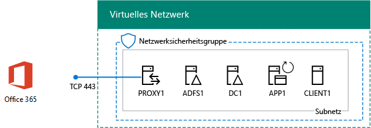
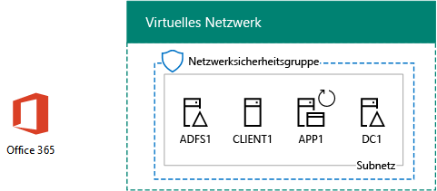

# <a name="federated-identity-for-your-office-365-devtest-environment"></a><span data-ttu-id="72e7f-103">Verbundidentität für Ihre Office 365-Entwicklungs-/Testumgebung</span><span class="sxs-lookup"><span data-stu-id="72e7f-103">Federated identity for your Office 365 dev/test environment</span></span>

 <span data-ttu-id="72e7f-104">**Zusammenfassung:** Konfigurieren Sie Verbundauthentifizierung für Ihre Office 365 Dev/Test-Umgebung.</span><span class="sxs-lookup"><span data-stu-id="72e7f-104">**Summary:** Configure federated authentication for your Office 365 dev/test environment.</span></span>
  
<span data-ttu-id="72e7f-p101">Office 365 unterstützt Identitätsverbund. Dies bedeutet, dass nicht durch die Überprüfung von Anmeldeinformationen selbst, Office 365 verbindenden Benutzers auf einem Server Verbundauthentifizierung verweist, die Office 365 vertraut. Wenn die Anmeldeinformationen des Benutzers korrekt sind, sendet der Verbundauthentifizierung-Server ein Sicherheitstoken, die der Client dann an Office 365 als Authentifizierungsbeweis sendet. Identitätsverbund ermöglicht die Verschiebung und Skalieren der Authentifizierung für ein Office 365-Abonnement und erweiterte Szenarien für Authentifizierung und Sicherheit.</span><span class="sxs-lookup"><span data-stu-id="72e7f-p101">Office 365 supports federated identity. This means that instead of performing the validation of credentials itself, Office 365 refers the connecting user to a federated authentication server that Office 365 trusts. If the user's credentials are correct, the federated authentication server issues a security token that the client then sends to Office 365 as proof of authentication. Federated identity allows for the offloading and scaling up of authentication for an Office 365 subscription and advanced authentication and security scenarios.</span></span>
  
<span data-ttu-id="72e7f-109">In diesem Artikel wird beschrieben, wie Sie die Verbundauthentifizierung für die Office 365-Entwicklungs-/Testumgebung konfigurieren können, die zu Folgendem führt:</span><span class="sxs-lookup"><span data-stu-id="72e7f-109">This article describes how you can configure federated authentication for the Office 365 dev/test environment, resulting in the following:</span></span>
  
<span data-ttu-id="72e7f-110">**Abbildung 1: Die Verbundauthentifizierung für Office 365 Dev/Test-Umgebung**</span><span class="sxs-lookup"><span data-stu-id="72e7f-110">**Figure 1: The federated authentication for Office 365 dev/test environment**</span></span>


  
<span data-ttu-id="72e7f-112">Die in Abbildung 1 gezeigte Konfiguration besteht aus: </span><span class="sxs-lookup"><span data-stu-id="72e7f-112">The configuration shown in Figure 1 consists of:</span></span> 
  
- <span data-ttu-id="72e7f-113">Einem Office 365 E5-Testabonnement, das 30 Tage nach Erstellung abläuft.</span><span class="sxs-lookup"><span data-stu-id="72e7f-113">An Office 365 E5 Trial Subscription, which expires 30 days from when you create it.</span></span>
    
- <span data-ttu-id="72e7f-p102">Einem vereinfachten Unternehmensintranet, das mit dem Internet verbunden ist, bestehend aus fünf virtuellen Computern in einem Subnetz eines virtuellen Azure-Netzwerks (DC1, APP1, CLIENT1, ADFS1 und PROXY1). Azure AD Connect wird auf APP1 ausgeführt, um die Liste von Konten in der Windows Server AD-Domäne mit Office 365 zu synchronisieren. PROXY1 erhält die eingehenden Authentifizierungsanfragen. ADFS1 überprüft Anmeldeinformationen mit DC1 und gibt Sicherheitstoken aus.</span><span class="sxs-lookup"><span data-stu-id="72e7f-p102">A simplified organization intranet connected to the Internet, consisting of five virtual machines on a subnet of an Azure virtual network (DC1, APP1, CLIENT1, ADFS1, and PROXY1). Azure AD Connect runs on APP1 to synchronize the list of accounts in the Windows Server AD domain to Office 365. PROXY1 receives the incoming authentication requests. ADFS1 validates credentials with DC1 and issues security tokens.</span></span>
    
<span data-ttu-id="72e7f-118">Das Einrichten dieser Entwicklungs-/Testumgebung besteht aus fünf Phasen:</span><span class="sxs-lookup"><span data-stu-id="72e7f-118">There are five phases to setting up this dev/test environment:</span></span>
  
1. <span data-ttu-id="72e7f-119">Erstellen der simulierten Office 365-Entwicklungs-/Testumgebung mit DirSync.</span><span class="sxs-lookup"><span data-stu-id="72e7f-119">Create the simulated enterprise Office 365 dev/test environment with DirSync.</span></span>
    
2. <span data-ttu-id="72e7f-120">Erstellen des AD FS-Servers (ADFS1).</span><span class="sxs-lookup"><span data-stu-id="72e7f-120">Create the AD FS server (ADFS1).</span></span>
    
3. <span data-ttu-id="72e7f-121">Erstellen des Webproxyservers (PROXY1).</span><span class="sxs-lookup"><span data-stu-id="72e7f-121">Create the web proxy server (PROXY1).</span></span>
    
4. <span data-ttu-id="72e7f-122">Erstellen eines selbstsignierten Zertifikats und Konfigurieren von ADFS1 und PROXY1.</span><span class="sxs-lookup"><span data-stu-id="72e7f-122">Create a self-signed certificate and configure ADFS1 and PROXY1.</span></span>
    
5. <span data-ttu-id="72e7f-123">Konfigurieren von Office 365 für Verbundidentität.</span><span class="sxs-lookup"><span data-stu-id="72e7f-123">Configure Office 365 for federated identity.</span></span>
    
<span data-ttu-id="72e7f-124">Um eine Bereitstellung in der Produktion über die Verbundauthentifizierung für Office 365 in Azure schrittweise, finden Sie unter [Deploy hohe Verfügbarkeit Verbundauthentifizierung für Office 365 in Azure](deploy-high-availability-federated-authentication-for-office-365-in-azure.md).</span><span class="sxs-lookup"><span data-stu-id="72e7f-124">To step through a production deployment of federated authentication for Office 365 in Azure, see [Deploy high availability federated authentication for Office 365 in Azure](deploy-high-availability-federated-authentication-for-office-365-in-azure.md).</span></span>
  
> [!NOTE]
> <span data-ttu-id="72e7f-125">Sie können diese Entwicklungs-/Testumgebung nicht mit einem Azure-Testabonnement konfigurieren.</span><span class="sxs-lookup"><span data-stu-id="72e7f-125">You cannot configure this dev/test environment with an Azure Trial subscription.</span></span> 
  
> [!TIP]
> <span data-ttu-id="72e7f-126">Klicken Sie [hier](http://aka.ms/catlgstack), um eine visuelle Darstellung aller Artikel im Stapel der Testumgebungsanleitungen in der Microsoft Cloud zu erhalten.</span><span class="sxs-lookup"><span data-stu-id="72e7f-126">Click [here](http://aka.ms/catlgstack) for a visual map to all the articles in the One Microsoft Cloud Test Lab Guide stack.</span></span>
  
## <a name="phase-1-create-the-simulated-enterprise-office-365-devtest-environment-with-dirsync"></a><span data-ttu-id="72e7f-127">Phase 1: Erstellen der simulierten Office 365-Entwicklungs-/Testumgebung mit DirSync</span><span class="sxs-lookup"><span data-stu-id="72e7f-127">Phase 1: Create the simulated enterprise Office 365 dev/test environment with DirSync</span></span>

<span data-ttu-id="72e7f-128">Befolgen Sie die Anweisungen in [DirSync für Ihre Office 365 Dev/Test-Umgebung](dirsync-for-your-office-365-dev-test-environment.md) zum Erstellen der simulierten Enterprise Office 365-Test-/-Umgebung mit APP1 als Dirsync-Server und synchronisierte Identität zwischen Office 365 und Windows Azure AD Konten auf DC1.</span><span class="sxs-lookup"><span data-stu-id="72e7f-128">Follow the instructions in [DirSync for your Office 365 dev/test environment](dirsync-for-your-office-365-dev-test-environment.md) to create the simulated enterprise Office 365 dev/test environment with APP1 as the DirSync server and synchronized identity between Office 365 and the Windows Server AD accounts on DC1.</span></span>
  
<span data-ttu-id="72e7f-p103">Im nächsten Schritt erstellen Sie einen neuen öffentlichen DNS-Domänennamen basierend auf Ihren aktuellen Domänennamen und Ihrem Office 365-Abonnement hinzugefügt. Es wird empfohlen, mit dem Namen **Testlabor.** \<Ihrer öffentlichen Domäne >. Wenn der öffentlichen Domäne "contoso.com" lautet, fügen Sie beispielsweise der öffentlichen Domäne Name testlab.contoso.com.</span><span class="sxs-lookup"><span data-stu-id="72e7f-p103">Next, create a new public DNS domain name based on your current domain name and add it to your Office 365 subscription. We recommend using the name **testlab.**\<your public domain>. For example, if your public domain name is contoso.com, add the public domain name testlab.contoso.com.</span></span>
  
<span data-ttu-id="72e7f-132">Anweisungen zum Erstellen der richtigen DNS-Einträge im DNS-Anbieter und die Domäne hinzufügen, um Ihre Testversion Office 365-Abonnements finden Sie unter [Hinzufügen von Benutzern und Domäne zu Office 365](https://support.office.com/article/Add-users-and-domain-to-Office-365-6383f56d-3d09-4dcb-9b41-b5f5a5efd611).</span><span class="sxs-lookup"><span data-stu-id="72e7f-132">For instructions on how to create the correct DNS records in your DNS provider and add the domain to your Office 365 trial subscription, see [Add users and domain to Office 365](https://support.office.com/article/Add-users-and-domain-to-Office-365-6383f56d-3d09-4dcb-9b41-b5f5a5efd611).</span></span> 
  
<span data-ttu-id="72e7f-133">Nachfolgend sehen Sie die daraus resultierende Konfiguration.</span><span class="sxs-lookup"><span data-stu-id="72e7f-133">Here is your resulting configuration.</span></span>
  
<span data-ttu-id="72e7f-134">**Abbildung 2: DirSync für Office 365 Dev/Test-Umgebung**</span><span class="sxs-lookup"><span data-stu-id="72e7f-134">**Figure 2: DirSync for Office 365 dev/test environment**</span></span>


  
<span data-ttu-id="72e7f-136">In Abbildung 2 ist die DirSync für die Office 365-Entwicklungs-/Testumgebung dargestellt, die Office 365 sowie die virtuellen Computer CLIENT1, APP1 und DC1 in einem virtuellen Azure-Netzwerk umfasst.</span><span class="sxs-lookup"><span data-stu-id="72e7f-136">Figure 2 shows the DirSync for Office 365 dev/test environment, which includes Office 365 and CLIENT1, APP1, and DC1 virtual machines in an Azure virtual network.</span></span>
  
## <a name="phase-2-create-the-ad-fs-server"></a><span data-ttu-id="72e7f-137">Phase 2: Erstellen des AD FS-Servers</span><span class="sxs-lookup"><span data-stu-id="72e7f-137">Phase 2: Create the AD FS server</span></span>

<span data-ttu-id="72e7f-138">Ein AD FS-Server bietet Verbundauthentifizierung zwischen Office 365 und den Konten in der Domäne „corp.contoso.com“, die auf DC1 gehostet wird.</span><span class="sxs-lookup"><span data-stu-id="72e7f-138">An AD FS server provides federated authentication between Office 365 and the accounts in the corp.contoso.com domain hosted on DC1.</span></span>
  
<span data-ttu-id="72e7f-139">Klicken Sie zum Erstellen eines Azure-virtueller Computers für ADFS1 Geben Sie den Namen Ihres Abonnements und die Ressourcengruppe und Azure Speicherort für Ihre Konfiguration Base, und führen Sie diese Befehle an der Befehlszeile Azure PowerShell auf dem lokalen Computer.</span><span class="sxs-lookup"><span data-stu-id="72e7f-139">To create an Azure virtual machine for ADFS1, fill in the name of your subscription and the resource group and Azure location for your Base Configuration, and then run these commands at the Azure PowerShell command prompt on your local computer.</span></span>
  
```
$subscr="<your Azure subscription name>"
$rgName="<the resource group name of your Base Configuration>"
Login-AzureRMAccount
Get-AzureRmSubscription -SubscriptionName $subscr | Select-AzureRmSubscription
$staticIP="10.0.0.100"
$locName=(Get-AzureRmResourceGroup -Name $rgName).Location
$vnet=Get-AzureRMVirtualNetwork -Name TestLab -ResourceGroupName $rgName
$pip = New-AzureRMPublicIpAddress -Name ADFS1-PIP -ResourceGroupName $rgName -Location $locName -AllocationMethod Dynamic
$nic = New-AzureRMNetworkInterface -Name ADFS1-NIC -ResourceGroupName $rgName -Location $locName -SubnetId $vnet.Subnets[0].Id -PublicIpAddressId $pip.Id -PrivateIpAddress $staticIP
$vm=New-AzureRMVMConfig -VMName ADFS1 -VMSize Standard_D2_v2
$cred=Get-Credential -Message "Type the name and password of the local administrator account for ADFS1."
$vm=Set-AzureRMVMOperatingSystem -VM $vm -Windows -ComputerName ADFS1 -Credential $cred -ProvisionVMAgent -EnableAutoUpdate
$vm=Set-AzureRMVMSourceImage -VM $vm -PublisherName MicrosoftWindowsServer -Offer WindowsServer -Skus 2016-Datacenter -Version "latest"
$vm=Add-AzureRMVMNetworkInterface -VM $vm -Id $nic.Id
$vm=Set-AzureRmVMOSDisk -VM $vm -Name "ADFS-OS" -DiskSizeInGB 128 -CreateOption FromImage -StorageAccountType "StandardLRS"
New-AzureRMVM -ResourceGroupName $rgName -Location $locName -VM $vm
```

> [!TIP]
> <span data-ttu-id="72e7f-140">Klicken Sie auf [hier](https://gallery.technet.microsoft.com/PowerShell-commands-for-f79bc2c2?redir=0) eine Textdatei ab, die PowerShell-Befehle in diesem Artikel enthält.</span><span class="sxs-lookup"><span data-stu-id="72e7f-140">Click [here](https://gallery.technet.microsoft.com/PowerShell-commands-for-f79bc2c2?redir=0) to get a text file that contains all the PowerShell commands in this article.</span></span>
  
<span data-ttu-id="72e7f-141">Im nächsten Schritt mit der [Azure-Portal](http://portal.azure.com) ADFS1 virtuellen Computer mit dem ADFS1 lokaler Administrator Kontoname und Kennwort hergestellt werden soll, und öffnen Sie eine Windows PowerShell-Eingabeaufforderung.</span><span class="sxs-lookup"><span data-stu-id="72e7f-141">Next, use the [Azure portal](http://portal.azure.com) to connect to the ADFS1 virtual machine using the ADFS1 local administrator account name and password, and then open a Windows PowerShell command prompt.</span></span>
  
<span data-ttu-id="72e7f-142">Zum Überprüfen der Namen Auflösung und Netzwerk-Kommunikation zwischen ADFS1 und DC1 führen Sie den Befehl **Ping dc1.corp.contoso.com** , und stellen Sie sicher, dass es vier Antworten gibt.</span><span class="sxs-lookup"><span data-stu-id="72e7f-142">To check name resolution and network communication between ADFS1 and DC1, run the **ping dc1.corp.contoso.com** command and verify that there are four replies.</span></span>
  
<span data-ttu-id="72e7f-143">Verknüpfen Sie als Nächstes unter Verwendung der folgenden Befehle an der Windows PowerShell-Eingabeaufforderung auf ADFS1 den virtuellen Computer ADFS1 mit der Domäne CORP.</span><span class="sxs-lookup"><span data-stu-id="72e7f-143">Next, join the ADFS1 virtual machine to the CORP domain with these commands at the Windows PowerShell prompt on ADFS1.</span></span>
  
```
$cred=Get-Credential -UserName "CORP\\User1" -Message "Type the User1 account password."
Add-Computer -DomainName corp.contoso.com -Credential $cred
Restart-Computer
```

<span data-ttu-id="72e7f-144">Nachfolgend sehen Sie die daraus resultierende Konfiguration.</span><span class="sxs-lookup"><span data-stu-id="72e7f-144">Here is your resulting configuration.</span></span>
  
<span data-ttu-id="72e7f-145">**Abbildung 3: Hinzufügen von AD FS-server**</span><span class="sxs-lookup"><span data-stu-id="72e7f-145">**Figure 3: Adding the AD FS server**</span></span>


  
<span data-ttu-id="72e7f-147">Abbildung 3 zeigt das Hinzufügen des ADFS1-Servers zu DirSync für die Office 365-Entwicklungs-/Testumgebung.</span><span class="sxs-lookup"><span data-stu-id="72e7f-147">Figure 3 shows the addition of the ADFS1 server to the DirSync for Office 365 dev/test environment.</span></span>
  
## <a name="phase-3-create-the-web-proxy-server"></a><span data-ttu-id="72e7f-148">Phase 3: Erstellen des Webproxyservers</span><span class="sxs-lookup"><span data-stu-id="72e7f-148">Phase 3: Create the web proxy server</span></span>

<span data-ttu-id="72e7f-149">PROXY1 stellt die Proxyfunktion für Authentifizierungsnachrichten zwischen Benutzern, die versuchen, sich zu authentifizieren, und ADFS1 bereit.</span><span class="sxs-lookup"><span data-stu-id="72e7f-149">PROXY1 provides proxying of authentication messages between users attempting to authenticate and ADFS1.</span></span>
  
<span data-ttu-id="72e7f-150">Um einen virtuellen Azure-Computer für PROXY1 zu erstellen, geben Sie den Namen Ihrer Ressourcengruppe und den Azure-Speicherort ein und führen diese Befehle in der Azure PowerShell-Befehlszeile auf Ihrem lokalen Computer aus.</span><span class="sxs-lookup"><span data-stu-id="72e7f-150">To create an Azure virtual machine for PROXY1, fill in the name of your resource group and Azure location, and then run these commands at the Azure PowerShell command prompt on your local computer.</span></span>
  
```
$rgName="<the resource group name of your Base Configuration>"
$staticIP="10.0.0.101"
$locName=(Get-AzureRmResourceGroup -Name $rgName).Location
$vnet=Get-AzureRMVirtualNetwork -Name TestLab -ResourceGroupName $rgName
$pip = New-AzureRMPublicIpAddress -Name PROXY1-PIP -ResourceGroupName $rgName -Location $locName -AllocationMethod Static
$nic = New-AzureRMNetworkInterface -Name PROXY1-NIC -ResourceGroupName $rgName -Location $locName -SubnetId $vnet.Subnets[0].Id -PublicIpAddressId $pip.Id -PrivateIpAddress $staticIP
$vm=New-AzureRMVMConfig -VMName PROXY1 -VMSize Standard_D2_v2
$cred=Get-Credential -Message "Type the name and password of the local administrator account for PROXY1."
$vm=Set-AzureRMVMOperatingSystem -VM $vm -Windows -ComputerName PROXY1 -Credential $cred -ProvisionVMAgent -EnableAutoUpdate
$vm=Set-AzureRMVMSourceImage -VM $vm -PublisherName MicrosoftWindowsServer -Offer WindowsServer -Skus 2016-Datacenter -Version "latest"
$vm=Add-AzureRMVMNetworkInterface -VM $vm -Id $nic.Id
$vm=Set-AzureRmVMOSDisk -VM $vm -Name "PROXY1-OS" -DiskSizeInGB 128 -CreateOption FromImage -StorageAccountType "StandardLRS"
New-AzureRMVM -ResourceGroupName $rgName -Location $locName -VM $vm
```

> [!NOTE]
> <span data-ttu-id="72e7f-151">PROXY1 wird einer statischen öffentlichen IP-Adresse zugewiesen, da Sie einen öffentlichen DNS-Eintrag erstellen, der darauf verweist, und der nicht geändert werden muss, wenn Sie den virtuellen PROXY1-Computer neu starten.</span><span class="sxs-lookup"><span data-stu-id="72e7f-151">PROXY1 is assigned a static public IP address because you will create a public DNS record that points to it and it must not change when you restart the PROXY1 virtual machine.</span></span> 
  
<span data-ttu-id="72e7f-p104">Fügen Sie eine Regel zur Netzwerksicherheitsgruppe des Subnetzes CorpNet um unaufgeforderten eingehenden Verkehr PROXY1s privaten IP-Adresse und TCP-Port 443 über das Internet zu ermöglichen. Führen Sie diese Befehle an der Azure PowerShell-Eingabeaufforderung auf dem lokalen Computer.</span><span class="sxs-lookup"><span data-stu-id="72e7f-p104">Next, add a rule to the network security group for the CorpNet subnet to allow unsolicited inbound traffic from the Internet to PROXY1's private IP address and TCP port 443. Run these commands at the Azure PowerShell command prompt on your local computer.</span></span>
  
```
$rgName="<the resource group name of your Base Configuration>"
Get-AzureRmNetworkSecurityGroup -Name CorpNet -ResourceGroupName $rgName | Add-AzureRmNetworkSecurityRuleConfig -Name "HTTPS-to-PROXY1" -Description "Allow TCP 443 to PROXY1" -Access "Allow" -Protocol "Tcp" -Direction "Inbound" -Priority 101 -SourceAddressPrefix "Internet" -SourcePortRange "*" -DestinationAddressPrefix "10.0.0.101" -DestinationPortRange "443" | Set-AzureRmNetworkSecurityGroup
```

<span data-ttu-id="72e7f-154">Im nächsten Schritt mit der [Azure-Portal](http://portal.azure.com) PROXY1 virtuellen Computer mit dem PROXY1 lokaler Administrator Kontoname und Kennwort hergestellt werden soll, und öffnen Sie eine Windows PowerShell-Eingabeaufforderung auf PROXY1.</span><span class="sxs-lookup"><span data-stu-id="72e7f-154">Next, use the [Azure portal](http://portal.azure.com) to connect to the PROXY1 virtual machine using the PROXY1 local administrator account name and password, and then open a Windows PowerShell command prompt on PROXY1.</span></span>
  
<span data-ttu-id="72e7f-155">Zum Überprüfen der Namen Auflösung und Netzwerk-Kommunikation zwischen PROXY1 und DC1 führen Sie den Befehl **Ping dc1.corp.contoso.com** , und stellen Sie sicher, dass es vier Antworten gibt.</span><span class="sxs-lookup"><span data-stu-id="72e7f-155">To check name resolution and network communication between PROXY1 and DC1, run the **ping dc1.corp.contoso.com** command and verify that there are four replies.</span></span>
  
<span data-ttu-id="72e7f-156">Verknüpfen Sie als Nächstes unter Verwendung der folgenden Befehle an der Windows PowerShell-Eingabeaufforderung auf PROXY1 den virtuellen Computer PROXY1 mit der Domäne CORP.</span><span class="sxs-lookup"><span data-stu-id="72e7f-156">Next, join the PROXY1 virtual machine to the CORP domain with these commands at the Windows PowerShell prompt on PROXY1.</span></span>
  
```
$cred=Get-Credential -UserName "CORP\\User1" -Message "Type the User1 account password."
Add-Computer -DomainName corp.contoso.com -Credential $cred
Restart-Computer
```

<span data-ttu-id="72e7f-157">Zeigen Sie die öffentliche IP-Adresse von PROXY1 mit den folgenden Azure PowerShell-Befehlen auf dem lokalen Computer an:</span><span class="sxs-lookup"><span data-stu-id="72e7f-157">Display the public IP address of PROXY1 with these Azure PowerShell commands on your local computer:</span></span>
  
```
Write-Host (Get-AzureRMPublicIpaddress -Name "PROXY1-PIP" -ResourceGroup $rgName).IPAddress
```

<span data-ttu-id="72e7f-p105">Im nächsten Schritt arbeiten mit Ihrem öffentlichen DNS-Anbieter und erstellen einen neuen öffentlichen DNS-A-Datensatz für **fs.testlab.** \<des DNS-Domänennamens >, aufgelöst wird, um die IP-Adresse mit dem Befehl **Write-Host** angezeigt. Die **fs.testlab.** \<des DNS-Domänennamens > ist nachstehend der *Verbunddienst FQDN* .</span><span class="sxs-lookup"><span data-stu-id="72e7f-p105">Next, work with your public DNS provider and create a new public DNS A record for **fs.testlab.**\<your DNS domain name> that resolves to the IP address displayed by the **Write-Host** command. The **fs.testlab.**\<your DNS domain name> is hereafter referred to as the  *federation service FQDN*  .</span></span>
  
<span data-ttu-id="72e7f-160">Im nächsten Schritt der [Azure-Portal](http://portal.azure.com) verwenden, um am virtuellen Computer DC1 mithilfe der CORP verbinden\\User1 Anmeldeinformationen, und führen Sie dann die folgenden Befehle an einer Administratorebene Windows PowerShell-Eingabeaufforderung:</span><span class="sxs-lookup"><span data-stu-id="72e7f-160">Next, use the [Azure portal](http://portal.azure.com) to connect to the DC1 virtual machine using the CORP\\User1 credentials, and then run the following commands at an administrator-level Windows PowerShell command prompt:</span></span>
  
```
$testZone="<the FQDN of your testlab domain from phase 1, example: testlab.contoso.com>"
$testZoneFile= $testZone + ".dns"
Add-DnsServerPrimaryZone -Name $testZone -ZoneFile $testZoneFile
Add-DnsServerResourceRecordA -Name "fs" -ZoneName $testZone -AllowUpdateAny -IPv4Address "10.0.0.100" -TimeToLive 01:00:00
```

<span data-ttu-id="72e7f-161">Diese Befehle erstellen einen DNS-A-Eintrag für den FQDN des Verbunddiensts, den virtuelle Computer im virtuellen Azure-Netzwerk in die private IP-Adresse von ADFS1 auflösen können.</span><span class="sxs-lookup"><span data-stu-id="72e7f-161">These commands create a DNS A record for your federation service FQDN that virtual machines on the Azure virtual network can resolve to ADFS1's private IP address.</span></span>
  
<span data-ttu-id="72e7f-162">Nachfolgend sehen Sie die daraus resultierende Konfiguration.</span><span class="sxs-lookup"><span data-stu-id="72e7f-162">Here is your resulting configuration.</span></span>
  
<span data-ttu-id="72e7f-163">**Abbildung 4: Hinzufügen der Web Application Proxy-server**</span><span class="sxs-lookup"><span data-stu-id="72e7f-163">**Figure 4: Adding the web application proxy server**</span></span>


  
<span data-ttu-id="72e7f-165">Abbildung 4 zeigt das Hinzufügen des PROXY1-Servers.</span><span class="sxs-lookup"><span data-stu-id="72e7f-165">Figure 4 shows the addition of the PROXY1 server.</span></span>
  
## <a name="phase-4-create-a-self-signed-certificate-and-configure-adfs1-and-proxy1"></a><span data-ttu-id="72e7f-166">Phase 4: Erstellen eines selbstsignierten Zertifikats und Konfigurieren von ADFS1 und PROXY1</span><span class="sxs-lookup"><span data-stu-id="72e7f-166">Phase 4: Create a self-signed certificate and configure ADFS1 and PROXY1</span></span>

<span data-ttu-id="72e7f-167">In dieser Phase erstellen Sie ein selbstsigniertes digitales Zertifikat für den FQDN des Verbunddiensts und konfigurieren ADFS1 und PROXY1 als AD FS-Farm.</span><span class="sxs-lookup"><span data-stu-id="72e7f-167">In this phase, you create a self-signed digital certificate for your federation service FQDN and configure ADFS1 and PROXY1 as an AD FS farm.</span></span>
  
<span data-ttu-id="72e7f-168">Zunächst, mit dem das [Azure Portal](http://portal.azure.com) -Verbindung mit dem virtuellen Computer DC1 mithilfe der CORP\\User1 Anmeldeinformationen, und öffnen Sie dann eine Administratorebene Windows PowerShell command Prompt.</span><span class="sxs-lookup"><span data-stu-id="72e7f-168">First, use the [Azure portal](http://portal.azure.com) to connect to the DC1 virtual machine using the CORP\\User1 credentials, and then open an administrator-level Windows PowerShell command prompt.</span></span>
  
<span data-ttu-id="72e7f-169">Im nächsten Schritt erstellen Sie das AD FS-Dienstkonto mit dem folgenden Befehl an der Windows PowerShell-Eingabeaufforderung auf DC1:</span><span class="sxs-lookup"><span data-stu-id="72e7f-169">Next, create AD FS service account with this command at the Windows PowerShell command prompt on DC1:</span></span>
  
```
New-ADUser -SamAccountName ADFS-Service -AccountPassword (read-host "Set user password" -assecurestring) -name "ADFS-Service" -enabled $true -PasswordNeverExpires $true -ChangePasswordAtLogon $false
```

<span data-ttu-id="72e7f-p106">Beachten Sie, dass Sie von dem Befehl aufgefordert werden, das Kontokennwort anzugeben. Verwenden Sie ein sicheres Kennwort, und notieren Sie es an einem sicheren Ort. Sie benötigen es für diese Phase und für Phase 5.</span><span class="sxs-lookup"><span data-stu-id="72e7f-p106">Note that this command prompts you to supply the account password. Choose a strong password and record it in a secured location. You will need it for this phase and Phase 5.</span></span>
  
<span data-ttu-id="72e7f-p107">Verwendung des [Azure Portal](http://portal.azure.com) Verbindung mit dem ADFS1 virtuellen Computer mithilfe der CORP\\User1 Anmeldeinformationen. Öffnen Sie eine Administratorebene Windows PowerShell-Eingabeaufforderung auf ADFS1, füllen Sie Ihre Verbunddienst FQDN, und führen Sie dann die folgenden Befehle aus, um ein selbstsigniertes Zertifikat erstellen aus:</span><span class="sxs-lookup"><span data-stu-id="72e7f-p107">Use the [Azure portal](http://portal.azure.com) to connect to the ADFS1 virtual machine using the CORP\\User1 credentials. Open an administrator-level Windows PowerShell command prompt on ADFS1, fill in your federation service FQDN, and then run these commands to create a self-signed certificate:</span></span>
  
```
$fedServiceFQDN="<federation service FQDN>"
New-SelfSignedCertificate -DnsName $fedServiceFQDN -CertStoreLocation "cert:\\LocalMachine\\My"
New-Item -path c:\\Certs -type directory
New-SmbShare -name Certs -path c:\\Certs -changeaccess CORP\\User1
```

<span data-ttu-id="72e7f-175">Gehen Sie dann folgendermaßen vor, um das neue selbstsignierte Zertifikat als Datei zu speichern.</span><span class="sxs-lookup"><span data-stu-id="72e7f-175">Next, use these steps to save the new self-signed certificate as a file.</span></span>
  
1. <span data-ttu-id="72e7f-176">Klicken Sie auf **Start**, geben Sie **mmc.exe**, und drücken Sie die **EINGABETASTE**.</span><span class="sxs-lookup"><span data-stu-id="72e7f-176">Click **Start**, type **mmc.exe**, and then press **Enter**.</span></span>
    
2. <span data-ttu-id="72e7f-177">Klicken Sie auf **Datei > Snap-In hinzufügen/entfernen**.</span><span class="sxs-lookup"><span data-stu-id="72e7f-177">Click **File > Add/Remove Snap-in**.</span></span>
    
3. <span data-ttu-id="72e7f-178">**Hinzufügen oder Entfernen von-Snap-ins**Doppelklicken Sie in der Liste der verfügbaren Snap-Ins auf **Zertifikate** , klicken Sie auf **Computerkonto**, und klicken Sie dann auf **Weiter**.</span><span class="sxs-lookup"><span data-stu-id="72e7f-178">In **Add or Remove Snap-ins**, double-click **Certificates** in the list of available snap-ins, click **Computer account**, and then click **Next**.</span></span>
    
4. <span data-ttu-id="72e7f-179">Klicken Sie im **Dialogfeld Computer auswählen**auf **Fertig stellen**, und klicken Sie dann auf **OK**.</span><span class="sxs-lookup"><span data-stu-id="72e7f-179">In **Select Computer**, click **Finish**, and then click **OK**.</span></span>
    
5. <span data-ttu-id="72e7f-180">Öffnen Sie im Strukturbereich **Zertifikate (lokaler Computer) > persönlich > Zertifikate**.</span><span class="sxs-lookup"><span data-stu-id="72e7f-180">In the tree pane, open **Certificates (Local Computer) > Personal > Certificates**.</span></span>
    
6. <span data-ttu-id="72e7f-181">Mit der rechten Maustaste in des Zertifikats mit Ihrem Verbunddienst FQDN, klicken Sie auf **Alle Tasks**, und klicken Sie dann auf **Exportieren**.</span><span class="sxs-lookup"><span data-stu-id="72e7f-181">Right-click the certificate with your federation service FQDN, click **All tasks**, and then click **Export**.</span></span>
    
7. <span data-ttu-id="72e7f-182">Klicken Sie auf der Seite **Willkommen** auf **Weiter**.</span><span class="sxs-lookup"><span data-stu-id="72e7f-182">On the **Welcome** page, click **Next**.</span></span>
    
8. <span data-ttu-id="72e7f-183">Klicken Sie auf der Seite **Privatschlüssel exportieren** klicken Sie auf **Ja**, und klicken Sie dann auf **Weiter**.</span><span class="sxs-lookup"><span data-stu-id="72e7f-183">On the **Export Private Key** page, click **Yes**, and then click **Next**.</span></span>
    
9. <span data-ttu-id="72e7f-184">Klicken Sie auf der Seite **Exportdateiformat** klicken Sie auf **alle erweiterten Eigenschaften exportieren**, und klicken Sie dann auf **Weiter**.</span><span class="sxs-lookup"><span data-stu-id="72e7f-184">On the **Export File Format** page, click **Export all extended properties**, and then click **Next**.</span></span>
    
10. <span data-ttu-id="72e7f-185">Klicken Sie auf der Seite **Sicherheit** , klicken Sie auf **Kennwort** , und geben Sie im Feld **Kennwort** ein Kennwort ein und **Kennwort bestätigen.**</span><span class="sxs-lookup"><span data-stu-id="72e7f-185">On the **Security** page, click **Password** and type a password in **Password** and **Confirm password.**</span></span>
    
11. <span data-ttu-id="72e7f-186">Klicken Sie auf der Seite **zu exportierende Datei** auf **Durchsuchen**.</span><span class="sxs-lookup"><span data-stu-id="72e7f-186">On the **File to Export** page, click **Browse**.</span></span>
    
12. <span data-ttu-id="72e7f-187">Navigieren Sie zu der **C:\\Zertifikate** Ordner, geben Sie **SSL** im Feld **Dateiname**ein, und klicken Sie dann auf **zu speichern.**</span><span class="sxs-lookup"><span data-stu-id="72e7f-187">Browse to the **C:\\Certs** folder, type **SSL** in **File name**, and then click **Save.**</span></span>
    
13. <span data-ttu-id="72e7f-188">Klicken Sie auf der Seite **zu exportierende Datei** auf **Weiter**.</span><span class="sxs-lookup"><span data-stu-id="72e7f-188">On the **File to Export** page, click **Next**.</span></span>
    
14. <span data-ttu-id="72e7f-p108">Klicken Sie auf der Seite **Fertigstellen des Zertifikatexport-Assistenten** auf **Fertig stellen**. Wenn Sie aufgefordert werden, klicken Sie auf **OK**.</span><span class="sxs-lookup"><span data-stu-id="72e7f-p108">On the **Completing the Certificate Export Wizard** page, click **Finish**. When prompted, click **OK**.</span></span>
    
<span data-ttu-id="72e7f-191">Im nächsten Schritt erstellen Sie den AD FS-Dienst mit dem folgenden Befehl an der Windows PowerShell-Eingabeaufforderung auf ADFS1:</span><span class="sxs-lookup"><span data-stu-id="72e7f-191">Next, install the AD FS service with this command at the Windows PowerShell command prompt on ADFS1:</span></span>
  
```
Install-WindowsFeature ADFS-Federation -IncludeManagementTools
```

<span data-ttu-id="72e7f-192">Warten Sie, bis die Installation abgeschlossen ist.</span><span class="sxs-lookup"><span data-stu-id="72e7f-192">Wait for the installation to complete.</span></span>
  
<span data-ttu-id="72e7f-193">Konfigurieren Sie als Nächstes den AD FS-Dienst mit den folgenden Schritten:</span><span class="sxs-lookup"><span data-stu-id="72e7f-193">Next, configure the AD FS service with these steps:</span></span>
  
1. <span data-ttu-id="72e7f-194">Klicken Sie auf **Start**, und klicken Sie dann auf das Symbol für **Server-Manager** .</span><span class="sxs-lookup"><span data-stu-id="72e7f-194">Click **Start**, and then click the **Server Manager** icon.</span></span>
    
2. <span data-ttu-id="72e7f-195">Klicken Sie im Strukturbereich von Server-Manager auf **AD FS**.</span><span class="sxs-lookup"><span data-stu-id="72e7f-195">In the tree pane of Server Manager, click **AD FS**.</span></span>
    
3. <span data-ttu-id="72e7f-196">Klicken Sie in der Symbolleiste oben auf das Symbol orange Vorsicht, und klicken Sie auf **der Verbunddienst auf diesem Server konfigurieren**.</span><span class="sxs-lookup"><span data-stu-id="72e7f-196">In the tool bar at the top, click the orange caution symbol, and then click **Configure the federation service on this server**.</span></span>
    
4. <span data-ttu-id="72e7f-197">Klicken Sie auf der Seite **Willkommen** des Active Directory Federation Services Konfigurations-Assistenten auf **Weiter**.</span><span class="sxs-lookup"><span data-stu-id="72e7f-197">On the **Welcome** page of the Active Directory Federation Services Configuration Wizard, click **Next**.</span></span>
    
5. <span data-ttu-id="72e7f-198">Klicken Sie auf der Seite **Verbindung mit AD DS** auf **Weiter**.</span><span class="sxs-lookup"><span data-stu-id="72e7f-198">On the **Connect to AD DS** page, click **Next**.</span></span>
    
6. <span data-ttu-id="72e7f-199">Auf der Seite **Diensteigenschaften angeben** :</span><span class="sxs-lookup"><span data-stu-id="72e7f-199">On the **Specify Service Properties** page:</span></span>
    
  - <span data-ttu-id="72e7f-200">Klicken Sie für **SSL-Zertifikat**auf den Pfeil nach unten, und klicken Sie dann auf das Zertifikat mit dem Namen von Ihrem Verbunddienst FQDN.</span><span class="sxs-lookup"><span data-stu-id="72e7f-200">For **SSL Certificate**, click the down arrow, and then click the certificate with the name of your federation service FQDN.</span></span>
    
  - <span data-ttu-id="72e7f-201">Geben Sie im Feld **Anzeigename für den Verbund Dienst**den Namen des fiktiven Unternehmens.</span><span class="sxs-lookup"><span data-stu-id="72e7f-201">In **Federation Service Display Name**, type the name of your fictional organization.</span></span>
    
  - <span data-ttu-id="72e7f-202">Klicken Sie auf **Weiter**.</span><span class="sxs-lookup"><span data-stu-id="72e7f-202">Click **Next**.</span></span>
    
7. <span data-ttu-id="72e7f-203">Klicken Sie auf der Seite **Dienstkonto angeben** für **Kontonamen**auf **auswählen** .</span><span class="sxs-lookup"><span data-stu-id="72e7f-203">On the **Specify Service Account** page, click **Select** for **Account name**.</span></span>
    
8. <span data-ttu-id="72e7f-204">**Wählen Sie Benutzer oder -Dienstkonto**Geben Sie ein **AD FS-Dienst**, klicken Sie auf **Namen überprüfen**und klicken Sie dann auf **OK**.</span><span class="sxs-lookup"><span data-stu-id="72e7f-204">In **Select User or Service Account**, type **ADFS-Service**, click **Check Names**, and then click **OK**.</span></span>
    
9. <span data-ttu-id="72e7f-205">Geben Sie im Feld **Kennwort**das Kennwort für das AD FS-Dienstkonto ein, und klicken Sie dann auf **Weiter**.</span><span class="sxs-lookup"><span data-stu-id="72e7f-205">In **Account Password**, type the password for the ADFS-Service account, and then click **Next**.</span></span>
    
10. <span data-ttu-id="72e7f-206">Klicken Sie auf der Seite **Konfigurationsdatenbank angeben** auf **Weiter**.</span><span class="sxs-lookup"><span data-stu-id="72e7f-206">On the **Specify Configuration Database** page, click **Next**.</span></span>
    
11. <span data-ttu-id="72e7f-207">Klicken Sie auf der Seite **Optionen überprüfen** auf **Weiter**.</span><span class="sxs-lookup"><span data-stu-id="72e7f-207">On the **Review Options** page, click **Next**.</span></span>
    
12. <span data-ttu-id="72e7f-208">Klicken Sie auf der Seite **Voraussetzung überprüft** auf **Konfigurieren**.</span><span class="sxs-lookup"><span data-stu-id="72e7f-208">On the **Pre-requisite Checks** page, click **Configure**.</span></span>
    
13. <span data-ttu-id="72e7f-209">Klicken Sie auf der Seite **Ergebnisse** auf **Schließen**.</span><span class="sxs-lookup"><span data-stu-id="72e7f-209">On the **Results** page, click **Close**.</span></span>
    
14. <span data-ttu-id="72e7f-210">Klicken Sie auf **Start**, klicken Sie auf das Symbol Power, klicken Sie auf **neu**, und klicken Sie dann auf **Weiter**.</span><span class="sxs-lookup"><span data-stu-id="72e7f-210">Click **Start**, click the power icon, click **Restart**, and then click **Continue**.</span></span>
    
<span data-ttu-id="72e7f-211">Über das [Portal Azure](http://portal.azure.com)Herstellen einer Verbindung mit der CORP PROXY1 mit\\User1 Kontoanmeldeinformationen.</span><span class="sxs-lookup"><span data-stu-id="72e7f-211">From the [Azure portal](http://portal.azure.com), connect to PROXY1 with the CORP\\User1 account credentials.</span></span>
  
<span data-ttu-id="72e7f-212">Gehen Sie dann folgendermaßen vor, um das selbstsignierte Zertifikat zu installieren und PROXY1 zu konfigurieren.</span><span class="sxs-lookup"><span data-stu-id="72e7f-212">Next, use these steps to install the self-signed certificate and configure PROXY1.</span></span>
  
1. <span data-ttu-id="72e7f-213">Klicken Sie auf **Start**, geben Sie **mmc.exe**, und drücken Sie die **EINGABETASTE**.</span><span class="sxs-lookup"><span data-stu-id="72e7f-213">Click **Start**, type **mmc.exe**, and then press **Enter**.</span></span>
    
2. <span data-ttu-id="72e7f-214">Klicken Sie auf **Datei > Snap-In hinzufügen/entfernen**.</span><span class="sxs-lookup"><span data-stu-id="72e7f-214">Click **File > Add/Remove Snap-in**.</span></span>
    
3. <span data-ttu-id="72e7f-215">**Hinzufügen oder Entfernen von-Snap-ins**Doppelklicken Sie in der Liste der verfügbaren Snap-Ins auf **Zertifikate** , klicken Sie auf **Computerkonto**, und klicken Sie dann auf **Weiter**.</span><span class="sxs-lookup"><span data-stu-id="72e7f-215">In **Add or Remove Snap-ins**, double-click **Certificates** in the list of available snap-ins, click **Computer account**, and then click **Next**.</span></span>
    
4. <span data-ttu-id="72e7f-216">Klicken Sie im **Dialogfeld Computer auswählen**auf **Fertig stellen**, und klicken Sie dann auf **OK**.</span><span class="sxs-lookup"><span data-stu-id="72e7f-216">In **Select Computer**, click **Finish**, and then click **OK**.</span></span>
    
5. <span data-ttu-id="72e7f-217">Öffnen Sie im Strukturbereich **Zertifikate (lokaler Computer) > persönlich > Zertifikate**.</span><span class="sxs-lookup"><span data-stu-id="72e7f-217">In the tree pane, open **Certificates (Local Computer) > Personal > Certificates**.</span></span>
    
6. <span data-ttu-id="72e7f-218">Mit der rechten Maustaste **Persönliche**, klicken Sie auf **Alle Tasks**, und klicken Sie dann auf **Importieren**.</span><span class="sxs-lookup"><span data-stu-id="72e7f-218">Right-click **Personal**, click **All tasks**, and then click **Import**.</span></span>
    
7. <span data-ttu-id="72e7f-219">Klicken Sie auf der Seite **Willkommen** auf **Weiter**.</span><span class="sxs-lookup"><span data-stu-id="72e7f-219">On the **Welcome** page, click **Next**.</span></span>
    
8. <span data-ttu-id="72e7f-220">Geben Sie auf der Seite **zu importierende Datei** ** \\ \\adfs1\\Zertifikate\\ssl.pfx**, und klicken Sie dann auf **Weiter**.</span><span class="sxs-lookup"><span data-stu-id="72e7f-220">On the **File to Import** page, type **\\\\adfs1\\certs\\ssl.pfx**, and then click **Next**.</span></span>
    
9. <span data-ttu-id="72e7f-221">Geben Sie auf der Seite **Schutz des privaten Schlüssels** das Kennwort des Zertifikats im Feld **Kennwort**, und klicken Sie dann auf **nächsten.**</span><span class="sxs-lookup"><span data-stu-id="72e7f-221">On the **Private key protection** page, type the certificate password in **Password**, and then click **Next.**</span></span>
    
10. <span data-ttu-id="72e7f-222">Klicken Sie auf der Seite **Zertifikatspeicher** auf **nächsten.**</span><span class="sxs-lookup"><span data-stu-id="72e7f-222">On the **Certificate store** page, click **Next.**</span></span>
    
11. <span data-ttu-id="72e7f-223">Klicken Sie auf der Seite **Fertigstellen des Assistenten** auf **Fertig stellen**.</span><span class="sxs-lookup"><span data-stu-id="72e7f-223">On the **Completing** page, click **Finish**.</span></span>
    
12. <span data-ttu-id="72e7f-224">Klicken Sie auf der Seite **Zertifikatspeicher** auf **Weiter**.</span><span class="sxs-lookup"><span data-stu-id="72e7f-224">On the **Certificate Store** page, click **Next**.</span></span>
    
13. <span data-ttu-id="72e7f-225">Wenn Sie aufgefordert werden, klicken Sie auf **OK**.</span><span class="sxs-lookup"><span data-stu-id="72e7f-225">When prompted, click **OK**.</span></span>
    
14. <span data-ttu-id="72e7f-226">Klicken Sie im Strukturbereich auf **Zertifikate** .</span><span class="sxs-lookup"><span data-stu-id="72e7f-226">Click **Certificates** in the tree pane.</span></span>
    
15. <span data-ttu-id="72e7f-227">Mit der rechten Maustaste in des Zertifikats, und klicken Sie dann auf **Kopieren**.</span><span class="sxs-lookup"><span data-stu-id="72e7f-227">Right-click the certificate, and then click **Copy**.</span></span>
    
16. <span data-ttu-id="72e7f-228">Öffnen Sie im Strukturbereich **Vertrauenswürdige Stammzertifizierungsstellen > Zertifikate**.</span><span class="sxs-lookup"><span data-stu-id="72e7f-228">In the tree pane, open **Trusted Root Certification Authorities > Certificates**.</span></span>
    
17. <span data-ttu-id="72e7f-229">Verschieben Sie den Mauszeiger unterhalb der Liste der installierten Zertifikate, mit der rechten Maustaste, und klicken Sie dann auf **Einfügen**.</span><span class="sxs-lookup"><span data-stu-id="72e7f-229">Move your mouse pointer below the list of installed certificates, right-click, and then click **Paste**.</span></span>
    
<span data-ttu-id="72e7f-230">Öffnen Sie eine PowerShell-Eingabeaufforderung auf Administratorebene, und führen Sie den folgenden Befehl aus:</span><span class="sxs-lookup"><span data-stu-id="72e7f-230">Open an administrator-level PowerShell command prompt and run the following command:</span></span>
  
```
Install-WindowsFeature Web-Application-Proxy -IncludeManagementTools
```

<span data-ttu-id="72e7f-231">Warten Sie, bis die Installation abgeschlossen ist.</span><span class="sxs-lookup"><span data-stu-id="72e7f-231">Wait for the installation to complete.</span></span>
  
<span data-ttu-id="72e7f-232">Verwenden Sie die folgenden Schritte, um den Webanwendungs-Proxydienst so zu konfigurieren, dass ADFS1 als Verbundserver verwendet wird:</span><span class="sxs-lookup"><span data-stu-id="72e7f-232">Use these steps to configure the web application proxy service to use ADFS1 as its federation server:</span></span>
  
1. <span data-ttu-id="72e7f-233">Klicken Sie auf **Start**, und klicken Sie dann auf **Server-Manager**.</span><span class="sxs-lookup"><span data-stu-id="72e7f-233">Click **Start**, and then click **Server Manager**.</span></span>
    
2. <span data-ttu-id="72e7f-234">Klicken Sie im Strukturbereich **Remotezugriff**auf.</span><span class="sxs-lookup"><span data-stu-id="72e7f-234">In the tree pane, click **Remote Access**.</span></span>
    
3. <span data-ttu-id="72e7f-235">Klicken Sie in der Symbolleiste oben auf das Symbol orange Vorsicht, und klicken Sie dann auf **den Web Application Proxy-Assistenten zu öffnen**.</span><span class="sxs-lookup"><span data-stu-id="72e7f-235">In the tool bar at the top, click the orange caution symbol, and then click **Open the Web Application Proxy Wizard**.</span></span>
    
4. <span data-ttu-id="72e7f-236">Klicken Sie auf der Seite **Willkommen** des Web Application Proxy Konfigurations-Assistenten auf **Weiter**.</span><span class="sxs-lookup"><span data-stu-id="72e7f-236">On the **Welcome** page of the Web Application Proxy Configuration Wizard, click **Next**.</span></span>
    
5. <span data-ttu-id="72e7f-237">Auf der Seite **Verbundserver** :</span><span class="sxs-lookup"><span data-stu-id="72e7f-237">On the **Federation Server** page:</span></span>
    
  - <span data-ttu-id="72e7f-238">Geben Sie Ihre Verbunddienst FQDN im **Verbund Dienstname**.</span><span class="sxs-lookup"><span data-stu-id="72e7f-238">Type your federation service FQDN in **Federation service name**.</span></span>
    
  - <span data-ttu-id="72e7f-239">Typ **CORP\\User1** im **Feld Benutzername**.</span><span class="sxs-lookup"><span data-stu-id="72e7f-239">Type **CORP\\User1** in **User name**.</span></span>
    
  - <span data-ttu-id="72e7f-240">Geben Sie im Feld **Kennwort**das Kennwort für das Konto User1 an.</span><span class="sxs-lookup"><span data-stu-id="72e7f-240">Type the password for the User1 account in **Password**.</span></span>
    
  - <span data-ttu-id="72e7f-241">Klicken Sie auf **Weiter**.</span><span class="sxs-lookup"><span data-stu-id="72e7f-241">Click **Next**.</span></span>
    
6. <span data-ttu-id="72e7f-242">Klicken Sie auf der Seite **AD FS-Proxy-Zertifikat** klicken Sie auf den Pfeil nach unten, klicken Sie auf das Zertifikat mit Ihrem Verbunddienst FQDN, und klicken Sie dann auf **Weiter**.</span><span class="sxs-lookup"><span data-stu-id="72e7f-242">On the **AD FS Proxy Certificate** page, click the down arrow, click the certificate with your federation service FQDN, and then click **Next**.</span></span>
    
7. <span data-ttu-id="72e7f-243">Klicken Sie auf **der Bestätigungsseite** auf **Konfigurieren**.</span><span class="sxs-lookup"><span data-stu-id="72e7f-243">On the **Confirmation** page, click **Configure**.</span></span>
    
8. <span data-ttu-id="72e7f-244">Klicken Sie auf der Seite **Ergebnisse** auf **Schließen**.</span><span class="sxs-lookup"><span data-stu-id="72e7f-244">On the **Results** page, click **Close**.</span></span>
    
## <a name="phase-5-configure-office-365-for-federated-identity"></a><span data-ttu-id="72e7f-245">Phase 5: Konfigurieren von Office 365 für Verbundidentität</span><span class="sxs-lookup"><span data-stu-id="72e7f-245">Phase 5: Configure Office 365 for federated identity</span></span>

<span data-ttu-id="72e7f-246">Verwendung des [Azure Portal](http://portal.azure.com) zum Herstellen einer Verbindung mit der CORP am virtuellen Computer APP1\\User1 Kontoanmeldeinformationen.</span><span class="sxs-lookup"><span data-stu-id="72e7f-246">Use the [Azure portal](http://portal.azure.com) to connect to the APP1 virtual machine with the CORP\\User1 account credentials.</span></span>
  
<span data-ttu-id="72e7f-247">Verwenden Sie diese Schritte, um Azure AD Connect und Ihr Office 365-Abonnement für die Verbundauthentifizierung zu konfigurieren:</span><span class="sxs-lookup"><span data-stu-id="72e7f-247">Use these steps to configure Azure AD Connect and your Office 365 subscription for federated authentication:</span></span>
  
1. <span data-ttu-id="72e7f-248">Doppelklicken Sie vom Desktop auf **Azure Active Directory verbinden**.</span><span class="sxs-lookup"><span data-stu-id="72e7f-248">From the desktop, double-click **Azure AD Connect**.</span></span>
    
2. <span data-ttu-id="72e7f-249">Klicken Sie auf der Seite **Willkommen auf Azure AD-verbinden** auf **Konfigurieren**.</span><span class="sxs-lookup"><span data-stu-id="72e7f-249">On the **Welcome to Azure AD Connect** page, click **Configure**.</span></span>
    
3. <span data-ttu-id="72e7f-250">Auf der Seite **zusätzliche Aufgaben** **ändern Benutzer - Anmeldung**auf, und klicken Sie dann auf **Weiter**.</span><span class="sxs-lookup"><span data-stu-id="72e7f-250">On the **Additional tasks** page, click **Change user sign-in**, and then click **Next**.</span></span>
    
4. <span data-ttu-id="72e7f-251">Geben Sie auf der Seite **Verbindung mit Azure Active Directory herstellen** Ihre Office 365 globaler Administrator-Kontonamen und das Kennwort ein, und klicken Sie dann auf **Weiter**.</span><span class="sxs-lookup"><span data-stu-id="72e7f-251">On the **Connect to Azure AD** page, type your Office 365 global administrator account name and password, and then click **Next**.</span></span>
    
5. <span data-ttu-id="72e7f-252">Klicken Sie auf der Seite **Benutzeranmeldung** auf **Verbund mit AD FS**, und klicken Sie dann auf **Weiter**.</span><span class="sxs-lookup"><span data-stu-id="72e7f-252">On the **User sign-in** page, click **Federation with AD FS**, and then click **Next**.</span></span>
    
6. <span data-ttu-id="72e7f-253">Klicken Sie auf der Seite **AD FS-Farm** auf **einer vorhandenen AD FS-Farm verwenden**, geben Sie im Feld **Servername** **ADFS1** ein, und klicken Sie dann auf **Weiter**.</span><span class="sxs-lookup"><span data-stu-id="72e7f-253">On the **AD FS farm** page, click **Use an existing AD FS farm**, type **ADFS1** in **Server Name**, and then click **Next**.</span></span>
    
7. <span data-ttu-id="72e7f-254">Wenn Sie für Server-Anmeldeinformationen aufgefordert werden, geben Sie die Anmeldeinformationen der corp\\User1 berücksichtigt werden, und klicken Sie dann auf **OK**.</span><span class="sxs-lookup"><span data-stu-id="72e7f-254">When prompted for server credentials, enter the credentials of the CORP\\User1 account, and then click **OK**.</span></span>
    
8. <span data-ttu-id="72e7f-255">Geben Sie auf der Seite Anmeldeinformationen für **Domänenadministrator** **CORP\\User1** **Benutzernamen** und das Kontokennwort im Feld **Kennwort ein**, und klicken Sie dann auf **Weiter**.</span><span class="sxs-lookup"><span data-stu-id="72e7f-255">On the **Domain Administrator** credentials page, type **CORP\\User1** in **Username** and the account password in **Password**, and then click **Next**.</span></span>
    
9. <span data-ttu-id="72e7f-256">Geben Sie auf der Seite **AD FS-Dienstkonto** **CORP\\AD FS-Dienst** in **Benutzername** und das Kontokennwort in **Domänenkennwort für Benutzer**, und klicken Sie dann auf **Weiter**.</span><span class="sxs-lookup"><span data-stu-id="72e7f-256">On the **AD FS service account** page, type **CORP\\ADFS-Service** in **Domain Username** and the account password in **Domain User Password**, and then click **Next**.</span></span>
    
10. <span data-ttu-id="72e7f-257">Klicken Sie auf der Seite **Azure AD-Domäne** in der **Domäne**wählen Sie den Namen der Domäne, die Sie zuvor erstellt und Ihr Office 365-Abonnement in Phase 1 hinzugefügt, und klicken Sie dann auf **Weiter**.</span><span class="sxs-lookup"><span data-stu-id="72e7f-257">On the **Azure AD Domain** page, in **Domain**, select the name of the domain you previously created and added to your Office 365 subscription in Phase 1, and then click **Next**.</span></span>
    
11. <span data-ttu-id="72e7f-258">Klicken Sie auf der Seite **bereit zum Konfigurieren** klicken Sie auf **Konfigurieren**.</span><span class="sxs-lookup"><span data-stu-id="72e7f-258">On the **Ready to configure** page, click **Configure**.</span></span>
    
12. <span data-ttu-id="72e7f-259">Klicken Sie auf der Seite **Installation abgeschlossen** auf **Überprüfen**.</span><span class="sxs-lookup"><span data-stu-id="72e7f-259">On the **Installation complete** page, click **Verify**.</span></span>
    
    <span data-ttu-id="72e7f-260">Nun sollten Meldungen angezeigt werden, aus denen hervorgeht, dass sowohl die Intranet- als auch die Internetkonfiguration überprüft wurde.</span><span class="sxs-lookup"><span data-stu-id="72e7f-260">You should see messages indicating that both the intranet and Internet configuration was verified.</span></span>
    
13. <span data-ttu-id="72e7f-261">Klicken Sie auf der Seite **Installation ist abgeschlossen** auf **Beenden**.</span><span class="sxs-lookup"><span data-stu-id="72e7f-261">On the **Installation complete** page, click **Exit**.</span></span>
    
<span data-ttu-id="72e7f-262">Gehen Sie folgendermaßen vor, um zu zeigen, dass die Verbundauthentifizierung funktioniert:</span><span class="sxs-lookup"><span data-stu-id="72e7f-262">To demonstrate that federated authentication is working, do the following:</span></span>
  
1. <span data-ttu-id="72e7f-263">Öffnen Sie eine neue private Instanz des Browsers auf Ihrem lokalen Computer, und wechseln Sie zur [https://portal.office.com](https://portal.office.com).</span><span class="sxs-lookup"><span data-stu-id="72e7f-263">Open a new private instance of your browser on your local computer and go to [https://portal.office.com](https://portal.office.com).</span></span>
    
2. <span data-ttu-id="72e7f-264">Geben Sie für die Anmeldeinformationen, **user1 @**\<die in Phase 1 erstellte Domäne >.</span><span class="sxs-lookup"><span data-stu-id="72e7f-264">For the sign-in credentials, type **user1@**\<the domain created in Phase 1>.</span></span> 
    
    <span data-ttu-id="72e7f-265">Wenn der Testdomäne **testlab.contoso.com**ist, würden Sie beispielsweise **user1@testlab.contoso.com**eingeben. Drücken Sie TAB oder zulassen Sie Office 365 automatisch Sie umleiten.</span><span class="sxs-lookup"><span data-stu-id="72e7f-265">For example, if your test domain is **testlab.contoso.com**, you would type **user1@testlab.contoso.com**. Press TAB or allow Office 365 to automatically redirect you.</span></span>
    
    <span data-ttu-id="72e7f-p109">Nun sollte eine Seite **die Verbindung ist nicht privat** angezeigt werden. Sie sehen dies, da Sie ein selbstsigniertes Zertifikat auf ADFS1 installiert, die dem Desktopcomputer nicht überprüfen kann. In einer Bereitstellung in der Produktion über die Verbundauthentifizierung verwenden Sie ein Zertifikat von einer vertrauenswürdigen Zertifizierungsstelle, und Ihre Benutzer nicht auf dieser Seite angezeigt.</span><span class="sxs-lookup"><span data-stu-id="72e7f-p109">You should now see a **Your connection is not private** page. You are seeing this because you installed a self-signed certificate on ADFS1 that your desktop computer cannot validate. In a production deployment of federated authentication, you would use a certificate from a trusted certification authority and your users would not see this page.</span></span>
    
3. <span data-ttu-id="72e7f-269">Klicken Sie auf der Seite **Ihre Verbindung ist nicht privat** , klicken Sie auf **Erweitert**, und klicken Sie dann auf **fahren Sie mit \<Ihrer Verbunddienst FQDN >**.</span><span class="sxs-lookup"><span data-stu-id="72e7f-269">On the **Your connection is not private** page, click **Advanced**, and then click **Proceed to \<your federation service FQDN>**.</span></span> 
    
4. <span data-ttu-id="72e7f-270">Melden Sie sich auf der Seite mit dem Namen Ihrer fiktiven Organisation mit den folgenden Informationen an:</span><span class="sxs-lookup"><span data-stu-id="72e7f-270">On the page with the name of your fictional organization, sign in with the following:</span></span>
    
  - <span data-ttu-id="72e7f-271">**CORP\\User1** für den Namen</span><span class="sxs-lookup"><span data-stu-id="72e7f-271">**CORP\\User1** for the name</span></span>
    
  - <span data-ttu-id="72e7f-272">Das Kennwort für das Konto „User1“</span><span class="sxs-lookup"><span data-stu-id="72e7f-272">The password for the User1 account</span></span>
    
    <span data-ttu-id="72e7f-273">**Microsoft Office** -Startseite sollte angezeigt werden.</span><span class="sxs-lookup"><span data-stu-id="72e7f-273">You should see the **Microsoft Office Home** page.</span></span>
    
<span data-ttu-id="72e7f-p110">In diesem Verfahren wird veranschaulicht, dass der Test Office 365-Abonnement mit der Windows Azure AD "corp.contoso.com" Domäne gehostet auf DC1 im Verbund befindet. Hier werden die Grundlagen der Authentifizierungsprozess:</span><span class="sxs-lookup"><span data-stu-id="72e7f-p110">This procedure demonstrates that your Office 365 trial subscription is federated with the Windows Server AD corp.contoso.com domain hosted on DC1. Here are the basics of the authentication process:</span></span>
  
1. <span data-ttu-id="72e7f-276">Wenn Sie die Verbunddomäne verwenden, die Sie in Phase 1 mit dem Anmeldekontonamen erstellt haben, wird Ihr Browser von Office 365 an den FQDN des Verbunddiensts und PROXY1 umgeleitet.</span><span class="sxs-lookup"><span data-stu-id="72e7f-276">When you use the federated domain that you created in Phase 1 within the sign-in account name, Office 365 redirects your browser to your federation service FQDN and PROXY1.</span></span>
    
2. <span data-ttu-id="72e7f-277">PROXY1 sendet dem lokalen Computer die Anmeldeseite des fiktiven Unternehmens.</span><span class="sxs-lookup"><span data-stu-id="72e7f-277">PROXY1 sends your local computer the fictional company sign-in page.</span></span>
    
3. <span data-ttu-id="72e7f-278">Wenn Sie CORP senden\\User1 und das Kennwort zum PROXY1, es an weiterleitet ADFS1.</span><span class="sxs-lookup"><span data-stu-id="72e7f-278">When you send CORP\\User1 and the password to PROXY1, it forwards them to ADFS1.</span></span>
    
4. <span data-ttu-id="72e7f-279">ADFS1 überprüft CORP\\User1 und das Kennwort mit DC1 und dem lokalen Computer ein Sicherheitstoken sendet.</span><span class="sxs-lookup"><span data-stu-id="72e7f-279">ADFS1 validates CORP\\User1 and the password with DC1 and sends your local computer a security token.</span></span>
    
5. <span data-ttu-id="72e7f-280">Der lokale Computer sendet das Sicherheitstoken an Office 365.</span><span class="sxs-lookup"><span data-stu-id="72e7f-280">Your local computer sends the security token to Office 365.</span></span>
    
6. <span data-ttu-id="72e7f-281">Office 365 überprüft, dass das Sicherheitstoken von ADFS1 erstellt wurde und erlaubt den Zugriff.</span><span class="sxs-lookup"><span data-stu-id="72e7f-281">Office 365 validates that the security token was created by ADFS1 and allows access.</span></span>
    
<span data-ttu-id="72e7f-p111">Ihr Office 365-Testabonnement ist nun für die Verbundauthentifizierung konfiguriert. Sie können diese Entwicklungs-/Testumgebung für erweiterte Authentifizierungsszenarien verwenden.</span><span class="sxs-lookup"><span data-stu-id="72e7f-p111">Your Office 365 trial subscription is now configured with federated authentication. You can use this dev/test environment for advanced authentication scenarios.</span></span>
  
## <a name="next-step"></a><span data-ttu-id="72e7f-284">Nächster Schritt</span><span class="sxs-lookup"><span data-stu-id="72e7f-284">Next Step</span></span>

<span data-ttu-id="72e7f-285">Wenn Sie sofort in der Produktion bereitstellen möchten, Verbundauthentifizierung hohe Verfügbarkeit für Office 365 in Azure, finden Sie unter [Deploy hohe Verfügbarkeit Verbundauthentifizierung für Office 365 in Azure](deploy-high-availability-federated-authentication-for-office-365-in-azure.md).</span><span class="sxs-lookup"><span data-stu-id="72e7f-285">When you are ready to deploy production-ready, high availability federated authentication for Office 365 in Azure, see [Deploy high availability federated authentication for Office 365 in Azure](deploy-high-availability-federated-authentication-for-office-365-in-azure.md).</span></span>
  
## <a name="see-also"></a><span data-ttu-id="72e7f-286">Weitere Artikel</span><span class="sxs-lookup"><span data-stu-id="72e7f-286">See Also</span></span>

[<span data-ttu-id="72e7f-287">Testumgebungsanleitungen (TLGs) zur Cloudakzeptanz</span><span class="sxs-lookup"><span data-stu-id="72e7f-287">Cloud adoption Test Lab Guides (TLGs)</span></span>](cloud-adoption-test-lab-guides-tlgs.md)
  
[<span data-ttu-id="72e7f-288">Basiskonfiguration der Entwicklungs-/Testumgebung</span><span class="sxs-lookup"><span data-stu-id="72e7f-288">Base Configuration dev/test environment</span></span>](base-configuration-dev-test-environment.md)
  
[<span data-ttu-id="72e7f-289">Office 365-Entwicklungs-/Testumgebung</span><span class="sxs-lookup"><span data-stu-id="72e7f-289">Office 365 dev/test environment</span></span>](office-365-dev-test-environment.md)
  
[<span data-ttu-id="72e7f-290">Cloudakzeptanz und Hybridlösungen</span><span class="sxs-lookup"><span data-stu-id="72e7f-290">Cloud adoption and hybrid solutions</span></span>](cloud-adoption-and-hybrid-solutions.md)
  
[<span data-ttu-id="72e7f-291">Bereitstellen der Verbundauthentifizierung mit Hochverfügbarkeit für Office 365 in Azure</span><span class="sxs-lookup"><span data-stu-id="72e7f-291">Deploy high availability federated authentication for Office 365 in Azure</span></span>](deploy-high-availability-federated-authentication-for-office-365-in-azure.md)


