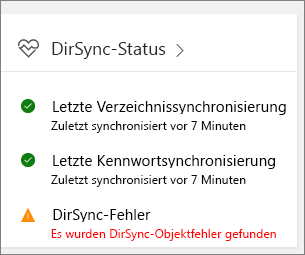
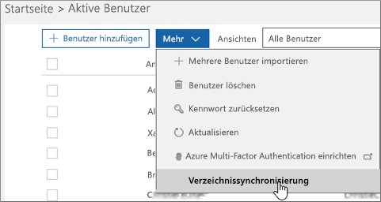

# Beheben von Problemen mit der Verzeichnissynchronisierung für Office 365Fixing problems with directory synchronization for Office 365

Mithilfe der Verzeichnissynchronisierung können Sie weiterhin Benutzer und Gruppen lokal verwalten und Änderungen, Ergänzungen und Löschungen in der Cloud synchronisieren.With directory synchronization, you can continue to manage users and groups on-premises and synchronize additions, deletions, and changes to the cloud. Das Setup ist jedoch etwas kompliziert, und es kann mitunter schwierig sein, die Problemursachen zu finden.But setup is a little complicated and it can sometimes be difficult to identify the source of problems. Wir verfügen über Ressourcen, mit denen Sie mögliche Probleme aufspüren und beheben können.We have resources to help you identify potential issues and fix them.
  
## Wie kann ich feststellen, ob ein Fehler vorliegt?How do I know if something is wrong?

Als ersten Hinweis auf eine fehlerhafte Funktionsweise zeigt die Kachel "DirSync-Status" im Microsoft 365 Admin Center an, dass ein Problem vorliegt:The first indication that something is wrong is when the DirSync Status tile in the Microsoft 365 admin center indicates there is a problem:
  

  
Außerdem sendet Office 365 Ihnen eine E-Mail (an die alternative und an Ihre Administrator-E-Mail-Adresse), aus der hervorgeht, dass bei Ihrem Mandanten Verzeichnissynchronisierungsfehler aufgetreten sind.You will also receive a mail (to the alternate email and to your admin email) from Office 365 that indicates your tenant has encountered directory synchronization errors. Ausführlichere Informationen hierzu finden Sie unter [Ermitteln von Fehlern bei der Verzeichnissynchronisierung in Office 365](identify-directory-synchronization-errors.md).[Identify directory synchronization errors in Office 365](identify-directory-synchronization-errors.md)
  
## Wie erhalte ich das Azure Active Directory Connect-Tool?How do I get Azure Active Directory Connect tool?

Navigieren Sie im [Microsoft 365 Admin Center](https://admin.microsoft.com) zu \*\* Benutzer \*\* \> **Aktive Benutzer**.In the [Microsoft 365 admin center](https://admin.microsoft.com), navigate to \*\* Users \*\* \> **Active users**. Klicken Sie auf das Menü **Mehr**, und wählen Sie **Verzeichnissynchronisierung** aus.Click the **More** menu and select **Directory synchronization**. 
  

  
Folgen Sie den [Anweisungen im Assistenten](set-up-directory-synchronization.md), um Azure AD Connect herunterzuladen.Follow the [instructions in the wizard](set-up-directory-synchronization.md) to download Azure AD Connect. 
  
Wenn Sie weiterhin die Azure Active Directory-Synchronisierung (DirSync) verwenden, finden Sie unter dem Thema [Problembehandlung bei Fehlermeldungen zur Installation des Azure Active Directory-Synchronisierungstools und zum Konfigurations-Assistenten in Office 365](https://go.microsoft.com/fwlink/p/?LinkId=396717) Informationen zu den Systemanforderungen für die Installation von DirSync, den dazu erforderlichen Berechtigungen sowie zur Problembehandlung bei häufig auftretenden Fehlern.If you are still using Azure Active Directory Sync (DirSync), take a look at [How to troubleshoot Azure Active Directory Sync Tool installation and Configuration Wizard error messages in Office 365](https://go.microsoft.com/fwlink/p/?LinkId=396717) for information about the system requirements to install dirsync, the permissions you need, and how to troubleshoot common errors. 
  
Informationen zum Aktualisieren der Azure Active Directory-Synchronisierung auf Azure AD Connect finden Sie unter [Aktualisierungsanweisungen](https://go.microsoft.com/fwlink/p/?LinkId=733240).To update from Azure Active Directory Sync to Azure AD Connect, see [the upgrade instructions](https://go.microsoft.com/fwlink/p/?LinkId=733240).
  
## Beheben häufiger Ursachen von Problemen mit der Verzeichnissynchronisierung in Office 365Resolving common causes of problems with directory synchronization in Office 365

### **Synchronisierte Objekte werden nicht angezeigt oder nicht online aktualisiert, oder ich erhalte Synchronisierungsfehlerberichte vom Dienst.****Synchronized objects aren't appearing or updating online, or I'm getting synchronization error reports from the Service.**

- [Identitätssynchronisierung und Resilienz bei doppelten AttributenIdentity synchronization and duplicate attribute resiliency](https://docs.microsoft.com/azure/active-directory/hybrid/how-to-connect-syncservice-duplicate-attribute-resiliency)

### **Ich habe eine Benachrichtigung im Admin Center oder erhalte automatisierte E-Mails mit dem Hinweis, dass kürzlich kein Synchronisierungsereignis stattgefunden hat****I have an alert in the admin center, or am receiving automated emails that there hasn't been a recent synchronization event**
- [Behandeln von Verbindungsproblemen mit Azure AD ConnectTroubleshoot connectivity issues with Azure AD Connect](https://docs.microsoft.com/azure/active-directory/hybrid/tshoot-connect-connectivity)
- [Azure AD Connect-Konten und -BerechtigungenAzure AD Connect Accounts and permissions](https://go.microsoft.com/fwlink/p/?LinkId=820598)
- [Azure AD Connect-Synchronisierung: Verwalten des Azure AD-DienstkontosAzure AD Connect sync: How to manage the Azure AD service account](https://docs.microsoft.com/azure/active-directory/hybrid/how-to-connect-azureadaccount)
- [Die Verzeichnissynchronisierung mit Azure Active Directory wird beendet, oder Sie erhalten eine Warnung, die besagt, dass die Synchronisierung sich seit mehr als einem Tag nicht mehr registriert hatDirectory synchronization to Azure Active Directory stops or you're warned that sync hasn't registered in more than a day](https://support.microsoft.com/help/2882421/directory-synchronization-to-azure-active-directory-stops-or-you-re-warned-that-sync-hasn-t-registered-in-more-than-a-day)

### **Kennworthashes werden nicht synchronisiert, oder im Admin Center wird eine Warnung angezeigt, die besagt, dass kürzlich keine Kennworthashsynchronisierung stattgefunden hat****Password hashes aren't synchronizing, or I'm seeing an alert in the admin center that there hasn't been a recent password hash synchronization**
- [Implementieren der Kennworthashsynchronisierung mit der Azure AD Connect-Synchronisierung](https://docs.microsoft.com/azure/active-directory/hybrid/how-to-connect-password-hash-synchronization)For more information, see [Implement password hash synchronization with Azure AD Connect sync](https://docs.microsoft.com/azure/active-directory/hybrid/how-to-connect-password-hash-synchronization).

### **Ich erhalte eine Warnung, dass das Objektkontingent überschritten ist****I'm seeing an alert that Object quota exceeded**
- Als Hilfe zum Schutz des Dienstes wurde ein Objektkontingent integriert.We have a built-in object quota to help protect the service. Falls Sie zu viele Objekte in Ihrem Verzeichnis haben, die mit Office 365 synchronisiert werden müssen, [wenden Sie sich an den Support für Business-Produkte](https://support.office.com/article/32a17ca7-6fa0-4870-8a8d-e25ba4ccfd4b), um Ihr Kontingent zu erhöhen.If you have too many objects in your directory that need to sync to Office 365, you'll have to [Contact support for business products](https://support.office.com/article/32a17ca7-6fa0-4870-8a8d-e25ba4ccfd4b) to increase your quota.

### **Ich muss wissen, welche Attribute synchronisiert werden****I need to know which attributes are synchronized**
- [Hier](https://go.microsoft.com/fwlink/p/?LinkId=396719) finden Sie eine Liste aller Attribute, die zwischen lokalen Verzeichnissen und der Cloud synchronisiert werden.You can find a list of all the attributes that are synced between on-premises and the cloud [right here](https://go.microsoft.com/fwlink/p/?LinkId=396719).

### **Ich kann Objekte, die mit der Cloud synchronisiert wurden, nicht verwalten oder entfernen****I can't manage or remove objects that were synchronized to the cloud**
- Sind Sie bereit, Objekte allein in der Cloud zu verwalten?Are you ready to manage objects in the cloud only? Oder gibt es ein Objekt, das lokal gelöscht wurde und jetzt in der Cloud festhängt?Or is there an object that was deleted on-premises, but is stuck in the cloud? Anleitung zum Beheben dieser Probleme finden Sie in diesem Artikel zur [Problembehandlung bei der Synchronisierung](https://go.microsoft.com/fwlink/p/?linkid=842044) und [Unterstützung](https://go.microsoft.com/fwlink/p/?LinkId=396720).Take a look at this [Troubleshooting Errors during synchronization](https://go.microsoft.com/fwlink/p/?linkid=842044) and [support article](https://go.microsoft.com/fwlink/p/?LinkId=396720) for guidance on how to resolve these issues.

### **Eine Fehlermeldung hat mir mitgeteilt, dass mein Unternehmen die Anzahl der Objekte, die synchronisiert werden können, überschritten hat****I got an error message that my company has exceeded the number of objects that can be synchronized**
- Weitere Informationen zu diesem Problem finden Sie [hier](https://go.microsoft.com/fwlink/p/?LinkId=396721).You can read more about this issue [here](https://go.microsoft.com/fwlink/p/?LinkId=396721).
   
## Weitere RessourcenOther resources

- [Skript zum Beheben von doppelten BenutzerprinzipalnamenScript to fix duplicate user principal names](https://go.microsoft.com/fwlink/p/?LinkId=396725)
    
- [Vorbereiten einer nicht routingfähigen Domäne (z. B. ".lokale Domäne") für die VerzeichnissynchronisierungHow to prepare a non-routable domain for directory synchronization](prepare-a-non-routable-domain-for-directory-synchronization.md)
    
- [Skript zum Ermitteln der Anzahl aller synchronisierten ObjekteScript to count total synchronized objects](https://go.microsoft.com/fwlink/p/?LinkId=396726)
    
- [Behandeln von Problemen mit AD FS 2.0AD FS 2.0](https://go.microsoft.com/fwlink/p/?LinkId=396727)
    
- [Verwenden von PowerShell zum Korrigieren leerer "DisplayName"-Attribute für E-Mail-aktivierte GruppenUse PowerShell to fix empty DisplayName attributes for mail-enabled groups](https://go.microsoft.com/fwlink/p/?LinkId=396728)
    
- [Verwenden von PowerShell zum Korrigieren von doppelten UPNsHow to use PowerShell to fix duplicate UPN](https://go.microsoft.com/fwlink/p/?LinkId=396730)
    
- [Verwenden von PowerShell zum Korrigieren von doppelten E-Mail-AdressenUse PowerShell to fix duplicate email addresses](https://go.microsoft.com/fwlink/p/?LinkId=396731)
    
## DiagnosetoolsDiagnostic tools

[IDFix-Tool](prepare-directory-attributes-for-synch-with-idfix.md) wird in einer lokalen Active Directory-Umgebung für die Suche nach und Korrektur von Identitätsobjekten und deren Attributen verwendet, um die Migration nach Office 365 vorzubereiten.The  IDFix Tool http://go.microsoft.com/fwlink/?LinkID=286107  is used to perform discovery and remediation of identity objects and their attributes in an on-premises Active Directory environment in preparation for migration to Office 365. IDFix richtet sich an Active Directory-Administratoren, die für DirSync mit dem Office 365-Dienst zuständig sind.IdFix is intended for the Active Directory administrators responsible for DirSync with the Office 365 service. 

[Herunterladen des IDFix-Tools](https://go.microsoft.com/fwlink/p/?LinkId=396718) aus dem Microsoft Download Center.[Download the IDFix tool](https://go.microsoft.com/fwlink/p/?LinkId=396718) from the Microsoft download center.