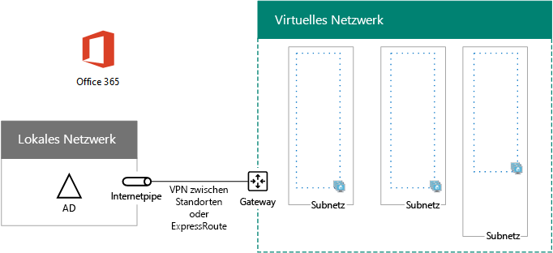

# <a name="high-availability-federated-authentication-phase-1-configure-azure"></a><span data-ttu-id="e1a29-103">Hochverfügbarkeit der Verbundauthentifizierung, Phase 1: Konfigurieren von Azure</span><span class="sxs-lookup"><span data-stu-id="e1a29-103">High availability federated authentication Phase 1: Configure Azure</span></span>

 <span data-ttu-id="e1a29-104">**Zusammenfassung:** Konfigurieren Sie die Microsoft Azure-Infrastruktur Host hohe Verfügbarkeit federated-Authentifizierung für Office 365.</span><span class="sxs-lookup"><span data-stu-id="e1a29-104">**Summary:** Configure the Microsoft Azure infrastructure to host high availability federated authentication for Office 365.</span></span>
  
<span data-ttu-id="e1a29-p101">In dieser Phase erstellen Sie die Ressourcengruppen, Speicherkonten, virtuelle Netzwerk (VNet) und Verfügbarkeit Mengen in Azure, die die virtuellen Computer in Phasen 2, 3 und 4 hostet. Müssen Sie vor dem Verschieben auf in dieser Phase [hoher Verfügbarkeit federated Authentifizierung Phase 2: Konfigurieren von Domänencontrollern](high-availability-federated-authentication-phase-2-configure-domain-controllers.md). Finden Sie unter [Deploy hohe Verfügbarkeit Verbundauthentifizierung für Office 365 in Azure](deploy-high-availability-federated-authentication-for-office-365-in-azure.md) für alle Phasen.</span><span class="sxs-lookup"><span data-stu-id="e1a29-p101">In this phase, you create the resource groups, storage accounts, virtual network (VNet), and availability sets in Azure that will host the virtual machines in phases 2, 3, and 4. You must complete this phase before moving on to [High availability federated authentication Phase 2: Configure domain controllers](high-availability-federated-authentication-phase-2-configure-domain-controllers.md). See [Deploy high availability federated authentication for Office 365 in Azure](deploy-high-availability-federated-authentication-for-office-365-in-azure.md) for all of the phases.</span></span>
  
<span data-ttu-id="e1a29-108">Azure muss diese grundlegenden Komponenten bereitgestellt werden:</span><span class="sxs-lookup"><span data-stu-id="e1a29-108">Azure must be provisioned with these basic components:</span></span>
  
- <span data-ttu-id="e1a29-109">Ressourcengruppen</span><span class="sxs-lookup"><span data-stu-id="e1a29-109">Resource groups</span></span>
    
- <span data-ttu-id="e1a29-110">Ein standortübergreifendes virtuelles Azure-Netzwerk (VNet) mit Subnetzen für das Hosting der virtuellen Computer in Azure</span><span class="sxs-lookup"><span data-stu-id="e1a29-110">A cross-premises Azure virtual network (VNet) with subnets for hosting the Azure virtual machines</span></span>
    
- <span data-ttu-id="e1a29-111">Netzwerksicherheitsgruppen zur Isolierung der Subnetze</span><span class="sxs-lookup"><span data-stu-id="e1a29-111">Network security groups for performing subnet isolation</span></span>
    
- <span data-ttu-id="e1a29-112">Verfügbarkeitsgruppen</span><span class="sxs-lookup"><span data-stu-id="e1a29-112">Availability sets</span></span>
    
## <a name="configure-azure-components"></a><span data-ttu-id="e1a29-113">Konfigurieren der Azure-Komponenten</span><span class="sxs-lookup"><span data-stu-id="e1a29-113">Configure Azure components</span></span>

<span data-ttu-id="e1a29-p102">Vor dem Konfigurieren der Azure-Komponenten, füllen Sie in den folgenden Tabellen. Hilft Ihnen bei der die Verfahren zum Konfigurieren von Azure, in diesem Abschnitt Drucken und notieren Sie die benötigten Informationen oder Kopieren in diesem Abschnitt in ein Dokument und füllen Sie es aus. Füllen Sie für den Einstellungen der VNet Tabelle V aus.</span><span class="sxs-lookup"><span data-stu-id="e1a29-p102">Before you begin configuring Azure components, fill in the following tables. To assist you in the procedures for configuring Azure, print this section and write down the needed information or copy this section to a document and fill it in. For the settings of the VNet, fill in Table V.</span></span>
  
|<span data-ttu-id="e1a29-117">**Element**</span><span class="sxs-lookup"><span data-stu-id="e1a29-117">**Item**</span></span>|<span data-ttu-id="e1a29-118">**Einstellung für die Konfiguration**</span><span class="sxs-lookup"><span data-stu-id="e1a29-118">**Configuration setting**</span></span>|<span data-ttu-id="e1a29-119">**Beschreibung**</span><span class="sxs-lookup"><span data-stu-id="e1a29-119">**Description**</span></span>|<span data-ttu-id="e1a29-120">**Wert**</span><span class="sxs-lookup"><span data-stu-id="e1a29-120">**Value**</span></span>|
|:-----|:-----|:-----|:-----|
|<span data-ttu-id="e1a29-121">1.</span><span class="sxs-lookup"><span data-stu-id="e1a29-121">1.</span></span>  <br/> |<span data-ttu-id="e1a29-122">VNet-Name</span><span class="sxs-lookup"><span data-stu-id="e1a29-122">VNet name</span></span>  <br/> |<span data-ttu-id="e1a29-123">Ein Name, der dem VNet zugewiesen wird (z. B. FedAuthNet).</span><span class="sxs-lookup"><span data-stu-id="e1a29-123">A name to assign to the VNet (example FedAuthNet).</span></span>  <br/> |<span data-ttu-id="e1a29-124">_______________________________</span><span class="sxs-lookup"><span data-stu-id="e1a29-124"></span></span>  <br/> |
|<span data-ttu-id="e1a29-125">2.</span><span class="sxs-lookup"><span data-stu-id="e1a29-125">2.</span></span>  <br/> |<span data-ttu-id="e1a29-126">VNet Speicherort</span><span class="sxs-lookup"><span data-stu-id="e1a29-126">VNet location</span></span>  <br/> |<span data-ttu-id="e1a29-127">Das regionale Azure-Rechenzentrum, in dem sich das virtuelle Netzwerk befinden soll</span><span class="sxs-lookup"><span data-stu-id="e1a29-127">The regional Azure datacenter that will contain the virtual network.</span></span>  <br/> |<span data-ttu-id="e1a29-128">_______________________________</span><span class="sxs-lookup"><span data-stu-id="e1a29-128"></span></span>  <br/> |
|<span data-ttu-id="e1a29-129">3.</span><span class="sxs-lookup"><span data-stu-id="e1a29-129">3.</span></span>  <br/> |<span data-ttu-id="e1a29-130">IP-Adresse des VPN-Geräts</span><span class="sxs-lookup"><span data-stu-id="e1a29-130">VPN device IP address</span></span>  <br/> |<span data-ttu-id="e1a29-131">Die öffentliche IPv4-Adresse der Schnittstelle des VPN-Geräts im Internet</span><span class="sxs-lookup"><span data-stu-id="e1a29-131">The public IPv4 address of your VPN device's interface on the Internet.</span></span>  <br/> |<span data-ttu-id="e1a29-132">_______________________________</span><span class="sxs-lookup"><span data-stu-id="e1a29-132"></span></span>  <br/> |
|<span data-ttu-id="e1a29-133">4.</span><span class="sxs-lookup"><span data-stu-id="e1a29-133">4.</span></span>  <br/> |<span data-ttu-id="e1a29-134">VNet-Adressraum</span><span class="sxs-lookup"><span data-stu-id="e1a29-134">VNet address space</span></span>  <br/> |<span data-ttu-id="e1a29-p103">Der Adressraum für das virtuelle Netzwerk (Fragen Sie Ihre IT-Abteilung nach diesem Adressraum.)</span><span class="sxs-lookup"><span data-stu-id="e1a29-p103">The address space for the virtual network. Work with your IT department to determine this address space.</span></span>  <br/> |<span data-ttu-id="e1a29-137">_______________________________</span><span class="sxs-lookup"><span data-stu-id="e1a29-137"></span></span>  <br/> |
|<span data-ttu-id="e1a29-138">5.</span><span class="sxs-lookup"><span data-stu-id="e1a29-138">5.</span></span>  <br/> |<span data-ttu-id="e1a29-139">Gemeinsam verwendeter IPsec-Schlüssel</span><span class="sxs-lookup"><span data-stu-id="e1a29-139">IPsec shared key</span></span>  <br/> |<span data-ttu-id="e1a29-p104">Eine 32 Zeichen zufällige, alphanumerische Zeichenfolge, die verwendet wird, um beide Seiten der Website-zu-Standort-VPN-Verbindung zu authentifizieren. Arbeiten mit Ihrer IT- oder jede Abteilung Sicherheit dieser Schlüsselwert bestimmen. Alternativ finden Sie unter [Erstellen einer zufälligen Zeichenfolge für einen vorinstallierten IPsec-Schlüssel](http://social.technet.microsoft.com/wiki/contents/articles/32330.create-a-random-string-for-an-ipsec-preshared-key.aspx).</span><span class="sxs-lookup"><span data-stu-id="e1a29-p104">A 32-character random, alphanumeric string that will be used to authenticate both sides of the site-to-site VPN connection. Work with your IT or security department to determine this key value. Alternately, see [Create a random string for an IPsec preshared key](http://social.technet.microsoft.com/wiki/contents/articles/32330.create-a-random-string-for-an-ipsec-preshared-key.aspx).  </span></span><br/> |<span data-ttu-id="e1a29-143">_______________________________</span><span class="sxs-lookup"><span data-stu-id="e1a29-143"></span></span>  <br/> |
   
 <span data-ttu-id="e1a29-144">**Tabelle V: Konfiguration eines standortübergreifenden virtuellen Netzwerks**</span><span class="sxs-lookup"><span data-stu-id="e1a29-144">**Table V: Cross-premises virtual network configuration**</span></span>
  
<span data-ttu-id="e1a29-p105">Füllen Sie nun Tabelle S für die Subnetze dieser Lösung aus. Alle Adressräume sollten im CIDR (Classless Inter-Domain Routing)-Format angegeben werden, auch Netzwerkpräfixformat genannt. Beispiel: 10.24.64.0/20.</span><span class="sxs-lookup"><span data-stu-id="e1a29-p105">Next, fill in Table S for the subnets of this solution. All address spaces should be in Classless Interdomain Routing (CIDR) format, also known as network prefix format. An example is 10.24.64.0/20.</span></span>
  
<span data-ttu-id="e1a29-p106">Geben Sie für die ersten drei Subnetze einen Namen und einen einzigen IP-Adressraum aus dem Adressraum des virtuellen Netzwerks an. Gehen Sie wie folgt vor, um den 27-Bit-Adressraum (mit Präfixlänge „/27“) für das Azure-Gatewaysubnetz zu ermitteln:</span><span class="sxs-lookup"><span data-stu-id="e1a29-p106">For the first three subnets, specify a name and a single IP address space based on the virtual network address space. For the gateway subnet, determine the 27-bit address space (with a /27 prefix length) for the Azure gateway subnet with the following:</span></span>
  
1. <span data-ttu-id="e1a29-150">Setzen Sie die variablen Bits im Adressraum des VNet auf 1, bis zu den für das Gatewaysubnetz verwendeten Bits. Setzen Sie die verbleibenden Bits auf 0.</span><span class="sxs-lookup"><span data-stu-id="e1a29-150">Set the variable bits in the address space of the VNet to 1, up to the bits being used by the gateway subnet, then set the remaining bits to 0.</span></span>
    
2. <span data-ttu-id="e1a29-151">Übertragen Sie den resultierenden Bitblock ins Dezimalsystem, und drücken Sie ihn als Adressraum aus, wobei Sie als Präfixlänge die Größe des Gatewaysubnetzes festlegen.</span><span class="sxs-lookup"><span data-stu-id="e1a29-151">Convert the resulting bits to decimal and express it as an address space with the prefix length set to the size of the gateway subnet.</span></span>
    
<span data-ttu-id="e1a29-152">Finden Sie unter [Adresse Speicherplatz Rechner für Azure Gateway Subnetze](https://gallery.technet.microsoft.com/scriptcenter/Address-prefix-calculator-a94b6eed) ein PowerShell-Befehl blockieren und c# oder Python Konsolenanwendung, die für Sie diese Berechnung ausgeführt hat.</span><span class="sxs-lookup"><span data-stu-id="e1a29-152">See [Address space calculator for Azure gateway subnets](https://gallery.technet.microsoft.com/scriptcenter/Address-prefix-calculator-a94b6eed) for a PowerShell command block and C# or Python console application that performs this calculation for you.</span></span>
  
<span data-ttu-id="e1a29-153">Fragen Sie Ihre IT-Abteilung nach diesen Adressräumen aus dem Adressraum des virtuellen Netzwerks.</span><span class="sxs-lookup"><span data-stu-id="e1a29-153">Work with your IT department to determine these address spaces from the virtual network address space.</span></span>
  
|<span data-ttu-id="e1a29-154">**Element**</span><span class="sxs-lookup"><span data-stu-id="e1a29-154">**Item**</span></span>|<span data-ttu-id="e1a29-155">**Subnetzname**</span><span class="sxs-lookup"><span data-stu-id="e1a29-155">**Subnet name**</span></span>|<span data-ttu-id="e1a29-156">**Subnetzadressraum**</span><span class="sxs-lookup"><span data-stu-id="e1a29-156">**Subnet address space**</span></span>|<span data-ttu-id="e1a29-157">**Zweck**</span><span class="sxs-lookup"><span data-stu-id="e1a29-157">**Purpose**</span></span>|
|:-----|:-----|:-----|:-----|
|<span data-ttu-id="e1a29-158">1.</span><span class="sxs-lookup"><span data-stu-id="e1a29-158">1.</span></span>  <br/> |<span data-ttu-id="e1a29-159">_______________________________</span><span class="sxs-lookup"><span data-stu-id="e1a29-159"></span></span>  <br/> |<span data-ttu-id="e1a29-160">_______________________________</span><span class="sxs-lookup"><span data-stu-id="e1a29-160"></span></span>  <br/> |<span data-ttu-id="e1a29-161">Das Subnetz, das vom Windows Server Active Directory-Domänencontroller und den virtuellen Computer des DirSync-Servers verwendet wird.</span><span class="sxs-lookup"><span data-stu-id="e1a29-161">The subnet used by the Windows Server Active Directory (AD) domain controller and DirSync server virtual machines (VMs).</span></span>  <br/> |
|<span data-ttu-id="e1a29-162">2.</span><span class="sxs-lookup"><span data-stu-id="e1a29-162">2.</span></span>  <br/> |<span data-ttu-id="e1a29-163">_______________________________</span><span class="sxs-lookup"><span data-stu-id="e1a29-163"></span></span>  <br/> |<span data-ttu-id="e1a29-164">_______________________________</span><span class="sxs-lookup"><span data-stu-id="e1a29-164"></span></span>  <br/> |<span data-ttu-id="e1a29-165">Das von den virtuellen Computern von AD FS verwendete Subnetz.</span><span class="sxs-lookup"><span data-stu-id="e1a29-165">The subnet used by the AD FS VMs.</span></span>  <br/> |
|<span data-ttu-id="e1a29-166">3.</span><span class="sxs-lookup"><span data-stu-id="e1a29-166">3.</span></span>  <br/> |<span data-ttu-id="e1a29-167">_______________________________</span><span class="sxs-lookup"><span data-stu-id="e1a29-167"></span></span>  <br/> |<span data-ttu-id="e1a29-168">_______________________________</span><span class="sxs-lookup"><span data-stu-id="e1a29-168"></span></span>  <br/> |<span data-ttu-id="e1a29-169">Das von den virtuellen Computern des Webanwendungsproxys verwendete Subnetz.</span><span class="sxs-lookup"><span data-stu-id="e1a29-169">The subnet used by the web application proxy VMs.</span></span>  <br/> |
|<span data-ttu-id="e1a29-170">4.</span><span class="sxs-lookup"><span data-stu-id="e1a29-170">4.</span></span>  <br/> |<span data-ttu-id="e1a29-171">GatewaySubnet</span><span class="sxs-lookup"><span data-stu-id="e1a29-171">GatewaySubnet</span></span>  <br/> |<span data-ttu-id="e1a29-172">_______________________________</span><span class="sxs-lookup"><span data-stu-id="e1a29-172"></span></span>  <br/> |<span data-ttu-id="e1a29-173">Das von den virtuellen Computern des Azure-Gateways verwendete Subnetz.</span><span class="sxs-lookup"><span data-stu-id="e1a29-173">The subnet used by the Azure gateway VMs.</span></span>  <br/> |
   
 <span data-ttu-id="e1a29-174">**Tabelle S: Subnetze im virtuellen Netzwerk**</span><span class="sxs-lookup"><span data-stu-id="e1a29-174">**Table S: Subnets in the virtual network**</span></span>
  
<span data-ttu-id="e1a29-175">Tragen Sie in Tabelle I nun die statischen IP-Adressen ein, die den virtuellen Computern und den Load Balancer-Instanzen zugewiesen werden.</span><span class="sxs-lookup"><span data-stu-id="e1a29-175">Next, fill in Table I for the static IP addresses assigned to virtual machines and load balancer instances.</span></span>
  
|<span data-ttu-id="e1a29-176">**Element**</span><span class="sxs-lookup"><span data-stu-id="e1a29-176">**Item**</span></span>|<span data-ttu-id="e1a29-177">**Zweck**</span><span class="sxs-lookup"><span data-stu-id="e1a29-177">**Purpose**</span></span>|<span data-ttu-id="e1a29-178">**IP-Adresse im Subnetz**</span><span class="sxs-lookup"><span data-stu-id="e1a29-178">**IP address on the subnet**</span></span>|<span data-ttu-id="e1a29-179">**Wert**</span><span class="sxs-lookup"><span data-stu-id="e1a29-179">**Value**</span></span>|
|:-----|:-----|:-----|:-----|
|<span data-ttu-id="e1a29-180">1.</span><span class="sxs-lookup"><span data-stu-id="e1a29-180">1.</span></span>  <br/> |<span data-ttu-id="e1a29-181">Statische IP-Adresse des ersten Domänencontrollers</span><span class="sxs-lookup"><span data-stu-id="e1a29-181">Static IP address of the first domain controller</span></span>  <br/> |<span data-ttu-id="e1a29-182">Die vierte mögliche IP-Adresse für den Adressraum des in Tabelle S, Element 1 definierten Subnetzes</span><span class="sxs-lookup"><span data-stu-id="e1a29-182">The fourth possible IP address for the address space of the subnet defined in Item 1 of Table S.</span></span>  <br/> |<span data-ttu-id="e1a29-183">_______________________________</span><span class="sxs-lookup"><span data-stu-id="e1a29-183"></span></span>  <br/> |
|<span data-ttu-id="e1a29-184">2.</span><span class="sxs-lookup"><span data-stu-id="e1a29-184">2.</span></span>  <br/> |<span data-ttu-id="e1a29-185">Statische IP-Adresse des zweiten Domänencontrollers</span><span class="sxs-lookup"><span data-stu-id="e1a29-185">Static IP address of the second domain controller</span></span>  <br/> |<span data-ttu-id="e1a29-186">Die fünfte mögliche IP-Adresse für den Adressraum des in Tabelle S, Element 1 definierten Subnetzes</span><span class="sxs-lookup"><span data-stu-id="e1a29-186">The fifth possible IP address for the address space of the subnet defined in Item 1 of Table S.</span></span>  <br/> |<span data-ttu-id="e1a29-187">_______________________________</span><span class="sxs-lookup"><span data-stu-id="e1a29-187"></span></span>  <br/> |
|<span data-ttu-id="e1a29-188">3.</span><span class="sxs-lookup"><span data-stu-id="e1a29-188">3.</span></span>  <br/> |<span data-ttu-id="e1a29-189">Statische IP-Adresse des DirSync-Servers</span><span class="sxs-lookup"><span data-stu-id="e1a29-189">Static IP address of the DirSync server</span></span>  <br/> |<span data-ttu-id="e1a29-190">Die sechste mögliche IP-Adresse für den Adressraum des in Tabelle S, Element 1 definierten Subnetzes</span><span class="sxs-lookup"><span data-stu-id="e1a29-190">The sixth possible IP address for the address space of the subnet defined in Item 1 of Table S.</span></span>  <br/> |<span data-ttu-id="e1a29-191">_______________________________</span><span class="sxs-lookup"><span data-stu-id="e1a29-191"></span></span>  <br/> |
|<span data-ttu-id="e1a29-192">4.</span><span class="sxs-lookup"><span data-stu-id="e1a29-192">4.</span></span>  <br/> |<span data-ttu-id="e1a29-193">Statische IP-Adresse des internen Lastenausgleichs für die AD FS-Server</span><span class="sxs-lookup"><span data-stu-id="e1a29-193">Static IP address of the internal load balancer for the AD FS servers</span></span>  <br/> |<span data-ttu-id="e1a29-194">Die vierte mögliche IP-Adresse für den Adressraum des in Tabelle S, Element 2 definierten Subnetzes</span><span class="sxs-lookup"><span data-stu-id="e1a29-194">The fourth possible IP address for the address space of the subnet defined in Item 2 of Table S.</span></span>  <br/> |<span data-ttu-id="e1a29-195">_______________________________</span><span class="sxs-lookup"><span data-stu-id="e1a29-195"></span></span>  <br/> |
|<span data-ttu-id="e1a29-196">5.</span><span class="sxs-lookup"><span data-stu-id="e1a29-196">5.</span></span>  <br/> |<span data-ttu-id="e1a29-197">Statische IP-Adresse des ersten AD FS-Servers</span><span class="sxs-lookup"><span data-stu-id="e1a29-197">Static IP address of the first AD FS server</span></span>  <br/> |<span data-ttu-id="e1a29-198">Die fünfte mögliche IP-Adresse für den Adressraum des in Tabelle S, Element 2 definierten Subnetzes</span><span class="sxs-lookup"><span data-stu-id="e1a29-198">The fifth possible IP address for the address space of the subnet defined in Item 2 of Table S.</span></span>  <br/> |<span data-ttu-id="e1a29-199">_______________________________</span><span class="sxs-lookup"><span data-stu-id="e1a29-199"></span></span>  <br/> |
|<span data-ttu-id="e1a29-200">6.</span><span class="sxs-lookup"><span data-stu-id="e1a29-200">6.</span></span>  <br/> |<span data-ttu-id="e1a29-201">Statische IP-Adresse des zweiten AD FS-Servers</span><span class="sxs-lookup"><span data-stu-id="e1a29-201">Static IP address of the second AD FS server</span></span>  <br/> |<span data-ttu-id="e1a29-202">Die sechste mögliche IP-Adresse für den Adressraum des in Tabelle S, Element 2 definierten Subnetzes</span><span class="sxs-lookup"><span data-stu-id="e1a29-202">The sixth possible IP address for the address space of the subnet defined in Item 2 of Table S.</span></span>  <br/> |<span data-ttu-id="e1a29-203">_______________________________</span><span class="sxs-lookup"><span data-stu-id="e1a29-203"></span></span>  <br/> |
|<span data-ttu-id="e1a29-204">7.</span><span class="sxs-lookup"><span data-stu-id="e1a29-204">7.</span></span>  <br/> |<span data-ttu-id="e1a29-205">Statische IP-Adresse des ersten Webanwendungsproxy-Servers
</span><span class="sxs-lookup"><span data-stu-id="e1a29-205">Static IP address of the first web application proxy server</span></span>  <br/> |<span data-ttu-id="e1a29-206">Die vierte mögliche IP-Adresse für den Adressraum des in Tabelle S, Element 3 definierten Subnetzes</span><span class="sxs-lookup"><span data-stu-id="e1a29-206">The fourth possible IP address for the address space of the subnet defined in Item 3 of Table S.</span></span>  <br/> |<span data-ttu-id="e1a29-207">_______________________________</span><span class="sxs-lookup"><span data-stu-id="e1a29-207"></span></span>  <br/> |
|<span data-ttu-id="e1a29-208">8.</span><span class="sxs-lookup"><span data-stu-id="e1a29-208">8.</span></span>  <br/> |<span data-ttu-id="e1a29-209">Statische IP-Adresse des zweiten Webanwendungsproxy-Servers
</span><span class="sxs-lookup"><span data-stu-id="e1a29-209">Static IP address of the second web application proxy server</span></span>  <br/> |<span data-ttu-id="e1a29-210">Die fünfte mögliche IP-Adresse für den Adressraum des in Tabelle S, Element 3 definierten Subnetzes</span><span class="sxs-lookup"><span data-stu-id="e1a29-210">The fifth possible IP address for the address space of the subnet defined in Item 3 of Table S.</span></span>  <br/> |<span data-ttu-id="e1a29-211">_______________________________</span><span class="sxs-lookup"><span data-stu-id="e1a29-211"></span></span>  <br/> |
   
 <span data-ttu-id="e1a29-212">**Tabelle I: statische IP-Adressen in das virtuelle Netzwerk**</span><span class="sxs-lookup"><span data-stu-id="e1a29-212">**Table I: Static IP addresses in the virtual network**</span></span>
  
<span data-ttu-id="e1a29-213">Füllen Sie Tabelle D für die beiden DNS-Server in Ihrem lokalen Netzwerk aus, die Sie bei der Ersteinrichtung der Domänencontroller in Ihrem virtuellen Netzwerk verwenden möchten. Stellen Sie diese Liste gemeinsam mit Ihrer IT-Abteilung zusammen.</span><span class="sxs-lookup"><span data-stu-id="e1a29-213">For two Domain Name System (DNS) servers in your on-premises network that you want to use when initially setting up the domain controllers in your virtual network, fill in Table D. Work with your IT department to determine this list.</span></span>
  
|<span data-ttu-id="e1a29-214">**Element**</span><span class="sxs-lookup"><span data-stu-id="e1a29-214">**Item**</span></span>|<span data-ttu-id="e1a29-215">**Anzeigename des DNS-Servers**</span><span class="sxs-lookup"><span data-stu-id="e1a29-215">**DNS server friendly name**</span></span>|<span data-ttu-id="e1a29-216">**IP-Adresse des DNS-Servers**</span><span class="sxs-lookup"><span data-stu-id="e1a29-216">**DNS server IP address**</span></span>|
|:-----|:-----|:-----|
|<span data-ttu-id="e1a29-217">1.</span><span class="sxs-lookup"><span data-stu-id="e1a29-217">1.</span></span>  <br/> |<span data-ttu-id="e1a29-218">_______________________________</span><span class="sxs-lookup"><span data-stu-id="e1a29-218"></span></span>  <br/> |<span data-ttu-id="e1a29-219">_______________________________</span><span class="sxs-lookup"><span data-stu-id="e1a29-219"></span></span>  <br/> |
|<span data-ttu-id="e1a29-220">2.</span><span class="sxs-lookup"><span data-stu-id="e1a29-220">2.</span></span>  <br/> |<span data-ttu-id="e1a29-221">_______________________________</span><span class="sxs-lookup"><span data-stu-id="e1a29-221"></span></span>  <br/> |<span data-ttu-id="e1a29-222">_______________________________</span><span class="sxs-lookup"><span data-stu-id="e1a29-222"></span></span>  <br/> |
   
 <span data-ttu-id="e1a29-223">**Tabelle D: Lokale DNS-Server**</span><span class="sxs-lookup"><span data-stu-id="e1a29-223">**Table D: On-premises DNS servers**</span></span>
  
<span data-ttu-id="e1a29-p107">Um Pakete über die Standort-zu-Standort-VPN-Verbindung aus dem standortübergreifenden Netzwerk an das Organisationsnetzwerk weiterleiten zu können, müssen Sie das virtuelle Netzwerk mit einem lokalen Netzwerk konfigurieren. Dieses lokale Netzwerk muss eine Liste der Adressräume (im CIDR-Format) für alle erreichbaren Standorte in Ihrem lokalen Organisationsnetzwerk enthalten. Die Liste der Adressräume, die Ihr lokales Netzwerk definieren, muss eindeutig sein und darf nicht mit den für andere virtuelle oder lokale Netzwerke verwendeten Adressräumen überlappen.</span><span class="sxs-lookup"><span data-stu-id="e1a29-p107">To route packets from the cross-premises network to your organization network across the site-to-site VPN connection, you must configure the virtual network with a local network that contains a list of the address spaces (in CIDR notation) for all of the reachable locations on your organization's on-premises network. The list of address spaces that define your local network must be unique and must not overlap with the address space used for other virtual networks or other local networks.</span></span>
  
<span data-ttu-id="e1a29-p108">Für die Teilmenge der Adressräume für das lokale Netzwerk füllen Sie Tabelle L aus. Auch wenn hierfür nur drei Einträge vorgesehen sind, können Sie noch weitere hinzufügen. Erarbeiten Sie diese Liste der Adressräume gemeinsam mit Ihrer IT-Abteilung.</span><span class="sxs-lookup"><span data-stu-id="e1a29-p108">For the set of local network address spaces, fill in Table L. Note that three blank entries are listed but you will typically need more. Work with your IT department to determine this list of address spaces.</span></span>
  
|<span data-ttu-id="e1a29-228">**Element**</span><span class="sxs-lookup"><span data-stu-id="e1a29-228">**Item**</span></span>|<span data-ttu-id="e1a29-229">**Adressraum des lokalen Netzwerks**</span><span class="sxs-lookup"><span data-stu-id="e1a29-229">**Local network address space**</span></span>|
|:-----|:-----|
|<span data-ttu-id="e1a29-230">1.</span><span class="sxs-lookup"><span data-stu-id="e1a29-230">1.</span></span>  <br/> |<span data-ttu-id="e1a29-231">_______________________________</span><span class="sxs-lookup"><span data-stu-id="e1a29-231"></span></span>  <br/> |
|<span data-ttu-id="e1a29-232">2.</span><span class="sxs-lookup"><span data-stu-id="e1a29-232">2.</span></span>  <br/> |<span data-ttu-id="e1a29-233">_______________________________</span><span class="sxs-lookup"><span data-stu-id="e1a29-233"></span></span>  <br/> |
|<span data-ttu-id="e1a29-234">3.</span><span class="sxs-lookup"><span data-stu-id="e1a29-234">3.</span></span>  <br/> |<span data-ttu-id="e1a29-235">_______________________________</span><span class="sxs-lookup"><span data-stu-id="e1a29-235"></span></span>  <br/> |
   
 <span data-ttu-id="e1a29-236">**Tabelle L: Adresspräfixe für das lokale Netzwerk**</span><span class="sxs-lookup"><span data-stu-id="e1a29-236">**Table L: Address prefixes for the local network**</span></span>
  
<span data-ttu-id="e1a29-237">Jetzt können Sie mit dem Erstellen der Azure-Infrastruktur beginnen, die die Verbundauthentifizierung für Office 365 hosten soll.</span><span class="sxs-lookup"><span data-stu-id="e1a29-237">Now let's begin building the Azure infrastructure to host your federated authentication for Office 365.</span></span>
  
> [!NOTE]
> <span data-ttu-id="e1a29-p109">Verwenden Sie den folgenden Befehl wird die neueste Version von Azure PowerShell. Finden Sie unter [Erste Schritte mit Azure PowerShell-Cmdlets](https://docs.microsoft.com/en-us/powershell/azureps-cmdlets-docs/).</span><span class="sxs-lookup"><span data-stu-id="e1a29-p109">The following command sets use the latest version of Azure PowerShell. See [Get started with Azure PowerShell cmdlets](https://docs.microsoft.com/en-us/powershell/azureps-cmdlets-docs/).</span></span> 
  
<span data-ttu-id="e1a29-240">Starten Sie zunächst eine Azure PowerShell-Eingabeaufforderung, und melden Sie sich bei Ihrem Konto an.</span><span class="sxs-lookup"><span data-stu-id="e1a29-240">First, start an Azure PowerShell prompt and login to your account.</span></span>
  
```
Login-AzureRMAccount
```

> [!TIP]
> <span data-ttu-id="e1a29-241">Eine Textdatei, die alle von PowerShell-Befehlen in diesem Artikel und Konfiguration Microsoft Excel-Arbeitsmappen, die generiert Ready-und-Los-PowerShell-Befehl Blöcke basierend auf Ihrer benutzerdefinierten Einstellungen enthält, finden Sie unter der [Federated-Authentifizierung für Office 365 in Azure Deployment Kit](https://gallery.technet.microsoft.com/Federated-Authentication-8a9f1664).</span><span class="sxs-lookup"><span data-stu-id="e1a29-241">For a text file that contains all of the PowerShell commands in this article and a Microsoft Excel configuration workbook that generates ready-to-run PowerShell command blocks based on your custom settings, see the [Federated Authentication for Office 365 in Azure Deployment Kit](https://gallery.technet.microsoft.com/Federated-Authentication-8a9f1664).</span></span> 
  
<span data-ttu-id="e1a29-242">Rufen Sie den Namen Ihres Abonnements mithilfe des folgenden Befehls ab.</span><span class="sxs-lookup"><span data-stu-id="e1a29-242">Get your subscription name using the following command.</span></span>
  
```
Get-AzureRMSubscription | Sort Name | Select Name
```

<span data-ttu-id="e1a29-243">Verwenden Sie diesen Befehl für ältere Versionen von Azure PowerShell stattdessen.</span><span class="sxs-lookup"><span data-stu-id="e1a29-243">For older versions of Azure PowerShell, use this command instead.</span></span>
  
```
Get-AzureRMSubscription | Sort Name | Select SubscriptionName
```

<span data-ttu-id="e1a29-p110">Legen Sie Ihre Azure-Abonnement. Ersetzen Sie alles innerhalb der Anführungszeichen, einschließlich der \< und > Zeichen, mit dem korrekten Namen.</span><span class="sxs-lookup"><span data-stu-id="e1a29-p110">Set your Azure subscription. Replace everything within the quotes, including the \< and > characters, with the correct name.</span></span>
  
```
$subscr="<subscription name>"
Get-AzureRmSubscription -SubscriptionName $subscr | Select-AzureRmSubscription
```

<span data-ttu-id="e1a29-p111">Erstellen Sie im nächsten Schritt die neuen Ressourcengruppen. Listen Sie mit dem folgenden Befehl alle bereits vorhandenen Ressourcengruppen auf, um eine eindeutige Gruppe von Ressourcengruppennamen zu ermitteln.</span><span class="sxs-lookup"><span data-stu-id="e1a29-p111">Next, create the new resource groups. To determine a unique set of resource group names, use this command to list your existing resource groups.</span></span>
  
```
Get-AzureRMResourceGroup | Sort ResourceGroupName | Select ResourceGroupName
```

<span data-ttu-id="e1a29-248">Tragen Sie die eindeutigen Ressourcengruppennamen in die folgende Tabelle ein.</span><span class="sxs-lookup"><span data-stu-id="e1a29-248">Fill in the following table for the set of unique resource group names.</span></span>
  
|<span data-ttu-id="e1a29-249">**Element**</span><span class="sxs-lookup"><span data-stu-id="e1a29-249">**Item**</span></span>|<span data-ttu-id="e1a29-250">**Gruppe Ressourcenname**</span><span class="sxs-lookup"><span data-stu-id="e1a29-250">**Resource group name**</span></span>|<span data-ttu-id="e1a29-251">**Zweck**</span><span class="sxs-lookup"><span data-stu-id="e1a29-251">**Purpose**</span></span>|
|:-----|:-----|:-----|
|<span data-ttu-id="e1a29-252">1.</span><span class="sxs-lookup"><span data-stu-id="e1a29-252">1.</span></span>  <br/> |<span data-ttu-id="e1a29-253">_______________________________</span><span class="sxs-lookup"><span data-stu-id="e1a29-253"></span></span>  <br/> |<span data-ttu-id="e1a29-254">Domänencontroller</span><span class="sxs-lookup"><span data-stu-id="e1a29-254">Domain controllers</span></span>  <br/> |
|<span data-ttu-id="e1a29-255">2.</span><span class="sxs-lookup"><span data-stu-id="e1a29-255">2.</span></span>  <br/> |<span data-ttu-id="e1a29-256">_______________________________</span><span class="sxs-lookup"><span data-stu-id="e1a29-256"></span></span>  <br/> |<span data-ttu-id="e1a29-257">AD FS-Server</span><span class="sxs-lookup"><span data-stu-id="e1a29-257">AD FS servers</span></span>  <br/> |
|<span data-ttu-id="e1a29-258">3.</span><span class="sxs-lookup"><span data-stu-id="e1a29-258">3.</span></span>  <br/> |<span data-ttu-id="e1a29-259">_______________________________</span><span class="sxs-lookup"><span data-stu-id="e1a29-259"></span></span>  <br/> |<span data-ttu-id="e1a29-260">Webanwendungsproxy-Server</span><span class="sxs-lookup"><span data-stu-id="e1a29-260">Web application proxy servers</span></span>  <br/> |
|<span data-ttu-id="e1a29-261">4.</span><span class="sxs-lookup"><span data-stu-id="e1a29-261">4.</span></span>  <br/> |<span data-ttu-id="e1a29-262">_______________________________</span><span class="sxs-lookup"><span data-stu-id="e1a29-262"></span></span>  <br/> |<span data-ttu-id="e1a29-263">Infrastrukturelemente</span><span class="sxs-lookup"><span data-stu-id="e1a29-263">Infrastructure elements</span></span>  <br/> |
   
 <span data-ttu-id="e1a29-264">**Tabelle R: Ressourcengruppen**</span><span class="sxs-lookup"><span data-stu-id="e1a29-264">**Table R: Resource groups**</span></span>
  
<span data-ttu-id="e1a29-265">Erstellen Sie die neuen Ressourcengruppen mit den folgenden Befehlen.</span><span class="sxs-lookup"><span data-stu-id="e1a29-265">Create your new resource groups with these commands.</span></span>
  
```
$locName="<an Azure location, such as West US>"
$rgName="<Table R - Item 1 - Name column>"
New-AzureRMResourceGroup -Name $rgName -Location $locName
$rgName="<Table R - Item 2 - Name column>"
New-AzureRMResourceGroup -Name $rgName -Location $locName
$rgName="<Table R - Item 3 - Name column>"
New-AzureRMResourceGroup -Name $rgName -Location $locName
$rgName="<Table R - Item 4 - Name column>"
New-AzureRMResourceGroup -Name $rgName -Location $locName
```

<span data-ttu-id="e1a29-266">Erstellen Sie als Nächstes das virtuelle Azure-Netzwerk und seine Subnetze.</span><span class="sxs-lookup"><span data-stu-id="e1a29-266">Next, you create the Azure virtual network and its subnets.</span></span>
  
```
$rgName="<Table R - Item 4 - Resource group name column>"
$locName="<your Azure location>"
$vnetName="<Table V - Item 1 - Value column>"
$vnetAddrPrefix="<Table V - Item 4 - Value column>"
$dnsServers=@( "<Table D - Item 1 - DNS server IP address column>", "<Table D - Item 2 - DNS server IP address column>" )
# Get the shortened version of the location
$locShortName=(Get-AzureRmResourceGroup -Name $rgName).Location

# Create the subnets
$subnet1Name="<Table S - Item 1 - Subnet name column>"
$subnet1Prefix="<Table S - Item 1 - Subnet address space column>"
$subnet1=New-AzureRMVirtualNetworkSubnetConfig -Name $subnet1Name -AddressPrefix $subnet1Prefix
$subnet2Name="<Table S - Item 2 - Subnet name column>"
$subnet2Prefix="<Table S - Item 2 - Subnet address space column>"
$subnet2=New-AzureRMVirtualNetworkSubnetConfig -Name $subnet2Name -AddressPrefix $subnet2Prefix
$subnet3Name="<Table S - Item 3 - Subnet name column>"
$subnet3Prefix="<Table S - Item 3 - Subnet address space column>"
$subnet3=New-AzureRMVirtualNetworkSubnetConfig -Name $subnet3Name -AddressPrefix $subnet3Prefix
$gwSubnet4Prefix="<Table S - Item 4 - Subnet address space column>"
$gwSubnet=New-AzureRMVirtualNetworkSubnetConfig -Name "GatewaySubnet" -AddressPrefix $gwSubnet4Prefix

# Create the virtual network
New-AzureRMVirtualNetwork -Name $vnetName -ResourceGroupName $rgName -Location $locName -AddressPrefix $vnetAddrPrefix -Subnet $gwSubnet,$subnet1,$subnet2,$subnet3 -DNSServer $dnsServers

```

<span data-ttu-id="e1a29-p112">Im nächsten Schritt erstellen Sie Sicherheitsgruppen für jedes Subnetz, das virtuelle Netzwerk. Informationen zum Subnetz Isolation ausführen, können Sie Regeln für bestimmten Arten von Datenverkehr erteilt oder verweigert eines Subnetzes Netzwerk-Sicherheitsgruppe hinzufügen.</span><span class="sxs-lookup"><span data-stu-id="e1a29-p112">Next, you create network security groups for each subnet that contains virtual machines. To perform subnet isolation, you can add rules for the specific types of traffic allowed or denied to the network security group of a subnet.</span></span>
  
```
# Create network security groups
$vnet=Get-AzureRMVirtualNetwork -ResourceGroupName $rgName -Name $vnetName

New-AzureRMNetworkSecurityGroup -Name $subnet1Name -ResourceGroupName $rgName -Location $locShortName
$nsg=Get-AzureRMNetworkSecurityGroup -Name $subnet1Name -ResourceGroupName $rgName
Set-AzureRMVirtualNetworkSubnetConfig -VirtualNetwork $vnet -Name $subnet1Name -AddressPrefix $subnet1Prefix -NetworkSecurityGroup $nsg

New-AzureRMNetworkSecurityGroup -Name $subnet2Name -ResourceGroupName $rgName -Location $locShortName
$nsg=Get-AzureRMNetworkSecurityGroup -Name $subnet2Name -ResourceGroupName $rgName
Set-AzureRMVirtualNetworkSubnetConfig -VirtualNetwork $vnet -Name $subnet2Name -AddressPrefix $subnet2Prefix -NetworkSecurityGroup $nsg

New-AzureRMNetworkSecurityGroup -Name $subnet3Name -ResourceGroupName $rgName -Location $locShortName
$nsg=Get-AzureRMNetworkSecurityGroup -Name $subnet3Name -ResourceGroupName $rgName
Set-AzureRMVirtualNetworkSubnetConfig -VirtualNetwork $vnet -Name $subnet3Name -AddressPrefix $subnet3Prefix -NetworkSecurityGroup $nsg
```

<span data-ttu-id="e1a29-269">Verwenden Sie anschließend diese Befehle zum Erstellen der Gateways für die Standort-zu-Standort-VPN-Verbindung.</span><span class="sxs-lookup"><span data-stu-id="e1a29-269">Next, use these commands to create the gateways for the site-to-site VPN connection.</span></span>
  
```
$rgName="<Table R - Item 4 - Resource group name column>"
$locName="<Azure location>"
$vnetName="<Table V - Item 1 - Value column>"
$vnet=Get-AzureRMVirtualNetwork -Name $vnetName -ResourceGroupName $rgName
$subnet=Get-AzureRmVirtualNetworkSubnetConfig -VirtualNetwork $vnet -Name "GatewaySubnet"

# Attach a virtual network gateway to a public IP address and the gateway subnet
$publicGatewayVipName="PublicIPAddress"
$vnetGatewayIpConfigName="PublicIPConfig"
New-AzureRMPublicIpAddress -Name $vnetGatewayIpConfigName -ResourceGroupName $rgName -Location $locName -AllocationMethod Dynamic
$publicGatewayVip=Get-AzureRMPublicIpAddress -Name $vnetGatewayIpConfigName -ResourceGroupName $rgName
$vnetGatewayIpConfig=New-AzureRMVirtualNetworkGatewayIpConfig -Name $vnetGatewayIpConfigName -PublicIpAddressId $publicGatewayVip.Id -Subnet $subnet

# Create the Azure gateway
$vnetGatewayName="AzureGateway"
$vnetGateway=New-AzureRMVirtualNetworkGateway -Name $vnetGatewayName -ResourceGroupName $rgName -Location $locName -GatewayType Vpn -VpnType RouteBased -IpConfigurations $vnetGatewayIpConfig

# Create the gateway for the local network
$localGatewayName="LocalNetGateway"
$localGatewayIP="<Table V - Item 3 - Value column>"
$localNetworkPrefix=@( <comma-separated, double-quote enclosed list of the local network address prefixes from Table L, example: "10.1.0.0/24", "10.2.0.0/24"> )
$localGateway=New-AzureRMLocalNetworkGateway -Name $localGatewayName -ResourceGroupName $rgName -Location $locName -GatewayIpAddress $localGatewayIP -AddressPrefix $localNetworkPrefix

# Define the Azure virtual network VPN connection
$vnetConnectionName="S2SConnection"
$vnetConnectionKey="<Table V - Item 5 - Value column>"
$vnetConnection=New-AzureRMVirtualNetworkGatewayConnection -Name $vnetConnectionName -ResourceGroupName $rgName -Location $locName -ConnectionType IPsec -SharedKey $vnetConnectionKey -VirtualNetworkGateway1 $vnetGateway -LocalNetworkGateway2 $localGateway

```

> [!NOTE]
> <span data-ttu-id="e1a29-p113">Verbundauthentifizierung einzelner Benutzer nicht auf alle lokalen Ressourcen verlassen. Wenn dieser Standort-zu-Standort-VPN-Verbindung nicht mehr verfügbar ist, erhalten Domänencontroller in der VNet nicht Updates für Benutzerkonten und Gruppen in der lokalen Windows Server Active Directory vorgenommen jedoch. Um sicherzustellen, dass dies nicht der Fall ist, können Sie hohen Verfügbarkeit für die Standort-zu-Standort-VPN-Verbindung konfigurieren. Weitere Informationen finden Sie unter [hoch verfügbaren standortübergreifenden und VNet-VNet - Konnektivität](https://docs.microsoft.com/azure/vpn-gateway/vpn-gateway-highlyavailable)</span><span class="sxs-lookup"><span data-stu-id="e1a29-p113">Federated authentication of individual users does not rely on any on-premises resources. However, if this site-to-site VPN connection becomes unavailable, the domain controllers in the VNet will not receive updates to user accounts and groups made in the on-premises Windows Server AD. To ensure this does not happen, you can configure high availability for your site-to-site VPN connection. For more information, see [Highly Available Cross-Premises and VNet-to-VNet Connectivity](https://docs.microsoft.com/azure/vpn-gateway/vpn-gateway-highlyavailable)</span></span>
  
<span data-ttu-id="e1a29-274">Notieren Sie sich jetzt die öffentliche IPv4-Adresse des Azure-VPN-Gateways für Ihr virtuelles Netzwerk aus der Ausgabe des folgenden Befehls:</span><span class="sxs-lookup"><span data-stu-id="e1a29-274">Next, record the public IPv4 address of the Azure VPN gateway for your virtual network from the display of this command:</span></span>
  
```
Get-AzureRMPublicIpAddress -Name $publicGatewayVipName -ResourceGroupName $rgName
```

<span data-ttu-id="e1a29-p114">Konfigurieren Sie anschließend Ihre lokale VPN-Gerät an das Gateway Azure VPN-Verbindung. Weitere Informationen finden Sie unter [Configure VPN-Gerät](https://docs.microsoft.com/azure/vpn-gateway/vpn-gateway-about-vpn-devices).</span><span class="sxs-lookup"><span data-stu-id="e1a29-p114">Next, configure your on-premises VPN device to connect to the Azure VPN gateway. For more information, see [Configure your VPN device](https://docs.microsoft.com/azure/vpn-gateway/vpn-gateway-about-vpn-devices).</span></span>
  
<span data-ttu-id="e1a29-277">Sie benötigen folgende Informationen zum Konfigurieren Ihres lokalen VPN-Geräts:</span><span class="sxs-lookup"><span data-stu-id="e1a29-277">To configure your on-premises VPN device, you will need the following:</span></span>
  
- <span data-ttu-id="e1a29-278">Die öffentliche IPv4-Adresse des Azure-VPN-Gateways</span><span class="sxs-lookup"><span data-stu-id="e1a29-278">The public IPv4 address of the Azure VPN gateway.</span></span>
    
- <span data-ttu-id="e1a29-279">Der IPSec-vorinstallierten Schlüssel für die Standort-zu-Standort-VPN-Verbindung (Tabelle V - Element 5 - Wert-Spalte).</span><span class="sxs-lookup"><span data-stu-id="e1a29-279">The IPsec pre-shared key for the site-to-site VPN connection (Table V - Item 5 - Value column).</span></span>
    
<span data-ttu-id="e1a29-p115">Vergewissern Sie sich im nächsten Schritt, dass der Adressraum des virtuellen Netzwerks aus Ihrem lokalen Netzwerk erreichbar ist. In der Regel fügen Sie dazu Ihrem VPN-Gerät eine dem Adressraum des virtuellen Netzwerks entsprechende Route hinzu und senden diese Route anschließend an die restliche Weiterleitungsinfrastruktur Ihres Organisationsnetzwerks. Erkundigen Sie sich bei Ihrer IT-Abteilung, wie Sie vorgehen sollen.</span><span class="sxs-lookup"><span data-stu-id="e1a29-p115">Next, ensure that the address space of the virtual network is reachable from your on-premises network. This is usually done by adding a route corresponding to the virtual network address space to your VPN device and then advertising that route to the rest of the routing infrastructure of your organization network. Work with your IT department to determine how to do this.</span></span>
  
<span data-ttu-id="e1a29-p116">Definieren Sie nun die Namen von drei Verfügbarkeitsgruppen. Füllen Sie Tabelle A aus. </span><span class="sxs-lookup"><span data-stu-id="e1a29-p116">Next, define the names of three availability sets. Fill out Table A.</span></span> 
  
|<span data-ttu-id="e1a29-285">**Element**</span><span class="sxs-lookup"><span data-stu-id="e1a29-285">**Item**</span></span>|<span data-ttu-id="e1a29-286">**Zweck**</span><span class="sxs-lookup"><span data-stu-id="e1a29-286">**Purpose**</span></span>|<span data-ttu-id="e1a29-287">**Verfügbarkeit des Namens**</span><span class="sxs-lookup"><span data-stu-id="e1a29-287">**Availability set name**</span></span>|
|:-----|:-----|:-----|
|<span data-ttu-id="e1a29-288">1.</span><span class="sxs-lookup"><span data-stu-id="e1a29-288">1.</span></span>  <br/> |<span data-ttu-id="e1a29-289">Domänencontroller</span><span class="sxs-lookup"><span data-stu-id="e1a29-289">Domain controllers</span></span>  <br/> |<span data-ttu-id="e1a29-290">_______________________________</span><span class="sxs-lookup"><span data-stu-id="e1a29-290"></span></span>  <br/> |
|<span data-ttu-id="e1a29-291">2.</span><span class="sxs-lookup"><span data-stu-id="e1a29-291">2.</span></span>  <br/> |<span data-ttu-id="e1a29-292">AD FS-Server</span><span class="sxs-lookup"><span data-stu-id="e1a29-292">AD FS servers</span></span>  <br/> |<span data-ttu-id="e1a29-293">_______________________________</span><span class="sxs-lookup"><span data-stu-id="e1a29-293"></span></span>  <br/> |
|<span data-ttu-id="e1a29-294">3.</span><span class="sxs-lookup"><span data-stu-id="e1a29-294">3.</span></span>  <br/> |<span data-ttu-id="e1a29-295">Webanwendungsproxy-Server</span><span class="sxs-lookup"><span data-stu-id="e1a29-295">Web application proxy servers</span></span>  <br/> |<span data-ttu-id="e1a29-296">_______________________________</span><span class="sxs-lookup"><span data-stu-id="e1a29-296"></span></span>  <br/> |
   
 <span data-ttu-id="e1a29-297">**Tabelle A: verfügbarkeitssätze**</span><span class="sxs-lookup"><span data-stu-id="e1a29-297">**Table A: Availability sets**</span></span>
  
<span data-ttu-id="e1a29-298">Sie benötigen diese Namen bei der Erstellung der virtuellen Computer in den Phasen 2, 3 und 4.</span><span class="sxs-lookup"><span data-stu-id="e1a29-298">You will need these names when you create the virtual machines in phases 2, 3, and 4.</span></span>
  
<span data-ttu-id="e1a29-299">Erstellen Sie die neuen Verfügbarkeitsgruppen mithilfe der folgenden Azure PowerShell-Befehle.</span><span class="sxs-lookup"><span data-stu-id="e1a29-299">Create the new availability sets with these Azure PowerShell commands.</span></span>
  
```
$locName="<the Azure location for your new resource group>"
$rgName="<Table R - Item 1 - Resource group name column>"
$avName="<Table A - Item 1 - Availability set name column>"
New-AzureRMAvailabilitySet -Name $avName -ResourceGroupName $rgName -Location $locName
$rgName="<Table R - Item 2 - Resource group name column>"
$avName="<Table A - Item 2 - Availability set name column>"
New-AzureRMAvailabilitySet -Name $avName -ResourceGroupName $rgName -Location $locName
$rgName="<Table R - Item 3 - Resource group name column>"
$avName="<Table A - Item 3 - Availability set name column>"
New-AzureRMAvailabilitySet -Name $avName -ResourceGroupName $rgName -Location $locName
```

<span data-ttu-id="e1a29-300">Haben Sie diese Phase erfolgreich abgeschlossen, sieht Ihre Konfiguration wie folgt aus.</span><span class="sxs-lookup"><span data-stu-id="e1a29-300">This is the configuration resulting from the successful completion of this phase.</span></span>
  
<span data-ttu-id="e1a29-301">**Phase 1: Der Azure-Infrastruktur für hohe Verfügbarkeit Verbundauthentifizierung für Office 365**</span><span class="sxs-lookup"><span data-stu-id="e1a29-301">**Phase 1: The Azure infrastructure for high availability federated authentication for Office 365**</span></span>


  
## <a name="next-step"></a><span data-ttu-id="e1a29-303">Nächster Schritt</span><span class="sxs-lookup"><span data-stu-id="e1a29-303">Next step</span></span>

<span data-ttu-id="e1a29-304">Verwendung [hoher Verfügbarkeit federated Authentifizierung Phase 2: Konfigurieren von Domänencontrollern](high-availability-federated-authentication-phase-2-configure-domain-controllers.md) um die Konfiguration der Arbeitslast fortzusetzen.</span><span class="sxs-lookup"><span data-stu-id="e1a29-304">Use [High availability federated authentication Phase 2: Configure domain controllers](high-availability-federated-authentication-phase-2-configure-domain-controllers.md) to continue with the configuration of this workload.</span></span>
  
## <a name="see-also"></a><span data-ttu-id="e1a29-305">Weitere Artikel</span><span class="sxs-lookup"><span data-stu-id="e1a29-305">See Also</span></span>

[<span data-ttu-id="e1a29-306">Bereitstellen der Verbundauthentifizierung mit Hochverfügbarkeit für Office 365 in Azure</span><span class="sxs-lookup"><span data-stu-id="e1a29-306">Deploy high availability federated authentication for Office 365 in Azure</span></span>](deploy-high-availability-federated-authentication-for-office-365-in-azure.md)
  
[<span data-ttu-id="e1a29-307">Verbundidentität für Ihre Office 365-Entwicklungs-/Testumgebung</span><span class="sxs-lookup"><span data-stu-id="e1a29-307">Federated identity for your Office 365 dev/test environment</span></span>](federated-identity-for-your-office-365-dev-test-environment.md)
  
[<span data-ttu-id="e1a29-308">Cloudakzeptanz und Hybridlösungen</span><span class="sxs-lookup"><span data-stu-id="e1a29-308">Cloud adoption and hybrid solutions</span></span>](cloud-adoption-and-hybrid-solutions.md)

[<span data-ttu-id="e1a29-309">Verbundidentität für Office 365</span><span class="sxs-lookup"><span data-stu-id="e1a29-309">Federated identity for Office 365</span></span>](https://support.office.com/article/Understanding-Office-365-identity-and-Azure-Active-Directory-06a189e7-5ec6-4af2-94bf-a22ea225a7a9#bk_federated)


