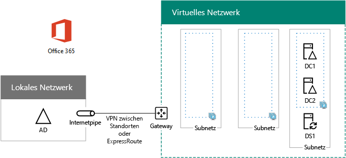

# <a name="high-availability-federated-authentication-phase-2-configure-domain-controllers"></a>Hochverfügbarkeit der Verbundauthentifizierung, Phase 2: Konfigurieren von Domänencontrollern

 **Zusammenfassung:** Konfigurieren Sie die Domänencontroller und Dirsync-Server für die hohe Verfügbarkeit Verbundauthentifizierung für Office 365 in Microsoft Azure.
  
In dieser Phase der Bereitstellung einer hohen Verfügbarkeit für die Office 365-Verbundauthentifizierung in den Azure-Infrastrukturdiensten konfigurieren Sie die beiden Domänencontroller und den DirSync-Server im virtuellen Azure-Netzwerk. Clientwebanforderungen für die Authentifizierung können dann im virtuellen Azure-Netzwerk authentifiziert werden, anstatt diesen Authentifizierungsverkehr über das VPN zwischen Standorten an Ihr lokales Netzwerk zu senden.
  
> [!NOTE]
> Active Directory Federation Services (AD FS) kann Azure Active Directory-Domänendienste nicht als Ersatz für Windows Server Active Directory-Domänencontroller verwenden. 
  
Sie müssen vor dem Verschieben auf in dieser Phase ausführen [hoher Verfügbarkeit federated Authentifizierung Phase 3: Konfigurieren von AD FS-Servern](high-availability-federated-authentication-phase-3-configure-ad-fs-servers.md). Finden Sie unter [Deploy hohe Verfügbarkeit Verbundauthentifizierung für Office 365 in Azure](deploy-high-availability-federated-authentication-for-office-365-in-azure.md) für alle Phasen.
  
## <a name="create-the-domain-controller-virtual-machines-in-azure"></a>Erstellen der Domänencontroller der virtuellen Computer in Azure

Zunächst müssen Sie der **Name des virtuellen Computers** -Spalte der Tabelle M ausfüllen und Größen virtueller Computer in der Spalte **Mindestgröße** Bedarf zu ändern.
  
|**Element**|**Name des virtuellen Computers**|**Bild aus der Galerie**|**Speichertyp**|**Mindestgröße**|
|:-----|:-----|:-----|:-----|:-----|
|1.  <br/> |______________ (erster Domänencontroller, Beispiel DC1)  <br/> |Windows Server 2016 Datacenter  <br/> |StandardLRS  <br/> |Standard_D2  <br/> |
|2.  <br/> |______________ (zweiter Domänencontroller, Beispiel DC2)  <br/> |Windows Server 2016 Datacenter  <br/> |StandardLRS  <br/> |Standard_D2  <br/> |
|3.  <br/> |___ (DirSync-Server, Beispiel DS1)  <br/> |Windows Server 2016 Datacenter  <br/> |StandardLRS  <br/> |Standard_D2  <br/> |
|4.  <br/> |___ (erster AD FS-Server, Beispiel ADFS1)  <br/> |Windows Server 2016 Datacenter  <br/> |StandardLRS  <br/> |Standard_D2  <br/> |
|5.  <br/> |___ (zweiter AD FS-Server, Beispiel ADFS2)  <br/> |Windows Server 2016 Datacenter  <br/> |StandardLRS  <br/> |Standard_D2  <br/> |
|6.  <br/> |______________ (erster Webanwendungsproxy-Server, Beispiel WEB1)  <br/> |Windows Server 2016 Datacenter  <br/> |StandardLRS  <br/> |Standard_D2  <br/> |
|7.  <br/> |______________ (zweiter Webanwendungsproxy-Server, Beispiel WEB2)  <br/> |Windows Server 2016 Datacenter  <br/> |StandardLRS  <br/> |Standard_D2  <br/> |
   
 **Tabelle M - virtueller Computer für die hohe Verfügbarkeit Verbundauthentifizierung für Office 365 in Azure**
  
Die vollständige Liste der Größen virtueller Computer finden Sie unter [Größen für virtuelle Computer](https://docs.microsoft.com/azure/virtual-machines/virtual-machines-windows-sizes).
  
Der folgende Azure PowerShell-Befehlsblock erstellt die virtuellen Computer für die beiden Domänencontroller. Geben Sie die Werte für die Variablen, entfernen die \< und > Zeichen. Beachten Sie, dass dieser Befehl-Block von Azure PowerShell Werte aus den folgenden Tabellen verwendet wird:
  
- Tabelle M (für die virtuellen Computer)
    
- Tabelle R (für die Ressourcengruppen)
    
- Tabelle V (für die Einstellungen des virtuellen Netzwerks)
    
- Tabelle S (für das Subnetz)
    
- Tabelle I (für die statischen IP-Adressen)
    
- Tabelle A (für die Verfügbarkeitsgruppen)
    
Denken Sie daran, dass Sie definierten Tabellen R, V, S, ich und in eine [hoher Verfügbarkeit federated Authentifizierung Phase 1: Konfigurieren von Azure](high-availability-federated-authentication-phase-1-configure-azure.md).
  
> [!NOTE]
> Verwenden Sie den folgenden Befehl wird die neueste Version von Azure PowerShell. Finden Sie unter [Erste Schritte mit Azure PowerShell-Cmdlets](https://docs.microsoft.com/en-us/powershell/azureps-cmdlets-docs/). 
  
Sobald Sie alle Werte korrekt festgelegt haben, führen Sie den resultierenden Block über die Azure PowerShell-Eingabeaufforderung oder in PowerShell ISE (Integrated Script Environment) auf Ihrem lokalen Computer aus.
  
> [!TIP]
> Eine Textdatei, die alle von PowerShell-Befehlen in diesem Artikel und Konfiguration Microsoft Excel-Arbeitsmappen, die generiert Ready-und-Los-PowerShell-Befehl Blöcke basierend auf Ihrer benutzerdefinierten Einstellungen enthält, finden Sie unter der [Federated-Authentifizierung für Office 365 in Azure Deployment Kit](https://gallery.technet.microsoft.com/Federated-Authentication-8a9f1664). 
  
```
# Set up variables common to both virtual machines
$locName="<your Azure location>"
$vnetName="<Table V - Item 1 - Value column>"
$subnetName="<Table S - Item 1 - Value column>"
$avName="<Table A - Item 1 - Availability set name column>"
$rgNameTier="<Table R - Item 1 - Resource group name column>"
$rgNameInfra="<Table R - Item 4 - Resource group name column>"

$rgName=$rgNameInfra
$vnet=Get-AzureRMVirtualNetwork -Name $vnetName -ResourceGroupName $rgName
$subnet=Get-AzureRmVirtualNetworkSubnetConfig -VirtualNetwork $vnet -Name $subnetName

$rgName=$rgNameTier
$avSet=Get-AzureRMAvailabilitySet -Name $avName -ResourceGroupName $rgName 

# Create the first domain controller
$vmName="<Table M - Item 1 - Virtual machine name column>"
$vmSize="<Table M - Item 1 - Minimum size column>"
$staticIP="<Table I - Item 1 - Value column>"
$diskStorageType="<Table M - Item 1 - Storage type column>"
$diskSize=<size of the extra disk for Windows Server AD data in GB>

$nic=New-AzureRMNetworkInterface -Name ($vmName +"-NIC") -ResourceGroupName $rgName -Location $locName -Subnet $subnet -PrivateIpAddress $staticIP
$vm=New-AzureRMVMConfig -VMName $vmName -VMSize $vmSize -AvailabilitySetId $avset.Id
$vm=Set-AzureRmVMOSDisk -VM $vm -Name ($vmName +"-OS") -DiskSizeInGB 128 -CreateOption FromImage -StorageAccountType $diskStorageType
$diskConfig=New-AzureRmDiskConfig -AccountType $diskStorageType -Location $locName -CreateOption Empty -DiskSizeGB $diskSize
$dataDisk1=New-AzureRmDisk -DiskName ($vmName + "-DataDisk1") -Disk $diskConfig -ResourceGroupName $rgName
$vm=Add-AzureRmVMDataDisk -VM $vm -Name ($vmName + "-DataDisk1") -CreateOption Attach -ManagedDiskId $dataDisk1.Id -Lun 1
$cred=Get-Credential -Message "Type the name and password of the local administrator account for the first domain controller." 
$vm=Set-AzureRMVMOperatingSystem -VM $vm -Windows -ComputerName $vmName -Credential $cred -ProvisionVMAgent -EnableAutoUpdate
$vm=Set-AzureRMVMSourceImage -VM $vm -PublisherName MicrosoftWindowsServer -Offer WindowsServer -Skus 2016-Datacenter -Version "latest"
$vm=Add-AzureRMVMNetworkInterface -VM $vm -Id $nic.Id
New-AzureRMVM -ResourceGroupName $rgName -Location $locName -VM $vm

# Create the second domain controller
$vmName="<Table M - Item 2 - Virtual machine name column>"
$vmSize="<Table M - Item 2 - Minimum size column>"
$staticIP="<Table I - Item 2 - Value column>"
$diskStorageType="<Table M - Item 2 - Storage type column>"
$diskSize=<size of the extra disk for Windows Server AD data in GB>

$nic=New-AzureRMNetworkInterface -Name ($vmName +"-NIC") -ResourceGroupName $rgName -Location $locName -Subnet $subnet -PrivateIpAddress $staticIP
$vm=New-AzureRMVMConfig -VMName $vmName -VMSize $vmSize -AvailabilitySetId $avset.Id
$vm=Set-AzureRmVMOSDisk -VM $vm -Name ($vmName +"-OS") -DiskSizeInGB 128 -CreateOption FromImage -StorageAccountType $diskStorageType
$diskConfig=New-AzureRmDiskConfig -AccountType $diskStorageType -Location $locName -CreateOption Empty -DiskSizeGB $diskSize
$dataDisk1=New-AzureRmDisk -DiskName ($vmName + "-DataDisk1") -Disk $diskConfig -ResourceGroupName $rgName
$vm=Add-AzureRmVMDataDisk -VM $vm -Name ($vmName + "-DataDisk1") -CreateOption Attach -ManagedDiskId $dataDisk1.Id -Lun 1
$cred=Get-Credential -Message "Type the name and password of the local administrator account for the second domain controller." 
$vm=Set-AzureRMVMOperatingSystem -VM $vm -Windows -ComputerName $vmName -Credential $cred -ProvisionVMAgent -EnableAutoUpdate
$vm=Set-AzureRMVMSourceImage -VM $vm -PublisherName MicrosoftWindowsServer -Offer WindowsServer -Skus 2016-Datacenter -Version "latest"
$vm=Add-AzureRMVMNetworkInterface -VM $vm -Id $nic.Id
New-AzureRMVM -ResourceGroupName $rgName -Location $locName -VM $vm

# Create the DirSync server
$vmName="<Table M - Item 3 - Virtual machine name column>"
$vmSize="<Table M - Item 3 - Minimum size column>"
$staticIP="<Table I - Item 3 - Value column>"
$diskStorageType="<Table M - Item 3 - Storage type column>"

$nic=New-AzureRMNetworkInterface -Name ($vmName +"-NIC") -ResourceGroupName $rgName -Location $locName -Subnet $subnet -PrivateIpAddress $staticIP
$vm=New-AzureRMVMConfig -VMName $vmName -VMSize $vmSize

$cred=Get-Credential -Message "Type the name and password of the local administrator account for the DirSync server." 
$vm=Set-AzureRMVMOperatingSystem -VM $vm -Windows -ComputerName $vmName -Credential $cred -ProvisionVMAgent -EnableAutoUpdate
$vm=Set-AzureRMVMSourceImage -VM $vm -PublisherName MicrosoftWindowsServer -Offer WindowsServer -Skus 2016-Datacenter -Version "latest"
$vm=Add-AzureRMVMNetworkInterface -VM $vm -Id $nic.Id
$vm=Set-AzureRmVMOSDisk -VM $vm -Name ($vmName +"-OS") -DiskSizeInGB 128 -CreateOption FromImage -StorageAccountType $diskStorageType
New-AzureRMVM -ResourceGroupName $rgName -Location $locName -VM $vm
```

> [!NOTE]
> Da diese virtuellen Maschinen für eine Intranetanwendung sind, sind keine öffentliche IP-Adresse oder eine Bezeichnung für DNS-Domäne zugewiesen und im Internet verfügbar gemacht. Dies bedeutet jedoch auch, dass Sie über das Portal Azure eine Verbindung ist nicht möglich. Die Option **Verbinden** ist nicht verfügbar, wenn Sie die Eigenschaften des virtuellen Computers anzeigen. Verwenden Sie die Remotedesktopverbindung Zubehör oder ein anderes Remotedesktop-Tool Verbindung mit dem virtuellen Computer mit privaten IP-Adresse oder Intranet DNS-Namen ein.
  
## <a name="configure-the-first-domain-controller"></a>Konfigurieren des ersten Domänencontrollers

Erstellen Sie mithilfe eines Remotedesktopclients Ihrer Wahl eine Remotedesktopverbindung zum virtuellen Computer mit dem ersten Domänencontroller. Verwenden Sie den Intranet-DNS-Namen oder den Computernamen des Servers und die Anmeldeinformationen des lokalen Administratorkontos.
  
Fügen Sie als Nächstes den zusätzlichen Datenträger mit dem ersten Domänencontroller mit diesem Befehl von einer Windows PowerShell-Eingabeaufforderung **auf dem ersten Domain Controller virtuellen Computer**:
  
```
Get-Disk | Where PartitionStyle -eq "RAW" | Initialize-Disk -PartitionStyle MBR -PassThru | New-Partition -AssignDriveLetter -UseMaximumSize | Format-Volume -FileSystem NTFS -NewFileSystemLabel "WSAD Data"
```

Im nächsten Schritt Testen der ersten Domänencontroller Konnektivität zu Speicherorten im Netzwerk Ihrer Organisation mithilfe des **Ping** -Befehls ping und IP-Adressen von Ressourcen im Netzwerk Ihrer Organisation.
  
Gleichzeitig stellen Sie damit sicher, dass die DNS-Namensauflösung korrekt funktioniert (d. h., dass der virtuelle Computer korrekt mit denlokalen DNS-Servern konfiguriert ist) und dass Pakete sowohl an das standortübergreifende Netzwerk als auch aus ihm gesendet werden können. Wenn bei diesem grundlegenden Test ein Fehler auftritt, wenden Sie sich an Ihre IT-Abteilung, um die Probleme mit der DNS-Namensauflösung und der Paketzustellung zu lösen.
  
Führen Sie im nächsten Schritt an der Windows PowerShell-Eingabeaufforderung auf dem ersten Domänencontroller die folgenden Befehle aus:
  
```
$domname="<DNS domain name of the domain for which this computer will be a domain controller, such as corp.contoso.com>"
$cred = Get-Credential -Message "Enter credentials of an account with permission to join a new domain controller to the domain"
Install-WindowsFeature AD-Domain-Services -IncludeManagementTools
Install-ADDSDomainController -InstallDns -DomainName $domname  -DatabasePath "F:\\NTDS" -SysvolPath "F:\\SYSVOL" -LogPath "F:\\Logs" -Credential $cred
```

Sie werden aufgefordert, die Anmeldeinformationen für ein Domänenadministratorkonto einzugeben. Der Computer wird neu gestartet.
  
## <a name="configure-the-second-domain-controller"></a>Konfigurieren des zweiten Domänencontrollers

Erstellen Sie mithilfe eines Remotedesktopclients Ihrer Wahl eine Remotedesktopverbindung zum virtuellen Computer mit dem zweiten Domänencontroller. Verwenden Sie den Intranet-DNS-Namen oder den Computernamen des Servers und die Anmeldeinformationen des lokalen Administratorkontos.
  
Als Nächstes müssen Sie den zusätzlichen Daten Datenträger auf den zweiten Domänencontroller mit diesem Befehl von einer Windows PowerShell-Eingabeaufforderung **auf dem zweiten Domain Controller virtuellen Computer**hinzufügen:
  
```
Get-Disk | Where PartitionStyle -eq "RAW" | Initialize-Disk -PartitionStyle MBR -PassThru | New-Partition -AssignDriveLetter -UseMaximumSize | Format-Volume -FileSystem NTFS -NewFileSystemLabel "WSAD Data"
```

Führen Sie als nächsten Schritt die folgenden Befehle aus:
  
```
$domname="<DNS domain name of the domain for which this computer will be a domain controller, such as corp.contoso.com>"
$cred = Get-Credential -Message "Enter credentials of an account with permission to join a new domain controller to the domain"
Install-WindowsFeature AD-Domain-Services -IncludeManagementTools
Install-ADDSDomainController -InstallDns -DomainName $domname  -DatabasePath "F:\\NTDS" -SysvolPath "F:\\SYSVOL" -LogPath "F:\\Logs" -Credential $cred

```

Sie werden aufgefordert, die Anmeldeinformationen für ein Domänenadministratorkonto einzugeben. Der Computer wird neu gestartet.
  
Im nächsten Schritt müssen Sie die DNS-Server für das virtuelle Netzwerk aktualisieren, damit dieser Azure virtuelle Computer zwei neue Domänencontroller als DNS-Server verwenden die IP-Adressen zugewiesen. Füllen Sie die Variablen, und führen Sie diese Befehle von einer Windows PowerShell-Eingabeaufforderung auf dem lokalen Computer:
  
```
$rgName="<Table R - Item 4 - Resource group name column>"
$adrgName="<Table R - Item 1 - Resource group name column>"
$locName="<your Azure location>"
$vnetName="<Table V - Item 1 - Value column>"
$onpremDNSIP1="<Table D - Item 1 - DNS server IP address column>"
$onpremDNSIP2="<Table D - Item 2 - DNS server IP address column>"
$staticIP1="<Table I - Item 1 - Value column>"
$staticIP2="<Table I - Item 2 - Value column>"
$firstDCName="<Table M - Item 1 - Virtual machine name column>"
$secondDCName="<Table M - Item 2 - Virtual machine name column>"

$vnet=Get-AzureRMVirtualNetwork -ResourceGroupName $rgName -Name $vnetName
$vnet.DhcpOptions.DnsServers.Add($staticIP1)
$vnet.DhcpOptions.DnsServers.Add($staticIP2) 
$vnet.DhcpOptions.DnsServers.Remove($onpremDNSIP1)
$vnet.DhcpOptions.DnsServers.Remove($onpremDNSIP2) 
Set-AzureRMVirtualNetwork -VirtualNetwork $vnet
Restart-AzureRMVM -ResourceGroupName $adrgName -Name $firstDCName
Restart-AzureRMVM -ResourceGroupName $adrgName -Name $secondDCName
```

Beachten Sie, dass die beiden Domänencontroller neu gestartet werden, damit sie nicht mit den lokalen DNS-Server als DNS-Server konfiguriert werden. Da beide selbst DNS-Server sind, wurden sie bei der Höherstufung zu Domänencontrollern automatisch mit den lokalen DNS-Servern als DNS-Weiterleitungen konfiguriert.
  
Als Nächstes müssen wir eine Active Directory-Replikationswebsite erstellen, um sicherzustellen, dass Server im virtuellen Azure-Netzwerk die lokalen Domänencontroller verwenden. Stellen Sie mit einem Domänenadministratorkonto eine Verbindung zu einem der Domänencontroller her, und führen Sie folgende Befehle an einer Windows PowerShell-Eingabeaufforderung auf Administratorebene aus:
  
```
$vnet="<Table V - Item 1 - Value column>"
$vnetSpace="<Table V - Item 4 - Value column>"
New-ADReplicationSite -Name $vnet 
New-ADReplicationSubnet -Name $vnetSpace -Site $vnet
```

## <a name="configure-the-dirsync-server"></a>Konfigurieren des DirSync-Servers

Verwenden Sie den remote desktop Client Ihrer Wahl, und erstellen Sie eine Remotedesktopverbindung Dirsync-Server am virtuellen Computer. Verwenden Sie dem Intranet Computer oder DNS-Namen und die Anmeldeinformationen für das lokale Administratorkonto.
  
Verknüpfen Sie als nächstes unter Verwendung der folgenden Befehle an einer Windows PowerShell-Eingabeaufforderung diesen mit der entsprechenden Windows Server AD-Domäne.
  
```
$domName="<Windows Server AD domain name to join, such as corp.contoso.com>"
$cred=Get-Credential -Message "Type the name and password of a domain acccount."
Add-Computer -DomainName $domName -Credential $cred
Restart-Computer
```

Wenn Sie diese Phase erfolgreich abgeschlossen haben, sieht Ihre Konfiguration wie folgt aus. Für die Computernamen werden hier Platzhalter verwendet.
  
**Phase 2: Die Domänencontroller und Dirsync-Server für eine hohe Verfügbarkeit Verbundauthentifizierung-Infrastruktur in Azure**


  
## <a name="next-step"></a>Nächster Schritt

Verwendung [hoher Verfügbarkeit federated Authentifizierung Phase 3: Konfigurieren von AD FS-Servern](high-availability-federated-authentication-phase-3-configure-ad-fs-servers.md) Konfiguration von Arbeitslast fortzufahren.
  
## <a name="see-also"></a>Weitere Artikel

[Bereitstellen der Verbundauthentifizierung mit Hochverfügbarkeit für Office 365 in Azure](deploy-high-availability-federated-authentication-for-office-365-in-azure.md)
  
[Verbundidentität für Ihre Office 365-Entwicklungs-/Testumgebung](federated-identity-for-your-office-365-dev-test-environment.md)
  
[Cloudakzeptanz und Hybridlösungen](cloud-adoption-and-hybrid-solutions.md)

[Verbundidentität für Office 365](https://support.office.com/article/Understanding-Office-365-identity-and-Azure-Active-Directory-06a189e7-5ec6-4af2-94bf-a22ea225a7a9#bk_federated)


