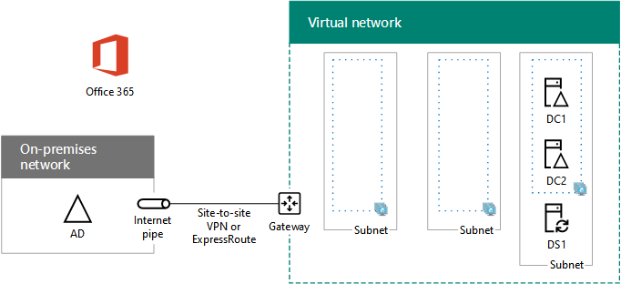

# <a name="high-availability-federated-authentication-phase-2-configure-domain-controllers"></a><span data-ttu-id="051ce-103">Hochverfügbarkeit der Verbundauthentifizierung, Phase 2: Konfigurieren von Domänencontrollern</span><span class="sxs-lookup"><span data-stu-id="051ce-103">High availability federated authentication Phase 2: Configure domain controllers</span></span>

 <span data-ttu-id="051ce-104">**Zusammenfassung:** Konfigurieren Sie die Domänencontroller und DirSync-Server für die Verbundauthentifzierung mit hoher Verfügbarkeit für Office 365 in Microsoft Azure.</span><span class="sxs-lookup"><span data-stu-id="051ce-104">**Summary:** Configure the domain controllers and DirSync server for your high availability federated authentication for Office 365 in Microsoft Azure.</span></span>
  
<span data-ttu-id="051ce-p101">In dieser Phase der Bereitstellung einer hohen Verfügbarkeit für die Office 365-Verbundauthentifizierung in den Azure-Infrastrukturdiensten konfigurieren Sie die beiden Domänencontroller und den DirSync-Server im virtuellen Azure-Netzwerk. Clientwebanforderungen für die Authentifizierung können dann im virtuellen Azure-Netzwerk authentifiziert werden, anstatt diesen Authentifizierungsverkehr über das VPN zwischen Standorten an Ihr lokales Netzwerk zu senden.</span><span class="sxs-lookup"><span data-stu-id="051ce-p101">In this phase of deploying high availability for Office 365 federated authentication in Azure infrastructure services, you configure two domain controllers and the DirSync server in the Azure virtual network. Client web requests for authentication can then be authenticated in the Azure virtual network, rather than sending that authentication traffic across the site-to-site VPN connection to your on-premises network.</span></span>
  
> [!NOTE]
> <span data-ttu-id="051ce-107">Active Directory Verbunddienste (AD FS) können Azure Active Directory-Domänendienste nicht als Ersatz für Active Directory-Domänendienste Domänencontroller verwenden.</span><span class="sxs-lookup"><span data-stu-id="051ce-107">Active Directory Federation Services (AD FS) cannot use Azure Active Directory Domain Services as a substitute for Active Directory Domain Services domain controllers.</span></span> 
  
<span data-ttu-id="051ce-108">Sie müssen diese Phase abschließen, bevor Sie mit [High availability federated authentication Phase 3: Configure AD FS servers](high-availability-federated-authentication-phase-3-configure-ad-fs-servers.md) fortfahren können.</span><span class="sxs-lookup"><span data-stu-id="051ce-108">You must complete this phase before moving on to [High availability federated authentication Phase 3: Configure AD FS servers](high-availability-federated-authentication-phase-3-configure-ad-fs-servers.md).</span></span> <span data-ttu-id="051ce-109">Eine Übersicht über alle Phasen finden Sie unter [Bereitstellen der Verbundauthentifizierung mit Hochverfügbarkeit für Office 365 in Azure](deploy-high-availability-federated-authentication-for-office-365-in-azure.md).</span><span class="sxs-lookup"><span data-stu-id="051ce-109">See [Deploy high availability federated authentication for Office 365 in Azure](deploy-high-availability-federated-authentication-for-office-365-in-azure.md) for all of the phases.</span></span>
  
## <a name="create-the-domain-controller-virtual-machines-in-azure"></a><span data-ttu-id="051ce-110">Erstellen der Domänencontroller der virtuellen Computer in Azure</span><span class="sxs-lookup"><span data-stu-id="051ce-110">Create the domain controller virtual machines in Azure</span></span>

<span data-ttu-id="051ce-111">Zunächst müssen Sie die Spalte **Name des virtuellen Computers** in Tabelle M ausfüllen und in der Spalte **Mindestgröße** die Größe der einzelnen virtuellen Computer nach Bedarf anpassen.</span><span class="sxs-lookup"><span data-stu-id="051ce-111">First, you need to fill out the **Virtual machine name** column of Table M and modify virtual machine sizes as needed in the **Minimum size** column.</span></span>
  
|<span data-ttu-id="051ce-112">**Element**</span><span class="sxs-lookup"><span data-stu-id="051ce-112">**Item**</span></span>|<span data-ttu-id="051ce-113">**Name des virtuellen Computers**</span><span class="sxs-lookup"><span data-stu-id="051ce-113">**Virtual machine name**</span></span>|<span data-ttu-id="051ce-114">**Katalogbild**</span><span class="sxs-lookup"><span data-stu-id="051ce-114">**Gallery image**</span></span>|<span data-ttu-id="051ce-115">**Speichertyp**</span><span class="sxs-lookup"><span data-stu-id="051ce-115">**Storage type**</span></span>|<span data-ttu-id="051ce-116">**Mindestgröße**</span><span class="sxs-lookup"><span data-stu-id="051ce-116">**Minimum size**</span></span>|
|:-----|:-----|:-----|:-----|:-----|
|<span data-ttu-id="051ce-117">1.</span><span class="sxs-lookup"><span data-stu-id="051ce-117">1.</span></span>  <br/> |<span data-ttu-id="051ce-118"> (erster Domänencontroller, Beispiel DC1)</span><span class="sxs-lookup"><span data-stu-id="051ce-118"> (first domain controller, example DC1)</span></span>  <br/> |<span data-ttu-id="051ce-119">Windows Server 2016 Datacenter</span><span class="sxs-lookup"><span data-stu-id="051ce-119">Windows Server 2016 Datacenter</span></span>  <br/> |<span data-ttu-id="051ce-120">Standard_LRS</span><span class="sxs-lookup"><span data-stu-id="051ce-120">Standard_LRS</span></span>  <br/> |<span data-ttu-id="051ce-121">Standard_D2</span><span class="sxs-lookup"><span data-stu-id="051ce-121">Standard_D2</span></span>  <br/> |
|<span data-ttu-id="051ce-122">2.</span><span class="sxs-lookup"><span data-stu-id="051ce-122">2.</span></span>  <br/> |<span data-ttu-id="051ce-123"> (zweiter Domänencontroller, Beispiel DC2)</span><span class="sxs-lookup"><span data-stu-id="051ce-123"> (second domain controller, example DC2)</span></span>  <br/> |<span data-ttu-id="051ce-124">Windows Server 2016 Datacenter</span><span class="sxs-lookup"><span data-stu-id="051ce-124">Windows Server 2016 Datacenter</span></span>  <br/> |<span data-ttu-id="051ce-125">Standard_LRS</span><span class="sxs-lookup"><span data-stu-id="051ce-125">Standard_LRS</span></span>  <br/> |<span data-ttu-id="051ce-126">Standard_D2</span><span class="sxs-lookup"><span data-stu-id="051ce-126">Standard_D2</span></span>  <br/> |
|<span data-ttu-id="051ce-127">3.</span><span class="sxs-lookup"><span data-stu-id="051ce-127">3.</span></span>  <br/> |<span data-ttu-id="051ce-128">(Dirsync-Server, Beispiel ds1)</span><span class="sxs-lookup"><span data-stu-id="051ce-128"> (DirSync server, example DS1)</span></span>  <br/> |<span data-ttu-id="051ce-129">Windows Server 2016 Datacenter</span><span class="sxs-lookup"><span data-stu-id="051ce-129">Windows Server 2016 Datacenter</span></span>  <br/> |<span data-ttu-id="051ce-130">Standard_LRS</span><span class="sxs-lookup"><span data-stu-id="051ce-130">Standard_LRS</span></span>  <br/> |<span data-ttu-id="051ce-131">Standard_D2</span><span class="sxs-lookup"><span data-stu-id="051ce-131">Standard_D2</span></span>  <br/> |
|<span data-ttu-id="051ce-132">4.</span><span class="sxs-lookup"><span data-stu-id="051ce-132">4.</span></span>  <br/> |<span data-ttu-id="051ce-133">(erster AD FS-Server, Beispiel ADFS1)</span><span class="sxs-lookup"><span data-stu-id="051ce-133"> (first AD FS server, example ADFS1)</span></span>  <br/> |<span data-ttu-id="051ce-134">Windows Server 2016 Datacenter</span><span class="sxs-lookup"><span data-stu-id="051ce-134">Windows Server 2016 Datacenter</span></span>  <br/> |<span data-ttu-id="051ce-135">Standard_LRS</span><span class="sxs-lookup"><span data-stu-id="051ce-135">Standard_LRS</span></span>  <br/> |<span data-ttu-id="051ce-136">Standard_D2</span><span class="sxs-lookup"><span data-stu-id="051ce-136">Standard_D2</span></span>  <br/> |
|<span data-ttu-id="051ce-137">5.</span><span class="sxs-lookup"><span data-stu-id="051ce-137">5.</span></span>  <br/> |<span data-ttu-id="051ce-138">(zweiter AD FS-Server, Beispiel ADFS2)</span><span class="sxs-lookup"><span data-stu-id="051ce-138"> (second AD FS server, example ADFS2)</span></span>  <br/> |<span data-ttu-id="051ce-139">Windows Server 2016 Datacenter</span><span class="sxs-lookup"><span data-stu-id="051ce-139">Windows Server 2016 Datacenter</span></span>  <br/> |<span data-ttu-id="051ce-140">Standard_LRS</span><span class="sxs-lookup"><span data-stu-id="051ce-140">Standard_LRS</span></span>  <br/> |<span data-ttu-id="051ce-141">Standard_D2</span><span class="sxs-lookup"><span data-stu-id="051ce-141">Standard_D2</span></span>  <br/> |
|<span data-ttu-id="051ce-142">6.</span><span class="sxs-lookup"><span data-stu-id="051ce-142">6.</span></span>  <br/> |<span data-ttu-id="051ce-143">(erster Webanwendungs-Proxy Server, Beispiel WEB1)</span><span class="sxs-lookup"><span data-stu-id="051ce-143"> (first web application proxy server, example WEB1)</span></span>  <br/> |<span data-ttu-id="051ce-144">Windows Server 2016 Datacenter</span><span class="sxs-lookup"><span data-stu-id="051ce-144">Windows Server 2016 Datacenter</span></span>  <br/> |<span data-ttu-id="051ce-145">Standard_LRS</span><span class="sxs-lookup"><span data-stu-id="051ce-145">Standard_LRS</span></span>  <br/> |<span data-ttu-id="051ce-146">Standard_D2</span><span class="sxs-lookup"><span data-stu-id="051ce-146">Standard_D2</span></span>  <br/> |
|<span data-ttu-id="051ce-147">7.</span><span class="sxs-lookup"><span data-stu-id="051ce-147">7.</span></span>  <br/> |<span data-ttu-id="051ce-148">(zweiter Webanwendungs-Proxy Server, Beispiel web2)</span><span class="sxs-lookup"><span data-stu-id="051ce-148"> (second web application proxy server, example WEB2)</span></span>  <br/> |<span data-ttu-id="051ce-149">Windows Server 2016 Datacenter</span><span class="sxs-lookup"><span data-stu-id="051ce-149">Windows Server 2016 Datacenter</span></span>  <br/> |<span data-ttu-id="051ce-150">Standard_LRS</span><span class="sxs-lookup"><span data-stu-id="051ce-150">Standard_LRS</span></span>  <br/> |<span data-ttu-id="051ce-151">Standard_D2</span><span class="sxs-lookup"><span data-stu-id="051ce-151">Standard_D2</span></span>  <br/> |
   
 <span data-ttu-id="051ce-152">**Tabelle M – virtuelle Computer für die Verbundauthentifizierung mit hoher Verfügbarkeit für Office 365 in Azure**</span><span class="sxs-lookup"><span data-stu-id="051ce-152">**Table M - Virtual machines for the high availability federated authentication for Office 365 in Azure**</span></span>
  
<span data-ttu-id="051ce-153">Eine vollständige Liste der Größen der virtuellen Computer finden Sie unter [Größen für virtuelle Computer](https://docs.microsoft.com/azure/virtual-machines/virtual-machines-windows-sizes).</span><span class="sxs-lookup"><span data-stu-id="051ce-153">For the complete list of virtual machine sizes, see [Sizes for virtual machines](https://docs.microsoft.com/azure/virtual-machines/virtual-machines-windows-sizes).</span></span>
  
<span data-ttu-id="051ce-154">Verwenden Sie den folgenden Azure PowerShell-Befehlsblock, um die virtuellen Computer für die beiden Domänencontroller zu erstellen.</span><span class="sxs-lookup"><span data-stu-id="051ce-154">The following Azure PowerShell command block creates the virtual machines for the two domain controllers.</span></span> <span data-ttu-id="051ce-155">Geben Sie die Werte für die Variablen an, \< und entfernen Sie die Zeichen und #a0.</span><span class="sxs-lookup"><span data-stu-id="051ce-155">Specify the values for the variables, removing the \< and > characters.</span></span> <span data-ttu-id="051ce-156">Beachten Sie, dass dieser Azure PowerShell-Befehlsblock Werte aus den folgenden Tabellen verwendet:</span><span class="sxs-lookup"><span data-stu-id="051ce-156">Note that this Azure PowerShell command block uses values from the following tables:</span></span>
  
- <span data-ttu-id="051ce-157">Tabelle M (für die virtuellen Computer)</span><span class="sxs-lookup"><span data-stu-id="051ce-157">Table M, for your virtual machines</span></span>
    
- <span data-ttu-id="051ce-158">Tabelle R (für die Ressourcengruppen)</span><span class="sxs-lookup"><span data-stu-id="051ce-158">Table R, for your resource groups</span></span>
    
- <span data-ttu-id="051ce-159">Tabelle V (für die Einstellungen des virtuellen Netzwerks)</span><span class="sxs-lookup"><span data-stu-id="051ce-159">Table V, for your virtual network settings</span></span>
    
- <span data-ttu-id="051ce-160">Tabelle S (für das Subnetz)</span><span class="sxs-lookup"><span data-stu-id="051ce-160">Table S, for your subnets</span></span>
    
- <span data-ttu-id="051ce-161">Tabelle I (für die statischen IP-Adressen)</span><span class="sxs-lookup"><span data-stu-id="051ce-161">Table I, for your static IP addresses</span></span>
    
- <span data-ttu-id="051ce-162">Tabelle A (für die Verfügbarkeitsgruppen)</span><span class="sxs-lookup"><span data-stu-id="051ce-162">Table A, for your availability sets</span></span>
    
<span data-ttu-id="051ce-163">Erinnern Sie sich, dass Sie die Tabellen R, V, S, I und A in der [Verbundauthentifizierung mit hoher Verfügbarkeit definiert haben, Phase 1: Konfigurieren von Azure](high-availability-federated-authentication-phase-1-configure-azure.md).</span><span class="sxs-lookup"><span data-stu-id="051ce-163">Recall that you defined Tables R, V, S, I, and A in [High availability federated authentication Phase 1: Configure Azure](high-availability-federated-authentication-phase-1-configure-azure.md).</span></span>
  
> [!NOTE]
> <span data-ttu-id="051ce-p104">In den folgenden Befehlssätzen wird die aktuelle Version von Azure PowerShell verwendet. Informationen dazu finden Sie unter [Get started with Azure PowerShell cmdlets](https://docs.microsoft.com/powershell/azureps-cmdlets-docs/).</span><span class="sxs-lookup"><span data-stu-id="051ce-p104">The following command sets use the latest version of Azure PowerShell. See [Get started with Azure PowerShell cmdlets](https://docs.microsoft.com/powershell/azureps-cmdlets-docs/).</span></span> 
  
<span data-ttu-id="051ce-166">Sobald Sie alle Werte korrekt festgelegt haben, führen Sie den resultierenden Block über die Azure PowerShell-Eingabeaufforderung oder in PowerShell ISE (Integrated Script Environment) auf Ihrem lokalen Computer aus.</span><span class="sxs-lookup"><span data-stu-id="051ce-166">When you have supplied all the correct values, run the resulting block at the Azure PowerShell prompt or in the PowerShell Integrated Script Environment (ISE) on your local computer.</span></span>
  
```powershell
# Set up variables common to both virtual machines
$locName="<your Azure location>"
$vnetName="<Table V - Item 1 - Value column>"
$subnetName="<Table S - Item 1 - Value column>"
$avName="<Table A - Item 1 - Availability set name column>"
$rgNameTier="<Table R - Item 1 - Resource group name column>"
$rgNameInfra="<Table R - Item 4 - Resource group name column>"

$rgName=$rgNameInfra
$vnet=Get-AzVirtualNetwork -Name $vnetName -ResourceGroupName $rgName
$subnet=Get-AzVirtualNetworkSubnetConfig -VirtualNetwork $vnet -Name $subnetName

$rgName=$rgNameTier
$avSet=Get-AzAvailabilitySet -Name $avName -ResourceGroupName $rgName 

# Create the first domain controller
$vmName="<Table M - Item 1 - Virtual machine name column>"
$vmSize="<Table M - Item 1 - Minimum size column>"
$staticIP="<Table I - Item 1 - Value column>"
$diskStorageType="<Table M - Item 1 - Storage type column>"
$diskSize=<size of the extra disk for Active Directory Domain Services (AD DS) data in GB>

$nic=New-AzNetworkInterface -Name ($vmName +"-NIC") -ResourceGroupName $rgName -Location $locName -Subnet $subnet -PrivateIpAddress $staticIP
$vm=New-AzVMConfig -VMName $vmName -VMSize $vmSize -AvailabilitySetId $avset.Id
$vm=Set-AzVMOSDisk -VM $vm -Name ($vmName +"-OS") -DiskSizeInGB 128 -CreateOption FromImage -StorageAccountType $diskStorageType
$diskConfig=New-AzDiskConfig -AccountType $diskStorageType -Location $locName -CreateOption Empty -DiskSizeGB $diskSize
$dataDisk1=New-AzDisk -DiskName ($vmName + "-DataDisk1") -Disk $diskConfig -ResourceGroupName $rgName
$vm=Add-AzVMDataDisk -VM $vm -Name ($vmName + "-DataDisk1") -CreateOption Attach -ManagedDiskId $dataDisk1.Id -Lun 1
$cred=Get-Credential -Message "Type the name and password of the local administrator account for the first domain controller." 
$vm=Set-AzVMOperatingSystem -VM $vm -Windows -ComputerName $vmName -Credential $cred -ProvisionVMAgent -EnableAutoUpdate
$vm=Set-AzVMSourceImage -VM $vm -PublisherName MicrosoftWindowsServer -Offer WindowsServer -Skus 2016-Datacenter -Version "latest"
$vm=Add-AzVMNetworkInterface -VM $vm -Id $nic.Id
New-AzVM -ResourceGroupName $rgName -Location $locName -VM $vm

# Create the second domain controller
$vmName="<Table M - Item 2 - Virtual machine name column>"
$vmSize="<Table M - Item 2 - Minimum size column>"
$staticIP="<Table I - Item 2 - Value column>"
$diskStorageType="<Table M - Item 2 - Storage type column>"
$diskSize=<size of the extra disk for AD DS data in GB>

$nic=New-AzNetworkInterface -Name ($vmName +"-NIC") -ResourceGroupName $rgName -Location $locName -Subnet $subnet -PrivateIpAddress $staticIP
$vm=New-AzVMConfig -VMName $vmName -VMSize $vmSize -AvailabilitySetId $avset.Id
$vm=Set-AzVMOSDisk -VM $vm -Name ($vmName +"-OS") -DiskSizeInGB 128 -CreateOption FromImage -StorageAccountType $diskStorageType
$diskConfig=New-AzDiskConfig -AccountType $diskStorageType -Location $locName -CreateOption Empty -DiskSizeGB $diskSize
$dataDisk1=New-AzDisk -DiskName ($vmName + "-DataDisk1") -Disk $diskConfig -ResourceGroupName $rgName
$vm=Add-AzVMDataDisk -VM $vm -Name ($vmName + "-DataDisk1") -CreateOption Attach -ManagedDiskId $dataDisk1.Id -Lun 1
$cred=Get-Credential -Message "Type the name and password of the local administrator account for the second domain controller." 
$vm=Set-AzVMOperatingSystem -VM $vm -Windows -ComputerName $vmName -Credential $cred -ProvisionVMAgent -EnableAutoUpdate
$vm=Set-AzVMSourceImage -VM $vm -PublisherName MicrosoftWindowsServer -Offer WindowsServer -Skus 2016-Datacenter -Version "latest"
$vm=Add-AzVMNetworkInterface -VM $vm -Id $nic.Id
New-AzVM -ResourceGroupName $rgName -Location $locName -VM $vm

# Create the DirSync server
$vmName="<Table M - Item 3 - Virtual machine name column>"
$vmSize="<Table M - Item 3 - Minimum size column>"
$staticIP="<Table I - Item 3 - Value column>"
$diskStorageType="<Table M - Item 3 - Storage type column>"

$nic=New-AzNetworkInterface -Name ($vmName +"-NIC") -ResourceGroupName $rgName -Location $locName -Subnet $subnet -PrivateIpAddress $staticIP
$vm=New-AzVMConfig -VMName $vmName -VMSize $vmSize

$cred=Get-Credential -Message "Type the name and password of the local administrator account for the DirSync server." 
$vm=Set-AzVMOperatingSystem -VM $vm -Windows -ComputerName $vmName -Credential $cred -ProvisionVMAgent -EnableAutoUpdate
$vm=Set-AzVMSourceImage -VM $vm -PublisherName MicrosoftWindowsServer -Offer WindowsServer -Skus 2016-Datacenter -Version "latest"
$vm=Add-AzVMNetworkInterface -VM $vm -Id $nic.Id
$vm=Set-AzVMOSDisk -VM $vm -Name ($vmName +"-OS") -DiskSizeInGB 128 -CreateOption FromImage -StorageAccountType $diskStorageType
New-AzVM -ResourceGroupName $rgName -Location $locName -VM $vm
```

> [!NOTE]
> <span data-ttu-id="051ce-p105">Da diese virtuellen Computer für eine Intranetanwendung gedacht sind, wird ihnen weder eine öffentliche IP-Adresse noch eine DNS-Domänennamenbezeichnung zugewiesen. Sie sind also nicht über das Internet erreichbar. Das bedeutet allerdings, dass Sie auch nicht über das Azure-Portal auf sie zugreifen können. Wenn Sie die Eigenschaften eines der virtuellen Computer aufrufen, ist die Option zum **Verbinden**nicht verfügbar. Verwenden Sie eine Remotedesktopverbindung oder ein anderes Remotedesktoptool, um eine Verbindung über die private IP-Adresse des betreffenden virtuellen Computers oder seinen Intranet-DNS-Namen herzustellen.</span><span class="sxs-lookup"><span data-stu-id="051ce-p105">Because these virtual machines are for an intranet application, they are not assigned a public IP address or a DNS domain name label and exposed to the Internet. However, this also means that you cannot connect to them from the Azure portal. The **Connect** option is unavailable when you view the properties of the virtual machine. Use the Remote Desktop Connection accessory or another Remote Desktop tool to connect to the virtual machine using its private IP address or intranet DNS name.</span></span>
  
## <a name="configure-the-first-domain-controller"></a><span data-ttu-id="051ce-171">Konfigurieren des ersten Domänencontrollers</span><span class="sxs-lookup"><span data-stu-id="051ce-171">Configure the first domain controller</span></span>

<span data-ttu-id="051ce-p106">Erstellen Sie mithilfe eines Remotedesktopclients Ihrer Wahl eine Remotedesktopverbindung zum virtuellen Computer mit dem ersten Domänencontroller. Verwenden Sie den Intranet-DNS-Namen oder den Computernamen des Servers und die Anmeldeinformationen des lokalen Administratorkontos.</span><span class="sxs-lookup"><span data-stu-id="051ce-p106">Use the remote desktop client of your choice and create a remote desktop connection to the first domain controller virtual machine. Use its intranet DNS or computer name and the credentials of the local administrator account.</span></span>
  
<span data-ttu-id="051ce-174">Als Nächstes fügen Sie den zusätzlichen Datenträger dem ersten Domänencontroller mit diesem Befehl an einer Windows PowerShell Eingabeaufforderung **auf dem ersten virtuellen Domänencontroller-Computer**hinzu:</span><span class="sxs-lookup"><span data-stu-id="051ce-174">Next, add the extra data disk to the first domain controller with this command from a Windows PowerShell command prompt **on the first domain controller virtual machine**:</span></span>
  
```powershell
Get-Disk | Where PartitionStyle -eq "RAW" | Initialize-Disk -PartitionStyle MBR -PassThru | New-Partition -AssignDriveLetter -UseMaximumSize | Format-Volume -FileSystem NTFS -NewFileSystemLabel "WSAD Data"
```

<span data-ttu-id="051ce-175">Im nächsten Schritt testen Sie die Verbindung des ersten Domänencontrollers mit Standorten im Netzwerk Ihrer Organisation mithilfe des Befehls **ping** aus, um einen Ping an die Namen und IP-Adressen von Ressourcen innerhalb des Netzwerks Ihrer Organisation zu senden.</span><span class="sxs-lookup"><span data-stu-id="051ce-175">Next, test the first domain controller's connectivity to locations on your organization network by using the **ping** command to ping names and IP addresses of resources on your organization network.</span></span>
  
<span data-ttu-id="051ce-p107">Gleichzeitig stellen Sie damit sicher, dass die DNS-Namensauflösung korrekt funktioniert (d. h., dass der virtuelle Computer korrekt mit denlokalen DNS-Servern konfiguriert ist) und dass Pakete sowohl an das standortübergreifende Netzwerk als auch aus ihm gesendet werden können. Wenn bei diesem grundlegenden Test ein Fehler auftritt, wenden Sie sich an Ihre IT-Abteilung, um die Probleme mit der DNS-Namensauflösung und der Paketzustellung zu lösen.</span><span class="sxs-lookup"><span data-stu-id="051ce-p107">This procedure ensures that DNS name resolution is working correctly (that the virtual machine is correctly configured with on-premises DNS servers) and that packets can be sent to and from the cross-premises virtual network. If this basic test fails, contact your IT department to troubleshoot the DNS name resolution and packet delivery issues.</span></span>
  
<span data-ttu-id="051ce-178">Führen Sie im nächsten Schritt an der Windows PowerShell-Eingabeaufforderung auf dem ersten Domänencontroller die folgenden Befehle aus:</span><span class="sxs-lookup"><span data-stu-id="051ce-178">Next, from the Windows PowerShell command prompt on the first domain controller, run the following commands:</span></span>
  
```powershell
$domname="<DNS domain name of the domain for which this computer will be a domain controller, such as corp.contoso.com>"
$cred = Get-Credential -Message "Enter credentials of an account with permission to join a new domain controller to the domain"
Install-WindowsFeature AD-Domain-Services -IncludeManagementTools
Install-ADDSDomainController -InstallDns -DomainName $domname  -DatabasePath "F:\NTDS" -SysvolPath "F:\SYSVOL" -LogPath "F:\Logs" -Credential $cred
```

<span data-ttu-id="051ce-p108">Sie werden aufgefordert, die Anmeldeinformationen für ein Domänenadministratorkonto einzugeben. Der Computer wird neu gestartet.</span><span class="sxs-lookup"><span data-stu-id="051ce-p108">You will be prompted to supply the credentials of a domain administrator account. The computer will restart.</span></span>
  
## <a name="configure-the-second-domain-controller"></a><span data-ttu-id="051ce-181">Konfigurieren des zweiten Domänencontrollers</span><span class="sxs-lookup"><span data-stu-id="051ce-181">Configure the second domain controller</span></span>

<span data-ttu-id="051ce-p109">Erstellen Sie mithilfe eines Remotedesktopclients Ihrer Wahl eine Remotedesktopverbindung zum virtuellen Computer mit dem zweiten Domänencontroller. Verwenden Sie den Intranet-DNS-Namen oder den Computernamen des Servers und die Anmeldeinformationen des lokalen Administratorkontos.</span><span class="sxs-lookup"><span data-stu-id="051ce-p109">Use the remote desktop client of your choice and create a remote desktop connection to the second domain controller virtual machine. Use its intranet DNS or computer name and the credentials of the local administrator account.</span></span>
  
<span data-ttu-id="051ce-184">Als nächstes müssen Sie den zusätzlichen Datenträger dem zweiten Domänencontroller mit diesem Befehl an einer Windows PowerShell Eingabeaufforderung **auf dem zweiten Domänencontroller-virtuellen Computer**hinzufügen:</span><span class="sxs-lookup"><span data-stu-id="051ce-184">Next, you need to add the extra data disk to the second domain controller with this command from a Windows PowerShell command prompt **on the second domain controller virtual machine**:</span></span>
  
```powershell
Get-Disk | Where PartitionStyle -eq "RAW" | Initialize-Disk -PartitionStyle MBR -PassThru | New-Partition -AssignDriveLetter -UseMaximumSize | Format-Volume -FileSystem NTFS -NewFileSystemLabel "WSAD Data"
```

<span data-ttu-id="051ce-185">Führen Sie als nächsten Schritt die folgenden Befehle aus:</span><span class="sxs-lookup"><span data-stu-id="051ce-185">Next, run the following commands:</span></span>
  
```powershell
$domname="<DNS domain name of the domain for which this computer will be a domain controller, such as corp.contoso.com>"
$cred = Get-Credential -Message "Enter credentials of an account with permission to join a new domain controller to the domain"
Install-WindowsFeature AD-Domain-Services -IncludeManagementTools
Install-ADDSDomainController -InstallDns -DomainName $domname  -DatabasePath "F:\NTDS" -SysvolPath "F:\SYSVOL" -LogPath "F:\Logs" -Credential $cred

```

<span data-ttu-id="051ce-p110">Sie werden aufgefordert, die Anmeldeinformationen für ein Domänenadministratorkonto einzugeben. Der Computer wird neu gestartet.</span><span class="sxs-lookup"><span data-stu-id="051ce-p110">You will be prompted to supply the credentials of a domain administrator account. The computer will restart.</span></span>
  
<span data-ttu-id="051ce-188">Als Nächstes müssen Sie die DNS-Server für Ihr virtuelles Netzwerk so aktualisieren, dass Azure den virtuellen Computern die IP-Adressen der beiden neuen Domänencontroller zur Verwendungals DNS-Server zuweist.</span><span class="sxs-lookup"><span data-stu-id="051ce-188">Next, you need to update the DNS servers for your virtual network so that Azure assigns virtual machines the IP addresses of the two new domain controllers to use as their DNS servers.</span></span> <span data-ttu-id="051ce-189">Geben Sie die Variablen ein, und führen Sie diese Befehle an einer Windows PowerShell Eingabeaufforderung auf dem lokalen Computer aus:</span><span class="sxs-lookup"><span data-stu-id="051ce-189">Fill in the variables and then run these commands from a Windows PowerShell command prompt on your local computer:</span></span>
  
```powershell
$rgName="<Table R - Item 4 - Resource group name column>"
$adrgName="<Table R - Item 1 - Resource group name column>"
$locName="<your Azure location>"
$vnetName="<Table V - Item 1 - Value column>"
$onpremDNSIP1="<Table D - Item 1 - DNS server IP address column>"
$onpremDNSIP2="<Table D - Item 2 - DNS server IP address column>"
$staticIP1="<Table I - Item 1 - Value column>"
$staticIP2="<Table I - Item 2 - Value column>"
$firstDCName="<Table M - Item 1 - Virtual machine name column>"
$secondDCName="<Table M - Item 2 - Virtual machine name column>"

$vnet=Get-AzVirtualNetwork -ResourceGroupName $rgName -Name $vnetName
$vnet.DhcpOptions.DnsServers.Add($staticIP1)
$vnet.DhcpOptions.DnsServers.Add($staticIP2) 
$vnet.DhcpOptions.DnsServers.Remove($onpremDNSIP1)
$vnet.DhcpOptions.DnsServers.Remove($onpremDNSIP2) 
Set-AzVirtualNetwork -VirtualNetwork $vnet
Restart-AzVM -ResourceGroupName $adrgName -Name $firstDCName
Restart-AzVM -ResourceGroupName $adrgName -Name $secondDCName
```

<span data-ttu-id="051ce-p112">Beachten Sie, dass die beiden Domänencontroller neu gestartet werden, damit sie nicht mit den lokalen DNS-Server als DNS-Server konfiguriert werden. Da beide selbst DNS-Server sind, wurden sie bei der Höherstufung zu Domänencontrollern automatisch mit den lokalen DNS-Servern als DNS-Weiterleitungen konfiguriert.</span><span class="sxs-lookup"><span data-stu-id="051ce-p112">Note that we restart the two domain controllers so that they are not configured with the on-premises DNS servers as DNS servers. Because they are both DNS servers themselves, they were automatically configured with the on-premises DNS servers as DNS forwarders when they were promoted to domain controllers.</span></span>
  
<span data-ttu-id="051ce-p113">Als Nächstes müssen wir eine Active Directory-Replikationswebsite erstellen, um sicherzustellen, dass Server im virtuellen Azure-Netzwerk die lokalen Domänencontroller verwenden. Stellen Sie mit einem Domänenadministratorkonto eine Verbindung zu einem der Domänencontroller her, und führen Sie folgende Befehle an einer Windows PowerShell-Eingabeaufforderung auf Administratorebene aus:</span><span class="sxs-lookup"><span data-stu-id="051ce-p113">Next, we need to create an Active Directory replication site to ensure that servers in the Azure virtual network use the local domain controllers. Connect to either domain controller with a domain administrator account and run the following commands from an administrator-level Windows PowerShell prompt:</span></span>
  
```powershell
$vnet="<Table V - Item 1 - Value column>"
$vnetSpace="<Table V - Item 4 - Value column>"
New-ADReplicationSite -Name $vnet 
New-ADReplicationSubnet -Name $vnetSpace -Site $vnet
```

## <a name="configure-the-dirsync-server"></a><span data-ttu-id="051ce-194">Konfigurieren des DirSync-Servers</span><span class="sxs-lookup"><span data-stu-id="051ce-194">Configure the DirSync server</span></span>

<span data-ttu-id="051ce-195">Verwenden Sie den Remote Desktop Client Ihrer Wahl, und erstellen Sie eine Remotedesktopverbindung zum virtuellen Computer des Dirsync-Servers.</span><span class="sxs-lookup"><span data-stu-id="051ce-195">Use the remote desktop client of your choice and create a remote desktop connection to the DirSync server virtual machine.</span></span> <span data-ttu-id="051ce-196">Verwenden Sie den Intranet-DNS-Namen oder den Computernamen des Servers und die Anmeldeinformationen des lokalen Administratorkontos.</span><span class="sxs-lookup"><span data-stu-id="051ce-196">Use its intranet DNS or computer name and the credentials of the local administrator account.</span></span>
  
<span data-ttu-id="051ce-197">Als Nächstes fügen Sie es mit den folgenden Befehlen an der Windows PowerShell-Eingabeaufforderung der entsprechenden AD DS Domäne hinzu.</span><span class="sxs-lookup"><span data-stu-id="051ce-197">Next, join it to the appropriate AD DS domain with these commands at the Windows PowerShell prompt.</span></span>
  
```powershell
$domName="<AD DS domain name to join, such as corp.contoso.com>"
$cred=Get-Credential -Message "Type the name and password of a domain acccount."
Add-Computer -DomainName $domName -Credential $cred
Restart-Computer
```

<span data-ttu-id="051ce-198">Wenn Sie diese Phase erfolgreich abgeschlossen haben, sieht Ihre Konfiguration wie folgt aus. Für die Computernamen werden hier Platzhalter verwendet.</span><span class="sxs-lookup"><span data-stu-id="051ce-198">Here is the configuration resulting from the successful completion of this phase, with placeholder computer names.</span></span>
  
<span data-ttu-id="051ce-199">**Phase 2: Die Domänencontroller und der DirSync-Server für die Verbundauthentifzierungsinfrastruktur mit hoher Verfügbarkeit in Azure**</span><span class="sxs-lookup"><span data-stu-id="051ce-199">**Phase 2: The domain controllers and DirSync server for your high availability federated authentication infrastructure in Azure**</span></span>


  
## <a name="next-step"></a><span data-ttu-id="051ce-201">Nächster Schritt</span><span class="sxs-lookup"><span data-stu-id="051ce-201">Next step</span></span>

<span data-ttu-id="051ce-202">Gehen Sie weiter zu [High availability federated authentication Phase 3: Configure AD FS servers](high-availability-federated-authentication-phase-3-configure-ad-fs-servers.md), um mit der Konfiguration dieser Arbeitslast fortzufahren.</span><span class="sxs-lookup"><span data-stu-id="051ce-202">Use [High availability federated authentication Phase 3: Configure AD FS servers](high-availability-federated-authentication-phase-3-configure-ad-fs-servers.md) to continue configuring this workload.</span></span>
  
## <a name="see-also"></a><span data-ttu-id="051ce-203">Siehe auch</span><span class="sxs-lookup"><span data-stu-id="051ce-203">See Also</span></span>

[<span data-ttu-id="051ce-204">Bereitstellen der Verbundauthentifizierung mit Hochverfügbarkeit für Office 365 in Azure</span><span class="sxs-lookup"><span data-stu-id="051ce-204">Deploy high availability federated authentication for Office 365 in Azure</span></span>](deploy-high-availability-federated-authentication-for-office-365-in-azure.md)
  
[<span data-ttu-id="051ce-205">Verbundidentität für Ihre Office 365-Entwicklungs-/Testumgebung</span><span class="sxs-lookup"><span data-stu-id="051ce-205">Federated identity for your Office 365 dev/test environment</span></span>](federated-identity-for-your-office-365-dev-test-environment.md)
  
[<span data-ttu-id="051ce-206">Cloudakzeptanz und Hybridlösungen</span><span class="sxs-lookup"><span data-stu-id="051ce-206">Cloud adoption and hybrid solutions</span></span>](cloud-adoption-and-hybrid-solutions.md)


