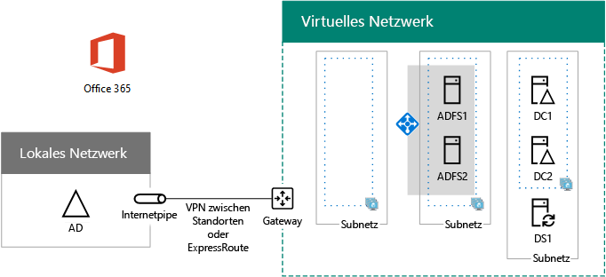

# <a name="high-availability-federated-authentication-phase-3-configure-ad-fs-servers"></a><span data-ttu-id="22578-103">Hochverfügbarkeit der Verbundauthentifizierung, Phase 3: Konfigurieren von AD FS-Servern</span><span class="sxs-lookup"><span data-stu-id="22578-103">High availability federated authentication Phase 3: Configure AD FS servers</span></span>

 <span data-ttu-id="22578-104">**Zusammenfassung:** Erstellen Sie und konfigurieren Sie die Active Directory-Verbunddienste (AD FS) Server für die hohe Verfügbarkeit Verbundauthentifizierung für Office 365 in Microsoft Azure.</span><span class="sxs-lookup"><span data-stu-id="22578-104">**Summary:** Create and configure the Active Directory Federation Services (AD FS) servers for your high availability federated authentication for Office 365 in Microsoft Azure.</span></span>
  
<span data-ttu-id="22578-105">In dieser Phase der Bereitstellung der hohen Verfügbarkeit für Verbundauthentifzierung für Office 365 in Azure-Infrastrukturdiensten erstellen Sie einen internen Lastenausgleich und zwei AD FS-Server.</span><span class="sxs-lookup"><span data-stu-id="22578-105">In this phase of deploying high availability for Office 365 federated authentication in Azure infrastructure services, you create an internal load balancer and two AD FS servers.</span></span>
  
<span data-ttu-id="22578-p101">Müssen Sie vor dem Verschieben auf in dieser Phase [hoher Verfügbarkeit federated Authentifizierung Phase 4: Konfigurieren der Web-Anwendungsproxys](high-availability-federated-authentication-phase-4-configure-web-application-pro.md). Finden Sie unter [Deploy hohe Verfügbarkeit Verbundauthentifizierung für Office 365 in Azure](deploy-high-availability-federated-authentication-for-office-365-in-azure.md) für alle Phasen.</span><span class="sxs-lookup"><span data-stu-id="22578-p101">You must complete this phase before moving on to [High availability federated authentication Phase 4: Configure web application proxies](high-availability-federated-authentication-phase-4-configure-web-application-pro.md). See [Deploy high availability federated authentication for Office 365 in Azure](deploy-high-availability-federated-authentication-for-office-365-in-azure.md) for all of the phases.</span></span>
  
## <a name="create-the-ad-fs-server-virtual-machines-in-azure"></a><span data-ttu-id="22578-108">Erstellen der virtuellen Computer des AD FS-Servers in Azure</span><span class="sxs-lookup"><span data-stu-id="22578-108">Create the AD FS server virtual machines in Azure</span></span>

<span data-ttu-id="22578-p102">Verwenden Sie den folgenden PowerShell-Befehlsblock, um die virtuellen Computer für die beiden AD FS-Server zu erstellen. Dieser PowerShell-Befehlssatz verwendet Werte aus den folgenden Tabellen:</span><span class="sxs-lookup"><span data-stu-id="22578-p102">Use the following block of PowerShell commands to create the virtual machines for the two AD FS servers. This PowerShell command set uses values from the following tables:</span></span>
  
- <span data-ttu-id="22578-111">Tabelle M (für die virtuellen Computer)</span><span class="sxs-lookup"><span data-stu-id="22578-111">Table M, for your virtual machines</span></span>
    
- <span data-ttu-id="22578-112">Tabelle R (für die Ressourcengruppen)</span><span class="sxs-lookup"><span data-stu-id="22578-112">Table R, for your resource groups</span></span>
    
- <span data-ttu-id="22578-113">Tabelle V (für die Einstellungen des virtuellen Netzwerks)</span><span class="sxs-lookup"><span data-stu-id="22578-113">Table V, for your virtual network settings</span></span>
    
- <span data-ttu-id="22578-114">Tabelle S (für das Subnetz)</span><span class="sxs-lookup"><span data-stu-id="22578-114">Table S, for your subnets</span></span>
    
- <span data-ttu-id="22578-115">Tabelle I (für die statischen IP-Adressen)</span><span class="sxs-lookup"><span data-stu-id="22578-115">Table I, for your static IP addresses</span></span>
    
- <span data-ttu-id="22578-116">Tabelle A (für die Verfügbarkeitsgruppen)</span><span class="sxs-lookup"><span data-stu-id="22578-116">Table A, for your availability sets</span></span>
    
<span data-ttu-id="22578-117">Denken Sie daran, dass Sie die Tabelle M in definiert [hoher Verfügbarkeit federated Authentifizierung Phase 2: Konfigurieren von Domänencontrollern](high-availability-federated-authentication-phase-2-configure-domain-controllers.md) und Tabellen R, V, S, ich und eine in [hoher Verfügbarkeit federated Authentifizierung Phase 1: Konfigurieren von Azure](high-availability-federated-authentication-phase-1-configure-azure.md).</span><span class="sxs-lookup"><span data-stu-id="22578-117">Recall that you defined Table M in [High availability federated authentication Phase 2: Configure domain controllers](high-availability-federated-authentication-phase-2-configure-domain-controllers.md) and Tables R, V, S, I, and A in [High availability federated authentication Phase 1: Configure Azure](high-availability-federated-authentication-phase-1-configure-azure.md).</span></span>
  
> [!NOTE]
> <span data-ttu-id="22578-p103">Verwenden Sie den folgenden Befehl wird die neueste Version von Azure PowerShell. Finden Sie unter [Erste Schritte mit Azure PowerShell-Cmdlets](https://docs.microsoft.com/en-us/powershell/azureps-cmdlets-docs/).</span><span class="sxs-lookup"><span data-stu-id="22578-p103">The following command sets use the latest version of Azure PowerShell. See [Get started with Azure PowerShell cmdlets](https://docs.microsoft.com/en-us/powershell/azureps-cmdlets-docs/).</span></span> 
  
<span data-ttu-id="22578-p104">Zuerst erstellen Sie eine Azure internen System zum Lastenausgleich für die zwei AD FS-Server. Geben Sie die Werte für die Variablen, entfernen die \< und > Zeichen. Wenn Sie alle erforderlichen Werte bereitgestellt haben, führen Sie den Ergebnisblock an der Befehlszeile Azure PowerShell oder in der PowerShell ISE.</span><span class="sxs-lookup"><span data-stu-id="22578-p104">First, you create an Azure internal load balancer for the two AD FS servers. Specify the values for the variables, removing the \< and > characters. When you have supplied all the proper values, run the resulting block at the Azure PowerShell command prompt or in the PowerShell ISE.</span></span>
  
> [!TIP]
> <span data-ttu-id="22578-123">Eine Textdatei, die alle von PowerShell-Befehlen in diesem Artikel und Konfiguration Microsoft Excel-Arbeitsmappen, die generiert Ready-und-Los-PowerShell-Befehl Blöcke basierend auf Ihrer benutzerdefinierten Einstellungen enthält, finden Sie unter der [Federated-Authentifizierung für Office 365 in Azure Deployment Kit](https://gallery.technet.microsoft.com/Federated-Authentication-8a9f1664).</span><span class="sxs-lookup"><span data-stu-id="22578-123">For a text file that contains all of the PowerShell commands in this article and a Microsoft Excel configuration workbook that generates ready-to-run PowerShell command blocks based on your custom settings, see the [Federated Authentication for Office 365 in Azure Deployment Kit](https://gallery.technet.microsoft.com/Federated-Authentication-8a9f1664).</span></span> 
  
```
# Set up key variables
$locName="<your Azure location>"
$vnetName="<Table V - Item 1 - Value column>"
$subnetName="<Table R - Item 2 - Subnet name column>"
$privIP="<Table I - Item 4 - Value column>"
$rgName=<Table R - Item 4 - Resource group name column>"

$vnet=Get-AzureRMVirtualNetwork -Name $vnetName -ResourceGroupName $rgName
$subnet=Get-AzureRmVirtualNetworkSubnetConfig -VirtualNetwork $vnet -Name $subnetName

$frontendIP=New-AzureRMLoadBalancerFrontendIpConfig -Name "ADFSServers-LBFE" -PrivateIPAddress $privIP -Subnet $subnet
$beAddressPool=New-AzureRMLoadBalancerBackendAddressPoolConfig -Name "ADFSServers-LBBE"

$healthProbe=New-AzureRMLoadBalancerProbeConfig -Name WebServersProbe -Protocol "TCP" -Port 443 -IntervalInSeconds 15 -ProbeCount 2
$lbrule=New-AzureRMLoadBalancerRuleConfig -Name "HTTPSTraffic" -FrontendIpConfiguration $frontendIP -BackendAddressPool $beAddressPool -Probe $healthProbe -Protocol "TCP" -FrontendPort 443 -BackendPort 443
New-AzureRMLoadBalancer -ResourceGroupName $rgName -Name "ADFSServers" -Location $locName -LoadBalancingRule $lbrule -BackendAddressPool $beAddressPool -Probe $healthProbe -FrontendIpConfiguration $frontendIP
```

<span data-ttu-id="22578-124">Erstellen Sie als Nächstes die virtuellen Computer des AD FS-Servers.</span><span class="sxs-lookup"><span data-stu-id="22578-124">Next, create the AD FS server virtual machines.</span></span>
  
<span data-ttu-id="22578-125">Sobald Sie alle Werte korrekt festgelegt haben, führen Sie den resultierenden Block über die Azure PowerShell-Eingabeaufforderung oder in PowerShell ISE aus.</span><span class="sxs-lookup"><span data-stu-id="22578-125">When you have supplied all the proper values, run the resulting block at the Azure PowerShell command prompt or in the PowerShell ISE.</span></span>
  
```
# Set up variables common to both virtual machines
$locName="<your Azure location>"
$vnetName="<Table V - Item 1 - Value column>"
$subnetName="<Table R - Item 2 - Subnet name column>"
$avName="<Table A - Item 2 - Availability set name column>"
$rgNameTier="<Table R - Item 2 - Resource group name column>"
$rgNameInfra="<Table R - Item 4 - Resource group name column>"

$rgName=$rgNameInfra
$vnet=Get-AzureRMVirtualNetwork -Name $vnetName -ResourceGroupName $rgName
$subnet=Get-AzureRmVirtualNetworkSubnetConfig -VirtualNetwork $vnet -Name $subnetName
$backendSubnet=Get-AzureRMVirtualNetworkSubnetConfig -Name $subnetName -VirtualNetwork $vnet
$webLB=Get-AzureRMLoadBalancer -ResourceGroupName $rgName -Name "ADFSServers"

$rgName=$rgNameTier
$avSet=Get-AzureRMAvailabilitySet -Name $avName -ResourceGroupName $rgName

# Create the first ADFS server virtual machine
$vmName="<Table M - Item 4 - Virtual machine name column>"
$vmSize="<Table M - Item 4 - Minimum size column>"
$staticIP="<Table I - Item 5 - Value column>"
$diskStorageType="<Table M - Item 4 - Storage type column>"

$nic=New-AzureRMNetworkInterface -Name ($vmName +"-NIC") -ResourceGroupName $rgName -Location $locName -Subnet $backendSubnet -LoadBalancerBackendAddressPool $webLB.BackendAddressPools[0] -PrivateIpAddress $staticIP
$vm=New-AzureRMVMConfig -VMName $vmName -VMSize $vmSize -AvailabilitySetId $avset.Id

$cred=Get-Credential -Message "Type the name and password of the local administrator account for the first AD FS server." 
$vm=Set-AzureRMVMOperatingSystem -VM $vm -Windows -ComputerName $vmName -Credential $cred -ProvisionVMAgent -EnableAutoUpdate
$vm=Set-AzureRMVMSourceImage -VM $vm -PublisherName MicrosoftWindowsServer -Offer WindowsServer -Skus 2016-Datacenter -Version "latest"
$vm=Add-AzureRMVMNetworkInterface -VM $vm -Id $nic.Id
$vm=Set-AzureRmVMOSDisk -VM $vm -Name ($vmName +"-OS") -DiskSizeInGB 128 -CreateOption FromImage -StorageAccountType $diskStorageType
New-AzureRMVM -ResourceGroupName $rgName -Location $locName -VM $vm

# Create the second AD FS virtual machine
$vmName="<Table M - Item 5 - Virtual machine name column>"
$vmSize="<Table M - Item 5 - Minimum size column>"
$staticIP="<Table I - Item 6 - Value column>"
$diskStorageType="<Table M - Item 5 - Storage type column>"

$nic=New-AzureRMNetworkInterface -Name ($vmName +"-NIC") -ResourceGroupName $rgName -Location $locName  -Subnet $backendSubnet -LoadBalancerBackendAddressPool $webLB.BackendAddressPools[0] -PrivateIpAddress $staticIP
$vm=New-AzureRMVMConfig -VMName $vmName -VMSize $vmSize -AvailabilitySetId $avset.Id

$cred=Get-Credential -Message "Type the name and password of the local administrator account for the second AD FS server." 
$vm=Set-AzureRMVMOperatingSystem -VM $vm -Windows -ComputerName $vmName -Credential $cred -ProvisionVMAgent -EnableAutoUpdate
$vm=Set-AzureRMVMSourceImage -VM $vm -PublisherName MicrosoftWindowsServer -Offer WindowsServer -Skus 2016-Datacenter -Version "latest"
$vm=Add-AzureRMVMNetworkInterface -VM $vm -Id $nic.Id
$vm=Set-AzureRmVMOSDisk -VM $vm -Name ($vmName +"-OS") -DiskSizeInGB 128 -CreateOption FromImage -StorageAccountType $diskStorageType
New-AzureRMVM -ResourceGroupName $rgName -Location $locName -VM $vm

```

> [!NOTE]
> <span data-ttu-id="22578-p105">Da diese virtuellen Maschinen für eine Intranetanwendung sind, sind keine öffentliche IP-Adresse oder eine Bezeichnung für DNS-Domäne zugewiesen und im Internet verfügbar gemacht. Dies bedeutet jedoch auch, dass Sie über das Portal Azure eine Verbindung ist nicht möglich. Die Option **Verbinden** ist nicht verfügbar, wenn Sie die Eigenschaften des virtuellen Computers anzeigen. Verwenden Sie die Remotedesktopverbindung Zubehör oder ein anderes Remotedesktop-Tool Verbindung mit dem virtuellen Computer mit privaten IP-Adresse oder Intranet DNS-Namen ein.</span><span class="sxs-lookup"><span data-stu-id="22578-p105">Because these virtual machines are for an intranet application, they are not assigned a public IP address or a DNS domain name label and exposed to the Internet. However, this also means that you cannot connect to them from the Azure portal. The **Connect** option is unavailable when you view the properties of the virtual machine. Use the Remote Desktop Connection accessory or another Remote Desktop tool to connect to the virtual machine using its private IP address or intranet DNS name.</span></span>
  
<span data-ttu-id="22578-p106">Erstellen Sie mithilfe eines Remotedesktopclients Ihrer Wahl eine Remotedesktopverbindung für jeden virtuellen Computer. Verwenden Sie den Intranet-DNS-Namen oder den Computernamen des jeweiligen Servers und die Anmeldeinformationen des lokalen Administratorkontos.</span><span class="sxs-lookup"><span data-stu-id="22578-p106">For each virtual machine, use the remote desktop client of your choice and create a remote desktop connection. Use its intranet DNS or computer name and the credentials of the local administrator account.</span></span>
  
<span data-ttu-id="22578-132">Führen Sie für jeden virtuellen Computer die folgenden Befehle über die Windows PowerShell-Eingabeaufforderung aus, um jeweils einen Domänenbeitritt zur gewünschten Windows Server AD-Domäne einzurichten.</span><span class="sxs-lookup"><span data-stu-id="22578-132">For each virtual machine, join them to the appropriate Windows Server AD domain with these commands at the Windows PowerShell prompt.</span></span>
  
```
$domName="<Windows Server AD domain name to join, such as corp.contoso.com>"
$cred=Get-Credential -Message "Type the name and password of a domain acccount."
Add-Computer -DomainName $domName -Credential $cred
Restart-Computer
```

<span data-ttu-id="22578-133">Wenn Sie diese Phase erfolgreich abgeschlossen haben, sieht Ihre Konfiguration wie folgt aus. Für die Computernamen werden hier Platzhalter verwendet.</span><span class="sxs-lookup"><span data-stu-id="22578-133">Here is the configuration resulting from the successful completion of this phase, with placeholder computer names.</span></span>
  
<span data-ttu-id="22578-134">**Phase 3: AD FS-Servern und internen System zum Lastenausgleich für eine hohe Verfügbarkeit Verbundauthentifizierung-Infrastruktur in Azure**</span><span class="sxs-lookup"><span data-stu-id="22578-134">**Phase 3: The AD FS servers and internal load balancer for your high availability federated authentication infrastructure in Azure**</span></span>


  
## <a name="next-step"></a><span data-ttu-id="22578-136">Nächster Schritt</span><span class="sxs-lookup"><span data-stu-id="22578-136">Next step</span></span>

<span data-ttu-id="22578-137">Verwendung [hoher Verfügbarkeit federated Authentifizierung Phase 4: Konfigurieren der Web-Anwendungsproxys](high-availability-federated-authentication-phase-4-configure-web-application-pro.md) Konfiguration von Arbeitslast fortzufahren.</span><span class="sxs-lookup"><span data-stu-id="22578-137">Use [High availability federated authentication Phase 4: Configure web application proxies](high-availability-federated-authentication-phase-4-configure-web-application-pro.md) to continue configuring this workload.</span></span>
  
## <a name="see-also"></a><span data-ttu-id="22578-138">See Also</span><span class="sxs-lookup"><span data-stu-id="22578-138">See Also</span></span>

[<span data-ttu-id="22578-139">Bereitstellen der Verbundauthentifizierung mit Hochverfügbarkeit für Office 365 in Azure</span><span class="sxs-lookup"><span data-stu-id="22578-139">Deploy high availability federated authentication for Office 365 in Azure</span></span>](deploy-high-availability-federated-authentication-for-office-365-in-azure.md)
  
[<span data-ttu-id="22578-140">Verbundidentität für Ihre Office 365-Entwicklungs-/Testumgebung</span><span class="sxs-lookup"><span data-stu-id="22578-140">Federated identity for your Office 365 dev/test environment</span></span>](federated-identity-for-your-office-365-dev-test-environment.md)


