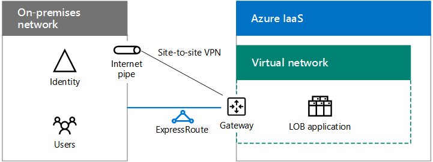

# Hybrid Cloud-Szenarien für Azure-IaaS

 **Zusammenfassung:** Verstehen der Hybrid Architektur und Szenarien für die Infrastruktur von Microsoft als Service (IaaS)-basierte Cloud-Angebote in Azure.
  
Erweitern Sie Ihre lokale Computing-und Identitätsinfrastruktur in die Cloud, indem Sie IT-Arbeitslasten hosten, die in standortübergreifenden Azure Virtual Networks (VNets) laufen. 
  
## Architektur des Azure IaaS-Hybrid Szenarios

Abbildung 1 zeigt die Architektur von Microsoft IaaS-basierten Hybrid Szenarien in Azure.
  
**Abbildung 1: Microsoft IaaS-basierte Hybrid Szenarien in Azure**

  
Für jede Schicht der Architektur:
  
- Apps und Szenarien
    
    Eine IT-Arbeitslast ist in der Regel eine mehrstufige, hoch verfügbare Anwendung, die aus virtuellen Azure-Computern (VMS) besteht.
    
- Identität
    
    Fügen Sie Identitäts Server, wie Active Directory-Domänendienste (AD DS), zu der Gruppe von Servern hinzu, die in Azure VNets für die lokale Authentifizierung verwendet werden.
    
- Netzwerk
    
    Verwenden Sie eine Standort-zu-Standort-VPN-Verbindung über das Internet oder eine Express Route-Verbindung mit privatem Peering zu Azure IaaS.
    
- Lokal
    
    Enthält Identitäts Server, die mit den Identitäts Servern in Azure synchronisiert werden. Kann auch Ressourcen enthalten, auf die in Azure ausgeführten VMs zugegriffen werden kann, beispielsweise Speicher-und Systemverwaltungsinfrastruktur.
    
## Verzeichnissynchronisierungsserver für Office 365

Die Verwendung des Verzeichnissynchronisierungsservers von einem Azure-VNet, wie in Abbildung 2 dargestellt, ist ein Beispiel für die Erweiterung der Computing-und Identitätsinfrastruktur auf die Cloud.
  
**Abbildung 2: Verzeichnissynchronisierungsserver für Office 365 in Azure IaaS**

  
In Abbildung 2 hostet ein lokales Netzwerk eine AD DS-Infrastruktur mit einem Proxy Server und einem Router an seinem Edgeserver. Der Router stellt eine Verbindung mit einem Azure-Gateway am Rand eines Azure-VNet mit einer Standort-zu-Standort-VPN-oder Express Route-Verbindung her. Innerhalb des VNet führt ein Verzeichnissynchronisierungsserver Azure AD Connect aus.
  
Ein Verzeichnissynchronisierungsserver für Office 365 synchronisiert die Liste der Konten in AD DS mit dem Azure AD-Mandanten eines Office 365-Abonnements.
  
Ein Verzeichnissynchronisierungsserver ist ein Windows-basierter Server, auf dem Azure AD Connect ausgeführt wird. Für eine schnellere Bereitstellung oder zur Verringerung der Anzahl von lokalen Servern in Ihrer Organisation stellen Sie den Verzeichnissynchronisierungsserver in einem virtuellen Netzwerk (VNet) in Azure IaaS.
  
Der Verzeichnissynchronisierungsserver fragt AD DS nach Änderungen ab und synchronisiert diese dann mit dem Office 365-Abonnement.
  
Weitere Informationen finden Sie unter [Deploy Office 365 Directory Synchronization in Microsoft Azure](deploy-office-365-directory-synchronization-dirsync-in-microsoft-azure.md).
  
## Branchenanwendung

Abbildung 3 zeigt die Konfiguration einer Server basierten Branchenanwendung, die in Azure IaaS.
  
**Abbildung 3: Branchenanwendung in Azure IaaS**

  
In Abbildung 3 hostet ein lokales Netzwerk eine Identitätsinfrastruktur und Benutzer. Sie ist mit einem Azure IaaS-Gateway mit einer Standort-zu-Standort-VPN-oder Express Route-Verbindung verbunden. Azure IaaS hostet ein virtuelles Netzwerk, das die Server der Branchenanwendung enthält.
  
Sie können LOB-Anwendungen erstellen, die auf Azure-VMS, die sich in Subnetzen einer Azure-VNet in einem Azure-Datencenter (auch als Standort bezeichnet) befinden.
  
Da Sie Ihre lokale Infrastruktur im Wesentlichen auf Azure ausdehnen, müssen Sie Ihrem VNets eindeutige private Adressräume zuweisen und ihre lokalen Routingtabellen aktualisieren, um die Erreichbarkeit der einzelnen VNet sicherzustellen.
  
Sobald die Verbindung hergestellt ist, können diese VMS mit Remotedesktopverbindungen oder mit ihrer Systemverwaltungssoftware, genau wie Ihre lokalen Server, verwaltet werden.
  
Durch das Konfigurieren öffentlich zugänglicher Ports können diese VMS auch über das Internet von mobilen oder Remotebenutzern aus aufgerufen werden.
  
Eine Machbarkeitsstudie finden Sie unter [simuliertes standortübergreifendes virtuelles Netzwerk in Azure](simulated-cross-premises-virtual-network-in-azure.md).
  
Attribute von Branchenanwendungen, die auf Azure-VMS gehostet werden, sind folgende:
  
- Mehrere Ebenen
    
    Typische Branchenanwendungen verwenden einen mehrstufigen Ansatz. Servergruppen bieten Identitäts-, Daten Bank Verarbeitungs-, Anwendungs-und Logik Verarbeitung sowie Front-End-Webserver für Mitarbeiter-oder Kunden Zugriff. 
    
- Hohe Verfügbarkeit
    
    Typische Branchenanwendungen bieten eine hohe Verfügbarkeit durch die Verwendung von mehreren Servern in jeder Ebene. Azure IaaS bietet eine Betriebszeit von 99,9% für Server in Azure-Verfügbarkeits Sätzen. 
    
- Lastenverteilung
    
    Um die Last des Netzwerkdatenverkehrs auf mehrere Server in einer Ebene zu verteilen, können Sie einen mit dem Internet verbundenen oder internen Azure-Lastenausgleich verwenden. Sie können auch eine dedizierte Lastenausgleichs Einheit verwenden, die auf dem Azure Marketplace verfügbar ist.
    
- Sicherheit
    
    Um Server vor nicht angeforderten eingehenden Datenverkehr aus dem Internet zu schützen, können Sie Azure Network Security Groups verwenden. Sie können den zulässigen oder verweigerten Datenverkehr für ein Subnetz oder die Netzwerkschnittstelle eines einzelnen virtuellen Computers definieren.
    
## SharePoint Server 2016-Farm in Azure

Ein Beispiel für eine hoch verfügbare mehrstufige Branchenanwendung in Azure ist eine SharePoint Server 2016-Farm, wie in Abbildung 4 dargestellt.
  
**Abbildung 4: eine hoch verfügbare SharePoint Server 2016-Farm in Azure IaaS**

  
In Abbildung 4 hostet ein lokales Netzwerk eine Identitätsinfrastruktur und Benutzer. Sie ist mit einem Azure IaaS-Gateway mit einer Standort-zu-Standort-VPN-oder Express Route-Verbindung verbunden. Die Azure-VNet enthält die Server der SharePoint Server 2016-Farm, die separate Ebenen für die Front-End-Server, die Anwendungsserver, den SQL Server-Cluster und die Domänencontroller umfasst.
  
Diese Konfiguration weist die folgenden Attribute von Branchenanwendungen in Azure auf: 
  
- Ebenen
    
    Server, auf denen unterschiedliche Rollen in der Farm ausgeführt werden, erstellen die Ebenen, und jede Ebene verfügt über ein eigenes Subnetz.
    
- Hohe Verfügbarkeit
    
    Durch die Verwendung mehrerer Server in jeder Ebene und das Platzieren aller Server einer Ebene in demselben Verfügbarkeits Satz erreicht.
    
- Lastenverteilung
    
    Interne Azure-Lastenausgleichsmodule verteilen den eingehenden Client-Webdatenverkehr an die Front-End-Server (WEB1 und web2) und an die Listener-IP-Adresse des SQL Server-Clusters (SQL1, sql2 und MN1).
    
- Sicherheit
    
    Mit Netzwerk Sicherheitsgruppen für jedes Subnetz können Sie den zulässigen eingehenden und ausgehenden Datenverkehr konfigurieren.
    
Folgen Sie diesem Pfad für die erfolgreiche Einführung:
  
1. Auswerten und testen
    
    Informationen zu den Vorteilen der Verwendung von SharePoint Server 2016 in Azure finden Sie unter [SharePoint Server 2016 in Microsoft Azure](https://docs.microsoft.com/SharePoint/administration/sharepoint-server-2016-in-microsoft-azure) .
    
    Weitere Informationen finden Sie unter [Intranet SharePoint Server 2016 in Azure dev/Test Environment](https://docs.microsoft.com/SharePoint/administration/intranet-sharepoint-server-2016-in-azure-dev-test-environment) to Build a simulationed dev/Test Environment
    
2. Entwerfen
    
    Weitere Informationen finden Sie unter [Entwerfen einer SharePoint Server 2016-Farm in Azure](https://docs.microsoft.com/SharePoint/administration/designing-a-sharepoint-server-2016-farm-in-azure) , um einen Prozess zur Ermittlung der Gruppe von Azure IaaS-Netzwerk-, COMPUTE-und Speicherelementen zum Hosten Ihrer Farm und ihrer Einstellungen zu ermitteln.
    
3. Bereitstellen
    
    Weitere Informationen finden Sie unter [Deploying SharePoint Server 2016 with SQL Server AlwaysOn Availability Groups in Azure](https://docs.microsoft.com/SharePoint/administration/deploying-sharepoint-server-2016-with-sql-server-alwayson-availability-groups-in) , um die End-to-End-Konfiguration der hoch Verfügbarkeits Farm in fünf Phasen schrittweise durchlaufen zu können.
    
## Verbundidentität für Office 365 in Azure

Ein weiteres Beispiel für eine mehrstufige Branchenanwendung mit hoher Verfügbarkeit in Azure ist die Verbundidentität für Office 365.
  
**Abbildung 5: eine hoch verfügbare Verbund Identitätsinfrastruktur für Office 365 in Azure IaaS**

  
In Abbildung 5 hostet ein lokales Netzwerk eine Identitätsinfrastruktur und Benutzer. Sie ist mit einem Azure IaaS-Gateway mit einer Standort-zu-Standort-VPN-oder Express Route-Verbindung verbunden. Das Azure-VNet enthält WebProxy Server, Active Directory-Verbunddienste-Server und Active Directory-Domänendienste (AD DS)-Domänencontroller.
  
Diese Konfiguration weist die folgenden Attribute von Branchenanwendungen in Azure auf:
  
- **Ebenen:** Es gibt Ebenen für Webproxyserver, AD FS-Server und AD DS-Domänencontroller.
    
- **Lastenverteilung:** Ein externes Azure-Lastenausgleichsmodul verteilt die eingehenden Clientauthentifizierungsanforderungen an die Webproxys, und ein internes Azure-Lastenausgleichsmodul verteilt Authentifizierungsanforderungen an die AD FS-Server.
    
Folgen Sie diesem Pfad für die erfolgreiche Einführung:
  
1. Auswerten und testen
    
    Informationen zum Erstellen einer simulierten Entwicklungs-und Testumgebung für die Verbundauthentifizierung mit Office 365 finden Sie unter [Federated Identity for Your Office 365 dev/Test Environment](federated-identity-for-your-office-365-dev-test-environment.md) .
    
2. Bereitstellen
    
    Weitere Informationen finden Sie unter [Deploy High Availability Federated Authentication for Office 365 in Azure](deploy-high-availability-federated-authentication-for-office-365-in-azure.md) , um die End-to-End-Konfiguration der AD FS-Infrastruktur mit hoher Verfügbarkeit in fünf Phasen schrittweise zu durchlaufen.
    
    
## Siehe auch

[Microsoft Hybrid Cloud für Enterprise-Architekten](microsoft-hybrid-cloud-for-enterprise-architects.md)
  
[Ressourcen zur Cloud-IT-Architektur von Microsoft](microsoft-cloud-it-architecture-resources.md)

