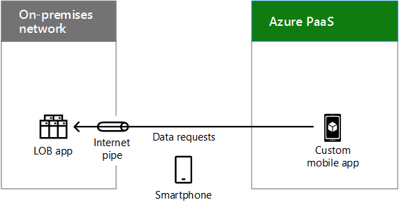

# Hybrid Cloud-Szenarien für Azure PaaSHybrid cloud scenarios for Azure PaaS

 **Zusammenfassung:** Grundlegende Informationen zur Hybrid-Architektur und -szenarien für PaaS-basierte Cloudangebote von Microsoft in Azure.**Summary:** Understand the hybrid architecture and scenarios for Microsoft's Platform as a Service (PaaS)-based cloud offerings in Azure.
  
Kombinieren Sie lokale Daten oder Computingressourcen mit neuen oder konvertierten Anwendungen, die in Azure PaaS ausgeführt werden und Cloudleistung, -zuverlässigkeit und -skalierung nutzen sowie bessere Unterstützung für mobile Benutzer bieten können.Combine on-premises data or computing resources with new or converted applications running in Azure PaaS, which can take advantage of cloud performance, reliability, and scale and provide better support for mobile users. 
  
## Architektur für Azure PaaS-HybridszenarioAzure PaaS hybrid scenario architecture

Abbildung 1 zeigt die Architektur der PaaS-basierten Hybridszenarien von Microsoft in Azure.Figure 1 shows the architecture of Microsoft PaaS-based hybrid scenarios in Azure.
  
**Abbildung 1: Microsoft PaaS-basierte Hybridszenarien in Azure****Figure 1: Microsoft PaaS-based hybrid scenarios in Azure**

  
Für jede Schicht der Architektur:For each layer of the architecture:
  
- Apps und SzenarienApps and scenarios
    
    Eine hybride PaaS-Anwendung wird in Azure ausgeführt und nutzt lokale Compute- oder Speicherressourcen.A hybrid PaaS application runs in Azure and uses on-premises compute or storage resources.
    
- IdentitätIdentity
    
    Besteht entweder aus einer Verzeichnissynchronisierung oder aus einem Partnerverbund mit einem Drittanbieter-Identitätsanbieter.Consists of either directory synchronization or federation with a third-party identity provider.
    
- NetzwerkNetwork
    
    Besteht aus Ihrem vorhandenen Internetzugang oder einer ExpressRoute-Verbindung mit öffentlichem Peering zu Azure PaaS. Sie müssen eine Möglichkeit für die Azure PaaS-Anwendung für den Zugriff auf die lokale Compute- oder Speicherressource hinzufügen.Consists of either your existing Internet pipe or an ExpressRoute connection with public peering to Azure PaaS. You must include a way for the Azure PaaS application to access the on-premises compute or storage resource.
    
- LokalOn-premises
    
    Besteht aus der Identitäts- und Sicherheitsinfrastruktur sowie vorhandenen branchenspezifischen Anwendungen oder Datenbankserver, auf die eine Azure PaaS-Anwendung sicher zugreifen kann.Consists of identity and security infrastructure and existing line of business (LOB) applications or database servers, which an Azure PaaS application can securely access.
    
## Azure PaaS-HybridanwendungAzure PaaS hybrid application

Abbildung 2 zeigt die Konfiguration einer Hybridanwendung, die in Azure ausgeführt wird.Figure 2 shows the configuration of a hybrid application running in Azure.
  
**Abbildung 2: Azure PaaS-basierte Hybridanwendung****Figure 2: Azure PaaS-based hybrid application**

  
In Abbildung 2 werden Speicher oder Apps auf Servern und in einer DMZ mit einem Proxyserver in einem lokalen Netzwerk gehostet. Das Netzwerk ist über das Internet oder eine ExpressRoute-Verbindung mit PaaS Azure-Diensten verbunden.In Figure 2, an on-premises network hosts storage or apps on servers and a DMZ containing a proxy server. It is connected to Azure PaaS services either over the Internet or with an ExpressRoute connection.
  
Eine Organisation kann seine Compute- oder Speicherressourcen wie folgt für die Azure PaaS-Hybridanwendung zugänglich machen:An organization can make its compute or storage resources available to the Azure PaaS hybrid application by:
  
- Durch Hosten der Ressource auf Servern in der DMZHosting the resource on servers in the DMZ.
    
- Durch Hosten eines Reverseproxyservers in der DMZ, der authentifizierte, eingehende, HTTPS-basierte Anforderungen an die Ressource zulässt, die sich im lokalen System befindetHosting a reverse proxy server in the DMZ, which allows authenticated, inbound, HTTPS-based requests to the resource that is located on-premises.
    
Die Azure-App kann Anmeldeinformationen verwenden von:The Azure app can use credentials from:
  
- Azure AD, die mit Ihrem lokalen Identitätsanbieter synchronisiert werden kann, beispielsweise Active Directory-Domänendienste (AD DS).Azure AD, which can be synchronized with your on-premises identity provider, such as Active Directory Domain Services (AD DS).
    
- Einem Drittanbieter-IdentitätsanbieterA third-party identity provider.
    
### Azure PaaS-Hybridanwendung als BeispielExample Azure PaaS hybrid application

Abbildung 3 zeigt ein Beispiel für eine Hybridanwendung, die in Azure ausgeführt wird.Figure 3 shows an example hybrid application running in Azure.
  
**Abbildung 3: Ein Beispiel für eine Azure PaaS-basierte Hybridanwendung****Figure 3: An example Azure PaaS-based hybrid application**

  
In Abbildung 3 wird eine Branchenanwendung in einem lokalen Netzwerk gehostet. Azure PaaS hostet eine benutzerdefinierte mobile App. Ein Smartphone im Internet greift auf die benutzerdefinierte mobile App in Azure zu, von wo wiederum Datenanforderungen an die lokale Branchenanwendung gesendet werden.In Figure 3, an on-premises network hosts an LOB app. Azure PaaS hosts a custom mobile app. A smartphone on the Internet accesses the custom mobile app in Azure, which sends data requests to the on-premises LOB app.
  
Diese Azure PaaS-Beispielhybridanwendung ist eine benutzerdefinierte mobile App, die aktuelle Kontaktinformationen zu Mitarbeitern bereitstellt. Das End-to-End-Hybridszenario besteht aus:This example Azure PaaS hybrid application is a custom mobile app that provides up-to-date contact information on employees. The end-to-end hybrid scenario consists of:
  
- Einer Smartphone-App, die überprüfte lokale Anmeldeinformationen erfordert, damit sie ausgeführt werden kannA smartphone app that requires validated, on-premises credentials to run.
    
- Einer benutzerdefinierten mobilen App, die in Azure PaaS ausgeführt wird und Informationen zu bestimmten Mitarbeitern anhand von Abfragen anfordert, die von der Smartphone-App eines Benutzers stammenA custom mobile app running in Azure PaaS, which requests information about specific employees based on queries from a user's smartphone app.
    
- Einem Reverseproxyserver in der DMZ, der die benutzerdefinierte mobile App überprüft und die Anforderung weiterleitetA reverse proxy server in the DMZ that validates the custom mobile app and forwards the request.
    
- Einer Branchenanwendungs-Serverfarm, die die Kontaktanforderung entsprechend den Berechtigungen verarbeitet, die das Konto des Benutzers hatAn LOB application server farm that services the contact request, subject to the permissions of the user's account.
    
Da der lokale Identitätsanbieter mit Azure Active Directory synchronisiert wurde, können sowohl die benutzerdefinierte mobile App als auch die Branchen-App den Kontonamen des anfordernden Benutzers überprüfen.Because the on-premises identity provider has been synchronized with Azure AD, both the custom mobile app and the LOB app can validate the requesting user's account name.
  
## Siehe auchSee Also

[Microsoft Hybrid Cloud für Enterprise-ArchitektenMicrosoft Hybrid Cloud for Enterprise Architects](microsoft-hybrid-cloud-for-enterprise-architects.md)
  
[Ressourcen zur Cloud-IT-Architektur von MicrosoftMicrosoft Cloud IT architecture resources](microsoft-cloud-it-architecture-resources.md)

