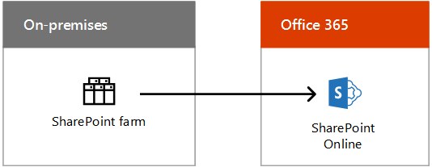

# Hybrid Cloud-Szenarien für Microsoft-SaaS (Office 365)

 **Zusammenfassung:** Grundlegendes zur Hybrid Architektur und den Szenarien für die SaaS-basierten Cloud-Angebote von Microsoft (Office 365).
  
Kombinieren Sie lokale Bereitstellungen von Exchange, SharePoint oder Skype for Business mit ihren Gegenstücken in Office 365 als Bestandteile einer Cloudmigrations- oder langfristigen Integrationsstrategie.
  
## Architektur für Microsoft SaaS-Hybridszenarien

Abbildung 1 zeigt die Architektur der SaaS-basierten Hybridszenarien von Microsoft für Office 365.
  
**Abbildung 1: Microsoft SaaS-basierte Hybridszenarien für Office 365**

  
Für jede Schicht der Architektur:
  
- Apps und Szenarien
    
    Es gibt eine Vielzahl von SaaS-basierten Hybridszenarien, in denen es sich um Office-Serverprodukte und deren Office 365-Gegenstücke dreht:
    
  - Exchange-Server in Kombination mit Exchange Online (Exchange Server-Hybridbereitstellung)
    
  - Skype for Business Server in Kombination mit Skype for Business Online und den neuen Cloud-PBX- und Cloud Connector Edition-Szenarien
    
  - SharePoint Server 2019, SharePoint Server 2016 oder SharePoint Server 2013 in Kombination mit SharePoint Online (mehrere Szenarien)
    
    Es gibt auch Exchange Online mit lokaler Skype for Business Server-Bereitstellung, ein produktübergreifendes Hybridszenario.
    
- Identität
    
    Kann die Verzeichnissynchronisierung mit Ihren lokalen Active Directory-Domänendiensten (AD DS) einbeziehen. Alternativ können Sie Azure AD für einen Verbund mit einem Drittanbieter-Identitätsdrittanbieter konfigurieren.
    
- Netzwerk
    
    Besteht aus Ihrem vorhandenen Internetzugang oder einer ExpressRoute-Verbindung mit Microsoft-Peering für Office 365 oder Dynamics 365.
    
- Lokal
    
    Kann aus vorhandenen Servern für Exchange, SharePoint und Skype for Business bestehen, die auf ihre neuesten Versionen aktualisiert sein sollten. Sie können diese dann für Hybridszenarien mit ihren Office 365-Gegenstücken kombinieren.
    
Richten Sie Ihre eigene Office 365 dev/Test-Umgebung ein, siehe [office 365 Test Lab Guides](cloud-adoption-test-lab-guides-tlgs.md).
  
## Skype for Business Hybrid

Mit Skype for Business Hybrid können Sie eine vorhandene lokale Bereitstellung mit Skype for Business Online kombinieren. Einige Benutzer arbeiten lokal, und einige Benutzer arbeiten online, sie nutzen jedoch dieselbe SIP-Domäne (Session Initiation-Protokoll), z. B. „contoso.com“). Sie können diese Hybridkonfiguration verwenden, um nach Ihrer eigenen Zeitplanung von der lokalen Bereitstellung zu Office 365 zu migrieren. Skype for Business kann auch in [Exchange Online](https://docs.microsoft.com/skypeforbusiness/skype-for-business-hybrid-solutions/integration-with-exchange-and-sharepoint)integriert werden.
  
**Abbildung 2: die Skype for Business-Hybrid Konfiguration**

  
Abbildung 2 zeigt die Skype for Business-Hybrid Konfiguration, bestehend aus einem lokalen Skype for Business-Front-End-Pool und einem Edgeserver, der mit Skype for Business Online in Office 365 kommuniziert.
  
Weitere Informationen finden Sie unter [Planen der Hybrid Konnektivität zwischen Skype for Business Server und Skype for Business Online](https://docs.microsoft.com/skypeforbusiness/skype-for-business-hybrid-solutions/plan-hybrid-connectivity).
    
## Cloud-PBX mit Skype for Business Server

Cloud PBX mit Skype for Business Server ermöglicht den Übergang einer vorhandenen Skype for Business Server-Bereitstellung in eine Topologie mit einer lokalen PSTN-Anbindung (Public Switched telePhone Network). 
  
**Abbildung 3: Cloud-PBX mit Skype for Business Server**

  
Abbildung 3 zeigt die Cloud-nebenstellenANLAGE mit Skype for Business Server-Konfiguration, bestehend aus einer lokalen vorhandenen nebenstellenANLAGE oder einem Telco-Gateway, einem Skype for Business-Server und dem PSTN, das mit der Microsoft Cloud-nebenstellenANLAGE in Office 365 verbunden ist und Skype for Business umfasst. Online.
  
Benutzer im Unternehmen, die in der Cloud gehostet werden, können private PBX-Dienste (Private Branch Exchange, Nebenstellenanlage) aus der Microsoft-Cloud empfangen, wozu Signalisierung und Voicemail gehören, aber Festnetzanbindung (Freizeichen) wird über Enterprise-VoIP aus Ihrer lokalen Skype for Business Server-Bereitstellung bereitgestellt.
  
Dies ist ein hervorragendes Beispiel für eine Hybrid Konfiguration, mit der Sie schrittweise zu einem cloudbasierten Dienst migrieren können. Sie können die VoIP-Funktionen Ihrer Benutzer behalten, wenn Sie beginnen, Sie in Skype for Business Online zu verschieben. Sie können Ihre Benutzer in Ihrem eigenen Tempo bewegen, da Sie wissen, dass Ihre VoIP-Funktionen unabhängig von ihrem Speicherort fortgesetzt werden. 
  
Weitere Informationen finden Sie unter [Planen der Hybrid Konnektivität zwischen Skype for Business Server und Skype for Business Online](https://docs.microsoft.com/skypeforbusiness/skype-for-business-hybrid-solutions/plan-hybrid-connectivity).
  
Wenn Sie noch keine Lync Server- oder Skype for Business Server-Bereitstellung haben, können Sie Skype for Business Cloud Connector Edition verwenden. Dies ist eine Gruppe von konfektionierten virtuellen Computern, in denen lokale Festnetzanbindung (PSTN-Konnektivität) mit Cloud-PBX implementiert ist.
  
Weitere Informationen finden Sie unter [Plan for Skype for Business Cloud Connector Edition](https://docs.microsoft.com/skypeforbusiness/skype-for-business-hybrid-solutions/plan-your-phone-system-cloud-pbx-solution/plan-skype-for-business-cloud-connector-edition).

  
## SharePoint-Hybridlösung

In einer SharePoint-Hybridlösung wird SharePoint Online in Office 365 mit Ihrer lokalen SharePoint-Farm kombiniert, um das Beste aus beiden zu verbinden.
  
**Abbildung 4: Die SharePoint-Hybridkonfiguration**

  
Abbildung 4 zeigt die SharePoint-Hybrid Konfiguration, bestehend aus einer lokalen SharePoint-Farm, die mit SharePoint Online in Office 365 kommuniziert.
  
SharePoint-Hybridszenarien:
  
- [OneDrive for Business-Hybridbereitstellung](https://docs.microsoft.com/SharePoint/hybrid/configure-hybrid-onedrive-for-businessroadmap)
    
- [Hybrid Extranet B2B](https://docs.microsoft.com/sharepoint/create-b2b-extranet)
    
- [Hybridsuche](https://docs.microsoft.com/SharePoint/hybrid/configure-cloud-hybrid-searchroadmap)
    
- [Hybridprofile](https://docs.microsoft.com/SharePoint/hybrid/plan-hybrid-profiles)
    
- [Hybrid Auswahl](https://docs.microsoft.com/SharePoint/hybrid/hybrid-picker-in-the-sharepoint-online-admin-center)
    
    Es ist einfach, Hybridszenarien mit den Assistenten zu aktivieren, mit denen die Hybridkonfiguration automatisiert wird und die aus dem SharePoint Online Admin Center in Office 365 verfügbar sind.
    
- [Das erweiterbare Hybrid-App-Startfeld](https://docs.microsoft.com/SharePoint/hybrid/the-extensible-hybrid-app-launcher)
    
    Ermöglicht es Benutzern, Office 365-Video- und Delve-Apps und -Oberflächen auf den Seiten ihrer lokalen SharePoint-Farm anzuzeigen und zu verwenden.
    
Diese SharePoint-Hybridszenarien sind mit Ausnahme von „Das erweiterbare Hybrid-Startprogramm für Apps“ alle sowohl für SharePoint 2016- als auch für SharePoint 2013-Benutzer verfügbar.
  
## Exchange Server 2016 Hybrid

Mit Exchange Server 2016 Hybrid können Sie von den Vorteilen von Exchange Online in Office 365 für Onlinebenutzer profitieren, während lokale Benutzer weiterhin die vorhandene Exchange Server-Infrastruktur nutzen.  
  
**Abbildung 5: Die Exchange 2016-Hybridkonfiguration**

  
Abbildung 5 zeigt die Exchange 2016-Hybrid Konfiguration, die aus lokalen Exchange-Postfachservern besteht, die mit Exchange Online Protection und Postfächern in Office 365 kommunizieren.
  
Einige Benutzer haben einen lokalen E-Mail-Server, und einige Benutzer verwenden Exchange Online, aber für alle Benutzer wird derselbe E-Mail-Adressraum genutzt.  
  
Diese Hybridkonfiguration ermöglicht Folgendes:
  
- Sie können Ihre vorhandene Exchange Server-Infrastruktur nutzen, während Sie nach und nach gemäß Ihrem Zeitplan zu Exchange Online migrieren.
    
- Sie können Remotestandorte unterstützen, ohne in eine Zweigstelleninfrastruktur zu investieren.
    
- Sie können aus dem Internet eingehende E-Mails über Exchange Online Protection in Office 365 weiterleiten.
    
- Es können die Anforderungen von multinationalen Unternehmen erfüllt werden, die Filialen haben, für die lokales Speichern von Daten erforderlich ist.
    
Sie können diese Hybridkonfiguration auch mit anderen Microsoft Office 365-Anwendungen kombinieren, einschließlich Skype for Business Online und SharePoint Online.
  
Weitere Informationen finden Sie unter [Exchange Server Hybrid Deployments](https://docs.microsoft.com/exchange/exchange-hybrid).
  
## Siehe auch

[Microsoft Hybrid Cloud für Enterprise-Architekten](microsoft-hybrid-cloud-for-enterprise-architects.md)
  
[Ressourcen zur Cloud-IT-Architektur von Microsoft](microsoft-cloud-it-architecture-resources.md)

