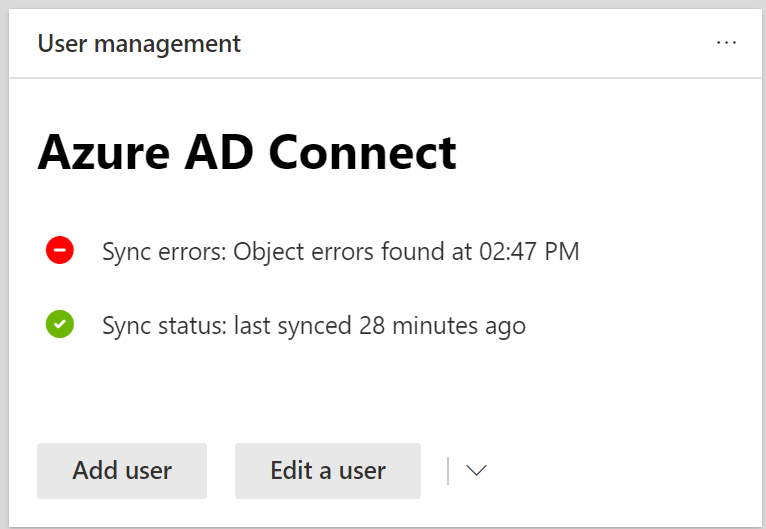

# Anzeigen von Verzeichnis Synchronisierungsfehlern in Microsoft 365

Sie können Verzeichnis Synchronisierungsfehler im [Microsoft 365 Admin Center](https://admin.microsoft.com)anzeigen. Es werden nur die Fehler des Benutzerobjekts angezeigt. Informationen zum Anzeigen von Fehlern mithilfe von PowerShell finden Sie unter [Identifizieren von Objekten mit DirSyncProvisioningErrors](https://docs.microsoft.com/azure/active-directory/hybrid/how-to-connect-syncservice-duplicate-attribute-resiliency).

Nach der Anzeige finden Sie unter [Beheben von Problemen mit der Verzeichnissynchronisierung für Microsoft 365](fix-problems-with-directory-synchronization.md) , um identifizierte Probleme zu beheben.
  
## Anzeigen von Verzeichnis Synchronisierungsfehlern im Admin Center

So zeigen Sie Fehler im Admin Center an:
  
1. Melden Sie sich mit Ihrem Geschäfts- oder Schulkonto bei Microsoft 365 an. 
    
2. Wechseln Sie zum [Admin Center](https://support.office.com/article/758befc4-0888-4009-9f14-0d147402fd23).
    
3. Auf der **Start** Seite wird die Status Kachel **Dirsync** angezeigt. 
    
    
  
4. Wählen Sie auf der Kachel **Dirsync-Status** aus, um zur Seite **Verzeichnis Synchronisierungsstatus** zu wechseln. 
    
    Unten auf der Seite können Sie sehen, ob Dirsync-Fehler vorliegen.
    
    
  
    Wählen Sie die Option **wir haben Dirsync-Objekt Fehler gefunden** , um zu einer detaillierten Ansicht der Verzeichnis Synchronisierungsfehler zu gelangen. 
    
    > [!NOTE]
    > Sie können auch zur Seite **Dirsync-Fehler** wechseln, wenn Sie die Option **Dirsync-Objekt Fehler** auf der **Status Kachel Dirsync** gefunden haben. 
  

  
5. Wählen Sie auf der Seite **Dirsync-Fehler** einen der aufgelisteten Fehler aus, um den Detailbereich mit Informationen zum Fehler und Tipps zur Problembehebung anzuzeigen. 
