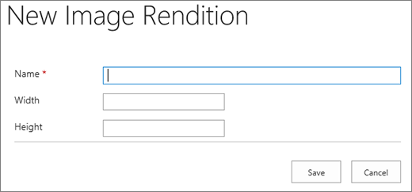

# Bildoptimierung für SharePoint OnlineImage optimization for SharePoint Online

Die Ladegeschwindigkeit einer Webseite hängt von der Gesamtgröße aller Komponenten ab, die zum Rendern der Seite erforderlich sind, einschließlich Bildern, HTML, JavaScript und CSS.The loading speed of a webpage depends on the combined size of all the components required to render the page including images, HTML, JavaScript, and CSS. Bilder sind eine großartige Möglichkeit, Ihre Website attraktiver zu gestalten, ihre Größe kann jedoch die Leistung beeinträchtigen.Images are a great way to make your site more appealing, but their size can affect performance. Wenn Sie Ihre Bilder durch Komprimierung und Größenänderung optimieren und mithilfe von Sprites können Sie die Effekte von sehr großen Bildern kompensieren.By optimizing your images with compression and resizing, and using sprites, you can offset the effects of very large images. Mithilfe von SharePoint-Bilddarstellungen können Sie ein einzelnes groß Bild hochladen und Abschnitte des Bilds anzeigen, sodass es wieder verwendet und nicht erneut geladen wird.Using SharePoint image renditions, you can upload a single large image, and display sections of the image allowing it to be reused rather than reloaded.
  
## Verwenden von Sprites zum Beschleunigen des Ladens von Bildern in SharePoint OnlineUsing sprites to speed up image loading in SharePoint Online

|||
|:-----|:-----|
| Ein Image-Sprite enthält viele kleinere Bilder.An image sprite contains many smaller images. Mit CSS wählen Sie einen Teil des zusammengesetzten Bilds aus, der auf einem bestimmten Teil der Seite mit absoluter Positionierung angezeigt werden soll.Using CSS you select a part of the composite image to display on a particular part of the page with absolute positioning. Grundsätzlich verschieben Sie ein einzelnes Bild um die Seite, anstatt mehrere Bilder zu laden, und machen einen kleinen Teil dieses Bilds sichtbar durch ein kleines Fenster, in dem der erforderliche Teil des Sprite-Bilds für den Endbenutzer angezeigt wird.Basically, you move a single image around the page instead of loading multiple images, and make a small part of that image visible through a small window where the required part of the sprite image is shown to the end user. SharePoint Online verwendet Sprites, um die unterschiedlichen Symbole in der aufeinander.SharePoint Online uses sprites to display its various icons in the sprite spcommon.png.     Hier finden Sie die folgenden Themen:What's covered here:     BildkomprimierungImage compression     BildoptimierungImage optimization     SharePoint-BilddarstellungenSharePoint image renditions    ||
   
Dies kann die Leistung verbessern, da Sie nur ein Bild anstatt mehrerer herunterladen und dann dieses Bild Zwischenspeichern und wieder verwenden.This can increase performance because you download only one image instead of several and then cache and reuse that image. Auch wenn das Bild nicht zwischengespeichert bleibt, indem Sie ein einzelnes Bild anstelle von mehreren Bildern haben, wird durch diese Methode die Gesamtzahl der HTTP-Anforderungen an den Server reduziert, wodurch die Seitenladezeiten verkürzt werden.Even if the image does not remain cached, by having a single image instead of multiple images, this method reduces the total number of HTTP requests to the server which will reduce page loading times. Dies ist wirklich eine Form der Bild Bündelung.This is really a form of image bundling. Dies ist eine sehr nützliche Methode, wenn sich die Bilder nicht sehr häufig ändern, beispielsweise Symbole, wie im obigen SharePoint-Beispiel dargestellt.This is a very useful technique if the images are not changing very often, for example, icons, as shown in the SharePoint example provided above. Sie können [Web Essentials](http://vswebessentials.com/), ein Open Source-Community-basiertes Projekt von Drittanbietern verwenden, um dies problemlos in Microsoft Visual Studio zu erreichen.You can how to use [Web Essentials](http://vswebessentials.com/), a third-party, open-source, community-based project to achieve this easily in Microsoft Visual Studio. Weitere Informationen finden Sie unter [Verkleinerungs und Bündelung in SharePoint Online](https://go.microsoft.com/fwlink/?LinkId=708698).For more information, see [Minification and bundling in SharePoint Online](https://go.microsoft.com/fwlink/?LinkId=708698).
  
## Verwenden von Bildkomprimierung und-Optimierung, um das Laden von Seiten in SharePoint zu beschleunigenUsing image compression and optimization to speed up page loading in SharePoint

Bei der Bildkomprimierung und-Optimierung geht es darum, die Dateigröße der Bilder, die Sie auf Ihrer Website verwenden, zu reduzieren.Image compression and optimization is about reducing the file size of the images you use on your site. Die beste Technik, um die Größe eines Bilds zu verringern, besteht oft in der Größe des Bilds auf die maximalen Dimensionen, die auf der Website angezeigt werden.Often, the best technique to reduce the size of an image is to resize the image to the maximum dimensions that it will be viewed on the site. Es hat keinen Sinn, ein Bild größer zu haben, als es jemals angezeigt wird.There is no sense in having an image larger than it will ever be viewed. Sicherstellen, dass die Bilder in den richtigen Dimensionen mit einem Bild-Editor sind, ist eine schnelle und einfache Möglichkeit, um die Größe Ihrer Seite zu reduzieren.Making sure images are of the correct dimensions using an image editor is a quick and easy way to reduce the size of your page.
  
Sobald Bilder die richtige Größe haben, besteht der nächste Schritt darin, die Komprimierung dieser Bilder zu optimieren.Once images are the right size, the next step is to optimize the compression of these images. Für Komprimierung und Optimierung stehen verschiedene Tools zur Verfügung, darunter Fotogalerie und Drittanbietertools.There are various tools available to use for compression and optimization, including Photo Gallery and third-party tools. Der Schlüssel zur Komprimierung besteht darin, die Dateigröße so weit wie möglich zu reduzieren, ohne für Endbenutzer eine erkennbare Qualität zu verlieren.The key to compression is to reduce the file size as much as possible without losing any discernible quality for end users. Vergewissern Sie sich, dass Sie Ihre komprimierten Dateien auf einer hochauflösenden Anzeige testen, um sicherzustellen, dass Sie immer noch gut aussehen.Make sure you test your compressed files on a high-definition display to ensure they will still look good.
  
## Beschleunigen von Seitendownloads mithilfe von SharePoint-BilddarstellungenSpeed up page downloads by using SharePoint image renditions

Bildwiedergaben sind ein Feature in SharePoint Online, mit dem Sie verschiedene Versionen von Bildern basierend auf vordefinierten Bilddimensionen bereitstellen können.Image renditions are a feature in SharePoint Online that allows you to serve up different versions of images based on pre-defined image dimensions. Dies ist besonders wichtig, wenn Benutzer generierte Bildinhalte vorhanden sind oder die Bildabmessungen wie Breite und Höhe durch den CSS auf der Website festgelegt sind.This is especially important when there is user-generated image content or the image dimensions such as width and height are fixed by the CSS on the site. Auch wenn ein Bild mit CSS festgelegt ist, wird das vollständige Bild der Auflösung immer noch geladen.Even if an image is fixed by CSS, the full resolution image is still loaded. In diesem Fall kann die Dateigröße mithilfe von Bilddarstellungen reduziert werden.In this case the file size can be reduced by using image renditions.
  
> [!NOTE]
> Darstellungen sind nur für SharePoint verfügbar, wenn die Veröffentlichung aktiviert ist.Renditions are only available for SharePoint when publishing is enabled. Sie können die Veröffentlichung unter Einstellungen \> Websiteeinstellungen \> Verwalten von Website \> Features SharePoint Server Publishing aktivieren.You can enable publishing under Settings \> Site Settings \> Manage site features \> SharePoint Server Publishing. Die Option wird nicht anders angezeigt.The option will not appear otherwise. 
  
Die Größenänderung der Bildwiedergabe wird durch die kleinste von Ihnen definierte Dimension, entweder Breite oder Höhe, und durch anschließende Änderung der Größe des Bilds, sodass die andere Bemaßung automatisch auf Grundlage des gesperrten Seitenverhältnisses angepasst wird.The image rendition resizing works by taking the smallest dimension you define, either width or height, and then resizing the image so that the other dimension is automatically resized based on the locked aspect ratio. Standardmäßig wird das Bild von der Mitte um die restlichen Bemaßungen zugeschnitten.By default, it will crop the image from the center by the remaining dimensions. Wenn Sie beispielsweise eine Darstellung von 100px Wide und 50px High definieren und Ihr Originalbild 1000px breit und 800px hoch ist, wird die Größe geändert, sodass die 800px-Dimension jetzt 50px ist und die 1000px-Dimension (jetzt 62,5 px) von der Mitte des Bilds abgeschnitten wird.For example, if you define a rendition of 100px wide and 50px high and your original image is 1000px wide and 800px high, it will be resized so that the 800px dimension is now 50px and the 1000px dimension (now 62.5px) is cropped from the center of the image.
  
Die Schritte sind relativ einfach, aber damit Bilder die Darstellungen verwenden können, müssen die Formatvarianten auf der SharePoint-Website sein, bevor Sie die Bilder hinzufügen.The steps are relatively simple but for images to use the renditions, the renditions need to be on the SharePoint site before you add the images. Außerdem müssen Sie die SharePoint Server-Veröffentlichungs Infrastruktur (Websitesammlungsebene) und die SharePoint Server-Veröffentlichungsfeatures (Websiteebene) aktiviert haben.In addition, you also need to have the SharePoint Server Publishing Infrastructure (Site Collection Level) and SharePoint Server Publishing (Site Level) features turned on.
  
 **Hinzufügen einer Bildwiedergabe zur Beschleunigung des Seitenladevorgangs****Add an image rendition to speed up page loading**
  
1. Stellen Sie sicher, dass das Benutzerkonto, mit dem dieses Verfahren ausgeführt wird, mindestens über Entwurfsberechtigungen für die Website auf oberster Ebene der Websitesammlung verfügt und dass die Website auf einer Webseite veröffentlicht wird.Verify that the user account that is performing this procedure has, at minimum, Design permissions to the top-level site of the site collection, and that the site is being published to a webpage.
    
2. Wechseln Sie in einem Webbrowser zur Website auf oberster Ebene der Veröffentlichungswebsite Sammlung.In a web browser, go to the top-level site of the publishing site collection.
    
3. Klicken Sie auf das Symbol **Einstellungen**.Choose the **Settings** icon. 
    
4. Auf der Seite **Websiteeinstellungen** im Abschnitt **Aussehen und Verhalten** werden die integrierten Bilddarstellungen angezeigt.On the **Site Settings** page, in the **Look and Feel** section, you will see the built-in image renditions. 
    
    Sie können die Out-of-Box-Formatvarianten verwenden oder **Bilddarstellungen** auswählen, um eine neue zu erstellen.You can use the out of the box renditions or choose **Image Renditions** to create a new one. 
    
    
  
5. Wählen Sie auf der Seite **Bildwiedergaben** die Option **Neues Element hinzufügen**.On the **Image Renditions** page, choose **Add new item**.
    
    
  
6. Geben Sie auf der Seite **Neue Bildwiedergabe** in das Feld **Name** einen Namen für die Darstellung ein, z.On the **New Image Rendition** page, in the **Name** box, enter a name for the rendition. 
    
7. Geben Sie in die Textfelder **Breite** und **Höhe** die Breite und Höhe der Darstellung in Pixel ein, und klicken Sie dann auf **Speichern**.In the **Width** and **Height** text boxes, enter the width and height, in pixels, of the rendition, and then choose **Save**.
    
    
  
## Benutzerdefiniertes Zuschneiden mit Bilddarstellungen in SharePointCustom cropping with image renditions in SharePoint

Standardmäßig wird eine Bilddarstellung aus der Mitte des Bilds generiert.By default, an image rendition is generated from the center of the image. Sie können die Bilddarstellung für einzelne Bilder anpassen, indem Sie den Teil des Bilds zuschneiden, den Sie verwenden möchten.You can adjust the image rendition for individual images by cropping the portion of the image that you want to use. Sie können die Bilder pro Darstellung individuell zuschneiden.You can crop the images on an individual basis, per rendition. Das Zuschneiden der Bilder beschleunigt das Laden der Seite, indem der BLOB-Cache von SharePoint zum Erstellen einer Version des Bilds für jede Darstellung verwendet wird.Cropping the images speeds up page loading by using SharePoint's blob cache to create a version of the image for each rendition. Auf diese Weise wird die Serverlast reduziert, da das Bild nur einmal geändert wird und dann den Endbenutzern mehrmals zur Verfügung steht.This way the server load is reduced because the image is only resized once and is then ready to serve to end users multiple times. Weitere Informationen zum Zuschneiden einer Bilddarstellung finden Sie unter [Zuschneiden einer Bilddarstellung](https://go.microsoft.com/fwlink/p/?LinkId=525626).For more information on how to crop an image rendition, see [Crop an image rendition](https://go.microsoft.com/fwlink/p/?LinkId=525626).
  

