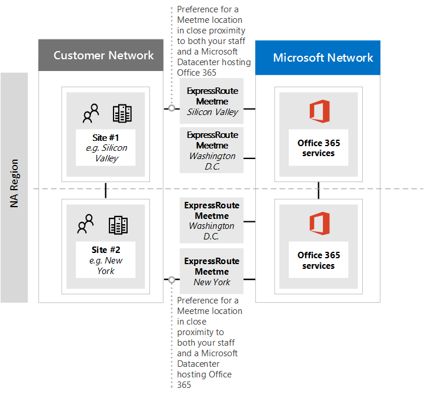

# <a name="implementing-expressroute-for-office-365"></a><span data-ttu-id="56a5a-106">Implementieren von ExpressRoute für Office 365</span><span class="sxs-lookup"><span data-stu-id="56a5a-106">Implementing ExpressRoute for Office 365</span></span>

<span data-ttu-id="56a5a-107">Express Route für Office 365 bietet einen alternativen Routingpfad zu vielen mit dem Internet verbundenen Office 365-Diensten.</span><span class="sxs-lookup"><span data-stu-id="56a5a-107">ExpressRoute for Office 365 provides an alternate routing path to many internet facing Office 365 services.</span></span> <span data-ttu-id="56a5a-108">Die Architektur von Express Route für Office 365 basiert auf öffentlich zugänglichen IP-Präfixen von Office 365-Diensten, die bereits über das Internet in Ihre bereitgestellten Express Route-Schaltungen für eine spätere Umverteilung dieser IP-Präfixe in Netzwerk.</span><span class="sxs-lookup"><span data-stu-id="56a5a-108">The architecture of ExpressRoute for Office 365 is based on advertising public IP prefixes of Office 365 services that are already accessible over the Internet into your provisioned ExpressRoute circuits for subsequent redistribution of those IP prefixes into your network.</span></span> <span data-ttu-id="56a5a-109">Mit Express Route können Sie für viele Office 365-Dienste mehrere verschiedene Routingpfade über das Internet und über Express Route effektiv aktivieren.</span><span class="sxs-lookup"><span data-stu-id="56a5a-109">With ExpressRoute you effectively enable several different routing paths, through the internet and through ExpressRoute, for many Office 365 services.</span></span> <span data-ttu-id="56a5a-110">Dieser Status des Routings in Ihrem Netzwerk kann eine wesentliche Änderung der Entwicklung der internen Netzwerktopologie darstellen.</span><span class="sxs-lookup"><span data-stu-id="56a5a-110">This state of routing on your network may represent a significant change to how your internal network topology is designed.</span></span>
  
 <span data-ttu-id="56a5a-111">**Status:** Vollständige Anleitung v2</span><span class="sxs-lookup"><span data-stu-id="56a5a-111">**Status:** Complete Guide v2</span></span>
  
<span data-ttu-id="56a5a-112">Sie müssen Ihre Express Route für Office 365-Implementierung sorgfältig planen, um die Netzwerkkomplexität des Routings über eine dedizierte Leitung mit Routen zu ermöglichen, die in Ihr Kernnetzwerk und das Internet eingespritzt werden.</span><span class="sxs-lookup"><span data-stu-id="56a5a-112">You must carefully plan your ExpressRoute for Office 365 implementation to accommodate for the network complexities of having routing available via both a dedicated circuit with routes injected into your core network and the internet.</span></span> <span data-ttu-id="56a5a-113">Wenn Sie und Ihr Team die detaillierten Planungs-und Testschritte in diesem Handbuch nicht durchführen, besteht ein hohes Risiko, dass Sie bei aktivierter Express Route-Schaltung mit einem intermittierenden oder einem Totalverlust der Konnektivität zu Office 365-Diensten arbeiten.</span><span class="sxs-lookup"><span data-stu-id="56a5a-113">If you and your team don't perform the detailed planning and testing in this guide, there is a high risk you'll experience intermittent or a total loss of connectivity to Office 365 services when the ExpressRoute circuit is enabled.</span></span>
  
<span data-ttu-id="56a5a-114">Um eine erfolgreiche Implementierung zu erhalten, müssen Sie Ihre Infrastrukturanforderungen analysieren, detaillierte Netzwerkbewertung und-Entwurf durchlaufen, die Einführung schrittweise und kontrolliert planen und einen detaillierten Validierungs-und Testplan erstellen.</span><span class="sxs-lookup"><span data-stu-id="56a5a-114">To have a successful implementation, you will need to analyze your infrastructure requirements, go through detailed network assessment and design, carefully plan the rollout in a staged and controlled manner, and build a detailed validation and testing plan.</span></span> <span data-ttu-id="56a5a-115">Bei einer umfangreichen, verteilten Umgebung ist es nicht unüblich, dass Implementierungen mehrere Monate umfassen.</span><span class="sxs-lookup"><span data-stu-id="56a5a-115">For a large, distributed environment it's not uncommon to see implementations span several months.</span></span> <span data-ttu-id="56a5a-116">Dieses Handbuch soll Ihnen bei der Planung helfen.</span><span class="sxs-lookup"><span data-stu-id="56a5a-116">This guide is designed to help you plan ahead.</span></span>
  
<span data-ttu-id="56a5a-117">Große erfolgreiche Bereitstellungen können bei der Planung sechs Monate dauern und häufig Teammitglieder aus vielen Bereichen der Organisation einschließen, einschließlich Netzwerk-, Firewall-und Proxy Serveradministratoren, Office 365-Administratoren, Sicherheit, Endbenutzer Unterstützung, Projekt Verwaltung und Führungskräfte Sponsoring.</span><span class="sxs-lookup"><span data-stu-id="56a5a-117">Large successful deployments may take six months in planning and often include team members from many areas in the organization including networking, Firewall and Proxy server administrators, Office 365 administrators, security, end-user support, project management, and executive sponsorship.</span></span> <span data-ttu-id="56a5a-118">Ihre Investition in den Planungsprozess verringert die Wahrscheinlichkeit, dass Bereitstellungsfehler auftreten, die zu Ausfallzeiten oder komplexen und kostspieligen Problembehandlung führen.</span><span class="sxs-lookup"><span data-stu-id="56a5a-118">Your investment in the planning process will reduce the likelihood that you'll experience deployment failures resulting in downtime or complex and expensive troubleshooting.</span></span>
  
<span data-ttu-id="56a5a-119">Wir erwarten, dass die folgenden Voraussetzungen erfüllt sein müssen, bevor dieser Einführungsleitfaden gestartet wird.</span><span class="sxs-lookup"><span data-stu-id="56a5a-119">We expect the following pre-requisites to be completed before this implementation guide is started.</span></span>
  
1. <span data-ttu-id="56a5a-120">Sie haben eine Netzwerkbewertung durchgeführt, um zu ermitteln, ob Express Route empfohlen und genehmigt wurde.</span><span class="sxs-lookup"><span data-stu-id="56a5a-120">You've completed a network assessment to determine if ExpressRoute is recommended and approved.</span></span>

2. <span data-ttu-id="56a5a-121">Sie haben einen Express Route-Netzwerkdienst Anbieter ausgewählt.</span><span class="sxs-lookup"><span data-stu-id="56a5a-121">You've selected an ExpressRoute network service provider.</span></span> <span data-ttu-id="56a5a-122">Hier finden Sie Details zu den [Express Route-Partnern und Peering-Standorten](https://azure.microsoft.com/documentation/articles/expressroute-locations/).</span><span class="sxs-lookup"><span data-stu-id="56a5a-122">Find details about the [ExpressRoute partners and peering locations](https://azure.microsoft.com/documentation/articles/expressroute-locations/).</span></span>

3. <span data-ttu-id="56a5a-123">Sie haben bereits die [Express Route-Dokumentation](https://azure.microsoft.com/documentation/services/expressroute/) gelesen und verstanden, und Ihr internes Netzwerk kann die Voraussetzungen für Express Route erfüllen.</span><span class="sxs-lookup"><span data-stu-id="56a5a-123">You've already read and understand the [ExpressRoute documentation](https://azure.microsoft.com/documentation/services/expressroute/) and your internal network is able to meet ExpressRoute pre-requisites end to end.</span></span>

4. <span data-ttu-id="56a5a-124">Ihr Team hat alle öffentlichen Anleitungen und Dokumentationen unter [https://aka.ms/expressrouteoffice365](https://aka.ms/expressrouteoffice365) [https://aka.ms/ert](https://aka.ms/ert)gelesen und die [Azure Express Route für Office 365-Schulungs](https://channel9.msdn.com/series/aer) Reihe auf Kanal 9 beobachtet, um sich mit wichtigen technischen Details vertraut zu machen, einschließlich:</span><span class="sxs-lookup"><span data-stu-id="56a5a-124">Your team has read all of the public guidance and documentation at [https://aka.ms/expressrouteoffice365](https://aka.ms/expressrouteoffice365), [https://aka.ms/ert](https://aka.ms/ert), and watched the [Azure ExpressRoute for Office 365 Training](https://channel9.msdn.com/series/aer) series on Channel 9 to gain an understanding of critical technical details including:</span></span>

      - <span data-ttu-id="56a5a-125">Die Internet Abhängigkeiten von Saas-Diensten.</span><span class="sxs-lookup"><span data-stu-id="56a5a-125">The internet dependencies of SaaS services.</span></span>

      - <span data-ttu-id="56a5a-126">Vermeiden von asymmetrischen Routen und behandeln eines komplexen Routings.</span><span class="sxs-lookup"><span data-stu-id="56a5a-126">How to avoid asymmetric routes and handle complex routing.</span></span>

      - <span data-ttu-id="56a5a-127">Integrieren von Sicherheits-, Verfügbarkeits-und Anwendungsebenen-Steuerelementen</span><span class="sxs-lookup"><span data-stu-id="56a5a-127">How to incorporate perimeter security, availability, and application level controls.</span></span>

## <a name="begin-by-gathering-requirements"></a><span data-ttu-id="56a5a-128">Beginnen Sie mit der Erfassung von Anforderungen</span><span class="sxs-lookup"><span data-stu-id="56a5a-128">Begin by gathering requirements</span></span>
<span data-ttu-id="56a5a-129"><a name="requirements"> </a></span><span class="sxs-lookup"><span data-stu-id="56a5a-129"></span></span>

<span data-ttu-id="56a5a-130">Legen Sie zunächst fest, welche Features und Dienste Sie in Ihrer Organisation einführen möchten.</span><span class="sxs-lookup"><span data-stu-id="56a5a-130">Start by determining which features and services you plan to adopt within your organization.</span></span> <span data-ttu-id="56a5a-131">Sie müssen ermitteln, welche Funktionen der verschiedenen Office 365-Dienste verwendet werden sollen und welche Standorte in Ihrem Netzwerk Personen mit diesen Funktionen hosten werden.</span><span class="sxs-lookup"><span data-stu-id="56a5a-131">You need to determine which features of the different Office 365 services will be used and which locations on your network will host people using those features.</span></span> <span data-ttu-id="56a5a-132">Mit dem Katalog von Szenarien müssen Sie die Netzwerkattribute hinzufügen, die für jedes dieser Szenarien erforderlich sind. wie ein eingehender und ausgehender Netzwerkdatenverkehr und ob die Office 365-Endpunkte über Express Route zur Verfügung stehen.</span><span class="sxs-lookup"><span data-stu-id="56a5a-132">With the catalog of scenarios, you need to add the network attributes that each of those scenarios require; such as inbound and outbound network traffic flows and if the Office 365 endpoints are available over ExpressRoute or not.</span></span>
  
<span data-ttu-id="56a5a-133">So erfassen Sie die Anforderungen Ihrer Organisation:</span><span class="sxs-lookup"><span data-stu-id="56a5a-133">To gather your organization's requirements:</span></span>
  
- <span data-ttu-id="56a5a-134">Katalogisieren Sie den eingehenden und ausgehenden Netzwerkdatenverkehr für die Office 365-Dienste, die Ihre Organisation verwendet.</span><span class="sxs-lookup"><span data-stu-id="56a5a-134">Catalog the inbound and outbound network traffic for the Office 365 services your organization is using.</span></span> <span data-ttu-id="56a5a-135">Konsultieren Sie die Seite Office 365-URLs und IP-Adressbereiche für die Beschreibung der Abläufe, die unterschiedliche Office 365-Szenarien erfordern.</span><span class="sxs-lookup"><span data-stu-id="56a5a-135">Consult Office 365 URLs and IP address ranges page for the description of flows that different Office 365 scenarios require.</span></span>

- <span data-ttu-id="56a5a-136">Erfassen Sie Dokumentation der vorhandenen Netzwerktopologie mit Details zu Ihrem internen WAN-Backbone und der Topologie, der Konnektivität von Satellitenstandorten, der Konnektivität der letzten Meile-Benutzer, dem Routing zu Netzwerkperimeter-Ausgangspunkten und Proxy Diensten.</span><span class="sxs-lookup"><span data-stu-id="56a5a-136">Gather documentation of existing network topology showing details of your internal WAN backbone and topology, connectivity of satellite sites, last mile user connectivity, routing to network perimeter egress points, and proxy services.</span></span>

  - <span data-ttu-id="56a5a-137">Identifizieren Sie eingehende Dienstendpunkte in den Netzwerkdiagrammen, mit denen Office 365 und andere Microsoft-Dienste eine Verbindung herstellen, und zeigen Sie sowohl Internet als auch vorgeschlagene Express Route-Verbindungspfade an.</span><span class="sxs-lookup"><span data-stu-id="56a5a-137">Identify inbound service endpoints on the network diagrams that Office 365 and other Microsoft services will connect to, showing both internet and proposed ExpressRoute connection paths.</span></span>

  - <span data-ttu-id="56a5a-138">Identifizieren Sie alle geographischen Benutzer Standorte und die WAN-Konnektivität Zwischenstand Orten, an denen Standorte derzeit einen Ausstieg ins Internet haben und an welchen Standorten ein Ausstieg an einen Express Route-Peering-Standort vorgeschlagen wird.</span><span class="sxs-lookup"><span data-stu-id="56a5a-138">Identify all geographic user locations and WAN connectivity between locations along with which locations currently have an egress to the internet and which locations are proposed to have an egress to an ExpressRoute peering location.</span></span>

  - <span data-ttu-id="56a5a-139">Identifizieren Sie alle edgegeräte, wie Proxys, Firewalls usw., und Katalogisieren Sie Ihre Beziehung zu Flows, die über das Internet und Express Route gehen.</span><span class="sxs-lookup"><span data-stu-id="56a5a-139">Identify all edge devices, such as proxies, firewalls, and so on and catalog their relationship to flows going over the Internet and ExpressRoute.</span></span>

  - <span data-ttu-id="56a5a-140">Dokumentieren Sie, ob Endbenutzer über direktes Routing oder indirekten Anwendungsproxy für Internet-und Express Route-Datenströme auf Office 365-Dienste zugreifen.</span><span class="sxs-lookup"><span data-stu-id="56a5a-140">Document whether end users will access Office 365 services via direct routing or indirect application proxy for both Internet and ExpressRoute flows.</span></span>

- <span data-ttu-id="56a5a-141">Fügen Sie dem Netzwerkdiagramm den Speicherort Ihrer Mandanten-und Meet-Me-Speicherorte hinzu.</span><span class="sxs-lookup"><span data-stu-id="56a5a-141">Add the location of your tenant and meet-me locations to your network diagram.</span></span>

- <span data-ttu-id="56a5a-142">Schätzen Sie die erwarteten und beobachteten Merkmale der Netzwerkleistung und-Latenz von Hauptbenutzer Standorten zu Office 365.</span><span class="sxs-lookup"><span data-stu-id="56a5a-142">Estimate the expected and observed network performance and latency characteristics from major user locations to Office 365.</span></span> <span data-ttu-id="56a5a-143">Beachten Sie, dass Office 365 eine globale und verteilte Gruppe von Diensten ist und Benutzer eine Verbindung zu Standorten herstellen, die sich möglicherweise vom Standort Ihres Mandanten unterscheiden.</span><span class="sxs-lookup"><span data-stu-id="56a5a-143">Keep in mind that Office 365 is a global and distributed set of services and users will be connecting to locations that may be different from the location of their tenant.</span></span> <span data-ttu-id="56a5a-144">Aus diesem Grund wird empfohlen, die Wartezeit zwischen dem Benutzer und dem engsten Rand des globalen Microsoft-Netzwerks über Express Route und Internet Verbindungen zu messen und zu optimieren.</span><span class="sxs-lookup"><span data-stu-id="56a5a-144">For this reason, it is recommended to measure and optimize for latency between the user and the closest edge of Microsoft global network over ExpressRoute and Internet connections.</span></span> <span data-ttu-id="56a5a-145">Sie können Ihre Ergebnisse aus der Netzwerkbewertung zur Unterstützung dieser Aufgabe verwenden.</span><span class="sxs-lookup"><span data-stu-id="56a5a-145">You can use your findings from the network assessment to aid with this task.</span></span>

- <span data-ttu-id="56a5a-146">Auflisten von Unternehmensnetzwerk Sicherheit und Anforderungen an hohe Verfügbarkeit, die mit der neuen Express Route-Verbindung erfüllt werden müssen.</span><span class="sxs-lookup"><span data-stu-id="56a5a-146">List company network security and high availability requirements that need to be met with the new ExpressRoute connection.</span></span> <span data-ttu-id="56a5a-147">So erhalten Benutzer beispielsweise weiterhin Zugriff auf Office 365 im Fall des Ausfalls des Internet Austritts oder Express Route.</span><span class="sxs-lookup"><span data-stu-id="56a5a-147">For example, how do users continue to get access to Office 365 in the event of the Internet egress or ExpressRoute circuit failure.</span></span>

- <span data-ttu-id="56a5a-148">Dokument, in dem ein-und ausgehende Office 365-Netzwerk Flüsse den Internet Pfad verwenden und Express Route verwenden.</span><span class="sxs-lookup"><span data-stu-id="56a5a-148">Document which inbound and outbound Office 365 network flows will use the Internet path and which will use ExpressRoute.</span></span> <span data-ttu-id="56a5a-149">Die Spezifika der geografischen Standorte Ihrer Benutzer und Details Ihrer lokalen Netzwerktopologie erfordern möglicherweise, dass sich der Plan von einem Benutzerstandort zu einem anderen unterscheidet.</span><span class="sxs-lookup"><span data-stu-id="56a5a-149">The specifics of geographical locations of your users and details of your on-premises network topology may require the plan to be different from one user location to another.</span></span>

### <a name="catalog-your-outbound-and-inbound-network-traffic"></a><span data-ttu-id="56a5a-150">Katalogisieren des ausgehenden und eingehenden Netzwerkdatenverkehrs</span><span class="sxs-lookup"><span data-stu-id="56a5a-150">Catalog your outbound and inbound network traffic</span></span>
<span data-ttu-id="56a5a-151"><a name="trafficCatalog"> </a></span><span class="sxs-lookup"><span data-stu-id="56a5a-151"></span></span>

<span data-ttu-id="56a5a-152">Zur Minimierung des Routings und anderer Netzwerk Komplexitäten wird empfohlen, nur Express Route für Office 365 für die Netzwerkdatenverkehr zu verwenden, die aufgrund behördlicher Vorschriften oder als Ergebnis der Netzwerkbewertung für eine dedizierte Verbindung erforderlich sind.</span><span class="sxs-lookup"><span data-stu-id="56a5a-152">To minimize routing and other network complexities, we recommend that you only use ExpressRoute for Office 365 for the network traffic flows that are required to go over a dedicated connection due to regulatory requirements or as the result of the network assessment.</span></span> <span data-ttu-id="56a5a-153">Darüber hinaus empfiehlt es sich, den Umfang des Express Route-Routings zu inszenieren und die ausgehenden und eingehenden Netzwerkdatenverkehr als unterschiedliche und eindeutige Phasen des Implementierungsprojekts zu erreichen.</span><span class="sxs-lookup"><span data-stu-id="56a5a-153">Additionally, we recommend that you stage the scope of ExpressRoute routing and approach outbound and inbound network traffic flows as different and distinct stages of the implementation project.</span></span> <span data-ttu-id="56a5a-154">Bereitstellen von Express Route für Office 365 für nur vom Benutzer initiierte ausgehende Netzwerkdatenverkehr und überlassen des eingehenden Netzwerkdatenverkehrs über das Internet kann dazu beitragen, die zunehmende topologische Komplexität zu kontrollieren und die Risiken der Einführung zusätzlicher asymmetrischer Routing Möglichkeiten.</span><span class="sxs-lookup"><span data-stu-id="56a5a-154">Deploy ExpressRoute for Office 365 for just user initiated outbound network traffic flows and leave inbound network traffic flows across the Internet can help to control the increase in topological complexity and risks of introducing additional asymmetric routing possibilities.</span></span>
  
<span data-ttu-id="56a5a-155">Ihr Netzwerkdaten Verkehrs Katalog sollte Auflistungen aller eingehenden und ausgehenden Netzwerkverbindungen enthalten, die Sie zwischen Ihrem lokalen Netzwerk und Microsoft haben.</span><span class="sxs-lookup"><span data-stu-id="56a5a-155">Your network traffic catalog should contain listings of all the inbound and outbound network connections that you'll have between your on-premises network and Microsoft.</span></span>
  
- <span data-ttu-id="56a5a-156">Ausgehende Netzwerkdatenverkehr sind Szenarien, in denen eine Verbindung von Ihrer lokalen Umgebung, beispielsweise von internen Clients oder Servern, mit einem Ziel der Microsoft-Dienste initiiert wird.</span><span class="sxs-lookup"><span data-stu-id="56a5a-156">Outbound network traffic flows are any scenarios where a connection is initiated from your on-premises environment, such as from internal clients or servers, with a destination of the Microsoft services.</span></span> <span data-ttu-id="56a5a-157">Diese Verbindungen können direkt in Office 365 oder indirekt erfolgen, beispielsweise wenn die Verbindung über Proxy Server, Firewalls oder andere Netzwerkgeräte auf dem Pfad zu Office 365 übermittelt wird.</span><span class="sxs-lookup"><span data-stu-id="56a5a-157">These connections may be direct to Office 365 or indirect, such as when the connection goes through proxy servers, firewalls, or other networking devices on the path to Office 365.</span></span>

- <span data-ttu-id="56a5a-158">Eingehende Netzwerkdatenverkehr sind Szenarien, in denen eine Verbindung von der Microsoft-Cloud zu einem lokalen Host initiiert wird.</span><span class="sxs-lookup"><span data-stu-id="56a5a-158">Inbound network traffic flows are any scenarios where a connection is initiated from the Microsoft cloud to an on-premises host.</span></span> <span data-ttu-id="56a5a-159">Diese Verbindungen müssen in der Regel Firewall und andere Sicherheitsinfrastrukturen durchlaufen, die von der Kunden Sicherheitsrichtlinie für extern entstandene Abläufe benötigt werden.</span><span class="sxs-lookup"><span data-stu-id="56a5a-159">These connections typically need to go through firewall and other security infrastructure that customer security policy requires for externally originated flows.</span></span>

<span data-ttu-id="56a5a-160">Lesen Sie den Abschnitt **sicherstellen von Routen Symmetrie** im Artikel [Routing mit Express Route für Office 365](https://support.office.com/article/Routing-with-ExpressRoute-for-Office-365-e1da26c6-2d39-4379-af6f-4da213218408) , um festzustellen, welche Dienste eingehenden Datenverkehr senden und suchen Sie nach der Spalte **Express Route für Office 365** im [Office 365 ](https://support.office.com/article/Office-365-URLs-and-IP-address-ranges-8548a211-3fe7-47cb-abb1-355ea5aa88a2)Referenzartikel zu Endpunkten, um die restlichen Verbindungsinformationen zu bestimmen.</span><span class="sxs-lookup"><span data-stu-id="56a5a-160">Read the **Ensuring route symmetry** section of the article [Routing with ExpressRoute for Office 365](https://support.office.com/article/Routing-with-ExpressRoute-for-Office-365-e1da26c6-2d39-4379-af6f-4da213218408) to determine which services will send inbound traffic and look for the column marked **ExpressRoute for Office 365** in the [Office 365 endpoints](https://support.office.com/article/Office-365-URLs-and-IP-address-ranges-8548a211-3fe7-47cb-abb1-355ea5aa88a2) reference article to determine the rest of the connectivity information.</span></span>
  
<span data-ttu-id="56a5a-161">Für jeden Dienst, für den eine ausgehende Verbindung erforderlich ist, sollten Sie die geplante Konnektivität für den Dienst beschreiben, einschließlich Netzwerkrouting, Proxykonfiguration, Paketüberprüfung und Bandbreitenanforderungen.</span><span class="sxs-lookup"><span data-stu-id="56a5a-161">For each service that requires an outbound connection, you'll want to describe the planned connectivity for the service including network routing, proxy configuration, packet inspection, and bandwidth needs.</span></span>
  
<span data-ttu-id="56a5a-162">Für jeden Dienst, für den eine eingehende Verbindung erforderlich ist, benötigen Sie zusätzliche Informationen.</span><span class="sxs-lookup"><span data-stu-id="56a5a-162">For each service that requires an inbound connection, you'll need some additional information.</span></span> <span data-ttu-id="56a5a-163">Server in der Microsoft-Cloud stellen Verbindungen mit Ihrem lokalen Netzwerk her.</span><span class="sxs-lookup"><span data-stu-id="56a5a-163">Servers in the Microsoft cloud will establish connections to your on-premises network.</span></span> <span data-ttu-id="56a5a-164">um sicherzustellen, dass die Verbindungen ordnungsgemäß hergestellt werden, sollten Sie alle Aspekte dieser Konnektivität beschreiben, einschließlich; die öffentlichen DNS-Einträge für die Dienste, die diese eingehenden Verbindungen akzeptieren, die in CIDR formatierten IPv4-IP-Adressen, die ISP-Geräte, und wie eingehende NAT-oder Quell-NAT für diese Verbindungen behandelt werden.</span><span class="sxs-lookup"><span data-stu-id="56a5a-164">to ensure the connections are made correctly, you'll want to describe all aspects of this connectivity, including; the public DNS entries for the services that will accept these inbound connections, the CIDR formatted IPv4 IP addresses, which ISP equipment is involved, and how inbound NAT or source NAT is handled for these connections.</span></span>
  
<span data-ttu-id="56a5a-165">Eingehende Verbindungen sollten unabhängig davon überprüft werden, ob Sie eine Verbindung über das Internet oder Express Route herstellen, um sicherzustellen, dass kein asymmetrisches Routing eingeführt wurde.</span><span class="sxs-lookup"><span data-stu-id="56a5a-165">Inbound connections should be reviewed regardless of whether they're connecting over the internet or ExpressRoute to ensure asymmetric routing hasn't been introduced.</span></span> <span data-ttu-id="56a5a-166">In einigen Fällen müssen lokale Endpunkte, für die Office 365-Dienste eingehende Verbindungen initiieren, möglicherweise auch von anderen Microsoft-und nicht-Microsoft-Diensten aufgerufen werden.</span><span class="sxs-lookup"><span data-stu-id="56a5a-166">In some cases, on-premises endpoints that Office 365 services initiate inbound connections to may also need to be accessed by other Microsoft and non-Microsoft services.</span></span> <span data-ttu-id="56a5a-167">Es ist von größter Bedeutung, dass das Express Route-Routing zu diesen Diensten für Office 365-Zwecke keine anderen Szenarien unterbricht.</span><span class="sxs-lookup"><span data-stu-id="56a5a-167">It is paramount that enabling ExpressRoute routing to these services for Office 365 purposes doesn't break other scenarios.</span></span> <span data-ttu-id="56a5a-168">In vielen Fällen müssen Kunden möglicherweise bestimmte Änderungen an Ihrem internen Netzwerk implementieren, wie etwa Quell basierte NAT, um sicherzustellen, dass eingehende Datenflüsse von Microsoft symmetrisch bleiben, nachdem Express Route aktiviert wurde.</span><span class="sxs-lookup"><span data-stu-id="56a5a-168">In many cases, customers may need to implement specific changes to their internal network, such as source based NAT, to ensure that inbound flows from Microsoft remain symmetric after ExpressRoute is enabled.</span></span>
  
<span data-ttu-id="56a5a-169">Hier ist ein Beispiel für die erforderliche Detailstufe.</span><span class="sxs-lookup"><span data-stu-id="56a5a-169">Here's a sample of the level of detail required.</span></span> <span data-ttu-id="56a5a-170">In diesem Fall wird die Exchange-Hybrid Verbindung zum lokalen System über Express Route weitergeleitet.</span><span class="sxs-lookup"><span data-stu-id="56a5a-170">In this case Exchange Hybrid would route to the on-premises system over ExpressRoute.</span></span>

|<span data-ttu-id="56a5a-171">**Connection-Eigenschaft**</span><span class="sxs-lookup"><span data-stu-id="56a5a-171">**Connection property**</span></span>|<span data-ttu-id="56a5a-172">**Wert**</span><span class="sxs-lookup"><span data-stu-id="56a5a-172">**Value**</span></span>|
|:-----|:-----|
|<span data-ttu-id="56a5a-173">**Richtung des Netzwerkverkehrs**</span><span class="sxs-lookup"><span data-stu-id="56a5a-173">**Network traffic direction**</span></span> <br/> |<span data-ttu-id="56a5a-174">Eingehend</span><span class="sxs-lookup"><span data-stu-id="56a5a-174">Inbound</span></span>  <br/> |
|<span data-ttu-id="56a5a-175">**Dienst**</span><span class="sxs-lookup"><span data-stu-id="56a5a-175">**Service**</span></span> <br/> |<span data-ttu-id="56a5a-176">Exchange Hybrid</span><span class="sxs-lookup"><span data-stu-id="56a5a-176">Exchange Hybrid</span></span>  <br/> |
|<span data-ttu-id="56a5a-177">**Öffentlicher Office 365-Endpunkt (Quelle)**</span><span class="sxs-lookup"><span data-stu-id="56a5a-177">**Public Office 365 endpoint (source)**</span></span> <br/> |<span data-ttu-id="56a5a-178">Exchange Online (IP-Adressen)</span><span class="sxs-lookup"><span data-stu-id="56a5a-178">Exchange Online (IP addresses)</span></span>  <br/> |
|<span data-ttu-id="56a5a-179">**Öffentlicher lokale Endpunkt (Ziel)**</span><span class="sxs-lookup"><span data-stu-id="56a5a-179">**Public On-Premises Endpoint (destination)**</span></span> <br/> |<span data-ttu-id="56a5a-180">5.5.5.5</span><span class="sxs-lookup"><span data-stu-id="56a5a-180">5.5.5.5</span></span>  <br/> |
|<span data-ttu-id="56a5a-181">**Öffentlicher (Internet) DNS-Eintrag**</span><span class="sxs-lookup"><span data-stu-id="56a5a-181">**Public (Internet) DNS entry**</span></span> <br/> |<span data-ttu-id="56a5a-182">Autodiscover.contoso.com</span><span class="sxs-lookup"><span data-stu-id="56a5a-182">Autodiscover.contoso.com</span></span>  <br/> |
|<span data-ttu-id="56a5a-183">**Wird dieser lokale Endpunkt für andere Microsoft-Dienste (nicht für Office 365) verwendet**</span><span class="sxs-lookup"><span data-stu-id="56a5a-183">**Will this on-premises endpoint be used for by other (non-Office 365) Microsoft services**</span></span> <br/> |<span data-ttu-id="56a5a-184">Nein</span><span class="sxs-lookup"><span data-stu-id="56a5a-184">No</span></span>  <br/> |
|<span data-ttu-id="56a5a-185">**Wird dieser lokale Endpunkt von Benutzern/Systemen im Internet verwendet**</span><span class="sxs-lookup"><span data-stu-id="56a5a-185">**Will this on-premises endpoint be used by users/systems on the Internet**</span></span> <br/> |<span data-ttu-id="56a5a-186">Ja</span><span class="sxs-lookup"><span data-stu-id="56a5a-186">Yes</span></span>  <br/> |
|<span data-ttu-id="56a5a-187">**Interne Systeme, die über öffentliche Endpunkte veröffentlicht wurden**</span><span class="sxs-lookup"><span data-stu-id="56a5a-187">**Internal systems published through public endpoints**</span></span> <br/> |<span data-ttu-id="56a5a-188">Exchange Server-clientzugriffsrolle (lokal) 192.168.101, 192.168.102, 192.168.103</span><span class="sxs-lookup"><span data-stu-id="56a5a-188">Exchange Server client access role (on-premises) 192.168.101, 192.168.102, 192.168.103</span></span>  <br/> |
|<span data-ttu-id="56a5a-189">**IP-Werbung des öffentlichen Endpunkts**</span><span class="sxs-lookup"><span data-stu-id="56a5a-189">**IP advertisement of the public endpoint**</span></span> <br/> |<span data-ttu-id="56a5a-190">**An Internet**: 5.5.0.0/16</span><span class="sxs-lookup"><span data-stu-id="56a5a-190">**To Internet**: 5.5.0.0/16</span></span>  <br/> <span data-ttu-id="56a5a-191">**Bis Express Route**: 5.5.5.0/24</span><span class="sxs-lookup"><span data-stu-id="56a5a-191">**To ExpressRoute**: 5.5.5.0/24</span></span>  <br/> |
|<span data-ttu-id="56a5a-192">**Sicherheits-/Umkreis Steuerungen**</span><span class="sxs-lookup"><span data-stu-id="56a5a-192">**Security/Perimeter Controls**</span></span> <br/> |<span data-ttu-id="56a5a-193">**Internet Pfad**: DeviceID_002</span><span class="sxs-lookup"><span data-stu-id="56a5a-193">**Internet path**: DeviceID_002</span></span>  <br/> <span data-ttu-id="56a5a-194">**Express Route-Pfad**: DeviceID_003</span><span class="sxs-lookup"><span data-stu-id="56a5a-194">**ExpressRoute path**: DeviceID_003</span></span>  <br/> |
|<span data-ttu-id="56a5a-195">**Hohe Verfügbarkeit**</span><span class="sxs-lookup"><span data-stu-id="56a5a-195">**High Availability**</span></span> <br/> |<span data-ttu-id="56a5a-196">Aktiv/aktiv über 2 Geo-redundant</span><span class="sxs-lookup"><span data-stu-id="56a5a-196">Active/Active across 2 geo-redundant</span></span>  <br/> <span data-ttu-id="56a5a-197">Express Route Circuits-Chicago und Dallas</span><span class="sxs-lookup"><span data-stu-id="56a5a-197">ExpressRoute circuits - Chicago and Dallas</span></span>  <br/> |
|<span data-ttu-id="56a5a-198">**Pfad Symmetrie-Steuerelement**</span><span class="sxs-lookup"><span data-stu-id="56a5a-198">**Path symmetry control**</span></span> <br/> |<span data-ttu-id="56a5a-199">**Methode**: Quell-NAT</span><span class="sxs-lookup"><span data-stu-id="56a5a-199">**Method**: Source NAT</span></span>  <br/> <span data-ttu-id="56a5a-200">**Internet Pfad**: Quell-NAT-eingehende Verbindungen zu 192.168.5.5</span><span class="sxs-lookup"><span data-stu-id="56a5a-200">**Internet path**: Source NAT inbound connections to 192.168.5.5</span></span>  <br/> |<span data-ttu-id="56a5a-201">**Express Route-Pfad**: Quell-NAT-Verbindungen mit 192.168.1.0 (Chicago) und 192.168.2.0 (Dallas)</span><span class="sxs-lookup"><span data-stu-id="56a5a-201">**ExpressRoute path**: Source NAT connections to 192.168.1.0 (Chicago) and 192.168.2.0 (Dallas)</span></span>  <br/> |

<span data-ttu-id="56a5a-202">Im folgenden finden Sie ein Beispiel für einen Dienst, der nur ausgehend ist:</span><span class="sxs-lookup"><span data-stu-id="56a5a-202">Here's a sample of a service that is outbound only:</span></span>

|<span data-ttu-id="56a5a-203">**Connection-Eigenschaft**</span><span class="sxs-lookup"><span data-stu-id="56a5a-203">**Connection property**</span></span>|<span data-ttu-id="56a5a-204">**Wert**</span><span class="sxs-lookup"><span data-stu-id="56a5a-204">**Value**</span></span>|
|:-----|:-----|
|<span data-ttu-id="56a5a-205">**Richtung des Netzwerkverkehrs**</span><span class="sxs-lookup"><span data-stu-id="56a5a-205">**Network traffic direction**</span></span> <br/> |<span data-ttu-id="56a5a-206">Ausgehend</span><span class="sxs-lookup"><span data-stu-id="56a5a-206">Outbound</span></span>  <br/> |
|<span data-ttu-id="56a5a-207">**Dienst**</span><span class="sxs-lookup"><span data-stu-id="56a5a-207">**Service**</span></span> <br/> |<span data-ttu-id="56a5a-208">SharePoint Online</span><span class="sxs-lookup"><span data-stu-id="56a5a-208">SharePoint Online</span></span>  <br/> |
|<span data-ttu-id="56a5a-209">**Lokalen Endpunkt (Quelle)**</span><span class="sxs-lookup"><span data-stu-id="56a5a-209">**On-premises endpoint (source)**</span></span> <br/> |<span data-ttu-id="56a5a-210">Benutzer Arbeitsstation</span><span class="sxs-lookup"><span data-stu-id="56a5a-210">User workstation</span></span>  <br/> |
|<span data-ttu-id="56a5a-211">**Öffentlicher Office 365-Endpunkt (Ziel)**</span><span class="sxs-lookup"><span data-stu-id="56a5a-211">**Public Office 365 endpoint (destination)**</span></span> <br/> |<span data-ttu-id="56a5a-212">SharePoint Online (IP-Adressen)</span><span class="sxs-lookup"><span data-stu-id="56a5a-212">SharePoint Online (IP addresses)</span></span>  <br/> |
|<span data-ttu-id="56a5a-213">**Öffentlicher (Internet) DNS-Eintrag**</span><span class="sxs-lookup"><span data-stu-id="56a5a-213">**Public (Internet) DNS entry**</span></span> <br/> |<span data-ttu-id="56a5a-214">\*. SharePoint.com (und zusätzliche FQDNs)</span><span class="sxs-lookup"><span data-stu-id="56a5a-214">\*.sharepoint.com (and additional FQDNs)</span></span>  <br/> |
|<span data-ttu-id="56a5a-215">**CDN-Empfehlungen**</span><span class="sxs-lookup"><span data-stu-id="56a5a-215">**CDN Referrals**</span></span> <br/> |<span data-ttu-id="56a5a-216">CDN.sharepointonline.com (und zusätzliche FQDNs) – von CDN-Anbietern verwaltete IP-Adressen)</span><span class="sxs-lookup"><span data-stu-id="56a5a-216">cdn.sharepointonline.com (and additional FQDNs) - IP addresses maintained by CDN providers)</span></span>  <br/> |
|<span data-ttu-id="56a5a-217">**IP-Werbung und NAT wird verwendet**</span><span class="sxs-lookup"><span data-stu-id="56a5a-217">**IP advertisement and NAT in use**</span></span> <br/> |<span data-ttu-id="56a5a-218">**Internet Pfad/Quell-NAT**: 1.1.1.0/24</span><span class="sxs-lookup"><span data-stu-id="56a5a-218">**Internet path/Source NAT**: 1.1.1.0/24</span></span>  <br/> <span data-ttu-id="56a5a-219">**Express Route Pfad/Quell-NAT**: 1.1.2.0/24 (Chicago) und 1.1.3.0/24 (Dallas)</span><span class="sxs-lookup"><span data-stu-id="56a5a-219">**ExpressRoute path/Source NAT**: 1.1.2.0/24 (Chicago) and 1.1.3.0/24 (Dallas)</span></span>  <br/> |
|<span data-ttu-id="56a5a-220">**Connectivity-Methode**</span><span class="sxs-lookup"><span data-stu-id="56a5a-220">**Connectivity method**</span></span> <br/> |<span data-ttu-id="56a5a-221">**Internet**: über Layer 7-Proxy (PAC-Datei)</span><span class="sxs-lookup"><span data-stu-id="56a5a-221">**Internet**: via layer 7 proxy (.pac file)</span></span>  <br/> <span data-ttu-id="56a5a-222">**Express Route**: Direktes Routing (kein Proxy)</span><span class="sxs-lookup"><span data-stu-id="56a5a-222">**ExpressRoute**: direct routing (no proxy)</span></span>  <br/> |
|<span data-ttu-id="56a5a-223">**Sicherheits-/Umkreis Steuerungen**</span><span class="sxs-lookup"><span data-stu-id="56a5a-223">**Security/Perimeter Controls**</span></span> <br/> |<span data-ttu-id="56a5a-224">**Internet Pfad**: DeviceID_002</span><span class="sxs-lookup"><span data-stu-id="56a5a-224">**Internet path**: DeviceID_002</span></span>  <br/> <span data-ttu-id="56a5a-225">**Express Route-Pfad**: DeviceID_003</span><span class="sxs-lookup"><span data-stu-id="56a5a-225">**ExpressRoute path**: DeviceID_003</span></span>  <br/> |
|<span data-ttu-id="56a5a-226">**Hohe Verfügbarkeit**</span><span class="sxs-lookup"><span data-stu-id="56a5a-226">**High Availability**</span></span> <br/> |<span data-ttu-id="56a5a-227">**Internetpfad**: redundanter Internet Ausstieg</span><span class="sxs-lookup"><span data-stu-id="56a5a-227">**Internet path**: Redundant internet egress</span></span>  <br/> <span data-ttu-id="56a5a-228">**Express Route Pfad**: aktiv/aktiv ' Hot Potato ' Routing über 2 Geo-redundante Express Route Circuits-Chicago und Dallas</span><span class="sxs-lookup"><span data-stu-id="56a5a-228">**ExpressRoute path**: Active/Active 'hot potato' routing across 2 geo-redundant ExpressRoute circuits - Chicago and Dallas</span></span>  <br/> |
|<span data-ttu-id="56a5a-229">**Pfad Symmetrie-Steuerelement**</span><span class="sxs-lookup"><span data-stu-id="56a5a-229">**Path symmetry control**</span></span> <br/> |<span data-ttu-id="56a5a-230">**Methode**: Quell-NAT für alle Verbindungen</span><span class="sxs-lookup"><span data-stu-id="56a5a-230">**Method**: Source NAT for all connections</span></span>  <br/> |

### <a name="your-network-topology-design-with-regional-connectivity"></a><span data-ttu-id="56a5a-231">Entwurf Ihrer Netzwerktopologie mit regionaler Konnektivität</span><span class="sxs-lookup"><span data-stu-id="56a5a-231">Your network topology design with regional connectivity</span></span>
<span data-ttu-id="56a5a-232"><a name="topology"> </a></span><span class="sxs-lookup"><span data-stu-id="56a5a-232"></span></span>

<span data-ttu-id="56a5a-233">Nachdem Sie die Dienste und die dazugehörigen Netzwerkdatenverkehr verstanden haben, können Sie ein Netzwerkdiagramm erstellen, das diese neuen Verbindungsanforderungen enthält, und die Änderungen, die Sie für die Verwendung von Express Route für Office 365 vornehmen werden, veranschaulichen.</span><span class="sxs-lookup"><span data-stu-id="56a5a-233">Once you understand the services and their associated network traffic flows, you can create a network diagram that incorporates these new connectivity requirements and illustrates the changes you'll make to use ExpressRoute for Office 365.</span></span> <span data-ttu-id="56a5a-234">Ihr Diagramm sollte Folgendes aufweisen:</span><span class="sxs-lookup"><span data-stu-id="56a5a-234">Your diagram should include:</span></span>
  
1. <span data-ttu-id="56a5a-235">Alle Benutzer Standorte, von denen aus auf Office 365 und andere Dienste zugegriffen wird.</span><span class="sxs-lookup"><span data-stu-id="56a5a-235">All user locations where Office 365 and other services will be accessed from.</span></span>

2. <span data-ttu-id="56a5a-236">Alle Internet-und Express Route-Ausstiegspunkte.</span><span class="sxs-lookup"><span data-stu-id="56a5a-236">All internet and ExpressRoute egress points.</span></span>

3. <span data-ttu-id="56a5a-237">Alle ausgehenden und eingehenden Geräte, die die Konnektivität innerhalb und außerhalb des Netzwerks verwalten, einschließlich Router, Firewalls, Anwendungsproxy Server und Intrusion Detection/Prevention.</span><span class="sxs-lookup"><span data-stu-id="56a5a-237">All outbound and inbound devices that manage connectivity in and out of the network, including routers, firewalls, application proxy servers, and intrusion detection/prevention.</span></span>

4. <span data-ttu-id="56a5a-238">Interne Ziele für alle eingehenden Datenverkehr, beispielsweise interne ADFS-Server, die Verbindungen von den ADFS-Webanwendungs-Proxyservern akzeptieren.</span><span class="sxs-lookup"><span data-stu-id="56a5a-238">Internal destinations for all inbound traffic, such as internal ADFS servers that accept connections from the ADFS web application proxy servers.</span></span>

5. <span data-ttu-id="56a5a-239">Katalog aller IP-Subnetze, die angekündigt werden</span><span class="sxs-lookup"><span data-stu-id="56a5a-239">Catalog of all IP subnets that will be advertised</span></span>

6. <span data-ttu-id="56a5a-240">Identifizieren Sie jeden Standort, von dem aus auf Office 365 zugegriffen wird, und Listen Sie die Meet-Me-Speicherorte auf, die für Express Route verwendet werden.</span><span class="sxs-lookup"><span data-stu-id="56a5a-240">Identify each location where people will access Office 365 from and list the meet-me locations that will be used for ExpressRoute.</span></span>

7. <span data-ttu-id="56a5a-241">Standorte und Teile Ihrer internen Netzwerktopologie, in der von Express Route erlernte Microsoft-IP-Präfixe akzeptiert, gefiltert und an Sie weitergegeben werden.</span><span class="sxs-lookup"><span data-stu-id="56a5a-241">Locations and portions of your internal network topology, where Microsoft IP prefixes learned from ExpressRoute will be accepted, filtered and propagated to.</span></span>

8. <span data-ttu-id="56a5a-242">Die Netzwerktopologie sollte den geografischen Standort jedes Netzwerksegments und die Verbindung mit dem Microsoft-Netzwerk über Express Route und/oder das Internet veranschaulichen.</span><span class="sxs-lookup"><span data-stu-id="56a5a-242">The network topology should illustrate the geographic location of each network segment and how it connects to the Microsoft network over ExpressRoute and/or the Internet.</span></span>

<span data-ttu-id="56a5a-243">Das folgende Diagramm zeigt die einzelnen Standorte, an denen Personen Office 365 von zusammen mit den eingehenden und ausgehenden Routing Ankündigungen an Office 365 verwenden.</span><span class="sxs-lookup"><span data-stu-id="56a5a-243">The diagram below shows each location where people will be using Office 365 from along with the inbound and outbound routing advertisements to Office 365.</span></span>
  

  
<span data-ttu-id="56a5a-245">Für ausgehenden Datenverkehr wird auf drei Arten auf Office 365 zugegriffen:</span><span class="sxs-lookup"><span data-stu-id="56a5a-245">For outbound traffic, the people access Office 365 in one of three ways:</span></span>
  
1. <span data-ttu-id="56a5a-246">Durch einen Meet-Me-Standort in Nordamerika für die Personen in Kalifornien.</span><span class="sxs-lookup"><span data-stu-id="56a5a-246">Through a meet-me location in North America for the people in California.</span></span>

2. <span data-ttu-id="56a5a-247">Durch einen Meet-Me-Standort in Hongkong für die Menschen in Hongkong.</span><span class="sxs-lookup"><span data-stu-id="56a5a-247">Through a meet-me location in Hong Kong for the people in Hong Kong.</span></span>

3. <span data-ttu-id="56a5a-248">Über das Internet in Bangladesch, wo weniger Personen und keine Express Route-Schaltungen vorhanden sind.</span><span class="sxs-lookup"><span data-stu-id="56a5a-248">Through the internet in Bangladesh where there are fewer people and no ExpressRoute circuit provisioned.</span></span>


  
<span data-ttu-id="56a5a-250">Entsprechend gibt der eingehende Netzwerkdatenverkehr von Office 365 auf drei Arten zurück:</span><span class="sxs-lookup"><span data-stu-id="56a5a-250">Similarly, the inbound network traffic from Office 365 returns in one of three ways:</span></span>
  
1. <span data-ttu-id="56a5a-251">Durch einen Meet-Me-Standort in Nordamerika für die Personen in Kalifornien.</span><span class="sxs-lookup"><span data-stu-id="56a5a-251">Through a meet-me location in North America for the people in California.</span></span>

2. <span data-ttu-id="56a5a-252">Durch einen Meet-Me-Standort in Hongkong für die Menschen in Hongkong.</span><span class="sxs-lookup"><span data-stu-id="56a5a-252">Through a meet-me location in Hong Kong for the people in Hong Kong.</span></span>

3. <span data-ttu-id="56a5a-253">Über das Internet in Bangladesch, wo weniger Personen und keine Express Route-Schaltungen vorhanden sind.</span><span class="sxs-lookup"><span data-stu-id="56a5a-253">Through the internet in Bangladesh where there are fewer people and no ExpressRoute circuit provisioned.</span></span>


  
### <a name="determine-the-appropriate-meet-me-location"></a><span data-ttu-id="56a5a-255">Bestimmen des geeigneten Standorts für "Meet-Me"</span><span class="sxs-lookup"><span data-stu-id="56a5a-255">Determine the appropriate meet-me location</span></span>

<span data-ttu-id="56a5a-256">Die Auswahl von "Meet-Me"-Standorten, die der physische Standort sind, an dem Ihre Express Route-Schaltung Ihr Netzwerk mit dem Microsoft-Netzwerk verbindet, wird von den Standorten beeinflusst, an denen Benutzer auf Office 365 von zugreifen.</span><span class="sxs-lookup"><span data-stu-id="56a5a-256">The selection of meet-me locations, which are the physical location where your ExpressRoute circuit connects your network to the Microsoft network, is influenced by the locations where people will access Office 365 from.</span></span> <span data-ttu-id="56a5a-257">Als SaaS-Angebot funktioniert Office 365 nicht auf die gleiche Weise wie Azure unter dem regionalen IaaS-oder PaaS-Modell.</span><span class="sxs-lookup"><span data-stu-id="56a5a-257">As a SaaS offering, Office 365 does not operate under the IaaS or PaaS regional model in the same way Azure does.</span></span> <span data-ttu-id="56a5a-258">Office 365 ist vielmehr eine verteilte Gruppe von Diensten für die Zusammenarbeit, bei der Benutzer möglicherweise eine Verbindung zu Endpunkten über mehrere Rechenzentren und Regionen herstellen müssen, die sich möglicherweise nicht am selben Standort oder in der gleichen Region befinden, in der der Mandant des Benutzers gehostet wird.</span><span class="sxs-lookup"><span data-stu-id="56a5a-258">Instead, Office 365 is a distributed set of collaboration services, where users may need to connect to endpoints across multiple datacenters and regions, which may not necessarily be in the same location or region where the user's tenant is hosted.</span></span>
  
<span data-ttu-id="56a5a-259">Dies bedeutet, dass die wichtigsten Überlegungen, die Sie bei der Auswahl von Meet-Me-Standorten für Express Route für Office 365 treffen müssen, in dem die Personen in Ihrer Organisation eine Verbindung herstellen.</span><span class="sxs-lookup"><span data-stu-id="56a5a-259">This means the most important consideration you need to make when selecting meet-me locations for ExpressRoute for Office 365 is where the people in your organization will be connecting from.</span></span> <span data-ttu-id="56a5a-260">Die allgemeine Empfehlung für eine optimale Office 365-Konnektivität ist die Implementierung des Routings, sodass Benutzeranfragen an Office 365-Dienste über den kürzesten Netzwerkpfad in das Microsoft-Netzwerk übertragen werden, dies wird häufig auch als "Hot Potato"-Routing bezeichnet.</span><span class="sxs-lookup"><span data-stu-id="56a5a-260">The general recommendation for optimal Office 365 connectivity is implement routing, so that user requests to Office 365 services are handed off into the Microsoft network over the shortest network path, this is also often being referred to as 'hot potato' routing.</span></span> <span data-ttu-id="56a5a-261">Wenn sich beispielsweise die meisten Office 365-Benutzer an einem oder an zwei Standorten befinden, wird der optimale Entwurf erstellt, wenn Sie sich in der Nähe des Standorts dieser Benutzer befinden.</span><span class="sxs-lookup"><span data-stu-id="56a5a-261">For example, if most of the Office 365 users are in one or two locations, selecting meet-me locations that are in the closest proximity to the location of those users will create the optimal design.</span></span> <span data-ttu-id="56a5a-262">Wenn Ihr Unternehmen große Benutzer Populationen in vielen verschiedenen Regionen hat, können Sie erwägen, mehrere Express Route-Schaltungen und Meet-Me-Standorte zu verwenden.</span><span class="sxs-lookup"><span data-stu-id="56a5a-262">If your company has large user populations in many different regions, you may want to consider having multiple ExpressRoute circuits and meet-me locations.</span></span> <span data-ttu-id="56a5a-263">Für einige Ihrer Benutzer Standorte kann der kürzeste/optimale Pfad zu Microsoft Network und Office 365 nicht über Ihre internen WAN-und Express Route-Meet-Me-Punkte erfolgen, sondern über das Internet.</span><span class="sxs-lookup"><span data-stu-id="56a5a-263">For some of your user locations, the shortest/most optimal path into Microsoft network and Office 365, may not be through your internal WAN and ExpressRoute meet-me points, but via the Internet.</span></span>
  
<span data-ttu-id="56a5a-264">Oftmals gibt es mehrere Meet-Me-Speicherorte, die in einer Region mit relativer Nähe zu Ihren Benutzern ausgewählt werden können.</span><span class="sxs-lookup"><span data-stu-id="56a5a-264">Often times, there are multiple meet-me locations that could be selected within a region with relative proximity to your users.</span></span> <span data-ttu-id="56a5a-265">Füllen Sie die folgende Tabelle aus, um Ihre Entscheidungen zu treffen.</span><span class="sxs-lookup"><span data-stu-id="56a5a-265">Fill out the following table to guide your decisions.</span></span>

|<span data-ttu-id="56a5a-266">**Geplante Express Route Meet-Me-Standorte in Kalifornien und New York**</span><span class="sxs-lookup"><span data-stu-id="56a5a-266">**Planned ExpressRoute meet-me locations in California and New York**</span></span>||
|:-----|:-----|
|<span data-ttu-id="56a5a-267">Standort</span><span class="sxs-lookup"><span data-stu-id="56a5a-267">Location</span></span>  <br/> |<span data-ttu-id="56a5a-268">Anzahl der Personen</span><span class="sxs-lookup"><span data-stu-id="56a5a-268">Number of people</span></span>  <br/> |<span data-ttu-id="56a5a-269">Erwartete Latenz des Microsoft-Netzwerks über Internet-Ausstieg</span><span class="sxs-lookup"><span data-stu-id="56a5a-269">Expected latency to Microsoft network over Internet egress</span></span>  <br/> |<span data-ttu-id="56a5a-270">Erwartete Latenz beim Microsoft-Netzwerk über Express Route</span><span class="sxs-lookup"><span data-stu-id="56a5a-270">Expected latency to Microsoft network over ExpressRoute</span></span>  <br/> |
|<span data-ttu-id="56a5a-271">München</span><span class="sxs-lookup"><span data-stu-id="56a5a-271">Los Angeles</span></span>  <br/> |<span data-ttu-id="56a5a-272">10,000</span><span class="sxs-lookup"><span data-stu-id="56a5a-272">10,000</span></span>  <br/> |<span data-ttu-id="56a5a-273">~ 15ms</span><span class="sxs-lookup"><span data-stu-id="56a5a-273">~15ms</span></span>  <br/> |<span data-ttu-id="56a5a-274">~ 10ms (via Silicon Valley)</span><span class="sxs-lookup"><span data-stu-id="56a5a-274">~10ms (via Silicon Valley)</span></span>  <br/> |
|<span data-ttu-id="56a5a-275">Washington DC</span><span class="sxs-lookup"><span data-stu-id="56a5a-275">Washington DC</span></span>  <br/> |<span data-ttu-id="56a5a-276">15,000</span><span class="sxs-lookup"><span data-stu-id="56a5a-276">15,000</span></span>  <br/> |<span data-ttu-id="56a5a-277">~ 20 ms</span><span class="sxs-lookup"><span data-stu-id="56a5a-277">~20ms</span></span>  <br/> |<span data-ttu-id="56a5a-278">~ 10ms (über New York)</span><span class="sxs-lookup"><span data-stu-id="56a5a-278">~10ms (via New York)</span></span>  <br/> |
|<span data-ttu-id="56a5a-279">Dallas</span><span class="sxs-lookup"><span data-stu-id="56a5a-279">Dallas</span></span>  <br/> |<span data-ttu-id="56a5a-280">5,000</span><span class="sxs-lookup"><span data-stu-id="56a5a-280">5,000</span></span>  <br/> |<span data-ttu-id="56a5a-281">~ 15ms</span><span class="sxs-lookup"><span data-stu-id="56a5a-281">~15ms</span></span>  <br/> |<span data-ttu-id="56a5a-282">~ 40ms (über New York)</span><span class="sxs-lookup"><span data-stu-id="56a5a-282">~40ms (via New York)</span></span>  <br/> |

<span data-ttu-id="56a5a-283">Sobald die globale Netzwerkarchitektur mit der Office 365-Region, dem Express Route-Netzwerkdienst Anbieter und der Anzahl der Personen nach Standort entwickelt wurde, kann Sie verwendet werden, um zu ermitteln, ob Optimierungen vorgenommen werden können.</span><span class="sxs-lookup"><span data-stu-id="56a5a-283">Once the global network architecture showing the Office 365 region, ExpressRoute network service provider meet-me locations, and the quantity of people by location has been developed, it can be used to identify if any optimizations can be made.</span></span> <span data-ttu-id="56a5a-284">Möglicherweise werden auch globale Haarnadel-Netzwerkverbindungen angezeigt, bei denen der Datenverkehr zu einem entfernten Standort geleitet wird, um den Standort "Meet-Me" zu erhalten.</span><span class="sxs-lookup"><span data-stu-id="56a5a-284">It may also show global hairpin network connections where traffic routes to a distant location in order to get the meet-me location.</span></span> <span data-ttu-id="56a5a-285">Wenn eine Haarnadel im globalen Netzwerk erkannt wird, sollte Sie vor dem Fortfahren korrigiert werden.</span><span class="sxs-lookup"><span data-stu-id="56a5a-285">If a hairpin on the global network is discovered it should be remediated before continuing.</span></span> <span data-ttu-id="56a5a-286">Suchen Sie sich einen anderen Standort in Meet-Me aus, oder verwenden Sie selektive Internet Breakout-Ausstiegspunkte, um die Haarnadel zu vermeiden.</span><span class="sxs-lookup"><span data-stu-id="56a5a-286">Either find another meet-me location, or use selective Internet breakout egress points to avoid the hairpin.</span></span>
  
<span data-ttu-id="56a5a-287">Das erste Diagramm zeigt ein Beispiel für einen Kunden mit zwei physikalischen Standorten in Nordamerika.</span><span class="sxs-lookup"><span data-stu-id="56a5a-287">The first diagram, shows an example of a customer with two physical locations in North America.</span></span> <span data-ttu-id="56a5a-288">Sie können die Informationen zu Office-Standorten, Office 365-Mandanten Standorten und verschiedene Auswahlmöglichkeiten für Express Route Meet-Me-Standorte anzeigen.</span><span class="sxs-lookup"><span data-stu-id="56a5a-288">You can see the information about office locations, Office 365 tenant locations, and several choices for ExpressRoute meet-me locations.</span></span> <span data-ttu-id="56a5a-289">In diesem Beispiel hat der Kunde den Standort "Meet-Me" basierend auf zwei Prinzipien in der folgenden Reihenfolge ausgewählt:</span><span class="sxs-lookup"><span data-stu-id="56a5a-289">In this example, the customer has selected the meet-me location based on two principles, in order:</span></span>
  
1. <span data-ttu-id="56a5a-290">Nähe zu den Personen in Ihrer Organisation.</span><span class="sxs-lookup"><span data-stu-id="56a5a-290">Closest proximity to the people in their organization.</span></span>

2. <span data-ttu-id="56a5a-291">Am nächsten in der Nähe eines Microsoft-Datencenters, in dem Office 365 gehostet wird.</span><span class="sxs-lookup"><span data-stu-id="56a5a-291">Closest in proximity to a Microsoft datacenter where Office 365 is hosted.</span></span>


  
<span data-ttu-id="56a5a-293">Das zweite Diagramm zeigt ein Beispiel für Multi-nationale Kunden mit ähnlichen Informationen und Entscheidungsfindung.</span><span class="sxs-lookup"><span data-stu-id="56a5a-293">Expanding this concept slightly further, the second diagram shows an example multi-national customer faced with similar information and decision making.</span></span> <span data-ttu-id="56a5a-294">Dieser Kunde verfügt über ein kleines Büro in Bangladesch mit nur einem kleinen Team von zehn Personen, das sich auf die wachsende Präsenz in der Region konzentriert.</span><span class="sxs-lookup"><span data-stu-id="56a5a-294">This customer has a small office in Bangladesh with only a small team of ten people focused on growing their footprint in the region.</span></span> <span data-ttu-id="56a5a-295">Es gibt einen Meet-Me-Standort in Chennai und ein Microsoft-Datencenter mit Office 365, die in Chennai gehostet werden, sodass ein Meet-Me-Standort sinnvoll wäre; für zehn Personen sind die Kosten der zusätzlichen Schaltung jedoch aufwändig.</span><span class="sxs-lookup"><span data-stu-id="56a5a-295">There is a meet-me location in Chennai and a Microsoft datacenter with Office 365 hosted in Chennai so a meet-me location would make sense; however, for ten people, the expense of the additional circuit is burdensome.</span></span> <span data-ttu-id="56a5a-296">Wenn Sie sich Ihr Netzwerk ansehen, müssen Sie ermitteln, ob die Wartezeit beim Senden des Netzwerkdatenverkehrs in Ihrem Netzwerk effektiver ist, als die Anschaffung eines anderen Express Route-Circuits durch das Kapital zu verbringen.</span><span class="sxs-lookup"><span data-stu-id="56a5a-296">As you look at your network, you'll need to determine if the latency involved in sending your network traffic across your network is more effective than spending the capital to acquire another ExpressRoute circuit.</span></span>
  
<span data-ttu-id="56a5a-297">Alternativ können die zehn Personen in Bangladesch mit dem Netzwerkdatenverkehr, der über das Internet an das Microsoft-Netzwerk gesendet wird, eine bessere Leistung erzielen, als Sie in Ihrem internen Netzwerk weiterleiten würden, wie in den einführenden Diagrammen gezeigt und reproduziert unten.</span><span class="sxs-lookup"><span data-stu-id="56a5a-297">Alternatively, the ten people in Bangladesh may experience better performance with their network traffic sent over the internet to the Microsoft network than they would routing on their internal network as we showed in the introductory diagrams and reproduced below.</span></span>
  

  
## <a name="create-your-expressroute-for-office-365-implementation-plan"></a><span data-ttu-id="56a5a-299">Erstellen des Express Route für Office 365-Implementierungsplans</span><span class="sxs-lookup"><span data-stu-id="56a5a-299">Create your ExpressRoute for Office 365 implementation plan</span></span>
<span data-ttu-id="56a5a-300"><a name="implementation"> </a></span><span class="sxs-lookup"><span data-stu-id="56a5a-300"></span></span>

<span data-ttu-id="56a5a-301">Ihr Implementierungsplan sollte sowohl die technischen Details der Konfiguration von Express Route als auch die Details der Konfiguration aller anderen Infrastruktur in Ihrem Netzwerk umfassen, wie beispielsweise die folgenden.</span><span class="sxs-lookup"><span data-stu-id="56a5a-301">Your implementation plan should encompass both the technical details of configuring ExpressRoute as well as the details of configuring all the other infrastructure on your network, such as the following.</span></span>
  
- <span data-ttu-id="56a5a-302">Planen Sie, welche Dienste zwischen Express Route und Internet aufgeteilt werden.</span><span class="sxs-lookup"><span data-stu-id="56a5a-302">Plan which services split between ExpressRoute and Internet.</span></span>

- <span data-ttu-id="56a5a-303">Planen der Bandbreite, der Sicherheit, der hohen Verfügbarkeit und des Failovers.</span><span class="sxs-lookup"><span data-stu-id="56a5a-303">Plan for bandwidth, security, high availability and failover.</span></span>

- <span data-ttu-id="56a5a-304">Entwurf für ein-und ausgehendes Routing, einschließlich ordnungsgemäßer Routingpfad Optimierungen für verschiedene Standorte</span><span class="sxs-lookup"><span data-stu-id="56a5a-304">Design inbound and outbound routing, including proper routing path optimizations for different locations</span></span>

- <span data-ttu-id="56a5a-305">Entscheiden Sie, wie weit Express Route-Routen in Ihrem Netzwerk angekündigt werden sollen und was der Mechanismus für Clients zum Auswählen des Internet-oder Express Route-Pfads ist. beispielsweise Direktes Routing oder Anwendungsproxy.</span><span class="sxs-lookup"><span data-stu-id="56a5a-305">Decide how far ExpressRoute routes will be advertised into your network and what is the mechanism for clients to select Internet or ExpressRoute path; for example, direct routing or application proxy.</span></span>

- <span data-ttu-id="56a5a-306">Planen von DNS-Eintrags Änderungen, einschließlich [Sender Policy Framework](https://technet.microsoft.com/library/dn789058%28v=exchg.150%29.aspx) -Einträgen.</span><span class="sxs-lookup"><span data-stu-id="56a5a-306">Plan DNS record changes, including [Sender Policy Framework](https://technet.microsoft.com/library/dn789058%28v=exchg.150%29.aspx) entries.</span></span>

- <span data-ttu-id="56a5a-307">Planen der NAT-Strategie einschließlich ausgehender und eingehender Quell-NAT.</span><span class="sxs-lookup"><span data-stu-id="56a5a-307">Plan NAT strategy including outbound and inbound source NAT.</span></span>

### <a name="plan-your-routing-with-both-internet-and-expressroute-network-paths"></a><span data-ttu-id="56a5a-308">Planen des Routings mit Internet-und Express Route-Netzwerkpfaden</span><span class="sxs-lookup"><span data-stu-id="56a5a-308">Plan your routing with both internet and ExpressRoute network paths</span></span>
<span data-ttu-id="56a5a-309"><a name="paths"> </a></span><span class="sxs-lookup"><span data-stu-id="56a5a-309"></span></span>

- <span data-ttu-id="56a5a-310">Für die anfängliche Bereitstellung werden alle eingehenden Dienste wie eingehende e-Mail oder Hybrid Konnektivität empfohlen, um das Internet zu verwenden.</span><span class="sxs-lookup"><span data-stu-id="56a5a-310">For your initial deployment, all inbound services, such as inbound email or hybrid connectivity, are recommended to use the internet.</span></span>

- <span data-ttu-id="56a5a-311">Planen des Endbenutzer-LAN-Routings, beispielsweise [Konfigurieren einer PAC/WPAD-Datei](https://aka.ms/manageo365endpoints), Standardroute, Proxy Server und BGP-Routenankündigungen.</span><span class="sxs-lookup"><span data-stu-id="56a5a-311">Plan end user client LAN routing, such as [configuring a PAC/WPAD file](https://aka.ms/manageo365endpoints), default route, proxy servers, and BGP route advertisements.</span></span>

- <span data-ttu-id="56a5a-312">Planen des Umkreis Routings, einschließlich Proxyservern, Firewalls und Cloud-Proxies.</span><span class="sxs-lookup"><span data-stu-id="56a5a-312">Plan perimeter routing, including proxy servers, firewalls, and cloud proxies.</span></span>

### <a name="plan-your-bandwidth-security-high-availability-and-failover"></a><span data-ttu-id="56a5a-313">Planen der Bandbreite, der Sicherheit, der hohen Verfügbarkeit und des Failovers</span><span class="sxs-lookup"><span data-stu-id="56a5a-313">Plan your bandwidth, security, high availability and failover</span></span>
<span data-ttu-id="56a5a-314"><a name="availability"> </a></span><span class="sxs-lookup"><span data-stu-id="56a5a-314"></span></span>

<span data-ttu-id="56a5a-315">Erstellen Sie einen Plan für die erforderliche Bandbreite für jede größere Office 365-Arbeitsauslastung.</span><span class="sxs-lookup"><span data-stu-id="56a5a-315">Create a plan for bandwidth required for each major Office 365 workload.</span></span> <span data-ttu-id="56a5a-316">Abschätzen der Bandbreitenanforderungen von Exchange Online, SharePoint Online und Skype for Business Online.</span><span class="sxs-lookup"><span data-stu-id="56a5a-316">Separately estimate Exchange Online, SharePoint Online, and Skype for Business Online bandwidth requirements.</span></span> <span data-ttu-id="56a5a-317">Sie können die schätzungs Rechner verwenden, die wir für Exchange Online und Skype for Business als Ausgangspunkt bereitgestellt haben. Es ist jedoch ein Pilot Test mit einem repräsentativen Beispiel der Benutzerprofile und Speicherorte erforderlich, um die Bandbreitenanforderungen Ihrer Organisation vollständig zu verstehen.</span><span class="sxs-lookup"><span data-stu-id="56a5a-317">You can use the estimation calculators we've provided for Exchange Online and Skype for Business as a starting place; however, a pilot test with a representative sample of the user profiles and locations is required to fully understand the bandwidth needs of your organization.</span></span>
  
<span data-ttu-id="56a5a-318">Fügen Sie hinzu, wie die Sicherheit an den einzelnen Internet-und Express Route-Ausstiegs Orten in Ihrem Plan behandelt wird, denken Sie daran, dass alle Express Route-Verbindungen mit Office 365 öffentliche Peering verwenden und weiterhin in Übereinstimmung mit den Sicherheitsrichtlinien des Unternehmens zur Verbindung mit externen Netzwerke.</span><span class="sxs-lookup"><span data-stu-id="56a5a-318">Add how security is handled at each internet and ExpressRoute egress location to your plan, remember all ExpressRoute connections to Office 365 use public peering and must still be secured in accordance with your company security policies of connecting to external networks.</span></span>
  
<span data-ttu-id="56a5a-319">Fügen Sie Details zu Ihrem Plan hinzu, welche Personen von welcher Art von Ausfall betroffen sind und wie diese Personen auf einfachste Weise ihre Arbeit mit voller Kapazität ausführen können.</span><span class="sxs-lookup"><span data-stu-id="56a5a-319">Add details to your plan about which people will be affected by what type of outage and how those people will be able to perform their work at full capacity in the simplest manner.</span></span>
  
#### <a name="plan-bandwidth-requirements-including-skype-for-business-requirements-on-jitter-latency-congestion-and-headroom"></a><span data-ttu-id="56a5a-320">Planen der Bandbreitenanforderungen einschließlich Skype for Business-Anforderungen für Jitter, Latenz, Überlastung und Kopffreiheit</span><span class="sxs-lookup"><span data-stu-id="56a5a-320">Plan bandwidth requirements including Skype for Business requirements on Jitter, Latency, Congestion, and Headroom</span></span>
  
<span data-ttu-id="56a5a-321">Skype for Business Online verfügt außerdem über spezifische zusätzliche Netzwerkanforderungen, die im Artikel [Medienqualität und Leistung der Netzwerkkonnektivität in Skype for Business Online](https://support.office.com/article/Media-Quality-and-Network-Connectivity-Performance-in-Skype-for-Business-Online-5fe3e01b-34cf-44e0-b897-b0b2a83f0917)erläutert werden.</span><span class="sxs-lookup"><span data-stu-id="56a5a-321">Skype for Business Online also has specific additional network requirements which are detailed in the article [Media Quality and Network Connectivity Performance in Skype for Business Online](https://support.office.com/article/Media-Quality-and-Network-Connectivity-Performance-in-Skype-for-Business-Online-5fe3e01b-34cf-44e0-b897-b0b2a83f0917).</span></span>
  
<span data-ttu-id="56a5a-322">Lesen Sie den Abschnitt **Bandbreitenplanung für Azure Express Route** in der [Netzwerkplanung mit Express Route für Office 365](https://support.office.com/article/Network-planning-with-ExpressRoute-for-Office-365-103208f1-e788-4601-aa45-504f896511cd).</span><span class="sxs-lookup"><span data-stu-id="56a5a-322">Read the section **Bandwidth planning for Azure ExpressRoute** in [Network planning with ExpressRoute for Office 365](https://support.office.com/article/Network-planning-with-ExpressRoute-for-Office-365-103208f1-e788-4601-aa45-504f896511cd).</span></span>
  
<span data-ttu-id="56a5a-323">Wenn Sie eine Bandbreiten Bewertung mit ihren Pilotbenutzern durchführen, können Sie unseren Leitfaden verwenden; [Office 365-Leistungsoptimierung mit Basisplänen und Leistungsverlauf](https://support.office.com/article/Office-365-performance-tuning-using-baselines-and-performance-history-1492cb94-bd62-43e6-b8d0-2a61ed88ebae).</span><span class="sxs-lookup"><span data-stu-id="56a5a-323">When performing a bandwidth assessment with your pilot users, you can use our guide; [Office 365 performance tuning using baselines and performance history](https://support.office.com/article/Office-365-performance-tuning-using-baselines-and-performance-history-1492cb94-bd62-43e6-b8d0-2a61ed88ebae).</span></span>
  
#### <a name="plan-for-high-availability-requirements"></a><span data-ttu-id="56a5a-324">Planen der Anforderungen an hohe Verfügbarkeit</span><span class="sxs-lookup"><span data-stu-id="56a5a-324">Plan for high availability requirements</span></span>
  
<span data-ttu-id="56a5a-325">Erstellen Sie einen Plan für hohe Verfügbarkeit, um Ihre Anforderungen zu erfüllen, und integrieren Sie diesen in Ihr aktualisiertes Netzwerktopologie-Diagramm.</span><span class="sxs-lookup"><span data-stu-id="56a5a-325">Create a plan for high availability to meet your needs and incorporate this into your updated network topology diagram.</span></span> <span data-ttu-id="56a5a-326">Lesen Sie den Abschnitt **Hochverfügbarkeit und Failover mit Azure Express Route** in der [Netzwerkplanung mit Express Route für Office 365](https://support.office.com/article/Network-planning-with-ExpressRoute-for-Office-365-103208f1-e788-4601-aa45-504f896511cd).</span><span class="sxs-lookup"><span data-stu-id="56a5a-326">Read the section **High availability and failover with Azure ExpressRoute** in [Network planning with ExpressRoute for Office 365](https://support.office.com/article/Network-planning-with-ExpressRoute-for-Office-365-103208f1-e788-4601-aa45-504f896511cd).</span></span>
  
#### <a name="plan-for-network-security-requirements"></a><span data-ttu-id="56a5a-327">Planen der Anforderungen an die Netzwerksicherheit</span><span class="sxs-lookup"><span data-stu-id="56a5a-327">Plan for network security requirements</span></span>
  
<span data-ttu-id="56a5a-328">Erstellen Sie einen Plan zur Erfüllung ihrer Anforderungen an die Netzwerksicherheit, und integrieren Sie diesen in Ihr aktualisiertes Netzwerktopologie-Diagramm.</span><span class="sxs-lookup"><span data-stu-id="56a5a-328">Create a plan to meet your network security requirements and incorporate this into your updated network topology diagram.</span></span> <span data-ttu-id="56a5a-329">Lesen Sie den Abschnitt **Anwenden von Sicherheitskontrollen auf Azure Express Route für Office 365-Szenarien** in der [Netzwerkplanung mit Express Route für Office 365](https://support.office.com/article/Network-planning-with-ExpressRoute-for-Office-365-103208f1-e788-4601-aa45-504f896511cd).</span><span class="sxs-lookup"><span data-stu-id="56a5a-329">Read the section **Applying security controls to Azure ExpressRoute for Office 365 scenarios** in [Network planning with ExpressRoute for Office 365](https://support.office.com/article/Network-planning-with-ExpressRoute-for-Office-365-103208f1-e788-4601-aa45-504f896511cd).</span></span>
  
### <a name="design-outbound-service-connectivity"></a><span data-ttu-id="56a5a-330">Entwerfen der Verbindung mit ausgehenden Diensten</span><span class="sxs-lookup"><span data-stu-id="56a5a-330">Design outbound service connectivity</span></span>
<span data-ttu-id="56a5a-331"><a name="outbound"> </a></span><span class="sxs-lookup"><span data-stu-id="56a5a-331"></span></span>

<span data-ttu-id="56a5a-332">Express Route für Office 365 verfügt über *ausgehende* Netzwerkanforderungen, die möglicherweise nicht bekannt sind.</span><span class="sxs-lookup"><span data-stu-id="56a5a-332">ExpressRoute for Office 365 has  *outbound*  network requirements that may be unfamiliar.</span></span> <span data-ttu-id="56a5a-333">Insbesondere müssen die IP-Adressen, die Ihre Benutzer und Netzwerke zu Office 365 darstellen und als Quell Endpunkte für ausgehende Netzwerkverbindungen mit Microsoft fungieren, die folgenden spezifischen Anforderungen erfüllen.</span><span class="sxs-lookup"><span data-stu-id="56a5a-333">Specifically, the IP addresses that represent your users and networks to Office 365 and act as the source endpoints for outbound network connections to Microsoft must follow specific requirements outlined below.</span></span>
  
1. <span data-ttu-id="56a5a-334">Die Endpunkte müssen öffentliche IP-Adressen sein, die für Ihr Unternehmen oder für den Netzbetreiber registriert sind, der Ihnen Express Route-Konnektivität bereitstellt.</span><span class="sxs-lookup"><span data-stu-id="56a5a-334">The endpoints must be public IP addresses, that are registered to your company or to carrier providing ExpressRoute connectivity to you.</span></span>

2. <span data-ttu-id="56a5a-335">Die Endpunkte müssen für Microsoft angekündigt und von Express Route validiert/akzeptiert werden.</span><span class="sxs-lookup"><span data-stu-id="56a5a-335">The endpoints must be advertised to Microsoft and validated/accepted by ExpressRoute.</span></span>

3. <span data-ttu-id="56a5a-336">Die Endpunkte dürfen nicht mit der gleichen oder bevorzugten Routingmetrik für das Internet angekündigt werden.</span><span class="sxs-lookup"><span data-stu-id="56a5a-336">The endpoints must not be advertised to the Internet with the same or more preferred routing metric.</span></span>

4. <span data-ttu-id="56a5a-337">Die Endpunkte dürfen nicht für Verbindungen mit Microsoft-Diensten verwendet werden, die nicht über Express Route konfiguriert sind.</span><span class="sxs-lookup"><span data-stu-id="56a5a-337">The endpoints must not be used for connectivity to Microsoft services that are not configured over ExpressRoute.</span></span>

<span data-ttu-id="56a5a-338">Wenn Ihr Netzwerk Design diese Anforderungen nicht erfüllt, besteht ein hohes Risiko, dass die Benutzer Verbindungsfehler mit Office 365 und anderen Microsoft-Diensten aufgrund von schwarzer holing oder asymmetrischem Routing erfahren.</span><span class="sxs-lookup"><span data-stu-id="56a5a-338">If your network design doesn't meet these requirements, there is a high risk your users will experience connectivity failures to Office 365 and other Microsoft services due to route black holing or asymmetric routing.</span></span> <span data-ttu-id="56a5a-339">Dies tritt auf, wenn Anforderungen an Microsoft-Dienste über Express Route weitergeleitet werden, aber Antworten über das Internet weitergeleitet werden, oder umgekehrt, und die Antworten werden von Stateful-Netzwerkgeräten wie Firewalls gelöscht.</span><span class="sxs-lookup"><span data-stu-id="56a5a-339">This occurs when requests to Microsoft services are routed over ExpressRoute, but responses are routed back across the internet, or vice versa, and the responses are dropped by stateful network devices such as firewalls.</span></span>
  
<span data-ttu-id="56a5a-340">Die häufigste Methode, die Sie verwenden können, um die obigen Anforderungen zu erfüllen, ist die Verwendung der Quell-NAT, die entweder als Teil Ihres Netzwerks implementiert oder von Ihrem Express Route-Carrier bereitgestellt wird.</span><span class="sxs-lookup"><span data-stu-id="56a5a-340">The most common method you can use to meet the above requirements is to use source NAT, either implemented as a part of your network or provided by your ExpressRoute carrier.</span></span> <span data-ttu-id="56a5a-341">Mit der Quell-NAT können Sie die Details und die private IP-Adressierung Ihres Internetnetzwerks von Express Route aus abstrahieren. gekoppelt mit richtigen IP-Routenankündigungen bieten Sie einen einfachen Mechanismus zur Sicherstellung der Pfad Symmetrie.</span><span class="sxs-lookup"><span data-stu-id="56a5a-341">Source NAT allows you to abstract the details and private IP addressing of your internet network from ExpressRoute and; coupled with proper IP route advertisements, provide an easy mechanism to ensure path symmetry.</span></span> <span data-ttu-id="56a5a-342">Wenn Sie Stateful-Netzwerkgeräte verwenden, die spezifisch für Express Route-Peering-Standorte sind, müssen Sie für jedes Express Route-Peering separate NAT-Pools implementieren, um die Pfad Symmetrie sicherzustellen.</span><span class="sxs-lookup"><span data-stu-id="56a5a-342">If you're using stateful network devices that are specific to ExpressRoute peering locations, you must implement separate NAT pools for each ExpressRoute peering to ensure path symmetry.</span></span>
  
<span data-ttu-id="56a5a-343">Lesen Sie mehr über die [Express Route-NAT-Anforderungen](https://azure.microsoft.com/documentation/articles/expressroute-nat/).</span><span class="sxs-lookup"><span data-stu-id="56a5a-343">Read more about the [ExpressRoute NAT requirements](https://azure.microsoft.com/documentation/articles/expressroute-nat/).</span></span>
  
<span data-ttu-id="56a5a-344">Fügen Sie die Änderungen für die ausgehende Konnektivität zum Netzwerktopologie-Diagramm hinzu.</span><span class="sxs-lookup"><span data-stu-id="56a5a-344">Add the changes for the outbound connectivity to the network topology diagram.</span></span>
  
### <a name="design-inbound-service-connectivity"></a><span data-ttu-id="56a5a-345">Entwerfen der Konnektivität für eingehende Dienste</span><span class="sxs-lookup"><span data-stu-id="56a5a-345">Design inbound service connectivity</span></span>
<span data-ttu-id="56a5a-346"><a name="inbound"> </a></span><span class="sxs-lookup"><span data-stu-id="56a5a-346"></span></span>

<span data-ttu-id="56a5a-347">Die Mehrzahl der Enterprise Office 365-Bereitstellungen übernehmen eine Art von eingehender Konnektivität von Office 365 zu lokalen Diensten, beispielsweise für Exchange-, SharePoint-und Skype for Business-Hybrid Szenarien, Postfachmigrationen und Authentifizierung mithilfe von ADFS. Infrastruktur.</span><span class="sxs-lookup"><span data-stu-id="56a5a-347">The majority of enterprise Office 365 deployments assume some form of inbound connectivity from Office 365 to on-premises services, such as for Exchange, SharePoint, and Skype for Business hybrid scenarios, mailbox migrations, and authentication using ADFS infrastructure.</span></span> <span data-ttu-id="56a5a-348">Wenn Sie einen zusätzlichen Routingpfad zwischen Ihrem lokalen Netzwerk und Microsoft für ausgehende Verbindungen aktivieren, können diese eingehenden Verbindungen versehentlich durch asymmetrisches Routing beeinträchtigt werden, selbst wenn Sie beabsichtigen, diese Express Route Verwenden Sie das Internet.</span><span class="sxs-lookup"><span data-stu-id="56a5a-348">When ExpressRoute you enable an additional routing path between your on-premises network and Microsoft for outbound connectivity, these inbound connections may inadvertently be impacted by asymmetric routing, even if you intend to have those flows continue to use the Internet.</span></span> <span data-ttu-id="56a5a-349">Es werden einige Vorsichtsmaßnahmen empfohlen, um sicherzustellen, dass der Internet basierte eingehende Fluss von Office 365 zu lokalen Systemen nicht beeinträchtigt wird.</span><span class="sxs-lookup"><span data-stu-id="56a5a-349">A few precautions described below are recommended to ensure there is no impact to Internet based inbound flows from Office 365 to on-premises systems.</span></span>
  
<span data-ttu-id="56a5a-350">Um die Risiken eines asymmetrischen Routings für eingehende Netzwerkdatenverkehr zu minimieren, sollten alle eingehenden Verbindungen die Quell-NAT verwenden, bevor Sie in Segmente Ihres Netzwerks weitergeleitet werden, die über Routing Sichtbarkeit in Express Route verfügen.</span><span class="sxs-lookup"><span data-stu-id="56a5a-350">To minimize the risks of asymmetric routing for inbound network traffic flows, all of the inbound connections should use source NAT before they're routed into segments of your network which have routing visibility into ExpressRoute.</span></span> <span data-ttu-id="56a5a-351">Wenn die eingehenden Verbindungen in einem Netzwerksegment mit Routing Sichtbarkeit in Express Route ohne Quell-NAT zulässig sind, werden Anforderungen von Office 365 aus dem Internet eingehen, aber die Antwort, die auf Office 365 zurückgeht, bevorzugt die Express Route Netzwerkpfad zurück zum Microsoft-Netzwerk, wodurch asymmetrisches Routing verursacht wird.</span><span class="sxs-lookup"><span data-stu-id="56a5a-351">If the incoming connections are allowed onto a network segment with routing visibility into ExpressRoute without source NAT, requests originating from Office 365 will enter from the internet, but the response going back to Office 365 will prefer the ExpressRoute network path back to the Microsoft network, causing asymmetric routing.</span></span>
  
<span data-ttu-id="56a5a-352">Sie können eine der folgenden Implementierungsmuster berücksichtigen, um diese Anforderung zu erfüllen:</span><span class="sxs-lookup"><span data-stu-id="56a5a-352">You may consider one of the following implementation patterns to satisfy this requirement:</span></span>
  
1. <span data-ttu-id="56a5a-353">Führen Sie die Quell-NAT aus, bevor Anforderungen an Ihr internes Netzwerk über Netzwerkgeräte wie Firewalls oder Lastenausgleichsmodule auf dem Pfad vom Internet zu Ihren lokalen Systemen weitergeleitet werden.</span><span class="sxs-lookup"><span data-stu-id="56a5a-353">Perform source NAT before requests are routed into your internal network using networking equipment such as firewalls or load balancers on the path from the Internet to your on-premises systems.</span></span>

2. <span data-ttu-id="56a5a-354">Stellen Sie sicher, dass Express Route-Routen nicht an die Netzwerksegmente weitergegeben werden, in denen eingehende Dienste wie Front-End-Server oder Reverseproxy-Systeme, die Internet Verbindungen behandeln, gespeichert werden.</span><span class="sxs-lookup"><span data-stu-id="56a5a-354">Ensure that ExpressRoute routes are not propagated to the network segments where inbound services, such as front end servers or reverse proxy systems, handling Internet connections reside.</span></span>

<span data-ttu-id="56a5a-355">Die explizite Bilanzierung dieser Szenarien in Ihrem Netzwerk und das aufrecht erhalten des eingehenden Netzwerkverkehrs über das Internet helfen bei der Minimierung der Bereitstellung und des operationellen Risikos des asymmetrischen Routings.</span><span class="sxs-lookup"><span data-stu-id="56a5a-355">Explicitly accounting for these scenarios in your network and keeping all inbound network traffic flows over the Internet helps to minimize deployment and operational risk of asymmetric routing.</span></span>
  
<span data-ttu-id="56a5a-356">Es kann vorkommen, dass Sie einige eingehende Flüsse über Express Route-Verbindungen leiten können.</span><span class="sxs-lookup"><span data-stu-id="56a5a-356">There may be cases where you may choose to direct some inbound flows over ExpressRoute connections.</span></span> <span data-ttu-id="56a5a-357">Berücksichtigen Sie für diese Szenarien die folgenden zusätzlichen Aspekte.</span><span class="sxs-lookup"><span data-stu-id="56a5a-357">For these scenarios, take the following additional considerations into account.</span></span>
  
1. <span data-ttu-id="56a5a-358">Office 365 kann nur auf lokale Endpunkte ausgerichtet werden, die öffentliche IPS verwenden.</span><span class="sxs-lookup"><span data-stu-id="56a5a-358">Office 365 can only target on-premises endpoints that use public IPs.</span></span> <span data-ttu-id="56a5a-359">Dies bedeutet, dass auch dann, wenn der lokale eingehende Endpunkt nur für Office 365 über Express Route verfügbar gemacht wird, ihm dennoch öffentliche IP-Adressen zugeordnet werden müssen.</span><span class="sxs-lookup"><span data-stu-id="56a5a-359">This means that even if the on-premises inbound endpoint is only exposed to Office 365 over ExpressRoute, it still needs to have public IP associated with it.</span></span>

2. <span data-ttu-id="56a5a-360">Die gesamte DNS-Namensauflösung, die von Office 365-Diensten zur Behebung von lokalen Endpunkten ausgeführt wird, erfolgt mithilfe öffentlicher DNS.</span><span class="sxs-lookup"><span data-stu-id="56a5a-360">All DNS name resolution that Office 365 services perform to resolve on-premises endpoints happen using public DNS.</span></span> <span data-ttu-id="56a5a-361">Dies führt dazu, dass Sie den FQDN des eingehenden Diensts für IP-Zuordnungen im Internet registrieren müssen.</span><span class="sxs-lookup"><span data-stu-id="56a5a-361">This means that you must register inbound service endpoints' FQDN to IP mappings on the Internet.</span></span>

3. <span data-ttu-id="56a5a-362">Um eingehende Netzwerkverbindungen über Express Route zu erhalten, müssen die öffentlichen IP-Subnetze für diese Endpunkte an Microsoft über Express Route angekündigt werden.</span><span class="sxs-lookup"><span data-stu-id="56a5a-362">In order to receive inbound network connections over ExpressRoute, the public IP subnets for these endpoints must to be advertised to Microsoft over ExpressRoute.</span></span>

4. <span data-ttu-id="56a5a-363">Bewerten Sie diese eingehenden Netzwerkdatenverkehr sorgfältig, um sicherzustellen, dass in Übereinstimmung mit ihren Unternehmens Sicherheits-und Netzwerkrichtlinien entsprechende Sicherheits-und Netzwerk Steuerungen darauf angewendet werden.</span><span class="sxs-lookup"><span data-stu-id="56a5a-363">Carefully evaluate these inbound network traffic flows to ensure that proper security and network controls are applied to them in accordance with your company security and network policies.</span></span>

5. <span data-ttu-id="56a5a-364">Sobald Ihre lokalen eingehenden Endpunkte Microsoft über Express Route angekündigt wurden, wird Express Route effektiv der bevorzugte Routingpfad zu diesen Endpunkten für alle Microsoft-Dienste, einschließlich Office 365.</span><span class="sxs-lookup"><span data-stu-id="56a5a-364">Once your on-premises inbound endpoints are advertised to Microsoft over ExpressRoute, ExpressRoute will effectively become the preferred routing path to those endpoints for all Microsoft services, including Office 365.</span></span> <span data-ttu-id="56a5a-365">Dies heißt, dass diese Endpunkt Subnetze nur für die Kommunikation mit Office 365-Diensten und keine anderen Dienste im Microsoft-Netzwerk verwendet werden dürfen.</span><span class="sxs-lookup"><span data-stu-id="56a5a-365">This means that those endpoint subnets must only be used for communications with Office 365 services and no other services on the Microsoft network.</span></span> <span data-ttu-id="56a5a-366">Andernfalls verursacht Ihr Entwurf ein asymmetrisches Routing, bei dem eingehende Verbindungen von anderen Microsoft-Diensten die Weiterleitung von eingehenden über Express Route bevorzugen, während der Rückgabepfad das Internet verwendet.</span><span class="sxs-lookup"><span data-stu-id="56a5a-366">Otherwise, your design will cause asymmetric routing where inbound connections from other Microsoft services prefer to route inbound over ExpressRoute, while the return path will use the Internet.</span></span>

6. <span data-ttu-id="56a5a-367">Wenn ein Express Route-oder Meet-Me-Standort ausgefallen ist, müssen Sie sicherstellen, dass die lokalen eingehenden Endpunkte weiterhin verfügbar sind, um Anforderungen über einen separaten Netzwerkpfad zu akzeptieren.</span><span class="sxs-lookup"><span data-stu-id="56a5a-367">In the event an ExpressRoute circuit or meet-me location is down, you'll need to ensure the on-premises inbound endpoints are still available to accept requests over a separate network path.</span></span> <span data-ttu-id="56a5a-368">Dies kann Werbe Subnetze für diese Endpunkte über mehrere Express Route-Schaltungen bedeuten.</span><span class="sxs-lookup"><span data-stu-id="56a5a-368">This may mean advertising subnets for those endpoints through multiple ExpressRoute circuits.</span></span>

7. <span data-ttu-id="56a5a-369">Es wird empfohlen, Quell-NAT für alle eingehenden Netzwerkdatenverkehr einzusetzen, die über Express Route in Ihr Netzwerk eindringen, insbesondere dann, wenn diese über Stateful-Netzwerkgeräte wie Firewalls übertragen werden.</span><span class="sxs-lookup"><span data-stu-id="56a5a-369">We recommend applying source NAT for all inbound network traffic flows entering your network through ExpressRoute, especially when these flows cross stateful network devices such as firewalls.</span></span>

8. <span data-ttu-id="56a5a-370">Einige lokale Dienste wie ADFS-Proxy oder Exchange-AutoErmittlung erhalten möglicherweise eingehende Anfragen sowohl von Office 365-Diensten als auch von Benutzern aus dem Internet.</span><span class="sxs-lookup"><span data-stu-id="56a5a-370">Some on-premises services, such as ADFS proxy or Exchange autodiscover, may receive inbound requests from both Office 365 services and users from the Internet.</span></span> <span data-ttu-id="56a5a-371">Für diese Anforderungen wird Office 365 auf denselben FQDN wie Benutzeranforderungen über das Internet ausgerichtet.</span><span class="sxs-lookup"><span data-stu-id="56a5a-371">For these requests Office 365 will target the same FQDN as user requests over the Internet.</span></span> <span data-ttu-id="56a5a-372">Das Zulassen eingehender Benutzer Verbindungen aus dem Internet zu den lokalen Endpunkten, während Office 365-Verbindungen für die Verwendung von Express Route erzwungen werden, stellt eine erhebliche Routing Komplexität dar.</span><span class="sxs-lookup"><span data-stu-id="56a5a-372">Allowing inbound user connections from the internet to those on-premises endpoints, while forcing Office 365 connections to use ExpressRoute, represents significant routing complexity.</span></span> <span data-ttu-id="56a5a-373">Für die große Mehrheit der Kunden, die solche komplexen Szenarien über Express Route implementieren, wird aufgrund betrieblicher Überlegungen nicht empfohlen.</span><span class="sxs-lookup"><span data-stu-id="56a5a-373">For the vast majority of customers implementing such complex scenarios over ExpressRoute is not recommended due to operational considerations.</span></span> <span data-ttu-id="56a5a-374">Dieser zusätzliche Aufwand umfasst das Verwalten von Risiken des asymmetrischen Routings und erfordert die sorgfältige Verwaltung von Routing Ankündigungen und-Richtlinien über mehrere Dimensionen hinweg.</span><span class="sxs-lookup"><span data-stu-id="56a5a-374">This additional overhead includes, managing risks of asymmetric routing and will require you to carefully manage routing advertisements and policies across multiple dimensions.</span></span>

### <a name="update-your-network-topology-plan-to-show-how-you-would-avoid-asymmetric-routes"></a><span data-ttu-id="56a5a-375">Aktualisieren des Plans für die Netzwerktopologie, um zu zeigen, wie asymmetrische Routen vermieden werden</span><span class="sxs-lookup"><span data-stu-id="56a5a-375">Update your network topology plan to show how you would avoid asymmetric routes</span></span>
<span data-ttu-id="56a5a-376"><a name="asymmetric"> </a></span><span class="sxs-lookup"><span data-stu-id="56a5a-376"></span></span>

<span data-ttu-id="56a5a-377">Sie möchten ein asymmetrisches Routing vermeiden, um sicherzustellen, dass Personen in Ihrer Organisation Office 365 und andere wichtige Dienste im Internet nahtlos nutzen können.</span><span class="sxs-lookup"><span data-stu-id="56a5a-377">You want to avoid asymmetric routing to ensure people in your organization can seamlessly use Office 365 as well as other important services on the internet.</span></span> <span data-ttu-id="56a5a-378">Es gibt zwei allgemeine Konfigurationen, die Kunden haben, die ein asymmetrisches Routing verursachen.</span><span class="sxs-lookup"><span data-stu-id="56a5a-378">There are two common configurations customers have that cause asymmetric routing.</span></span> <span data-ttu-id="56a5a-379">Sehen Sie sich jetzt die Netzwerkkonfiguration an, die Sie verwenden möchten, und prüfen Sie, ob eines dieser asymmetrischen Routingszenarien vorhanden sein könnte.</span><span class="sxs-lookup"><span data-stu-id="56a5a-379">Now's a good time to review the network configuration you're planning to use and check if one of these asymmetric routing scenarios could exist.</span></span>
  
<span data-ttu-id="56a5a-380">Zunächst werden einige verschiedene Situationen im Zusammenhang mit dem folgenden Netzwerkdiagramm untersucht.</span><span class="sxs-lookup"><span data-stu-id="56a5a-380">To begin, we'll examine a few different situations associated with the following network diagram.</span></span> <span data-ttu-id="56a5a-381">In diesem Diagramm befinden sich alle Server, die eingehende Anforderungen wie ADFS oder lokale hybridserver empfangen, im New Jersey-Datencenter und werden dem Internet angekündigt.</span><span class="sxs-lookup"><span data-stu-id="56a5a-381">In this diagram, all servers that receive inbound requests, such as ADFS or on-premises hybrid servers are in the New Jersey data center and are advertised to the internet.</span></span>
  
1. <span data-ttu-id="56a5a-382">Während das Umkreisnetzwerk sicher ist, ist für eingehende Anforderungen keine Quell-NAT verfügbar.</span><span class="sxs-lookup"><span data-stu-id="56a5a-382">While the perimeter network is secure, there is no Source NAT available for incoming requests.</span></span>

2. <span data-ttu-id="56a5a-383">Die Server im New Jersey-Rechenzentrum können sowohl Internet-als auch Express Route-Routen anzeigen.</span><span class="sxs-lookup"><span data-stu-id="56a5a-383">The servers in the New Jersey data center are able to see both internet and ExpressRoute routes.</span></span>


  
<span data-ttu-id="56a5a-385">Wir haben auch Vorschläge, wie Sie behoben werden können.</span><span class="sxs-lookup"><span data-stu-id="56a5a-385">We also have suggestions on how to fix them.</span></span>
  
#### <a name="problem-1-cloud-to-on-premises-connection-over-the-internet"></a><span data-ttu-id="56a5a-386">Problem 1: Cloud-zu-lokal-Verbindung über das Internet</span><span class="sxs-lookup"><span data-stu-id="56a5a-386">Problem 1: Cloud to on-premises connection over the Internet</span></span>
  
<span data-ttu-id="56a5a-387">Das folgende Diagramm veranschaulicht den asymmetrischen Netzwerkpfad, der verwendet wird, wenn Ihre Netzwerkkonfiguration keine NAT für eingehende Anfragen aus der Microsoft-Cloud über das Internet bereitstellt.</span><span class="sxs-lookup"><span data-stu-id="56a5a-387">The following diagram illustrates the asymmetric network path taken when your network configuration doesn't provide NAT for inbound requests from the Microsoft cloud over the internet.</span></span>
  
1. <span data-ttu-id="56a5a-388">Die eingehende Anforderung von Office 365 Ruft die IP-Adresse des lokalen Endpunkts aus dem öffentlichen DNS ab und sendet die Anforderung an das Umkreisnetzwerk.</span><span class="sxs-lookup"><span data-stu-id="56a5a-388">The inbound request from Office 365 retrieves the IP address of the on-premises endpoint from public DNS and sends the request to your perimeter network.</span></span>

2. <span data-ttu-id="56a5a-389">In dieser fehlerhaften Konfiguration ist kein Quell-NAT konfiguriert oder ist im Umkreisnetzwerk verfügbar, in dem der Datenverkehr gesendet wird, wodurch die tatsächliche Quell-IP-Adresse als Rückgabe Ziel verwendet wird.</span><span class="sxs-lookup"><span data-stu-id="56a5a-389">In this faulty configuration, there is no Source NAT configured or available at the perimeter network where the traffic is sent resulting in the actual source IP address being used as the return destination.</span></span>

  - <span data-ttu-id="56a5a-390">Der Server in Ihrem Netzwerk leitet den Rückgabe Datenverkehr über eine beliebige verfügbare Express Route-Netzwerkverbindung an Office 365 weiter.</span><span class="sxs-lookup"><span data-stu-id="56a5a-390">The server on your network routes the return traffic to Office 365 through any available ExpressRoute network connection.</span></span>

  - <span data-ttu-id="56a5a-391">Das Ergebnis ist ein asymmetrischer Pfad für diesen Fluss zu Office 365, was zu einer fehlerhaften Verbindung führt.</span><span class="sxs-lookup"><span data-stu-id="56a5a-391">The result is an Asymmetric path for that flow to Office 365, resulting in a broken connection.</span></span>


  
##### <a name="solution-1a-source-nat"></a><span data-ttu-id="56a5a-393">Lösung 1a: Quell-NAT</span><span class="sxs-lookup"><span data-stu-id="56a5a-393">Solution 1a: Source NAT</span></span>
  
<span data-ttu-id="56a5a-394">Durch das Hinzufügen einer Quell-NAT zur eingehenden Anforderung wird dieses falsch konfigurierte Netzwerk gelöst.</span><span class="sxs-lookup"><span data-stu-id="56a5a-394">Simply adding a source NAT to the inbound request resolves this misconfigured network.</span></span> <span data-ttu-id="56a5a-395">Inhalt dieses Diagramms:</span><span class="sxs-lookup"><span data-stu-id="56a5a-395">In this diagram:</span></span>
  
1. <span data-ttu-id="56a5a-396">Die eingehende Anforderung wird weiterhin über das Umkreisnetzwerk des New Jersey-Rechenzentrums eingehen.</span><span class="sxs-lookup"><span data-stu-id="56a5a-396">The incoming request continues to enter through the New Jersey data center's perimeter network.</span></span> <span data-ttu-id="56a5a-397">Dieses Mal ist die Quell-NAT verfügbar.</span><span class="sxs-lookup"><span data-stu-id="56a5a-397">This time Source NAT is available.</span></span>

2. <span data-ttu-id="56a5a-398">Die Antwort vom Server geht zurück in Richtung der IP-Adresse, die der Quell-NAT zugeordnet ist, anstelle der ursprünglichen IP-Adressen, was dazu führt, dass die Antwort über denselben Netzwerkpfad zurückgegeben wird.</span><span class="sxs-lookup"><span data-stu-id="56a5a-398">The response from the server routes back toward the IP associated with the Source NAT instead of the original IP address, resulting in the response returning along the same network path.</span></span>


  
##### <a name="solution-1b-route-scoping"></a><span data-ttu-id="56a5a-400">Lösung 1B: Routendefinition</span><span class="sxs-lookup"><span data-stu-id="56a5a-400">Solution 1b: Route Scoping</span></span>
  
<span data-ttu-id="56a5a-401">Alternativ können Sie nicht zulassen, dass die Express Route-BGP-Präfixe angekündigt werden, sondern den alternativen Netzwerkpfad für diese Computer entfernen.</span><span class="sxs-lookup"><span data-stu-id="56a5a-401">Alternatively, you can choose to not allow the ExpressRoute BGP prefixes to be advertised, removing the alternate network path for those computers.</span></span> <span data-ttu-id="56a5a-402">Inhalt dieses Diagramms:</span><span class="sxs-lookup"><span data-stu-id="56a5a-402">In this diagram:</span></span>
  
1. <span data-ttu-id="56a5a-403">Die eingehende Anforderung wird weiterhin über das Umkreisnetzwerk des New Jersey-Rechenzentrums eingehen.</span><span class="sxs-lookup"><span data-stu-id="56a5a-403">The incoming request continues to enter through the New Jersey data center's perimeter network.</span></span> <span data-ttu-id="56a5a-404">Dieses Mal sind die von Microsoft über die Express Route-Schaltung angekündigten Präfixe für das New Jersey-Datencenter nicht verfügbar.</span><span class="sxs-lookup"><span data-stu-id="56a5a-404">This time the prefixes advertised from Microsoft over the ExpressRoute circuit are not available to the New Jersey data center.</span></span>

2. <span data-ttu-id="56a5a-405">Die Antwort des Servers führt zurück zur IP-Adresse, die der ursprünglichen IP-Adressen zugeordnet ist, über die einzige verfügbare Route, wodurch die Antwort über denselben Netzwerkpfad zurückgegeben wird.</span><span class="sxs-lookup"><span data-stu-id="56a5a-405">The response from the server routes back toward the IP associated with the original IP address over the only route available, resulting in the response returning along the same network path.</span></span>


  
#### <a name="problem-2-cloud-to-on-premises-connection-over-expressroute"></a><span data-ttu-id="56a5a-407">Problem 2: Cloud to on-premises Connection over Express Route</span><span class="sxs-lookup"><span data-stu-id="56a5a-407">Problem 2: Cloud to on-premises connection over ExpressRoute</span></span>
  
<span data-ttu-id="56a5a-408">Das folgende Diagramm veranschaulicht den asymmetrischen Netzwerkpfad, der verwendet wird, wenn Ihre Netzwerkkonfiguration keine NAT für eingehende Anfragen aus der Microsoft-Cloud über Express Route bereitstellt.</span><span class="sxs-lookup"><span data-stu-id="56a5a-408">The following diagram illustrates the asymmetric network path taken when your network configuration doesn't provide NAT for inbound requests from the Microsoft cloud over ExpressRoute.</span></span>
  
1. <span data-ttu-id="56a5a-409">Die eingehende Anforderung von Office 365 Ruft die IP-Adresse aus dem DNS ab und sendet die Anforderung an Ihr Umkreisnetzwerk.</span><span class="sxs-lookup"><span data-stu-id="56a5a-409">The inbound request from Office 365 retrieves the IP address from DNS and sends the request to your perimeter network.</span></span>

2. <span data-ttu-id="56a5a-410">In dieser fehlerhaften Konfiguration ist kein Quell-NAT konfiguriert oder ist im Umkreisnetzwerk verfügbar, in dem der Datenverkehr gesendet wird, wodurch die tatsächliche Quell-IP-Adresse als Rückgabe Ziel verwendet wird.</span><span class="sxs-lookup"><span data-stu-id="56a5a-410">In this faulty configuration, there is no Source NAT configured or available at the perimeter network where the traffic is sent resulting in the actual source IP address being used as the return destination.</span></span>

  - <span data-ttu-id="56a5a-411">Der Computer in Ihrem Netzwerk leitet den Rückgabe Datenverkehr über eine beliebige verfügbare Express Route-Netzwerkverbindung an Office 365 weiter.</span><span class="sxs-lookup"><span data-stu-id="56a5a-411">The computer on your network routes the return traffic to Office 365 through any available ExpressRoute network connection.</span></span>

  - <span data-ttu-id="56a5a-412">Das Ergebnis ist eine asymmetrische Verbindung zu Office 365.</span><span class="sxs-lookup"><span data-stu-id="56a5a-412">The result is an Asymmetric connection to Office 365.</span></span>


  
##### <a name="solution-2-source-nat"></a><span data-ttu-id="56a5a-414">Lösung 2: Quell-NAT</span><span class="sxs-lookup"><span data-stu-id="56a5a-414">Solution 2: Source NAT</span></span>
  
<span data-ttu-id="56a5a-415">Durch das Hinzufügen einer Quell-NAT zur eingehenden Anforderung wird dieses falsch konfigurierte Netzwerk gelöst.</span><span class="sxs-lookup"><span data-stu-id="56a5a-415">Simply adding a source NAT to the inbound request resolves this misconfigured network.</span></span> <span data-ttu-id="56a5a-416">Inhalt dieses Diagramms:</span><span class="sxs-lookup"><span data-stu-id="56a5a-416">In this diagram:</span></span>
  
1. <span data-ttu-id="56a5a-417">Die eingehende Anforderung wird weiterhin über das Umkreisnetzwerk des New Yorker Rechenzentrums eingehen.</span><span class="sxs-lookup"><span data-stu-id="56a5a-417">The incoming request continues to enter through the New York data center's perimeter network.</span></span> <span data-ttu-id="56a5a-418">Dieses Mal ist die Quell-NAT verfügbar.</span><span class="sxs-lookup"><span data-stu-id="56a5a-418">This time Source NAT is available.</span></span>

2. <span data-ttu-id="56a5a-419">Die Antwort vom Server geht zurück in Richtung der IP-Adresse, die der Quell-NAT zugeordnet ist, anstelle der ursprünglichen IP-Adressen, was dazu führt, dass die Antwort über denselben Netzwerkpfad zurückgegeben wird.</span><span class="sxs-lookup"><span data-stu-id="56a5a-419">The response from the server routes back toward the IP associated with the Source NAT instead of the original IP address, resulting in the response returning along the same network path.</span></span>


  
### <a name="paper-verify-that-the-network-design-has-path-symmetry"></a><span data-ttu-id="56a5a-421">Papier stellen Sie sicher, dass das Netzwerk Design Pfad Symmetrie aufweist</span><span class="sxs-lookup"><span data-stu-id="56a5a-421">Paper verify that the network design has path symmetry</span></span>

<span data-ttu-id="56a5a-422">Zu diesem Zeitpunkt müssen Sie auf Papier überprüfen, ob Ihr Implementierungsplan eine Routen Symmetrie für die verschiedenen Szenarien bietet, in denen Sie Office 365 verwenden werden.</span><span class="sxs-lookup"><span data-stu-id="56a5a-422">At this point, you need to verify on paper that your implementation plan offers route symmetry for the different scenarios in which you'll be using Office 365.</span></span> <span data-ttu-id="56a5a-423">Sie identifizieren die spezifische Netzwerkroute, die angenommen wird, wenn eine Person unterschiedliche Features des Diensts verwendet.</span><span class="sxs-lookup"><span data-stu-id="56a5a-423">You'll identify the specific network route that is expected to be taken when a person uses different features of the service.</span></span> <span data-ttu-id="56a5a-424">Vom lokalen Netzwerk und WAN-Routing zu den Umkreis Geräten, zum Verbindungspfad; Express Route oder das Internet und die Verbindung mit dem Online-Endpunkt.</span><span class="sxs-lookup"><span data-stu-id="56a5a-424">From the on-premises network and WAN routing, to the perimeter devices, to the connectivity path; ExpressRoute or the internet, and on to the connection to the online endpoint.</span></span>
  
<span data-ttu-id="56a5a-425">Sie müssen dies für alle Office 365-Netzwerkdienste tun, die zuvor als Dienste identifiziert wurden, die von Ihrer Organisation übernommen werden.</span><span class="sxs-lookup"><span data-stu-id="56a5a-425">You'll need to do this for all of the Office 365 network services that were previously identified as services that your organization will adopt.</span></span>
  
<span data-ttu-id="56a5a-426">Es hilft bei dieser Papier Wanderung von Routen mit einer zweiten Person.</span><span class="sxs-lookup"><span data-stu-id="56a5a-426">It helps to do this paper walk through of routes with a second person.</span></span> <span data-ttu-id="56a5a-427">Erläutern Sie, wo für jeden Netzwerk Hop erwartet wird, dass er seine nächste Route erhält, und stellen Sie sicher, dass Sie mit den Routingpfaden vertraut sind.</span><span class="sxs-lookup"><span data-stu-id="56a5a-427">Explain to them where each network hop is expected to get its next route from and ensure that you're familiar with the routing paths.</span></span> <span data-ttu-id="56a5a-428">Denken Sie daran, dass Express Route immer eine weiter reichende Route zu Microsoft-Server-IP-Adressen bereitstellt, die eine geringere Route kostet als eine Internet Standardroute.</span><span class="sxs-lookup"><span data-stu-id="56a5a-428">Remember that ExpressRoute will always provide a more scoped route to Microsoft server IP addresses giving it lower route cost than an Internet default route.</span></span>
  
### <a name="design-client-connectivity-configuration"></a><span data-ttu-id="56a5a-429">Entwerfen der Client Verbindungskonfiguration</span><span class="sxs-lookup"><span data-stu-id="56a5a-429">Design Client Connectivity Configuration</span></span>
<span data-ttu-id="56a5a-430"><a name="asymmetric"> </a></span><span class="sxs-lookup"><span data-stu-id="56a5a-430"></span></span>


  
<span data-ttu-id="56a5a-432">Wenn Sie einen Proxy Server für den internetgebundenen Datenverkehr verwenden, müssen Sie alle PAC-oder Clientkonfigurationsdateien anpassen, um sicherzustellen, dass die Clientcomputer in Ihrem Netzwerk ordnungsgemäß konfiguriert sind, um den gewünschten Express Route-Datenverkehr an Office 365 ohne Transit zu senden. Ihr Proxy Server und der verbleibende Datenverkehr, einschließlich einiger Office 365-Datenverkehr, werden an den entsprechenden Proxy gesendet.</span><span class="sxs-lookup"><span data-stu-id="56a5a-432">If you're using a proxy server for internet bound traffic then you need to adjust any PAC or client configuration files to ensure client computers on your network are correctly configured to send the ExpressRoute traffic you desire to Office 365 without transiting your proxy server, and the remaining traffic, including some Office 365 traffic, is sent to the relevant proxy.</span></span> <span data-ttu-id="56a5a-433">Lesen Sie unseren Leitfaden zum [Verwalten von Office 365](https://aka.ms/manageo365endpoints) -Endpunkten zum Beispiel PAC-Dateien.</span><span class="sxs-lookup"><span data-stu-id="56a5a-433">Read our guide on [managing Office 365 endpoints](https://aka.ms/manageo365endpoints) for example PAC files.</span></span>
  
> [!NOTE]
> <span data-ttu-id="56a5a-434">Die Endpunkte ändern sich häufig, so oft wie wöchentlich.</span><span class="sxs-lookup"><span data-stu-id="56a5a-434">The endpoints change frequently, as often as weekly.</span></span> <span data-ttu-id="56a5a-435">Sie sollten nur Änderungen basierend auf den Diensten und Features vornehmen, die Ihre Organisation übernommen hat, um die Anzahl der Änderungen zu reduzieren, die Sie vornehmen müssen, um den aktuellen Stand zu halten.</span><span class="sxs-lookup"><span data-stu-id="56a5a-435">You should only make changes based on the services and features your organization has adopted to reduce the number of changes you'll need to make to stay current.</span></span> <span data-ttu-id="56a5a-436">Achten Sie genau auf das **Datum** des Inkrafttretens im RSS-Feed, in dem die Änderungen angekündigt werden, und ein Datensatz aller Änderungen, die angekündigten IP-Adressen, möglicherweise erst dann angekündigt oder aus der Werbung entfernt werden, wenn das Gültigkeitsdatum erreicht ist.</span><span class="sxs-lookup"><span data-stu-id="56a5a-436">Pay close attention to the **Effective Date** in the RSS feed where the changes are announced and a record is kept of all past changes, IP addresses that are announced may not be advertised, or removed from advertisement, until the effective date is reached.</span></span>
  
## <a name="build-your-deployment-and-testing-procedures"></a><span data-ttu-id="56a5a-437">Erstellen Ihrer Bereitstellungs-und Testverfahren</span><span class="sxs-lookup"><span data-stu-id="56a5a-437">Build your deployment and testing procedures</span></span>
<span data-ttu-id="56a5a-438"><a name="testing"> </a></span><span class="sxs-lookup"><span data-stu-id="56a5a-438"></span></span>

<span data-ttu-id="56a5a-439">Der Implementierungsplan sollte sowohl Test-als auch Roll Back Planung einschließen.</span><span class="sxs-lookup"><span data-stu-id="56a5a-439">Your implementation plan should include both testing and rollback planning.</span></span> <span data-ttu-id="56a5a-440">Wenn Ihre Implementierung nicht wie erwartet funktioniert, sollte der Plan so konzipiert werden, dass er sich auf die geringste Anzahl von Personen auswirkt, bevor Probleme erkannt werden.</span><span class="sxs-lookup"><span data-stu-id="56a5a-440">If your implementation isn't functioning as expected, the plan should be designed to affect the least number of people before problems are discovered.</span></span> <span data-ttu-id="56a5a-441">Im folgenden finden Sie einige allgemeine Grundsätze, die Ihr Plan berücksichtigen sollte.</span><span class="sxs-lookup"><span data-stu-id="56a5a-441">The following are some high level principles your plan should consider.</span></span>
  
1. <span data-ttu-id="56a5a-442">Stufen Sie das Netzwerksegment und den Benutzer Dienst Onboarding ein, um die Unterbrechung zu minimieren.</span><span class="sxs-lookup"><span data-stu-id="56a5a-442">Stage the network segment and user service onboarding to minimize disruption.</span></span>

2. <span data-ttu-id="56a5a-443">Planen Sie das Testen von Routen mit traceroute und TCP-Verbindung von einem separaten mit dem Internet verbundenen Host.</span><span class="sxs-lookup"><span data-stu-id="56a5a-443">Plan for testing routes with traceroute and TCP connect from a separate internet connected host.</span></span>

3. <span data-ttu-id="56a5a-444">Vorzugsweise sollten Tests für eingehende und ausgehende Dienste in einem isolierten Testnetzwerk mit einem Test Office 365-Mandanten durchgeführt werden.</span><span class="sxs-lookup"><span data-stu-id="56a5a-444">Preferably, testing of inbound and outbound services should be done on an isolated test network with a test Office 365 tenant.</span></span>

      - <span data-ttu-id="56a5a-445">Alternativ können Tests in einem Produktionsnetzwerk durchgeführt werden, wenn der Kunde noch nicht Office 365 verwendet oder sich im Pilotprojekt befindet.</span><span class="sxs-lookup"><span data-stu-id="56a5a-445">Alternatively, testing can be performed on a production network if the customer is not yet using Office 365 or is in pilot.</span></span>

      - <span data-ttu-id="56a5a-446">Alternativ können Tests während eines Produktionsausfalls ausgeführt werden, der nur für Test und Überwachung reserviert ist.</span><span class="sxs-lookup"><span data-stu-id="56a5a-446">Alternatively, testing can be performed during a production outage that is set aside for test and monitoring only.</span></span>

      - <span data-ttu-id="56a5a-447">Alternativ können Tests durchgeführt werden, indem Sie die Routen für jeden Dienst auf jedem Layer 3-Router-Knoten überprüfen.</span><span class="sxs-lookup"><span data-stu-id="56a5a-447">Alternatively, testing can be done by checking routes for each service on each layer 3 router node.</span></span> <span data-ttu-id="56a5a-448">Dieser Rückgang sollte nur dann verwendet werden, wenn keine anderen Tests möglich sind, da bei mangelnder physischer Tests Risiken auftreten.</span><span class="sxs-lookup"><span data-stu-id="56a5a-448">This fall back should only be used if no other testing is possible since a lack of physical testing introduces risk.</span></span>

### <a name="build-your-deployment-procedures"></a><span data-ttu-id="56a5a-449">Erstellen der Bereitstellungsverfahren</span><span class="sxs-lookup"><span data-stu-id="56a5a-449">Build your deployment procedures</span></span>

<span data-ttu-id="56a5a-450">Die Bereitstellungsverfahren sollten in kleinen Gruppen von Personen stufenweise ausgeführt werden, um Tests vor der Bereitstellung in größeren Gruppen von Personen zu ermöglichen.</span><span class="sxs-lookup"><span data-stu-id="56a5a-450">Your deployment procedures should roll out to small groups of people in stages to allow for testing before deploying to larger groups of people.</span></span> <span data-ttu-id="56a5a-451">Es folgen mehrere Möglichkeiten, die Bereitstellung von Express Route zu inszenieren.</span><span class="sxs-lookup"><span data-stu-id="56a5a-451">The following are several ways to stage the deployment of ExpressRoute.</span></span>
  
1. <span data-ttu-id="56a5a-452">Richten Sie Express Route mit Microsoft Peering ein, und lassen Sie die Routen Werbung nur zu Testzwecken an einen einzelnen Host weitergeleitet werden.</span><span class="sxs-lookup"><span data-stu-id="56a5a-452">Set up ExpressRoute with Microsoft peering and have the route advertisements forwarded to a single host only for staged testing purposes.</span></span>

2. <span data-ttu-id="56a5a-453">Werben Sie die Routen zum Express Route-Netzwerk zunächst an ein einzelnes Netzwerksegment, und erweitern Sie dann "Routenankündigungen nach Netzwerksegment oder Region".</span><span class="sxs-lookup"><span data-stu-id="56a5a-453">Advertise routes to the ExpressRoute network to a single network segment at first and expand route advertisements by network segment or region.</span></span>

3. <span data-ttu-id="56a5a-454">Wenn Sie Office 365 zum ersten Mal bereitstellen, verwenden Sie die Express Route-Netzwerkbereitstellung als Pilotprojekt für eine kleine Anzahl von Personen.</span><span class="sxs-lookup"><span data-stu-id="56a5a-454">If deploying Office 365 for the first time, use the ExpressRoute network deployment as a pilot for a small number of people.</span></span>

4. <span data-ttu-id="56a5a-455">Bei Verwendung von Proxyservern können Sie alternativ eine Test-PAC-Datei so konfigurieren, dass eine kleine Anzahl von Personen vor dem Hinzufügen von Express Route mit Tests und Feedback umgeleitet wird.</span><span class="sxs-lookup"><span data-stu-id="56a5a-455">If using proxy servers, you can alternatively configure a test PAC file to direct a small number of people to ExpressRoute with testing and feedback before adding more.</span></span>

<span data-ttu-id="56a5a-456">Der Implementierungsplan sollte alle Bereitstellungsverfahren auflisten, die ausgeführt werden müssen, oder Befehle, die zum Bereitstellen der Netzwerkkonfiguration verwendet werden müssen.</span><span class="sxs-lookup"><span data-stu-id="56a5a-456">Your implementation plan should list each of the deployment procedures that must be taken or commands that need to be used to deploy the networking configuration.</span></span> <span data-ttu-id="56a5a-457">Wenn die Netzwerkausfall Zeit ankommt, sollten alle vorgenommenen Änderungen aus dem schriftlichen Bereitstellungsplan, der im Voraus geschrieben wurde, und Peer-Review erfolgen.</span><span class="sxs-lookup"><span data-stu-id="56a5a-457">When the network outage time arrives all of the changes being made should be from the written deployment plan which was written in advance and peer reviewed.</span></span> <span data-ttu-id="56a5a-458">Lesen Sie unsere Anweisungen zur technischen Konfiguration von Express Route.</span><span class="sxs-lookup"><span data-stu-id="56a5a-458">See our guidance on the technical configuration of ExpressRoute.</span></span>
  
- <span data-ttu-id="56a5a-459">Aktualisieren von SPF TXT-Einträgen, wenn Sie die IP-Adressen für lokale Server geändert haben, die weiterhin e-Mails senden.</span><span class="sxs-lookup"><span data-stu-id="56a5a-459">Updating your SPF TXT records if you've changed IP addresses for any on-premises servers that will continue to send email.</span></span>

- <span data-ttu-id="56a5a-460">Aktualisieren von DNS-Einträgen für lokale Server, wenn Sie die IP-Adressen für eine neue NAT-Konfiguration geändert haben.</span><span class="sxs-lookup"><span data-stu-id="56a5a-460">Updating any DNS entries for on-premises servers if you've changed IP addresses to accommodate a new NAT configuration.</span></span>

- <span data-ttu-id="56a5a-461">Stellen Sie sicher, dass Sie den RSS-Feed für Office 365-Endpunkt Benachrichtigungen abonniert haben, um Routing-oder Proxy Konfigurationen zu verwalten.</span><span class="sxs-lookup"><span data-stu-id="56a5a-461">Ensure you've subscribed to the RSS feed for Office 365 endpoint notifications to maintain any routing or proxy configurations.</span></span>

<span data-ttu-id="56a5a-462">Nachdem die Express Route-Bereitstellung abgeschlossen ist, sollten die Verfahren im Testplan ausgeführt werden.</span><span class="sxs-lookup"><span data-stu-id="56a5a-462">After your ExpressRoute deployment is complete the procedures in the test plan should be executed.</span></span> <span data-ttu-id="56a5a-463">Die Ergebnisse für jede Prozedur sollten protokolliert werden.</span><span class="sxs-lookup"><span data-stu-id="56a5a-463">Results for each procedure should be logged.</span></span> <span data-ttu-id="56a5a-464">Für den Fall, dass die Implementierung nicht erfolgreich war, müssen Sie Verfahren zum Zurücksetzen auf die ursprüngliche Produktionsumgebung einbeziehen.</span><span class="sxs-lookup"><span data-stu-id="56a5a-464">You must include procedures for rolling back to the original production environment in the event the test plan results indicate the implementation was not successful.</span></span>
  
### <a name="build-your-test-procedures"></a><span data-ttu-id="56a5a-465">Erstellen der Testprozeduren</span><span class="sxs-lookup"><span data-stu-id="56a5a-465">Build your test procedures</span></span>

<span data-ttu-id="56a5a-466">Ihre Testverfahren sollten Tests für jeden ausgehenden und eingehenden Netzwerkdienst für Office 365 sowohl verwenden, die Express Route verwendet werden, als auch diejenigen, die dies nicht tun.</span><span class="sxs-lookup"><span data-stu-id="56a5a-466">Your testing procedures should include tests for each outbound and inbound network service for Office 365 both that will be using ExpressRoute and ones that will not.</span></span> <span data-ttu-id="56a5a-467">Die Verfahren sollten Tests von jedem eindeutigen Netzwerkstandort umfassen, einschließlich der Benutzer, die nicht lokal im LAN des Unternehmens vorhanden sind.</span><span class="sxs-lookup"><span data-stu-id="56a5a-467">The procedures should include testing from each unique network location including users who are not on-premises in the corporate LAN.</span></span>
  
<span data-ttu-id="56a5a-468">Beispiele für Testaktivitäten sind folgende:</span><span class="sxs-lookup"><span data-stu-id="56a5a-468">Some examples of test activities include the following.</span></span>
  
1. <span data-ttu-id="56a5a-469">Pingen Sie vom lokalen Router an den Router Ihres Netzbetreibers.</span><span class="sxs-lookup"><span data-stu-id="56a5a-469">Ping from your on-premises router to your network operator router.</span></span>

2. <span data-ttu-id="56a5a-470">Überprüfen Sie, ob die 500 + Office 365-und CRM Online-IP-Adress Ankündigungen vom lokalen Router empfangen werden.</span><span class="sxs-lookup"><span data-stu-id="56a5a-470">Validate the 500+ Office 365 and CRM Online IP address advertisements are received by your on-premises router.</span></span>

3. <span data-ttu-id="56a5a-471">Überprüfen Sie, ob ein-und ausgehendes NAT zwischen Express Route und dem internen Netzwerk funktioniert.</span><span class="sxs-lookup"><span data-stu-id="56a5a-471">Validate your inbound and outbound NAT is operating between ExpressRoute and the internal network.</span></span>

4. <span data-ttu-id="56a5a-472">Überprüfen Sie, ob von Ihrem Router aus Routen zu ihrer NAT angekündigt werden.</span><span class="sxs-lookup"><span data-stu-id="56a5a-472">Validate that routes to your NAT are being advertised from your router.</span></span>

5. <span data-ttu-id="56a5a-473">Überprüfen Sie, ob Express Route ihre angekündigten Präfixe akzeptiert hat.</span><span class="sxs-lookup"><span data-stu-id="56a5a-473">Validate that ExpressRoute has accepted your advertised prefixes.</span></span>

      - <span data-ttu-id="56a5a-474">Verwenden Sie das folgende Cmdlet, um Peering Advertisements zu überprüfen:</span><span class="sxs-lookup"><span data-stu-id="56a5a-474">Use the following cmdlet to verify peering advertisements:</span></span>

      ```PowerShell
      Get-AzureRmExpressRouteCircuitRouteTable -DevicePath Primary -ExpressRouteCircuitName TestER -ResourceGroupName RG -PeeringType MicrosoftPeering
      ```

6. <span data-ttu-id="56a5a-475">Überprüfen Sie, ob Ihr öffentlicher NAT-IP-Bereich nicht über andere Express Route-oder öffentliche Internet-Netzwerk Schaltkreise für Microsoft angekündigt wird, es sei denn, es handelt sich um eine bestimmte Teilmenge eines größeren Bereiches wie im vorherigen Beispiel.</span><span class="sxs-lookup"><span data-stu-id="56a5a-475">Validate your public NAT IP range is not advertised to Microsoft through any other ExpressRoute or public Internet network circuit unless it is a specific subset of a larger range as in the previous example.</span></span>

7. <span data-ttu-id="56a5a-476">Express Route-Schaltungen werden gepaart, überprüfen Sie, ob beide BGP-Sitzungen laufen.</span><span class="sxs-lookup"><span data-stu-id="56a5a-476">ExpressRoute circuits are paired, validate that both BGP sessions are running.</span></span>

8. <span data-ttu-id="56a5a-477">Richten Sie einen einzelnen Host im Inneren ihrer NAT ein, und verwenden Sie Ping, tracert und tcpping, um die Konnektivität zwischen dem neuen Stromkreis und dem Host Outlook.office365.com zu testen.</span><span class="sxs-lookup"><span data-stu-id="56a5a-477">Set up a single host on the inside of your NAT and use ping, tracert, and tcpping to test connectivity across the new circuit to the host outlook.office365.com.</span></span> <span data-ttu-id="56a5a-478">Alternativ können Sie ein Tool wie Wireshark oder Microsoft Network Monitor 3,4 auf einem gespiegelten Port zum msee verwenden, um zu überprüfen, ob Sie eine Verbindung mit der IP-Adresse herstellen können, die Outlook.office365.com zugeordnet ist.</span><span class="sxs-lookup"><span data-stu-id="56a5a-478">Alternatively, you could use a tool such as Wireshark or Microsoft Network Monitor 3.4 on a mirrored port to the MSEE to validate you're able to connect to the IP address associated with outlook.office365.com.</span></span>

9. <span data-ttu-id="56a5a-479">Testen Sie die Funktionalität der Anwendungsebene für Exchange Online.</span><span class="sxs-lookup"><span data-stu-id="56a5a-479">Test application level functionality for Exchange Online.</span></span>

  - <span data-ttu-id="56a5a-480">Test Outlook kann eine Verbindung mit Exchange Online herstellen und e-Mails senden/empfangen.</span><span class="sxs-lookup"><span data-stu-id="56a5a-480">Test Outlook is able to connect to Exchange Online and send/receive email.</span></span>

  - <span data-ttu-id="56a5a-481">Test Outlook kann den Onlinemodus verwenden.</span><span class="sxs-lookup"><span data-stu-id="56a5a-481">Test Outlook is able to use online-mode.</span></span>

  - <span data-ttu-id="56a5a-482">Testen Sie die Smartphone-Konnektivität und senden/empfangen-Funktion.</span><span class="sxs-lookup"><span data-stu-id="56a5a-482">Test smartphone connectivity and send/receive capability.</span></span>

10. <span data-ttu-id="56a5a-483">Testen der Funktionalität der Anwendungsebene für SharePoint Online</span><span class="sxs-lookup"><span data-stu-id="56a5a-483">Test application level functionality for SharePoint Online</span></span>

  - <span data-ttu-id="56a5a-484">Testen Sie den OneDrive for Business-synchronisierungsclient.</span><span class="sxs-lookup"><span data-stu-id="56a5a-484">Test OneDrive for Business sync client.</span></span>

  - <span data-ttu-id="56a5a-485">Testen Sie SharePoint Online Web Access.</span><span class="sxs-lookup"><span data-stu-id="56a5a-485">Test SharePoint Online web access.</span></span>

11. <span data-ttu-id="56a5a-486">Testen der Funktionalität der Anwendungsebene für Skype für Business-Anrufszenarien:</span><span class="sxs-lookup"><span data-stu-id="56a5a-486">Test application level functionality for Skype for Business calling scenarios:</span></span>

  - <span data-ttu-id="56a5a-487">Join to Conference Call as Authenticated User [invite initiiert von Endbenutzer].</span><span class="sxs-lookup"><span data-stu-id="56a5a-487">Join to conference call as authenticated user [invite initiated by end user].</span></span>

  - <span data-ttu-id="56a5a-488">Benutzer zu Telefonkonferenzen einladen [invite sent from MCU].</span><span class="sxs-lookup"><span data-stu-id="56a5a-488">Invite user to conference call [invite sent from MCU].</span></span>

  - <span data-ttu-id="56a5a-489">Beitreten der Konferenz als anonymer Benutzer mithilfe der Skype for Business-Webanwendung.</span><span class="sxs-lookup"><span data-stu-id="56a5a-489">Join conference as anonymous user using the Skype for Business web application.</span></span>

  - <span data-ttu-id="56a5a-490">Join-Anruf über Ihre kabelgebundene PC-Verbindung, ein IP-Telefon und ein mobiles Gerät.</span><span class="sxs-lookup"><span data-stu-id="56a5a-490">Join call from your wired PC connection, IP phone, and mobile device.</span></span>

  - <span data-ttu-id="56a5a-491">Anruf bei Verbundbenutzer o Anruf bei PSTN-Validierung: Anruf ist abgeschlossen, Anrufqualität akzeptabel, Verbindungszeit ist akzeptabel.</span><span class="sxs-lookup"><span data-stu-id="56a5a-491">Call to federated user o Call to PSTN Validation: call is completed, call quality is acceptable, connection time is acceptable.</span></span>

  - <span data-ttu-id="56a5a-492">Überprüfen des Anwesenheitsstatus für Kontakte wird für die Mitglieder des Mandanten und der Verbundbenutzer aktualisiert.</span><span class="sxs-lookup"><span data-stu-id="56a5a-492">Verify presence status for contacts is updated for both members of the tenant and federated users.</span></span>

### <a name="common-problems"></a><span data-ttu-id="56a5a-493">Häufige Probleme</span><span class="sxs-lookup"><span data-stu-id="56a5a-493">Common problems</span></span>

<span data-ttu-id="56a5a-494">Das asymmetrische Routing ist das häufigste Problem bei der Implementierung.</span><span class="sxs-lookup"><span data-stu-id="56a5a-494">Asymmetric routing is the most common implementation problem.</span></span> <span data-ttu-id="56a5a-495">Nachfolgend finden Sie einige häufige Quellen, nach denen gesucht werden muss:</span><span class="sxs-lookup"><span data-stu-id="56a5a-495">Here are some common sources to look for:</span></span>
  
- <span data-ttu-id="56a5a-496">Verwenden einer offenen oder flachen Netzwerkrouting Topologie ohne Quell-NAT.</span><span class="sxs-lookup"><span data-stu-id="56a5a-496">Using an open or flat network routing topology without source NAT in place.</span></span>

- <span data-ttu-id="56a5a-497">Verwenden von SNAT nicht zum Weiterleiten an eingehende Dienste über die Internet-und Express Route-Verbindungen.</span><span class="sxs-lookup"><span data-stu-id="56a5a-497">Not using SNAT to route to inbound services through both the internet and ExpressRoute connections.</span></span>

- <span data-ttu-id="56a5a-498">Testen Sie keine eingehenden Dienste auf Express Route in einem Testnetzwerk vor der Bereitstellung allgemein.</span><span class="sxs-lookup"><span data-stu-id="56a5a-498">Not testing inbound services on ExpressRoute on a test network prior to deploying broadly.</span></span>

## <a name="deploying-expressroute-connectivity-through-your-network"></a><span data-ttu-id="56a5a-499">Bereitstellen der Express Route-Konnektivität über Ihr Netzwerk</span><span class="sxs-lookup"><span data-stu-id="56a5a-499">Deploying ExpressRoute connectivity through your network</span></span>
<span data-ttu-id="56a5a-500"><a name="testing"> </a></span><span class="sxs-lookup"><span data-stu-id="56a5a-500"></span></span>

<span data-ttu-id="56a5a-501">Stufen Sie die Bereitstellung gleichzeitig in einem Segment des Netzwerks ein, und führen Sie die Konnektivität mit einem Plan für jedes neue Netzwerksegment schrittweise aus.</span><span class="sxs-lookup"><span data-stu-id="56a5a-501">Stage your deployment to one segment of the network at a time, progressively rolling out the connectivity to different parts of the network with a plan to roll back for each new network segment.</span></span> <span data-ttu-id="56a5a-502">Wenn Ihre Bereitstellung an einer Office 365-Bereitstellung ausgerichtet ist, stellen Sie zuerst Ihre Office 365-Pilotbenutzer bereit, und erweitern Sie von dort.</span><span class="sxs-lookup"><span data-stu-id="56a5a-502">If your deployment is aligned with an Office 365 deployment, deploy to your Office 365 pilot users first and extend from there.</span></span>
  
<span data-ttu-id="56a5a-503">Zuerst für den Test und dann für die Produktion:</span><span class="sxs-lookup"><span data-stu-id="56a5a-503">First for your test and then for production:</span></span>
  
- <span data-ttu-id="56a5a-504">Führen Sie die Bereitstellungsschritte aus, um Express Route zu aktivieren.</span><span class="sxs-lookup"><span data-stu-id="56a5a-504">Run the deployment steps to enable ExpressRoute.</span></span>

- <span data-ttu-id="56a5a-505">Testen Sie die Netzwerkrouten wie erwartet.</span><span class="sxs-lookup"><span data-stu-id="56a5a-505">Test your seeing the network routes are as expected.</span></span>

- <span data-ttu-id="56a5a-506">Führen Sie Tests für jeden eingehenden und ausgehenden Dienst aus.</span><span class="sxs-lookup"><span data-stu-id="56a5a-506">Perform testing on each inbound and outbound service.</span></span>

- <span data-ttu-id="56a5a-507">Rollback, wenn Probleme auftreten.</span><span class="sxs-lookup"><span data-stu-id="56a5a-507">Rollback if you discover any issues.</span></span>

### <a name="set-up-a-test-connection-to-expressroute-with-a-test-network-segment"></a><span data-ttu-id="56a5a-508">Einrichten einer Testverbindung mit Express Route mit einem Testnetzwerk Segment</span><span class="sxs-lookup"><span data-stu-id="56a5a-508">Set up a test connection to ExpressRoute with a test network segment</span></span>

<span data-ttu-id="56a5a-509">Nun, da Sie den abgeschlossenen Plan auf dem Papier haben, ist es Zeit, im kleinen Maßstab zu testen.</span><span class="sxs-lookup"><span data-stu-id="56a5a-509">Now that you have the completed plan on paper it is time to test at a small scale.</span></span> <span data-ttu-id="56a5a-510">In diesem Test richten Sie eine einzelne Express Route-Verbindung mit Microsoft-Peering zu einem Test Subnetz in Ihrem lokalen Netzwerk ein.</span><span class="sxs-lookup"><span data-stu-id="56a5a-510">In this test you will establish a single ExpressRoute connection with Microsoft Peering to a test subnet on your on-premises network.</span></span> <span data-ttu-id="56a5a-511">Sie können einen [Test Office 365](https://go.microsoft.com/fwlink/p/?LinkID=403802) -Mandanten mit Konnektivität zum und vom Test-Subnetz konfigurieren und alle ausgehenden und eingehenden Dienste einbeziehen, die Sie in der Produktion im Test-Subnetz verwenden werden.</span><span class="sxs-lookup"><span data-stu-id="56a5a-511">You can configure a [trial Office 365 tenant](https://go.microsoft.com/fwlink/p/?LinkID=403802) with connectivity to and from the test subnet and include all outbound and inbound services that you will be using in production in the test subnet.</span></span> <span data-ttu-id="56a5a-512">Richten Sie DNS für das Testnetzwerk Segment ein, und richten Sie alle eingehenden und ausgehenden Dienste ein.</span><span class="sxs-lookup"><span data-stu-id="56a5a-512">Set up DNS for the test network segment and establish all inbound and outbound services.</span></span> <span data-ttu-id="56a5a-513">Führen Sie den Testplan aus, und stellen Sie sicher, dass Sie mit dem Routing für jeden Dienst und der Routen Verteilung vertraut sind.</span><span class="sxs-lookup"><span data-stu-id="56a5a-513">Execute your test plan and ensure that you are familiar with the routing for each service and the route propagation.</span></span>
  
### <a name="execute-the-deployment-and-test-plans"></a><span data-ttu-id="56a5a-514">Ausführen der Bereitstellungs-und Testpläne</span><span class="sxs-lookup"><span data-stu-id="56a5a-514">Execute the deployment and test plans</span></span>

<span data-ttu-id="56a5a-515">Wenn Sie die oben beschriebenen Elemente abgeschlossen haben, überprüfen Sie die Bereiche, die Sie abgeschlossen haben, und stellen Sie sicher, dass Sie und Ihr Team diese überprüft haben, bevor Sie Ihre Bereitstellungs-und Testpläne ausführen.</span><span class="sxs-lookup"><span data-stu-id="56a5a-515">As you complete the items described above, check off the areas you've completed and ensure you and your team have reviewed them before executing your deployment and testing plans.</span></span>
  
- <span data-ttu-id="56a5a-516">Liste der ausgehenden und eingehenden Dienste, die an der Netzwerkänderung beteiligt sind.</span><span class="sxs-lookup"><span data-stu-id="56a5a-516">List of outbound and inbound services that are involved in the network change.</span></span>

- <span data-ttu-id="56a5a-517">Diagramm für eine globale Netzwerkarchitektur, das sowohl Internet Ausgänge als auch Express Route Meet-Me zeigt.</span><span class="sxs-lookup"><span data-stu-id="56a5a-517">Global network architecture diagram showing both internet egress and ExpressRoute meet-me locations.</span></span>

- <span data-ttu-id="56a5a-518">Netzwerkrouting Diagramm, in dem die verschiedenen Netzwerkpfade veranschaulicht werden, die für jeden bereitgestellten Dienst verwendet werden.</span><span class="sxs-lookup"><span data-stu-id="56a5a-518">Network routing diagram demonstrating the different network paths used for each service deployed.</span></span>

- <span data-ttu-id="56a5a-519">Ein Bereitstellungsplan mit Schritten zum Implementieren der Änderungen und des Rollbacks, falls erforderlich.</span><span class="sxs-lookup"><span data-stu-id="56a5a-519">A deployment plan with steps to implement the changes and rollback if needed.</span></span>

- <span data-ttu-id="56a5a-520">Ein Testplan zum Testen der einzelnen Office 365-und Netzwerkdienste.</span><span class="sxs-lookup"><span data-stu-id="56a5a-520">A test plan for testing each Office 365 and network service.</span></span>

- <span data-ttu-id="56a5a-521">Vollständige Papier Validierung von Produktions Routen für eingehende und ausgehende Dienste.</span><span class="sxs-lookup"><span data-stu-id="56a5a-521">Completed paper validation of production routes for inbound and outbound services.</span></span>

- <span data-ttu-id="56a5a-522">Ein abgeschlossener Test in einem Testnetzwerk Segment einschließlich Verfügbarkeitstests.</span><span class="sxs-lookup"><span data-stu-id="56a5a-522">A completed test across a test network segment including availability testing.</span></span>

<span data-ttu-id="56a5a-523">Wählen Sie ein Ausfallfenster aus, das lang genug ist, um den gesamten Bereitstellungsplan und den Testplan auszuführen, verfügt über einige Zeit für die Problembehandlung und Zeit für ein Rollback, falls erforderlich.</span><span class="sxs-lookup"><span data-stu-id="56a5a-523">Choose an outage window that is long enough to run through the entire deployment plan and the test plan, has some time available for troubleshooting and time for rolling back if required.</span></span>
  
> [!CAUTION]
> <span data-ttu-id="56a5a-524">Aufgrund der komplexen Art des Routings sowohl über das Internet als auch über das Express Route wird empfohlen, diesem Fenster zusätzliche Pufferzeit hinzuzufügen, um die Problembehandlung für komplexes Routing zu bewältigen.</span><span class="sxs-lookup"><span data-stu-id="56a5a-524">Due to the complex nature of routing over both the internet and ExpressRoute, it is recommended that additional buffer time is added to this window to handle troubleshooting complex routing.</span></span>
  
### <a name="configure-qos-for-skype-for-business-online"></a><span data-ttu-id="56a5a-525">Konfigurieren von QoS für Skype for Business Online</span><span class="sxs-lookup"><span data-stu-id="56a5a-525">Configure QoS for Skype for Business Online</span></span>

<span data-ttu-id="56a5a-526">QoS ist erforderlich, um Sprach-und Besprechungs Vorteile für Skype for Business Online zu erhalten.</span><span class="sxs-lookup"><span data-stu-id="56a5a-526">QoS is necessary to obtain voice and meeting benefits for Skype for Business Online.</span></span> <span data-ttu-id="56a5a-527">Sie können QoS konfigurieren, nachdem Sie sichergestellt haben, dass die Express Route-Netzwerkverbindung keinen anderen Office 365-Dienst Zugriff blockiert.</span><span class="sxs-lookup"><span data-stu-id="56a5a-527">You can configure QoS after you have ensured that the ExpressRoute network connection does not block any of your other Office 365 service access.</span></span> <span data-ttu-id="56a5a-528">Die Konfiguration für QoS wird im Artikel [Express Route und QoS in Skype for Business Online](https://support.office.com/article/ExpressRoute-and-QoS-in-Skype-for-Business-Online-20c654da-30ee-4e4f-a764-8b7d8844431d) beschrieben.</span><span class="sxs-lookup"><span data-stu-id="56a5a-528">Configuration for QoS is described in the article [ExpressRoute and QoS in Skype for Business Online](https://support.office.com/article/ExpressRoute-and-QoS-in-Skype-for-Business-Online-20c654da-30ee-4e4f-a764-8b7d8844431d) .</span></span>
  
## <a name="troubleshooting-your-implementation"></a><span data-ttu-id="56a5a-529">Problembehandlung bei der Implementierung</span><span class="sxs-lookup"><span data-stu-id="56a5a-529">Troubleshooting your implementation</span></span>
<span data-ttu-id="56a5a-530"><a name="troubleshooting"> </a></span><span class="sxs-lookup"><span data-stu-id="56a5a-530"></span></span>

<span data-ttu-id="56a5a-531">Den ersten Blick auf die Schritte in diesem Einführungsleitfaden haben, die in Ihrem Implementierungsplan verpasst wurden?</span><span class="sxs-lookup"><span data-stu-id="56a5a-531">The first place to look is at the steps in this implementation guide, were any missed in your implementation plan?</span></span> <span data-ttu-id="56a5a-532">Gehen Sie zurück, und führen Sie nach Möglichkeit weitere kleine Netzwerktests aus, um den Fehler zu replizieren und dort zu debuggen.</span><span class="sxs-lookup"><span data-stu-id="56a5a-532">Go back and run further small network testing if possible to replicate the error and debug it there.</span></span>
  
<span data-ttu-id="56a5a-533">Ermitteln, welche eingehenden oder ausgehenden Dienste während des Tests fehlgeschlagen sind.</span><span class="sxs-lookup"><span data-stu-id="56a5a-533">Identify which inbound or outbound services failed during testing.</span></span> <span data-ttu-id="56a5a-534">Holen Sie sich insbesondere die IP-Adressen und Subnetze für jeden der Dienste, die nicht erfolgreich waren.</span><span class="sxs-lookup"><span data-stu-id="56a5a-534">Get specifically the IP addresses and subnets for each of the services which failed.</span></span> <span data-ttu-id="56a5a-535">Gehen Sie vor, und führen Sie das Diagramm zur Netzwerktopologie auf Papier, und überprüfen Sie das Routing.</span><span class="sxs-lookup"><span data-stu-id="56a5a-535">Go ahead and walk the network topology diagram on paper and validate the routing.</span></span> <span data-ttu-id="56a5a-536">Überprüfen Sie insbesondere, wo das Express Route-Routing angekündigt wird, das Routing während des Ausfalls, wenn möglich, mit Ablaufverfolgungen.</span><span class="sxs-lookup"><span data-stu-id="56a5a-536">Validate specifically where the ExpressRoute routing is advertised to, Test that routing during the outage if possible with traces.</span></span>
  
<span data-ttu-id="56a5a-537">Führen Sie PSPing mit einer Netzwerkablaufverfolgung für jeden Kunden Endpunkt aus, und bewerten Sie die Quell-und Ziel-IP-Adressen, um zu prüfen, ob Sie erwartungsgemäß sind</span><span class="sxs-lookup"><span data-stu-id="56a5a-537">Run PSPing with a network trace to each customer endpoint and evaluate source and destination IP addresses to validate that they are as expected.</span></span> <span data-ttu-id="56a5a-538">Führen Sie Telnet für einen beliebigen e-Mail-Host aus, den Sie auf dem Server mit dem Anschluß 25 verfügbar machen, und überprüfen Sie, ob SNAT die ursprüngliche Quell-IP-Adresse ausblenden sollte.</span><span class="sxs-lookup"><span data-stu-id="56a5a-538">Run telnet to any mail host that you expose on port 25 and verify that SNAT is hiding the original source IP address if this is expected.</span></span>
  
<span data-ttu-id="56a5a-539">Beachten Sie, dass Sie bei der Bereitstellung von Office 365 mit einer Express Route-Verbindung sicherstellen müssen, dass die Netzwerkkonfiguration für Express Route optimal ausgelegt ist und Sie auch die anderen Komponenten in Ihrem Netzwerk wie Clientcomputer optimiert haben.</span><span class="sxs-lookup"><span data-stu-id="56a5a-539">Keep in mind that while deploying Office 365 with an ExpressRoute connection you'll need to ensure both the network configuration for ExpressRoute is optimally designed and you've also optimized the other components on your network such as client computers.</span></span> <span data-ttu-id="56a5a-540">Zusätzlich zur Verwendung dieses Planungshandbuchs zur Fehlerbehebung für die Schritte, die Sie möglicherweise übersehen haben, haben wir auch einen [Leistungsproblem Plan für Office 365](https://support.office.com/article/Performance-troubleshooting-plan-for-Office-365-e241e5d9-b1d8-4f1d-a5c8-4106b7325f8c) geschrieben.</span><span class="sxs-lookup"><span data-stu-id="56a5a-540">In addition to using this planning guide to troubleshoot the steps you may have missed, we also have written a [Performance troubleshooting plan for Office 365](https://support.office.com/article/Performance-troubleshooting-plan-for-Office-365-e241e5d9-b1d8-4f1d-a5c8-4106b7325f8c) .</span></span>
  
<span data-ttu-id="56a5a-541">Mit diesem kurzen Link gelangen Sie wieder hierher zurück: [https://aka.ms/implementexpressroute365](https://aka.ms/implementexpressroute365)</span><span class="sxs-lookup"><span data-stu-id="56a5a-541">Here's a short link you can use to come back: [https://aka.ms/implementexpressroute365](https://aka.ms/implementexpressroute365)</span></span>
  
## <a name="related-topics"></a><span data-ttu-id="56a5a-542">Verwandte Themen</span><span class="sxs-lookup"><span data-stu-id="56a5a-542">Related Topics</span></span>

[<span data-ttu-id="56a5a-543">Netzwerkkonnektivität mit Office 365</span><span class="sxs-lookup"><span data-stu-id="56a5a-543">Network connectivity to Office 365</span></span>](network-connectivity.md)
  
[<span data-ttu-id="56a5a-544">Azure ExpressRoute für Office 365</span><span class="sxs-lookup"><span data-stu-id="56a5a-544">Azure ExpressRoute for Office 365</span></span>](azure-expressroute.md)
  
[<span data-ttu-id="56a5a-545">Verwalten von ExpressRoute für Office 365-Verbindungen</span><span class="sxs-lookup"><span data-stu-id="56a5a-545">Managing ExpressRoute for Office 365 connectivity</span></span>](managing-expressroute-for-connectivity.md)
  
[<span data-ttu-id="56a5a-546">Routing mit ExpressRoute für Office 365</span><span class="sxs-lookup"><span data-stu-id="56a5a-546">Routing with ExpressRoute for Office 365</span></span>](routing-with-expressroute.md)
  
[<span data-ttu-id="56a5a-547">Netzwerkplanung mit ExpressRoute für Office 365</span><span class="sxs-lookup"><span data-stu-id="56a5a-547">Network planning with ExpressRoute for Office 365</span></span>](network-planning-with-expressroute.md)
  
[<span data-ttu-id="56a5a-548">Verwenden von BGP-Communities in Express Route für Office 365-Szenarien (Preview)</span><span class="sxs-lookup"><span data-stu-id="56a5a-548">Using BGP communities in ExpressRoute for Office 365 scenarios (preview)</span></span>](bgp-communities-in-expressroute.md)
  
[<span data-ttu-id="56a5a-549">Medienqualität und Netzwerkverbindungsleistung in Skype for Business Online</span><span class="sxs-lookup"><span data-stu-id="56a5a-549">Media Quality and Network Connectivity Performance in Skype for Business Online</span></span>](https://support.office.com/article/5fe3e01b-34cf-44e0-b897-b0b2a83f0917)
  
[<span data-ttu-id="56a5a-550">Optimieren Ihres Netzwerks für Skype for Business Online</span><span class="sxs-lookup"><span data-stu-id="56a5a-550">Optimizing your network for Skype for Business Online</span></span>](https://support.office.com/article/b363bdca-b00d-4150-96c3-ec7eab5a8a43)
  
[<span data-ttu-id="56a5a-551">Express Route und QoS in Skype for Business Online</span><span class="sxs-lookup"><span data-stu-id="56a5a-551">ExpressRoute and QoS in Skype for Business Online</span></span>](https://support.office.com/article/20c654da-30ee-4e4f-a764-8b7d8844431d)
  
[<span data-ttu-id="56a5a-552">Anruffluss mit Express Route</span><span class="sxs-lookup"><span data-stu-id="56a5a-552">Call flow using ExpressRoute</span></span>](https://support.office.com/article/413acb29-ad83-4393-9402-51d88e7561ab)
  
[<span data-ttu-id="56a5a-553">Office 365-Leistungsoptimierung mit Basisplänen und Leistungsverlauf</span><span class="sxs-lookup"><span data-stu-id="56a5a-553">Office 365 performance tuning using baselines and performance history</span></span>](performance-tuning-using-baselines-and-history.md)
  
[<span data-ttu-id="56a5a-554">Plan zur Problembehandlung für Office 365</span><span class="sxs-lookup"><span data-stu-id="56a5a-554">Performance troubleshooting plan for Office 365</span></span>](performance-troubleshooting-plan.md)
  
[<span data-ttu-id="56a5a-555">URLs und IP-Adressbereiche für Office 365</span><span class="sxs-lookup"><span data-stu-id="56a5a-555">Office 365 URLs and IP address ranges</span></span>](https://support.office.com/article/8548a211-3fe7-47cb-abb1-355ea5aa88a2)
  
[<span data-ttu-id="56a5a-556">Office 365-Netzwerk- und Leistungsoptimierung</span><span class="sxs-lookup"><span data-stu-id="56a5a-556">Office 365 network and performance tuning</span></span>](network-planning-and-performance.md)
