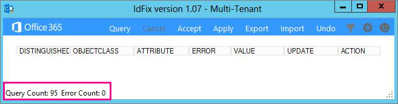

# Installieren und Ausführen des Office 365 IdFix-ToolsInstall and run the Office 365 IdFix tool

IdFix identifiziert Fehler wie Duplikate und Probleme mit der Formatierung in Ihrem Verzeichnis aus, bevor Sie zu Office 365 synchronisieren.IdFix identifies errors such as duplicates and formatting problems in your directory before you synchronize to Office 365. 
  
Um diese Aufgabe erfolgreich abgeschlossen wurde, sollte das Arbeiten mit Benutzer-, Gruppen- und Kontaktobjekten in Active Directory vertraut sein.To finish this task successfully, you should be comfortable working with user, group, and contact objects in Active Directory.
  
Wenn Sie diese Aufgabe ausführen können, sind einige andere Aspekte, die Sie ausführen können. Diese Methoden möglicherweise ist es einfacher, aber sie können auch länger dauern oder andere Nachteile haben. Sie sind:If you can't complete this task, there are a couple of other things you can do. These methods might be easier, but they might also take longer or have other drawbacks. They are:
  
- **Directory-Synchronisierung ohne Ausführen IdFix.** Sie können Ihr Verzeichnis synchronisieren, ohne das IdFix-Tool ausführen, aber es wird nicht empfohlen. Beheben von Fehlern, bevor Sie synchronisieren weniger Zeit und bietet oftmals einen fließender Übergang in die Cloud.**Run directory synchronization without running IdFix.** You can synchronize your directory without running the IdFix tool, but we don't recommend it. Fixing errors before you synchronize takes less time and often provides a smoother transition to the cloud. 
- **Stellen Sie einen Berater ein.** Durch Expertenhilfe können Ihre Benutzer schnell loslegen, und Ihr Verzeichnis wird synchronisiert.**Hire a consultant.** Getting expert help can get your users up and running quickly and your directory synchronized. 
    
## Voraussetzungen für das Ausführen von IdFixWhat you need to run IdFix

Die einfachste Einstieg IdFix zum ist und ausgeführt wird, ihn auf einem Computer zu installieren, die mit der Domäne verbunden ist. Sie können ihn auf dem Domänencontroller ausführen, wenn Sie möchten, aber es nicht erforderlich ist.The easiest way to get IdFix up and running is to install it on a computer that is joined to your domain. You can run it on the domain controller if you want, but it's not necessary.
  
### IdFix-HardwareanforderungenIdFix hardware requirements

Der Computer, auf dem Sie IdFix installieren, muss diese Mindestanforderungen an die Hardware erfüllt:The computer where you install IdFix needs to meet these minimum hardware requirements:
  
- 4 GB RAM4 GB RAM
- 2 GB freier Festplattenspeicher2 GB of hard disk space
    
### IdFix-SoftwareanforderungenIdFix software requirements

Der Computer, auf dem Sie IdFix installieren, muss mit derselben Active Directory-Domäne verknüpft werden aus der Sie Benutzer zu Office 365 synchronisieren möchten. Der Computer muss auch .NET Framework 4.0 installiert haben.The computer where you install IdFix needs to be joined to the same Active Directory domain from which you want to synchronize users to Office 365. The computer also needs to have .NET Framework 4.0 installed. 
  
Wenn Sie Windows Server 2008 oder Windows Server 2012 ausgeführt werden, ist möglicherweise bereits .NET Framework installiert. Wenn nicht, können Sie auf [Download .NET 4.0 aus dem Downloadcenter](https://go.microsoft.com/fwlink/p/?LinkId=400475) oder über Windows Update.If you are running Windows Server 2008 or Windows Server 2012, then .NET Framework is probably already installed. If not, you can [download .NET 4.0 from the download center](https://go.microsoft.com/fwlink/p/?LinkId=400475) or via Windows Update. 
  
### IdFix-BerechtigungsanforderungenIdFix permissions requirements

Das Benutzerkonto, das Sie zum Ausführen von IdFix verwenden, muss über Lese-/Schreibzugriff auf das Verzeichnis verfügen.The user account that you use to run IdFix needs to have read/write access to the directory.
  
Wenn Sie nicht sicher sind, wenn Ihr Benutzerkonto diese Anforderungen erfüllt, und Sie sind nicht sicher sind, wie Sie überprüfen, können Sie installieren und Ausführen von IdFix. Wenn Ihr Benutzerkonto nicht über die richtigen Berechtigungen verfügen, wird IdFix einfach einen Fehler angezeigt, wenn Sie versuchen, um Sie auszuführen.If you aren't sure if your user account meets these requirements, and you're not sure how to check, you can still install and run IdFix. If your user account doesn't have the right permissions, IdFix will simply display an error when you try to run it.
  
## Installieren von IdFixInstall IdFix

Zum Installieren von IdFix herunter und Entpacken Sie **IdFix.exe**:To install IdFix, download and unzip **IdFix.exe**: 
  
1. Melden Sie sich am Computer an, auf dem Sie das IdFix-Tool installieren möchten.Log on to the computer where you want to install the IdFix tool.
    
2. Wechseln Sie zu Microsoft-Downloadwebsite für das [IdFix DirSync Error Remediation-Tool](https://go.microsoft.com/fwlink/?linkid=867219).Go to the Microsoft download site for the [IdFix DirSync Error Remediation Tool](https://go.microsoft.com/fwlink/?linkid=867219).
    
3. Klicken Sie auf **Herunterladen**.Choose **Download**.
    
4. Wenn Sie aufgefordert werden, wählen Sie **Ausführen**aus.When prompted, choose **Run**.
    
5. Klicken Sie im Dialogfeld **WinZip Self-Extractor** in das Textfeld **Extrahieren nach der Ordner** Geben Sie, oder wechseln Sie zum Speicherort, in dem Sie das IdFix-Tool installieren möchten. Standardmäßig wird in IdFix installiert `C:\Deployment Tools\`.On the **WinZip Self-Extractor** dialog box, in the **Unzip to folder** text box, type or browse to the location where you want to install the IdFix tool. By default, IdFix is installed into `C:\Deployment Tools\`. 
    
6. Wählen Sie auf **Unzip**.Choose **Unzip**.
    
## Führen Sie das IdFix-Tool aus.Run the IdFix tool

Führen Sie nach dem Installieren von IdFix das Tool zur Problemsuche in Ihrem Verzeichnis aus:After you install IdFix, run the tool to search for problems in your directory:
  
1. Melden Sie sich unter Verwendung eines Kontos mit Lese-/Schreibzugriff auf das Verzeichnis am Computer an, auf dem Sie IdFix installiert haben.Using an account that has read/write access to the directory, log on to the computer where you installed IdFix.
    
2. Wechseln Sie im Datei-Explorer zu dem Speicherort, in dem Sie IdFix installiert haben. Wenn Sie während der Installation den Standardordner ausgewählt haben, fahren Sie mit `C:\Deployment Tools\IdFix`.In File Explorer, go to the location where you installed IdFix. If you chose the default folder during installation, go to `C:\Deployment Tools\IdFix`.
    
3. Doppelklicken Sie auf **IdFix.exe**.Double-click **IdFix.exe**. 
    
    
  
4. IdFix verwendet standardmäßig den mehrinstanzenfähigen Regelsatz, der die Einträge in Ihrem Verzeichnis zu testen. Dies ist der richtigen Regelsatz für die meisten Office 365-Kunden. Wenn Sie ein Office 365 dedizierte oder ITAR (International Datenverkehr in Waffen Vorschriften) Kunde sind, können Sie IdFix Verwendung den dedizierten Regelsatz stattdessen konfigurieren. Wenn Sie sicher, dass welche Art von Kunden nicht, die Sie sind, können Sie bedenkenlos diesen Schritt überspringen. Wenn den Regelsatz, dediziert festlegen möchten, klicken Sie auf das Zahnradsymbol in der Menüleiste, und wählen Sie dann **dediziert**.By default, IdFix uses the Multi-Tenant rule set to test the entries in your directory. This is the right rule set for most Office 365 customers. However, if you are an Office 365 Dedicated or ITAR (International Traffic in Arms Regulations) customer, you can configure IdFix to use the Dedicated rule set instead. If you aren't sure what type of customer you are, you can safely skip this step. To set the rule set to Dedicated, click the gear icon in the menu bar and then choose **Dedicated**.
    
5. Wählen Sie auf **Abfrage**.Choose **Query**.
    
    
  
6. IdFix überprüft das gesamte Verzeichnis standardmäßig auf Fehler.By default, IdFix searches the entire directory for errors.
    
    Je nach der Größe des Verzeichnisses kann das Ausführen der Abfrage eine Weile dauern. Sie können den Fortschritt am unteren Rand des Tools im Hauptfenster überwachen. Wenn Sie auf **Abbrechen**klicken, müssen Sie völlig neu zu starten.Depending on the size of your directory, running the query can take a while. You can watch the progress at the bottom of the tool's main window. If you click **Cancel**, you'll need to restart from the beginning.
    
    
  
7. Nach Abschluss der IdFix die Abfrage können Sie nun und synchronisieren Ihr Verzeichnis aus, wenn keine Fehler aufgetreten sind. Wenn in Ihrem Verzeichnis Fehler aufgetreten sind, wird empfohlen, dass Sie diese beheben, bevor Sie synchronisieren. Wenn Sie weitere Informationen zu Fehlertypen und Empfehlungen zur die beste Möglichkeit, diese zu beheben möchten, finden Sie unter den Links am Ende dieses Themas.After IdFix completes the query, you can go ahead and synchronize your directory if there are no errors. If there are errors in your directory, it is recommended that you fix them before you synchronize. If you want more specific information about types of errors and recommendations about the best way to fix each of them, see the links at the end of this topic. 
    
    Obwohl es nicht obligatorisch ist, die Fehler vor der Synchronisierung zu beheben, empfehlen wir ausdrücklich, dass Sie wenigstens alle durch IdFix zurückgegebenen Fehler überprüfen.While it is not mandatory to fix the errors before you synchronize, we strongly recommend that you at least review all the errors returned by IdFix.
    
    Jeder Fehler wird in einer separaten Zeile im Hauptfenster des Tools angezeigt.Each error is displayed in a separate row in the tool's main window . 
    
8. Wenn Sie mit der vorgeschlagenen Änderung in der Spalte **UPDATE** einverstanden sind, wählen Sie in der Spalte **ACTION**, was IdFix vornehmen soll, um die Änderung zu implementieren. Klicken Sie dann auf **Übernehmen**. Wenn Sie auf **Übernehmen** klicken, nimmt das Tool die Änderungen im Verzeichnis vor.If you agree with the suggested change in the **UPDATE** column, in the **ACTION** column select what you want IdFix to do to implement the change and then click **Apply**. When you click **Apply**, the tool makes the changes in the directory.
    
    Sie müssen nicht nach jeder Aktualisierung auf **Übernehmen** klicken. Stattdessen können Sie mehrere Fehler beheben, bevor Sie auf **Übernehmen** und IdFix sie alle gleichzeitig ändern. Sie können die Fehler werden vom Fehlertyp sortieren, indem Sie **Fehler** am oberen Rand der Spalte, in der die Fehlertypen aufgelistet.You don't have to click **Apply** after each update. Instead, you can fix several errors before you click **Apply** and IdFix will change them all at the same time. You can sort the errors by error type by clicking **ERROR** at the top of the column that lists the error types. 
    
    Eine Strategie besteht darin, beheben Sie alle Fehler des gleichen Typs; Angenommen, beheben Sie zuerst alle Duplikate und anwenden. Im nächsten Schritt die Zeichen Formatfehler beheben und so weiter. Jedes Mal Sie die Änderungen zu übernehmen, erstellt das IdFix-Tool eine separate Protokolldatei, die Sie verwenden können, um die Änderungen rückgängig zu machen, für den Fall, dass Sie einen Fehler machen. Das [Transaktionsprotokoll](idfix-transaction-log.md) wird in den Ordner gespeichert, die Sie in IdFix installiert.  _C:\Deployment Tools\IdFix_ standardmäßig.One strategy is to fix all the errors of the same type; for example, fix all the duplicates first, and apply them. Next, fix the character format errors, and so on. Each time you apply the changes, the IdFix tool creates a separate log file that you can use to undo your changes in case you make a mistake. The [transaction log](idfix-transaction-log.md) is stored in the folder that you installed IdFix in.  _C:\Deployment Tools\IdFix_ by default. 
    
    
  
9. Nachdem alle Ihre Änderungen bestehen aus in das Verzeichnis, das Ausführen von IdFix erneut aus, um sicherzustellen, dass die vorgenommene Korrekturen neue Fehler verursachen, haben. Sie können diese Schritte so oft wie gewünscht zu wiederholen. Es ist ratsam, den Prozess ein paar Mal durchlaufen, bevor Sie synchronisieren.After all of your changes are made to the directory, run IdFix again to ensure that the fixes you made didn't introduce new errors. You can repeat these steps as many times as you need to. It's a good idea to go through the process a few times before you synchronize.
    
## Ich möchte meine Suche eingrenzen oder Fehler detaillierter ansehen. Was kann ich sonst noch mit IdFix anfangen?I want to refine my search or dig deeper into the errors, what else can I do with IdFix?

Weitergehende Informationen sind in den folgenden Themen verfügbar:More in-depth information is available from these topics:
  
- [Vorbereiten von Verzeichnisattributen für die Synchronisierung mit Office 365 mithilfe des IdFix-Tools](prepare-directory-attributes-for-synch-with-idfix.md) . Nach der Installation des Tools, springen zu diesem Thema für detailliertere Anweisungen zur Ausführung des Tools die häufig auftretender wird, vorgeschlagen, Updates, Beispiele und bewährte Methoden für die auszuführende Aktion, wenn Sie eine große Anzahl von Fehlern vorhanden sind.[Prepare directory attributes for synchronization with Office 365 by using the IdFix tool](prepare-directory-attributes-for-synch-with-idfix.md) . After you have installed the tool, jump to this topic for more detailed instructions about running the tool, common errors you will encounter, suggested fixes, examples, and best practices for what to do when you have a large number of errors. 
- [Referenz: Ausgeschlossene und unterstützte Objekte und Attribute für IdFixReference: IdFix excluded and supported objects and attributes](idfix-excluded-and-supported-objects-and-attributes.md)  
- [Referenz: Office 365 IdFix-TransaktionsprotokollReference: Office 365 IdFix transaction log](idfix-transaction-log.md)
    
## VideoschulungVideo training

Weitere Informationen finden Sie unter Lektion [Installieren und verwenden Sie das IDFix-Tool](https://support.office.com/article/install-and-use-the-idfix-tool-4d81d73c-f172-4fd5-8542-f601c0c96aa9?ui=en-US&rs=en-US&ad=US), bereitgestellt von LinkedIn Learning.For more information, see the lesson [Install and use the IDFix tool](https://support.office.com/article/install-and-use-the-idfix-tool-4d81d73c-f172-4fd5-8542-f601c0c96aa9?ui=en-US&rs=en-US&ad=US), brought to you by LinkedIn Learning.
  

