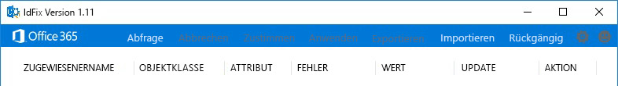
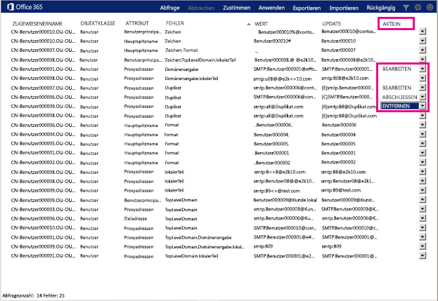

# Herunterladen und Ausführen des Microsoft 365 IdFix-Tools

*Dieser Artikel gilt sowohl für Microsoft 365 Enterprise als auch für Office 365 Enterprise.*

IdFix ermittelt Fehler wie Duplikate und Formatierungsprobleme in Ihrer Active Directory Domain Services (AD DS)-Domäne, bevor Sie die Synchronisierung mit Microsoft 365 vornehmen. 
  
Um diese Aufgabe erfolgreich abschließen zu können, sollten Sie mit der Arbeit mit Benutzern, Gruppen und Kontaktobjekten in Ad DS vertraut sein.
  
Wenn Sie diesen Vorgang nicht erfolgreich abschließen können, gibt es einige andere Möglichkeiten, die Sie tun können. Diese Methoden sind möglicherweise einfacher, dauern aber länger oder bringen andere Probleme mit sich. Dies sind:
  
- **Führen Sie die Verzeichnissynchronisierung ohne IdFix aus.** 

  Sie können Ihr Verzeichnis synchronisieren, ohne das IdFix-Tool auszuführen, dies wird jedoch nicht empfohlen. Das Beheben von Fehlern vor der Synchronisierung nimmt weniger Zeit in Anspruch und ermöglicht einen reibungsloseren Übergang zur Cloud. 

- **Stellen Sie einen Berater ein.** 

  Mit Expertenhilfe können Ihre Benutzer schnell loslegen, und Ihr Verzeichnis wird synchronisiert. 
    
## Voraussetzungen für das Ausführen von IdFix

Die einfachste Möglichkeit zum Einrichten und Ausführen von IdFix besteht darin, es auf einen Computer herunterzuladen, der mit Ihrer AD DS-Domäne verbunden ist. Wenn Sie möchten, können Sie es auf dem Domänencontroller ausführen, dies ist jedoch nicht erforderlich.
  
### IdFix-Hardwareanforderungen

Der Computer, auf den Sie IdFix herunterladen, muss diese Mindesthardwareanforderungen erfüllen:
  
- 4 GB RAM
- 2 GB Festplattenspeicher
   
### IdFix-Softwareanforderungen

Der Computer, auf den Sie IdFix herunterladen, muss mit derselben AD DS-Domäne verbunden sein, von der aus Sie Benutzer mit Microsoft 365 synchronisieren möchten. 

Auf dem Computer muss zudem .NET Framework 4.0 installiert sein. Wenn Sie Windows Server 2008 oder höher ausführen, ist .NET Framework möglicherweise bereits installiert. Ist das nicht der Fall, [laden Sie .NET 4.0 aus dem Download Center herunter](https://go.microsoft.com/fwlink/p/?LinkId=400475) oder unter Verwendung von Windows Update. 
  
### IdFix-Berechtigungsanforderungen

Das Benutzerkonto, das Sie zum Ausführen von IdFix verwenden, muss über Lese-/Schreibzugriff auf die AD DS-Domäne verfügen.
  
Wenn Sie nicht sicher sind, ob Ihr Benutzerkonto diese Anforderungen erfüllt und nicht wissen, wie Sie dies überprüfen können, können Sie IdFix trotzdem herunterladen und ausführen. Wenn Ihr Benutzerkonto nicht über die richtigen Berechtigungen verfügt, zeigt IdFix einfach einen Fehler an, wenn Sie versuchen, es auszuführen.
  
## Herunterladen und Extrahieren von IdFix

Befolgen Sie diese Anweisungen. 
  
1. Melden Sie sich am Computer an, auf dem Sie das IdFix-Tool ausführen möchten.
    
2. Wechseln Sie zur Website [IdFix DirSync Error Remediation Tool](https://github.com/microsoft/idfix) (IdFix DirSync-Fehlerbehebungstool).
    
3. Klicken Sie im Abschnitt **ClickOnce Launch** (ClickOnce-Start) auf **launch** (Starten), um die ZIP-Datei herunterzuladen. Öffnen Sie die ZIP-Datei.
    
4. Wählen Sie im Fenster **IdFix** die Option **Extrahieren** aus, und klicken Sie dann auf **Alle extrahieren**. Standardmäßig wird IdFix in `C:\Users\<your user name>\Documents\IdFix` extrahiert. 
    
5. Wählen Sie **Extrahieren** aus.

Ihre Schritte können je nach ihrer Version von Windows und dem verwendeten Internetbrowser variieren.
    
## Ausführen des IdFix-Tools

Nachdem Sie IdFix heruntergeladen und extrahiert haben, führen Sie es aus, um nach Problemen in Ihrer AD DS-Domäne zu suchen.
  
1. Melden Sie sich unter Verwendung eines Kontos mit Lese-/Schreibzugriff für Ihre AD DS-Domäne an dem Computer an, auf den Sie IdFix heruntergeladen haben.
    
2. Wechseln Sie im Datei-Explorer zum Speicherort, an den Sie IdFix extrahiert haben. Wenn Sie bei der Extraktion den Standardordner ausgewählt haben, navigieren Sie zu `C:\Users\<your user name>\Documents\IdFix`. 
    
3. Doppelklicken Sie auf **IdFix.exe**. 
  
4. IdFix verwendet standardmäßig den mehrinstanzenfähigen Regelsatz zum Testen der Einträge in Ihrem Verzeichnis. Dies ist der richtige Regelsatz für die meisten Microsoft 365-Kunden. Wenn Sie jedoch ein Kunde vom Typ "Microsoft 365 dediziert" oder "ITAR (International Traffic in Arms Regulations)" sind, können Sie IdFix so konfigurieren, dass stattdessen die "Dediziert"-Regel verwendet wird. Wenn Sie nicht sicher sind, was für ein Kundentyp Sie sind, können Sie diesen Schritt einfach überspringen. Um den Regelsatz auf "Dediziert" einzustellen, klicken Sie in der Menüleiste auf das Zahnradsymbol, und wählen Sie dann **Dediziert** aus.
    
5. Wählen Sie **Abfrage** aus.
    
    
  
6. IdFix überprüft das gesamte Verzeichnis standardmäßig auf Fehler.
    
    Je nach der Größe Ihres Verzeichnisses kann das Ausführen der Abfrage eine Weile dauern. Sie können den Fortschritt unten im Hauptfenster des Tools anzeigen. Wenn Sie auf **Abbrechen** klicken, müssen Sie erneut von vorn beginnen.
  
7. Wenn IdFix die Abfrage abgeschlossen und keine Fehler gefunden hat, können Ihr Verzeichnis synchronisieren. Wenn in Ihrem Verzeichnis Fehler vorhanden sind, sollten Sie sie beheben, bevor Sie die Synchronisierung vornehmen. Weitere Informationen finden Sie unter [Vorbereiten von Verzeichnisattributen für die Synchronisierung mit Microsoft 365](prepare-directory-attributes-for-synch-with-idfix.md).
    
    Obwohl es nicht obligatorisch ist, die Fehler vor der Synchronisierung zu beheben, empfehlen wir ausdrücklich, dass Sie wenigstens alle durch IdFix zurückgegebenen Fehler überprüfen.
    
    Jeder Fehler wird im Hauptfenster des Tools in einer eigenen Zeile angezeigt. 
    
8. Wenn Sie mit der in der Spalte **UPDATE** vorgeschlagenen Änderung einverstanden sind, wählen Sie in der Spalte **ACTION** den Vorgang aus, den IdFix zum Implementieren der Änderung ausführen soll, und klicken Sie dann auf **Übernehmen**. Wenn Sie auf **Apply** klicken, nimmt das Tool die Änderungen im Verzeichnis vor.
    
    Sie müssen nicht nach jeder Aktualisierung auf **Übernehmen** klicken. Sie können auch zuerst mehrere Fehler beheben und dann auf **Übernehmen** klicken. IdFix führt dann alle Änderungen gleichzeitig aus. Sie können die Fehler nach Fehlertyp sortieren, indem Sie oben in der Spalte, in der die Fehlertypen aufgelistet werden, auf **ERROR** klicken. 
    
    Eine Strategie besteht darin, alle Fehler desselben Typs zu beheben. Ändern Sie beispielsweise zunächst alle Duplikate, und übernehmen Sie sie. Beheben Sie als Nächstes Zeichenformatierungsfehler usw. Bei jeder Übernahme der Änderungen erstellt das IdFix-Tool eine separate Protokolldatei, die Sie zum Rückgängigmachen Ihrer Änderungen verwenden können, falls Sie einen Fehler begehen. Das [Transaktionsprotokoll](idfix-transaction-log.md) wird in dem Ordner gespeichert, in den Sie IdFix extrahiert haben. Standardmäßig ist dies _C:\Users\<your user name>\Documents\IdFix_. 
    
    
  
9. Nachdem alle Änderungen am Verzeichnis vorgenommen wurden, führen Sie IdFix erneut aus, um sicherzustellen, dass die Fehlerbehebungen keine neuen Fehler verursacht haben. Sie können diese Schritte beliebig oft wiederholen. Es ist eine gute Idee, den Vorgang ein paar Mal durchzugehen, bevor Sie die Synchronisierung vornehmen.
    
## Zusätzliche Ressourcen in IdFix 

- [Ausgeschlossene und unterstützte Objekte und Attribute für IdFix](idfix-excluded-and-supported-objects-and-attributes.md)  
- [Microsoft 365 IdFix-Transaktionsprotokoll](idfix-transaction-log.md)
    
