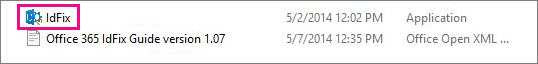

# Installieren und Ausführen des Office 365 IdFix-ToolsInstall and run the Office 365 IdFix tool

IdFix identifiziert Fehler wie Duplikate und Formatierungsprobleme in Ihrem Verzeichnis, bevor Sie mit Office 365 synchronisieren.IdFix identifies errors such as duplicates and formatting problems in your directory before you synchronize to Office 365. 
  
Damit Sie diese Aufgabe erfolgreich abschließen können, sollten Sie sich mit Benutzer-, Gruppen-und Kontaktobjekten in Active Directory vertraut machen.To finish this task successfully, you should be comfortable working with user, group, and contact objects in Active Directory.
  
Wenn Sie diese Aufgabe nicht abschließen können, gibt es einige andere Möglichkeiten.If you can't complete this task, there are a couple of other things you can do. Diese Methoden sind möglicherweise einfacher, aber Sie können auch länger dauern oder andere Nachteile haben.These methods might be easier, but they might also take longer or have other drawbacks. Dies sind:They are:
  
- **Führen Sie die Verzeichnissynchronisierung ohne Ausführen von IdFix aus.****Run directory synchronization without running IdFix.** Sie können Ihr Verzeichnis synchronisieren, ohne das IdFix-Tool auszuführen, es wird jedoch nicht empfohlen.You can synchronize your directory without running the IdFix tool, but we don't recommend it. Das Beheben von Fehlern vor der Synchronisierung dauert schneller und bietet häufig einen reibungsloseren Übergang zur Cloud.Fixing errors before you synchronize takes less time and often provides a smoother transition to the cloud. 
- **Mieten Sie einen Berater.****Hire a consultant.** Wenn Sie Experten helfen, können Sie Ihre Benutzer schnell einrichten, und Ihr Verzeichnis wird synchronisiert.Getting expert help can get your users up and running quickly and your directory synchronized. 
    
## Was Sie zum Ausführen von IdFix benötigenWhat you need to run IdFix

Am einfachsten können Sie IdFix auf einem Computer installieren, der mit Ihrer Domäne verbunden ist.The easiest way to get IdFix up and running is to install it on a computer that is joined to your domain. Sie können es auf dem Domänencontroller ausführen, aber es ist nicht erforderlich.You can run it on the domain controller if you want, but it's not necessary.
  
### IdFix-HardwareanforderungenIdFix hardware requirements

Der Computer, auf dem Sie IdFix installieren, muss diese minimalen Hardwareanforderungen erfüllen:The computer where you install IdFix needs to meet these minimum hardware requirements:
  
- 4 GB RAM 4 GB RAM
- 2 GB Festplattenspeicherplatz2 GB of hard disk space
    
### IdFix-SoftwareanforderungenIdFix software requirements

Der Computer, auf dem Sie IdFix installieren, muss derselben Active Directory-Domäne hinzugefügt werden, von der Sie Benutzer mit Office 365 synchronisieren möchten.The computer where you install IdFix needs to be joined to the same Active Directory domain from which you want to synchronize users to Office 365. Auf dem Computer muss .NET Framework 4,0 installiert sein.The computer also needs to have .NET Framework 4.0 installed. 
  
Wenn Sie Windows Server 2008 oder Windows Server 2012, ist .NET Framework wahrscheinlich bereits installiert.If you are running Windows Server 2008 or Windows Server 2012, then .NET Framework is probably already installed. Ist dies nicht der Fall, können Sie [.NET 4,0 aus dem Download Center](https://go.microsoft.com/fwlink/p/?LinkId=400475) oder über Windows Update herunterladen.If not, you can [download .NET 4.0 from the download center](https://go.microsoft.com/fwlink/p/?LinkId=400475) or via Windows Update. 
  
### IdFix-BerechtigungsanforderungenIdFix permissions requirements

Das Benutzerkonto, mit dem Sie IdFix ausführen, muss Lese-/Schreibzugriff auf das Verzeichnis haben.The user account that you use to run IdFix needs to have read/write access to the directory.
  
Wenn Sie nicht sicher sind, ob Ihr Benutzerkonto diese Anforderungen erfüllt, und Sie nicht sicher sind, wie Sie überprüfen, können Sie IdFix installieren und ausführen.If you aren't sure if your user account meets these requirements, and you're not sure how to check, you can still install and run IdFix. Wenn Ihr Benutzerkonto nicht über die richtigen Berechtigungen verfügt, wird bei der Ausführung von IdFix nur ein Fehler angezeigt.If your user account doesn't have the right permissions, IdFix will simply display an error when you try to run it.
  
## Installieren von IdFixInstall IdFix

Zum Installieren von IdFix können Sie **IdFix. exe**herunterladen und entpacken:To install IdFix, download and unzip **IdFix.exe**: 
  
1. Melden Sie sich an dem Computer an, auf dem Sie das IdFix-Tool installieren möchten.Log on to the computer where you want to install the IdFix tool.
    
2. Wechseln Sie zur Microsoft-Download Website für das [IdFix Dirsync Error Remediation Tool](https://go.microsoft.com/fwlink/?linkid=867219).Go to the Microsoft download site for the [IdFix DirSync Error Remediation Tool](https://go.microsoft.com/fwlink/?linkid=867219).
    
3. Klicken Sie auf **Herunterladen**.Choose **Download**.
    
4. Wenn Sie dazu aufgefordert werden, wählen Sie **Ausführen**aus.When prompted, choose **Run**.
    
5. Geben Sie im Dialogfeld **WinZip Self-Extractor** im Textfeld **unzip to Folder** den Speicherort ein, an dem Sie das IdFix-Tool installieren möchten, oder navigieren Sie zu diesem.On the **WinZip Self-Extractor** dialog box, in the **Unzip to folder** text box, type or browse to the location where you want to install the IdFix tool. Standardmäßig wird IdFix in `C:\Deployment Tools\`installiert.By default, IdFix is installed into `C:\Deployment Tools\`. 
    
6. Wählen Sie **unzip**aus.Choose **Unzip**.
    
## Ausführen des IdFix-ToolsRun the IdFix tool

Führen Sie nach der Installation von IdFix das Tool aus, um nach Problemen in Ihrem Verzeichnis zu suchen:After you install IdFix, run the tool to search for problems in your directory:
  
1. Melden Sie sich mit einem Konto mit Lese-/Schreibzugriff auf das Verzeichnis an dem Computer an, auf dem Sie IdFix installiert haben.Using an account that has read/write access to the directory, log on to the computer where you installed IdFix.
    
2. Wechseln Sie im Datei-Explorer zu dem Speicherort, an dem Sie IdFix installiert haben.In File Explorer, go to the location where you installed IdFix. Wenn Sie während der Installation den Standardordner ausgewählt haben, `C:\Deployment Tools\IdFix`wechseln Sie zu.If you chose the default folder during installation, go to `C:\Deployment Tools\IdFix`.
    
3. Doppelklicken Sie auf **IdFix. exe**.Double-click **IdFix.exe**. 
    
    
  
4. Standardmäßig verwendet IdFix den mandantenfähigen Regelsatz, um die Einträge in Ihrem Verzeichnis zu testen.By default, IdFix uses the Multi-Tenant rule set to test the entries in your directory. Dies ist der richtige Regelsatz für die meisten Office 365-Kunden.This is the right rule set for most Office 365 customers. Wenn Sie jedoch ein Office 365 Dedicated-oder ITAR (International Traffic in Arms Regulations)-Kunde sind, können Sie IdFix so konfigurieren, dass stattdessen der dedizierte Regelsatz verwendet wird.However, if you are an Office 365 Dedicated or ITAR (International Traffic in Arms Regulations) customer, you can configure IdFix to use the Dedicated rule set instead. Wenn Sie nicht sicher sind, welche Art von Kunden Sie sind, können Sie diesen Schritt gefahrlos überspringen.If you aren't sure what type of customer you are, you can safely skip this step. Klicken Sie auf das Zahnradsymbol in der Menüleiste, und wählen Sie dann **dediziert**aus, um den Regelsatz auf Dedicated festzulegen.To set the rule set to Dedicated, click the gear icon in the menu bar and then choose **Dedicated**.
    
5. Wählen Sie **Query**aus.Choose **Query**.
    
    
  
6. Standardmäßig durchsucht IdFix das gesamte Verzeichnis auf Fehler.By default, IdFix searches the entire directory for errors.
    
    Abhängig von der Größe des Verzeichnisses kann das Ausführen der Abfrage eine Weile dauern.Depending on the size of your directory, running the query can take a while. Sie können den Fortschritt am unteren Rand des Hauptfensters des Tools ansehen.You can watch the progress at the bottom of the tool's main window. Wenn Sie auf **Abbrechen**klicken, müssen Sie von vorn beginnen.If you click **Cancel**, you'll need to restart from the beginning.
    
    
  
7. Nachdem IdFix die Abfrage abgeschlossen hat, können Sie mit der Synchronisierung des Verzeichnisses fortfahren, falls keine Fehler vorliegen.After IdFix completes the query, you can go ahead and synchronize your directory if there are no errors. Wenn Ihr Verzeichnis fehlerhaft ist, sollten Sie diese vor der Synchronisierung korrigieren.If there are errors in your directory, it is recommended that you fix them before you synchronize. Wenn Sie genauere Informationen zu Fehlertypen und Empfehlungen zur bestmöglichen Möglichkeit zum Beheben von Fehlern benötigen, lesen Sie die Links am Ende dieses Themas.If you want more specific information about types of errors and recommendations about the best way to fix each of them, see the links at the end of this topic. 
    
    Es ist zwar nicht zwingend erforderlich, die Fehler vor der Synchronisierung zu beheben, es wird jedoch dringend empfohlen, dass Sie zumindest alle von IdFix zurückgegebenen Fehler überarbeiten.While it is not mandatory to fix the errors before you synchronize, we strongly recommend that you at least review all the errors returned by IdFix.
    
    Jeder Fehler wird in einer separaten Zeile im Hauptfenster des Tools angezeigt.Each error is displayed in a separate row in the tool's main window . 
    
8. Wenn Sie der vorgeschlagenen Änderung in der Spalte **Update** zustimmen, wählen Sie in der Spalte **Aktion** aus, was IdFix tun soll, um die Änderung zu implementieren, und klicken Sie dann auf über **nehmen**.If you agree with the suggested change in the **UPDATE** column, in the **ACTION** column select what you want IdFix to do to implement the change and then click **Apply**. Wenn Sie auf über **nehmen**klicken, nimmt das Tool die Änderungen im Verzeichnis vor.When you click **Apply**, the tool makes the changes in the directory.
    
    Sie müssen nach jeder Aktualisierung nicht auf **anwenden** klicken.You don't have to click **Apply** after each update. Stattdessen können Sie mehrere Fehler beheben, bevor Sie auf **anwenden** klicken, und IdFix wird Sie alle gleichzeitig ändern.Instead, you can fix several errors before you click **Apply** and IdFix will change them all at the same time. Sie können die Fehler nach Fehlertyp sortieren, indem Sie oben in der Spalte, in der die Fehlertypen aufgelistet werden, auf **Fehler** klicken.You can sort the errors by error type by clicking **ERROR** at the top of the column that lists the error types. 
    
    Eine Strategie besteht darin, alle Fehler des gleichen Typs zu beheben. beheben Sie beispielsweise zuerst alle Duplikate, und wenden Sie Sie an.One strategy is to fix all the errors of the same type; for example, fix all the duplicates first, and apply them. Korrigieren Sie als nächstes die Zeichenformat Fehler usw.Next, fix the character format errors, and so on. Jedes Mal, wenn Sie die Änderungen übernehmen, erstellt das IdFix-Tool eine separate Protokolldatei, mit der Sie die Änderungen rückgängig machen können, falls Sie einen Fehler machen.Each time you apply the changes, the IdFix tool creates a separate log file that you can use to undo your changes in case you make a mistake. Das [Transaktionsprotokoll](idfix-transaction-log.md) wird in dem Ordner gespeichert, in dem Sie IdFix installiert haben.The [transaction log](idfix-transaction-log.md) is stored in the folder that you installed IdFix in.  _C:\Deployment Tools\IdFix_ standardmäßig._C:\Deployment Tools\IdFix_ by default. 
    
    
  
9. Nachdem alle Änderungen am Verzeichnis vorgenommen wurden, führen Sie IdFix erneut aus, um sicherzustellen, dass die von Ihnen vorgenommenen Korrekturen keine neuen Fehler einführten.After all of your changes are made to the directory, run IdFix again to ensure that the fixes you made didn't introduce new errors. Sie können diese Schritte beliebig oft wiederholen.You can repeat these steps as many times as you need to. Es empfiehlt sich, den Prozess einige Male zu durchlaufen, bevor Sie synchronisieren.It's a good idea to go through the process a few times before you synchronize.
    
## Ich möchte meine Suche verfeinern oder tiefer in die Fehler eingraben, was kann ich sonst noch mit IdFix tun?I want to refine my search or dig deeper into the errors, what else can I do with IdFix?

Weitere ausführliche Informationen finden Sie in den folgenden Themen:More in-depth information is available from these topics:
  
- [Vorbereiten von Verzeichnisattributen für die Synchronisierung mit Office 365 mithilfe des IdFix-Tools](prepare-directory-attributes-for-synch-with-idfix.md) .[Prepare directory attributes for synchronization with Office 365 by using the IdFix tool](prepare-directory-attributes-for-synch-with-idfix.md) . Wenn Sie das Tool installiert haben, wechseln Sie zu diesem Thema, um detailliertere Anweisungen zum Ausführen des Tools, häufige Fehler, die auftreten werden, Empfohlene Korrekturen, Beispiele und bewährte Methoden für die Vorgehensweise bei einer hohen Anzahl von Fehlern.After you have installed the tool, jump to this topic for more detailed instructions about running the tool, common errors you will encounter, suggested fixes, examples, and best practices for what to do when you have a large number of errors. 
- [Referenz: Ausgeschlossene und unterstützte Objekte und Attribute für IdFixReference: IdFix excluded and supported objects and attributes](idfix-excluded-and-supported-objects-and-attributes.md)  
- [Referenz: Office 365 IdFix-TransaktionsprotokollReference: Office 365 IdFix transaction log](idfix-transaction-log.md)
    
## VideoschulungVideo training

Weitere Informationen finden Sie in der Lektion [Installieren und Verwenden des IDFix-Tools](https://support.office.com/article/install-and-use-the-idfix-tool-4d81d73c-f172-4fd5-8542-f601c0c96aa9?ui=en-US&rs=en-US&ad=US), die Ihnen von LinkedIn Learning zur Verfügung gestellt wird.For more information, see the lesson [Install and use the IDFix tool](https://support.office.com/article/install-and-use-the-idfix-tool-4d81d73c-f172-4fd5-8542-f601c0c96aa9?ui=en-US&rs=en-US&ad=US), brought to you by LinkedIn Learning.
  

