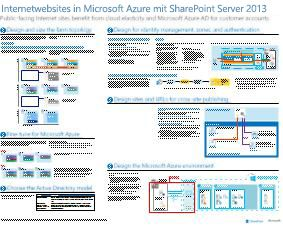
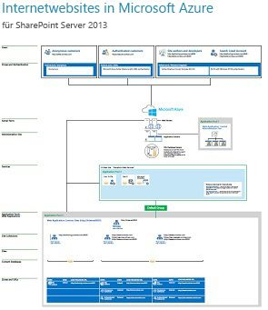

# Internetwebsites in Microsoft Azure mit SharePoint Server 2013Internet Sites in Microsoft Azure using SharePoint Server 2013

 **Zusammenfassung:** Internetwebsites, die SharePoint Server 2013 nutzen, profitieren, wenn sie in Azure-Infrastrukturdienste gehostet werden. Dieser Artikel bietet Ressourcen für den Entwurf und die Implementierung dieser Lösung.**Summary:** Internet sites that use SharePoint Server 2013 benefit by being hosted in Azure Infrastructure Services. This article provides resources for designing and implementing this solution.
  
## Verwenden von Windows Azure-Infrastrukturdiensten für InternetwebsitesUsing Azure Infrastructure Services for Internet sites

Microsoft Azure bietet eine überzeugende Möglichkeit für das Hosting von Internetwebsites, die auf SharePoint Server 2013 basieren. Es ergeben sich folgende Vorteile:Microsoft Azure provides a compelling option for hosting Internet sites based on SharePoint Server 2013. Advantages include the following:
  
- Konzentration auf die Entwicklung einer überzeugenden Website anstatt auf den Aufbau von InfrastrukturFocus on developing a great site instead of building infrastructure.
    
- Flexibilität bei der Skalierung der Lösung entsprechend der NachfrageFlexibility to scale your solution based on demand by scaling out and in.
    
- Gebühren ausschließlich für die Ressourcen, die Sie benötigen und verwendenPay only for the resources that you need and use.
    
- Nutzung von Azure Active Directory für KundenkontenTake advantage of Azure Active Directory for customer accounts.
    
- Hinzufügung von Features, die derzeit nicht in Office 365 verfügbar, z. B. umfassende Berichterstellung und AnalyseAdd features that are not currently available in Office 365, such as deep reporting and analytics.
    
## RessourcenResources

Die folgenden technischen Abbildungen und Artikel bieten Informationen zum Entwerfen und Implementieren von Internetwebsites in Azure mit SharePoint Server 2013.The following technical illustrations and articles provide information about how to design and implement Internet sites in Azure by using SharePoint Server 2013.
  
|**Ressource****Resource**|**Weitere Informationen****More information**|
|:-----|:-----|
|**SharePoint Server 2013-Internetwebsites in Azure****SharePoint Server 2013 Internet sites in Azure**   [          ](https://go.microsoft.com/fwlink/p/?LinkId=392552)[          ](https://go.microsoft.com/fwlink/p/?LinkId=392552)   [PDF](https://go.microsoft.com/fwlink/p/?LinkId=392552)\| PDF [           ](https://go.microsoft.com/fwlink/p/?LinkId=392551) [Visio](https://go.microsoft.com/fwlink/p/?LinkId=392551)  [PDF](https://go.microsoft.com/fwlink/p/?LinkId=392552)  \| [          ](https://go.microsoft.com/fwlink/p/?LinkId=392551)[Visio](https://go.microsoft.com/fwlink/p/?LinkId=392551)   |Dieses Architekturmodell zeigt wichtige Entwurfsaktivitäten und empfohlene Architekturentscheidungen für Internetwebsites in Azure.This architecture model outlines key design activities and recommended architecture choices for Internet sites in Azure.    |
|**Entwurfsbeispiel: Internetwebsites in Azure für SharePoint Server 2013****Design sample: Internet Sites in Azure for SharePoint Server 2013**   [          ](https://go.microsoft.com/fwlink/p/?LinkId=392549)[          ](https://go.microsoft.com/fwlink/p/?LinkId=392549)   [PDF](https://go.microsoft.com/fwlink/p/?LinkId=392549)  \| [Visio](https://go.microsoft.com/fwlink/p/?LinkId=392548)[PDF](https://go.microsoft.com/fwlink/p/?LinkId=392549)  \| [Visio](https://go.microsoft.com/fwlink/p/?LinkId=392548)   |Verwenden Sie dieses Entwurfsbeispiel als Ausgangspunkt für Ihre eigene Architektur.Use this design sample as a starting point for your own architecture.    |
|**[Microsoft Azure-Architekturen für SharePoint 2013](microsoft-azure-architectures-for-sharepoint-2013.md)****[Microsoft Azure Architectures for SharePoint 2013](microsoft-azure-architectures-for-sharepoint-2013.md)**   |In diesem Artikel wird beschrieben, wie Sie Azure-Architekturen zum Hosten von SharePoint-Lösungen entwerfen.This article describes how to design Azure architectures to host SharePoint solutions.    |

## Siehe auchSee Also

[Cloudakzeptanz und HybridlösungenCloud adoption and hybrid solutions](cloud-adoption-and-hybrid-solutions.yml)

