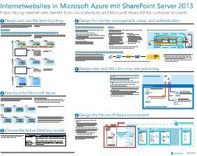

# Internetwebsites in Microsoft Azure mit SharePoint Server 2013

 **Zusammenfassung:** Internetwebsites, die SharePoint Server 2013 nutzen, profitieren, wenn sie in Azure-Infrastrukturdienste gehostet werden. Dieser Artikel bietet Ressourcen für den Entwurf und die Implementierung dieser Lösung.
  
## Verwenden von Windows Azure-Infrastrukturdiensten für Internetwebsites

Microsoft Azure bietet eine überzeugende Möglichkeit für das Hosting von Internetwebsites, die auf SharePoint Server 2013 basieren. Es ergeben sich folgende Vorteile:
  
- Konzentration auf die Entwicklung einer überzeugenden Website anstatt auf den Aufbau von Infrastruktur
    
- Flexibilität bei der Skalierung der Lösung entsprechend der Nachfrage
    
- Gebühren ausschließlich für die Ressourcen, die Sie benötigen und verwenden
    
- Nutzung von Azure Active Directory für Kundenkonten
    
- Hinzufügung von Features, die derzeit nicht in Office 365 verfügbar, z. B. umfassende Berichterstellung und Analyse
    
## Ressourcen

Die folgenden technischen Abbildungen und Artikel bieten Informationen zum Entwerfen und Implementieren von Internetwebsites in Azure mit SharePoint Server 2013.
  
|**Resource**|**Weitere Informationen**|
|:-----|:-----|
|**SharePoint Server 2013-Internetwebsites in Azure**   [          ](https://go.microsoft.com/fwlink/p/?LinkId=392552)   [PDF](https://go.microsoft.com/fwlink/p/?LinkId=392552)  \| [          ](https://go.microsoft.com/fwlink/p/?LinkId=392551)[Visio](https://go.microsoft.com/fwlink/p/?LinkId=392551)   |Dieses Architekturmodell zeigt wichtige Entwurfsaktivitäten und empfohlene Architekturentscheidungen für Internetwebsites in Azure.    |
|**Entwurfsbeispiel: Internetwebsites in Azure für SharePoint Server 2013**   [          ](https://go.microsoft.com/fwlink/p/?LinkId=392549)   [PDF](https://go.microsoft.com/fwlink/p/?LinkId=392549)  \| [Visio](https://go.microsoft.com/fwlink/p/?LinkId=392548)   |Verwenden Sie dieses Entwurfsbeispiel als Ausgangspunkt für Ihre eigene Architektur.    |
|**[Microsoft Azure-Architekturen für SharePoint 2013](microsoft-azure-architectures-for-sharepoint-2013.md)**   |In diesem Artikel wird beschrieben, wie Sie Azure-Architekturen zum Hosten von SharePoint-Lösungen entwerfen.    |

   
**An der Diskussion teilnehmen**

|**Kontakt**|**Beschreibung**|
|:-----|:-----|
|**Welche Lösungen benötigen Sie?**   |Wir entwickeln Inhalte für Lösungen auf Grundlage mehrerer Microsoft-Produkte und -Dienste. Lassen Sie uns wissen, was Sie von unseren serverübergreifenden Lösungen halten, oder fordern Sie spezifische Lösungen an, indem Sie eine E-Mail an [MODAcontent@microsoft.com](mailto:cloudadopt@microsoft.com?Subject=[Cloud%20Adoption%20Content%20Feedback]:%20) senden.  |
|**An der Diskussion über Lösungen teilnehmen**   |Wenn Sie sich für Cloud-basierte Lösungen interessieren, werden Sie Teil des Cloud Adoption Advisory Board (CAAB), um Zugriff auf eine größere, dynamische Community aus Microsoft-Inhaltsentwicklern, Branchenexperten und Kunden aus aller Welt zu haben. Um beizutreten, fügen Sie sich selbst als Mitglied des [CAAB (Cloud Adoption Advisory Board)-Bereichs](https://aka.ms/caab) der Microsoft Tech Community hinzu, und senden Sie uns eine E-Mail an [CAAB@microsoft.com](mailto:caab@microsoft.com?Subject=I%20just%20joined%20the%20Cloud%20Adoption%20Advisory%20Board!). Communityinhalte stehen allen Personen im [CAAB-Blog](https://blogs.technet.com/b/solutions_advisory_board/) zur Verfügung. CAAB-Mitglieder erhalten jedoch Einladungen zu privaten Webinaren, die neue Ressourcen und Lösungen für den Cloud-Einsatz beschreiben.  |
|**Die hier gezeigte Grafik abrufen**   |Wenn Sie eine bearbeitbare Kopie der Grafik wünschen, die Sie in diesem Artikel sehen, senden wir Sie Ihnen gerne zu. Senden Sie eine E-Mail mit der Anforderung einschließlich der URL und dem Titel der Grafik an [cloudadopt@microsoft.com](mailto:cloudadopt@microsoft.com?subject=[Art%20Request]:%20).    |
   
## Weitere Artikel

[Cloudakzeptanz und Hybridlösungen](cloud-adoption-and-hybrid-solutions.md)

