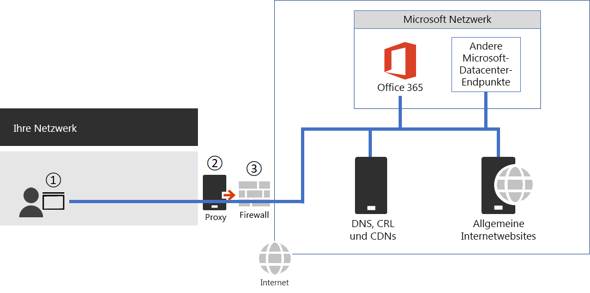

# <a name="managing-office-365-endpoints"></a><span data-ttu-id="134ee-104">Verwalten von Office 365-Endpunkten</span><span class="sxs-lookup"><span data-stu-id="134ee-104">Managing Office 365 endpoints</span></span>

## <a name="office-365-network-connectivity"></a><span data-ttu-id="134ee-105">Office 365-Netzwerkkonnektivität</span><span class="sxs-lookup"><span data-stu-id="134ee-105">Office 365 network connectivity</span></span>

 <span data-ttu-id="134ee-p102">Verbindungen mit Office 365 bestehen große Menge, vertrauenswürdigen Netzwerk-Anforderungen, die am besten ausführen, wenn sie über eine geringer Latenz Ausgang gemacht sind, die in der Nähe der Benutzer ist. Einige Office 365-Verbindungen profitieren von der die Verbindung zu optimieren.</span><span class="sxs-lookup"><span data-stu-id="134ee-p102">Connections to Office 365 consist of high volume, trusted network requests that perform best when they're made over a low-latency egress that is near the user. Some Office 365 connections can benefit from optimizing the connection.</span></span> 
  
1. <span data-ttu-id="134ee-108">Sicherstellen die Firewall Listen können für eine Verbindung zu Office 365-Endpunkten zulassen.</span><span class="sxs-lookup"><span data-stu-id="134ee-108">Ensure your firewall allow lists allow for connectivity to Office 365 endpoints.</span></span>
    
2. <span data-ttu-id="134ee-109">Verwenden Sie Ihre Proxy-Infrastruktur, um Internetkonnektivität für Platzhalter und unveröffentlichte Ziele zu erlauben.</span><span class="sxs-lookup"><span data-stu-id="134ee-109">Use your proxy infrastructure to allow Internet connectivity to wildcard and unpublished destinations.</span></span>
    
3. <span data-ttu-id="134ee-110">Verwalten Sie eine optimale Umkreisnetzwerkkonfiguration.</span><span class="sxs-lookup"><span data-stu-id="134ee-110">Maintain an optimal perimeter network configuration.</span></span>
    
4. <span data-ttu-id="134ee-111">[Sicherstellen, dass Sie die bestmögliche Konnektivität optimal nutzen](https://aka.ms/o365perfprinciples).</span><span class="sxs-lookup"><span data-stu-id="134ee-111">[Ensure you're getting the best connectivity](https://aka.ms/o365perfprinciples).</span></span>
    
5. <span data-ttu-id="134ee-112">Lesen Sie [Office 365 Network Connectivity Prinzipien](office-365-network-connectivity-principles.md) , um die Konnektivität Prinzipien für die sichere Verwaltung von Office 365-Datenverkehr und erste die bestmögliche Leistung zu verstehen.</span><span class="sxs-lookup"><span data-stu-id="134ee-112">Read [Office 365 Network Connectivity Principles](office-365-network-connectivity-principles.md) to understand the connectivity principles for securely managing Office 365 traffic and getting the best possible performance.</span></span> 
    

  
## <a name="update-your-firewalls-outbound-allow-lists"></a><span data-ttu-id="134ee-114">Update die Firewall des ausgehenden Listen zulassen</span><span class="sxs-lookup"><span data-stu-id="134ee-114">Update your firewall's outbound allow lists</span></span>

<span data-ttu-id="134ee-p103">Sie können Ihr Netzwerk optimieren, indem alle vertrauenswürdigen Netzwerk-Anforderungen für Office 365 direkt über die Firewall senden, und alle zusätzlichen Ebene Paketinspektion umgehen oder in Bearbeitung. Dies reduziert langsam von Wartezeit sowie Ihrer kapazitätsanforderungen Umkreisnetzwerk. Am einfachsten auswählen, welche Netzwerk fordert als vertrauenswürdig ist unsere vordefinierte PAC Dateien auf der Registerkarte **Proxies** oben verwenden.</span><span class="sxs-lookup"><span data-stu-id="134ee-p103">You can optimize your network by sending all trusted Office 365 network requests directly through your firewall, bypassing all additional packet level inspection or processing. This reduces slow performance from latency and reduces your perimeter capacity requirements. The easiest way to choose which network requests to trust is to use our pre-built PAC files on the **Proxies** tab above.</span></span> 
  
<span data-ttu-id="134ee-p104">Wenn Ihre Firewall ausgehenden Datenverkehr blockiert, Sie alle IP-sicherzustellen möchten und FQDNs als **erforderlich** , in der [XML-Datei](https://go.microsoft.com/fwlink/?LinkId=533185) aufgelistet sind in der Zulassungsliste enthalten. Erkennen Sie, dass alle Dienste erfordern die Verwendung von einige 3. Party-Dienste. Wir nicht IP-Adressen für diese 3. Partei-Diensten wie etwa Zertifikat Anbietern von Content Delivery Networks DNS-Anbieter bereitgestellt und so weiter. Für vollständige Funktionalität von Office 365 müssen Sie möglicherweise alle vom Office 365 angefordert werden, unabhängig davon wie viele Informationen wir veröffentlichen das Ziel Ziele zu erreichen.</span><span class="sxs-lookup"><span data-stu-id="134ee-p104">If your firewall blocks outbound traffic, you'll want to ensure all of the IP and FQDNs listed as **Required** in this [XML file](https://go.microsoft.com/fwlink/?LinkId=533185) are on the allow list. Recognize all services require the use of some 3rd party services. We don't provide IP addresses for these 3rd party services such as certificate providers, Content Delivery Networks, DNS providers, and so on. For full Office 365 functionality, you must be able to reach all destinations requested by Office 365 regardless of how much information we publish about the destination.</span></span> 
  
<span data-ttu-id="134ee-122">Viele Ziele müssen keine IP-Adresse veröffentlicht oder als Platzhalterdomäne mit keine bestimmten vollqualifizierten Domänennamen aufgeführt sind, verwenden Sie diese Funktionalität müssen Sie auflösen diese Netzwerk-Anfragen an die aktuelle IP-Adresse angefordert wird und Senden der Netzwerk-Anforderung über das Internet.</span><span class="sxs-lookup"><span data-stu-id="134ee-122">Many destinations do not have an IP address published or are listed as a wildcard domain with no specific fully qualified domain name, to use this functionality you must be able to resolve these network requests to the current IP address being requested and send the network request over the Internet.</span></span>
  
<span data-ttu-id="134ee-p105">Automatisieren des Upgradevorgangs mithilfe einer Firewalls, die analysiert die XML-Datei in Ihrem Auftrag und aktualisiert die Regeln automatisch basierend auf dem Dienste oder Features, dass Sie direkt über die Firewall weiterleiten möchten. Sie können auch das Tool [Azure Bereich](https://azurerange.azurewebsites.net/) verwenden, das von der Community erstellt wurde und analysiert den XML-Code für Sie mit den Exportoptionen für die Konfiguration der Cisco XE Route oder ACL-Liste, nur-Text oder CSV.</span><span class="sxs-lookup"><span data-stu-id="134ee-p105">Automate your process by using a firewall that parses the XML file on your behalf and updates your rules automatically based on the services or features you plan to route directly through your firewall. You can also use the [Azure Range](https://azurerange.azurewebsites.net/) tool that has been built by the community and parses the XML for you with export options for Cisco XE Route or ACL list configuration, plain text, or CSV.</span></span> 
  
<span data-ttu-id="134ee-125">Eine ausführlicheren Erläuterung der Ziele Netzwerk ist auf unserer [Website Verweis](urls-and-ip-address-ranges.md) sowie über unseren [RSS-basierte Änderungsprotokoll](https://go.microsoft.com/fwlink/p/?linkid=236301) verfügbar, sodass Sie Änderungen abonnieren können.</span><span class="sxs-lookup"><span data-stu-id="134ee-125">A longer explanation of the network destinations is available on our [reference site](urls-and-ip-address-ranges.md) as well through our [RSS based change log](https://go.microsoft.com/fwlink/p/?linkid=236301) so you can subscribe to changes.</span></span> 
  
<span data-ttu-id="134ee-126"><a name="pacfiles"> </a></span><span class="sxs-lookup"><span data-stu-id="134ee-126"></span></span>
## <a name="configure-outbound-paths-with-pac-files"></a><span data-ttu-id="134ee-127">Konfigurieren Sie ausgehende Pfade mit PAC-Dateien</span><span class="sxs-lookup"><span data-stu-id="134ee-127">Configure outbound paths with PAC files</span></span>

<span data-ttu-id="134ee-p106">Verwenden Sie PAC oder WPAD-Dateien zum Verwalten von Netzwerk-Anfragen, die mit Office 365 zugeordnet sind, jedoch nicht über ein IP-Adresse verfügen. Typische Netzwerk-Anforderungen, die über ein Proxy oder zum Umkreisnetzwerk-Gerät gesendet werden, ein zusätzlichen Latenz entstehen. Während Proxyauthentifizierung der größten Tax anfallen, können andere Dienste wie Reputation-Suche und versucht, Pakete prüfen benutzerfreundlich verursachen. Darüber hinaus benötigen diese Perimeter Network Geräte genügend Kapazität, um alle Netzwerkanfragen zu verarbeiten. Es wird empfohlen, die Proxy oder Prüfung Infrastruktur für die direkte Anforderungen von Office 365-Netzwerk zu umgehen.</span><span class="sxs-lookup"><span data-stu-id="134ee-p106">Use PAC or WPAD files to manage network requests that are associated with Office 365 but don't have an IP address provided. Typical network requests that are sent through a proxy or perimeter device incur additional latency. While proxy authentication incurs the largest tax, other services such as reputation lookup and attempts to inspect packets can cause a poor user experience. Additionally, these perimeter network devices need enough capacity to process all of the network requests. We recommend bypassing your proxy or inspection infrastructure for direct Office 365 network requests.</span></span>
  
<span data-ttu-id="134ee-p107">Verwenden Sie eines der unsere PAC-Dateien als Ausgangspunkt, um zu bestimmen, welche den Netzwerkverkehr zu einem Proxy gesendet werden, und das an eine Firewall gesendet werden. Wenn Sie PAC oder WPAD Dateien, lesen diesen Beitrag zur [Bereitstellung von PAC-Dateien](https://blogs.technet.microsoft.com/undocumentedfeatures/2016/04/06/deploying-the-office-365-proxy-pac-to-manage-your-users/) von einem unsere Berater für Office 365 nicht vertraut sind. Sie sollten diese als Ausgangspunkt überprüfen und bearbeiten, um entsprechend Ihrer Umgebung.</span><span class="sxs-lookup"><span data-stu-id="134ee-p107">Use one of our PAC files as a starting place to determine what network traffic will be sent to a proxy and which will be sent to a firewall. If you're new to PAC or WPAD files, read this post about [deploying PAC files](https://blogs.technet.microsoft.com/undocumentedfeatures/2016/04/06/deploying-the-office-365-proxy-pac-to-manage-your-users/) from one of our Office 365 consultants. You'll want to review these as a starting place and edit to suit your environment.</span></span> 
  
 <span data-ttu-id="134ee-136">**PAC-Dateien 7/10/2018 aktualisiert**.</span><span class="sxs-lookup"><span data-stu-id="134ee-136">**PAC files updated 7/10/2018**.</span></span> 
  
### <a name="1---pac-file-separates-required-internet-fqdns-from-known-office-365-fqdn"></a><span data-ttu-id="134ee-137">#1 - PAC-Datei: trennt Internet FQDNs von bekannten Office 365-FQDN erforderlich.</span><span class="sxs-lookup"><span data-stu-id="134ee-137">#1 - PAC file: Separates required Internet FQDNs from known Office 365 FQDN.</span></span>

<span data-ttu-id="134ee-p108">Im erste Beispiel wird eine Demonstration der unsere empfohlene Vorgehensweise bei der Verwaltung von Endpunkten über das Internet nur. Umgeht den Proxy für Office 365-Ziele geleitet, wo die IP-Adresse wird veröffentlicht und sendet verbleibenden Netzwerk Anforderungen an den Proxy.</span><span class="sxs-lookup"><span data-stu-id="134ee-p108">The first example is a demonstration of our recommended approach to managing endpoints over the Internet only. Bypasses the proxy for Office 365 destinations where the IP address is published and sends remaining network requests to the proxy.</span></span>
  
<span data-ttu-id="134ee-140">Codeausschnitt:</span><span class="sxs-lookup"><span data-stu-id="134ee-140">Code snippet:</span></span>

```javascript
// JavaScript source code
//July 2018 - Updates go live 1st August2018
//This PAC file contains all FQDNs needed for all services and splits the traffic between those which Microsoft can provide IPs for (so can be sent through a managed firewall with conditional access if desired) and those which IPs cannot be provided for, so need to go to an unrestricted proxy or egress. 
//Due to the use of wildcards, some extra logic is provided to send traffic to the proxy before a 'direct' wildcard is hit.
//Includes Core ProPlus URLs but not Office Mobile/IPAD/IOS/ANDROID fqdns from https://support.office.com/en-gb/article/Network-requests-in-Office-365-ProPlus-eb73fcd1-ca88-4d02-a74b-2dd3a9f3364d
//Every Effort is made to ensure 100% accuracy but this PAC should be used as an example and cross-checked with your needs and the Office 365 URL &amp; IP page
//Intended only for Worldwide Office 365 instances, which the vast majority of customers will be using
function FindProxyForURL(url, host)
{
    // Define proxy server
    var proxyserver = "PROXY 10.10.10.10:8080";
    var proxyserver2 = "PROXY 10.10.10.11:8080";
    // Make host lowercase
    var lhost = host.toLowerCase();
    host = lhost;
    //Catch explicit FQDNs which need the proxy but are covered under wildcarded FQDNs which have IPs. This has to be done first before the wildcard is hit
    if ((shExpMatch(host, "quicktips.skypeforbusiness.com"))    
        || (shExpMatch(host, "*.um.outlook.com"))
        || (shExpMatch(host, "r3.res.office365.com"))
        || (shExpMatch(host, "r3.res.outlook.com"))
        || (shExpMatch(host, "r4.res.office365.com"))
        || (shExpMatch(host, "xsi.outlook.com"))
        || (shExpMatch(host, "r1.res.office365.com")))
    {
        return proxyserver;
    }
        //Send FQDNs which Microsoft provide IPs for direct, so they can be sent via a firewall
    else if ((isPlainHostName(host))
    || (shExpMatch(host, "*.aria.microsoft.com"))    
    || (shExpMatch(host, "*.dc.trouter.io"))
    || (shExpMatch(host, "*.lync.com"))
    || (shExpMatch(host, "*.manage.office.com"))
    || (shExpMatch(host, "*.office365.com"))
    || (shExpMatch(host, "*.onenote.com"))
    || (shExpMatch(host, "*.outlook.com"))
    || (shExpMatch(host, "*.outlook.office.com"))
    || (shExpMatch(host, "*.portal.cloudappsecurity.com"))
    || (shExpMatch(host, "*.protection.office.com"))
    || (shExpMatch(host, "*.sharepoint.com"))
    || (shExpMatch(host, "*.skype.com"))
    || (shExpMatch(host, "*.skypeforbusiness.com"))
    || (shExpMatch(host, "*.svc.ms"))
    || (shExpMatch(host, "*.teams.microsoft.com"))
    || (shExpMatch(host, "*.yammer.com"))
    || (shExpMatch(host, "*.yammerusercontent.com"))    
    || (shExpMatch(host, "*broadcast.officeapps.live.com"))
    || (shExpMatch(host, "*excel.officeapps.live.com"))
    || (shExpMatch(host, "*onenote.officeapps.live.com"))
    || (shExpMatch(host, "*powerpoint.officeapps.live.com"))
    || (shExpMatch(host, "*view.officeapps.live.com"))
    || (shExpMatch(host, "*visio.officeapps.live.com"))
    || (shExpMatch(host, "*word-edit.officeapps.live.com"))
    || (shExpMatch(host, "*word-view.officeapps.live.com"))
    || (shExpMatch(host, "admin.microsoft.com"))    
    || (shExpMatch(host, "account.office.net"))
    || (shExpMatch(host, "adminwebservice.microsoftonline.com"))
    || (shExpMatch(host, "agent.office.net"))
    || (shExpMatch(host, "api.login.microsoftonline.com"))
    || (shExpMatch(host, "api.passwordreset.microsoftonline.com"))
    || (shExpMatch(host, "apc.delve.office.com"))
    || (shExpMatch(host, "aus.delve.office.com"))
    || (shExpMatch(host, "autologon.microsoftazuread-sso.com"))  
    || (shExpMatch(host, "becws.microsoftonline.com"))
    || (shExpMatch(host, "browser.pipe.aria.microsoft.com"))  
    || (shExpMatch(host, "can.delve.office.com"))
    || (shExpMatch(host, "ccs.login.microsoftonline.com"))
    || (shExpMatch(host, "ccs-sdf.login.microsoftonline.com"))
    || (shExpMatch(host, "clientconfig.microsoftonline-p.net"))
    || (shExpMatch(host, "clientlog.portal.office.com"))
    || (shExpMatch(host, "companymanager.microsoftonline.com"))
    || (shExpMatch(host, "cus-000.tasks.osi.office.net"))
    || (shExpMatch(host, "delve.office.com"))
    || (shExpMatch(host, "device.login.microsoftonline.com"))    
    || (shExpMatch(host, "ea-000.tasks.osi.office.net"))
    || (shExpMatch(host, "eur.delve.office.com"))
    || (shExpMatch(host, "eus-zzz.tasks.osi.office.net"))
    || (shExpMatch(host, "gbr.delve.office.com"))    
    || (shExpMatch(host, "hip.microsoftonline-p.net"))
    || (shExpMatch(host, "hipservice.microsoftonline.com"))
    || (shExpMatch(host, "home.office.com"))
    || (shExpMatch(host, "ind.delve.office.com"))
    || (shExpMatch(host, "jpn.delve.office.com"))
    || (shExpMatch(host, "kor.delve.office.com"))
    || (shExpMatch(host, "lam.delve.office.com"))
    || (shExpMatch(host, "login.microsoft.com"))
    || (shExpMatch(host, "login.microsoftonline.com"))
    || (shExpMatch(host, "login.microsoftonline-p.com"))
    || (shExpMatch(host, "login.windows.net"))
    || (shExpMatch(host, "logincert.microsoftonline.com"))
    || (shExpMatch(host, "loginex.microsoftonline.com"))
    || (shExpMatch(host, "login-us.microsoftonline.com"))     
    || (shExpMatch(host, "manage.office.com"))
    || (shExpMatch(host, "mobile.pipe.aria.microsoft.com"))
    || (shExpMatch(host, "nam.delve.office.com"))
    || (shExpMatch(host, "neu-000.tasks.osi.office.net"))
    || (shExpMatch(host, "nexus.microsoftonline-p.com"))
    || (shExpMatch(host, "nexus.officeapps.live.com"))
    || (shExpMatch(host, "nexusrules.officeapps.live.com"))
    || (shExpMatch(host, "office.live.com"))
    || (shExpMatch(host, "officeapps.live.com"))
    || (shExpMatch(host, "passwordreset.microsoftonline.com"))
    || (shExpMatch(host, "portal.microsoftonline.com"))
    || (shExpMatch(host, "portal.office.com"))
    || (shExpMatch(host, "protection.office.com"))
    || (shExpMatch(host, "provisioningapi.microsoftonline.com"))
    || (shExpMatch(host, "scsinstrument-ss-us.trafficmanager.net"))   
    || (shExpMatch(host, "scsquery-ss-asia.trafficmanager.net")) 
    || (shExpMatch(host, "scsquery-ss-eu.trafficmanager.net")) 
    || (shExpMatch(host, "scsquery-ss-us.trafficmanager.net"))
    || (shExpMatch(host, "sea-000.tasks.osi.office.net"))    
    || (shExpMatch(host, "stamp2.login.microsoftonline.com"))
    || (shExpMatch(host, "suite.office.net"))    
    || (shExpMatch(host, "tasks.office.com"))
    || (shExpMatch(host, "teams.microsoft.com"))
    || (shExpMatch(host, "testconnectivity.microsoft.com"))
    || (shExpMatch(host, "webshell.suite.office.com"))
    || (shExpMatch(host, "weu-000.tasks.osi.office.net"))
    || (shExpMatch(host, "wus-000.tasks.osi.office.net"))
    || (shExpMatch(host, "www.office.com")))

    {
        return "DIRECT";
    }
    else
        // Send all unknown IP traffic to Proxy for unrestricted access. This section is not necessary if you have a catchall for all other traffic to go to an unfiltered proxy. 
        //However the fqdns required, but for which we dont have IPs for, are listed here incase you need an explicit list.
   if          ((shExpMatch(host, "*.aadrm.com"))
        || (shExpMatch(host, "*.adhybridhealth.azure.com")) 
        || (shExpMatch(host, "*.adl.windows.com"))   
        || (shExpMatch(host, "*.api.microsoftstream.com"))      
        || (shExpMatch(host, "*.assets-yammer.com"))   
        || (shExpMatch(host, "*.azureedge.net"))            
        || (shExpMatch(host, "*.azurerms.com"))
        || (shExpMatch(host, "*.cloudapp.net"))
        || (shExpMatch(host, "*.entrust.net")) 
        || (shExpMatch(host, "*.geotrust.com"))   
        || (shExpMatch(host, "*.helpshift.com"))   
        || (shExpMatch(host, "*.hockeyapp.net"))    
        || (shExpMatch(host, "*.localytics.com"))    
        || (shExpMatch(host, "*.log.optimizely.com"))    
        || (shExpMatch(host, "*.microsoft.com"))
        || (shExpMatch(host, "*.microsoftonline.com"))
        || (shExpMatch(host, "*.microsoftonline-p.com"))
        || (shExpMatch(host, "*.microsoftonline-p.net"))
        || (shExpMatch(host, "*.msecnd.net"))
        || (shExpMatch(host, "*.msedge.net"))      
        || (shExpMatch(host, "*.msocdn.com")) 
        || (shExpMatch(host, "*.mstea.ms"))    
        || (shExpMatch(host, "*.notification.api.microsoftstream.com")) 
        || (shExpMatch(host, "*.o365weve.com"))     
        || (shExpMatch(host, "*.office.com"))   
        || (shExpMatch(host, "*.office.net"))
        || (shExpMatch(host, "*.omniroot.com"))
        || (shExpMatch(host, "*.onmicrosoft.com"))
        || (shExpMatch(host, "*.phonefactor.net"))
        || (shExpMatch(host, "*.public-trust.com"))
        || (shExpMatch(host, "*.search.production.apac.trafficmanager.net"))
        || (shExpMatch(host, "*.search.production.emea.trafficmanager.net"))
        || (shExpMatch(host, "*.search.production.us.trafficmanager.net"))
        || (shExpMatch(host, "*.secure.skypeassets.com"))  
        || (shExpMatch(host, "*.sfbassets.com"))
        || (shExpMatch(host, "*.sharepointonline.com"))
        || (shExpMatch(host, "*.sway.com"))
        || (shExpMatch(host, "*.symcb.com"))
        || (shExpMatch(host, "*.teams.microsoft.com"))  
        || (shExpMatch(host, "*.tenor.com"))  
        || (shExpMatch(host, "*.symcd.com"))     
        || (shExpMatch(host, "*.users.storage.live.com"))
        || (shExpMatch(host, "*.verisign.com"))
        || (shExpMatch(host, "*.verisign.net"))
        || (shExpMatch(host, "*.windows.net"))
        || (shExpMatch(host, "*cdn.onenote.net"))
        || (shExpMatch(host, "account.activedirectory.windowsazure.com"))
        || (shExpMatch(host, "ad.atdmt.com"))
        || (shExpMatch(host, "admin.onedrive.com"))
        || (shExpMatch(host, "ajax.aspnetcdn.com"))
        || (shExpMatch(host, "aka.ms"))
        || (shExpMatch(host, "amp.azure.net"))
        || (shExpMatch(host, "api.microsoftstream.com"))
        || (shExpMatch(host, "apis.live.net"))  
        || (shExpMatch(host, "apps.identrust.com"))  
        || (shExpMatch(host, "assets.onestore.ms"))
        || (shExpMatch(host, "auth.gfx.ms"))
        || (shExpMatch(host, "cacerts.digicert.com"))        
        || (shExpMatch(host, "cdn.odc.officeapps.live.com"))  
        || (shExpMatch(host, "cdn.onenote.net"))
        || (shExpMatch(host, "cdn.optimizely.com")) 
        || (shExpMatch(host, "cert.int-x3.letsencrypt.org"))
        || (shExpMatch(host, "client.hip.live.com"))
        || (shExpMatch(host, "connect.facebook.net"))        
        || (shExpMatch(host, "crl.globalsign.com"))
        || (shExpMatch(host, "crl.globalsign.net"))
        || (shExpMatch(host, "crl.identrust.com"))    
        || (shExpMatch(host, "crl3.digicert.com"))  
        || (shExpMatch(host, "crl4.digicert.com"))
        || (shExpMatch(host, "cus-odc.officeapps.live.com"))              
        || (shExpMatch(host, "cus-roaming.officeapps.live.com"))
        || (shExpMatch(host, "dc.services.visualstudio.com"))
        || (shExpMatch(host, "domains.live.com"))
        || (shExpMatch(host, "ea-000.ocws.officeapps.live.com"))
        || (shExpMatch(host, "ea-roaming.officeapps.live.com"))          
        || (shExpMatch(host, "ecn.dev.virtualearth.net "))   
        || (shExpMatch(host, "eus2-000.ocws.officeapps.live.com"))
        || (shExpMatch(host, "eus2-roaming.officeapps.live.com"))             
        || (shExpMatch(host, "eus-odc.officeapps.live.com"))         
        || (shExpMatch(host, "eus-www.sway-cdn.com"))
        || (shExpMatch(host, "eus-www.sway-extensions.com"))        
        || (shExpMatch(host, "firstpartyapps.oaspapps.com"))
        || (shExpMatch(host, "g.live.com"))
        || (shExpMatch(host, "groupsapi2-prod.outlookgroups.ms"))  
        || (shExpMatch(host, "groupsapi3-prod.outlookgroups.ms"))  
        || (shExpMatch(host, "groupsapi4-prod.outlookgroups.ms"))  
        || (shExpMatch(host, "groupsapi-prod.outlookgroups.ms"))   
        || (shExpMatch(host, "isrg.trustid.ocsp.identrust.com"))   
        || (shExpMatch(host, "liverdcxstorage.blob.core.windowsazure.com"))
        || (shExpMatch(host, "management.azure.com"))        
        || (shExpMatch(host, "mem.gfx.ms"))
        || (shExpMatch(host, "mrodevicemgr.officeapps.live.com"))      
        || (shExpMatch(host, "ncus-000.ocws.officeapps.live.com"))
        || (shExpMatch(host, "ncus-roaming.officeapps.live.com"))                
        || (shExpMatch(host, "neu-000.ocws.officeapps.live.com")) 
        || (shExpMatch(host, "neu-odc.officeapps.live.com"))         
        || (shExpMatch(host, "neu-roaming.officeapps.live.com"))              
        || (shExpMatch(host, "nexus.officeapps.live.com"))
        || (shExpMatch(host, "nexusrules.officeapps.live.com"))
        || (shExpMatch(host, "nps.onyx.azure.net"))
        || (shExpMatch(host, "ocsa.officeapps.live.com"))
        || (shExpMatch(host, "ocsp.digicert.com"))
        || (shExpMatch(host, "ocspx.digicert.com"))
        || (shExpMatch(host, "ocsp.globalsign.com"))
        || (shExpMatch(host, "ocsp.int-x3.letsencrypt.org"))
        || (shExpMatch(host, "ocsp.msocsp.com"))       
        || (shExpMatch(host, "ocsp2.globalsign.com"))
        || (shExpMatch(host, "ocsredir.officeapps.live.com"))
        || (shExpMatch(host, "ocws.officeapps.live.com"))
        || (shExpMatch(host, "odc.officeapps.live.com"))  
        || (shExpMatch(host, "officecdn.microsoft.com.edgekey.net"))            
        || (shExpMatch(host, "officecdn.microsoft.com.edgesuite.net"))              
        || (shExpMatch(host, "ols.officeapps.live.com"))  
        || (shExpMatch(host, "oneclient.sfx.ms"))
        || (shExpMatch(host, "outlook.uservoice.com"))
        || (shExpMatch(host, "platform.linkedin.com"))
        || (shExpMatch(host, "policykeyservice.dc.ad.msft.net"))
        || (shExpMatch(host, "prod.firstpartyapps.oaspapps.com.akadns.net")) 
        || (shExpMatch(host, "r1.res.office365.com"))
        || (shExpMatch(host, "r3.res.office365.com"))
        || (shExpMatch(host, "r4.res.office365.com"))
        || (shExpMatch(host, "s.ytimg.com"))
        || (shExpMatch(host, "scus-000.ocws.officeapps.live.com"))
        || (shExpMatch(host, "scus-odc.officeapps.live.com"))         
        || (shExpMatch(host, "scus-roaming.officeapps.live.com"))                 
        || (shExpMatch(host, "sea-odc.officeapps.live.com"))         
        || (shExpMatch(host, "sea-roaming.officeapps.live.com"))              
        || (shExpMatch(host, "secure.globalsign.com"))
        || (shExpMatch(host, "site-cdn.onenote.net"))
        || (shExpMatch(host, "skydrive.wns.windows.com"))
        || (shExpMatch(host, "skypemaprdsitus.trafficmanager.net"))   
        || (shExpMatch(host, "spoprod-a.akamaihd.net"))  
        || (shExpMatch(host, "ssw.live.com"))
        || (shExpMatch(host, "staffhub.ms"))
        || (shExpMatch(host, "staffhub.uservoice.com"))
        || (shExpMatch(host, "storage.live.com"))
        || (shExpMatch(host, "sway.com")) 
        || (shExpMatch(host, "teams.microsoft.com"))              
        || (shExpMatch(host, "telemetry.remoteapp.windowsazure.com"))         
        || (shExpMatch(host, "telemetryservice.firstpartyapps.oaspapps.com"))    
        || (shExpMatch(host, "web.microsoftstream.com"))         
        || (shExpMatch(host, "weu-000.ocws.officeapps.live.com"))
        || (shExpMatch(host, "weu-odc.officeapps.live.com"))         
        || (shExpMatch(host, "weu-roaming.officeapps.live.com"))
        || (shExpMatch(host, "wu.client.hip.live.com"))
        || (shExpMatch(host, "wus-000.ocws.officeapps.live.com"))
        || (shExpMatch(host, "wus-firstpartyapps.oaspapps.com"))  
        || (shExpMatch(host, "wus-odc.officeapps.live.com"))         
        || (shExpMatch(host, "wus-roaming.officeapps.live.com"))
        || (shExpMatch(host, "wus-www.sway-cdn.com"))
        || (shExpMatch(host, "wus-www.sway-extensions.com"))   
        || (shExpMatch(host, "www.digicert.com"))
        || (shExpMatch(host, "www.google-analytics.com"))
        || (shExpMatch(host, "www.onedrive.com"))
        || (shExpMatch(host, "www.remoteapp.windowsazure.com"))
        || (shExpMatch(host, "www.youtube.com"))
        || (shExpMatch(host, "xsi.outlook.com")))

    {
        return proxyserver;
    }
    //Catchall for all other traffic to another proxy 
else return proxyserver;
}

```

### <a name="2---pac-file-connect-to-office-365-over-the-internet-and-expressroute"></a><span data-ttu-id="134ee-141">#2 – PAC-Datei: Verbinden mit Office 365 über das Internet und ExpressRoute</span><span class="sxs-lookup"><span data-stu-id="134ee-141">#2 - PAC file: Connect to Office 365 over the Internet and ExpressRoute</span></span>
<span data-ttu-id="134ee-142"><a name="bkmk_inet-aer"> </a></span><span class="sxs-lookup"><span data-stu-id="134ee-142"></span></span>

<span data-ttu-id="134ee-p109">Im zweite Beispiel wird eine Demonstration der unsere empfohlene Vorgehensweise zum Verwalten von Verbindungen, wenn Circuits ExpressRoute und im Internet verfügbar sind. Sendet ExpressRoute angekündigt Ziele der Netzfrequenz ExpressRoute und Internet nur Ziele an den Proxy angekündigt.</span><span class="sxs-lookup"><span data-stu-id="134ee-p109">The second example is a demonstration of our recommended approach to managing connections when ExpressRoute and Internet circuits are available. Sends ExpressRoute advertised destinations to the ExpressRoute circuit and Internet only advertised destinations to the proxy.</span></span>
  
<span data-ttu-id="134ee-145">Codeausschnitt:</span><span class="sxs-lookup"><span data-stu-id="134ee-145">Code snippet:</span></span>

```javascript
// JavaScript source code
//July 2018 Update
// Consolidated FQDNs of URLS which are reachable via Microsoft peering over ExpressRoute. All other traffic sent to a proxy in this example. 
//Every Effort is made to ensure 100% accuracy but this PAC should be used as an example and cross-checked with your traffic flow needs and the Office 365 URL &amp; IP page. 
//Intended only for Worldwide Office 365 instances, which the vast majority of customers will be using
//PAC presumes all Office 365 BGP communities/route filters are allowed.
function FindProxyForURL(url, host)
{
    // Define proxy server
    var proxyserver = "PROXY 10.10.10.10:8080";
    // Make host lowercase
    var lhost = host.toLowerCase();
    host = lhost;
    //SUB-FQDNs of ExpressRoutable wildcards which need to be explicitly sent to the proxy at the top of the PAC because they arent ER routable
    if ((shExpMatch(host, "xsi.outlook.com"))
        || (shExpMatch(host, "r3.res.outlook.com"))
        || (shExpMatch(host, "quicktips.skypeforbusiness.com"))
        || (shExpMatch(host, "*.um.outlook.com")))                  
    {
        return proxyserver;
    }
        //EXPRESS ROUTE DIRECT
    else if ((isPlainHostName(host))  
            || (shExpMatch(host, "*.aria.microsoft.com"))             
            || (shExpMatch(host, "*.dc.trouter.io"))
            || (shExpMatch(host, "*.lync.com"))
            || (shExpMatch(host, "*.manage.office.com"))
            || (shExpMatch(host, "*.outlook.com"))
            || (shExpMatch(host, "*.outlook.office.com"))
            || (shExpMatch(host, "*.portal.cloudappsecurity.com"))
            || (shExpMatch(host, "*.protection.office.com"))
            || (shExpMatch(host, "*.protection.outlook.com"))
            || (shExpMatch(host, "*.sharepoint.com")) 
            || (shExpMatch(host, "*.skype.com")) 
            || (shExpMatch(host, "*.skypeforbusiness.com")) 
            || (shExpMatch(host, "*.svc.ms"))   
            || (shExpMatch(host, "*.teams.microsoft.com"))  
            || (shExpMatch(host, "*broadcast.officeapps.live.com"))
            || (shExpMatch(host, "*excel.officeapps.live.com"))
            || (shExpMatch(host, "*onenote.officeapps.live.com"))
            || (shExpMatch(host, "*powerpoint.officeapps.live.com"))
            || (shExpMatch(host, "*view.officeapps.live.com"))                                 
            || (shExpMatch(host, "*visio.officeapps.live.com"))
            || (shExpMatch(host, "*word-edit.officeapps.live.com"))
            || (shExpMatch(host, "*word-view.officeapps.live.com"))
            || (shExpMatch(host, "account.office.net"))
            || (shExpMatch(host, "adminwebservice.microsoftonline.com"))
            || (shExpMatch(host, "agent.office.net"))  
            || (shExpMatch(host, "apc.delve.office.com"))
            || (shExpMatch(host, "api.login.microsoftonline.com"))
            || (shExpMatch(host, "api.passwordreset.microsoftonline.com"))
            || (shExpMatch(host, "aus.delve.office.com"))
            || (shExpMatch(host, "autologon.microsoftazuread-sso.com")) 
            || (shExpMatch(host, "becws.microsoftonline.com"))
            || (shExpMatch(host, "browser.pipe.aria.microsoft.com"))  
            || (shExpMatch(host, "can.delve.office.com")) 
            || (shExpMatch(host, "ccs.login.microsoftonline.com"))  
            || (shExpMatch(host, "ccs-sdf.login.microsoftonline.com"))
            || (shExpMatch(host, "clientconfig.microsoftonline-p.net"))
            || (shExpMatch(host, "companymanager.microsoftonline.com"))
            || (shExpMatch(host, "delve.office.com"))
            || (shExpMatch(host, "device.login.microsoftonline.com"))
            || (shExpMatch(host, "domains.live.com")) 
            || (shExpMatch(host, "eur.delve.office.com"))
            || (shExpMatch(host, "gbr.delve.office.com"))
            || (shExpMatch(host, "hip.microsoftonline-p.net"))
            || (shExpMatch(host, "hipservice.microsoftonline.com"))
            || (shExpMatch(host, "home.office.com"))
            || (shExpMatch(host, "ind.delve.office.com"))
            || (shExpMatch(host, "jpn.delve.office.com"))
            || (shExpMatch(host, "kor.delve.office.com"))
            || (shExpMatch(host, "lam.delve.office.com"))
            || (shExpMatch(host, "login.microsoft.com"))
            || (shExpMatch(host, "login.microsoftonline.com"))
            || (shExpMatch(host, "login.microsoftonline-p.net"))
            || (shExpMatch(host, "login.windows.net"))
            || (shExpMatch(host, "logincert.microsoftonline.com"))
            || (shExpMatch(host, "loginex.microsoftonline.com"))
            || (shExpMatch(host, "login-us.microsoftonline.com"))
            || (shExpMatch(host, "manage.office.com"))
            || (shExpMatch(host, "mobile.pipe.aria.microsoft.com"))
            || (shExpMatch(host, "nam.delve.office.com"))
            || (shExpMatch(host, "nexus.microsoftonline-p.net"))
            || (shExpMatch(host, "office.live.com")) 
            || (shExpMatch(host, "officeapps.live.com")) 
            || (shExpMatch(host, "outlook.office365.com")) 
            || (shExpMatch(host, "passwordreset.microsoftonline.com"))
            || (shExpMatch(host, "portal.office.com"))
            || (shExpMatch(host, "protection.office.com"))
            || (shExpMatch(host, "provisioningapi.microsoftonline.com"))
            || (shExpMatch(host, "scsinstrument-ss-us.trafficmanager.net")) 
            || (shExpMatch(host, "scsquery-ss-asia.trafficmanager.net"))
            || (shExpMatch(host, "scsquery-ss-eu.trafficmanager.net")) 
            || (shExpMatch(host, "scsquery-ss-us.trafficmanager.net"))  
            || (shExpMatch(host, "signup.microsoft.com"))
            || (shExpMatch(host, "smtp.office365.com"))  
            || (shExpMatch(host, "stamp2.login.microsoftonline.com"))
            || (shExpMatch(host, "suite.office.net")) 
            || (shExpMatch(host, "teams.microsoft.com")) 
            || (shExpMatch(host, "webshell.suite.office.com")) 
            || (shExpMatch(host, "www.office.com")))             
       
    {
        return "DIRECT";
    }
        //Catchall for all other traffic to proxy
    else
    {
        return proxyserver;
    }
}

```

### <a name="3---pac-file-manage-all-office-365-destinations-collectively"></a><span data-ttu-id="134ee-146">#3 – PAC-Datei: alle Office 365 Ziele gemeinsam verwalten</span><span class="sxs-lookup"><span data-stu-id="134ee-146">#3 - PAC file: Manage all Office 365 destinations collectively</span></span>
<span data-ttu-id="134ee-147"><a name="bkmk_inet-direct"> </a></span><span class="sxs-lookup"><span data-stu-id="134ee-147"></span></span>

<span data-ttu-id="134ee-p110">Im dritte Beispiel veranschaulicht zusenden alle Netzwerk mit Office 365, ein einziges Ziel zugeordnet ist. Dies wird häufig verwendet, um alle Prüfung der Anforderungen für Office 365-Netzwerk zu umgehen und bietet, dass Sie ein Format, in dem alle Endpunkte veröffentlichten, Liste im Format PAC für Ihre Anpassung verwendet werden.</span><span class="sxs-lookup"><span data-stu-id="134ee-p110">The third example demonstrates sending all network requests associated with Office 365 to a single destination. This is commonly used to bypass all inspection of Office 365 network requests and offers you a format where all published endpoints are in list in the PAC format to use for your customization.</span></span>
  
<span data-ttu-id="134ee-150">Codeausschnitt:</span><span class="sxs-lookup"><span data-stu-id="134ee-150">Code snippet:</span></span>

```javascript
// JavaScript source code
//July 2018 Update new URLS go live 1st August 2018 -
//Consolidated FQDNs required to access Office 365 - All services including optional components covered and elements covered under wildcards removed. 
//Some repeated domains have been consoliodated into unpublished wildcards in order to keep the file as small as possible.
//Includes Core ProPlus URLs but not Office Mobile/IPAD/IOS/ANDROID fqdns from https://support.office.com/en-gb/article/Network-requests-in-Office-365-ProPlus-eb73fcd1-ca88-4d02-a74b-2dd3a9f3364d
//Every Effort is made to ensure 100% accuracy but this PAC should be used as an example and cross-checked with your needs and the Office 365 URL &amp; IP page
//Intended only for Worldwide Office 365 instances, which the vast majority of customers will be using
function FindProxyForURL(url, host)
{
    // Define proxy server
    var proxyserver = "PROXY 10.10.10.10:8080";
    // Make host lowercase
    var lhost = host.toLowerCase();
    host = lhost;
   if  ((shExpMatch(host, "*.aadrm.com"))
        || (shExpMatch(host, "*.adhybridhealth.azure.com"))
        || (shExpMatch(host, "*.adl.windows.com"))
        || (shExpMatch(host, "*.api.microsoftstream.com"))  
        || (shExpMatch(host, "*.assets-yammer.com"))
        || (shExpMatch(host, "autologon.microsoftazuread-sso.com"))  
        || (shExpMatch(host, "*.azureedge.net"))   
        || (shExpMatch(host, "*.azurerms.com"))
        || (shExpMatch(host, "*.cloudapp.net")) 
        || (shExpMatch(host, "*.dc.trouter.io"))
        || (shExpMatch(host, "*.entrust.net")) 
        || (shExpMatch(host, "*.geotrust.com"))
        || (shExpMatch(host, "*.helpshift.com"))
        || (shExpMatch(host, "*.hockeyapp.net"))       
        || (shExpMatch(host, "*.localytics.com"))
        || (shExpMatch(host, "*.log.optimizely.com"))     
        || (shExpMatch(host, "*.lync.com"))
        || (shExpMatch(host, "*.microsoft.com"))
        || (shExpMatch(host, "*.microsoftonline.com"))
        || (shExpMatch(host, "*.microsoftonline-p.com"))
        || (shExpMatch(host, "*.microsoftonline-p.net"))
        || (shExpMatch(host, "*.msecnd.net"))
        || (shExpMatch(host, "*.msedge.net"))
        || (shExpMatch(host, "*.msocdn.com"))
        || (shExpMatch(host, "*.mstea.ms"))
        || (shExpMatch(host, "*.o365weve.com"))
        || (shExpMatch(host, "*.office.com"))
        || (shExpMatch(host, "*.office.net"))
        || (shExpMatch(host, "*.office365.com"))
        || (shExpMatch(host, "*.omniroot.com"))
        || (shExpMatch(host, "*.onenote.com"))
        || (shExpMatch(host, "*.onmicrosoft.com"))
        || (shExpMatch(host, "*.outlook.com"))
        || (shExpMatch(host, "*.phonefactor.net")) 
        || (shExpMatch(host, "*.portal.cloudappsecurity.com"))
        || (shExpMatch(host, "*.public-trust.com"))
        || (shExpMatch(host, "*.search.production.apac.trafficmanager.net"))
        || (shExpMatch(host, "*.search.production.emea.trafficmanager.net"))
        || (shExpMatch(host, "*.search.production.us.trafficmanager.net"))
        || (shExpMatch(host, "*.secure.skypeassets.com"))
        || (shExpMatch(host, "*.sfbassets.com"))  
        || (shExpMatch(host, "*.sharepoint.com"))
        || (shExpMatch(host, "*.sharepointonline.com"))
        || (shExpMatch(host, "*.skype.com"))
        || (shExpMatch(host, "*.skypeforbusiness.com"))
        || (shExpMatch(host, "*.svc.ms")) 
        || (shExpMatch(host, "*.sway.com"))
        || (shExpMatch(host, "*.symcb.com"))
        || (shExpMatch(host, "*.symcd.com"))
        || (shExpMatch(host, "*.tenor.com"))
        || (shExpMatch(host, "*.users.storage.live.com"))
        || (shExpMatch(host, "*.verisign.com"))
        || (shExpMatch(host, "*.verisign.net"))
        || (shExpMatch(host, "*.windows.net"))
        || (shExpMatch(host, "*.yammer.com"))
        || (shExpMatch(host, "*.yammerusercontent.com"))         
        || (shExpMatch(host, "*broadcast.officeapps.live.com"))
        || (shExpMatch(host, "*cdn.onenote.net"))
        || (shExpMatch(host, "*excel.officeapps.live.com"))
        || (shExpMatch(host, "*onenote.officeapps.live.com"))
        || (shExpMatch(host, "*powerpoint.officeapps.live.com"))
        || (shExpMatch(host, "*view.officeapps.live.com"))
        || (shExpMatch(host, "*visio.officeapps.live.com"))
        || (shExpMatch(host, "*word-edit.officeapps.live.com"))
        || (shExpMatch(host, "*word-view.officeapps.live.com"))    
        || (shExpMatch(host, "account.activedirectory.windowsazure.com"))
        || (shExpMatch(host, "ad.atdmt.com"))
        || (shExpMatch(host, "admin.onedrive.com"))
        || (shExpMatch(host, "ajax.aspnetcdn.com"))
        || (shExpMatch(host, "aka.ms"))
        || (shExpMatch(host, "amp.azure.net"))
        || (shExpMatch(host, "api.microsoftstream.com"))
        || (shExpMatch(host, "apis.live.net"))
        || (shExpMatch(host, "apps.identrust.com")) 
        || (shExpMatch(host, "assets.onestore.ms"))
        || (shExpMatch(host, "auth.gfx.ms"))
        || (shExpMatch(host, "cacerts.digicert.com"))    
        || (shExpMatch(host, "cdn.odc.officeapps.live.com"))  
        || (shExpMatch(host, "cdn.onenote.net"))
        || (shExpMatch(host, "cdn.optimizely.com"))
        || (shExpMatch(host, "cert.int-x3.letsencrypt.org"))
        || (shExpMatch(host, "client.hip.live.com"))     
        || (shExpMatch(host, "connect.facebook.net"))
        || (shExpMatch(host, "crl.globalsign.com"))
        || (shExpMatch(host, "crl.globalsign.net"))
        || (shExpMatch(host, "crl.identrust.com"))    
        || (shExpMatch(host, "crl3.digicert.com"))  
        || (shExpMatch(host, "crl4.digicert.com"))
        || (shExpMatch(host, "cus-odc.officeapps.live.com"))              
        || (shExpMatch(host, "cus-roaming.officeapps.live.com"))      
        || (shExpMatch(host, "dc.services.visualstudio.com"))
        || (shExpMatch(host, "domains.live.com"))
        || (shExpMatch(host, "ea-000.ocws.officeapps.live.com")) 
        || (shExpMatch(host, "ea-roaming.officeapps.live.com"))           
        || (shExpMatch(host, "ecn.dev.virtualearth.net"))
        || (shExpMatch(host, "eus2-000.ocws.officeapps.live.com"))
        || (shExpMatch(host, "eus2-roaming.officeapps.live.com"))              
        || (shExpMatch(host, "eus-odc.officeapps.live.com"))              
        || (shExpMatch(host, "eus-www.sway-cdn.com"))
        || (shExpMatch(host, "eus-www.sway-extensions.com"))
        || (shExpMatch(host, "firstpartyapps.oaspapps.com"))
        || (shExpMatch(host, "g.live.com"))
        || (shExpMatch(host, "groupsapi2-prod.outlookgroups.ms"))  
        || (shExpMatch(host, "groupsapi3-prod.outlookgroups.ms"))  
        || (shExpMatch(host, "groupsapi4-prod.outlookgroups.ms"))  
        || (shExpMatch(host, "groupsapi-prod.outlookgroups.ms"))  
        || (shExpMatch(host, "isrg.trustid.ocsp.identrust.com"))
        || (shExpMatch(host, "liverdcxstorage.blob.core.windowsazure.com"))
        || (shExpMatch(host, "management.azure.com"))
        || (shExpMatch(host, "mem.gfx.ms"))
        || (shExpMatch(host, "mrodevicemgr.officeapps.live.com"))               
        || (shExpMatch(host, "ncus-000.ocws.officeapps.live.com"))
        || (shExpMatch(host, "ncus-roaming.officeapps.live.com"))                 
        || (shExpMatch(host, "neu-000.ocws.officeapps.live.com")) 
        || (shExpMatch(host, "neu-odc.officeapps.live.com"))              
        || (shExpMatch(host, "neu-roaming.officeapps.live.com"))              
        || (shExpMatch(host, "nexus.officeapps.live.com"))
        || (shExpMatch(host, "nexusrules.officeapps.live.com"))
        || (shExpMatch(host, "nps.onyx.azure.net"))   
        || (shExpMatch(host, "ocsa.officeapps.live.com"))
        || (shExpMatch(host, "ocsp.digicert.com"))
        || (shExpMatch(host, "ocsp.globalsign.com"))
        || (shExpMatch(host, "ocsp.int-x3.letsencrypt.org"))
        || (shExpMatch(host, "ocsp.msocsp.com"))     
        || (shExpMatch(host, "ocsp2.globalsign.com")) 
        || (shExpMatch(host, "ocspx.digicert.com"))
        || (shExpMatch(host, "ocsredir.officeapps.live.com"))
        || (shExpMatch(host, "ocws.officeapps.live.com"))
        || (shExpMatch(host, "odc.officeapps.live.com"))  
        || (shExpMatch(host, "office.live.com"))
        || (shExpMatch(host, "officeapps.live.com"))
        || (shExpMatch(host, "officecdn.microsoft.com.edgekey.net"))              
        || (shExpMatch(host, "officecdn.microsoft.com.edgesuite.net"))
        || (shExpMatch(host, "ols.officeapps.live.com"))  
        || (shExpMatch(host, "oneclient.sfx.ms"))
        || (shExpMatch(host, "outlook.uservoice.com"))
        || (shExpMatch(host, "platform.linkedin.com"))
        || (shExpMatch(host, "policykeyservice.dc.ad.msft.net"))
        || (shExpMatch(host, "prod.firstpartyapps.oaspapps.com.akadns.net"))
        || (shExpMatch(host, "s.ytimg.com"))
        || (shExpMatch(host, "s0.assets-yammer.com"))  
        || (shExpMatch(host, "scsinstrument-ss-us.trafficmanager.net")) 
        || (shExpMatch(host, "scsquery-ss-asia.trafficmanager.net"))
        || (shExpMatch(host, "scsquery-ss-eu.trafficmanager.net")) 
        || (shExpMatch(host, "scsquery-ss-us.trafficmanager.net")) 
        || (shExpMatch(host, "scus-000.ocws.officeapps.live.com"))
        || (shExpMatch(host, "scus-odc.officeapps.live.com"))         
        || (shExpMatch(host, "scus-roaming.officeapps.live.com"))                 
        || (shExpMatch(host, "sea-odc.officeapps.live.com"))              
        || (shExpMatch(host, "sea-roaming.officeapps.live.com"))              
        || (shExpMatch(host, "secure.globalsign.com"))
        || (shExpMatch(host, "site-cdn.onenote.net"))
        || (shExpMatch(host, "skydrive.wns.windows.com"))
        || (shExpMatch(host, "skypemaprdsitus.trafficmanager.net"))
        || (shExpMatch(host, "spoprod-a.akamaihd.net"))
        || (shExpMatch(host, "ssw.live.com"))
        || (shExpMatch(host, "staffhub.ms"))
        || (shExpMatch(host, "staffhub.uservoice.com"))    
        || (shExpMatch(host, "storage.live.com"))
        || (shExpMatch(host, "telemetry.remoteapp.windowsazure.com"))
        || (shExpMatch(host, "telemetryservice.firstpartyapps.oaspapps.com"))
        || (shExpMatch(host, "web.microsoftstream.com"))   
        || (shExpMatch(host, "weu-000.ocws.officeapps.live.com")) 
        || (shExpMatch(host, "weu-odc.officeapps.live.com"))              
        || (shExpMatch(host, "weu-roaming.officeapps.live.com"))              
        || (shExpMatch(host, "wu.client.hip.live.com"))
        || (shExpMatch(host, "wus-000.ocws.officeapps.live.com"))  
        || (shExpMatch(host, "wus-firstpartyapps.oaspapps.com"))  
        || (shExpMatch(host, "wus-odc.officeapps.live.com"))              
        || (shExpMatch(host, "wus-roaming.officeapps.live.com"))              
        || (shExpMatch(host, "wus-www.sway-cdn.com"))
        || (shExpMatch(host, "wus-www.sway-extensions.com"))        
        || (shExpMatch(host, "www.digicert.com"))
        || (shExpMatch(host, "www.google-analytics.com"))
        || (shExpMatch(host, "www.onedrive.com"))
        || (shExpMatch(host, "www.remoteapp.windowsazure.com"))
        || (shExpMatch(host, "www.youtube.com")))
    {
        return proxyserver;
    }
        //Catchall for all other traffic to another proxy
    else return "PROXY 10.10.10.11:8080";
}

```

### <a name="use-custom-scripts-or-manually-create-your-own-pac-files"></a><span data-ttu-id="134ee-151">Verwenden Sie benutzerdefinierte Skripts oder manuell erstellen Sie eigener PAC-Dateien</span><span class="sxs-lookup"><span data-stu-id="134ee-151">Use custom scripts or manually create your own PAC files</span></span>
<span data-ttu-id="134ee-152"><a name="pacfiles_manual"> </a></span><span class="sxs-lookup"><span data-stu-id="134ee-152"></span></span>

<span data-ttu-id="134ee-p111">Wenn Sie bereits erstellt haben etwas Sie verlassen freigeben möchten eine Notiz in den Kommentaren Nachfolgend einige weitere Tools aus der Community. None oder von Microsoft verwaltet und zu diesem Zweck hier bereitgestellten der Community, Tools verwiesen, die in diesem Artikel offiziell werden, unterstützt.</span><span class="sxs-lookup"><span data-stu-id="134ee-p111">Here's a few more tools from the community, if you've built something you'd like to share leave a note in the comments. None of the community tools referenced in this article are officially supported or maintained by Microsoft and are provided here for your convenience.</span></span>
  
- <span data-ttu-id="134ee-p112">Dies ist das älteste Community generierte Tool zur Verwaltung den Prozess, ein Tool von einem Mitglied der Office 365-Community erstellt. Es folgt Link zum [herunterladen](https://gallery.technet.microsoft.com/Office-365-Proxy-Pac-60fb28f7).</span><span class="sxs-lookup"><span data-stu-id="134ee-p112">This is the oldest community generated tool to help manage the process, a tool built by a member of the Office 365 community. Here is link to [download](https://gallery.technet.microsoft.com/Office-365-Proxy-Pac-60fb28f7).</span></span>
    
- <span data-ttu-id="134ee-157">Machbarkeitsstudie mit exportierbar Firewallregeln: [Microsoft Cloud IP-API](https://mscloudips.azurewebsites.net/).</span><span class="sxs-lookup"><span data-stu-id="134ee-157">Proof of Concept with exportable firewall rules: [Microsoft Cloud IP API](https://mscloudips.azurewebsites.net/).</span></span>
    
- <span data-ttu-id="134ee-158">IT-Praktyk: [RSS-Konvertierung](https://gallery.technet.microsoft.com/Convert-the-RSS-channel-5efe18b7) und [XML-Konvertierung](https://gallery.technet.microsoft.com/Convert-the-O365IPAddresses-9890d896).</span><span class="sxs-lookup"><span data-stu-id="134ee-158">From IT Praktyk: [RSS conversion](https://gallery.technet.microsoft.com/Convert-the-RSS-channel-5efe18b7) and [XML conversion](https://gallery.technet.microsoft.com/Convert-the-O365IPAddresses-9890d896).</span></span>
    
- <span data-ttu-id="134ee-159">Von Peter Abele: [herunterladen](https://gallery.technet.microsoft.com/How-to-create-an-up-to-b1fc33f3).</span><span class="sxs-lookup"><span data-stu-id="134ee-159">From Peter Abele: [Download](https://gallery.technet.microsoft.com/How-to-create-an-up-to-b1fc33f3).</span></span>
    
- <span data-ttu-id="134ee-p113">Verwenden Sie die Netzwerkanalyse um zu bestimmen, welches Netzwerk fordert sollte der Proxy-Infrastruktur zu umgehen. Die am häufigsten verwendeten FQDNs verwendet, um Kunden Proxys umgehen, aufgrund der Lautstärke des Netzwerkdatenverkehrs gesendet und Empfangen von diesen Endpunkten sind.</span><span class="sxs-lookup"><span data-stu-id="134ee-p113">Use your network analysis to determine which network requests should bypass your proxy infrastructure. The most common FQDNs used to bypass customer proxies include the following due to the volume of network traffic sent and received from these endpoints.</span></span>
    
  ```
  outlook.office365.com
  outlook.office.com
  <tenant-name>.sharepoint.com
  <tenant-name>-my.sharepoint.com
  <tenant-name>-<app>.sharepoint.com
  *.Lync.com
  ```

- <span data-ttu-id="134ee-162">Stellen Sie sicher, dass alle Netzwerk-Anforderungen, die direkt an die Firewall gesendet einen entsprechenden Eintrag in der Firewall Liste, um die Anforderung durchlaufen ermöglichen zulassen verfügen.</span><span class="sxs-lookup"><span data-stu-id="134ee-162">Ensure any network requests being sent to your firewall directly have a corresponding entry in the firewall allow list to allow the request to go through.</span></span>

## <a name="perimeter-network-integration"></a><span data-ttu-id="134ee-163">Umkreisnetzwerk Netzwerkintegration</span><span class="sxs-lookup"><span data-stu-id="134ee-163">Perimeter network integration</span></span>
<span data-ttu-id="134ee-164"><a name="BKMK_Perimeter"> </a></span><span class="sxs-lookup"><span data-stu-id="134ee-164"></span></span>

<span data-ttu-id="134ee-165">Wussten Sie schon Microsofts WAN ist eine der in der ganzen Welt der größten Backbones?</span><span class="sxs-lookup"><span data-stu-id="134ee-165">Did you know Microsoft's WAN is one of the largest backbones in the world?</span></span>
  
<span data-ttu-id="134ee-p114">Es ist true, dieses umfassende Netzwerk ist Office 365 und unsere anderen unabhängig von Ihrem Speicherort in der ganzen Welt arbeiten, die Sie Clouddiensten macht. Unser Netzwerk besteht aus hoher Bandbreite, Latenz, Failover-fähigen Links mit Tausenden von Route Meilen privat Besitzer dunkel Fiber und Multi-TBit-Verbindungen zwischen Rechenzentren und Edge-Knoten alle zu erleichtern, unsere Clouddienste zu verwenden.</span><span class="sxs-lookup"><span data-stu-id="134ee-p114">It's true, this massive network is what makes Office 365 and our other cloud services work regardless of where in the world you are. Our network consists of high bandwidth, low latency, fail-over capable links with thousands of route miles of privately owned dark fiber, and multi-Terabit connections between datacenters and edge nodes, all to make it easier to use our cloud services.</span></span>
  
<span data-ttu-id="134ee-p115">Mit einem Netzwerk wie folgt möchten Sie die Geräte Ihrer Organisation so bald wie möglich mit unserem Netzwerk verbinden. Mit über 2500 Internetdienstanbieter Peers Beziehungen sollte Global und 70 Points of Presence, aus dem Netzwerk für unsere erste nahtlos. Es kann nicht lohnt, sich ein paar Minuten und stellen Sie sicher, dass bei Ihrem Internetdienstanbieter Peers Beziehung ist die am besten geeignete [Nachfolgend finden Sie einige Beispiele für](https://blogs.technet.microsoft.com/onthewire/2017/03/22/__) des guten und nicht so gut Peers Hand und Nachteile auf Ihr Netzwerk.</span><span class="sxs-lookup"><span data-stu-id="134ee-p115">With a network like this, you want your organization's devices to connect to our network as soon as possible. With over 2500 ISP peering relationships globally and 70 points of presence, getting from your network to ours should be seamless. It can't hurt to spend a few minutes making sure your ISP's peering relationship is the most optimal, [here's a few examples](https://blogs.technet.microsoft.com/onthewire/2017/03/22/__) of good and not so good peering hand-offs to our network.</span></span> 
  
<span data-ttu-id="134ee-p116">Sie können manuell oder automatisch die Geräte in Ihrem Netzwerk zum Verarbeiten von Office 365 Anwendung Netzwerk Anforderungen je nach Ihrer Geräte optimal konfigurieren. Welche Änderungen bei der Konfiguration Sie Office 365 Netzwerkdatenverkehr optimal behandeln müssen, hängt von Ihrer Umgebung. Office 365 Netzwerk Anforderungen von Netzwerkkonfigurationen bietet Vorteile, die Folgendes ermöglichen:</span><span class="sxs-lookup"><span data-stu-id="134ee-p116">You can manually or automatically configure the devices on your network to optimally handle Office 365 application network requests, depending on your equipment. What configuration changes you need to make to optimally handle Office 365 network traffic will depend on your environment. Office 365 network requests may benefit from network configurations that allow the following:</span></span>
  
- <span data-ttu-id="134ee-174">Priorität über weniger wichtige den Netzwerkdatenverkehr.</span><span class="sxs-lookup"><span data-stu-id="134ee-174">Priority over less critical network traffic.</span></span>
    
- <span data-ttu-id="134ee-p117">Weiterleitung an einen lokalen Ausgang zur Vermeidung von Backhauling über eine langsame WAN Link beim Nutzen der Vorteile von der verfügbaren Latenz im Microsoft-Netzwerk. [Hier ist eine gute Beschreibung](https://blogs.technet.microsoft.com/onthewire/2017/05/03/office-365-connectivity-guidance-part-2/) basierend auf Kundenprojekte.</span><span class="sxs-lookup"><span data-stu-id="134ee-p117">Routing to a local egress to avoid backhauling over a slow WAN link while taking advantage of the low latency available on the Microsoft network. [Here's a good discussion](https://blogs.technet.microsoft.com/onthewire/2017/05/03/office-365-connectivity-guidance-part-2/) based on customer engagements.</span></span> 
    
- <span data-ttu-id="134ee-177">Bei Verwendung des DNS in der Nähe einer lokalen Ausgang um sicherzustellen, dass die Netzwerk-Anforderung, die bewirkt, die lokalen Ausgang dass eingeht am nächstgelegenen Microsoft Speicherort Peers.</span><span class="sxs-lookup"><span data-stu-id="134ee-177">Using DNS near a local egress to ensure the network request that leaves the local egress arrives at the nearest Microsoft peering location.</span></span>
    
- <span data-ttu-id="134ee-178">Ausschluss von Tiefe Paketinspektion oder anderen intensive Netzwerkpakete verarbeitet, um die Wartezeit bei vertikaler Skalierung erfüllen.</span><span class="sxs-lookup"><span data-stu-id="134ee-178">Exclusion from deep packet inspection or other intensive network packet processing to meet latency requirements at scale.</span></span>
    
<span data-ttu-id="134ee-p118">Moderne Netzwerkgeräte enthalten Funktionen zum Verwalten von Netzwerk-Anforderungen für vertrauenswürdige Anwendungen wie etwa Office 365 anders als generischen, nicht vertrauenswürdigen Internet-Datenverkehr. Mit der neuen Querformat SD-WAN-Lösungen kann eine solche Differenzierung Datenverkehr und Pfad Auswahl auch mit der veränderbaren Zustand des Netzwerks, wie etwa Punkt in Zeiten, Latenz oder Leistung der verschiedenen Connectivity Pfade Aufklärung durchgeführt werden zwischen dem Benutzer und der Cloud.</span><span class="sxs-lookup"><span data-stu-id="134ee-p118">Modern network devices include capabilities to manage network requests for trusted applications such as Office 365 differently than generic, untrusted Internet traffic. With the emerging landscape of SD-WAN solutions, such differentiation of traffic and path selection can also be performed with awareness of the changing state of the network, such as point in time availability, latency or performance of various connectivity paths between the user and the cloud.</span></span>
  
<span data-ttu-id="134ee-181">Weitere Anleitungen zum Planen der Netzwerkkonfiguration finden Sie unter [Netzwerk- und Migration für Office 365 planen](network-and-migration-planning.md), [Behandlung von Leistungsproblemen Plan für Office 365](performance-troubleshooting-plan.md)und [Prüfliste für die bereitstellungsplanung für Office 365](deployment-planning-checklist.md) .</span><span class="sxs-lookup"><span data-stu-id="134ee-181">See [Network and migration planning for Office 365](network-and-migration-planning.md), [Performance troubleshooting plan for Office 365](performance-troubleshooting-plan.md), and [Deployment planning checklist for Office 365](deployment-planning-checklist.md) for additional guidance on planning your network configuration.</span></span> 
  
### <a name="to-implement-this-scenario"></a><span data-ttu-id="134ee-182">Zum Implementieren dieses Szenarios:</span><span class="sxs-lookup"><span data-stu-id="134ee-182">To implement this scenario:</span></span>

<span data-ttu-id="134ee-p119">Wenden Sie sich Ihr Netzwerk Lösung oder Dienstanbieter Wenn Sie Office 365-URL können und IP-Definitionen von XML in lokalen (für den Benutzer), geringe Kosten zu vereinfachen Netzwerk Ausgang für Office 365-Datenverkehr, dessen Priorität relativ zu anderen Applikationen verwalten und Anpassen der Der Netzwerkpfad für Office 365-Verbindungen in Microsoft-Netzwerk je nach netzwerkbedingungen ändern. Einige Lösungen herunterladen und Automatisierung von Office 365-URL und IP-XMLs Definition in ihren Stapeln.</span><span class="sxs-lookup"><span data-stu-id="134ee-p119">Check with your network solution or service provider if they can use Office 365 URL and IP definitions from XML to facilitate local (to the user), low overhead network egress for Office 365 traffic, manage its priority relative to other applications and adjust the network path for Office 365 connections into Microsoft network depending on changing network conditions. Some solutions download and automate Office 365 URL and IP XMLs definition in their stacks.</span></span>
  
<span data-ttu-id="134ee-185">Stellen Sie unbedingt sicher, dass die implementierte Lösung erforderlichen Maß an Flexibilität, entsprechende Geo-Redundanz der Netzwerkpfad für Office 365-Datenverkehr und Änderungen an Office 365-URLs und IP-Adressen ausgelegt ist, wie sie veröffentlicht werden.</span><span class="sxs-lookup"><span data-stu-id="134ee-185">Always ensure that the implemented solution has necessary degree of resiliency, appropriate geo-redundancy of the network path for Office 365 traffic and accommodates changes to Office 365 URLs and IPs as they become published.</span></span>

## <a name="faq"></a><span data-ttu-id="134ee-186">Häufig gestellte Fragen</span><span class="sxs-lookup"><span data-stu-id="134ee-186">FAQ</span></span>

<span data-ttu-id="134ee-187">Administrator häufig gestellte Fragen zu Konnektivität:</span><span class="sxs-lookup"><span data-stu-id="134ee-187">Frequently-asked administrator questions about connectivity:</span></span>
  
### <a name="how-do-i-submit-a-question"></a><span data-ttu-id="134ee-188">Wie übermittle ich eine Frage?</span><span class="sxs-lookup"><span data-stu-id="134ee-188">How do I submit a question?</span></span>

<span data-ttu-id="134ee-p120">Klicken Sie auf den Link unten, um anzugeben, ob der Artikel hilfreich war und übermitteln Sie weiteren Fragen zu. Wir das Feedback überwachen und mit der am häufigsten gestellten Fragen Hier aktualisieren.</span><span class="sxs-lookup"><span data-stu-id="134ee-p120">Click the link at the bottom to indicate if the article was helpful or not and submit any additional questions. We monitor the feedback and update the questions here with the most frequently asked.</span></span>
  
### <a name="when-is-the-xml-file-updated"></a><span data-ttu-id="134ee-191">Wann wird die XML-Datei aktualisiert?</span><span class="sxs-lookup"><span data-stu-id="134ee-191">When is the XML file updated?</span></span>

<span data-ttu-id="134ee-p121">Wenn neue Endpunkte angekündigt sind, besteht in der Regel ein Tag 30 + Puffer bevor sie effektive sind und Netzwerk-Anfragen Wechsel zu diesen zu beginnen. Dieser Puffer wird sichergestellt, dass Kunden und Partnern haben die Möglichkeit, ihre Systeme zu aktualisieren. FQDN und IP-Präfix Ergänzungen und entfernungen werden in der XML-Datei zur selben Zeit als die Ansage, was bedeutet, dass ein neuer FQDN 30 Tage vor der Verwendung in der XML-Datei sein wird verarbeitet. Da wir Senden von Netzwerkanfragen an Endpunkten, die wir entfernen möchten beenden, bevor Sie ihre Löschung Ankündigung, wenn wir den Endpunkt aus der XML-Code zur selben Zeit als die Ansage entfernen wird noch nicht verwendet.</span><span class="sxs-lookup"><span data-stu-id="134ee-p121">When new endpoints are announced, there is usually a 30+ day buffer before they are effective and network requests begin going to them. This buffer is to ensure customers and partners have an opportunity to update their systems. FQDN and IP prefix additions and removals are processed in the XML file at the same time as the announcement, meaning a new FQDN will be in the XML file 30 days before use. Since we stop sending network requests to endpoints we're removing prior to announcing their removal, when we remove the endpoint from the XML at the same time as the announcement it is already unused.</span></span>
  
### <a name="how-can-i-be-notified-of-changes"></a><span data-ttu-id="134ee-196">Wie kann ich Änderungen werden benachrichtigt?</span><span class="sxs-lookup"><span data-stu-id="134ee-196">How can I be notified of changes?</span></span>
<span data-ttu-id="134ee-197"><a name="bkmk_changes"> </a></span><span class="sxs-lookup"><span data-stu-id="134ee-197"></span></span>

<span data-ttu-id="134ee-p122">Office 365-Endpunkten werden am Ende des jeden Monat mit 30 Tage veröffentlicht. Gelegentlich treten Änderungen mehr als einmal pro Monat oder mit der Zeiträume, die Benachrichtigung. Wenn ein Endpunkt hinzugefügt wird, wird das aktuelle Datum in den [RSS-feed](https://go.microsoft.com/fwlink/p/?linkid=236301) aufgeführten das Datum nach dem Netzwerk-Anfragen an den Endpunkt gesendet werden. Wenn Sie neue RSS-sind, wird hier wie [über Outlook abonnieren](https://go.microsoft.com/fwlink/p/?LinkId=532416) , oder Sie [haben den RSS-feed per e-Mail an Sie Updates](https://go.microsoft.com/fwlink/p/?LinkId=532417)können.</span><span class="sxs-lookup"><span data-stu-id="134ee-p122">Office 365 endpoints are published at the end of each month with 30 days notice. Occasionally changes will occur more than once a month or with shorter notice periods. When an endpoint is added, the effective date listed in the [RSS feed](https://go.microsoft.com/fwlink/p/?linkid=236301) is the date after which network requests will be sent to the endpoint. If you're new to RSS, here is how to [subscribe via Outlook](https://go.microsoft.com/fwlink/p/?LinkId=532416) or you can [have the RSS feed updates emailed to you](https://go.microsoft.com/fwlink/p/?LinkId=532417).</span></span>
  
### <a name="how-do-i-read-the-rss-change-log"></a><span data-ttu-id="134ee-202">Wie Lese ich, dass die RSS Protokoll ändern?</span><span class="sxs-lookup"><span data-stu-id="134ee-202">How do I read the RSS change log?</span></span>
<span data-ttu-id="134ee-203"><a name="bkmk_changes"> </a></span><span class="sxs-lookup"><span data-stu-id="134ee-203"></span></span>

<span data-ttu-id="134ee-p123">Nachdem Sie den RSS-feed abonnieren, Sie können analysieren, die Informationen selbst oder mit einem Skript. Die folgende Tabelle beschreibt das Format des RSS-Feed o erleichtern.</span><span class="sxs-lookup"><span data-stu-id="134ee-p123">After you subscribe to the RSS feed, you can parse the information yourself or with a script. The following table describes the format of the RSS feed o make it easier.</span></span>
  
|<span data-ttu-id="134ee-206">**Abschnitt**</span><span class="sxs-lookup"><span data-stu-id="134ee-206">**Section**</span></span>|<span data-ttu-id="134ee-207">**Teil 1**</span><span class="sxs-lookup"><span data-stu-id="134ee-207">**Part 1**</span></span>|<span data-ttu-id="134ee-208">**Teil 2**</span><span class="sxs-lookup"><span data-stu-id="134ee-208">**Part 2**</span></span>|<span data-ttu-id="134ee-209">**Teil 3**</span><span class="sxs-lookup"><span data-stu-id="134ee-209">**Part 3**</span></span>|<span data-ttu-id="134ee-210">**Teil 4**</span><span class="sxs-lookup"><span data-stu-id="134ee-210">**Part 4**</span></span>|<span data-ttu-id="134ee-211">**Teil 5**</span><span class="sxs-lookup"><span data-stu-id="134ee-211">**Part 5**</span></span>|<span data-ttu-id="134ee-212">**Teil 6**</span><span class="sxs-lookup"><span data-stu-id="134ee-212">**Part 6**</span></span>|
|:-----|:-----|:-----|:-----|:-----|:-----|:-----|
|<span data-ttu-id="134ee-213">**Beschreibung**</span><span class="sxs-lookup"><span data-stu-id="134ee-213">**Description**</span></span> <br/> |<span data-ttu-id="134ee-214">Anzahl</span><span class="sxs-lookup"><span data-stu-id="134ee-214">Count</span></span>  <br/> |<span data-ttu-id="134ee-215">Datum nach dem Sie Netzwerk-Anfragen an den Endpunkt gesendet werden erwarten können.</span><span class="sxs-lookup"><span data-stu-id="134ee-215">Date after which you can expect network requests to be sent to the endpoint.</span></span>  <br/> |<span data-ttu-id="134ee-216">Grundlegende Beschreibung des Features oder Diensts, die den Endpunkt erforderlich sind.</span><span class="sxs-lookup"><span data-stu-id="134ee-216">Basic description of the feature or service that requires the endpoint.</span></span>  <br/> |<span data-ttu-id="134ee-217">Können Sie mit diesem Endpunkt auf eine Verbindung ExpressRoute neben dem Internet verbinden?</span><span class="sxs-lookup"><span data-stu-id="134ee-217">Can you connect to this endpoint on an ExpressRoute Circuit in addition to the internet?</span></span>  <br/> |<span data-ttu-id="134ee-218">**Ja** – Sie können eine Verbindung mit diesem Endpunkt im Internet und die ExpressRoute.</span><span class="sxs-lookup"><span data-stu-id="134ee-218">**Yes** - you can connect to this endpoint on both the internet and ExpressRoute.</span></span>  <br/> <span data-ttu-id="134ee-219">**Nein** – Sie können nur an diesen Endpunkt im Internet verbinden.</span><span class="sxs-lookup"><span data-stu-id="134ee-219">**No** - you can only connect to this endpoint on the internet.</span></span>  <br/> |<span data-ttu-id="134ee-220">Das Ziel-FQDN oder die IP-Bereich hinzugefügt oder entfernt wird.</span><span class="sxs-lookup"><span data-stu-id="134ee-220">The destination FQDN or IP range being added or removed.</span></span>  <br/> |
|<span data-ttu-id="134ee-221">**Beispiel**</span><span class="sxs-lookup"><span data-stu-id="134ee-221">**Example**</span></span> <br/> |<span data-ttu-id="134ee-222">1 /</span><span class="sxs-lookup"><span data-stu-id="134ee-222">1/</span></span>  <br/> |<span data-ttu-id="134ee-223">[Effektiven Xx/Xx/Xxx.</span><span class="sxs-lookup"><span data-stu-id="134ee-223">[Effective xx/xx/xxx.</span></span>  <br/> |<span data-ttu-id="134ee-224">Erforderlich: \<Beschreibung\>.</span><span class="sxs-lookup"><span data-stu-id="134ee-224">Required: \<description\>.</span></span>  <br/> |<span data-ttu-id="134ee-225">ExpressRoute:</span><span class="sxs-lookup"><span data-stu-id="134ee-225">ExpressRoute:</span></span>  <br/> |<span data-ttu-id="134ee-226">\<Ja/Nein\>.</span><span class="sxs-lookup"><span data-stu-id="134ee-226">\<Yes/No\>.</span></span>  <br/> |<span data-ttu-id="134ee-227">\<FQDN und IP-Adresse\>],</span><span class="sxs-lookup"><span data-stu-id="134ee-227">\<FQDN/IP\>],</span></span>  <br/> |

<span data-ttu-id="134ee-228">Einige andere Features, beachten Sie, dass jeder Eintrag einen gemeinsamen Satz von Trennzeichen verfügt:</span><span class="sxs-lookup"><span data-stu-id="134ee-228">A couple other things to note, every entry has a common set of delimiters:</span></span>
  
- <span data-ttu-id="134ee-229">**/**-nach der Anzahl der</span><span class="sxs-lookup"><span data-stu-id="134ee-229">**/** - after the count</span></span>
- <span data-ttu-id="134ee-230">**[** - den Eintrag für die Anzahl an</span><span class="sxs-lookup"><span data-stu-id="134ee-230">**[** - to indicate the entry for the count</span></span>
- <span data-ttu-id="134ee-p124">**.** -zwischen jedem distinct Abschnitt des Eintrags verwendet</span><span class="sxs-lookup"><span data-stu-id="134ee-p124">**.** - used in between each distinct section of the entry</span></span>
- <span data-ttu-id="134ee-233">**],** – an das Ende einer einzelnen Eintrag anzuzeigen</span><span class="sxs-lookup"><span data-stu-id="134ee-233">**],** - to indicate the end of a single entry</span></span>
- <span data-ttu-id="134ee-p125">**].** -An das Ende des alle Einträge</span><span class="sxs-lookup"><span data-stu-id="134ee-p125">**].** - To indicate the end of all the entries</span></span>

### <a name="how-do-i-determine-the-location-of-my-tenant"></a><span data-ttu-id="134ee-236">Ermitteln den Speicherort der meine Mandanten</span><span class="sxs-lookup"><span data-stu-id="134ee-236">How do I determine the location of my tenant?</span></span>

 <span data-ttu-id="134ee-237">**Mandanten Speicherort** ist am besten mit unserem [Datacenter zuordnen](https://o365datacentermap.azurewebsites.net/)bestimmt.</span><span class="sxs-lookup"><span data-stu-id="134ee-237">**Tenant location** is best determined using our [datacenter map](https://o365datacentermap.azurewebsites.net/).</span></span>
  
### <a name="am-i-peering-appropriately-with-microsoft"></a><span data-ttu-id="134ee-238">Verwende ich entsprechend mit Microsoft peering?</span><span class="sxs-lookup"><span data-stu-id="134ee-238">Am I peering appropriately with Microsoft?</span></span>

 <span data-ttu-id="134ee-239">**Peering Speicherorte** werden in [peering mit Microsoft](https://www.microsoft.com/peering)ausführlicher beschrieben.</span><span class="sxs-lookup"><span data-stu-id="134ee-239">**Peering locations** are described in more detail in [peering with Microsoft](https://www.microsoft.com/peering).</span></span>
  
<span data-ttu-id="134ee-p126">Mit über 2500 Internetdienstanbieter Peers Beziehungen sollte Global und 70 Points of Presence, aus dem Netzwerk für unsere erste nahtlos. Es kann nicht lohnt, sich ein paar Minuten und stellen Sie sicher, dass bei Ihrem Internetdienstanbieter Peers Beziehung ist die am besten geeignete [Nachfolgend finden Sie einige Beispiele für](https://blogs.technet.microsoft.com/onthewire/2017/03/22/__) des guten und nicht so gut Peers Hand und Nachteile auf Ihr Netzwerk.</span><span class="sxs-lookup"><span data-stu-id="134ee-p126">With over 2500 ISP peering relationships globally and 70 points of presence, getting from your network to ours should be seamless. It can't hurt to spend a few minutes making sure your ISP's peering relationship is the most optimal, [here's a few examples](https://blogs.technet.microsoft.com/onthewire/2017/03/22/__) of good and not so good peering hand-offs to our network.</span></span> 
  
### <a name="how-do-i-determine-which-ip-addresses-to-accept-over-expressroute"></a><span data-ttu-id="134ee-242">Ermitteln der IP-Adressen über ExpressRoute akzeptieren?</span><span class="sxs-lookup"><span data-stu-id="134ee-242">How do I determine which IP addresses to accept over ExpressRoute?</span></span>

 <span data-ttu-id="134ee-243">**Routen ExpressRoute akzeptiert** werden durch [Microsoft IP-Adressbereiche](https://www.microsoft.com/download/details.aspx?id=53602) und der bestimmten Office 365 [BGP Communitys](https://support.office.com/article/Using-BGP-communities-in-ExpressRoute-for-Office-365-scenarios-preview-9ac4d7d4-d9f8-40a8-8c78-2a6d7fe96099)definiert.</span><span class="sxs-lookup"><span data-stu-id="134ee-243">**Accepted ExpressRoute routes** are defined by [Microsoft's IP ranges](https://www.microsoft.com/download/details.aspx?id=53602) and the specific Office 365 [BGP communities](https://support.office.com/article/Using-BGP-communities-in-ExpressRoute-for-Office-365-scenarios-preview-9ac4d7d4-d9f8-40a8-8c78-2a6d7fe96099).</span></span>
  
### <a name="how-do-i-determine-which-endpoints-i-need"></a><span data-ttu-id="134ee-244">Welche Endpunkte ermitteln ich muss?</span><span class="sxs-lookup"><span data-stu-id="134ee-244">How do I determine which endpoints I need?</span></span>

<span data-ttu-id="134ee-p127">Wir hinzufügen regelmäßig neue Features und Dienste auf die Office 365-Suite, erweitern die Konnektivität Querformat. Wenn Sie die E3 oder E5 SKU abonniert haben, ist die einfache Art, bedenken sollten die Liste der Endpunkte, die Sie alle von ihnen vollständigen Funktionalität für die Suite zu erhalten. Wenn Sie eine dieser SKUs abonniert werden nicht ist der Unterschied im Hinblick auf die Anzahl der Endpunkte minimal.</span><span class="sxs-lookup"><span data-stu-id="134ee-p127">We regularly add new features and services to the Office 365 suite, expanding the connectivity landscape. If you're subscribed to the E3 or E5 SKU, the simple way to think about the list of endpoints is that you need all of them to get full functionality for the suite. If you aren't subscribed to either of these SKUs the difference is minimal in terms of the number of endpoints.</span></span>
  
<span data-ttu-id="134ee-248">Lesen Sie [Office 365 Network Connectivity Prinzipien](office-365-network-connectivity-principles.md) erhalten weitere Informationen zu Office 365 Endpunkt Kategorien und die Konnektivität Prinzipien für die sichere Verwaltung von Office 365-Datenverkehr und erste die bestmögliche Leistung zu verstehen.</span><span class="sxs-lookup"><span data-stu-id="134ee-248">Read [Office 365 Network Connectivity Principles](office-365-network-connectivity-principles.md) to get more information on Office 365 endpoint categories, and to understand the connectivity principles for securely managing Office 365 traffic and getting the best possible performance.</span></span> 
  
<span data-ttu-id="134ee-p128">In der folgenden Abbildung sehen Sie ein Beispiel für einen Teil der FQDN-Tabelle im Abschnitt Office Online. Die Zeilen werden nach Features und Unterschiede in Connectivity organisiert. Geben Sie die ersten beiden Zeilen an Office Online nutzt die Endpunkte markiert in die Office 365-Authentifizierung und Identität und Portal erforderlich und einem freigegebenen Abschnitte. Dies ist normalerweise für einen Dienst in Office 365 auf diesen gemeinsamen Diensten verlassen. Gibt die dritte Zeile an Clientcomputer muss erreichen \*. officeapps.live.com Office Online und der vierten Zeile mit gibt Computer muss auch erreichen \*. cdn.office.net zum Verwenden von Office Online.</span><span class="sxs-lookup"><span data-stu-id="134ee-p128">In the image below, you can see an example from a portion of the FQDN table in the Office Online section. The rows are organized by feature and differences in connectivity. The first two rows indicate Office Online relies on the endpoints marked Required in the Office 365 Authentication and Identity and portal and shared sections. This is typical for a service within Office 365 to rely on these shared services. The third row indicates client computers must be able to reach \*.officeapps.live.com to use Office Online and the fourth row indicates computers must also be able to reach \*.cdn.office.net to use Office Online.</span></span>
  
<span data-ttu-id="134ee-254">Obwohl beide drei Zeile und vier erforderlich sind, um Office Online verwenden, haben sie getrennt wurde, um darauf hinzuweisen, dass das Ziel unterscheidet:</span><span class="sxs-lookup"><span data-stu-id="134ee-254">Even though both row three and four are required to use Office Online, they've been separated to indicate the destination is different:</span></span>
  
1. <span data-ttu-id="134ee-255">\*. officeapps.live.com kein CDN darstellt, Bedeutung Anforderungen an diesem Namespace gehen direkt an einem Microsoft-Rechenzentrum.</span><span class="sxs-lookup"><span data-stu-id="134ee-255">\*.officeapps.live.com does not represent a CDN, meaning requests to this namespace will go directly to a Microsoft datacenter.</span></span>
2. <span data-ttu-id="134ee-256">\*. officeapps.live.com ExpressRoute Circuits mit Microsoft Peering erreichbar ist.</span><span class="sxs-lookup"><span data-stu-id="134ee-256">\*.officeapps.live.com is accessible on ExpressRoute circuits using Microsoft Peering.</span></span>
3. <span data-ttu-id="134ee-257">Office Online zugeordneten IP-Adressen und \*. officeapps.live.com können anhand dieser Link gefunden werden.</span><span class="sxs-lookup"><span data-stu-id="134ee-257">The IP addresses associated with Office Online and \*.officeapps.live.com can be found by following this link.</span></span>
4. <span data-ttu-id="134ee-258">\*. cdn.office.net stellt ein CDN von Akamai gehostet werden, gehen Bedeutung Anforderungen an diesem Namespace an einem Akamai-Rechenzentrum.</span><span class="sxs-lookup"><span data-stu-id="134ee-258">\*.cdn.office.net represents a CDN hosted by Akamai, meaning requests to this namespace will go to an Akamai datacenter.</span></span>
5. <span data-ttu-id="134ee-259">\*. cdn.office.net kann nicht auf ExpressRoute Circuits zugegriffen werden.</span><span class="sxs-lookup"><span data-stu-id="134ee-259">\*.cdn.office.net is not accessible on ExpressRoute circuits.</span></span>
6. <span data-ttu-id="134ee-260">Office Online zugeordneten IP-Adressen und \*. cdn.office.net sind nicht verfügbar.</span><span class="sxs-lookup"><span data-stu-id="134ee-260">The IP addresses associated with Office Online and \*.cdn.office.net are not available.</span></span>


  
### <a name="i-see-network-requests-to-ip-addresses-not-on-the-published-list-do-i-need-to-provide-access-to-them"></a><span data-ttu-id="134ee-262">Benötige ich Netzwerk Anforderungen an IP-Adressen nicht in der veröffentlichten Liste anzeigen, ich für den Zugriff auf diese?</span><span class="sxs-lookup"><span data-stu-id="134ee-262">I see network requests to IP addresses not on the published list, do I need to provide access to them?</span></span>
<span data-ttu-id="134ee-263"><a name="bkmk_MissingIP"> </a></span><span class="sxs-lookup"><span data-stu-id="134ee-263"></span></span>

<span data-ttu-id="134ee-p129">Wir stellen nur IP-Adressen für die Office 365-Servern, die Sie direkt über das Internet oder ExpressRoute weitergeleitet werden. Dies ist nicht für eine umfassende Liste aller IP-Adressen für die Netzwerk-Anfragen angezeigt werden. Sie sehen die Netzwerk-Anforderungen an Microsoft und Drittanbieter-Besitzer, nicht aufgehoben, IP-Adressen. Diese IP-Adressen sind dynamisch generierte oder auf eine Weise, die kurzer Hinweis verhindert, dass bei einer Änderung verwaltet. Wenn die Firewall Access basierend auf die FQDNs für diese Netzwerk-Anfragen zulassen ist nicht möglich, verwenden Sie eine PAC oder WPAD-Datei, um die Anforderungen zu verwalten.</span><span class="sxs-lookup"><span data-stu-id="134ee-p129">We only provide IP addresses for the Office 365 servers you should route directly to over the Internet or ExpressRoute. This isn't a comprehensive list of all IP addresses you'll see network requests for. You'll see network requests to Microsoft and third-party owned, unpublished, IP addresses. These IP addresses are dynamically generated or managed in a way that prevents timely notice when they change. If your firewall can't allow access based on the FQDNs for these network requests, use a PAC or WPAD file to manage the requests.</span></span>
  
<span data-ttu-id="134ee-269">Sehen Sie, dass Office 365 eine IP-Adresse zugeordnet, die Sie auf Weitere Informationen wünschen?</span><span class="sxs-lookup"><span data-stu-id="134ee-269">See an IP associated with Office 365 that you want more information on?</span></span>
  
1. <span data-ttu-id="134ee-270">Überprüfen Sie, ob die IP-Adresse in einem größeren veröffentlichte Bereich mit einem [CIDR-Rechner](http://jodies.de/ipcalc)mit enthalten ist.</span><span class="sxs-lookup"><span data-stu-id="134ee-270">Check if the IP address is included in a larger published range using a [CIDR calculator](http://jodies.de/ipcalc).</span></span>
2. <span data-ttu-id="134ee-p130">Sehen Sie, wenn ein Partner die IP-Adresse mit einer [Whois-Abfrage](https://dnsquery.org/)besitzt. Wenn es sich um Microsoft gehören ist, kann es eine interne Partner sein.</span><span class="sxs-lookup"><span data-stu-id="134ee-p130">See if a partner owns the IP with a [whois query](https://dnsquery.org/). If it's Microsoft owned, it may be an internal partner.</span></span>
3. <span data-ttu-id="134ee-p131">Überprüfen Sie das Zertifikat, und in einem Browser eine Verbindung mit der IP-Adresse mit *HTTPS://\<IP-Adresse\> * , überprüfen Sie die Domänen aufgeführtes Dokument das Zertifikat zu verstehen, welche Domänen die IP-Adresse zugeordnet sind. Wenn sie eine Microsoft gehören IP-Adresse und nicht in der Liste der Office 365-IP-Adressen, wahrscheinlich die IP-Adresse ist ist ein Microsoft CDN wie *MSOCDN.NET* oder einer anderen Microsoft-Domäne ohne veröffentlichten IP-Informationen zugeordnet. Wenn Sie, dass die Domäne des Zertifikats eine ist, auf dem Forderung wir so Listen Sie die IP-Adresse finden, informieren Sie uns.</span><span class="sxs-lookup"><span data-stu-id="134ee-p131">Check the certificate, in a browser connect to the IP address using  *HTTPS://\<IP_ADDRESS\>*  , check the domains listed on the certificate to understand what domains are associated with the IP address. If it's a Microsoft owned IP address and not on the list of Office 365 IP addresses, it's likely the IP address is associated with a Microsoft CDN such as  *MSOCDN.NET*  or another Microsoft domain without published IP information. If you do find the domain on the certificate is one where we claim to list the IP address, please let us know.</span></span>

### <a name="why-do-i-see-names-such-as-nsatcnet-or-akadnsnet-in-the-microsoft-domain-names"></a><span data-ttu-id="134ee-276">Warum werden Namen wie nsatc.net oder akadns.net in die Microsoft-Domänennamen angezeigt?</span><span class="sxs-lookup"><span data-stu-id="134ee-276">Why do I see names such as nsatc.net or akadns.net in the Microsoft domain names?</span></span>
<span data-ttu-id="134ee-277"><a name="bkmk_akamai"> </a></span><span class="sxs-lookup"><span data-stu-id="134ee-277"></span></span>

<span data-ttu-id="134ee-p132">Office 365 und andere Microsoft-Dienste verwenden Sie mehrere Drittanbieter-Diensten wie etwa Akamai und MarkMonitor um Ihr Office 365 zu verbessern. Erteilen Sie die beste Erfahrung beibehalten, um möglich ist, diese Dienste in der Zukunft zu ändern. Auf diese Weise, veröffentlichen Sie häufig über den CNAME-Eintrag, die auf einer dritten Besitzer der Domäne, einen Datensatz oder IP-Adresse verweist. Drittanbieter-Domänen können Inhalte wie ein CDN hosten oder hosten sie möglicherweise einen Dienst wie eine geografische Datenverkehr-Verwaltungsdienst. Wenn Sie Verbindungen mit dritte angezeigt wird, sind sie in der Form eine Umleitung oder Weiterleitung, keine anfängliche Anforderung vom Client. Einige Kunden benötigen, um sicherzustellen, dass diese Art der Weiterleitung und Umleitung übergeben, ohne explizit hinzufügen, mit denen die lange Liste von potenziellen FQDNs Dienste von Drittanbietern möglicherweise zulässig ist.</span><span class="sxs-lookup"><span data-stu-id="134ee-p132">Office 365 and other Microsoft services use several third-party services such as Akamai and MarkMonitor to improve your Office 365 experience. To keep giving you the best experience possible, we may change these services in the future. In doing so, we often publish the CNAME record which points to a third party owned domain, A record, or IP address. Third party domains may host content, such as a CDN, or they may host a service, such as a geographical traffic management service. When you see connections to these third parties, they're in the form of a redirect or referral, not an initial request from the client. Some customers need to ensure this form of referral and redirection is allowed to pass without explicitly adding the long list of potential FQDNs third party services may use.</span></span>
  
<span data-ttu-id="134ee-p133">Die Liste der Dienste unterliegt jederzeit ändern. Die Dienste derzeit unter anderem:</span><span class="sxs-lookup"><span data-stu-id="134ee-p133">The list of services is subject to change at any time. Some of the services currently in use include:</span></span>
  
<span data-ttu-id="134ee-p134">[MarkMonitor](https://www.markmonitor.com/) in Gebrauch Anfragen angezeigt, die enthalten \* \*. nsatc.net\* . Dieser Dienst bietet Domain Namensschutz und Überwachung zum Schutz vor böswilligen Verhalten.</span><span class="sxs-lookup"><span data-stu-id="134ee-p134">[MarkMonitor](https://www.markmonitor.com/) is in use when you see requests that include  *\*.nsatc.net*  . This service provides domain name protection and monitoring to protect against malicious behavior.</span></span>
  
<span data-ttu-id="134ee-p135">[ExactTarget](https://www.marketingcloud.com/) in Gebrauch finden Sie unter Anforderungen an \* \*. exacttarget.com\* . Dieser Dienst bietet e-Mail-Link Management und Überwachung vor böswilligen Verhalten.</span><span class="sxs-lookup"><span data-stu-id="134ee-p135">[ExactTarget](https://www.marketingcloud.com/) is in use when you see requests to  *\*.exacttarget.com*  . This service provides email link management and monitoring against malicious behavior.</span></span>
  
<span data-ttu-id="134ee-p136">[Akamai](https://www.akamai.com/) wird verwendet, wenn Anforderungen angezeigt wird, die einen der folgenden FQDNs enthalten. Dieser Dienst bietet Geo-DNS und Content Delivery Network Services.</span><span class="sxs-lookup"><span data-stu-id="134ee-p136">[Akamai](https://www.akamai.com/) is in use when you see requests that include one of the following FQDNs. This service offers geo-DNS and content delivery network services.</span></span>
  
```
*.akadns.net
*.akam.net
*.akamai.com
*.akamai.net
*.akamaiedge.net
*.akamaihd.net
*.akamaized.net
*.edgekey.net
*.edgesuite.net
```

### <a name="what-are-the-three-types-of-office-365-endpoints"></a><span data-ttu-id="134ee-292">Was sind die drei Typen von Office 365-Endpunkten?</span><span class="sxs-lookup"><span data-stu-id="134ee-292">What are the three types of Office 365 endpoints?</span></span>
<span data-ttu-id="134ee-293"><a name="bkmk_akamai"> </a></span><span class="sxs-lookup"><span data-stu-id="134ee-293"></span></span>

- <span data-ttu-id="134ee-p137">Sie Verbinden mit Drittanbieter-Dienste aus, um grundlegende Internetdienste wie DNS-Lookups und Abruf von Inhalten CDN abrufen. Sie verbinden sich auch mit Drittanbieter-Dienste für Integrationen wie Integrieren von YouTube-Videos in OneNote-Notizbüchern.</span><span class="sxs-lookup"><span data-stu-id="134ee-p137">You connect to third-party services to retrieve basic internet services such as DNS lookups and CDN content retrieval. You also connect to third-party services for integrations such as incorporating YouTube videos in your OneNote notebooks.</span></span>
- <span data-ttu-id="134ee-p138">Sie Verbinden mit sekundären Services gehostet und Ausführen von Microsoft wie edgeknoten, mit die Ihre Anforderung Netzwerk Microsofts globale Netzwerk am nächsten Internetspeicherort auf Ihrem Computer eingeben können. Als dritte größten Netzwerk weltweit wird dies Ihre Erfahrung Konnektivität verbessert. Sie verbinden sich auch mit Microsoft Azure-Diensten wie etwa Azure Media-Dienste die verwendet werden, von einer Vielzahl von Office 365-Dienste.</span><span class="sxs-lookup"><span data-stu-id="134ee-p138">You connect to secondary services hosted and run by Microsoft such as edge nodes that enable your network request to enter Microsoft's global network at the closest internet location to your computer. As the third largest network on the planet, this improves your connectivity experience. You also connect to Microsoft Azure services such as Azure Media Services which are used by a variety of Office 365 services.</span></span>
- <span data-ttu-id="134ee-p139">Sie Verbinden mit den primären Office 365-Diensten wie etwa die Exchange Online Postfachserver oder die Skype für Online Business Server, auf dem Ihre eindeutigen und proprietären Daten befinden. Herstellen einer Verbindung mit den primären Office 365-Diensten FQDN oder die IP-Adresse und Internet- oder ExpressRoute Circuits verwenden können. Sie können nur mit der dritten und sekundären Services mithilfe von FQDNs auf eine Internet-Verbindung verbinden.</span><span class="sxs-lookup"><span data-stu-id="134ee-p139">You connect to primary Office 365 services such as the Exchange Online mailbox server or the Skype for Business Online server where your unique and proprietary data lives. You can connect to the primary Office 365 services by FQDN or IP address and use internet or ExpressRoute circuits. You can only connect to the third party and secondary services using FQDNs on an internet circuit.</span></span>

<span data-ttu-id="134ee-p140">Das folgende Diagramm zeigt die Unterschiede zwischen diesen Dienst Bereichen. In diesem Diagramm hat das lokalen Kundennetzwerk in der unteren linken Ecke mehrere Netzwerkgeräte bei der Verwaltung von Netzwerkkonnektivität. Konfigurationen wie diese werden für Unternehmenskunden. Wenn Ihr Netzwerk verfügt nur über eine Firewall zwischen den Clientcomputern und dem Internet, das ebenfalls unterstützt wird, und Sie sollten sicherstellen, dass Ihre Firewall FQDNs und Platzhalter in der Liste zulassen-Regeln unterstützen kann.</span><span class="sxs-lookup"><span data-stu-id="134ee-p140">The following diagram shows the differences between these service areas. In this diagram, the customer on-premises network in the lower left has multiple network devices to assist in managing network connectivity. Configurations like this one are common for enterprise customers. If your network only has a firewall between your client computers and the internet, that's supported as well, and you'll want to ensure your firewall can support FQDNs and wildcards in the allow list rules.</span></span>
  
<span data-ttu-id="134ee-306">Lesen Sie [Office 365 Network Connectivity Prinzipien](office-365-network-connectivity-principles.md) erhalten weitere Informationen zu Office 365 Endpunkt Kategorien und die Konnektivität Prinzipien für die sichere Verwaltung von Office 365-Datenverkehr und erste die bestmögliche Leistung zu verstehen.</span><span class="sxs-lookup"><span data-stu-id="134ee-306">Read [Office 365 Network Connectivity Principles](office-365-network-connectivity-principles.md) to get more information on Office 365 endpoint categories, and to understand the connectivity principles for securely managing Office 365 traffic and getting the best possible performance.</span></span> 
  

  
### <a name="i-cant-or-dont-want-to-use-any-third-party-service"></a><span data-ttu-id="134ee-308">Ich kann nicht oder keine Dienste von Drittanbietern verwenden möchten</span><span class="sxs-lookup"><span data-stu-id="134ee-308">I can't or don't want to use any third-party service</span></span>
<span data-ttu-id="134ee-309"><a name="bkmk_thirdparty"> </a></span><span class="sxs-lookup"><span data-stu-id="134ee-309"></span></span>

<span data-ttu-id="134ee-p141">Office 365 ist eine Suite-Funktion über das Internet integrierten Dienste, Zuverlässigkeit und Verfügbarkeit Versprechen basieren auf viele standard Internetdienste zur Verfügung stehen. Standardmäßige Internetdienste wie DNS, CRL und CDNs muss beispielsweise erreichbar zu Office 365 verwenden, wie sie mit den meisten modernen Internetdienste erreichbar sein müssen.</span><span class="sxs-lookup"><span data-stu-id="134ee-p141">Office 365 is a suite of services built to function over the internet, the reliability and availability promises are based on many standard internet services being available. For example, standard internet services such as DNS, CRL, and CDNs must be reachable to use Office 365 just as they must be reachable to use most modern internet services.</span></span>
  
<span data-ttu-id="134ee-p142">Zusätzlich zu diesen grundlegenden Internetdienste sind Drittanbieter-Dienste, die nur verwendet werden, um Funktionalität zu integrieren. Beispielsweise kann die Giphy.com innerhalb von Microsoft-Teams mit Kunden nahtlos in Teams GIF-Dateien enthalten. In ähnlicher Weise werden YouTube und Flickr Drittanbieter-Dienste, die verwendet werden, um nahtlos Video und Bildern in Office-Clients aus dem Internet zu integrieren. Während dies für die Integration erforderlich sind, sind sie in der Office 365-Endpunkten Artikel als optional markiert bedeutet, dass die Basisfunktionalität des Diensts weiterhin ausgeführt werden, wenn der Endpunkt nicht zugänglich ist.</span><span class="sxs-lookup"><span data-stu-id="134ee-p142">In addition to these basic internet services, there are third-party services that are only used to integrate functionality. For example, using Giphy.com within Microsoft Teams allows customers to seamlessly include Gifs within Teams. Similarly, YouTube and Flickr are third-party services that are used to seamlessly integrate video and images into Office clients from the internet. While these are needed for integration, they're marked as optional in the Office 365 endpoints article which means core functionality of the service will continue to function if the endpoint isn't accessible.</span></span>
  
<span data-ttu-id="134ee-316">Wenn Sie versuchen, Office 365 verwendet und tätiges, dass die Dienste von Drittanbietern nicht zugänglich sind sollten Sie um [sicherzustellen, dass alle FQDNs gekennzeichnet, erforderlich oder optional in diesem Artikel über die Proxy und Firewall zulässig sind](urls-and-ip-address-ranges.md).</span><span class="sxs-lookup"><span data-stu-id="134ee-316">If you're attempting to use Office 365 and are finding third party services aren't accessible you'll want to [ensure all FQDNs marked required or optional in this article are allowed through the proxy and firewall](urls-and-ip-address-ranges.md).</span></span>
  
### <a name="i-cant-or-dont-want-to-use-any-secondary-services"></a><span data-ttu-id="134ee-317">Ich kann nicht oder keine sekundären Dienste verwenden möchten</span><span class="sxs-lookup"><span data-stu-id="134ee-317">I can't or don't want to use any secondary services</span></span>
<span data-ttu-id="134ee-318"><a name="bkmk_secondary"> </a></span><span class="sxs-lookup"><span data-stu-id="134ee-318"></span></span>

<span data-ttu-id="134ee-p143">Sekundäre Dienste sind Microsoft-Dienste, die in Office 365-Steuerelement fallen nicht. Dies sind die Elemente wie die edgenetzwerk sowie die Azure Media-Dienste und Azure Content Delivery Networks. Dies sind alle erforderlichen Office 365 verwendet und erreichbar sein müssen.</span><span class="sxs-lookup"><span data-stu-id="134ee-p143">Secondary services are Microsoft services that don't fall within Office 365 control. These are things like the edge network, Azure Media Services, and Azure Content Delivery Networks. These are all required to use Office 365 and must be reachable.</span></span>
  
<span data-ttu-id="134ee-322">Wenn Sie versuchen, Office 365 verwendet und tätiges, dass die Dienste von Drittanbietern nicht zugänglich sind sollten Sie um [sicherzustellen, dass alle FQDNs gekennzeichnet, erforderlich oder optional in diesem Artikel über die Proxy und Firewall zulässig sind](urls-and-ip-address-ranges.md).</span><span class="sxs-lookup"><span data-stu-id="134ee-322">If you're attempting to use Office 365 and are finding third party services aren't accessible you'll want to [ensure all FQDNs marked required or optional in this article are allowed through the proxy and firewall](urls-and-ip-address-ranges.md).</span></span>
  
### <a name="how-do-i-block-access-to-microsofts-consumer-services"></a><span data-ttu-id="134ee-323">Wie blockieren Sie Zugriff auf Microsoft Consumer-Dienste</span><span class="sxs-lookup"><span data-stu-id="134ee-323">How do I block access to Microsoft's consumer services?</span></span>
<span data-ttu-id="134ee-324"><a name="bkmk_consumer"> </a></span><span class="sxs-lookup"><span data-stu-id="134ee-324"></span></span>

<span data-ttu-id="134ee-p144">Einschränken des Zugriffs auf unsere Consumer-Dienste auf eigenes Risiko durchgeführt werden sollte, nur zuverlässiger Block Consumer Services zum Einschränken des Zugriffs auf die *login.live.com* FQDN. Dieser FQDN wird durch eine Breite Palette von Leistungspaket nicht Consumer-Diensten wie etwa MSDN und TechNet verwendet. Einschränken des Zugriffs auf diesen FQDN kann dazu führen, dass der Notwendigkeit Ausnahmen für die Regel zum Netzwerkanfragen mit diesen Diensten auch eingeschlossen werden sollen.</span><span class="sxs-lookup"><span data-stu-id="134ee-p144">Restricting access to our consumer services should be done at your own risk, the only reliable way to block consumer services is to restrict access to the  *login.live.com*  FQDN. This FQDN is used by a broad set of services including non-consumer services such as MSDN, TechNet, and others. Restricting access to this FQDN may result in the need to also include exceptions to the rule for network requests associated with these services.</span></span>
  
<span data-ttu-id="134ee-328">Beachten Sie, dass Blockieren des Zugriffs auf die Microsoft Consumer Services allein die Möglichkeit für eine Person in Ihrem Netzwerk zu Exfiltrate Informationen über Office 365-Mandanten oder anderen Dienst zu verhindern, dass werden nicht beibehalten.</span><span class="sxs-lookup"><span data-stu-id="134ee-328">Keep in mind that blocking access to the Microsoft consumer services alone won't prevent the ability for someone on your network to exfiltrate information using an Office 365 tenant or other service.</span></span>
  
## <a name="related-topics"></a><span data-ttu-id="134ee-329">Verwandte Themen</span><span class="sxs-lookup"><span data-stu-id="134ee-329">Related Topics</span></span>

[<span data-ttu-id="134ee-330">Office 365-IP-Adresse und URL-Web service</span><span class="sxs-lookup"><span data-stu-id="134ee-330">Office 365 IP Address and URL Web service</span></span>](office-365-ip-web-service.md)

[<span data-ttu-id="134ee-331">Microsoft Azure-Rechenzentrum IP-Adressbereiche</span><span class="sxs-lookup"><span data-stu-id="134ee-331">Microsoft Azure Datacenter IP Ranges</span></span>](https://www.microsoft.com/download/details.aspx?id=41653)
  
[<span data-ttu-id="134ee-332">Microsoft öffentliche IP-Speicherplatz</span><span class="sxs-lookup"><span data-stu-id="134ee-332">Microsoft Public IP Space</span></span>](https://www.microsoft.com/download/details.aspx?id=53602)
  
[<span data-ttu-id="134ee-333">Anforderungen an die Netzwerkinfrastruktur für Microsoft Intune</span><span class="sxs-lookup"><span data-stu-id="134ee-333">Network infrastructure requirements for Microsoft Intune</span></span>](https://docs.microsoft.com/intune/get-started/network-infrastructure-requirements-for-microsoft-intune)
  
[<span data-ttu-id="134ee-334">Power BI und ExpressRoute</span><span class="sxs-lookup"><span data-stu-id="134ee-334">Power BI and ExpressRoute</span></span>](https://powerbi.microsoft.com/documentation/powerbi-admin-power-bi-expressroute/)
  
[<span data-ttu-id="134ee-335">URLs und IP-Adressbereiche von Office 365</span><span class="sxs-lookup"><span data-stu-id="134ee-335">Office 365 URLs and IP address ranges</span></span>](urls-and-ip-address-ranges.md)
  
[<span data-ttu-id="134ee-336">Verwalten von ExpressRoute für Office 365-Verbindungen</span><span class="sxs-lookup"><span data-stu-id="134ee-336">Managing ExpressRoute for Office 365 connectivity</span></span>](managing-expressroute-for-connectivity.md)
  
[<span data-ttu-id="134ee-337">Prinzipien von Office 365-Netzwerkverbindungen</span><span class="sxs-lookup"><span data-stu-id="134ee-337">Office 365 Network Connectivity Principles</span></span>](office-365-network-connectivity-principles.md)