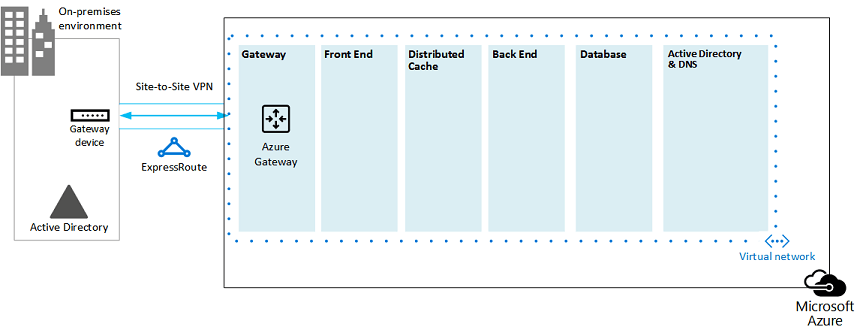
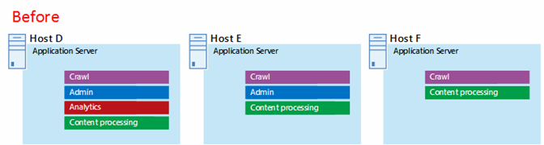

# Microsoft Azure-Architekturen für SharePoint 2013Microsoft Azure Architectures for SharePoint 2013

 **Zusammenfassung:** SharePoint 2013-Lösungen können auf virtuellen Microsoft Azure-Computern gehostet werden. Erfahren Sie, welche Art von Lösungen hierfür geeignet sind und wie Microsoft Azure zum Hosten einer Lösung konfiguriert wird.**Summary:** SharePoint 2013 solutions can be hosted in Microsoft Azure virtual machines. Learn which type of solutions are a good fit and how to set up Microsoft Azure to host one.
  
Azure ist eine gut geeignete Umgebung für das Hosten einer SharePoint 2013-Lösung. In den meisten Fällen empfiehlt sich Office 365, doch eine in Azure gehostete SharePoint-Serverfarm kann eine gute Option für bestimmte Lösungen sein. In diesem Artikel wird beschrieben, wie SharePoint-Lösungen entworfen werden, damit sie sich für die Azure-Plattform eignen. Die folgenden beiden spezifischen Lösungen dienen als Beispiele:Azure is a good environment for hosting a SharePoint Server 2013 solution. In most cases, we recommend Office 365, but a SharePoint Server farm hosted in Azure can be a good option for specific solutions. This article describes how to architect SharePoint solutions so they are a good fit in the Azure platform. The following two specific solutions are used as examples:
  
- [SharePoint Server 2013 - Notfallwiederherstellung in Microsoft AzureSharePoint Server 2013 Disaster Recovery in Microsoft Azure](sharepoint-server-2013-disaster-recovery-in-microsoft-azure.md)
    
- [Internetwebsites in Microsoft Azure mit SharePoint Server 2013Internet Sites in Microsoft Azure using SharePoint Server 2013](internet-sites-in-microsoft-azure-using-sharepoint-server-2013.md)
    
## Empfohlene SharePoint-Lösungen für Azure-InfrastrukturdiensteRecommended SharePoint solutions for Azure Infrastructure Services

Azure-Infrastrukturdienste sind eine überzeugende Option für das Hosting von SharePoint-Lösungen. Einige Lösungen sind für diese Plattform besser geeignet als andere. Die folgende Tabelle zeigt die empfohlene Lösungen.Azure infrastructure services is a compelling option for hosting SharePoint solutions. Some solutions are a better fit for this platform than others. The following table shows recommended solutions.
  
|**Lösung****Solution**|**Warum diese Lösung für Azure empfohlen wird****Why this solution is recommended for Azure**|
|:-----|:-----|
|Entwicklungs- und TestumgebungenDevelopment and test environments    |Es ist einfach, diese Umgebungen zu erstellen und zu verwalten.It's easy to create and manage these environments.    |
|Notfallwiederherstellung lokaler SharePoint-Farmen in AzureDisaster recovery of on-premises SharePoint farms to Azure    |**Gehostetes sekundäres Rechenzentrum** Verwenden Sie Azure, statt in ein sekundäres Rechenzentrum in einer anderen Region zu investieren.**Hosted secondary datacenter** Use Azure instead of investing in a secondary datacenter in a different region.   **Kostengünstige Umgebungen für die Notfallwiederherstellung** Im Vergleich zu einer lokalen Umgebung für die Notfallwiederherstellung müssen Sie weniger Ressourcen vorhalten und bezahlen. Die Anzahl der Ressourcen hängt von der gewählten Umgebung für die Notfallwiederherstellung ab: verzögert betriebsbereit, betriebsbereit und unmittelbar betriebsbereit.**Lower-cost disaster-recovery environments** Maintain and pay for fewer resources than an on-premises disaster recovery environment. The number of resources depends on the disaster recovery environment you choose: cold standby, warm standby, or hot standby.   **Flexiblere Plattform** Bei einem Notfall können Sie Ihre SharePoint-Wiederherstellungsfarm problemlos horizontal skalieren, um die Lastanforderungen zu erfüllen. Skalieren Sie sie horizontal herunter, wenn Sie die Ressourcen nicht mehr benötigen.**More elastic platform** In the event of a disaster, easily scale-out your recovery SharePoint farm to meet load requirements. Scale in when you no longer need the resources.   Siehe [SharePoint Server 2013 - Notfallwiederherstellung in Microsoft Azure](sharepoint-server-2013-disaster-recovery-in-microsoft-azure.md).See [SharePoint Server 2013 Disaster Recovery in Microsoft Azure](sharepoint-server-2013-disaster-recovery-in-microsoft-azure.md).    |
|Über Internet zugängliche Websites, die in Office 365 nicht verfügbare Features und Skalierungen verwendenInternet-facing sites that use features and scale not available in Office 365    |**Konzentrieren Ihrer Bemühungen** Konzentrieren Sie sich auf das Erstellen einer großartigen Website anstatt auf das Erstellen einer Infrastruktur.**Focus your efforts** Concentrate on building a great site rather than building infrastructure.   **Ausnutzen der Flexibilität in Azure** Wählen Sie die Größe der Farm den Anforderungen entsprechend durch Hinzufügen neuer Server aus, und zahlen Sie nur für Ressourcen, die Sie benötigen. Eine dynamische Zuordnung von Computern (automatische Skalierung) wird nicht unterstützt.**Take advantage of elasticity in Azure** Size the farm for the demand by adding new servers, and pay only for resources you need. Dynamic machine allocation is not supported (auto scale).   **Verwendung von Azure Active Directory (AD)** Nutzen Sie Azure AD für Kundenkonten.**Use Azure Active Directory (AD)** Take advantage of Azure AD for customer accounts.   **Hinzufügen von SharePoint-Funktionalität, die in Office 365 nicht zur Verfügung steht** Fügen Sie eine umfassende Berichterstellung und Web Analytics hinzu.**Add SharePoint functionality not available in Office 365** Add deep reporting and web analytics.   Siehe [Internetwebsites in Microsoft Azure mit SharePoint Server 2013](internet-sites-in-microsoft-azure-using-sharepoint-server-2013.md).See [Internet Sites in Microsoft Azure using SharePoint Server 2013](internet-sites-in-microsoft-azure-using-sharepoint-server-2013.md).    |
|App-Farmen zur Unterstützung von Office 365 oder lokaler UmgebungenApp farms to support Office 365 or on-premises environments    |**Erstellen, Testen und Hosten von Apps** in Azure zum Unterstützen von sowohl lokalen als auch von Cloud-Umgebungen.**Build, test, and host apps** in Azure to support both on-premises and cloud environments.   **Hosten dieser Rolle** in Azure anstelle der Anschaffung neuer Hardware für lokale Umgebungen.**Host this role** in Azure instead of buying new hardware for on-premises environments.   |
   
Berücksichtigen Sie für Intranet- und Zusammenarbeitslösungen und Arbeitslasten die folgenden Optionen:For intranet and collaboration solutions and workloads, consider the following options:
  
- Prüfen Sie, ob Office 365 Ihre Geschäftsanforderungen erfüllt oder Teil der Lösung sein kann. Office 365 bietet eine umfangreiche Funktionspalette, die immer auf dem neuesten Stand ist.Determine if Office 365 meets your business requirements or can be part of the solution. Office 365 provides a rich feature set that is always up to date.
    
- Wenn Office 365 nicht alle Ihre Geschäftsanforderungen erfüllt, sollten Sie eine lokale Standardimplementierung von SharePoint 2013 mithilfe der Microsoft Consulting Services (MCS) erwägen. Eine Standardarchitektur kann eine schnellere, kostengünstigere und einfachere Lösung für Sie sein als die Unterstützung einer angepassten Lösung.If Office 365 does not meet all your business requirements, consider a standard implementation of SharePoint 2013 on premises from Microsoft Consulting Services (MCS). A standard architecture can be a quicker, cheaper, and easier solution for you to support than a customized one. 
    
- Wenn eine Standardimplementierung Ihre geschäftlichen Anforderungen nicht erfüllt, erwägen Sie eine angepasste lokale Lösung.If a standard implementation doesn't meet your business requirements, consider a customized on-premises solution.
    
- Wenn eine Cloudplattform für Ihre geschäftlichen Anforderungen wichtig ist, verwenden Sie eine standardmäßige oder benutzerdefinierte Implementierung von SharePoint 2013 (gehostet in Azure-Infrastrukturdiensten). SharePoint-Lösungen sind in Azure viel einfacher zu unterstützen als auf anderen nicht von Microsoft stammenden öffentlichen Cloudplattformen.If using a cloud platform is important for your business requirements, consider a standard or customized implementation of SharePoint 2013 hosted in Azure infrastructure services. SharePoint solutions are much easier to support in Azure than other non-native Microsoft public cloud platforms.
    
## Vor dem Entwerfen der Azure-UmgebungBefore you design the Azure environment

Auch wenn in diesem Artikels Beispieltopologien für SharePoint verwendet werden, können Sie diese Entwurfskonzepte auf alle anderen SharePoint-Farmtopologien übertragen. Befolgen Sie vor dem Entwurf der Azure-Umgebung die folgenden Anleitungen zu Topologie, Architektur, Kapazität und Leistung, um die SharePoint-Farm zu entwerfen.While this article uses example SharePoint topologies, you can use these design concepts with any SharePoint farm topology. Before you design the Azure environment, use the following topology, architecture, capacity, and performance guidance to design the SharePoint farm:
  
- [Technische Diagramme für SharePoint 2013Architecture design for SharePoint 2013 IT pros](http://technet.microsoft.com/en-us/sharepoint/fp123594.aspx)
    
- [Plan for performance and capacity management in SharePoint Server 2013Plan for performance and capacity management in SharePoint Server 2013](http://technet.microsoft.com/library/8dd52916-f77d-4444-b593-1f7d6f330e5f.aspx)
    
## Bestimmen des Active Directory-DomänentypsDetermine the Active Directory domain type

Jede SharePoint-Serverfarm verwendet Active Directory zum Bereitstellen von Administratorkonten für die Einrichtung einer Farm. Derzeit gibt zwei Optionen für SharePoint-Lösungen in Azure, die in der folgenden Tabelle beschrieben sind.Each SharePoint Server farm relies on Active Directory to provide administrative accounts for farm setup. At this time, there are two options for SharePoint solutions in Azure. These are described in the following table.
  
|**Option****Option**|**Beschreibung****Description**|
|:-----|:-----|
|Dedizierte DomäneDedicated domain    |Sie können eine dedizierte und isolierte Active Directory-Domäne in Azure zur Unterstützung der SharePoint-Farm bereitstellen. Dies ist eine gute Wahl für öffentlich zugängliche Internetwebsites.You can deploy a dedicated and isolated Active Directory domain to Azure to support your SharePoint farm. This is a good choice for public-facing Internet sites.    |
|Erweitern der lokalen Domäne über eine standortübergreifende VerbindungExtend the on-premises domain through a cross-premises connection    |Wenn Sie die lokale Domäne über eine standortübergreifende Verbindung erweitern, greifen Benutzer auf die SharePoint-Farm über Ihr Intranet genauso zu, als ob sie lokal gehostet würde. Sie können Ihre lokale Active Directory- und DNS-Implementierung nutzen.When you extend the on-premises domain through a cross-premises connection, users access the SharePoint farm via your intranet as if it were hosted on-premises. You can take advantage of your on-premises Active Directory and DNS implementation.    Eine standortübergreifende Verbindung ist für die Erstellung einer Umgebung für die Notfallwiederherstellung in Azure erforderlich, in die ein Failover aus der lokalen Farm erfolgt.A cross-premises connection is required for building a disaster-recovery environment in Azure to fail over to from your on-premises farm.    |
   
Dieser Artikel enthält Entwurfskonzepte zum Erweitern der lokalen Domäne über eine standortübergreifende Verbindung. Wenn Ihre Lösung eine dedizierte Domäne verwendet, benötigen Sie keine standortübergreifende Verbindung.This article includes design concepts for extending the on-premises domain through a cross-premises connection. If your solution uses a dedicated domain, you don't need a cross-premises connection.
  
## Entwerfen des virtuellen NetzwerksDesign the virtual network

Zunächst benötigen Sie ein virtuelles Netzwerk in Azure mit Subnetzen, in denen Sie Ihre virtuellen Computer platzieren. Das virtuelle Netzwerk benötigt einen privaten IP-Adressraum, von dem Sie Teile den Subnetzen zuweisen.First you need a virtual network in Azure, which includes subnets on which you will place your virtual machines. The virtual network needs a private IP address space, portions of which you assign to the subnets.
  
Wenn Sie Ihr lokales Netzwerk auf Azure über eine standortübergreifende Verbindung (für eine Notfallwiederherstellungsumgebung erforderlich) erweitern, müssen Sie einen privaten Adressraum auswählen, der nicht bereits an anderer Stelle im Netzwerk Ihrer Organisation verwendet wird, was die lokale Umgebung und andere virtuelle Azure-Netzwerke umfassen kann.If you are extending your on-premises network to Azure through a cross-premises connection (required for a disaster recovery environment), you must choose a private address space that is not already in use elsewhere in your organization network, which can include your on-premises environment and other Azure virtual networks. 
  
**Abbildung 1: Lokale Umgebung mit einem virtuellen Netzwerk in Azure****Figure 1: On-premises environment with a virtual network in Azure**

  
Inhalt dieses Diagramms:In this diagram:
  
- Ein virtuelles Netzwerk in Azure und die lokale Umgebung werden nebeneinander dargestellt. Die beiden Umgebungen sind noch nicht über eine standortübergreifende Verbindung verbunden. Dabei kann es sich um eine VPN-Verbindung oder ExpressRoute von Standort zu Standort handeln.A virtual network in Azure is illustrated side-by-side to the on-premises environment. The two environments are not yet connected by a cross-premises connection, which can be a site-to-site VPN connection or ExpressRoute.
    
- An diesem Punkt umfasst das virtuelle Netzwerk nur die Subnetze und keine anderen Elemente der Architektur. Ein Subnetz hostet das Azure-Gateway, und andere Subnetze hosten die Ebenen der SharePoint-Farm, wobei ein weiteres für Active Directory und DNS verwendet wird.At this point, the virtual network just includes the subnets and no other architectural elements. One subnet will host the Azure gateway and other subnets host the tiers of the SharePoint farm, with an additional one for Active Directory and DNS.
    
## Hinzufügen von standortübergreifender KonnektivitätAdd cross-premises connectivity

Der nächste Bereitstellungsschritt ist das Erstellen der standortübergreifenden Verbindung (falls dies für Ihre Lösung gilt). Bei standortübergreifende Verbindungen befindet sich ein Azure-Gateway in einem separaten Gatewaysubnetz, das Sie erstellen und dem Sie einen Adressraum zuweisen müssen.The next deployment step is to create the cross-premises connection (if this applies to your solution). For cross-premises connections, a Azure gateway resides in a separate gateway subnet, which you must create and assign an address space. 
  
Bei der Planung für eine standortübergreifende Verbindung definieren und erstellen Sie ein Azure-Gateway und eine Verbindung mit einem lokalen Gatewaygerät.When you plan for a cross-premises connection, you define and create an Azure gateway and connection to an on-premises gateway device.
  
**Abbildung 2: Verwenden eines Azure-Gateways und eines lokalen Gatewaygeräts zum Bereitstellen einer Standort-zu-Standort-Verbindung zwischen der lokalen Umgebung und Azure****Figure 2: Using an Azure gateway and an on-premises gateway device to provide site-to-site connectivity between the on-premises environment and Azure**

  
Inhalt dieses Diagramms:In this diagram:
  
- Als Ergänzung des vorherigen Diagramms wird die lokale Umgebung mit dem virtuellen Azure-Netzwerk durch eine standortübergreifende Verbindung verbunden. Dabei kann es sich um eine Standort-zu-Standort-VPN-Verbindung oder um ExpressRoute handeln.Adding to the previous diagram, the on-premises environment is connected to the Azure virtual network by a cross-premise connection, which can be a site-to-site VPN connection or ExpressRoute.
    
- Ein Azure-Gateway befindet sich in einem Gateway-Subnetz.An Azure gateway is on a gateway subnet.
    
- Die lokale Umgebung umfasst ein Gatewaygerät, z. B. einen Router oder einen VPN-Server.The on-premises environment includes a gateway device, such as a router or VPN server.
    
Weitere Informationen zum Planen und Erstellen eines standortübergreifenden virtuellen Netzwerks finden Sie unter [Verbinden eines lokalen Netzwerks mit einem virtuellen Microsoft Azure-Netzwerk](connect-an-on-premises-network-to-a-microsoft-azure-virtual-network.md).For additional information to plan for and create a cross-premises virtual network, see [Connect an on-premises network to a Microsoft Azure virtual network](connect-an-on-premises-network-to-a-microsoft-azure-virtual-network.md).
  
## Hinzufügen von Windows Server Active Directory (AD) und DNSAdd Windows Server Active Directory (AD) and DNS

Für die Notfallwiederherstellung in Azure stellen Sie Windows Server AD und DNS in einem Hybridszenario bereit, wobei Windows Server AD sowohl lokal als auch auf virtuellen Azure-Computern bereitgestellt wird.For disaster recovery in Azure, you deploy Windows Server AD and DNS in a hybrid scenario where Windows Server AD is deployed both on-premises and on Azure virtual machines.
  
**Abbildung 3: Hybride Active Directory-Domänenkonfiguration****Figure 3: Hybrid Active Directory domain configuration**

  
Dieses Diagramm basiert auf den vorherigen Diagrammen und enthält zwei weitere virtuelle Computer für ein Windows Server AD- und DNS-Subnetz. Diese virtuellen Computer sind Replikat-Domänencontroller und DNS-Server. Sie dienen als Erweiterung der lokalen Windows Server AD-Umgebung.This diagram builds on the previous diagrams by adding two virtual machines to a Windows Server AD and DNS subnet. These virtual machines are replica domain controllers and DNS servers. They are an extension of the on-premises Windows Server AD environment. 
  
Die folgende Tabelle enthält Empfehlungen für diese virtuellen Computer in Azure. Befolgen Sie diese Empfehlungen als Ausgangspunkt für den Entwurf Ihrer eigenen Umgebung, auch für eine dedizierte Domäne, in der Ihre Azure-Umgebung nicht mit Ihrer lokalen Umgebung kommuniziert.The following table provides configuration recommendations for these virtual machines in Azure. Use these as a starting point for designing your own environment—even for a dedicated domain where your Azure environment doesn't communicate with your on-premises environment.
  
|**Element****Item**|**Konfiguration****Configuration**|
|:-----|:-----|
|Größe des virtuellen Computers in AzureVirtual machine size in Azure    |A1- oder A2-Größe in der StandardebeneA1 or A2 size in the Standard tier    |
|Betriebssystem Operating system    |Windows Server 2012 R2Windows Server 2012 R2    |
|Active Directory-RolleActive Directory role    |Als globaler Katalogserver fungierender AD DS-Domänencontroller. Diese Konfiguration verringert den ausgehenden Datenverkehr über die standortübergreifende Verbindung.AD DS domain controller designated as a global catalog server. This configuration reduces egress traffic across the cross-premises connection.    Konfigurieren Sie in einer Umgebung mit mehreren Domänen mit hohen Änderungsraten (die es nicht häufig gibt) die lokalen Domänencontroller nicht für die Synchronisierung mit den globalen Katalogservern in Azure, um den Replikationsdatenverkehr zu reduzieren.In a multidomain environment with high rates of change (this is not common), configure domain controllers on premises not to sync with the global catalog servers in Azure, to reduce replication traffic.    |
|DNS-RolleDNS role    |Installieren und konfigurieren Sie den DNS-Serverdienst auf den Domänencontrollern.Install and configure the DNS Server service on the domain controllers.    |
|DatenträgerData disks    |Platzieren Sie die Active Directory-Datenbank, Protokolle und SYSVOL auf zusätzlichen Azure-Datenträgern. Platzieren Sie sie nicht auf dem Datenträger mit dem Betriebssystem oder den temporären Datenträgern, die von Azure bereitgestellt werden.Place the Active Directory database, logs, and SYSVOL on additional Azure data disks. Do not place these on the operating system disk or the temporary disks provided by Azure.    |
|IP-AdressenIP addresses    |Verwenden Sie statische IP-Adressen und konfigurieren Sie das virtuelle Netzwerk, um diese Adressen den virtuellen Computern im virtuellen Netzwerk zuzuweisen, nachdem die Domänencontroller konfiguriert wurden.Use static IP addresses and configure the virtual network to assign these addresses to the virtual machines in the virtual network after the domain controllers have been configured.    |
   
> [!IMPORTANT]
> Lesen Sie vor der Bereitstellung von Active Directory in Azure die [Richtlinien für die Bereitstellung von Windows Server Active Directory auf virtuellen Computern in Azure](https://go.microsoft.com/fwlink/p/?linkid=392681). Diese Hilfedateien helfen Ihnen zu bestimmen, ob eine andere Architektur oder andere Konfigurationseinstellungen für Ihre Lösung erforderlich sind.Before you deploy Active Directory in Azure, read [Guidelines for Deploying Windows Server Active Directory on Azure Virtual Machines](https://go.microsoft.com/fwlink/p/?linkid=392681). These help you determine if a different architecture or different configuration settings are needed for your solution. 
  
## Hinzufügen der SharePoint-FarmAdd the SharePoint farm

Platzieren Sie diese virtuellen Computer der SharePoint-Farm in Ebenen der entsprechenden Subnetze.Place the virtual machines of the SharePoint farm in tiers on the appropriate subnets.
  
**Abbildung 4: Platzierung der virtuellen SharePoint-Computer****Figure 4: Placement of SharePoint virtual machines**

  
Dieses Diagramm basiert auf den vorherigen Abbildungen und enthält die beiden SharePoint-Farmserverrollen in ihren entsprechenden Ebenen.This diagram builds on the previous diagrams by adding the SharePoint farm server roles in their respective tiers.
  
- Zwei virtuelle Datenbankcomputer mit SQL Server erstellen die Datenbankebene.Two database virtual machines running SQL Server create the database tier.
    
- Zwei virtuelle Computer mir SharePoint Server 2013 für jede der folgenden Ebenen: Front-End-Server, verteilte Cacheserver und Back-End-Server.Two virtual machines running SharePoint Server 2013 for each of the following tiers: front end servers, distributed cache servers, and back end servers.
    
## Entwerfen und Optimieren von Serverrollen für Verfügbarkeitssätze und FehlerdomänenDesign and fine tune server roles for availability sets and fault domains

Eine Fehlerdomäne ist eine Gruppierung von Hardware, in der Rolleninstanzen ausgeführt werden. Virtuelle Computer in der gleichen Fehlerdomäne können von der Azure-Infrastruktur gleichzeitig aktualisiert werden. Oder sie können zur gleichen Zeit ausfallen, da sie ein Rack gemeinsam verwenden. Um das Risiko zu vermeiden, dass zwei virtuelle Computer zur selben Fehlerdomäne gehören, können Sie Ihre virtuellen Computer als Verfügbarkeitssatz konfigurieren, was sichergestellt, dass jeder virtuelle Computer in einer anderen Fehlerdomäne enthalten ist. Wenn drei virtuelle Computer als Verfügbarkeitssatz konfiguriert sind stellt Azure sicher, dass sich nicht mehr als zwei virtuelle Computer in derselben Fehlerdomäne befinden.A fault domain is a grouping of hardware in which role instances run. Virtual machines within the same fault domain can be updated by the Azure infrastructure at the same time. Or, they can fail at the same time because they share the same rack. To avoid the risk of having two virtual machines on the same fault domain, you can configure your virtual machines as an availability set, which ensures that each virtual machine is in a different fault domain. If three virtual machines are configured as an availability set, Azure guarantees that no more than two of the virtual machines are located in the same fault domain.
  
Konfigurieren Sie beim Entwerfen der Azure-Architektur einer SharePoint-Farm im Rahmen eines Verfügbarkeitssatzes identische Serverrollen. Dadurch wird sichergestellt, dass die virtuellen Computer auf mehrere Fehlerdomänen verteilt sind.When you design the Azure architecture for a SharePoint farm, configure identical server roles to be part of an availability set. This ensures that your virtual machines are spread across multiple fault domains.
  
**Abbildung 5: Verwenden von Azure-Verfügbarkeitssätzen zum Bereitstellen hoher Verfügbarkeit für die SharePoint-Farmebenen****Figure 5: Use Azure Availability Sets to provide high availability for the SharePoint farm tiers**

  
Dieses Diagramm zeigt die Konfiguration der Verfügbarkeitssätze innerhalb der Azure-Infrastruktur. Jede der folgenden Rollen teilt sich einen eigenen Verfügbarkeitssatz:This diagram calls out the configuration of availability sets within the Azure infrastructure. Each of the following roles share a separate availability set:
  
- Active Directory und DNSActive Directory and DNS
    
- DatenbankDatabase
    
- Back-EndBack end
    
- Verteilter CacheDistribute cache
    
- Front-EndFront end
    
Die SharePoint-Farm muss möglicherweise auf der Azure-Plattform optimiert werden. Um eine hohe Verfügbarkeit aller Komponenten sicherzustellen, vergewissern Sie sich, dass alle Serverrollen identisch konfiguriert sind.The SharePoint farm might need to be fine tuned in the Azure platform. To ensure high availability of all components, ensure that the server roles are all configured identically.
  
Es folgt ein Beispiel einer Standardarchitektur von Internetwebsites, die bestimmte Kapazitäts- und Leistungsvorgaben erfüllt. Dieses Beispiel ist im folgenden Architekturmodell enthalten: [Architekturen für Internetwebsitesuche für SharePoint Server 2013](https://go.microsoft.com/fwlink/p/?LinkId=261519).Here is an example that shows a standard Internet Sites architecture that meets specific capacity and performance goals. This example is featured in the following architecture model: [Internet Sites Search Architectures for SharePoint Server 2013](https://go.microsoft.com/fwlink/p/?LinkId=261519).
  
**Abbildung 6: Beispiel der Planung der Kapazitäts- und Leistungsziele in einer Farm mit drei Ebenen****Figure 6: Planning example for capacity and performance goals in a three-tier farm**

  
Inhalt dieses Diagramms:In this diagram:
  
- Eine Farm mit drei Ebenen – Webserver, Anwendungsserver und Datenbankserver – wird gezeigt.A three-tier farm is represented: web servers, application servers, and database servers.
    
- Die drei Webserver sind mit mehreren Komponenten identisch konfiguriert.The three web servers are configured identically with multiple components.
    
- Die beiden Datenbankserver sind identisch konfiguriert.The two database servers are configured identically.
    
- Die drei Anwendungsserver sind nicht identisch konfiguriert. Diese Serverrollen benötigen in Azure eine Optimierung für Verfügbarkeitsätze.The three application servers are not configured identically. These server roles require fine tuning for availability sets in Azure.
    
Die Ebene der Anwendungsserver wollen wir uns genauer ansehen.Let's look closer at the application server tier.
  
**Abbildung 7: Anwendungsserverebene vor der Optimierung****Figure 7: Application server tier before fine tuning**

  
Inhalt dieses Diagramms:In this diagram:
  
- Die Anwendungsebene enthält drei Server.Three servers are included in the application tier.
    
- Der erste Server umfasst vier Komponenten.The first server includes four components.
    
- Der zweite Server umfasst drei Komponenten.The second server includes three components.
    
- Der dritte Server umfasst zwei Komponenten.The third server includes two components.
    
Sie bestimmen die Anzahl der Komponenten anhand der Leistungs- und Kapazitätsvorgaben für die Farm. Für die Anpassung dieser Architektur an Azure werden die vier Komponenten auf alle drei Server repliziert. Dies erhöht die Anzahl der Komponenten über die Leistungs-und Kapazitätsvorgaben hinaus. Der Vorteil besteht darin, dass dieser Entwurf für Hochverfügbarkeit aller vier Komponenten auf der Azure-Plattform sorgt, wenn diese drei virtuelle Computer einem Verfügbarkeitssatz zugewiesen werden.You determine the number of components by the performance and capacity targets for the farm. To adapt this architecture for Azure, we'll replicate the four components across all three servers. This increases the number of components beyond what is necessary for performance and capacity. The tradeoff is that this design ensures high availability of all four components in the Azure platform when these three virtual machines are assigned to an availability set.
  
**Abbildung 8: Anwendungsserverebene nach der Optimierung****Figure 8: Application server tier after fine tuning**

  
Zeigt alle drei Anwendungsserver, die mit den gleichen vier Komponenten identisch konfiguriert sind.This diagram shows all three application servers configured identically with the same four components.
  
Wenn wir den Ebenen der SharePoint-Farm Verfügbarkeitssätze hinzufügen, ist die Implementierung abgeschlossen.When we add availability sets to the tiers of the SharePoint farm, the implementation is complete.
  
**Abbildung 9: Die fertige SharePoint-Farm in Azure-Infrastrukturdiensten****Figure 9: The completed SharePoint farm in Azure infrastructure services**

  
Dieses Diagramm zeigt die in Azure-Infrastrukturdiensten implementierte SharePoint-Farm mit Verfügbarkeitssätzen zum Bereitstellen von Fehlerdomänen für die Server in den einzelnen Ebenen.This diagram shows the SharePoint farm implemented in Azure infrastructure services, with availability sets to provide fault domains for the servers in each tier.
  
**An der Diskussion teilnehmen****Join the discussion**

|**Kontakt****Contact us**|**Beschreibung****Description**|
|:-----|:-----|
|**Welche Lösungen benötigen Sie?****What cloud adoption content do you need?**   |Wir entwickeln Inhalte für Lösungen auf Grundlage mehrerer Microsoft-Produkte und -Dienste. Lassen Sie uns wissen, was Sie von unseren serverübergreifenden Lösungen halten, oder fordern Sie spezifische Lösungen an, indem Sie eine E-Mail an [MODAcontent@microsoft.com](mailto:cloudadopt@microsoft.com?Subject=[Cloud%20Adoption%20Content%20Feedback]:%20) senden.We are creating content for cloud adoption that spans multiple Microsoft cloud platforms and services. Let us know what you think about our cloud adoption content, or ask for specific content by sending email to [cloudadopt@microsoft.com](mailto:cloudadopt@microsoft.com?Subject=[Cloud%20Adoption%20Content%20Feedback]:%20).    |
|**An der Diskussion über Lösungen teilnehmen****Join the cloud adoption discussion**   |Wenn Sie sich für Cloud-basierte Lösungen interessieren, werden Sie Teil des Cloud Adoption Advisory Board (CAAB), um Zugriff auf eine größere, dynamische Community aus Microsoft-Inhaltsentwicklern, Branchenexperten und Kunden aus aller Welt zu haben. Um beizutreten, fügen Sie sich selbst als Mitglied des [CAAB (Cloud Adoption Advisory Board)-Bereichs](https://aka.ms/caab) der Microsoft Tech Community hinzu, und senden Sie uns eine E-Mail an [CAAB@microsoft.com](mailto:caab@microsoft.com?Subject=I%20just%20joined%20the%20Cloud%20Adoption%20Advisory%20Board!). Communityinhalte stehen allen Personen im [CAAB-Blog](https://blogs.technet.com/b/solutions_advisory_board/) zur Verfügung. CAAB-Mitglieder erhalten jedoch Einladungen zu privaten Webinaren, die neue Ressourcen und Lösungen für den Cloud-Einsatz beschreiben.If you are passionate about cloud-based solutions, consider joining the Cloud Adoption Advisory Board (CAAB) to connect with a larger, vibrant community of Microsoft content developers, industry professionals, and customers from around the globe. To join, add yourself as a member of the [CAAB (Cloud Adoption Advisory Board) space](https://aka.ms/caab) of the Microsoft Tech Community and send us a quick email at[CAAB@microsoft.com](mailto:caab@microsoft.com?Subject=I%20just%20joined%20the%20Cloud%20Adoption%20Advisory%20Board!). Anyone can read community-related content on the [CAAB blog](https://blogs.technet.com/b/solutions_advisory_board/). However, CAAB members get invitations to private webinars that describe new cloud adoption resources and solutions.    |
|**Die hier gezeigte Grafik abrufen****Get the art you see here**   |Wenn Sie eine bearbeitbare Kopie der Grafik wünschen, die Sie in disem Artikel sehen, senden wir Sie Ihnen gerne zu. Senden Sie eine E-Mail mit der Anforderung einschließlich der URL und dem Titel der Grafik an [cloudadopt@microsoft.com](mailto:cloudadopt@microsoft.com?subject=[Art%20Request]:%20).  If you want an editable copy of the art you see in this article, we'll be glad to send it to you. Email your request, including the URL and title of the art, to [cloudadopt@microsoft.com](mailto:cloudadopt@microsoft.com?subject=[Art%20Request]:%20).    |
   
## Siehe auchSee Also

[Cloudakzeptanz und HybridlösungenCloud adoption and hybrid solutions](cloud-adoption-and-hybrid-solutions.md)
  
[Internetwebsites in Microsoft Azure mit SharePoint Server 2013Internet Sites in Microsoft Azure using SharePoint Server 2013](internet-sites-in-microsoft-azure-using-sharepoint-server-2013.md)
  
[SharePoint Server 2013 - Notfallwiederherstellung in Microsoft AzureSharePoint Server 2013 Disaster Recovery in Microsoft Azure](sharepoint-server-2013-disaster-recovery-in-microsoft-azure.md)

