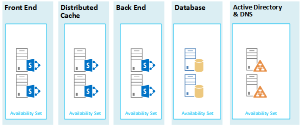

# Microsoft Azure-Architekturen für SharePoint 2013

Azure ist eine gut geeignete Umgebung für das Hosten einer SharePoint 2013-Lösung. In den meisten Fällen wird Microsoft 365 empfohlen, aber eine SharePoint Server Farm, die in Azure gehostet wird, kann eine gute Option für bestimmte Lösungen sein. In diesem Artikel wird beschrieben, wie SharePoint-Lösungen entworfen werden, damit sie sich für die Azure-Plattform eignen. Die folgenden beiden spezifischen Lösungen dienen als Beispiele:
  
- [SharePoint Server 2013 - Notfallwiederherstellung in Microsoft Azure](sharepoint-server-2013-disaster-recovery-in-microsoft-azure.md)
    
- [Internetwebsites in Microsoft Azure mit SharePoint Server 2013](internet-sites-in-microsoft-azure-using-sharepoint-server-2013.md)
    
## Empfohlene SharePoint-Lösungen für Azure-Infrastrukturdienste

Azure infrastructure services is a compelling option for hosting SharePoint solutions. Some solutions are a better fit for this platform than others. The following table shows recommended solutions.
  
|**Lösung**|**Warum diese Lösung für Azure empfohlen wird**|
|:-----|:-----|
|Entwicklungs- und Testumgebungen    |Es ist einfach, diese Umgebungen zu erstellen und zu verwalten.    |
|Notfallwiederherstellung lokaler SharePoint-Farmen in Azure    |**Gehostetes sekundäres Rechenzentrum** Verwenden Sie Azure, statt in ein sekundäres Rechenzentrum in einer anderen Region zu investieren.   **Lower-cost disaster-recovery environments** Maintain and pay for fewer resources than an on-premises disaster recovery environment. The number of resources depends on the disaster recovery environment you choose: cold standby, warm standby, or hot standby.   **More elastic platform** In the event of a disaster, easily scale-out your recovery SharePoint farm to meet load requirements. Scale in when you no longer need the resources.   Siehe [SharePoint Server 2013 - Notfallwiederherstellung in Microsoft Azure](sharepoint-server-2013-disaster-recovery-in-microsoft-azure.md).    |
|Mit dem Internet verbundene Websites mit Features und Skalierung, die in Microsoft 365 nicht verfügbar sind    |**Konzentrieren Ihrer Bemühungen** Konzentrieren Sie sich auf das Erstellen einer großartigen Website anstatt auf das Erstellen einer Infrastruktur.   **Take advantage of elasticity in Azure** Size the farm for the demand by adding new servers, and pay only for resources you need. Dynamic machine allocation is not supported (auto scale).   **Verwendung von Azure Active Directory (AD)** Nutzen Sie Azure AD für Kundenkonten.   **Hinzufügen von SharePoint-Funktionen in Microsoft 365 nicht verfügbar** Fügen Sie Deep Reporting und Webanalyse hinzu.   Siehe [Internetwebsites in Microsoft Azure mit SharePoint Server 2013](internet-sites-in-microsoft-azure-using-sharepoint-server-2013.md).    |
|App-Farmen zur Unterstützung von Microsoft 365 oder lokalen Umgebungen    |**Erstellen, Testen und Hosten von Apps** in Azure zum Unterstützen von sowohl lokalen als auch von Cloud-Umgebungen.   **Hosten dieser Rolle** in Azure anstelle der Anschaffung neuer Hardware für lokale Umgebungen.   |
   
Berücksichtigen Sie für Intranet- und Zusammenarbeitslösungen und Arbeitslasten die folgenden Optionen:
  
- Ermitteln Sie, ob Microsoft 365 Ihre geschäftlichen Anforderungen erfüllt oder Teil der Lösung sein kann. Microsoft 365 bietet eine umfassende Funktionsgruppe, die immer auf dem neuesten Stand ist.
    
- Wenn Microsoft 365 nicht alle Ihre geschäftlichen Anforderungen erfüllt, sollten Sie eine Standardimplementierung von SharePoint 2013 lokal von Microsoft Consulting Services (MCS) aus prüfen. Eine Standardarchitektur kann eine schnellere, kostengünstigere und einfachere Lösung für Sie sein als die Unterstützung einer angepassten Lösung. 
    
- Wenn eine Standardimplementierung Ihre geschäftlichen Anforderungen nicht erfüllt, erwägen Sie eine angepasste lokale Lösung.
    
- If using a cloud platform is important for your business requirements, consider a standard or customized implementation of SharePoint 2013 hosted in Azure infrastructure services. SharePoint solutions are much easier to support in Azure than other non-native Microsoft public cloud platforms.
    
## Vor dem Entwerfen der Azure-Umgebung

While this article uses example SharePoint topologies, you can use these design concepts with any SharePoint farm topology. Before you design the Azure environment, use the following topology, architecture, capacity, and performance guidance to design the SharePoint farm:
  
- [Technische Diagramme für SharePoint 2013](https://technet.microsoft.com/sharepoint/fp123594.aspx)
    
- [Plan for performance and capacity management in SharePoint Server 2013](https://technet.microsoft.com/library/8dd52916-f77d-4444-b593-1f7d6f330e5f.aspx)
    
## Bestimmen des Active Directory-Domänentyps

Each SharePoint Server farm relies on Active Directory to provide administrative accounts for farm setup. At this time, there are two options for SharePoint solutions in Azure. These are described in the following table.
  
|**Option**|**Beschreibung**|
|:-----|:-----|
|Dedizierte Domäne    |You can deploy a dedicated and isolated Active Directory domain to Azure to support your SharePoint farm. This is a good choice for public-facing Internet sites.    |
|Erweitern der lokalen Domäne über eine standortübergreifende Verbindung    |When you extend the on-premises domain through a cross-premises connection, users access the SharePoint farm via your intranet as if it were hosted on-premises. You can take advantage of your on-premises Active Directory and DNS implementation.    Eine standortübergreifende Verbindung ist für die Erstellung einer Umgebung für die Notfallwiederherstellung in Azure erforderlich, in die ein Failover aus der lokalen Farm erfolgt.    |
   
This article includes design concepts for extending the on-premises domain through a cross-premises connection. If your solution uses a dedicated domain, you don't need a cross-premises connection.
  
## Entwerfen des virtuellen Netzwerks

First you need a virtual network in Azure, which includes subnets on which you will place your virtual machines. The virtual network needs a private IP address space, portions of which you assign to the subnets.
  
Wenn Sie Ihr lokales Netzwerk auf Azure über eine standortübergreifende Verbindung (für eine Notfallwiederherstellungsumgebung erforderlich) erweitern, müssen Sie einen privaten Adressraum auswählen, der nicht bereits an anderer Stelle im Netzwerk Ihrer Organisation verwendet wird, was die lokale Umgebung und andere virtuelle Azure-Netzwerke umfassen kann. 
  
**Abbildung 1: Lokale Umgebung mit einem virtuellen Netzwerk in Azure**

  
Inhalt dieses Diagramms:
  
- A virtual network in Azure is illustrated side-by-side to the on-premises environment. The two environments are not yet connected by a cross-premises connection, which can be a site-to-site VPN connection or ExpressRoute.
    
- At this point, the virtual network just includes the subnets and no other architectural elements. One subnet will host the Azure gateway and other subnets host the tiers of the SharePoint farm, with an additional one for Active Directory and DNS.
    
## Hinzufügen von standortübergreifender Konnektivität

The next deployment step is to create the cross-premises connection (if this applies to your solution). For cross-premises connections, a Azure gateway resides in a separate gateway subnet, which you must create and assign an address space. 
  
Bei der Planung für eine standortübergreifende Verbindung definieren und erstellen Sie ein Azure-Gateway und eine Verbindung mit einem lokalen Gatewaygerät.
  
**Abbildung 2: Verwenden eines Azure-Gateways und eines lokalen Gatewaygeräts zum Bereitstellen einer Standort-zu-Standort-Verbindung zwischen der lokalen Umgebung und Azure**

  
Inhalt dieses Diagramms:
  
- Als Ergänzung des vorherigen Diagramms wird die lokale Umgebung mit dem virtuellen Azure-Netzwerk durch eine standortübergreifende Verbindung verbunden. Dabei kann es sich um eine Standort-zu-Standort-VPN-Verbindung oder um ExpressRoute handeln.
    
- Ein Azure-Gateway befindet sich in einem Gateway-Subnetz.
    
- Die lokale Umgebung umfasst ein Gatewaygerät, z. B. einen Router oder einen VPN-Server.
    
Weitere Informationen zum Planen und Erstellen eines standortübergreifenden virtuellen Netzwerks finden Sie unter [Verbinden eines lokalen Netzwerks mit einem virtuellen Microsoft Azure-Netzwerk](connect-an-on-premises-network-to-a-microsoft-azure-virtual-network.md).
  
## Hinzufügen von Active Directory-Domänendienste (AD DS) und DNS

Für die Notfallwiederherstellung in Azure stellen Sie Windows Server AD und DNS in einem Hybridszenario bereit, wobei Windows Server AD sowohl lokal als auch auf virtuellen Azure-Computern bereitgestellt wird.
  
**Abbildung 3: Hybride Active Directory-Domänenkonfiguration**

  
This diagram builds on the previous diagrams by adding two virtual machines to a Windows Server AD and DNS subnet. These virtual machines are replica domain controllers and DNS servers. They are an extension of the on-premises Windows Server AD environment. 
  
The following table provides configuration recommendations for these virtual machines in Azure. Use these as a starting point for designing your own environment—even for a dedicated domain where your Azure environment doesn't communicate with your on-premises environment.
  
|**Element**|**Konfiguration**|
|:-----|:-----|
|Größe des virtuellen Computers in Azure    |A1- oder A2-Größe in der Standardebene    |
|Betriebssystem    |Windows Server 2012 R2    |
|Active Directory-Rolle    |AD DS domain controller designated as a global catalog server. This configuration reduces egress traffic across the cross-premises connection.    Konfigurieren Sie in einer Umgebung mit mehreren Domänen mit hohen Änderungsraten (die es nicht häufig gibt) die lokalen Domänencontroller nicht für die Synchronisierung mit den globalen Katalogservern in Azure, um den Replikationsdatenverkehr zu reduzieren.    |
|DNS-Rolle    |Installieren und konfigurieren Sie den DNS-Serverdienst auf den Domänencontrollern.    |
|Datenträger    |Place the Active Directory database, logs, and SYSVOL on additional Azure data disks. Do not place these on the operating system disk or the temporary disks provided by Azure.    |
|IP-Adressen    |Verwenden Sie statische IP-Adressen und konfigurieren Sie das virtuelle Netzwerk, um diese Adressen den virtuellen Computern im virtuellen Netzwerk zuzuweisen, nachdem die Domänencontroller konfiguriert wurden.    |
   
> [!IMPORTANT]
> Before you deploy Active Directory in Azure, read [Guidelines for Deploying Windows Server Active Directory on Azure Virtual Machines](https://go.microsoft.com/fwlink/p/?linkid=392681). These help you determine if a different architecture or different configuration settings are needed for your solution. 
  
## Hinzufügen der SharePoint-Farm

Platzieren Sie diese virtuellen Computer der SharePoint-Farm in Ebenen der entsprechenden Subnetze.
  
**Abbildung 4: Platzierung der virtuellen SharePoint-Computer**

  
Dieses Diagramm basiert auf den vorherigen Abbildungen und enthält die beiden SharePoint-Farmserverrollen in ihren entsprechenden Ebenen.
  
- Zwei virtuelle Datenbankcomputer mit SQL Server erstellen die Datenbankebene.
    
- Zwei virtuelle Computer mir SharePoint Server 2013 für jede der folgenden Ebenen: Front-End-Server, verteilte Cacheserver und Back-End-Server.
    
## Entwerfen und Optimieren von Serverrollen für Verfügbarkeitssätze und Fehlerdomänen

A fault domain is a grouping of hardware in which role instances run. Virtual machines within the same fault domain can be updated by the Azure infrastructure at the same time. Or, they can fail at the same time because they share the same rack. To avoid the risk of having two virtual machines on the same fault domain, you can configure your virtual machines as an availability set, which ensures that each virtual machine is in a different fault domain. If three virtual machines are configured as an availability set, Azure guarantees that no more than two of the virtual machines are located in the same fault domain.
  
When you design the Azure architecture for a SharePoint farm, configure identical server roles to be part of an availability set. This ensures that your virtual machines are spread across multiple fault domains.
  
**Abbildung 5: Verwenden von Azure-Verfügbarkeitssätzen zum Bereitstellen hoher Verfügbarkeit für die SharePoint-Farmebenen**

  
This diagram calls out the configuration of availability sets within the Azure infrastructure. Each of the following roles share a separate availability set:
  
- Active Directory und DNS
    
- Datenbank
    
- Back-End
    
- Verteilter Cache
    
- Front-End
    
The SharePoint farm might need to be fine tuned in the Azure platform. To ensure high availability of all components, ensure that the server roles are all configured identically.
  
Here is an example that shows a standard Internet Sites architecture that meets specific capacity and performance goals. This example is featured in the following architecture model: [Internet Sites Search Architectures for SharePoint Server 2013](https://go.microsoft.com/fwlink/p/?LinkId=261519).
  
**Abbildung 6: Beispiel der Planung der Kapazitäts- und Leistungsziele in einer Farm mit drei Ebenen**

  
Inhalt dieses Diagramms:
  
- Eine Farm mit drei Ebenen – Webserver, Anwendungsserver und Datenbankserver – wird gezeigt.
    
- Die drei Webserver sind mit mehreren Komponenten identisch konfiguriert.
    
- Die beiden Datenbankserver sind identisch konfiguriert.
    
- The three application servers are not configured identically. These server roles require fine tuning for availability sets in Azure.
    
Die Ebene der Anwendungsserver wollen wir uns genauer ansehen.
  
**Abbildung 7: Anwendungsserverebene vor der Optimierung**

  
Inhalt dieses Diagramms:
  
- Die Anwendungsebene enthält drei Server.
    
- Der erste Server umfasst vier Komponenten.
    
- Der zweite Server umfasst drei Komponenten.
    
- Der dritte Server umfasst zwei Komponenten.
    
You determine the number of components by the performance and capacity targets for the farm. To adapt this architecture for Azure, we'll replicate the four components across all three servers. This increases the number of components beyond what is necessary for performance and capacity. The tradeoff is that this design ensures high availability of all four components in the Azure platform when these three virtual machines are assigned to an availability set.
  
**Abbildung 8: Anwendungsserverebene nach der Optimierung**

  
Zeigt alle drei Anwendungsserver, die mit den gleichen vier Komponenten identisch konfiguriert sind.
  
Wenn wir den Ebenen der SharePoint-Farm Verfügbarkeitssätze hinzufügen, ist die Implementierung abgeschlossen.
  
**Abbildung 9: Die fertige SharePoint-Farm in Azure-Infrastrukturdiensten**

  
Dieses Diagramm zeigt die in Azure-Infrastrukturdiensten implementierte SharePoint-Farm mit Verfügbarkeitssätzen zum Bereitstellen von Fehlerdomänen für die Server in den einzelnen Ebenen.
  
## Siehe auch

[Cloudakzeptanz und Hybridlösungen](cloud-adoption-and-hybrid-solutions.yml)
  
[Internetwebsites in Microsoft Azure mit SharePoint Server 2013](internet-sites-in-microsoft-azure-using-sharepoint-server-2013.md)
  
[SharePoint Server 2013 - Notfallwiederherstellung in Microsoft Azure](sharepoint-server-2013-disaster-recovery-in-microsoft-azure.md)

