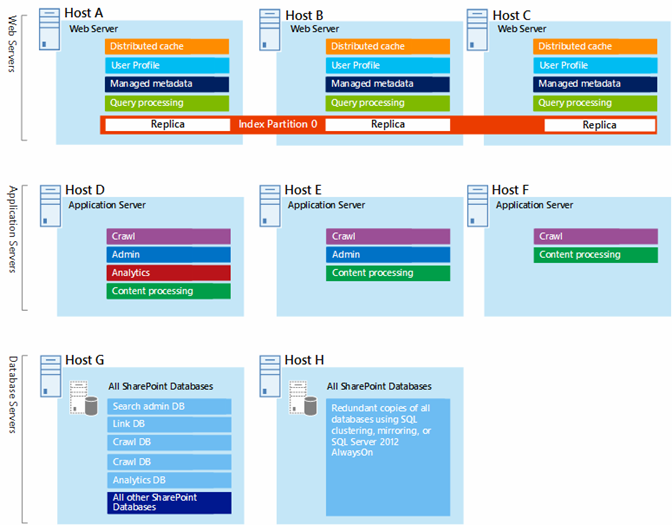

# Microsoft Azure-Architekturen für SharePoint 2013Microsoft Azure Architectures for SharePoint 2013

Azure ist eine gut geeignete Umgebung für das Hosten einer SharePoint 2013-Lösung.Azure is a good environment for hosting a SharePoint Server 2013 solution. In den meisten Fällen wird Microsoft 365 empfohlen, aber eine SharePoint Server Farm, die in Azure gehostet wird, kann eine gute Option für bestimmte Lösungen sein.In most cases, we recommend Microsoft 365, but a SharePoint Server farm hosted in Azure can be a good option for specific solutions. In diesem Artikel wird beschrieben, wie SharePoint-Lösungen entworfen werden, damit sie sich für die Azure-Plattform eignen.This article describes how to architect SharePoint solutions so they are a good fit in the Azure platform. Die folgenden beiden spezifischen Lösungen dienen als Beispiele:The following two specific solutions are used as examples:
  
- [SharePoint Server 2013 - Notfallwiederherstellung in Microsoft AzureSharePoint Server 2013 Disaster Recovery in Microsoft Azure](sharepoint-server-2013-disaster-recovery-in-microsoft-azure.md)
    
- [Internetwebsites in Microsoft Azure mit SharePoint Server 2013Internet Sites in Microsoft Azure using SharePoint Server 2013](internet-sites-in-microsoft-azure-using-sharepoint-server-2013.md)
    
## Empfohlene SharePoint-Lösungen für Azure-InfrastrukturdiensteRecommended SharePoint solutions for Azure Infrastructure Services

Azure infrastructure services is a compelling option for hosting SharePoint solutions.Azure infrastructure services is a compelling option for hosting SharePoint solutions. Some solutions are a better fit for this platform than others.Some solutions are a better fit for this platform than others. The following table shows recommended solutions.The following table shows recommended solutions.
  
|**Lösung****Solution**|**Warum diese Lösung für Azure empfohlen wird****Why this solution is recommended for Azure**|
|:-----|:-----|
|Entwicklungs- und TestumgebungenDevelopment and test environments    |Es ist einfach, diese Umgebungen zu erstellen und zu verwalten.It's easy to create and manage these environments.    |
|Notfallwiederherstellung lokaler SharePoint-Farmen in AzureDisaster recovery of on-premises SharePoint farms to Azure    |**Gehostetes sekundäres Rechenzentrum** Verwenden Sie Azure, statt in ein sekundäres Rechenzentrum in einer anderen Region zu investieren.**Hosted secondary datacenter** Use Azure instead of investing in a secondary datacenter in a different region.   **Lower-cost disaster-recovery environments** Maintain and pay for fewer resources than an on-premises disaster recovery environment.**Lower-cost disaster-recovery environments** Maintain and pay for fewer resources than an on-premises disaster recovery environment. The number of resources depends on the disaster recovery environment you choose: cold standby, warm standby, or hot standby.The number of resources depends on the disaster recovery environment you choose: cold standby, warm standby, or hot standby.   **More elastic platform** In the event of a disaster, easily scale-out your recovery SharePoint farm to meet load requirements.**More elastic platform** In the event of a disaster, easily scale-out your recovery SharePoint farm to meet load requirements. Scale in when you no longer need the resources.Scale in when you no longer need the resources.   Siehe [SharePoint Server 2013 - Notfallwiederherstellung in Microsoft Azure](sharepoint-server-2013-disaster-recovery-in-microsoft-azure.md).See [SharePoint Server 2013 Disaster Recovery in Microsoft Azure](sharepoint-server-2013-disaster-recovery-in-microsoft-azure.md).    |
|Mit dem Internet verbundene Websites mit Features und Skalierung, die in Microsoft 365 nicht verfügbar sindInternet-facing sites that use features and scale not available in Microsoft 365    |**Konzentrieren Ihrer Bemühungen** Konzentrieren Sie sich auf das Erstellen einer großartigen Website anstatt auf das Erstellen einer Infrastruktur.**Focus your efforts** Concentrate on building a great site rather than building infrastructure.   **Take advantage of elasticity in Azure** Size the farm for the demand by adding new servers, and pay only for resources you need.**Take advantage of elasticity in Azure** Size the farm for the demand by adding new servers, and pay only for resources you need. Dynamic machine allocation is not supported (auto scale).Dynamic machine allocation is not supported (auto scale).   **Verwendung von Azure Active Directory (AD)** Nutzen Sie Azure AD für Kundenkonten.**Use Azure Active Directory (AD)** Take advantage of Azure AD for customer accounts.   **Hinzufügen von SharePoint-Funktionen in Microsoft 365 nicht verfügbar** Fügen Sie Deep Reporting und Webanalyse hinzu.**Add SharePoint functionality not available in Microsoft 365** Add deep reporting and web analytics.   Siehe [Internetwebsites in Microsoft Azure mit SharePoint Server 2013](internet-sites-in-microsoft-azure-using-sharepoint-server-2013.md).See [Internet Sites in Microsoft Azure using SharePoint Server 2013](internet-sites-in-microsoft-azure-using-sharepoint-server-2013.md).    |
|App-Farmen zur Unterstützung von Microsoft 365 oder lokalen UmgebungenApp farms to support Microsoft 365 or on-premises environments    |**Erstellen, Testen und Hosten von Apps** in Azure zum Unterstützen von sowohl lokalen als auch von Cloud-Umgebungen.**Build, test, and host apps** in Azure to support both on-premises and cloud environments.   **Hosten dieser Rolle** in Azure anstelle der Anschaffung neuer Hardware für lokale Umgebungen.**Host this role** in Azure instead of buying new hardware for on-premises environments.   |
   
Berücksichtigen Sie für Intranet- und Zusammenarbeitslösungen und Arbeitslasten die folgenden Optionen:For intranet and collaboration solutions and workloads, consider the following options:
  
- Ermitteln Sie, ob Microsoft 365 Ihre geschäftlichen Anforderungen erfüllt oder Teil der Lösung sein kann.Determine if Microsoft 365 meets your business requirements or can be part of the solution. Microsoft 365 bietet eine umfassende Funktionsgruppe, die immer auf dem neuesten Stand ist.Microsoft 365 provides a rich feature set that is always up to date.
    
- Wenn Microsoft 365 nicht alle Ihre geschäftlichen Anforderungen erfüllt, sollten Sie eine Standardimplementierung von SharePoint 2013 lokal von Microsoft Consulting Services (MCS) aus prüfen.If Microsoft 365 does not meet all your business requirements, consider a standard implementation of SharePoint 2013 on premises from Microsoft Consulting Services (MCS). Eine Standardarchitektur kann eine schnellere, kostengünstigere und einfachere Lösung für Sie sein als die Unterstützung einer angepassten Lösung.A standard architecture can be a quicker, cheaper, and easier solution for you to support than a customized one. 
    
- Wenn eine Standardimplementierung Ihre geschäftlichen Anforderungen nicht erfüllt, erwägen Sie eine angepasste lokale Lösung.If a standard implementation doesn't meet your business requirements, consider a customized on-premises solution.
    
- If using a cloud platform is important for your business requirements, consider a standard or customized implementation of SharePoint 2013 hosted in Azure infrastructure services.If using a cloud platform is important for your business requirements, consider a standard or customized implementation of SharePoint 2013 hosted in Azure infrastructure services. SharePoint solutions are much easier to support in Azure than other non-native Microsoft public cloud platforms.SharePoint solutions are much easier to support in Azure than other non-native Microsoft public cloud platforms.
    
## Vor dem Entwerfen der Azure-UmgebungBefore you design the Azure environment

While this article uses example SharePoint topologies, you can use these design concepts with any SharePoint farm topology.While this article uses example SharePoint topologies, you can use these design concepts with any SharePoint farm topology. Before you design the Azure environment, use the following topology, architecture, capacity, and performance guidance to design the SharePoint farm:Before you design the Azure environment, use the following topology, architecture, capacity, and performance guidance to design the SharePoint farm:
  
- [Technische Diagramme für SharePoint 2013Architecture design for SharePoint 2013 IT pros](https://technet.microsoft.com/sharepoint/fp123594.aspx)
    
- [Plan for performance and capacity management in SharePoint Server 2013Plan for performance and capacity management in SharePoint Server 2013](https://technet.microsoft.com/library/8dd52916-f77d-4444-b593-1f7d6f330e5f.aspx)
    
## Bestimmen des Active Directory-DomänentypsDetermine the Active Directory domain type

Each SharePoint Server farm relies on Active Directory to provide administrative accounts for farm setup.Each SharePoint Server farm relies on Active Directory to provide administrative accounts for farm setup. At this time, there are two options for SharePoint solutions in Azure.At this time, there are two options for SharePoint solutions in Azure. These are described in the following table.These are described in the following table.
  
|**Option****Option**|**Beschreibung****Description**|
|:-----|:-----|
|Dedizierte DomäneDedicated domain    |You can deploy a dedicated and isolated Active Directory domain to Azure to support your SharePoint farm.You can deploy a dedicated and isolated Active Directory domain to Azure to support your SharePoint farm. This is a good choice for public-facing Internet sites.This is a good choice for public-facing Internet sites.    |
|Erweitern der lokalen Domäne über eine standortübergreifende VerbindungExtend the on-premises domain through a cross-premises connection    |When you extend the on-premises domain through a cross-premises connection, users access the SharePoint farm via your intranet as if it were hosted on-premises.When you extend the on-premises domain through a cross-premises connection, users access the SharePoint farm via your intranet as if it were hosted on-premises. You can take advantage of your on-premises Active Directory and DNS implementation.You can take advantage of your on-premises Active Directory and DNS implementation.    Eine standortübergreifende Verbindung ist für die Erstellung einer Umgebung für die Notfallwiederherstellung in Azure erforderlich, in die ein Failover aus der lokalen Farm erfolgt.A cross-premises connection is required for building a disaster-recovery environment in Azure to fail over to from your on-premises farm.    |
   
This article includes design concepts for extending the on-premises domain through a cross-premises connection.This article includes design concepts for extending the on-premises domain through a cross-premises connection. If your solution uses a dedicated domain, you don't need a cross-premises connection.If your solution uses a dedicated domain, you don't need a cross-premises connection.
  
## Entwerfen des virtuellen NetzwerksDesign the virtual network

First you need a virtual network in Azure, which includes subnets on which you will place your virtual machines.First you need a virtual network in Azure, which includes subnets on which you will place your virtual machines. The virtual network needs a private IP address space, portions of which you assign to the subnets.The virtual network needs a private IP address space, portions of which you assign to the subnets.
  
Wenn Sie Ihr lokales Netzwerk auf Azure über eine standortübergreifende Verbindung (für eine Notfallwiederherstellungsumgebung erforderlich) erweitern, müssen Sie einen privaten Adressraum auswählen, der nicht bereits an anderer Stelle im Netzwerk Ihrer Organisation verwendet wird, was die lokale Umgebung und andere virtuelle Azure-Netzwerke umfassen kann.If you are extending your on-premises network to Azure through a cross-premises connection (required for a disaster recovery environment), you must choose a private address space that is not already in use elsewhere in your organization network, which can include your on-premises environment and other Azure virtual networks. 
  
**Abbildung 1: Lokale Umgebung mit einem virtuellen Netzwerk in Azure****Figure 1: On-premises environment with a virtual network in Azure**

  
Inhalt dieses Diagramms:In this diagram:
  
- A virtual network in Azure is illustrated side-by-side to the on-premises environment.A virtual network in Azure is illustrated side-by-side to the on-premises environment. The two environments are not yet connected by a cross-premises connection, which can be a site-to-site VPN connection or ExpressRoute.The two environments are not yet connected by a cross-premises connection, which can be a site-to-site VPN connection or ExpressRoute.
    
- At this point, the virtual network just includes the subnets and no other architectural elements.At this point, the virtual network just includes the subnets and no other architectural elements. One subnet will host the Azure gateway and other subnets host the tiers of the SharePoint farm, with an additional one for Active Directory and DNS.One subnet will host the Azure gateway and other subnets host the tiers of the SharePoint farm, with an additional one for Active Directory and DNS.
    
## Hinzufügen von standortübergreifender KonnektivitätAdd cross-premises connectivity

The next deployment step is to create the cross-premises connection (if this applies to your solution).The next deployment step is to create the cross-premises connection (if this applies to your solution). For cross-premises connections, a Azure gateway resides in a separate gateway subnet, which you must create and assign an address space.For cross-premises connections, a Azure gateway resides in a separate gateway subnet, which you must create and assign an address space. 
  
Bei der Planung für eine standortübergreifende Verbindung definieren und erstellen Sie ein Azure-Gateway und eine Verbindung mit einem lokalen Gatewaygerät.When you plan for a cross-premises connection, you define and create an Azure gateway and connection to an on-premises gateway device.
  
**Abbildung 2: Verwenden eines Azure-Gateways und eines lokalen Gatewaygeräts zum Bereitstellen einer Standort-zu-Standort-Verbindung zwischen der lokalen Umgebung und Azure****Figure 2: Using an Azure gateway and an on-premises gateway device to provide site-to-site connectivity between the on-premises environment and Azure**

  
Inhalt dieses Diagramms:In this diagram:
  
- Als Ergänzung des vorherigen Diagramms wird die lokale Umgebung mit dem virtuellen Azure-Netzwerk durch eine standortübergreifende Verbindung verbunden. Dabei kann es sich um eine Standort-zu-Standort-VPN-Verbindung oder um ExpressRoute handeln.Adding to the previous diagram, the on-premises environment is connected to the Azure virtual network by a cross-premise connection, which can be a site-to-site VPN connection or ExpressRoute.
    
- Ein Azure-Gateway befindet sich in einem Gateway-Subnetz.An Azure gateway is on a gateway subnet.
    
- Die lokale Umgebung umfasst ein Gatewaygerät, z. B. einen Router oder einen VPN-Server.The on-premises environment includes a gateway device, such as a router or VPN server.
    
Weitere Informationen zum Planen und Erstellen eines standortübergreifenden virtuellen Netzwerks finden Sie unter [Verbinden eines lokalen Netzwerks mit einem virtuellen Microsoft Azure-Netzwerk](connect-an-on-premises-network-to-a-microsoft-azure-virtual-network.md).For additional information to plan for and create a cross-premises virtual network, see [Connect an on-premises network to a Microsoft Azure virtual network](connect-an-on-premises-network-to-a-microsoft-azure-virtual-network.md).
  
## Hinzufügen von Active Directory-Domänendienste (AD DS) und DNSAdd Active Directory Domain Services (AD DS) and DNS

Für die Notfallwiederherstellung in Azure stellen Sie Windows Server AD und DNS in einem Hybridszenario bereit, wobei Windows Server AD sowohl lokal als auch auf virtuellen Azure-Computern bereitgestellt wird.For disaster recovery in Azure, you deploy Windows Server AD and DNS in a hybrid scenario where Windows Server AD is deployed both on-premises and on Azure virtual machines.
  
**Abbildung 3: Hybride Active Directory-Domänenkonfiguration****Figure 3: Hybrid Active Directory domain configuration**

  
This diagram builds on the previous diagrams by adding two virtual machines to a Windows Server AD and DNS subnet.This diagram builds on the previous diagrams by adding two virtual machines to a Windows Server AD and DNS subnet. These virtual machines are replica domain controllers and DNS servers.These virtual machines are replica domain controllers and DNS servers. They are an extension of the on-premises Windows Server AD environment.They are an extension of the on-premises Windows Server AD environment. 
  
The following table provides configuration recommendations for these virtual machines in Azure.The following table provides configuration recommendations for these virtual machines in Azure. Use these as a starting point for designing your own environment—even for a dedicated domain where your Azure environment doesn't communicate with your on-premises environment.Use these as a starting point for designing your own environment—even for a dedicated domain where your Azure environment doesn't communicate with your on-premises environment.
  
|**Element****Item**|**Konfiguration****Configuration**|
|:-----|:-----|
|Größe des virtuellen Computers in AzureVirtual machine size in Azure    |A1- oder A2-Größe in der StandardebeneA1 or A2 size in the Standard tier    |
|BetriebssystemOperating system    |Windows Server 2012 R2Windows Server 2012 R2    |
|Active Directory-RolleActive Directory role    |AD DS domain controller designated as a global catalog server.AD DS domain controller designated as a global catalog server. This configuration reduces egress traffic across the cross-premises connection.This configuration reduces egress traffic across the cross-premises connection.    Konfigurieren Sie in einer Umgebung mit mehreren Domänen mit hohen Änderungsraten (die es nicht häufig gibt) die lokalen Domänencontroller nicht für die Synchronisierung mit den globalen Katalogservern in Azure, um den Replikationsdatenverkehr zu reduzieren.In a multidomain environment with high rates of change (this is not common), configure domain controllers on premises not to sync with the global catalog servers in Azure, to reduce replication traffic.    |
|DNS-RolleDNS role    |Installieren und konfigurieren Sie den DNS-Serverdienst auf den Domänencontrollern.Install and configure the DNS Server service on the domain controllers.    |
|DatenträgerData disks    |Place the Active Directory database, logs, and SYSVOL on additional Azure data disks.Place the Active Directory database, logs, and SYSVOL on additional Azure data disks. Do not place these on the operating system disk or the temporary disks provided by Azure.Do not place these on the operating system disk or the temporary disks provided by Azure.    |
|IP-AdressenIP addresses    |Verwenden Sie statische IP-Adressen und konfigurieren Sie das virtuelle Netzwerk, um diese Adressen den virtuellen Computern im virtuellen Netzwerk zuzuweisen, nachdem die Domänencontroller konfiguriert wurden.Use static IP addresses and configure the virtual network to assign these addresses to the virtual machines in the virtual network after the domain controllers have been configured.    |
   
> [!IMPORTANT]
> Before you deploy Active Directory in Azure, read [Guidelines for Deploying Windows Server Active Directory on Azure Virtual Machines](https://go.microsoft.com/fwlink/p/?linkid=392681).Before you deploy Active Directory in Azure, read [Guidelines for Deploying Windows Server Active Directory on Azure Virtual Machines](https://go.microsoft.com/fwlink/p/?linkid=392681). These help you determine if a different architecture or different configuration settings are needed for your solution.These help you determine if a different architecture or different configuration settings are needed for your solution. 
  
## Hinzufügen der SharePoint-FarmAdd the SharePoint farm

Platzieren Sie diese virtuellen Computer der SharePoint-Farm in Ebenen der entsprechenden Subnetze.Place the virtual machines of the SharePoint farm in tiers on the appropriate subnets.
  
**Abbildung 4: Platzierung der virtuellen SharePoint-Computer****Figure 4: Placement of SharePoint virtual machines**

  
Dieses Diagramm basiert auf den vorherigen Abbildungen und enthält die beiden SharePoint-Farmserverrollen in ihren entsprechenden Ebenen.This diagram builds on the previous diagrams by adding the SharePoint farm server roles in their respective tiers.
  
- Zwei virtuelle Datenbankcomputer mit SQL Server erstellen die Datenbankebene.Two database virtual machines running SQL Server create the database tier.
    
- Zwei virtuelle Computer mir SharePoint Server 2013 für jede der folgenden Ebenen: Front-End-Server, verteilte Cacheserver und Back-End-Server.Two virtual machines running SharePoint Server 2013 for each of the following tiers: front end servers, distributed cache servers, and back end servers.
    
## Entwerfen und Optimieren von Serverrollen für Verfügbarkeitssätze und FehlerdomänenDesign and fine tune server roles for availability sets and fault domains

A fault domain is a grouping of hardware in which role instances run.A fault domain is a grouping of hardware in which role instances run. Virtual machines within the same fault domain can be updated by the Azure infrastructure at the same time.Virtual machines within the same fault domain can be updated by the Azure infrastructure at the same time. Or, they can fail at the same time because they share the same rack.Or, they can fail at the same time because they share the same rack. To avoid the risk of having two virtual machines on the same fault domain, you can configure your virtual machines as an availability set, which ensures that each virtual machine is in a different fault domain.To avoid the risk of having two virtual machines on the same fault domain, you can configure your virtual machines as an availability set, which ensures that each virtual machine is in a different fault domain. If three virtual machines are configured as an availability set, Azure guarantees that no more than two of the virtual machines are located in the same fault domain.If three virtual machines are configured as an availability set, Azure guarantees that no more than two of the virtual machines are located in the same fault domain.
  
When you design the Azure architecture for a SharePoint farm, configure identical server roles to be part of an availability set.When you design the Azure architecture for a SharePoint farm, configure identical server roles to be part of an availability set. This ensures that your virtual machines are spread across multiple fault domains.This ensures that your virtual machines are spread across multiple fault domains.
  
**Abbildung 5: Verwenden von Azure-Verfügbarkeitssätzen zum Bereitstellen hoher Verfügbarkeit für die SharePoint-Farmebenen****Figure 5: Use Azure Availability Sets to provide high availability for the SharePoint farm tiers**

  
This diagram calls out the configuration of availability sets within the Azure infrastructure.This diagram calls out the configuration of availability sets within the Azure infrastructure. Each of the following roles share a separate availability set:Each of the following roles share a separate availability set:
  
- Active Directory und DNSActive Directory and DNS
    
- DatenbankDatabase
    
- Back-EndBack end
    
- Verteilter CacheDistribute cache
    
- Front-EndFront end
    
The SharePoint farm might need to be fine tuned in the Azure platform.The SharePoint farm might need to be fine tuned in the Azure platform. To ensure high availability of all components, ensure that the server roles are all configured identically.To ensure high availability of all components, ensure that the server roles are all configured identically.
  
Here is an example that shows a standard Internet Sites architecture that meets specific capacity and performance goals.Here is an example that shows a standard Internet Sites architecture that meets specific capacity and performance goals. This example is featured in the following architecture model: [Internet Sites Search Architectures for SharePoint Server 2013](https://go.microsoft.com/fwlink/p/?LinkId=261519).This example is featured in the following architecture model: [Internet Sites Search Architectures for SharePoint Server 2013](https://go.microsoft.com/fwlink/p/?LinkId=261519).
  
**Abbildung 6: Beispiel der Planung der Kapazitäts- und Leistungsziele in einer Farm mit drei Ebenen****Figure 6: Planning example for capacity and performance goals in a three-tier farm**

  
Inhalt dieses Diagramms:In this diagram:
  
- Eine Farm mit drei Ebenen – Webserver, Anwendungsserver und Datenbankserver – wird gezeigt.A three-tier farm is represented: web servers, application servers, and database servers.
    
- Die drei Webserver sind mit mehreren Komponenten identisch konfiguriert.The three web servers are configured identically with multiple components.
    
- Die beiden Datenbankserver sind identisch konfiguriert.The two database servers are configured identically.
    
- The three application servers are not configured identically.The three application servers are not configured identically. These server roles require fine tuning for availability sets in Azure.These server roles require fine tuning for availability sets in Azure.
    
Die Ebene der Anwendungsserver wollen wir uns genauer ansehen.Let's look closer at the application server tier.
  
**Abbildung 7: Anwendungsserverebene vor der Optimierung****Figure 7: Application server tier before fine tuning**

  
Inhalt dieses Diagramms:In this diagram:
  
- Die Anwendungsebene enthält drei Server.Three servers are included in the application tier.
    
- Der erste Server umfasst vier Komponenten.The first server includes four components.
    
- Der zweite Server umfasst drei Komponenten.The second server includes three components.
    
- Der dritte Server umfasst zwei Komponenten.The third server includes two components.
    
You determine the number of components by the performance and capacity targets for the farm.You determine the number of components by the performance and capacity targets for the farm. To adapt this architecture for Azure, we'll replicate the four components across all three servers.To adapt this architecture for Azure, we'll replicate the four components across all three servers. This increases the number of components beyond what is necessary for performance and capacity.This increases the number of components beyond what is necessary for performance and capacity. The tradeoff is that this design ensures high availability of all four components in the Azure platform when these three virtual machines are assigned to an availability set.The tradeoff is that this design ensures high availability of all four components in the Azure platform when these three virtual machines are assigned to an availability set.
  
**Abbildung 8: Anwendungsserverebene nach der Optimierung****Figure 8: Application server tier after fine tuning**

  
Zeigt alle drei Anwendungsserver, die mit den gleichen vier Komponenten identisch konfiguriert sind.This diagram shows all three application servers configured identically with the same four components.
  
Wenn wir den Ebenen der SharePoint-Farm Verfügbarkeitssätze hinzufügen, ist die Implementierung abgeschlossen.When we add availability sets to the tiers of the SharePoint farm, the implementation is complete.
  
**Abbildung 9: Die fertige SharePoint-Farm in Azure-Infrastrukturdiensten****Figure 9: The completed SharePoint farm in Azure infrastructure services**

  
Dieses Diagramm zeigt die in Azure-Infrastrukturdiensten implementierte SharePoint-Farm mit Verfügbarkeitssätzen zum Bereitstellen von Fehlerdomänen für die Server in den einzelnen Ebenen.This diagram shows the SharePoint farm implemented in Azure infrastructure services, with availability sets to provide fault domains for the servers in each tier.
  
## Siehe auchSee Also

[Cloudakzeptanz und HybridlösungenCloud adoption and hybrid solutions](cloud-adoption-and-hybrid-solutions.yml)
  
[Internetwebsites in Microsoft Azure mit SharePoint Server 2013Internet Sites in Microsoft Azure using SharePoint Server 2013](internet-sites-in-microsoft-azure-using-sharepoint-server-2013.md)
  
[SharePoint Server 2013 - Notfallwiederherstellung in Microsoft AzureSharePoint Server 2013 Disaster Recovery in Microsoft Azure](sharepoint-server-2013-disaster-recovery-in-microsoft-azure.md)

