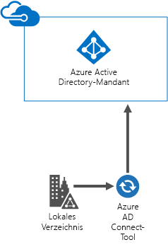
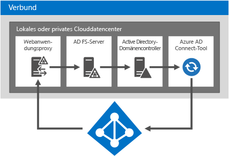
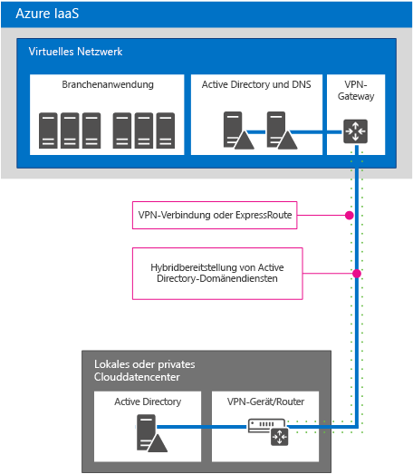
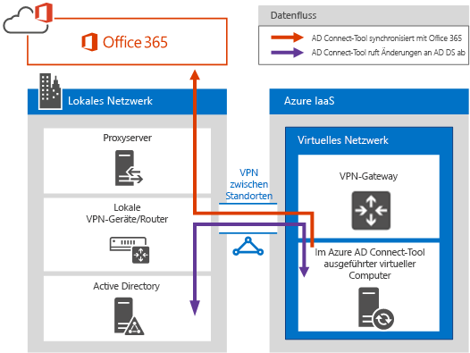
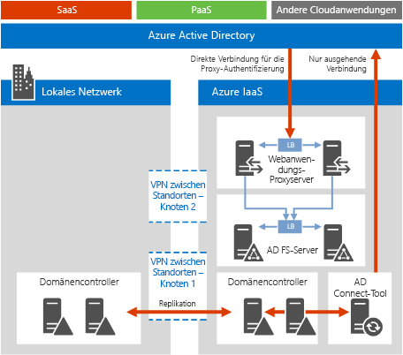

# Microsoft-Cloud-Identität für Enterprise-ArchitektenMicrosoft Cloud Identity for Enterprise Architects

 **Zusammenfassung:** Entwerfen Sie Ihre Identitätslösung für Microsoft Cloud-Dienste und -Plattformen.**Summary:** Design your identity solution for Microsoft cloud services and platforms.
  
Dieser Artikel beschreibt, was IT-Architekten über das Entwerfen der Identität für Organisationen wissen müssen, die Microsoft Cloud-Dienste und -Plattformen verwenden. Sie können diesen Artikel auch als fünfseitiges Poster anzeigen und im Tabloid-Format (auch bekannt als Ledger, 11 x 17 oder A3) drucken.This article describes what IT architects need to know about designing identity for organizations using Microsoft cloud services and platforms. You can also view this article as a 5-page poster and print it in tabloid format (also known as ledger, 11 x 17, or A3).
  

  
[PDF](https://go.microsoft.com/fwlink/p/?LinkId=524586) | [Visio](https://download.microsoft.com/download/2/3/8/238228E6-9017-4F6C-BD3C-5559E6708F82/MSFT_cloud_architecture_identity.vsd) | [Weitere Sprachen](https://www.microsoft.com/download/details.aspx?id=54431)[PDF](https://go.microsoft.com/fwlink/p/?LinkId=524586) | [Visio](https://download.microsoft.com/download/2/3/8/238228E6-9017-4F6C-BD3C-5559E6708F82/MSFT_cloud_architecture_identity.vsd) | [More languages](https://www.microsoft.com/download/details.aspx?id=54431)
  
Sie sehen auch alle Modelle der [Ressourcen zur Cloud-IT-Architektur von Microsoft](microsoft-cloud-it-architecture-resources.md) und können[Microsoft Enterprise Cloud Roadmap: Resources for IT Decision Makers](https://aka.ms/cloudarchitecture) durchsuchen.You can also see all of the models in the [Microsoft Cloud IT architecture resources](microsoft-cloud-it-architecture-resources.md) and swipe through [Microsoft's Enterprise Cloud Roadmap: Resources for IT Decision Makers](https://aka.ms/cloudarchitecture).
  
> [!NOTE]
> Dieser Artikel spiegelt die Version vom Januar 2016 des Posters **Microsoft-Cloud-Identität für Enterprise-Architekten** wider. Er enthält nicht die Änderungen für die Posterversion vom April 2016 oder spätere Versionen des Posters.This article reflects the January 2016 version of the **Microsoft cloud identity for enterprise architects** poster. It does not contain the changes for the April 2016 or later versions of the poster.
  
## Entwerfen von Identität für die Microsoft-CloudDesigning identity for the Microsoft cloud

Durch das Integrieren von Identitäten in die Microsoft-Cloud erhalten Sie Zugriff auf eine Vielzahl von Diensten und Cloud-Plattformoptionen. Es gibt zwei Hauptoptionen:Integrating your identities with the Microsoft cloud provides access to a broad range of services and cloud platform options. There are two main options:
  
- Sie können in Microsoft Azure Active Directory (AD) integrieren. Dies umfasst das Synchronisieren Ihrer lokalen Konten mit Azure AD, der Identitätsanbieter für die Microsoft-Cloud.You can integrate with Microsoft Azure Active Directory (AD). This involves synchronizing your on-premises accounts to Azure AD, the identity provider for the Microsoft cloud.
    
- Sie können Ihre lokale Active Directory Domain Services (AD DS)-Umgebung auf virtuelle Computer erweitern, die unter Microsoft Azure-Infrastrukturdiensten ausgeführt werden.You can extend your on-premises Active Directory Domain Services (AD DS) environment to virtual machines running in Microsoft Azure infrastructure services.
    

  
 **Abbildung 1: Optionen beim Entwerfen von Identitäten in der Cloud****Figure 1: Options for designing your identities in the cloud**
  
Abbildung 1 zeigt Azure AD als Identitätsanbieter für Microsoft SaaS-Dienste (Software as a Service) und Azure PaaS-Anwendungen (Platform as a Service) und wie Geschäftsanwendungen lokale AD DS verwenden können.Figure 1 shows how Azure AD is the identity provider for Microsoft Software as a Service (SaaS) services and Azure Platform as a Service (PaaS) applications and how line-of-business applications can use on-premises AD DS. 
  
### Azure Active DirectoryAzure Active Directory

Microsoft Azure AD ist der in der Cloud gehostete Identitäts- und Zugriffsverwaltungsdienst von Microsoft. Es befindet sich im Zentrum der Microsoft-Cloud-Dienste und -Plattformen. Das Integrieren in Azure AD ermöglicht den Zugriff auf alle Microsoft SaaS-Dienste mit Ihrem aktuellen Benutzerkonten und Kennwörtern. Diese Integration stellt außerdem eine Cloud-basierte Identität für Azure PaaS-Anwendungen bereit.Microsoft Azure AD is the Microsoft cloud-hosted identity and access management service. It's at the center of Microsoft cloud services and platforms. Integrating with Azure AD provides access to all of the Microsoft SaaS services using your current set of accounts and passwords. That integration also provides cloud-based identity for Azure PaaS applications. 
  
> [!NOTE]
> Azure AD ist kein Ersatz für lokale AD DS für große Organisationen oder für Windows-basierte virtuelle Computer, die unter Azure-IaaS (Infrastructure as a Service) ausgeführt werden.Azure AD does not replace the need for AD DS on-premises for enterprise organizations or for Windows -based virtual machines running in Azure Infrastructure as a Service (IaaS). 
  
Es gibt drei Azure AD-Editionen: Kostenlos, Basic und Premium.There are three editions of Azure AD: Free, Basic, and Premium. 
  
||||
|:-----|:-----|:-----|
|**Kostenlos****Free**   |**Basic****Basic**   |**Premium****Premium**   |
| Verwalten von BenutzerkontenManage user accounts    Synchronisieren mit lokalen VerzeichnissenSynchronize with on-premises directories    Einmaliges Anmelden in Azure, Office 365 und Tausenden von anderen gängigen SaaS-Anwendungen, z. B. Salesforce, Workday, Concur, DocuSign, Google Apps, Box, ServiceNow, Dropbox und mehrSingle sign-on across Azure, Office 365, and thousands of other popular SaaS applications, such as Salesforce, Workday, Concur, DocuSign, Google Apps, Box, ServiceNow, Dropbox, and more   | Enthält alle Features der kostenlosen Edition plus:Includes all of the abilities in the Free edition, plus:    UnternehmensbrandingCompany branding    Gruppenbasierter AnwendungszugriffGroup-based application access    Zurücksetzen von Kennwörtern durch den BenutzerSelf-service password reset    Unternehmens-SLA von 99,9 %Enterprise SLA of 99.9%   | Enthält alle Features der kostenlosen und der Basic-Edition plus:Includes all of the features of the Free and Basic editions, plus:    Gruppenverwaltung durch den BenutzerSelf-service group management    	Erweiterte Sicherheitsberichte und WarnungenAdvanced security reports and alerts    	Mehrstufige AuthentifizierungMulti-factor authentication    Zurücksetzen von Kennwörtern mit Write-Back in lokale AD DSPassword reset with write-back to on-premises AD DS    Bidirektionale Synchronisierung mit dem Azure AD Connect-Tool Azure AD Connect tool bidirectional synchronization    Azure AD-AnwendungsproxyAzure AD Application Proxy    	Microsoft Forefront Identity Manager (MIM)Microsoft Forefront Identity Manager (MIM)   |
   
Weitere Informationen zu Versionen finden Sie unter [Azure Active Directory-Editionen](https://go.microsoft.com/fwlink/p/?LinkId=524280).For more information about versions, see [Azure Active Directory editions](https://go.microsoft.com/fwlink/p/?LinkId=524280).
  
### Option 1: Integration in Azure Active DirectoryOption 1: Integrate with Azure Active Directory

Die meisten Organisationen synchronisieren einen Standardsatz aus Objekten und Attributen mit ihrem Azure AD-Mandanten. Das Azure AD Connect-Tool synchronisiert Ihre Konten zwischen den lokalen AD DS und einem Azure AD-Mandanten.Most organizations synchronize a standard set of objects and attributes to their Azure AD tenant. The Azure AD Connect tool synchronizes your accounts between on-premises AD DS and an Azure AD tenant.
  

  
 **Abbildung 2: Integrieren in Azure AD****Figure 2: Integrating with Azure AD**
  
Abbildung 2 zeigt, wie das Azure AD Connect-Tool AD DS-Änderungen abruft und an Ihren Azure AD-Mandanten sendet. In diesem Fall ist Ihr Azure AD-Mandant ein in der Cloud gehostetes Duplikat unverzichtbarer Inhalte aus dem lokalen Verzeichnis.Figure 2 shows how the Azure AD Connect tool obtains AD DS changes and sends them to your Azure AD tenant. In this case, your Azure AD tenant is a cloud-hosted duplicate of essential on-premises directory content.
  
Viele Organisationen verwenden AD DS als lokalen Identitätsanbieter. Sie können lokal einen anderen Typ von Identitätsanbieter (z. B. einen, der LDAP verwendet) verwenden und diesen mit Azure AD synchronisieren.Many organizations use AD DS as their on-premises identity provider. You can use a different type of identity provider on-premises (such as one that uses LDAP), and synchronize these to Azure AD.
  
### Option 2: Erweitern von AD DS auf AzureOption 2: Extend AD DS to Azure

Das Erweitern von AD DS auf virtuelle Computer, auf denen Azure-Infrastrukturdienste ausgeführt werden, unterstützt andere Lösungen und Anwendungen als die Synchronisierung mit Azure AD. Es folgen zwei:Extending AD DS to virtual machines running in Azure infrastructure services supports a different set of solutions and applications compared to synchronization with Azure AD. Here are two:
  
- Unterstützt die Cloud-basierten Lösungen, die die NTLM- oder Kerberos-Authentifizierung oder virtuelle Computer in der AD DS-Domäne erfordern.Supports cloud-based solutions that require NTLM or Kerberos authentication, or AD DS domain-joined virtual machines.
    
- Fügt weiteres Integrationspotenzial für Cloud-Dienste und -Anwendungen für Microsoft Cloud-Dienste und -Plattformen hinzu.Adds additional integration potential for cloud services and applications across Microsoft cloud services and platforms.
    

  
 **Abbildung 3: Erweitern von AD DS auf Azure****Figure 3: Extending AD DS to Azure**
  
Abbildung 3 zeigt einen AD DS-Domänencontroller, der mit einem virtuellen Azure-Netzwerk über ein lokales VPN-Gerät und ein Azure VPN-Gateway verbunden ist. Das virtuelle Azure-Netzwerk enthält Server für eine LOB-Anwendung und eigene AD DS-Domänencontroller.Figure 3 shows an AD DS domain controller connected to an Azure virtual network through an on-premises VPN device and an Azure VPN gateway. The Azure virtual network contains servers for a line-of-business application and its own set of AD DS domain controllers.
  
### Weitere InformationenMore Information

- [Das Synchronisieren Ihres Verzeichnisses mit Office 365 ist ein KinderspielSynchronizing your directory with Office 365 is easy](https://go.microsoft.com/fwlink/p/?LinkId=524281)
    
- [Infografik: Cloud-Identitäts- und ZugriffsverwaltungInfographic: Cloud identity and access management](https://go.microsoft.com/fwlink/p/?LinkId=524282)
    
- [Azure Active DirectoryAzure Active Directory](https://go.microsoft.com/fwlink/p/?LinkId=524283)
    
## Integrieren der lokalen AD DS-Konten in Microsoft Azure ADIntegrate your on-premises AD DS accounts with Microsoft Azure AD

Durch die Synchronisierung Ihrer lokalen AD DS-Konten mit Azure AD können Ihre Benutzer ihre lokalen AD DS-Konten für den Zugriff auf Folgendes verwenden:By synchronizing your on-premises AD DS accounts with Azure AD, your users can use their on-premises AD DS accounts to access:
  
- Alle Microsoft-SaaS-Dienste (Office 365, Microsoft Intune und Dynamics CRM Online)All of the Microsoft SaaS services (Office 365, Microsoft Intune, and Dynamics CRM Online)
    
- Die in Azure PaaS ausgeführten AnwendungenYour applications running in Azure PaaS
    
Es gibt zwei Möglichkeiten zum Konfigurieren dieser Integration:There are two ways to configure this integration:
  
- Verzeichnis- und KennwortsynchronisierungDirectory and password synchronization
    
- Verbund und einmaliges AnmeldenFederation and single sign-on
    
Beginnen Sie mit der einfachsten Option, die Ihren Anforderungen entspricht. Sie können bei Bedarf zwischen diesen Optionen wechseln.Start with the simplest option that meets your needs. You can switch between these options, if needed.
  
> [!NOTE]
> Das Verwenden von Nur-Cloud-Konten (ohne Integration in die lokalen AD DS) wird für große Organisationen nicht empfohlen.Using cloud-only accounts (not integrating with your on-premises AD DS) is not recommended for enterprise-scale organizations. 
  
### Verzeichnis- und KennwortsynchronisierungDirectory and password synchronization

Dies ist die einfachste Option und erfordert nur einen Server, der das Azure AD Connect-Tool ausführt.This is the simplest option and requires only a server running the Azure AD Connect tool. 
  

  
 **Abbildung 4: Konfiguration für die Verzeichnis- und Kennwortsynchronisierung****Figure 4: Directory and password synchronization configuration**
  
Abbildung 4 zeigt ein lokales oder privates Cloud-Rechenzentrum mit einem AD DS-Domänencontroller. Ein Server, auf dem das Azure AD Connect-Tool ausgeführt wird, synchronisiert die Liste der Kontonamen mit Azure AD.Figure 4 shows an on-premises or private cloud datacenter with an AD DS domain controller. A server running the Azure AD Connect tool synchronizes the list of account names with Azure AD.
  
Mit dieser Option geschieht Folgendes:With this option:
  
- Benutzerkonten werden von Ihren lokalen AD DS (oder einem anderen Identitätsanbieter) mit Ihrem Azure AD-Mandanten synchronisiert. Das lokale Verzeichnis bleibt die maßgebliche Quelle für Konten, und Sie verwalten alle Kontoänderungen von dort aus.User accounts are synchronized from your on-premises AD DS (or other identity provider) to your Azure AD tenant. The on-premises directory remains the authoritative source for accounts and you manage all account changes from there.
    
- Azure AD führt alle Authentifizierungen für Microsoft SaaS-basierte Dienste und Azure PaaS-Anwendungen aus.Azure AD performs all authentication for Microsoft SaaS-based services and Azure PaaS applications.
    
- Sie können auch die Synchronisierung für mehrere AD DS-Gesamtstrukturen konfigurieren.You can also configure synchronization for multiple AD DS forests.
    
Mit Kennwortsynchronisierung:With password synchronization:
  
- Benutzer werden aufgefordert, ein Kennwort einzugeben, wenn sie auf Cloud-Dienste zugreifen. Dabei handelt es sich um dasselbe Kennwort, das sie für lokale Ressourcen verwenden.Users are prompted to enter a password when accessing cloud services, which is the same password that they use for on-premises resources.
    
- Benutzerkennwörter werden nie als Klartext an Azure AD gesendet. Stattdessen wird ein Hash des Kennworts verwendet. Der Kennworthash kann kryptografisch nicht entschlüsselt oder durch Reverse Engineering zurückentwickelt werden, um das Klartextkennwort zu erhalten.User passwords are never sent as cleartext to Azure AD. Instead, a hash of the password is used. It is cryptographically impossible to decrypt or reverse-engineer the password hash and obtain the cleartext password. 
    
Mit mehrstufiger Authentifizierung (Multi-Factor Authentication, MFA):With multi-factor authentication (MFA):
  
- Sie können die mit Office 365 angeboten grundlegenden MFA-Features nutzen.You can take advantage of basic MFA features offered with Office 365.
    
- Azure PaaS-Anwendungsentwickler können den Azure-Dienst für die mehrstufige Authentifizierung nutzen.Azure PaaS application developers can take advantage of the Azure Multi-Factor Authentication service.
    
Verzeichnissynchronisation bietet keine Integration in lokale MFA-Lösungen.Directory synchronization does not provide integration with on-premises MFA solutions.
  
### Verbund und einmaliges AnmeldenFederation and single sign-on

Diese Option erfordert zusätzliche Server und Infrastruktur.This option requires additional servers and infrastructure. 
  

  
 **Abbildung 5: Erforderliche Server für die Verbundauthentifzierung****Figure 5: Servers needed for federated authentication**
  
Abbildung 5 zeigt die Komponenten für die Verbundauthentifizierung. Azure AD kontaktiert einen Webanwendungsproxy, der die Authentifizierungsanforderung an einen AD FS-Server (Active Directory Federation Services) weiterleitet, der die Anforderung zur Auswertung und Antwort an einen AD DS-Domänencontroller weiterleitet. Ein Server, auf dem das Azure AD Connect-Tool ausgeführt wird, synchronisiert die Liste der Kontonamen aus AD DS mit Azure AD.Figure 5 shows the set of components for federated authentication. Azure AD contacts a web application proxy, which forwards the authentication request to an Active Directory Federation Services (AD FS) server, which forwards the request to an AD DS domain controller for evaluation and response. A server running the Azure AD Connect tool synchronizes the list of account names from AD DS to Azure AD.
  
Der Verbund stellt diese zusätzlichen Unternehmensfunktionen bereit:Federation provides these additional enterprise capabilities:
  
- Alle Authentifizierungsanfragen, die an Azure AD gesendet werden, werden an den lokalen Identitätsanbieter über AD FS weitergeleitet und dort ausgeführt.All authentication requests sent to Azure AD are forwarded to and performed against the on-premises identity provider through AD FS.
    
- Funktioniert mit Microsoft-fremden Identitätsanbietern.Works with non-Microsoft identity providers.
    
- Die Synchronisierung von Kennworthashes kann als Anmeldungssicherung für die Verbundanmeldung fungieren (z. B. wenn die Verbundauthentifizierung fehlschlägt).Password hash synchronization can act as a sign-in backup for federated sign-in (for example, if the federated authentication fails).
    
Verwenden Sie den Verbund in folgenden Fällen:Use federation if:
  
- Einmaliges Anmelden ist erforderlich. Mit dem einmaligen Anmelden werden Benutzer nicht aufgefordert, beim Zugriff auf einen Cloud-Dienst Anmeldeinformationen (Benutzername oder Kennwort) einzugeben.Single sign-on is required. With single sign-on, users are not prompted to enter any credentials (user name or password), when accessing a cloud service.
    
- AD FS wurde bereits bereitgestellt.AD FS is already deployed.
    
- Sie verwenden einen Identitätsdrittanbieter.You use a third-party identity provider.
    
- Sie verwenden Forefront Identity Manager 2010 R2 (bietet keine Unterstützung für die Synchronisierung von Kennworthashes).You use Forefront Identity Manager 2010 R2 (does not support password hash synchronization).
    
- Sie haben eine integrierte lokale Smartcard oder eine andere MFA-Lösung.You have an on-premises integrated smart card or other MFA solution.
    
- Sie benötigen Anmeldungsüberwachung und/oder Deaktivierung von Konten.You require sign-in audit and/or disablement of accounts.
    
- Ihre Organisation benötigt Clientanmeldeeinschränkungen basierend auf Netzwerkspeicherort oder Arbeitsstunden.Your organization requires client sign-in restrictions by network location or work hours.
    
- Sie müssen die Federal Information Processing Standards (FIPS) einhalten.You must comply with Federal Information Processing Standards (FIPS).
    
Die Verbundauthentifizierung erfordert eine größere Investition in die lokale Infrastruktur.Federated authentication requires a greater investment in infrastructure on-premises.
  
- Der Internetzugriff auf die lokalen Servern über eine Unternehmensfirewall muss möglich sein. Microsoft empfiehlt die Verwendung von Web Application Proxy-Servern, die in Ihrer Netzwerkumgebung bereitgestellt werden.The on-premises servers must be Internet-accessible through a corporate firewall. Microsoft recommends the use of Web Application Proxy servers deployed in your perimeter network.
    
- Erfordert Hardware, Lizenzen und Betrieb für AD FS-Server, AD FS-Proxy- oder Web Application Proxy-Server, Firewalls und Lastenausgleich.Requires hardware, licenses, and operations for AD FS servers, AD FS proxy or Web Application Proxy servers, firewalls, and load balancers. 
    
- Verfügbarkeit und Leistung sind wichtig, um sicherzustellen, dass Benutzer auf Office 365 und andere Cloud-Anwendungen zugreifen können.Availability and performance are important to ensure users can access Office 365 and other cloud applications.
    
### Weitere InformationenMore Information

- [Das Synchronisieren Ihres Verzeichnisses mit Office 365 ist ein KinderspielSynchronizing your directory with Office 365 is easy](https://go.microsoft.com/fwlink/p/?LinkId=524281)
    
- [Vorbereiten der Bereitstellung von Benutzern über die Verzeichnissynchronisierung in Office 365Prepare to provision users through directory synchronization to Office 365](https://go.microsoft.com/fwlink/p/?LinkId=524284)
    
- [Mehrstufige Authentifizierung für Office 365Multi-Factor Authentication for Office 365](https://go.microsoft.com/fwlink/p/?LinkID=392012)
    
- [Mehrstufige Azure-AuthentifizierungAzure Multi-Factor Authentication](https://go.microsoft.com/fwlink/p/?LinkId=524285)
    
- [TechEd 2014: Verzeichnisintegration: Erstellen eines Verzeichnis mit Active Directory und Azure Active DirectoryTechEd 2014: Directory Integration: Creating One Directory with Active Directory and Azure Active Directory](https://go.microsoft.com/fwlink/p/?LinkId=524286)
    
## Erweitern von AD DS auf AzureExtend AD DS to Azure

Das Erweitern von AD DS auf Azure ist der erste Schritt zur Unterstützung der LOB-Anwendungen, die auf virtuellen Computern in Azure-Infrastrukturdiensten ausgeführt werden, und stellt Folgendes bereit:Extending AD DS to Azure is the first step to support line-of-business applications running on virtual machines in Azure infrastructure services, which provides:
  
- Unterstützung für Cloud-basierte Lösungen, die die NTLM- oder Kerberos-Authentifizierung oder virtuelle Computer in der AD DS-Domäne erfordern.Support for cloud-based solutions that require NTLM or Kerberos authentication, or AD DS domain-joined virtual machines.
    
- Zusätzliches Integrationspotenzial für Cloud-Dienste und -Anwendungen. Kann jederzeit hinzugefügt werden.Additional integration potential for cloud services and applications and can be added at any time.
    

  
 **Abbildung 6: Erweitern von AD DS auf ein virtuelles Azure-Netzwerk****Figure 6: Extending AD DS to an Azure virtual network**
  
Abbildung 6 zeigt ein lokales oder privates Cloud-Rechenzentrum, bei dem AD DS mit einem virtuellen Azure-Netzwerk über eine Site-to-Site-VPN oder ExpressRoute-Verbindung verbunden ist. Das virtuelle Azure-Netzwerk enthält Server für eine LOB-Anwendung und eigene AD DS-Domänencontroller. Diese Konfiguration ist eine Hybridbereitstellung aus lokalen AD DS und Azure-Infrastrukturdiensten. Sie erfordert Folgendes:Figure 6 shows an on-premises or private cloud datacenter with AD DS connected to an Azure virtual network with a site-to-site VPN or ExpressRoute connection. The Azure virtual network contains servers for a line-of-business application and its own set of AD DS domain controllers. This configuration is a hybrid deployment of AD DS on-premises and in Azure infrastructure services. It requires:
  
- ein virtuelles Azure-Netzwerk.An Azure virtual network.
    
- Eine Verbindung zwischen einem VPN-Gerät oder -Router und einem Azure VPN-Gateway.A connection between an on-premises virtual private network (VPN) device or router and an Azure VPN gateway.
    
- Das Verwenden eines Teils Ihres lokalen IP-Adressraums für die virtuellen Computer im virtuellen Netzwerk.Using a portion of your on-premises IP address space for the virtual machines in the virtual network.
    
- Das Bereitstellen von mindestens einem Domänencontroller im virtuellen Netzwerk, der als Server für den globalen Katalog dient (verringert den ausgehenden Datenverkehr über die VPN-Verbindung).Deploying one or more domain controllers in the virtual network designated as global catalog servers (reduces egress traffic across the VPN connection).
    
Diese Identitätsarchitektur unterstützt eine andere Gruppe von Lösungen und Abwendungen im Vergleich zur Synchronisierung mit Azure AD.This identity architecture supports a different set of solutions and applications compared to synchronization with Azure AD.
  
### Optionen für die lokale Verbindung zu AzureOn-premises to Azure connection options

Um Ihr lokales Netzwerk mit einem virtuellen Azure-Netzwerk zu verbinden, können Sie Folgendes verwenden:To connect your on-premises network to an Azure virtual network, you can use:
  
- Eine Site-to-Site-VPN-Verbindung, die 1 bis 10 Sites (einschließlich anderer virtueller Azure-Netzwerke) mit einem einzelnen virtuellen Azure-Netzwerk verbinden kann.A site-to-site VPN connection, which can connect 1-10 sites (including other Azure virtual networks) to a single Azure virtual network.
    
- ExpressRoute, eine private, sichere WAN-Verbindung zu Azure über ein Partnernetzwerk und einen Rechenzentrums-Dienstanbieter. ExpressRoute-Verbindungen können verbesserte Zuverlässigkeit, höhere Bandbreite und geringere Latenzen bieten.ExpressRoute, a private, secure WAN link to Azure through a partner network and datacenter services provider. ExpressRoute connections can offer increased reliability, higher bandwidth, and lower latencies.
    
### Weitere InformationenMore Information

- [Standortübergreifende Konnektivität für virtuelle NetzwerkeCross-premises connectivity for virtual networks](https://go.microsoft.com/fwlink/p/?LinkId=524293)
    
- [ExpressRoute - Technische ÜbersichtExpressRoute Technical Overview](https://go.microsoft.com/fwlink/?LinkID=392081)
    
- [Richtlinien für die Bereitstellung von Windows Server Active Directory auf virtuellen Computern in AzureGuidelines for Deploying Windows Server Active Directory on Azure Virtual Machines](https://go.microsoft.com/fwlink/p/?LinkId=524295)
    
## Integrieren von Anwendungen in Cloud-IdentitätenIntegrate your applications with cloud identities

Beim Entwerfen und Entwickeln von Anwendungen, die in der Cloud ausgeführt werden, sollten Sie auf die Konsistenz der Benutzererfahrung für den Authentifizierungsprozess achten, einschließlich den erforderlichen Anmeldeinformationen. Wenn Sie z. B. Windows-Anmeldeinformationen für Azure AD oder erweiterte AD DS verwenden, stellen Sie sicher, dass sich Benutzer schnell authentifizieren und auf ihre Aufgaben konzentrieren können.When designing and developing applications that run in the cloud, you should aim for consistency of the user experience for the authentication process, including the set of required credentials. For example, when using Windows credentials, whether against Azure AD or an extended AD DS, ensure that users can quickly authenticate and focus on their tasks.
  

  
 **Abbildung 7: Integrieren von Anwendungen in Cloud-Identitäten****Figure 7: Integrate your applications with cloud identities**
  
Abbildung 7 zeigt drei Optionen für die Integration Ihrer Anwendung in Cloud-Identitäten.Figure 7 shows three options for integrating your application with cloud identities.
  
1. Registrieren Sie Ihre in der Cloud gehosteten Anwendungen bei Azure AD.Register your cloud-hosted applications with Azure AD.
    
    Informationen finden Sie im MSDN-Artikel [Integrieren von Anwendungen in Azure Active Directory](https://go.microsoft.com/fwlink/p/?LinkId=524303). Auf diese Weise können Sie Azure AD zum Authentifizieren des Zugriffs auf Ihre PaaS-Anwendung verwenden und es Benutzern oder Administratoren ermöglichen, Rechte für den Zugriff auf Anwendungsinhalte von anderen Cloud-Diensten aus, z. B. Office 365, zu gewähren. Weitere Details und Codebeispiele finden Sie im MSDN-Artikel [Authentifizierungsszenarien für Azure Active Directory](https://go.microsoft.com/fwlink/p/?LinkId=524304).See the MSDN article [Integrating Applications with Azure Active Directory](https://go.microsoft.com/fwlink/p/?LinkId=524303). This lets you use Azure AD to authenticate access to your PaaS application, as well as allowing users or administrators to grant rights to your application to access content on their behalf from other cloud services, such as Office 365. More details and code samples can be found in the MSDN article [Authentication Scenarios for Azure Active Directory](https://go.microsoft.com/fwlink/p/?LinkId=524304). 
    
2. Anwendungen, die eine programmgesteuerte Authentifizierung für den Zugriff auf eine Anwendung benötigen, die durch AD SD, AD FS unter Windows Server 2012 R2 oder Azure AD gesichert ist, können Folgendes verwenden:Applications that require programmatic authentication to gain access to an application secured by AD SD, AD FS on Windows Server 2012 R2, or Azure AD can use:
    
  - Die [Azure AD-Diagramm-API](https://go.microsoft.com/fwlink/p/?LinkId=524305)The [Azure AD Graph API](https://go.microsoft.com/fwlink/p/?LinkId=524305)
    
  - [Active Directory-Authentifizierungsbibliothek (ADAL)Active Directory Authentication Library (ADAL)](https://go.microsoft.com/fwlink/p/?LinkID=524297)
    
    Die Azure AD-Diagramm-API unterstützt OAuth und OpenID Connect. Sie funktioniert auch mit PaaS-Anwendungen.The Azure AD Graph API supports OAuth and OpenID Connect. It also works with PaaS applications.
    
3. Konfigurieren Sie lokale Anwendungen oder LOB-Anwendungen, die auf virtuellen Computern in einem virtuellen Azure-Netzwerk ausgeführt werden, für die direkte Verwendung der Windows-Authentifizierung (NTLM oder Kerberos). Dies bietet die beste Lösung für Benutzer und erfordert den geringsten Konfigurationsaufwand für Serveranwendungsentwickler.Configure on-premises applications or line-of-business applications running on virtual machines in an Azure virtual network to use Windows authentication (NTLM or Kerberos) directly. This is the best experience for users and requires the least configuration for server application developers.
    
### Beispiel für die AnwendungsintegrationApplication integration example

Eine Organisation erstellt eine ASP.NET-Anwendung, die einen REST-Endpunkt bereitstellt, von dem andere Anwendungen die neuesten Vertriebsdaten abrufen können. Der Zugriff auf diesen REST-Endpunkt wird mit Azure AD gesichert. Anwendungen müssen Anmeldeinformationen bereitstellen, die von Azure AD authentifiziert werden können, bevor die ASP.NET-Anwendung die angeforderten Daten sendet. Andere Entwickler in der Organisation können ihre eigenen Anwendungen schreiben, in denen die Vertriebsdaten aus dem REST-Endpunkt verwendet werden.An organization builds an ASP.NET application that exposes a REST endpoint where other applications can obtain the latest sales data. Access to that REST endpoint is secured with Azure AD. Applications must provide credentials that can be authenticated by Azure AD before the ASP.NET application sends the requested data. Other developers in the organization can then write their own applications that use the sales data from the REST endpoint.
  
Zum Authentifizieren bei Azure AD und zum Abrufen von Daten verwaltet ADAL den Benutzerauthentifizierungsprozess und übergibt das Zugriffstoken an die Anwendung, sodass es für den Zugriff auf die Vertriebsdaten verwendet werden kann. ADAL entfernt einen großen Teil der Komplexität des Abrufens und Analysierens von Token, OAuth-Abläufen und anderen Elementen. ADAL ist eine weitere Technologielösung, die sich schnell verändert, sodass Entwickler die aktuelle Version auf NuGet suchen sollten.To authenticate to Azure AD and retrieve data, ADAL manages the user authentication process and hands the access token off to the application so it can be used to gain access to the sales data. ADAL abstracts out much of the complexity of obtaining and parsing tokens, OAuth flows, and other elements. ADAL is another technology solution that is rapidly changing so developers should look for the latest version on NuGet.
  
## Bereitstellen von Verzeichniskomponenten in AzureDeploying directory components in Azure

Sie können Verzeichniskomponenten, z. B. Server für die Synchronisierung von Kennwörtern oder Verbundauthentifizierung, in einem virtuellen Azure-Netzwerk statt in einem lokalen Rechenzentrum bereitstellen. Bedenken Sie die Vorteile, insbesondere, wenn Sie planen, AD DS auf Azure zu erweitern.You can deploy directory components, such as servers for password synchronization or federated authentication, in an Azure virtual network rather than an on-premises datacenter. Consider its benefits, especially if you plan to extend AD DS into Azure.
  
Es folgen die Verzeichniskomponenten, die in einem virtuellen Azure-Netzwerk eingesetzt werden können:Here are the directory components that can be put in an Azure virtual network:
  
- Azure AD Connect-ToolAzure AD Connect tool
    
- Komponenten der VerbundauthentifizierungFederated authentication components
    
- Eine eigenständige AD DS-UmgebungA standalone AD DS environment
    
### AD Connect-ToolAD Connect tool

Das Azure AD Connect-Tool kann in der Cloud in einem virtuellen Azure-Netzwerk gehostet werden. Bedenken Sie diese Vorteile der Bereitstellung dieser Arbeitslast in Azure:The Azure AD Connect tool can be hosted in the cloud on an Azure virtual network. Consider these benefits of deploying this workload to Azure:
  
- Potenziell schnellere Bereitstellung und niedrigere BetriebskostenPotentially faster provisioning and lower cost of operations
    
- Erhöhte VerfügbarkeitIncreased availability
    

  
 **Abbildung 8: Das AD Connect-Tool unter Azure****Figure 8: The AD Connect tool running in Azure**
  
Abbildung 8 zeigt das AD Connect-Tool, das auf einem virtuellen Computer in einem virtuellen Azure-Netzwerk ausgeführt wird und einen lokalen AD DS-Domänencontroller nach Kontoänderungen abfragt und diese Änderungen dann an Office 365 sendet. Diese Lösung funktioniert mit:Figure 8 shows the AD Connect tool running on a virtual machine in an Azure virtual network, which queries an on-premises AD DS domain controller for account changes and then sends those changes to Office 365. This solution works with:
  
- Office 365-Diensten.Office 365 services.
    
- Azure PaaS-Anwendungen, die über das Internet verfügbar sind.Azure PaaS applications that are available over the Internet.
    
- LOB-Anwendungen in Azure, die von lokalen Umgebungen aus über die Site-to-Site-VPN- oder ExpressRoute-Verbindung verfügbar sind.Line-of-business applications in Azure that are available from on-premises environments through the site-to-site VPN or ExpressRoute connection.
    
Weitere Informationen finden Sie unter [Integrieren Ihrer lokalen Identitäten in Azure Active Directory](https://go.microsoft.com/fwlink/p/?LinkId=524307).For more information, see [Integrating your on-premises identities with Azure Active Directory](https://go.microsoft.com/fwlink/p/?LinkId=524307).
  
### Infrastruktur der VerbundauthentifizierungFederated authentication infrastructure

Wenn Sie AD FS noch nicht lokal bereitgestellt haben, sollten Sie diese Vorteile der Bereitstellung dieser Arbeitsbelastung in Azure bedenken:If you haven't already deployed AD FS on-premises, consider these benefits of deploying this workload to Azure:
  
- Bietet Autonomie für die Authentifizierung bei Cloud-Diensten (keine lokalen Abhängigkeiten)Provides autonomy for authentication to cloud services (no on-premises dependencies)
    
- Reduziert Server und Tools, die lokal gehostet werdenReduces servers and tools hosted on-premises
    
- Verwendet ein Site-to-Site-VPN-Gateway auf einem Failovercluster mit zwei Knoten für die Verbindung mit Azure (neu)Uses a site-to-site VPN gateway on a two-node failover cluster to connect to Azure (new)
    
- Verwendet ACLs, um sicherzustellen, dass Web Application Proxy-Server nur mit AD FS, nicht direkt mit Domänencontrollern oder anderen Servern kommunizieren könnenUses ACLs to ensure that Web Application Proxy servers can only communicate with AD FS, not domain controllers or other servers directly
    

  
 **Abbildung 9: Bereitstellen einer Infrastruktur für die Verbundauthentifizierung in Azure****Figure 9: Deploying your federated authentication infrastructure in Azure**
  
Abbildung 9 zeigt eine Reihe von lokalen Domänencontrollern, die AD DS-Informationen mit einer Reihe von Domänencontrollern in einem virtuellen Azure-Netzwerk replizieren. Das auf einem Server im virtuellen Azure-Netzwerk ausgeführte Azure AD Connect-Tool fragt den lokalen Domänencontroller nach Änderungen ab und sendet diese Änderungen an Azure AD. Eingehende Authentifizierungsanforderungen an Azure AD von Microsoft SaaS-Diensten, Azure PaaS-Anwendungen und anderen Cloud-Anwendungen werden an einen externen Lastenausgleich weitergeleitet, der die Anforderung an eine Gruppe von Web Application Proxy-Servern weiterleitet. Die Web Application Proxy-Server leiten die Anforderung an einen internen Lastenausgleich weiter, der die Anforderung an eine Gruppe von AD FS-Servern weiterleitet. Die AD FS-Server leiten dann die Anforderung an einen Domänencontroller weiter, um die gesendeten Anmeldeinformationen zu überprüfen.Figure 9 shows a set of on-premises domain controllers replicating AD DS information with a set of domain controllers in an Azure virtual network. The Azure AD Connect tool running on a server in the Azure virtual network queries the local domain controllers for changes and then sends those changes to Azure AD. Incoming authentication requests to Azure AD from Microsoft SaaS services, Azure PaaS applications, and other cloud applications are forwarded to an external load balancer, which forwards the request to a set of Web Application Proxy servers. The Web Application Proxy servers forward the request to an internal load balancer, which forwards the request to a set of AD FS servers. The AD FS servers then forward the request to a domain controller to validate the send credentials.
  
 Diese Lösung funktioniert mit:This solution works with:
  
- Programme, die Kerberos erfordernApplications that require Kerberos
    
- Alle Microsoft SaaS-DiensteAll of Microsoft's SaaS services
    
- Anwendungen in Azure, die Internetzugang habenApplications in Azure that are Internet-facing
    
- Anwendungen in Azure IaaS oder PaaS, die Authentifizierung mit einer Gruppe von Konten in den AD DS Ihrer Organisation erfordernApplications in Azure IaaS or PaaS that require authentication with the set of accounts in your organization's AD DS
    
Weitere Informationen finden Sie unter [Integrieren Ihrer lokalen Identitäten in Azure Active Directory](https://go.microsoft.com/fwlink/p/?LinkId=524307).For more information, see [Integrating your on-premises identities with Azure Active Directory](https://go.microsoft.com/fwlink/p/?LinkId=524307).
  
### Eigenständige AD DS-Umgebung in einem virtuellen Azure-NetzwerkStandalone AD DS environment in an Azure virtual network

Sie müssen eine Cloud-Anwendung nicht immer in Ihre lokale Umgebung integrieren. Eine eigenständige AD DS-Domäne in einem virtuellen Azure-Netzwerk unterstützt beispielsweise Anwendungen, die öffentlich zugänglich sind, z. B. Internetwebsites.You don't always need to integrate a cloud application with your on-premises environment. For example, a standalone AD DS domain in an Azure virtual network supports applications that are public-facing, such as Internet sites.
  

  
 **Abbildung 10: Eine eigenständige AD DS-Umgebung für eine serverbasierte Anwendung****Figure 10: A standalone AD DS environment for a server-based application**
  
Abbildung 10 zeigt ein virtuelles Azure-Netzwerk, das eine Reihe von AD DS-Servern hostet, die AD DS- und DNS-Dienste mit einer Reihe von Servern bereitstellt, die eine Anwendung hosten. Diese Lösung funktioniert mit:Figure 10 shows an Azure virtual network hosting a set of AD DS servers, providing both AD DS and DNS services, with a set of servers that host an application. This solution works with:
  
- Websites und Anwendungen, die das Internet nutzenInternet-facing web sites and applications
    
- Anwendungen, die NTLM- oder Kerberos-Authentifizierung erfordernApplications that require NTLM or Kerberos authentication
    
- Anwendungen, die auf Windows-basierten Servern, die AD DS erfordern, ausgeführt werdenApplications running on Windows-based servers that require AD DS
    
Weitere Informationen finden Sie unter [Integrieren Ihrer lokalen Identitäten in Azure Active Directory](https://go.microsoft.com/fwlink/p/?LinkId=524307).For more information, see [Integrating your on-premises identities with Azure Active Directory](https://go.microsoft.com/fwlink/p/?LinkId=524307).
  
## Weitere ArtikelSee Also

[Ressourcen zur Cloud-IT-Architektur von MicrosoftMicrosoft Cloud IT architecture resources](microsoft-cloud-it-architecture-resources.md)

[Enterprise-Cloud-Roadmap von Microsoft: Ressourcen für IT-EntscheidungsträgerMicrosoft's Enterprise Cloud Roadmap: Resources for IT Decision Makers](https://sway.com/FJ2xsyWtkJc2taRD)

