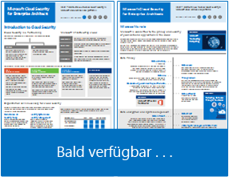
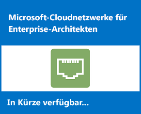
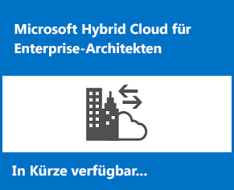
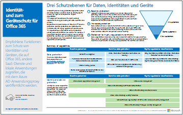

# Ressourcen zur Cloud-IT-Architektur von Microsoft

 **Zusammenfassung:** Erfahren Sie mehr über die Hauptkonzepte der Cloudarchitektur für Microsoft-Identitäts-, -Sicherheits-, -Netzwerk- und Hybridlösungen. Sehen Sie sich Empfehlungen zum Schützen von Dateien, Identitäten und Geräten bei Verwendung der Microsoft-Cloud an. Erfahren Sie, wie ein moderner und sicherer Desktop mit Windows 10 und Office ProPlus bereitgestellt wird.
  
In diesen Architekturtools- und -postern finden Sie Informationen zu Microsoft-Cloud-Diensten und -Plattformen wie Office 365, Windows 10, Azure Active Directory, Microsoft Intune, Microsoft Dynamics 365 sowie hybride lokale und Cloud-Lösungen. IT-Entscheidungsträger und Architekten können diese Ressourcen verwenden, um die optimalen Lösungen für ihre Arbeitsauslastungen zu bestimmen und Entscheidungen zu Kerninfrastrukturkomponenten wie Identität und Sicherheit zu treffen. 
  
<!---**[Microsoft's Enterprise Cloud Roadmap](microsoft-cloud-it-architecture-resources.md#roadmap)** (Sway) --->
    
- **[Ressourcen zu Microsoft Cloud für Enterprise-Architekten](microsoft-cloud-it-architecture-resources.md#cloudarch)** <!--- [Microsoft Cloud Services and Platform Options](microsoft-cloud-it-architecture-resources.md#platformoptions) --->
    - [Microsoft-Cloud-Identität für Enterprise-Architekten](microsoft-cloud-it-architecture-resources.md#identity)
    - [Microsoft-Cloud-Sicherheit für Enterprise-Architekten](microsoft-cloud-it-architecture-resources.md#security)
    - [Microsoft-Cloudnetzwerke für Enterprise-Architekten](microsoft-cloud-it-architecture-resources.md#networking)
    - [Microsoft Hybrid Cloud für Enterprise-Architekten](microsoft-cloud-it-architecture-resources.md#hybrid)
    - [Häufige Angriffe und Microsoft-Funktionen zum Schutz Ihrer Organisation](#common-attacks-and-microsoft-capabilities-that-protect-your-organization)
    
- **[Reihe: Office 365 Enterprise-Lösungen](microsoft-cloud-it-architecture-resources.md#BKMK_o365solutions)**: <!--- [Information Protection for Office 365](microsoft-cloud-it-architecture-resources.md#BKMK_infoprotect) --->
    - [Identität- und Geräteschutz für Office 365](microsoft-cloud-it-architecture-resources.md#BKMK_O365IDP)
    - [Lösungen zum Schutz von Dateien in Office 365](microsoft-cloud-it-architecture-resources.md#BKMK_O365fileprotect)
    - [Bereitstellen eines modernen und sicheren Desktops mit Microsoft](microsoft-cloud-it-architecture-resources.md#msd)
    

  
Geben Sie uns Feedback, indem Sie eine E-Mail an [cloudadopt@microsoft.com](mailto:cloudadopt@microsoft.com) senden. 

<!---

## Microsoft's Enterprise Cloud Roadmap

See the posters, icon sets, community venues, and other resources that describe the industry's most complete cloud solution.
  
|**Item**|**Description**|
|:-----|:-----|
|[          ](https://aka.ms/cloudarchitecture)   [Microsoft's Enterprise Cloud Roadmap](https://aka.ms/cloudarchitecture) (https://aka.ms/cloudarchitecture)   |Swipe through this Sway experience for the resources that describe the industry's most complete cloud solution.    |
--->
  

##Ressourcen zu Microsoft Cloud für Enterprise-Architekten

In diesen Postern zur Cloudarchitektur finden Sie Informationen zu Microsoft-Cloud-Diensten und -Plattformen wie Office 365, Azure Active Directory, Microsoft Intune, Microsoft Dynamics CRM Online sowie hybride lokale und Cloud-Lösungen. IT-Entscheidungsträger und Architekten können diese Ressourcen verwenden, um die optimalen Lösungen für ihre Arbeitsauslastungen zu bestimmen und Entscheidungen zu Kerninfrastrukturkomponenten wie Identität und Sicherheit zu treffen.

<!---  

### Microsoft Cloud Services and Platform Options

Learn key differences between Microsoft cloud services and platform offerings. Find the best fit for your solution.
  
|**Item**|**Description**|
|:-----|:-----|
|[          ](https://www.microsoft.com/download/details.aspx?id=54432)   [PDF](https://go.microsoft.com/fwlink/p/?LinkId=524731)  \| [Visio](https://go.microsoft.com/fwlink/p/?LinkId=524732)  \| [More languages](https://www.microsoft.com/download/details.aspx?id=54432)   | This model describes: <ul><li>  Software as a Service (SaaS) offerings, including Office 365 </li><li>  Platform as a Service (PaaS) features in Microsoft Azure </li><li>  Infrastructure as a Service (IaaS) features in Microsoft Azure </li><li>  Private cloud datacenter capabilities using Windows Server and System Center </li><li>  Learn how Microsoft's own IT department is migrating to these cloud services and building its hybrid cloud. </li></ul> |
--->

   

###Microsoft-Cloud-Identität für Enterprise-Architekten

Was IT-Architekten über das Entwerfen der Identität für Organisationen wissen müssen, die Microsoft-Cloud-Dienste und -Plattformen verwenden.
  
|**Element**|**Beschreibung**|
|:-----|:-----|
|[          ](https://www.microsoft.com/download/details.aspx?id=54431)   [PDF](https://go.microsoft.com/fwlink/p/?LinkId=524586)  \| [Visio](https://download.microsoft.com/download/2/3/8/238228E6-9017-4F6C-BD3C-5559E6708F82/MSFT_cloud_architecture_identity.vsd)           \| [Weitere Sprachen](https://www.microsoft.com/download/details.aspx?id=54431)   | Dieses Modell enthält Folgendes: <ul><li>Einführung in die Identität mit der Cloud von Microsoft </li> <li>Azure AD-IDaaS-Funktionen </li><li>Integrieren von lokalen Active Directory-Domain Services-Konten in Microsoft Azure Active Directory </li> <li>Einfügen von Verzeichniskomponenten in Azure </li><li>Domänendienstoptionen für Arbeitslasten in Azure IaaS </li></ul>  |
   

### Microsoft-Cloud-Sicherheit für Enterprise-Architekten

Was IT-Architekten über die Sicherheit in Microsoft-Cloud-Diensten und -Plattformen wissen müssen.
  
|**Element**|**Beschreibung**|
|:-----|:-----|
|[          ](https://www.microsoft.com/download/details.aspx?id=48121)   [PDF](https://go.microsoft.com/fwlink/p/?linkid=842070)  \| [Visio](https://go.microsoft.com/fwlink/p/?LinkId=842071)  \| [Weitere Sprachen](https://www.microsoft.com/download/details.aspx?id=48121)   | Dieses Modell enthält Folgendes: <ul><li>Die Rolle von Microsoft bei der Bereitstellung sicherer Dienste und Plattformen</li><li>Die Verantwortung des Kunden, Sicherheitsrisiken zu minimieren</li><li>Zertifizierungen der höchsten Sicherheit </li><li>Sicherheitsangebote, die von Microsoft Consulting Services bereitgestellt werden </ul></li>Arbeiten Sie den Kurs [Sicherheit in einer cloudfähigen Welt](https://mva.microsoft.com/training-courses/security-in-a-cloudenabled-world-12725?l=CfLHobAcB_3904300474) durch, ein Kurs der Microsoft Virtual Academy, der auf diesem Architekturposter basiert.  |
   

### Microsoft-Cloudnetzwerke für Enterprise-Architekten

Was IT-Architekten über Netzwerke für Microsoft-Cloud-Dienste und -Plattformen wissen müssen.
  
|**Element**|**Beschreibung**|
|:-----|:-----|
|[          ](https://www.microsoft.com/download/details.aspx?id=54425)   [PDF](https://go.microsoft.com/fwlink/p/?linkid=842073)  \| [Visio](https://go.microsoft.com/fwlink/p/?linkid=842074)           \| [Artikel](https://technet.microsoft.com/library/mt733214.aspx)  [Weitere Sprachen](https://www.microsoft.com/download/details.aspx?id=54425)   | Dieses Modell enthält die folgenden Inhalte: <ul><li> **Weiterentwicklung Ihres Netzwerks für Cloud-Konnektivität** Cloudmigration ändert das Volumen und die Art des Datenverkehrs innerhalb und außerhalb eines Unternehmensnetzwerks. Sie hat ebenfalls Auswirkungen auf Ansätze zur Reduzierung von Sicherheitsrisiken.</li><li> **Gemeinsame Elemente der Microsoft Cloudkonnektivität** Die Integration Ihres Netzwerk in Microsoft-Cloud bietet optimalen Zugriff auf eine Vielzahl von Diensten. </li><li> **ExpressRoute für Microsoft Cloud-Konnektivität** ExpressRoute bietet eine private, dedizierte Netzwerkverbindung mit hohem Durchsatz mit der Microsoft Cloud. </li><li> **Entwerfen von Netzwerken für Microsoft SaaS (Office 365, Microsoft Intune und Dynamics CRM Online)** Für die Optimierung Ihres Netzwerks für Microsoft SaaS-Dienste ist eine sorgfältige Analyse von Internet-Edge, Ihrer Clientgeräte und IT-Standardvorgänge erforderlich. </li><li> **Entwerfen von Netzwerken für Azure PaaS** Für die Optimierung Ihrer Netzwerke für Azure PaaS-Apps ist eine ausreichende Internetbandbreite und möglicherweise die Verteilung des Netzwerkdatenverkehrs auf mehrere Websites oder Apps erforderlich. </li><li> **Entwerfen von Netzwerken für Azure IaaS** Durchlaufen Sie schrittweise den Entwurfsprozess zum Erstellen eines optimalen virtuellen Azure-Netzwerks (VNet) für das Hosting von serverbasierten IT-Arbeitslasten, einschließlich Subnetzen, Adressräumen, Routing, DNS, Lastenausgleich und der Verbindung zu Ihrem lokalen Netzwerk, anderen VNets und dem Internet. </li></ul>   Arbeiten Sie [Optimieren des Netzwerks für Microsoft-Cloudangebote](https://aka.ms/optimizecloudnetworkingmva) durch, ein neuen Kurs der Microsoft Virtual Academy, der auf diesem Architekturposter basiert.   |
   
   

### Microsoft Hybrid Cloud für Enterprise-Architekten

Was IT-Architekten über Hybrid Cloud für Microsoft-Dienste und -Plattformen wissen müssen.
  
|**Element**|**Beschreibung**|
|:-----|:-----|
|[          ](https://www.microsoft.com/download/details.aspx?id=54424)   [PDF](https://go.microsoft.com/fwlink/p/?linkid=842082)  \| [Visio](https://go.microsoft.com/fwlink/p/?linkid=842083)           \| [Artikel](https://technet.microsoft.com/library/mt750500.aspx)  [Weitere Sprachen](https://www.microsoft.com/download/details.aspx?id=54424)   | Dieses Modell enthält die folgenden Inhalte: <ul><li> **Hybrid-Cloud-Übersicht** Cloud-Angebote von Microsoft (SaaS, Azure PaaS und Azure IaaS) und deren gemeinsame Elemente. </li><li> **Architektur von Microsoft Hybrid-Cloud-Szenarien** Architektonisches Diagramm der hybriden Cloud für die Cloud-Angebote von Microsoft, in dem die gemeinsamen Ebenen von lokaler Infrastruktur, Netzwerken und Identität gezeigt werden. </li><li> **Hybrid-Cloud-Szenarien für Microsoft SaaS (Office 365)** Architektur des SaaS-Hybrid-Szenarios und Beschreibungen der wichtigsten Hybridkonfigurationen für Skype for Business, SharePoint Server und Exchange Server. </li><li> **Szenarien für die hybride Cloud für Azure PaaS** Architektur des Azure PaaS Hybrid-Szenarios, Beschreibung einer Azure PaaS-Hybridanwendung anhand eines Beispiels und Beschreibung einer SQL Server 2016 Stretch-Datenbank </li><li> **Szenarien für die hybride Cloud für Azure IaaS** Architektur des Azure IaaS Hybrid-Szenarios und Beschreibung einer in Azure IaaS gehosteten Line of Business-(LOB-)Anwendung. </li></ul> |
   

### Häufige Angriffe und Microsoft-Funktionen zum Schutz Ihrer Organisation
Erfahren Sie mehr über die häufigsten Cyberangriffe und wie Microsoft Ihrer Organisation in jeder Phase des Angriffs helfen kann. 

|**Element**|**Beschreibung**|
|:-----|:-----|
|   [PDF](http://download.microsoft.com/download/F/A/C/FACFC1E9-FA35-4DF1-943C-8D4237B4275B/MSFT_Cloud_architecture_security_commonattacks.pdf) \| [Visio](http://download.microsoft.com/download/F/A/C/FACFC1E9-FA35-4DF1-943C-8D4237B4275B/MSFT_Cloud_architecture_security_commonattacks.vsdx)   | Dieses Poster veranschaulicht den Weg häufiger Angriffe und beschreibt, welche Funktionen dabei helfen können, Angreifer in jeder Phase des Angriffs zu stoppen.  |

### Die Weihnachtsmann-Cloud

Wie der Weihnachtsmann und seine Elfen die Cloud-Angebote von Microsoft nutzen, um ihre jährlichen Lieferungen zu bewerkstelligen.
  
|**Element**|**Beschreibung**|
|:-----|:-----|
|   [Online anzeigen](https://onedrive.live.com/?authkey=%21ANT1PMgxEdniCyY&cid=8A8EC4F6612625E0&id=8A8EC4F6612625E0%21440&parId=8A8EC4F6612625E0%21218&o=OneUp) \| [PDF](https://go.microsoft.com/fwlink/p/?linkid=842088)   |Um zu bestimmen, wer brav oder wer böse war und welche Geschenke am 24. Dezember auszuliefern sind, verwendet der Weihnachtsmann und seine elfische IT-Abteilung Office 365, Azure, Dynamics 365 und Intune.    |
   

## Reihe: Office 365 Enterprise-Lösungen

Die Reihe der Office 365 Enterprise-Lösungen bietet Hilfestellung zum Implementieren von Office 365-Funktionen, insbesondere bei technologieübergreifenden Funktionen.

<!---  

### Information Protection for Office 365

Capabilities for enterprise organizations to protect corporate assets.
  
|**Item**|**Description**|
|:-----|:-----|
|[          ](https://www.microsoft.com/download/details.aspx?id=54429)   [PDF](http://download.microsoft.com/download/2/3/D/23D91386-8349-4F7A-9470-FD5AED861F16/MSFT_cloud_architecture_informationprotection.pdf)  \| [Visio](http://download.microsoft.com/download/2/3/D/23D91386-8349-4F7A-9470-FD5AED861F16/MSFT_cloud_architecture_informationprotection.vsd)  \| [More languages](https://www.microsoft.com/download/details.aspx?id=54429)   |Microsoft provides the most complete set of capabilities to protect your corporate assets. This model helps organizations take a methodical approach when planning which capabilities to implement.   |
--->
   

###Identität- und Geräteschutz für Office 365

Empfohlene Funktionen zum Schutz von Identitäten und Geräten, die auf Office 365, andere SaaS-Dienste und lokale Anwendungen zugreifen, die mit dem Azure AD-Anwendungsproxy veröffentlicht werden.
  
|**Element**|**Beschreibung**|
|:-----|:-----|
|[          ](https://www.microsoft.com/download/details.aspx?id=55032)   [PDF](https://go.microsoft.com/fwlink/p/?linkid=841656)  \| [Visio](https://go.microsoft.com/fwlink/p/?linkid=841657)  \| [Weitere Sprachen](https://www.microsoft.com/download/details.aspx?id=55032)   |Es ist wichtig, konsistente Schutzebenen für Daten, Identitäten und Geräte zu verwenden. In diesem Dokument wird gezeigt, welche Funktionen mit weiteren Informationen über die Funktionen zum Schutz von Identitäten und Geräten vergleichbar sind.    |
   

### Lösungen zum Schutz von Dateien in Office 365

Empfohlene Funktionen zum Schutz von Dateien in Office 365 basierend auf drei unterschiedlichen Vertraulichkeitsstufen.
  
|**Element**|**Beschreibung**|
|:-----|:-----|
|[          ](https://www.microsoft.com/download/details.aspx?id=55523)   [PDF](https://go.microsoft.com/fwlink/?linkid=2004320)  \| [Visio](http://download.microsoft.com/download/7/8/9/789645A5-BD10-4541-BC33-F8D1EFF5E911/MSFT_cloud_architecture_O365%20file%20protection.vsdx)   |Es ist wichtig, konsistente Schutzebenen für Daten, Identitäten und Geräte zu verwenden. In diesem Dokument wird gezeigt, welche Funktionen mit weiteren Informationen über die Funktionen zum Schutz von Dateien in Office 365 vergleichbar sind.    |
   
   

### Bereitstellen eines modernen und sicheren Desktops mit Microsoft

Informationen für IT-Architekten über das Bereitstellen und Verwalten von Updates für Office 365 ProPlus unter Windows 10
  
|**Element**|**Beschreibung**|
|:-----|:-----|
|[          ](https://www.microsoft.com/download/details.aspx?id=55987)   [PDF](http://download.microsoft.com/download/4/E/9/4E90E227-770A-41D1-99FE-925A64D81A55/MSFT_modern_secure_desktop.pdf)  \| [Visio](http://download.microsoft.com/download/4/E/9/4E90E227-770A-41D1-99FE-925A64D81A55/MSFT_modern_secure_desktop.vsdx)   | Dieses Modell enthält Folgendes: <ul><li>  Bereitstellen von Windows 10 und Office ProPlus aus der Microsoft-Cloud </li><li>  Bereitstellen von Windows 10 und Office ProPlus mithilfe von System Center Configuration Manager </li><li>  Verwalten von Updates für Windows 10 und Office ProPlus aus der Microsoft-Cloud </li><li>  Verwalten von Updates für Windows 10 und Office ProPlus mithilfe von System Center Configuration Manager </li><li>  Out-of-Box- und zusätzliche Schutzfunktionen von Windows 10 </li></ul>  |
   
## Siehe auch

[Architekturmodelle für SharePoint, Exchange, Skype for Business und Lync](architectural-models-for-sharepoint-exchange-skype-for-business-and-lync.md)
  
[Testumgebungsanleitungen (TLGs) zur Cloudakzeptanz](cloud-adoption-test-lab-guides-tlgs.md)
  
[Sicherheitslösungen](security-solutions.md)
  
[Hybridlösungen](hybrid-solutions.md)

